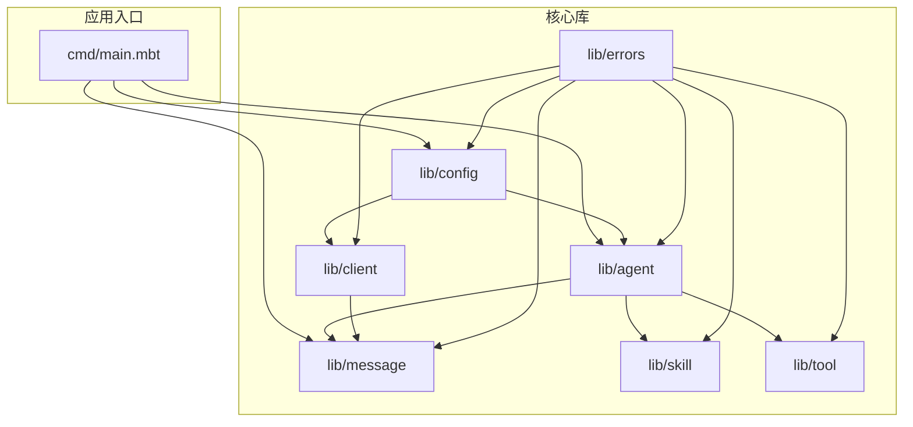
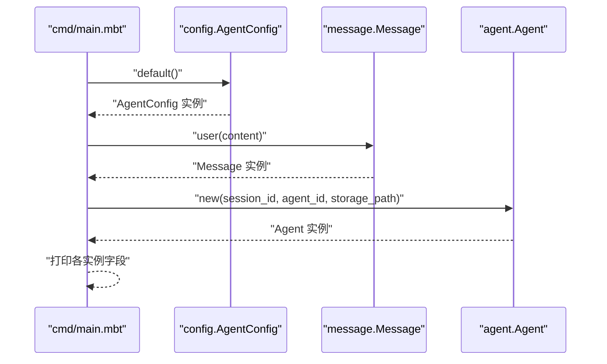
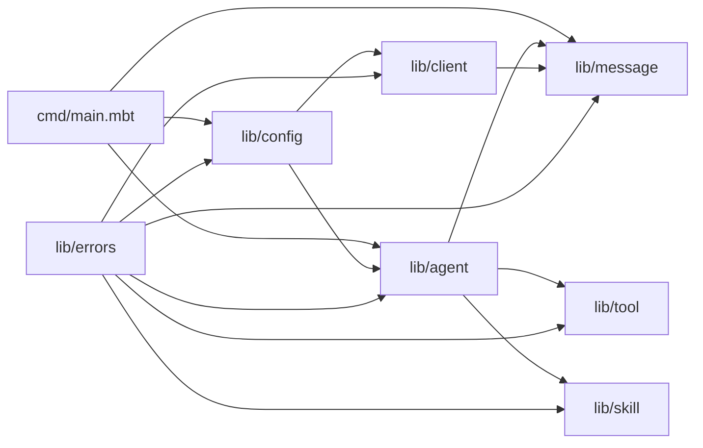

# API 参考

<cite>
**本文引用的文件**
- [README.md](file://README.md)
- [moon.mod.json](file://moon.mod.json)
- [cmd/main.mbt](file://cmd/main.mbt)
</cite>

## 目录
1. [简介](#简介)
2. [项目结构](#项目结构)
3. [核心组件](#核心组件)
4. [架构总览](#架构总览)
5. [详细组件分析](#详细组件分析)
6. [依赖分析](#依赖分析)
7. [性能考量](#性能考量)
8. [故障排查指南](#故障排查指南)
9. [结论](#结论)
10. [附录](#附录)

## 简介
本文件为 MBOpenClacky 的 API 参考文档，聚焦于当前已实现的核心类型与调用约定，帮助开发者快速查阅与深入理解系统设计。MBOpenClacky 是对开源项目 openclacky 的 MoonBit 重写，目标是在保留原项目核心能力（LLM 交互、Agent 对话循环、工具系统、技能系统、IM 渠道集成、CLI + Web UI）的同时，利用 MoonBit 的强类型、AOT 编译与统一异步原语，提升类型安全、性能与工程可维护性。

- 项目定位与目标：参见 [README.md:5-47](file://README.md#L5-L47)
- 重写动机与优势：参见 [README.md:49-82](file://README.md#L49-L82)
- 开发阶段路线（节选）：参见 [README.md:159-177](file://README.md#L159-L177)

章节来源
- [README.md:1-181](file://README.md#L1-L181)

## 项目结构
项目采用按领域划分的模块化组织，核心模块包括：
- cmd：可执行入口，负责最小化核心类型初始化演示
- lib/agent：Agent 核心（会话、状态、对话循环）
- lib/client：LLM API 客户端抽象
- lib/config：配置加载（TOML / 环境变量 / 路径）
- lib/errors：统一错误类型层次
- lib/message：消息与工具调用等核心数据类型
- lib/skill：技能系统（可扩展能力）
- lib/tool：工具系统（文件读写、Shell 等）

构建与运行建议：
- 目标后端：native（已在模块配置中声明）
- 安装与运行：参见 [README.md:110-158](file://README.md#L110-L158)

图表来源
- [cmd/main.mbt:1-27](file://cmd/main.mbt#L1-L27)
- [README.md:83-108](file://README.md#L83-L108)

章节来源
- [README.md:83-108](file://README.md#L83-L108)
- [moon.mod.json:1-16](file://moon.mod.json#L1-L16)

## 核心组件
本节概述当前已实现的核心类型与调用约定，便于快速查阅与集成。

- 配置类型
  - AgentConfig::default()：用于构造默认配置实例，包含最大 token 数与权限模式等字段
  - 使用示例：参见 [cmd/main.mbt:9-12](file://cmd/main.mbt#L9-L12)

- 消息类型
  - Message::user(content)：构造用户消息，包含角色与内容字段
  - 使用示例：参见 [cmd/main.mbt:14-17](file://cmd/main.mbt#L14-L17)

- Agent 类型
  - Agent::new(session_id, agent_id, storage_path)：构造 Agent 实例，包含会话 ID、状态与来源等字段
  - 使用示例：参见 [cmd/main.mbt:19-22](file://cmd/main.mbt#L19-L22)

- 字段与字符串化
  - 权限模式与状态等枚举值可通过 to_string_value() 转换为字符串表示
  - 使用示例：参见 [cmd/main.mbt:11-21](file://cmd/main.mbt#L11-L21)

章节来源
- [cmd/main.mbt:1-27](file://cmd/main.mbt#L1-L27)

## 架构总览
下图展示当前最小化演示流程中涉及的关键类型与调用关系，体现从配置、消息到 Agent 的组装过程。

图表来源
- [cmd/main.mbt:8-22](file://cmd/main.mbt#L8-L22)

## 详细组件分析

### 配置模块 API
- 类型名称：AgentConfig
- 关键字段（示例）
  - max_tokens：最大生成 token 数
  - permission_mode：权限模式（枚举）
- 方法
  - default()：返回默认配置实例
- 使用示例
  - 参见 [cmd/main.mbt:9-12](file://cmd/main.mbt#L9-L12)

章节来源
- [cmd/main.mbt:9-12](file://cmd/main.mbt#L9-L12)

### 消息模块 API
- 类型名称：Message
- 关键字段（示例）
  - role：消息角色（枚举）
  - content：消息内容
- 方法
  - user(content)：构造用户消息
- 使用示例
  - 参见 [cmd/main.mbt:14-17](file://cmd/main.mbt#L14-L17)

章节来源
- [cmd/main.mbt:14-17](file://cmd/main.mbt#L14-L17)

### Agent 模块 API
- 类型名称：Agent
- 关键字段（示例）
  - session_id：会话标识
  - status：Agent 状态（枚举）
  - source：来源（枚举）
- 方法
  - new(session_id, agent_id, storage_path)：构造新 Agent 实例
- 使用示例
  - 参见 [cmd/main.mbt:19-22](file://cmd/main.mbt#L19-L22)

章节来源
- [cmd/main.mbt:19-22](file://cmd/main.mbt#L19-L22)

### 错误处理与异常
- 错误层次
  - lib/errors 提供统一错误类型层次，用于承载各类错误场景
- 错误传播与处理
  - 建议结合 MoonBit 的 checked error handling 机制进行错误传播与处理
- 依赖与集成
  - 错误模块与各核心模块存在依赖关系，便于在 Agent、Client、Config、Message、Tool、Skill 等模块中统一错误处理

章节来源
- [README.md:96](file://README.md#L96)

### 数据模型与枚举
- 角色（Role）：消息角色（如 user）
- 权限模式（PermissionMode）：权限控制策略（如允许/限制）
- 状态（Status）：Agent 状态（如空闲/运行中）
- 来源（Source）：Agent 来源（如 CLI/Web）

上述枚举值可通过 to_string_value() 转换为字符串表示，便于日志与调试输出。

章节来源
- [cmd/main.mbt:11-21](file://cmd/main.mbt#L11-L21)

## 依赖分析
模块间依赖关系概览：
- cmd 依赖 config、message、agent 进行最小化演示
- agent 依赖 message、tool、skill 进行对话循环与能力扩展
- client 依赖 message 进行 LLM 请求与响应
- config 为 agent 与 client 提供配置支持
- errors 为所有模块提供统一错误处理

图表来源
- [cmd/main.mbt:1-27](file://cmd/main.mbt#L1-L27)
- [README.md:83-108](file://README.md#L83-L108)

章节来源
- [README.md:83-108](file://README.md#L83-L108)

## 性能考量
- AOT 编译到原生代码：相较 Ruby 解释执行，启动与运行延迟显著降低
- 更低内存占用：无 VM 与 GC 元数据负担，二进制可分发，部署更轻量
- 无需运行时：终端用户无需安装额外运行时，单一可执行文件即可运行
- 异步与并发：借助 moonbitlang/async 提供的统一异步原语，编写流式 LLM 响应处理与并发工具调用更直观

章节来源
- [README.md:58-76](file://README.md#L58-L76)

## 故障排查指南
- 类型安全与错误处理
  - 使用 Option[T] 替代 nil，避免空指针访问
  - 使用 checked error handling 机制进行错误传播与处理
- 日志与调试
  - 使用 to_string_value() 将枚举值转换为字符串，便于日志输出与问题定位
- 构建与运行
  - 确认 moon 工具链版本满足要求（见环境要求）
  - 使用 moon build 与 moon run 进行构建与运行

章节来源
- [README.md:110-158](file://README.md#L110-L158)
- [cmd/main.mbt:11-21](file://cmd/main.mbt#L11-L21)

## 结论
本参考文档基于当前已实现的核心类型与调用约定，提供了配置、消息、Agent 的 API 概览与使用示例，并梳理了模块间的依赖关系与错误处理策略。随着后续阶段推进（配置系统、HTTP 客户端、工具系统、Agent 核心、CLI/TUI/Web 界面、技能系统等），API 将逐步完善并扩展至完整的能力矩阵。

## 附录
- 版本与许可证
  - 当前版本：0.1.0
  - 许可证：MIT
  - 与上游项目保持兼容
- 开发阶段路线（节选）
  - Phase 0：项目脚手架 + 核心类型（已完成）
  - Phase 1：配置系统（TOML / 环境变量 / 路径）
  - Phase 2：HTTP 客户端 + LLM API（含 SSE 流式）
  - Phase 3：工具系统（Tool trait + 内置工具）
  - Phase 4：Agent 核心（对话循环、工具调用、成本追踪）
  - Phase 5：CLI 界面（基于 clap）
  - Phase 6：TUI 界面（基于 onebit-tui）
  - Phase 7：Web 服务器（基于 crescent，含 WebSocket / SSE）
  - Phase 8：技能系统
  - Phase 9：文件 / 文档 / 图像处理
  - Phase 10：数据持久化（SQLite + 加密）
  - Phase 11：集成测试与性能优化

章节来源
- [README.md:159-177](file://README.md#L159-L177)