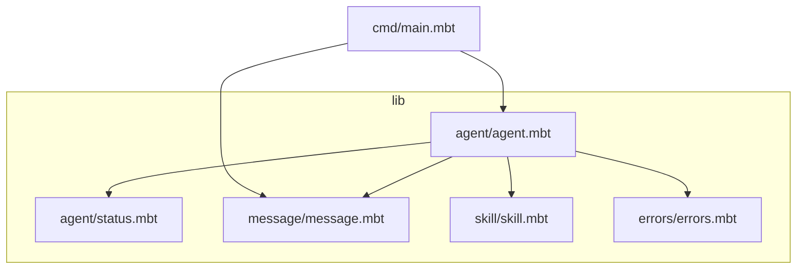
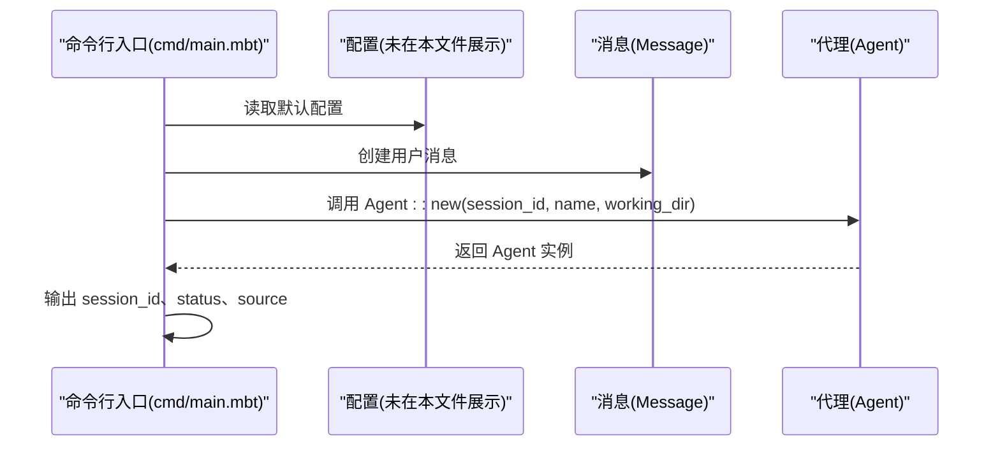
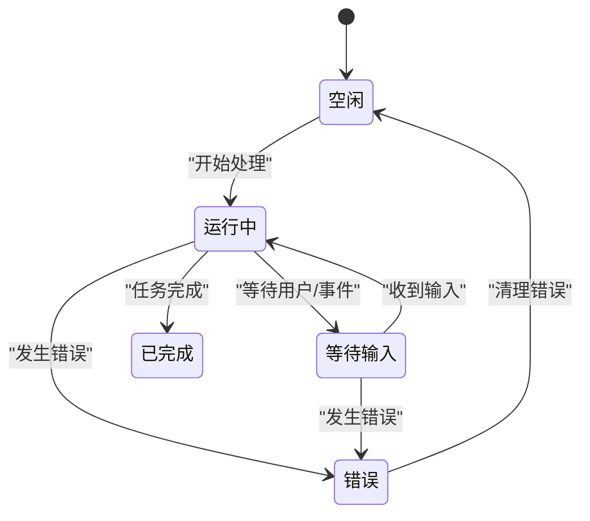
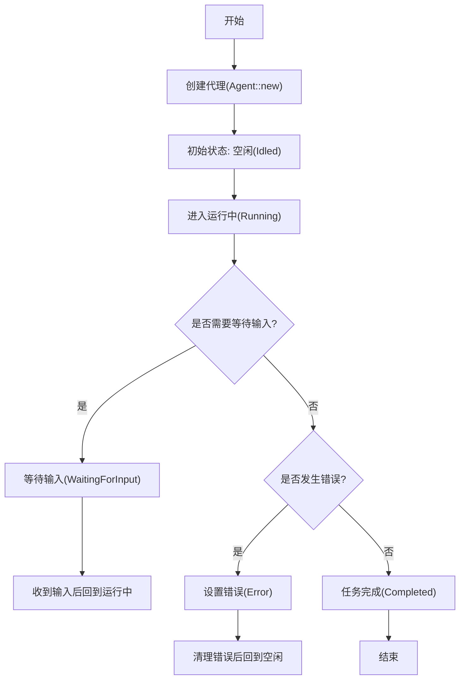
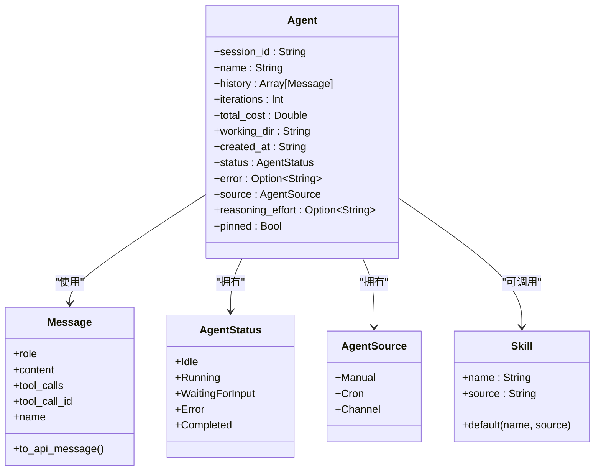
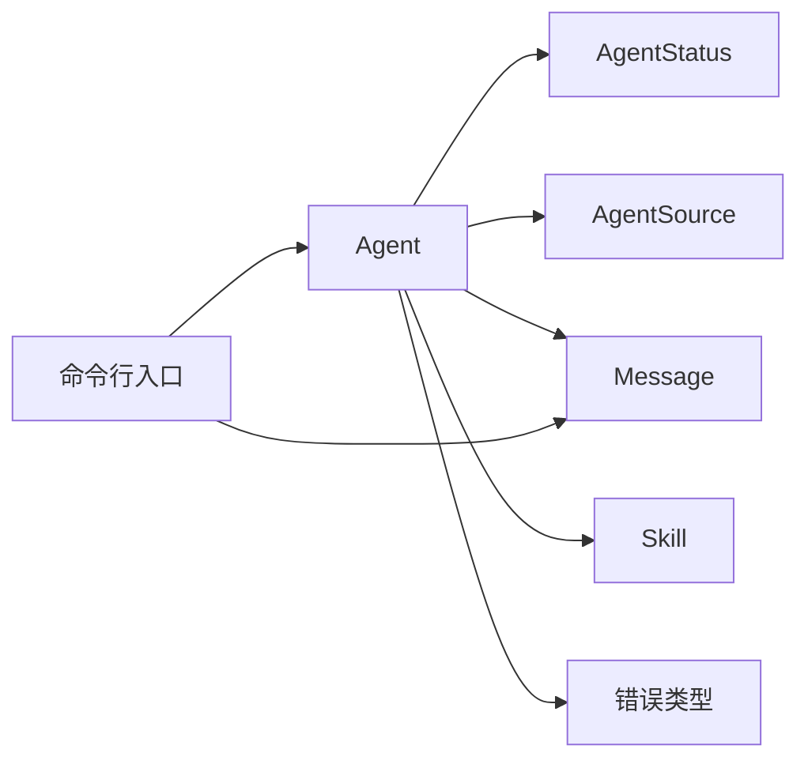

# 代理 API

<cite>
**本文引用的文件**
- [lib/agent/agent.mbt](file://lib/agent/agent.mbt)
- [lib/agent/status.mbt](file://lib/agent/status.mbt)
- [lib/message/message.mbt](file://lib/message/message.mbt)
- [lib/skill/skill.mbt](file://lib/skill/skill.mbt)
- [lib/errors/errors.mbt](file://lib/errors/errors.mbt)
- [cmd/main.mbt](file://cmd/main.mbt)
- [README.md](file://README.md)
</cite>

## 目录
1. [简介](#简介)
2. [项目结构](#项目结构)
3. [核心组件](#核心组件)
4. [架构总览](#架构总览)
5. [详细组件分析](#详细组件分析)
6. [依赖分析](#依赖分析)
7. [性能考量](#性能考量)
8. [故障排查指南](#故障排查指南)
9. [结论](#结论)
10. [附录](#附录)

## 简介
本文件为代理系统（Agent）的详细 API 参考文档，聚焦于 Agent 结构体的字段定义、类型说明与用途，Agent::new() 构造函数的参数、返回值与使用示例，以及代理的状态管理机制（AgentStatus 枚举与 AgentSource 枚举）。同时，结合消息、技能与错误类型，给出代理生命周期管理（会话创建、状态更新、销毁）的建议流程、最佳实践与常见使用模式，并覆盖错误处理与异常情况说明。

## 项目结构
代理系统位于 lib/agent 子目录，配合消息、技能与错误类型模块协同工作。命令行入口 cmd/main.mbt 展示了核心类型的最小化演示，包括默认配置、用户消息与 Agent 实例的构造与打印。

图表来源
- [lib/agent/agent.mbt](file://lib/agent/agent.mbt)
- [lib/agent/status.mbt](file://lib/agent/status.mbt)
- [lib/message/message.mbt](file://lib/message/message.mbt)
- [lib/skill/skill.mbt](file://lib/skill/skill.mbt)
- [lib/errors/errors.mbt](file://lib/errors/errors.mbt)
- [cmd/main.mbt](file://cmd/main.mbt)

章节来源
- [README.md](file://README.md)
- [cmd/main.mbt](file://cmd/main.mbt)

## 核心组件
本节从 API 参考角度，系统梳理 Agent 结构体、AgentStatus/AgentSource 枚举、消息与错误类型的关键字段与行为，帮助快速掌握代理系统的核心概念与使用方式。

- Agent 结构体
  - 字段与类型
    - session_id: 字符串，会话标识
    - name: 字符串，代理名称
    - history: 消息数组，用于保存对话历史
    - iterations: 整数，迭代计数
    - total_cost: 浮点数，累计成本
    - working_dir: 字符串，工作目录
    - created_at: 字符串，创建时间戳
    - status: 状态枚举（AgentStatus）
    - error: 可选字符串，错误信息
    - source: 来源枚举（AgentSource）
    - reasoning_effort: 可选字符串，推理强度
    - pinned: 布尔值，是否固定
  - 行为
    - 提供默认初始化，便于快速创建代理实例
    - 与消息、技能、错误类型配合，支撑对话循环与工具调用

- AgentStatus 枚举
  - Idle: 空闲
  - Running: 运行中
  - WaitingForInput: 等待输入
  - Error: 错误
  - Completed: 已完成
  - JSON 序列化：提供 to_string_value 将枚举映射为小写字符串，便于序列化

- AgentSource 枚举
  - Manual: 手动触发
  - Cron: 定时任务触发
  - Channel: 通道触发
  - JSON 序列化：提供 to_string_value 将枚举映射为小写字符串

- 消息类型 Message
  - 角色与内容：role、content（支持纯文本或内容块）
  - 工具调用：tool_calls、tool_call_id
  - 名称与内部字段：name、task_id、created_at、system_injected、memory_update、subagent_instructions、subagent_result、token_usage、compressed_summary、transient
  - API 转换：to_api_message 用于剥离内部字段，仅保留发送给 API 的核心字段

- 技能类型 Skill
  - 能力元数据：name、name_zh、description、description_zh、disable_model_invocation、user_invocable、allowed_tools、context、agent_type、argument_hint、hooks、fork_agent、model、forbidden_tools、auto_summarize、source、directory
  - 默认工厂：default(name, source) 提供合理默认值

- 错误类型
  - AgentInterrupted: 用户或系统中断
  - AgentError: 代理相关基础错误
  - BadRequestError: LLM API 400 级错误
  - ToolCallError: 工具执行错误
  - BrowserNotReachableError: 浏览器调试端口不可达
  - RetryableError: 可重试错误（5xx、限流等）
  - UpstreamTruncatedError: 上游 API 返回的 tool_calls 参数截断/无法解析
  - 辅助判断函数：is_agent_error、is_retryable_error

章节来源
- [lib/agent/agent.mbt](file://lib/agent/agent.mbt)
- [lib/agent/status.mbt](file://lib/agent/status.mbt)
- [lib/message/message.mbt](file://lib/message/message.mbt)
- [lib/skill/skill.mbt](file://lib/skill/skill.mbt)
- [lib/errors/errors.mbt](file://lib/errors/errors.mbt)

## 架构总览
下图展示了代理系统在运行时的高层交互：命令行入口创建配置与消息，随后创建 Agent 并输出其状态与来源信息。Agent 与消息、技能、错误类型协同，支撑后续的对话循环与工具调用。

图表来源
- [cmd/main.mbt](file://cmd/main.mbt)
- [lib/agent/agent.mbt](file://lib/agent/agent.mbt)
- [lib/message/message.mbt](file://lib/message/message.mbt)

## 详细组件分析

### Agent 结构体与构造函数
- 字段定义与用途
  - session_id: 会话唯一标识，用于区分不同对话
  - name: 代理名称，便于识别与日志输出
  - history: 存放对话历史消息，支持后续检索与上下文拼接
  - iterations: 迭代次数，可用于控制循环与成本追踪
  - total_cost: 累计成本，便于预算控制与审计
  - working_dir: 工作目录，用于工具执行与文件操作
  - created_at: 创建时间，便于排序与统计
  - status: 当前状态，驱动生命周期流转
  - error: 错误信息，承载异常详情
  - source: 触发来源，便于审计与策略差异
  - reasoning_effort: 推理强度，可选配置
  - pinned: 是否固定，便于 UI 或调度层管理
- Agent::new() 构造函数
  - 参数
    - session_id: 字符串
    - name: 字符串
    - working_dir: 字符串
  - 返回值
    - Agent 实例，字段已设置默认值（如空历史、空错误、空推理强度、非固定等）
  - 使用示例
    - 参考命令行入口中的示例：创建会话、代理与消息，并输出状态与来源
      - 示例路径：[cmd/main.mbt](file://cmd/main.mbt)

章节来源
- [lib/agent/agent.mbt](file://lib/agent/agent.mbt)
- [cmd/main.mbt](file://cmd/main.mbt)

### 状态管理机制：AgentStatus 与 AgentSource
- AgentStatus 枚举
  - Idle: 初始或空闲状态
  - Running: 正在处理请求
  - WaitingForInput: 等待用户输入或外部事件
  - Error: 发生错误
  - Completed: 成功完成
  - JSON 序列化：to_string_value 将枚举映射为小写字符串，便于序列化
- AgentSource 枚举
  - Manual: 手动触发
  - Cron: 定时任务触发
  - Channel: 通道触发
  - JSON 序列化：to_string_value 将枚举映射为小写字符串，便于序列化
- 状态转换条件（基于现有类型定义）
  - 从 Idle 到 Running：开始处理请求
  - 从 Running 到 WaitingForInput：等待用户输入或外部事件
  - 从 WaitingForInput 到 Running：收到输入后恢复处理
  - 从 Running/WaitingForInput 到 Error：发生错误
  - 从 Error 到 Idle：清理错误后回到空闲
  - 从 Running 到 Completed：成功完成任务
  - 注意：以上为基于类型定义的常见转换逻辑，具体实现需结合业务流程与调用方逻辑

图表来源
- [lib/agent/status.mbt](file://lib/agent/status.mbt)

章节来源
- [lib/agent/status.mbt](file://lib/agent/status.mbt)

### 生命周期管理：会话创建、状态更新与销毁
- 会话创建
  - 使用 Agent::new(session_id, name, working_dir) 初始化代理
  - 设置初始状态为 Idle，来源为 Manual（默认）
  - 准备工作目录与历史数组
- 状态更新
  - 根据业务流程在 Running、WaitingForInput、Error、Completed 间切换
  - 更新 total_cost 与 iterations 以进行成本与迭代控制
  - 在 Error 时设置 error 字段，便于诊断
- 销毁
  - 销毁时机取决于具体应用：如会话结束、错误恢复或手动终止
  - 销毁前建议清理工作目录与历史，释放资源

图表来源
- [lib/agent/agent.mbt](file://lib/agent/agent.mbt)
- [lib/agent/status.mbt](file://lib/agent/status.mbt)

章节来源
- [lib/agent/agent.mbt](file://lib/agent/agent.mbt)
- [lib/agent/status.mbt](file://lib/agent/status.mbt)

### 与消息、技能、错误的协作
- 消息协作
  - 使用 Message::user/assistant/system/tool_result 构造消息
  - 使用 Message::to_api_message 剥离内部字段，仅保留发送给 API 的核心字段
- 技能协作
  - 使用 Skill::default(name, source) 创建技能，默认具备合理的可调用性与上下文
- 错误协作
  - 使用 is_agent_error 与 is_retryable_error 判断错误类型
  - 根据错误类型决定重试、降级或终止

图表来源
- [lib/agent/agent.mbt](file://lib/agent/agent.mbt)
- [lib/message/message.mbt](file://lib/message/message.mbt)
- [lib/skill/skill.mbt](file://lib/skill/skill.mbt)
- [lib/agent/status.mbt](file://lib/agent/status.mbt)

章节来源
- [lib/message/message.mbt](file://lib/message/message.mbt)
- [lib/skill/skill.mbt](file://lib/skill/skill.mbt)
- [lib/agent/agent.mbt](file://lib/agent/agent.mbt)
- [lib/agent/status.mbt](file://lib/agent/status.mbt)

### 使用示例与最佳实践
- 使用示例
  - 参考命令行入口中的示例：创建默认配置、用户消息与代理实例，并输出 session_id、status、source
    - 示例路径：[cmd/main.mbt](file://cmd/main.mbt)
- 最佳实践
  - 会话管理
    - 为每个会话分配唯一 session_id，便于日志与审计
    - 使用 working_dir 作为工具执行的沙箱目录
  - 状态管理
    - 在进入长时间等待时及时切换到 WaitingForInput，避免阻塞
    - 发生错误时设置 error 字段并转为 Error 状态，便于上层处理
  - 成本与迭代控制
    - 使用 iterations 与 total_cost 控制最大迭代次数与预算
  - 消息与工具
    - 使用 Message::to_api_message 剥离内部字段，减少 API 调用开销
    - 使用 Skill::default 快速创建可调用的技能

章节来源
- [cmd/main.mbt](file://cmd/main.mbt)
- [lib/message/message.mbt](file://lib/message/message.mbt)
- [lib/skill/skill.mbt](file://lib/skill/skill.mbt)
- [lib/agent/agent.mbt](file://lib/agent/agent.mbt)

## 依赖分析
- 组件耦合
  - Agent 依赖 AgentStatus 与 AgentSource 以表达状态与来源
  - Agent 依赖 Message 以管理对话历史
  - Agent 与 Skill 协作以扩展能力
  - Agent 与错误类型协作以处理异常
- 外部依赖
  - 命令行入口依赖配置、消息与代理类型进行最小化演示

图表来源
- [lib/agent/agent.mbt](file://lib/agent/agent.mbt)
- [lib/agent/status.mbt](file://lib/agent/status.mbt)
- [lib/message/message.mbt](file://lib/message/message.mbt)
- [lib/skill/skill.mbt](file://lib/skill/skill.mbt)
- [lib/errors/errors.mbt](file://lib/errors/errors.mbt)
- [cmd/main.mbt](file://cmd/main.mbt)

章节来源
- [lib/agent/agent.mbt](file://lib/agent/agent.mbt)
- [lib/agent/status.mbt](file://lib/agent/status.mbt)
- [lib/message/message.mbt](file://lib/message/message.mbt)
- [lib/skill/skill.mbt](file://lib/skill/skill.mbt)
- [lib/errors/errors.mbt](file://lib/errors/errors.mbt)
- [cmd/main.mbt](file://cmd/main.mbt)

## 性能考量
- 类型安全与运行时开销
  - 使用静态强类型与 Option/Result 等代数数据类型，减少运行时错误与分支开销
- 序列化与网络传输
  - AgentStatus 与 AgentSource 提供 to_string_value，便于高效序列化为 JSON 字符串
- 成本控制
  - 通过 total_cost 与 iterations 控制成本与迭代上限，避免过度调用

## 故障排查指南
- 常见错误类型
  - AgentError: 代理相关基础错误
  - BadRequestError: LLM API 400 级错误
  - ToolCallError: 工具执行错误
  - BrowserNotReachableError: 浏览器调试端口不可达
  - RetryableError: 可重试错误（5xx、限流等）
  - UpstreamTruncatedError: 上游 API 返回的 tool_calls 参数截断/无法解析
- 判断与处理
  - 使用 is_agent_error 判断是否为代理相关错误
  - 使用 is_retryable_error 判断是否可重试
  - 在 Error 状态下设置 error 字段，便于定位问题

章节来源
- [lib/errors/errors.mbt](file://lib/errors/errors.mbt)

## 结论
本文围绕代理系统的核心类型与 API，系统梳理了 Agent 结构体字段、Agent::new() 构造函数、状态管理机制（AgentStatus 与 AgentSource）、与消息/技能/错误类型的协作关系，并给出了生命周期管理、最佳实践与故障排查建议。这些内容有助于开发者在实际应用中正确使用代理系统，构建稳定、可观测且可扩展的 AI Agent。

## 附录
- 相关文件路径
  - 代理核心：[lib/agent/agent.mbt](file://lib/agent/agent.mbt)
  - 状态与来源：[lib/agent/status.mbt](file://lib/agent/status.mbt)
  - 消息类型：[lib/message/message.mbt](file://lib/message/message.mbt)
  - 技能类型：[lib/skill/skill.mbt](file://lib/skill/skill.mbt)
  - 错误类型：[lib/errors/errors.mbt](file://lib/errors/errors.mbt)
  - 命令行入口示例：[cmd/main.mbt](file://cmd/main.mbt)
  - 项目说明：[README.md](file://README.md)