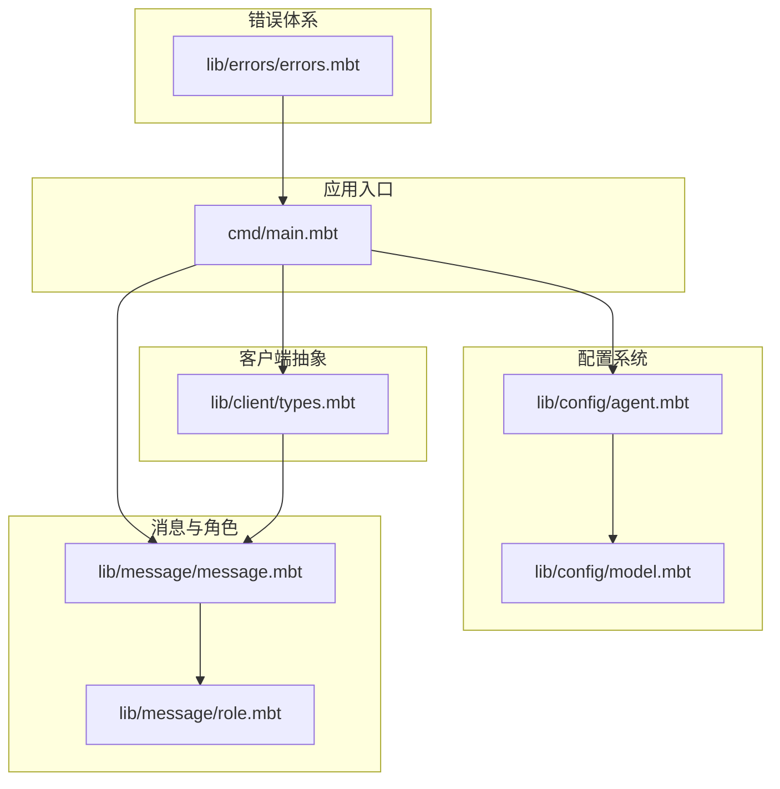
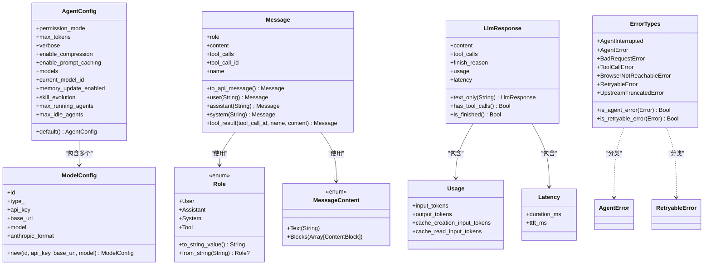
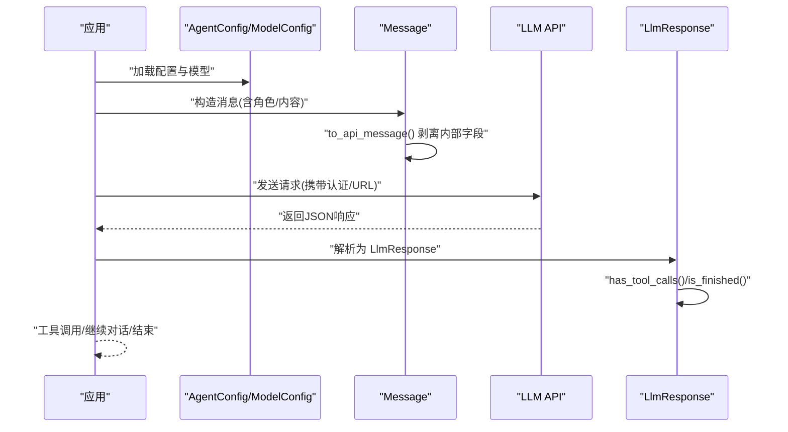
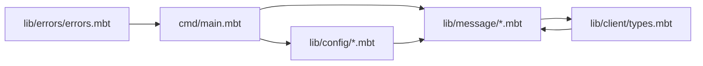

# 客户端 API

<cite>
**本文引用的文件**
- [README.md](file://README.md)
- [moon.mod.json](file://moon.mod.json)
- [cmd/main.mbt](file://cmd/main.mbt)
- [lib/client/types.mbt](file://lib/client/types.mbt)
- [lib/config/agent.mbt](file://lib/config/agent.mbt)
- [lib/config/model.mbt](file://lib/config/model.mbt)
- [lib/message/message.mbt](file://lib/message/message.mbt)
- [lib/message/role.mbt](file://lib/message/role.mbt)
- [lib/errors/errors.mbt](file://lib/errors/errors.mbt)
</cite>

## 目录
1. [简介](#简介)
2. [项目结构](#项目结构)
3. [核心组件](#核心组件)
4. [架构总览](#架构总览)
5. [详细组件分析](#详细组件分析)
6. [依赖分析](#依赖分析)
7. [性能考量](#性能考量)
8. [故障排查指南](#故障排查指南)
9. [结论](#结论)
10. [附录](#附录)

## 简介
本文件为 MBOpenClacky 项目的“客户端 API”参考文档，聚焦 LLM 客户端的核心接口与数据类型定义，覆盖初始化、配置参数、连接管理、请求发送与响应处理流程、错误处理与重试策略、使用统计与性能监控相关 API、异步调用与并发处理要点，以及扩展与定制指导。  
项目采用 MoonBit 语言，强调类型安全、可维护性与工程化，客户端抽象以结构体与枚举为核心，配合统一的错误类型体系与可序列化数据模型，便于对接多 LLM 后端。

## 项目结构
- 顶层模块与依赖：模块名为 hnlyxiaobing/MBOpenClacky，声明了 moonbitlang/x、moonbitlang/async、bobzhang/toml、TheWaWaR/clap 等依赖，目标平台为 native。
- 可执行入口：cmd/main.mbt 展示了默认配置、消息与 Agent 的最小化构造示例，用于验证核心类型可用性。
- 客户端与配置：lib/client/types.mbt 定义了 LLM 响应与指标类型；lib/config 下的 agent.mbt 与 model.mbt 定义了 Agent 与模型端点配置。
- 消息与角色：lib/message/message.mbt 与 role.mbt 定义了消息内容、角色与序列化行为。
- 错误体系：lib/errors/errors.mbt 定义了统一的错误类型与判断函数，支持区分可重试与非可重试错误。

**图表来源**
- [cmd/main.mbt:1-27](file://cmd/main.mbt#L1-L27)
- [lib/client/types.mbt:1-57](file://lib/client/types.mbt#L1-L57)
- [lib/config/agent.mbt:1-34](file://lib/config/agent.mbt#L1-L34)
- [lib/config/model.mbt:1-22](file://lib/config/model.mbt#L1-L22)
- [lib/message/message.mbt:1-165](file://lib/message/message.mbt#L1-L165)
- [lib/message/role.mbt:1-53](file://lib/message/role.mbt#L1-L53)
- [lib/errors/errors.mbt:1-80](file://lib/errors/errors.mbt#L1-L80)

**章节来源**
- [README.md:83-108](file://README.md#L83-L108)
- [moon.mod.json:1-16](file://moon.mod.json#L1-L16)
- [cmd/main.mbt:1-27](file://cmd/main.mbt#L1-L27)

## 核心组件
- LLM 响应与指标类型
  - Usage：输入/输出/缓存创建/缓存读取的 token 统计。
  - Latency：总耗时与首字时间（可空）。
  - LlmResponse：包含文本内容、工具调用、结束原因、Usage、Latency；提供 text_only 快捷构造与 has_tool_calls/is_finished 判断。
- 配置类型
  - AgentConfig：权限模式、最大 token、日志开关、压缩与提示缓存开关、模型列表、当前模型 ID、内存更新开关、技能演化、并发上限等。
  - ModelConfig：模型端点标识、类型、API Key、Base URL、模型名、Anthropic 格式开关。
- 消息与角色
  - MessageContent：纯文本或内容块数组；Message：核心字段（role/content/tool_*）与内部字段（task_id/created_at/system_injected/...）；提供 user/assistant/system/tool_result 构造器与 to_api_message 剥离内部字段。
  - Role：User/Assistant/System/Tool，支持字符串互转与 JSON 序列化/反序列化。
- 错误类型
  - AgentInterrupted、AgentError、BadRequestError、ToolCallError、BrowserNotReachableError、RetryableError、UpstreamTruncatedError；提供 is_agent_error 与 is_retryable_error 判断。

**章节来源**
- [lib/client/types.mbt:1-57](file://lib/client/types.mbt#L1-L57)
- [lib/config/agent.mbt:1-34](file://lib/config/agent.mbt#L1-L34)
- [lib/config/model.mbt:1-22](file://lib/config/model.mbt#L1-L22)
- [lib/message/message.mbt:1-165](file://lib/message/message.mbt#L1-L165)
- [lib/message/role.mbt:1-53](file://lib/message/role.mbt#L1-L53)
- [lib/errors/errors.mbt:1-80](file://lib/errors/errors.mbt#L1-L80)

## 架构总览
下图展示了从应用入口到配置、消息、响应与错误类型的总体关系，体现客户端抽象层的数据模型与职责边界。

**图表来源**
- [lib/config/agent.mbt:1-34](file://lib/config/agent.mbt#L1-L34)
- [lib/config/model.mbt:1-22](file://lib/config/model.mbt#L1-L22)
- [lib/message/role.mbt:1-53](file://lib/message/role.mbt#L1-L53)
- [lib/message/message.mbt:1-165](file://lib/message/message.mbt#L1-L165)
- [lib/client/types.mbt:1-57](file://lib/client/types.mbt#L1-L57)
- [lib/errors/errors.mbt:1-80](file://lib/errors/errors.mbt#L1-L80)

## 详细组件分析

### LLM 响应与指标类型 API
- Usage
  - 字段：输入/输出/缓存创建/缓存读取 token 数。
  - 用途：用于统计与成本追踪。
- Latency
  - 字段：总耗时与首字时间（可空）。
  - 用途：性能监控与用户体验评估。
- LlmResponse
  - 字段：content/tool_calls/finish_reason/usage/latency。
  - 方法：text_only 快速构造纯文本响应；has_tool_calls 判断是否存在工具调用；is_finished 判断对话是否结束（依据结束原因）。
- 设计要点
  - 所有字段均为可空或集合，便于兼容不同后端返回差异。
  - derive(ToJson/FromJson) 支持序列化，便于日志与上报。

**章节来源**
- [lib/client/types.mbt:1-57](file://lib/client/types.mbt#L1-L57)

### 配置系统 API
- AgentConfig
  - 关键字段：权限模式、最大 token、日志开关、压缩与提示缓存开关、模型列表、当前模型 ID、内存更新开关、技能演化、并发上限等。
  - default() 提供合理默认值，便于快速初始化。
- ModelConfig
  - 关键字段：id/type_/api_key/base_url/model/anthropic_format。
  - new(...) 快速构造标准模型端点配置。
- 设计要点
  - 通过数组模型列表支持多后端切换。
  - anthropic_format 用于适配特定后端格式。

**章节来源**
- [lib/config/agent.mbt:1-34](file://lib/config/agent.mbt#L1-L34)
- [lib/config/model.mbt:1-22](file://lib/config/model.mbt#L1-L22)

### 消息与角色 API
- MessageContent
  - 枚举：Text 或 Blocks，支持 JSON 序列化。
- Message
  - 核心字段：role/content/tool_*；内部字段：task_id/created_at/system_injected/...。
  - 工具函数：user/assistant/system/tool_result 快速构造；to_api_message 剥离内部字段，确保仅发送对外 API 的必要字段。
- Role
  - 枚举：User/Assistant/System/Tool；提供字符串互转与 JSON 序列化/反序列化。
- 设计要点
  - 内部字段与对外字段分离，保证 API 请求的简洁与安全。
  - 角色与内容的序列化与解析逻辑明确，便于跨后端一致性。

**章节来源**
- [lib/message/message.mbt:1-165](file://lib/message/message.mbt#L1-L165)
- [lib/message/role.mbt:1-53](file://lib/message/role.mbt#L1-L53)

### 错误处理与重试策略
- 错误类型
  - AgentInterrupted、AgentError、BadRequestError、ToolCallError、BrowserNotReachableError、RetryableError、UpstreamTruncatedError。
- 判断函数
  - is_agent_error：识别代理相关错误（含 BadRequestError、ToolCallError、BrowserNotReachableError）。
  - is_retryable_error：识别可重试错误（含 RetryableError、UpstreamTruncatedError）。
- 设计要点
  - 将中断、业务错误与网络/上游错误分层，便于上层策略控制。
  - 可重试错误明确，利于实现指数退避与熔断策略。

**章节来源**
- [lib/errors/errors.mbt:1-80](file://lib/errors/errors.mbt#L1-L80)

### 初始化与配置参数
- 初始化步骤建议
  - 读取配置：优先 TOML 文件，其次环境变量，最后回退默认值。
  - 构造 AgentConfig.default() 并根据需要覆盖字段。
  - 选择当前模型：从 models 中挑选匹配 id 的 ModelConfig。
  - 准备消息：使用 Message.user/assistant/system/tool_result 构造对话轮次。
- 参数说明
  - 权限模式：决定交互策略（如 ConfirmSafes）。
  - 最大 token：限制上下文长度与生成长度。
  - 日志开关：控制详细输出。
  - 压缩与提示缓存：影响性能与成本。
  - 并发上限：控制多 Agent 并发度。
  - Anthropic 格式：当后端为 Anthropic 时启用相应格式适配。

**章节来源**
- [lib/config/agent.mbt:1-34](file://lib/config/agent.mbt#L1-L34)
- [lib/config/model.mbt:1-22](file://lib/config/model.mbt#L1-L22)
- [lib/message/message.mbt:1-165](file://lib/message/message.mbt#L1-L165)

### 请求发送与响应处理流程
- 发送流程
  - 将 Message.to_api_message() 序列化为 JSON，携带必要的头部与认证信息（api_key/base_url）。
  - 发起 HTTP 请求（可结合 moonbitlang/async 的异步原语）。
- 响应处理
  - 解析为 LlmResponse；若包含 tool_calls，则进入工具调用阶段；否则直接消费 content。
  - 更新 Usage/Latency 以进行统计与监控。
  - 使用 is_finished 判断对话是否结束。
- 设计要点
  - 结果对象统一，便于上层编排工具调用与对话循环。

**图表来源**
- [lib/config/agent.mbt:1-34](file://lib/config/agent.mbt#L1-L34)
- [lib/config/model.mbt:1-22](file://lib/config/model.mbt#L1-L22)
- [lib/message/message.mbt:1-165](file://lib/message/message.mbt#L1-L165)
- [lib/client/types.mbt:1-57](file://lib/client/types.mbt#L1-L57)

### 不同 LLM 服务的集成示例与适配方法
- OpenAI 兼容
  - base_url 指向 OpenAI 兼容端点；api_key 为 OpenAI 密钥；model 为具体模型名。
  - anthropic_format=false。
- Anthropic
  - anthropic_format=true，按 Anthropic 协议调整消息与响应格式。
- 其他服务
  - 通过新增 ModelConfig 实例接入；在 AgentConfig.models 中注册；运行时按 id 选择。
- 注意事项
  - 不同服务的 Usage/Latency 字段可能不完全一致，需在解析时做兼容处理。
  - 工具调用格式差异需在消息序列化/反序列化阶段统一。

**章节来源**
- [lib/config/model.mbt:1-22](file://lib/config/model.mbt#L1-L22)
- [lib/message/message.mbt:1-165](file://lib/message/message.mbt#L1-L165)

### 异步调用与并发处理
- 异步原语
  - 项目依赖 moonbitlang/async，可用于 HTTP、WebSocket、进程等异步操作。
- 并发建议
  - 使用 async 并发发送多个请求，但需受 AgentConfig.max_running_agents/max_idle_agents 限制。
  - 对工具调用与 LLM 请求分别管理并发度，避免阻塞。
- 流式响应
  - 可结合 SSE/流式读取进行增量处理，结合 Usage/Latency 的增量更新。

**章节来源**
- [moon.mod.json:1-16](file://moon.mod.json#L1-L16)
- [lib/config/agent.mbt:1-34](file://lib/config/agent.mbt#L1-L34)

### 使用统计与性能监控 API
- 统计字段
  - Usage：input_tokens/output_tokens/cache_*。
  - Latency：duration_ms/ttft_ms。
- 上报建议
  - 在每次请求后汇总 Usage/Latency，周期性上报或在结束时统一上报。
  - 可结合 JSON 序列化便于日志与观测系统采集。

**章节来源**
- [lib/client/types.mbt:1-57](file://lib/client/types.mbt#L1-L57)

### 错误处理机制与重试策略
- 分层处理
  - is_agent_error：捕获业务相关错误，通常需要用户干预或策略调整。
  - is_retryable_error：捕获可重试错误（如 5xx、限流、上游截断），可采用指数退避与熔断。
- 实施建议
  - 对于 BadRequestError/ToolCallError：记录上下文并终止当前尝试。
  - 对于 RetryableError/UpstreamTruncatedError：指数退避重试，设置最大重试次数与超时。
  - 对于 AgentInterrupted/BrowserNotReachableError：根据场景决定是否重试或降级。

**章节来源**
- [lib/errors/errors.mbt:1-80](file://lib/errors/errors.mbt#L1-L80)

### 客户端扩展与自定义指导
- 新增模型后端
  - 定义新的 ModelConfig 实例，设置 id/type_/api_key/base_url/model/anthropic_format。
  - 在 AgentConfig.models 中注册；运行时按 id 选择。
- 自定义消息格式
  - 若后端需要特殊字段，可在 Message 内部保留字段并在 to_api_message 中按需剥离。
- 自定义错误类型
  - 可在现有错误体系基础上扩展，保持 is_agent_error/is_retryable_error 的判断逻辑一致。
- 配置扩展
  - 在 AgentConfig 中增加新字段（如 per-model 超时、采样策略等），并通过默认值与环境变量覆盖实现灵活配置。

**章节来源**
- [lib/config/agent.mbt:1-34](file://lib/config/agent.mbt#L1-L34)
- [lib/config/model.mbt:1-22](file://lib/config/model.mbt#L1-L22)
- [lib/message/message.mbt:1-165](file://lib/message/message.mbt#L1-L165)
- [lib/errors/errors.mbt:1-80](file://lib/errors/errors.mbt#L1-L80)

## 依赖分析
- 模块依赖
  - cmd/main.mbt 依赖 config 与 message 类型进行最小化演示。
  - client/types.mbt 依赖 message 类型以承载工具调用与内容。
  - config 与 message 依赖 errors 类型以表达错误与异常。
- 外部依赖
  - moonbitlang/async：提供异步原语，支撑并发与流式处理。
  - bobzhang/toml：配置加载。
  - TheWaWaR/clap：CLI 参数解析。

**图表来源**
- [cmd/main.mbt:1-27](file://cmd/main.mbt#L1-L27)
- [lib/config/agent.mbt:1-34](file://lib/config/agent.mbt#L1-L34)
- [lib/config/model.mbt:1-22](file://lib/config/model.mbt#L1-L22)
- [lib/message/message.mbt:1-165](file://lib/message/message.mbt#L1-L165)
- [lib/client/types.mbt:1-57](file://lib/client/types.mbt#L1-L57)
- [lib/errors/errors.mbt:1-80](file://lib/errors/errors.mbt#L1-L80)

**章节来源**
- [moon.mod.json:1-16](file://moon.mod.json#L1-L16)

## 性能考量
- 启用压缩与提示缓存：减少传输与上下文开销。
- 控制并发：通过 AgentConfig.max_running_agents/max_idle_agents 限制同时运行的 Agent 数量。
- 使用 Usage/Latency：持续监控成本与延迟，动态调整采样与上下文长度。
- 异步与流式：利用 moonbitlang/async 降低等待时间，提升吞吐。

## 故障排查指南
- 常见错误定位
  - is_agent_error：确认是否为业务相关错误，检查消息构造与工具调用。
  - is_retryable_error：确认是否为网络/上游错误，检查重试策略与超时设置。
- 配置校验
  - 确认 api_key/base_url/model/id 是否正确；Anthropic 格式是否与后端一致。
- 日志与观测
  - 打印 LlmResponse 的 Usage/Latency 与 finish_reason，辅助定位问题。

**章节来源**
- [lib/errors/errors.mbt:1-80](file://lib/errors/errors.mbt#L1-L80)
- [lib/client/types.mbt:1-57](file://lib/client/types.mbt#L1-L57)

## 结论
本客户端 API 以结构化数据模型为核心，结合统一错误类型与可序列化响应，提供了跨 LLM 后端的抽象与扩展能力。通过合理的配置、异步并发与统计监控，可在保证类型安全与可维护性的前提下，高效地完成 LLM 交互与工具编排任务。

## 附录
- 示例入口：cmd/main.mbt 展示了默认配置、消息与 Agent 的最小化构造，可作为新用户的快速入门示例。
- 依赖清单：moon.mod.json 中声明了 async、toml、clap 等依赖，建议在开发与运行环境中保持一致版本。

**章节来源**
- [cmd/main.mbt:1-27](file://cmd/main.mbt#L1-L27)
- [moon.mod.json:1-16](file://moon.mod.json#L1-L16)