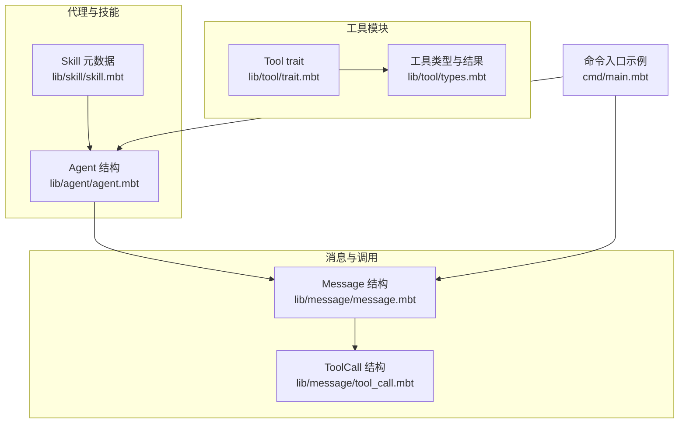
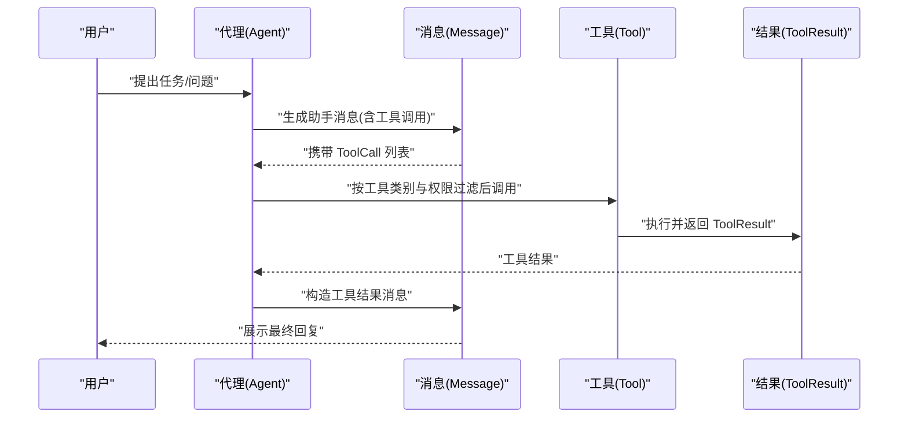
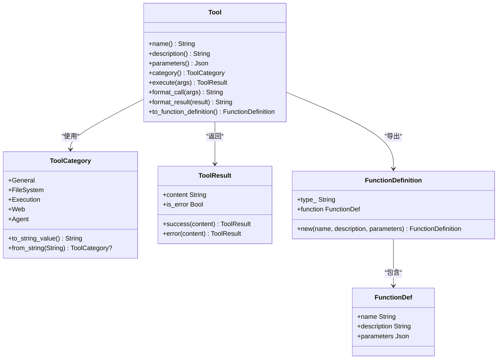
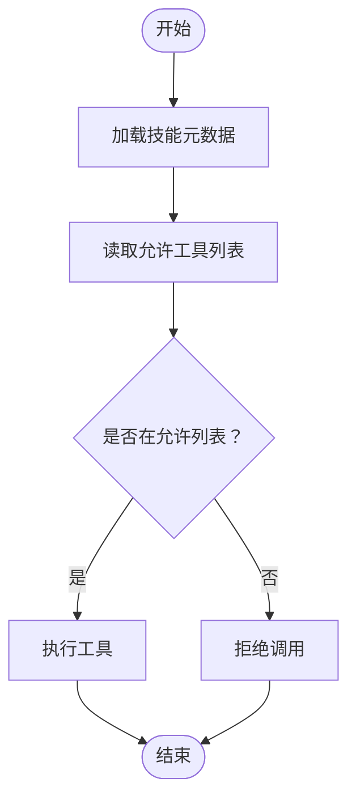
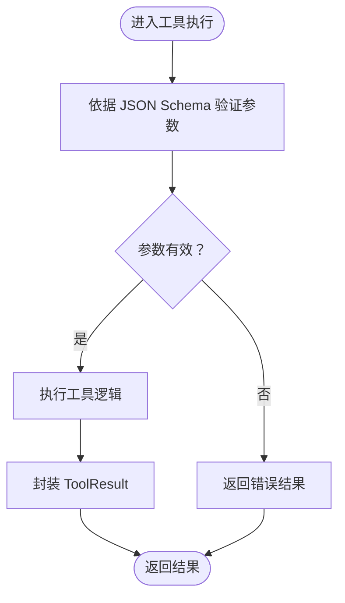
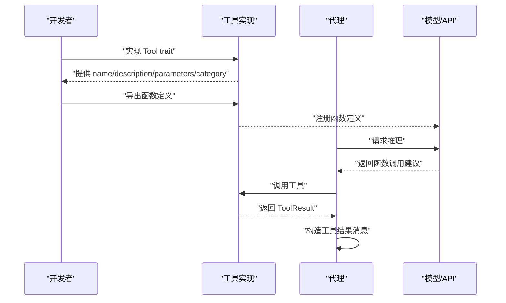
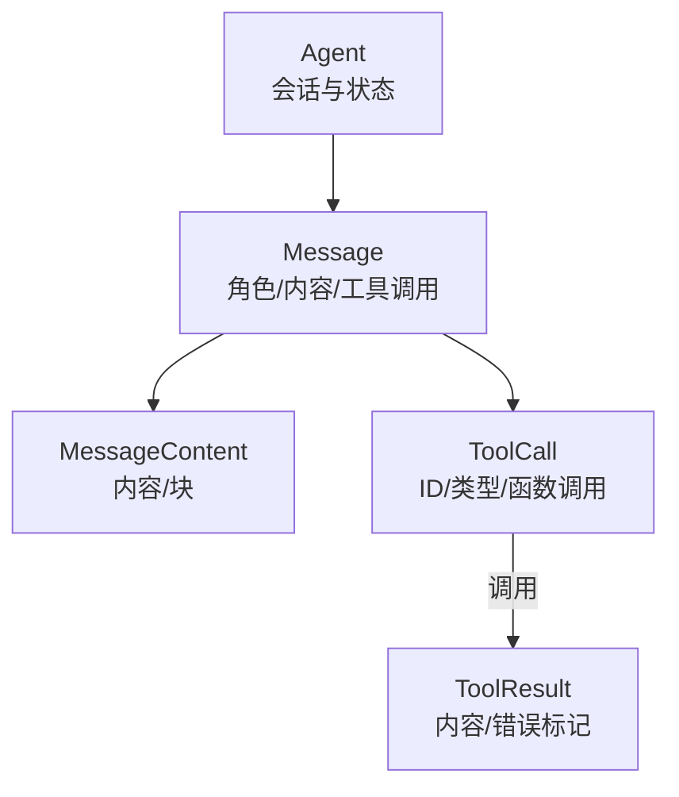
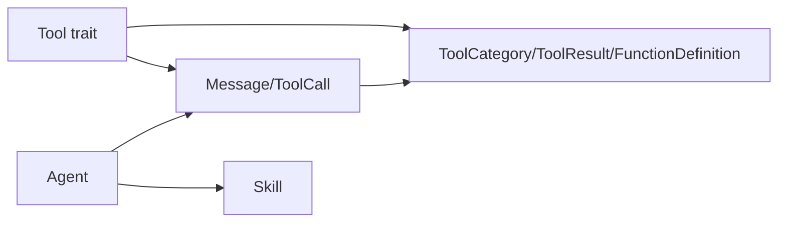

# 工具 API

<cite>
**本文引用的文件**
- [lib/tool/trait.mbt](file://lib/tool/trait.mbt)
- [lib/tool/types.mbt](file://lib/tool/types.mbt)
- [lib/message/tool_call.mbt](file://lib/message/tool_call.mbt)
- [lib/message/message.mbt](file://lib/message/message.mbt)
- [lib/agent/agent.mbt](file://lib/agent/agent.mbt)
- [lib/skill/skill.mbt](file://lib/skill/skill.mbt)
- [cmd/main.mbt](file://cmd/main.mbt)
</cite>

## 目录
1. [简介](#简介)
2. [项目结构](#项目结构)
3. [核心组件](#核心组件)
4. [架构总览](#架构总览)
5. [详细组件分析](#详细组件分析)
6. [依赖关系分析](#依赖关系分析)
7. [性能考虑](#性能考虑)
8. [故障排查指南](#故障排查指南)
9. [结论](#结论)
10. [附录](#附录)

## 简介
本文件为工具系统的 API 参考文档，聚焦于 Tool trait 的接口定义、工具分类与权限控制、参数校验与执行流程、工具注册与调用方式、与代理系统的协作机制以及数据交换格式。文档同时提供开发示例与最佳实践，帮助开发者快速实现符合规范的工具并安全地集成到代理系统中。

## 项目结构
工具系统位于 lib/tool 模块，配合消息模型（lib/message）、代理模型（lib/agent）与技能元数据（lib/skill）。命令入口（cmd/main.mbt）展示了核心类型的使用示例。

图表来源
- [lib/tool/trait.mbt:1-30](file://lib/tool/trait.mbt#L1-L30)
- [lib/tool/types.mbt:1-83](file://lib/tool/types.mbt#L1-L83)
- [lib/message/message.mbt:1-165](file://lib/message/message.mbt#L1-L165)
- [lib/message/tool_call.mbt:1-26](file://lib/message/tool_call.mbt#L1-L26)
- [lib/agent/agent.mbt:1-40](file://lib/agent/agent.mbt#L1-L40)
- [lib/skill/skill.mbt:1-48](file://lib/skill/skill.mbt#L1-L48)
- [cmd/main.mbt:1-27](file://cmd/main.mbt#L1-L27)

章节来源
- [cmd/main.mbt:1-27](file://cmd/main.mbt#L1-L27)

## 核心组件
- Tool trait：所有工具实现必须遵循的统一接口，包括名称、描述、参数模式、类别、执行、显示格式化与函数定义导出。
- 工具类型与结果：定义工具类别枚举、工具执行结果结构及 OpenAI 兼容函数定义结构。
- 消息与工具调用：定义工具调用在消息中的表示形式，以及工具结果消息的构造。
- 代理与技能：代理会维护对话历史并在需要时触发工具调用；技能元数据用于声明允许/禁止的工具集合等策略。

章节来源
- [lib/tool/trait.mbt:1-30](file://lib/tool/trait.mbt#L1-L30)
- [lib/tool/types.mbt:1-83](file://lib/tool/types.mbt#L1-L83)
- [lib/message/tool_call.mbt:1-26](file://lib/message/tool_call.mbt#L1-L26)
- [lib/message/message.mbt:1-165](file://lib/message/message.mbt#L1-L165)
- [lib/agent/agent.mbt:1-40](file://lib/agent/agent.mbt#L1-L40)
- [lib/skill/skill.mbt:1-48](file://lib/skill/skill.mbt#L1-L48)

## 架构总览
工具系统通过 Tool trait 将“声明式接口”与“执行式行为”解耦。代理在推理过程中根据上下文生成工具调用请求（ToolCall），消息层负责承载调用与结果；工具实现通过 Tool trait 提供可被代理识别与执行的能力，并以统一的数据格式返回结果。

图表来源
- [lib/agent/agent.mbt:1-40](file://lib/agent/agent.mbt#L1-L40)
- [lib/message/message.mbt:1-165](file://lib/message/message.mbt#L1-L165)
- [lib/message/tool_call.mbt:1-26](file://lib/message/tool_call.mbt#L1-L26)
- [lib/tool/trait.mbt:1-30](file://lib/tool/trait.mbt#L1-L30)
- [lib/tool/types.mbt:42-58](file://lib/tool/types.mbt#L42-L58)

## 详细组件分析

### Tool trait 接口规范
- 名称与描述：提供工具的规范名称与人类可读描述，便于 UI 展示与日志追踪。
- 参数模式：以 JSON Schema 形式描述参数结构，用于参数校验与自动文档生成。
- 类别：工具分类（通用、文件系统、执行、网络、代理），用于分组与权限控制。
- 执行：接收参数映射，返回统一的工具执行结果。
- 显示格式化：将调用与结果格式化为 UI 友好的字符串。
- 函数定义导出：转换为 OpenAI 兼容的函数定义，便于注册到模型 API。

图表来源
- [lib/tool/trait.mbt:5-29](file://lib/tool/trait.mbt#L5-L29)
- [lib/tool/types.mbt:3-39](file://lib/tool/types.mbt#L3-L39)
- [lib/tool/types.mbt:42-83](file://lib/tool/types.mbt#L42-L83)

章节来源
- [lib/tool/trait.mbt:1-30](file://lib/tool/trait.mbt#L1-L30)
- [lib/tool/types.mbt:1-83](file://lib/tool/types.mbt#L1-L83)

### 工具分类与权限控制
- 分类：工具类别用于分组与权限控制，支持序列化为字符串并反向解析。
- 权限策略：可通过技能元数据声明允许/禁止的工具列表，代理在执行前进行过滤。

图表来源
- [lib/tool/types.mbt:3-39](file://lib/tool/types.mbt#L3-L39)
- [lib/skill/skill.mbt:10-22](file://lib/skill/skill.mbt#L10-L22)

章节来源
- [lib/tool/types.mbt:1-83](file://lib/tool/types.mbt#L1-L83)
- [lib/skill/skill.mbt:1-48](file://lib/skill/skill.mbt#L1-L48)

### 参数验证与执行流程
- 参数验证：基于工具提供的 JSON Schema 对传入参数进行校验。
- 执行：工具实现内部完成资源访问、计算或外部调用，返回统一结果结构。
- 结果处理：代理根据 is_error 字段决定后续处理逻辑（如重试、错误提示）。

图表来源
- [lib/tool/trait.mbt:12-19](file://lib/tool/trait.mbt#L12-L19)
- [lib/tool/types.mbt:42-58](file://lib/tool/types.mbt#L42-L58)

章节来源
- [lib/tool/trait.mbt:1-30](file://lib/tool/trait.mbt#L1-L30)
- [lib/tool/types.mbt:1-83](file://lib/tool/types.mbt#L1-L83)

### 工具注册、发现与调用 API
- 注册：通过 to_function_definition 导出 OpenAI 兼容函数定义，供模型 API 使用。
- 发现：代理从技能元数据与工具类别中发现可用工具集。
- 调用：代理根据上下文生成 ToolCall 并调用工具，随后构造工具结果消息。

图表来源
- [lib/tool/trait.mbt:27-29](file://lib/tool/trait.mbt#L27-L29)
- [lib/tool/types.mbt:69-83](file://lib/tool/types.mbt#L69-L83)
- [lib/skill/skill.mbt:10-22](file://lib/skill/skill.mbt#L10-L22)
- [lib/message/tool_call.mbt:10-26](file://lib/message/tool_call.mbt#L10-L26)

章节来源
- [lib/tool/trait.mbt:1-30](file://lib/tool/trait.mbt#L1-L30)
- [lib/tool/types.mbt:1-83](file://lib/tool/types.mbt#L1-L83)
- [lib/message/tool_call.mbt:1-26](file://lib/message/tool_call.mbt#L1-L26)
- [lib/skill/skill.mbt:1-48](file://lib/skill/skill.mbt#L1-L48)

### 与代理系统的协作机制与数据交换
- 代理状态：维护会话 ID、历史、迭代次数、成本、工作目录、状态等。
- 消息承载：消息结构包含工具调用与工具结果 ID，确保链路可追踪。
- 协作流程：代理根据技能策略与工具类别选择工具，生成 ToolCall 并提交执行，再将结果封装为工具结果消息。

图表来源
- [lib/agent/agent.mbt:1-40](file://lib/agent/agent.mbt#L1-L40)
- [lib/message/message.mbt:16-55](file://lib/message/message.mbt#L16-L55)
- [lib/message/tool_call.mbt:1-26](file://lib/message/tool_call.mbt#L1-L26)
- [lib/tool/types.mbt:42-46](file://lib/tool/types.mbt#L42-L46)

章节来源
- [lib/agent/agent.mbt:1-40](file://lib/agent/agent.mbt#L1-L40)
- [lib/message/message.mbt:1-165](file://lib/message/message.mbt#L1-L165)
- [lib/message/tool_call.mbt:1-26](file://lib/message/tool_call.mbt#L1-L26)
- [lib/tool/types.mbt:1-83](file://lib/tool/types.mbt#L1-L83)

### 开发示例与实现指南
- 实现步骤
  - 定义工具结构体并实现 Tool trait 的全部方法。
  - 在 name 中提供稳定标识，在 description 中清晰说明用途。
  - 使用 JSON Schema 描述参数，确保字段必填与类型正确。
  - 选择合适的 ToolCategory，以便权限控制与分组。
  - 在 execute 中完成实际工作，返回 ToolResult.success 或 ToolResult.error。
  - 在 format_call 与 format_result 中提供 UI 友好输出。
  - 通过 to_function_definition 导出函数定义以供注册。
- 示例参考路径
  - [lib/tool/trait.mbt:5-29](file://lib/tool/trait.mbt#L5-L29)
  - [lib/tool/types.mbt:42-83](file://lib/tool/types.mbt#L42-L83)
  - [cmd/main.mbt:9-22](file://cmd/main.mbt#L9-L22)

章节来源
- [lib/tool/trait.mbt:1-30](file://lib/tool/trait.mbt#L1-L30)
- [lib/tool/types.mbt:1-83](file://lib/tool/types.mbt#L1-L83)
- [cmd/main.mbt:1-27](file://cmd/main.mbt#L1-L27)

### 权限控制与安全验证要求
- 基于类别与策略：通过 ToolCategory 与技能元数据中的 allowed_tools/forbidden_tools 控制工具可用性。
- 输入校验：严格依据 parameters 返回的 JSON Schema 进行参数校验，拒绝非法输入。
- 结果隔离：对 is_error 的处理应避免泄露敏感信息；错误消息应面向用户友好且不暴露内部细节。
- 最小权限原则：仅授予必要的工具类别与具体工具，减少攻击面。

章节来源
- [lib/tool/types.mbt:1-83](file://lib/tool/types.mbt#L1-L83)
- [lib/skill/skill.mbt:10-22](file://lib/skill/skill.mbt#L10-L22)

### 扩展与第三方集成技术规范
- 函数定义兼容：to_function_definition 输出的结构需满足 OpenAI 函数调用规范，便于第三方模型平台接入。
- 参数模式标准化：parameters 必须返回完整的 JSON Schema，包含必需字段、类型与约束。
- 结果格式一致性：统一使用 ToolResult，便于代理层一致处理。
- 多语言与多运行时：通过标准接口与 JSON 数据交换，可在不同语言或运行时中复用。

章节来源
- [lib/tool/trait.mbt:12-29](file://lib/tool/trait.mbt#L12-L29)
- [lib/tool/types.mbt:69-83](file://lib/tool/types.mbt#L69-L83)

### 测试与调试最佳实践
- 单元测试：针对 Tool trait 的每个方法编写测试，覆盖正常路径与边界条件。
- 集成测试：模拟代理调用流程，验证 ToolCall 生成、工具执行与结果消息构造。
- 日志与追踪：在 format_call 与 format_result 中输出关键信息，便于定位问题。
- 性能监控：统计工具执行耗时与错误率，优化热点工具。
- 安全审计：定期审查 allowed_tools/forbidden_tools 与参数 Schema，确保最小权限与输入安全。

## 依赖关系分析
- 工具依赖消息模型：工具结果需封装为消息，消息结构包含工具调用与工具结果 ID。
- 代理依赖工具与技能：代理根据技能策略与工具类别选择工具并发起调用。
- 类型依赖：工具类别与函数定义为工具与模型交互提供契约。

图表来源
- [lib/tool/trait.mbt:1-30](file://lib/tool/trait.mbt#L1-L30)
- [lib/tool/types.mbt:1-83](file://lib/tool/types.mbt#L1-L83)
- [lib/message/message.mbt:16-55](file://lib/message/message.mbt#L16-L55)
- [lib/message/tool_call.mbt:1-26](file://lib/message/tool_call.mbt#L1-L26)
- [lib/agent/agent.mbt:1-40](file://lib/agent/agent.mbt#L1-L40)
- [lib/skill/skill.mbt:10-22](file://lib/skill/skill.mbt#L10-L22)

章节来源
- [lib/tool/trait.mbt:1-30](file://lib/tool/trait.mbt#L1-L30)
- [lib/tool/types.mbt:1-83](file://lib/tool/types.mbt#L1-L83)
- [lib/message/message.mbt:1-165](file://lib/message/message.mbt#L1-L165)
- [lib/message/tool_call.mbt:1-26](file://lib/message/tool_call.mbt#L1-L26)
- [lib/agent/agent.mbt:1-40](file://lib/agent/agent.mbt#L1-L40)
- [lib/skill/skill.mbt:1-48](file://lib/skill/skill.mbt#L1-L48)

## 性能考虑
- 参数校验前置：在工具执行前完成参数校验，避免无效调用带来的资源浪费。
- 结果缓存：对重复输入的工具结果进行缓存，降低重复计算与 I/O。
- 异步执行：对于耗时操作采用异步执行与回调，提升代理响应速度。
- 错误快速失败：对明显非法的参数直接返回错误，减少无效尝试。

## 故障排查指南
- 参数错误：检查 parameters 返回的 JSON Schema 是否与调用方传递的参数一致。
- 权限拒绝：确认技能元数据中的 allowed_tools/forbidden_tools 与工具类别设置。
- 结果异常：查看 ToolResult.is_error 标记与 content 内容，结合 format_result 输出定位问题。
- 调用链断点：核对 ToolCall.id 与 Message.tool_call_id 的匹配关系，确保结果消息正确关联。

章节来源
- [lib/tool/types.mbt:42-58](file://lib/tool/types.mbt#L42-L58)
- [lib/message/tool_call.mbt:10-26](file://lib/message/tool_call.mbt#L10-L26)
- [lib/message/message.mbt:120-143](file://lib/message/message.mbt#L120-L143)

## 结论
Tool trait 为工具系统提供了统一、可扩展的接口规范。通过明确的参数模式、分类与权限控制、一致的结果格式以及与代理和消息模型的协作机制，开发者可以快速实现安全、可靠且易于集成的工具能力。建议在实现中严格遵循本文档的接口与流程规范，并结合测试与调试最佳实践，确保工具在生产环境中的稳定性与安全性。

## 附录
- 快速上手参考
  - 创建工具结构体并实现 Tool trait 的全部方法。
  - 在 name 与 description 中提供清晰标识与说明。
  - 使用 JSON Schema 描述参数，确保字段与类型正确。
  - 选择合适的 ToolCategory 并导出函数定义。
  - 在代理中配置技能策略，启用所需工具。
- 示例路径
  - [lib/tool/trait.mbt:5-29](file://lib/tool/trait.mbt#L5-L29)
  - [lib/tool/types.mbt:42-83](file://lib/tool/types.mbt#L42-L83)
  - [cmd/main.mbt:9-22](file://cmd/main.mbt#L9-L22)