# 技能 API

<cite>
**本文引用的文件**
- [lib/skill/skill.mbt](file://lib/skill/skill.mbt)
- [lib/agent/agent.mbt](file://lib/agent/agent.mbt)
- [lib/message/message.mbt](file://lib/message/message.mbt)
- [lib/config/agent.mbt](file://lib/config/agent.mbt)
- [lib/errors/errors.mbt](file://lib/errors/errors.mbt)
- [cmd/main.mbt](file://cmd/main.mbt)
- [README.md](file://README.md)
</cite>

## 目录
1. [简介](#简介)
2. [项目结构](#项目结构)
3. [核心组件](#核心组件)
4. [架构总览](#架构总览)
5. [详细组件分析](#详细组件分析)
6. [依赖分析](#依赖分析)
7. [性能考量](#性能考量)
8. [故障排查指南](#故障排查指南)
9. [结论](#结论)
10. [附录](#附录)

## 简介
本文件为“技能系统”的全面 API 参考文档，聚焦于技能的元数据模型、执行控制、上下文处理、注册与调用流程、与代理系统的集成方式、生命周期与状态跟踪、权限控制与安全验证，以及扩展与自定义开发的指导。本文基于仓库中的现有实现进行归纳总结，帮助开发者快速理解并正确使用技能 API。

## 项目结构
技能系统位于 lib/skill 子模块，配合 agent、message、config、errors 等模块协同工作。cmd/main.mbt 展示了核心类型的初始化与演示，README.md 描述了整体项目背景与阶段规划。

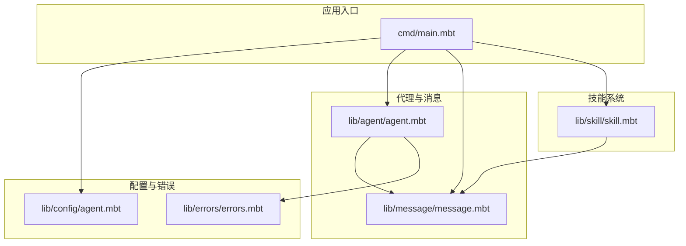

图示来源
- [cmd/main.mbt:1-27](file://cmd/main.mbt#L1-L27)
- [lib/skill/skill.mbt:1-48](file://lib/skill/skill.mbt#L1-L48)
- [lib/agent/agent.mbt:1-40](file://lib/agent/agent.mbt#L1-L40)
- [lib/message/message.mbt:1-165](file://lib/message/message.mbt#L1-L165)
- [lib/config/agent.mbt:1-34](file://lib/config/agent.mbt#L1-L34)
- [lib/errors/errors.mbt:1-80](file://lib/errors/errors.mbt#L1-L80)

章节来源
- [README.md:83-108](file://README.md#L83-L108)
- [cmd/main.mbt:1-27](file://cmd/main.mbt#L1-L27)

## 核心组件
- 技能元数据模型：Skill 结构体承载技能的名称、描述、上下文、模型选择、工具白/黑名单、钩子、自动总结等元数据，并提供默认构造函数。
- 代理会话模型：Agent 结构体管理会话 ID、历史消息、迭代次数、成本、工作目录、状态、来源等字段。
- 消息模型：Message 结构体支持文本与内容块两种内容形式，提供多种便捷构造器与 API 消息裁剪方法。
- 配置模型：AgentConfig 提供权限模式、令牌上限、压缩与提示缓存开关、模型列表、技能演进 JSON 等配置项。
- 错误模型：统一的错误层次，包含中断、标准代理错误、HTTP 4xx、工具调用错误、浏览器不可达、可重试错误、上游参数截断等。

章节来源
- [lib/skill/skill.mbt:1-48](file://lib/skill/skill.mbt#L1-L48)
- [lib/agent/agent.mbt:1-40](file://lib/agent/agent.mbt#L1-L40)
- [lib/message/message.mbt:1-165](file://lib/message/message.mbt#L1-L165)
- [lib/config/agent.mbt:1-34](file://lib/config/agent.mbt#L1-L34)
- [lib/errors/errors.mbt:1-80](file://lib/errors/errors.mbt#L1-L80)

## 架构总览
技能系统围绕 Skill 元数据模型展开，通过 Agent 会话与 Message 消息进行执行与通信，借助 AgentConfig 控制权限与行为，使用 errors 提供的错误类型保障稳定性与可观测性。下图展示关键对象之间的关系与交互方向。

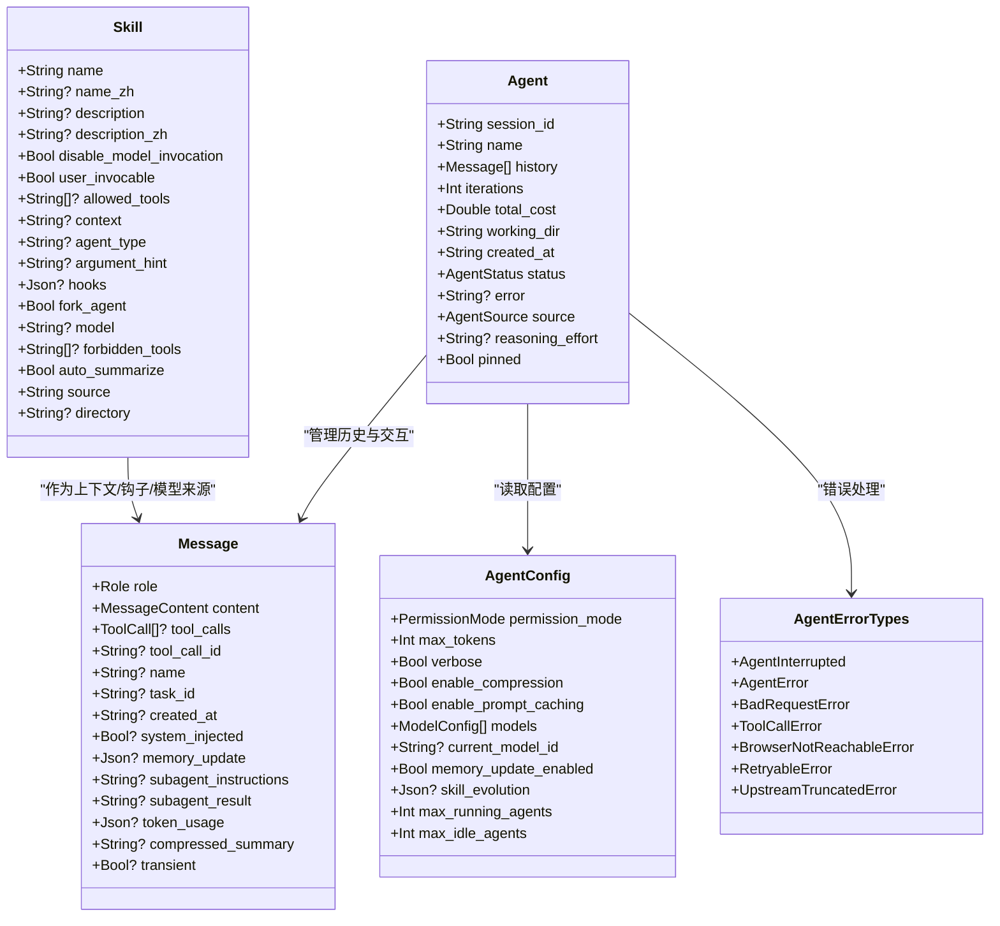

图示来源
- [lib/skill/skill.mbt:1-48](file://lib/skill/skill.mbt#L1-L48)
- [lib/agent/agent.mbt:1-40](file://lib/agent/agent.mbt#L1-L40)
- [lib/message/message.mbt:1-165](file://lib/message/message.mbt#L1-L165)
- [lib/config/agent.mbt:1-34](file://lib/config/agent.mbt#L1-L34)
- [lib/errors/errors.mbt:1-80](file://lib/errors/errors.mbt#L1-L80)

## 详细组件分析

### 技能元数据模型（Skill）
- 字段职责概览
  - 名称与多语言：name、name_zh
  - 描述与多语言：description、description_zh
  - 执行控制：disable_model_invocation、user_invocable、fork_agent、auto_summarize
  - 工具约束：allowed_tools、forbidden_tools
  - 上下文与类型：context、agent_type、argument_hint
  - 钩子与模型：hooks、model
  - 来源与目录：source、directory
- 默认构造
  - 提供默认值，便于快速创建技能实例，同时保留可选字段以支持灵活配置

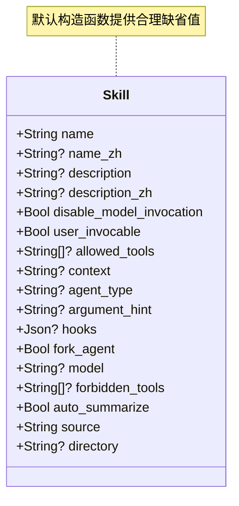

图示来源
- [lib/skill/skill.mbt:1-48](file://lib/skill/skill.mbt#L1-L48)

章节来源
- [lib/skill/skill.mbt:1-48](file://lib/skill/skill.mbt#L1-L48)

### 代理会话模型（Agent）
- 关键字段
  - 会话标识、名称、历史消息、迭代次数、总成本、工作目录、创建时间、状态、错误信息、来源、推理强度、固定标记
- 默认构造
  - 提供默认状态与初始值，便于快速启动新会话

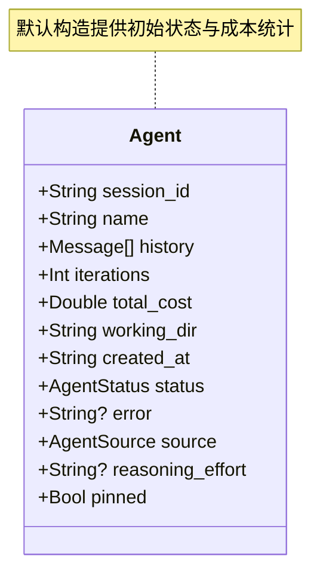

图示来源
- [lib/agent/agent.mbt:1-40](file://lib/agent/agent.mbt#L1-L40)

章节来源
- [lib/agent/agent.mbt:1-40](file://lib/agent/agent.mbt#L1-L40)

### 消息模型（Message）
- 内容形式
  - 文本内容或内容块数组
- 核心字段
  - 角色、内容、工具调用、工具调用 ID、名称
- 内部字段
  - 任务 ID、创建时间、系统注入标记、记忆更新、子代理指令/结果、Token 使用、压缩摘要、瞬时标记
- 构造器
  - 用户消息、助手消息、系统消息、工具结果消息
- API 消息裁剪
  - 提供 to_api_message，用于在对外请求前剥离内部字段

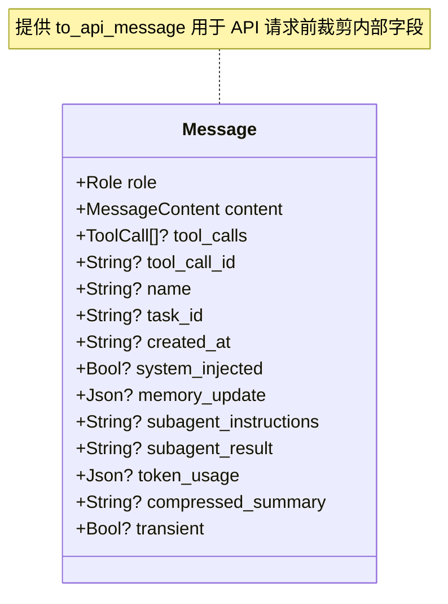

图示来源
- [lib/message/message.mbt:1-165](file://lib/message/message.mbt#L1-L165)

章节来源
- [lib/message/message.mbt:1-165](file://lib/message/message.mbt#L1-L165)

### 配置模型（AgentConfig）
- 关键配置
  - 权限模式、最大令牌数、详细日志、压缩与提示缓存、模型列表、当前模型 ID、记忆更新开关、技能演进 JSON、最大运行/空闲代理数
- 默认构造
  - 提供合理的缺省值，便于快速启用

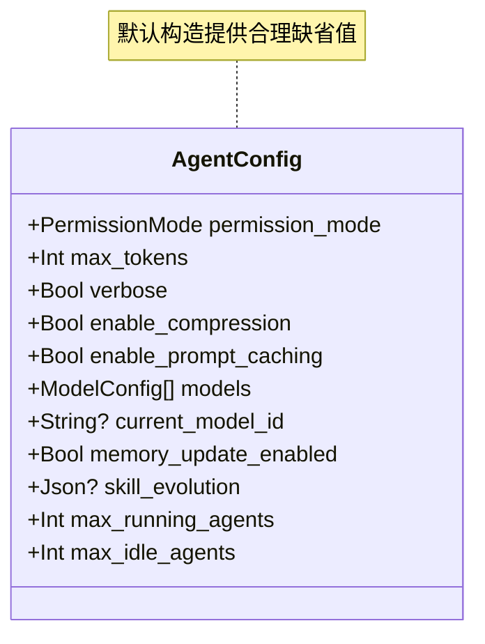

图示来源
- [lib/config/agent.mbt:1-34](file://lib/config/agent.mbt#L1-L34)

章节来源
- [lib/config/agent.mbt:1-34](file://lib/config/agent.mbt#L1-L34)

### 错误模型（AgentErrorTypes）
- 错误层次
  - 中断、标准代理错误、HTTP 4xx、工具调用错误、浏览器不可达、可重试错误、上游参数截断
- 辅助判断
  - is_agent_error、is_retryable_error，便于分支处理与重试策略

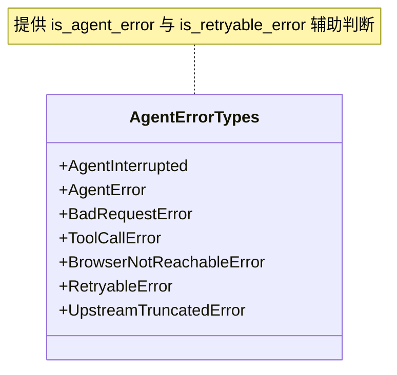

图示来源
- [lib/errors/errors.mbt:1-80](file://lib/errors/errors.mbt#L1-L80)

章节来源
- [lib/errors/errors.mbt:1-80](file://lib/errors/errors.mbt#L1-L80)

### 技能注册、发现与调用流程
- 注册与发现
  - 通过 Skill 元数据模型定义技能的元信息与行为约束（如 user_invocable、allowed_tools、forbidden_tools、context、agent_type、model、hooks 等）。结合 AgentConfig 的 skill_evolution 字段可实现技能演进与动态配置。
- 调用控制
  - disable_model_invocation 控制是否允许模型直接调用；fork_agent 控制是否以子代理方式执行；auto_summarize 控制是否自动摘要。
- 上下文与模型
  - context 与 agent_type 用于限定技能适用的上下文与代理类型；model 可指定具体模型；argument_hint 为参数提示。
- 与代理的交互
  - Agent 通过历史消息与工具调用与技能交互，Message 的工具调用字段与工具结果消息用于传递调用结果。

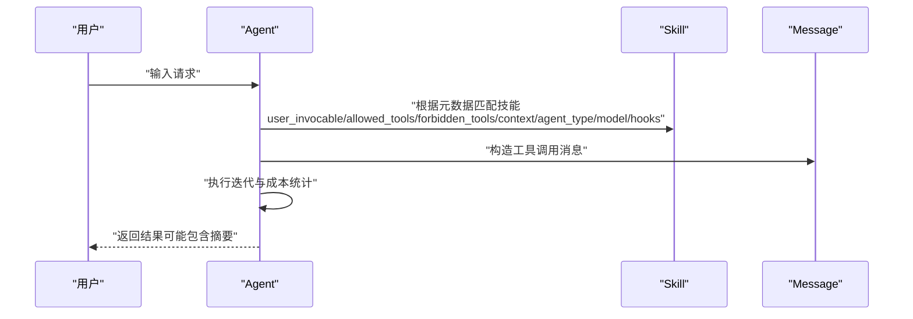

图示来源
- [lib/skill/skill.mbt:1-48](file://lib/skill/skill.mbt#L1-L48)
- [lib/agent/agent.mbt:1-40](file://lib/agent/agent.mbt#L1-L40)
- [lib/message/message.mbt:1-165](file://lib/message/message.mbt#L1-L165)
- [lib/config/agent.mbt:1-34](file://lib/config/agent.mbt#L1-L34)

章节来源
- [lib/skill/skill.mbt:1-48](file://lib/skill/skill.mbt#L1-L48)
- [lib/agent/agent.mbt:1-40](file://lib/agent/agent.mbt#L1-L40)
- [lib/message/message.mbt:1-165](file://lib/message/message.mbt#L1-L165)
- [lib/config/agent.mbt:1-34](file://lib/config/agent.mbt#L1-L34)

### 生命周期与状态跟踪
- Agent 状态
  - 通过 AgentStatus 表征会话状态，结合 created_at、iterations、total_cost 实现生命周期与成本跟踪。
- 消息生命周期
  - Message 支持内部字段（如 memory_update、token_usage、compressed_summary）在内部流转，to_api_message 用于对外输出时裁剪。

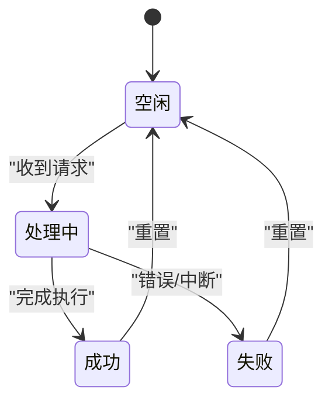

图示来源
- [lib/agent/agent.mbt:1-40](file://lib/agent/agent.mbt#L1-L40)
- [lib/message/message.mbt:146-165](file://lib/message/message.mbt#L146-L165)

章节来源
- [lib/agent/agent.mbt:1-40](file://lib/agent/agent.mbt#L1-L40)
- [lib/message/message.mbt:146-165](file://lib/message/message.mbt#L146-L165)

### 权限控制与安全验证
- 权限模式
  - AgentConfig.permission_mode 控制权限策略；结合 user_invocable 与 allowed_tools/forbidden_tools 实现细粒度的访问控制。
- 错误隔离
  - 使用统一错误层次与 is_agent_error/is_retryable_error 判断，确保错误路径可控，便于安全地进行重试与降级。

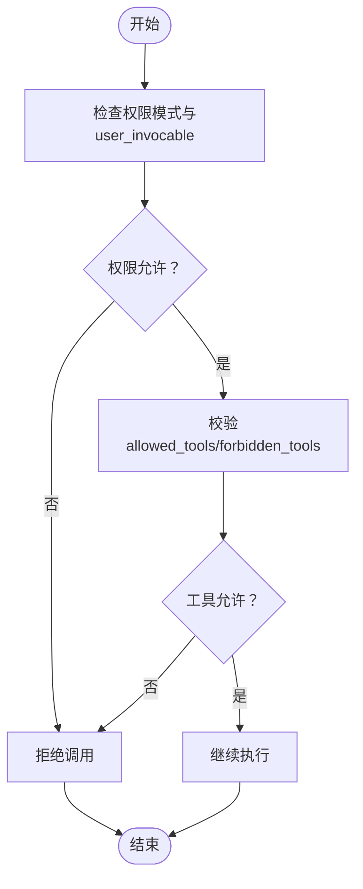

图示来源
- [lib/config/agent.mbt:1-34](file://lib/config/agent.mbt#L1-L34)
- [lib/skill/skill.mbt:1-48](file://lib/skill/skill.mbt#L1-L48)
- [lib/errors/errors.mbt:57-80](file://lib/errors/errors.mbt#L57-L80)

章节来源
- [lib/config/agent.mbt:1-34](file://lib/config/agent.mbt#L1-L34)
- [lib/skill/skill.mbt:1-48](file://lib/skill/skill.mbt#L1-L48)
- [lib/errors/errors.mbt:57-80](file://lib/errors/errors.mbt#L57-L80)

### 开发示例与最佳实践
- 快速上手
  - 使用 Skill::default 创建技能实例，设置 name 与 source，再根据需要填充其他元数据字段。
  - 使用 Agent::new 初始化会话，结合 AgentConfig.default 设置权限与行为。
  - 使用 Message 的便捷构造器创建用户/助手/系统消息，必要时使用 to_api_message 输出。
- 最佳实践
  - 明确 context 与 agent_type，确保技能在正确的上下文与代理类型中执行。
  - 合理使用 allowed_tools/forbidden_tools 限制工具访问范围，提升安全性。
  - 使用 disable_model_invocation 与 fork_agent 控制执行路径与资源消耗。
  - 通过 auto_summarize 与 Message 的压缩摘要字段优化输出与成本。
  - 使用 errors 的辅助判断函数区分可重试与不可重试错误，制定稳健的重试策略。

章节来源
- [lib/skill/skill.mbt:25-48](file://lib/skill/skill.mbt#L25-L48)
- [lib/agent/agent.mbt:18-40](file://lib/agent/agent.mbt#L18-L40)
- [lib/message/message.mbt:57-165](file://lib/message/message.mbt#L57-L165)
- [lib/config/agent.mbt:17-34](file://lib/config/agent.mbt#L17-L34)
- [lib/errors/errors.mbt:57-80](file://lib/errors/errors.mbt#L57-L80)

## 依赖分析
- 组件内聚与耦合
  - Skill 与 Message 通过工具调用与结果消息产生直接耦合；Agent 作为协调者与 Message、Skill、AgentConfig、errors 协同。
- 外部依赖与集成点
  - 通过 AgentConfig 的 skill_evolution 字段与外部系统进行技能演进集成；errors 为统一错误处理提供契约。
- 循环依赖
  - 当前结构未见循环依赖迹象，职责边界清晰。

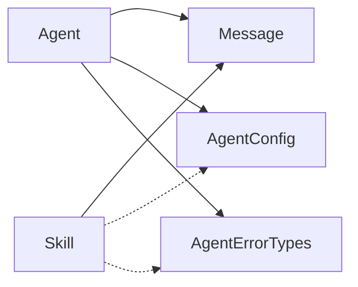

图示来源
- [lib/skill/skill.mbt:1-48](file://lib/skill/skill.mbt#L1-L48)
- [lib/agent/agent.mbt:1-40](file://lib/agent/agent.mbt#L1-L40)
- [lib/message/message.mbt:1-165](file://lib/message/message.mbt#L1-L165)
- [lib/config/agent.mbt:1-34](file://lib/config/agent.mbt#L1-L34)
- [lib/errors/errors.mbt:1-80](file://lib/errors/errors.mbt#L1-L80)

章节来源
- [lib/skill/skill.mbt:1-48](file://lib/skill/skill.mbt#L1-L48)
- [lib/agent/agent.mbt:1-40](file://lib/agent/agent.mbt#L1-L40)
- [lib/message/message.mbt:1-165](file://lib/message/message.mbt#L1-L165)
- [lib/config/agent.mbt:1-34](file://lib/config/agent.mbt#L1-L34)
- [lib/errors/errors.mbt:1-80](file://lib/errors/errors.mbt#L1-L80)

## 性能考量
- 消息裁剪与成本控制
  - 使用 to_api_message 剥离内部字段，减少传输与解析开销。
- 自动摘要与压缩
  - auto_summarize 与压缩摘要字段有助于降低输出大小与成本。
- 并发与重试
  - 使用 is_retryable_error 区分可重试错误，结合 AgentConfig 的并发限制参数（如 max_running_agents、max_idle_agents）控制资源占用。

## 故障排查指南
- 常见错误类型
  - AgentInterrupted：用户或系统中断
  - AgentError：代理相关错误
  - BadRequestError：LLM API 4xx 错误
  - ToolCallError：工具执行错误
  - BrowserNotReachableError：浏览器调试端口不可达
  - RetryableError：可重试错误（如 5xx、限流）
  - UpstreamTruncatedError：上游参数截断
- 排查步骤
  - 使用 is_agent_error 判断是否属于代理错误域，is_retryable_error 判断是否可重试
  - 检查权限模式与工具白/黑名单配置
  - 校验上下文与代理类型匹配
  - 查看 Agent 的 error 字段与 Message 的 token_usage/memory_update 等内部字段辅助诊断

章节来源
- [lib/errors/errors.mbt:1-80](file://lib/errors/errors.mbt#L1-L80)
- [lib/agent/agent.mbt:1-40](file://lib/agent/agent.mbt#L1-L40)
- [lib/message/message.mbt:146-165](file://lib/message/message.mbt#L146-L165)

## 结论
技能系统通过明确的元数据模型、严格的权限控制与错误处理机制，提供了可扩展、可追踪、可演进的能力框架。结合 Agent 的会话管理与 Message 的消息模型，能够稳定地支撑多场景的技能调用与执行。建议在实际开发中优先明确上下文与代理类型，合理配置工具访问与模型选择，并利用自动摘要与重试策略提升性能与可靠性。

## 附录
- 示例与演练
  - 在 cmd/main.mbt 中展示了默认配置、用户消息与 Agent 实例的初始化，可据此扩展技能调用流程的演示。
- 阶段规划
  - 技能系统（Phase 8）处于后续开发阶段，建议关注后续迭代以获取更完善的 API 与示例。

章节来源
- [cmd/main.mbt:1-27](file://cmd/main.mbt#L1-L27)
- [README.md:159-177](file://README.md#L159-L177)