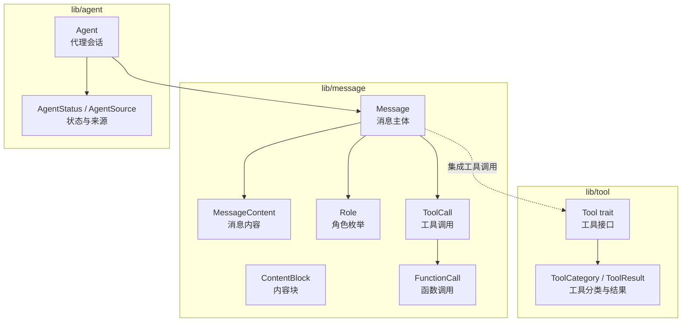
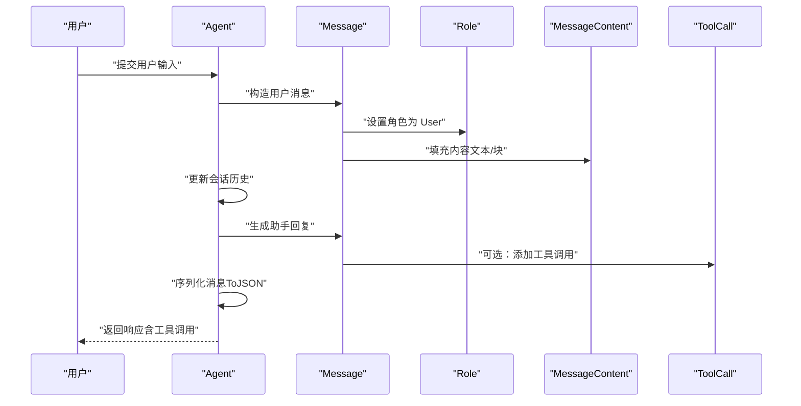
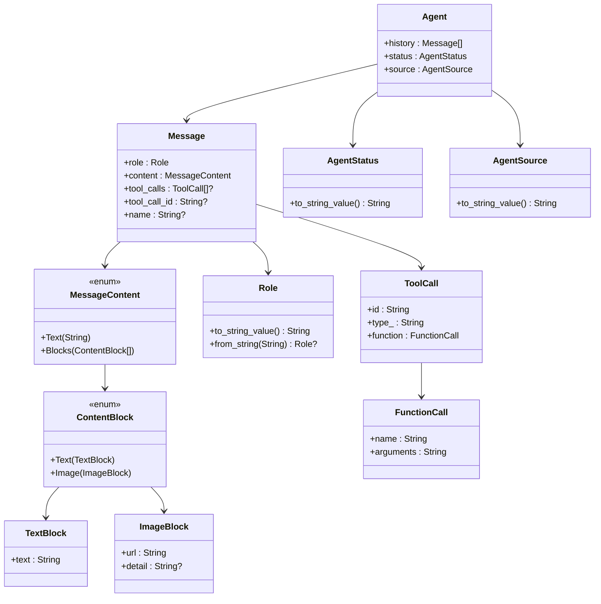

# 消息 API

<cite>
**本文引用的文件**
- [message.mbt](file://lib/message/message.mbt)
- [content.mbt](file://lib/message/content.mbt)
- [role.mbt](file://lib/message/role.mbt)
- [tool_call.mbt](file://lib/message/tool_call.mbt)
- [agent.mbt](file://lib/agent/agent.mbt)
- [status.mbt](file://lib/agent/status.mbt)
- [trait.mbt](file://lib/tool/trait.mbt)
- [types.mbt](file://lib/tool/types.mbt)
- [main.mbt](file://cmd/main.mbt)
</cite>

## 目录
1. [简介](#简介)
2. [项目结构](#项目结构)
3. [核心组件](#核心组件)
4. [架构总览](#架构总览)
5. [详细组件分析](#详细组件分析)
6. [依赖关系分析](#依赖关系分析)
7. [性能考量](#性能考量)
8. [故障排查指南](#故障排查指南)
9. [结论](#结论)
10. [附录](#附录)

## 简介
本文件为消息系统的 API 参考文档，聚焦以下主题：
- Message 结构体的字段定义、角色类型与内容格式
- 不同类型消息的创建方法与使用场景（用户消息、助手消息、系统消息、工具结果消息）
- MessageContent 的多种格式与序列化/反序列化行为
- 工具调用的 API 接口（ToolCall、FunctionCall）及其与消息的集成
- 消息在对话循环中的传递机制与处理流程
- 消息验证、格式化与 API 兼容性要点

## 项目结构
消息系统位于 lib/message 目录，围绕 Message、MessageContent、Role、ToolCall 等核心类型构建，并与工具系统（lib/tool）及代理（lib/agent）协同工作。

图表来源
- [message.mbt:16-37](file://lib/message/message.mbt#L16-L37)
- [content.mbt:14-21](file://lib/message/content.mbt#L14-L21)
- [role.mbt:5-10](file://lib/message/role.mbt#L5-L10)
- [tool_call.mbt:3-16](file://lib/message/tool_call.mbt#L3-L16)
- [agent.mbt:3-16](file://lib/agent/agent.mbt#L3-L16)
- [status.mbt:3-17](file://lib/agent/status.mbt#L3-L17)
- [trait.mbt:5-29](file://lib/tool/trait.mbt#L5-L29)
- [types.mbt:3-46](file://lib/tool/types.mbt#L3-L46)

章节来源
- [message.mbt:16-37](file://lib/message/message.mbt#L16-L37)
- [content.mbt:14-21](file://lib/message/content.mbt#L14-L21)
- [role.mbt:5-10](file://lib/message/role.mbt#L5-L10)
- [tool_call.mbt:3-16](file://lib/message/tool_call.mbt#L3-L16)
- [agent.mbt:3-16](file://lib/agent/agent.mbt#L3-L16)
- [status.mbt:3-17](file://lib/agent/status.mbt#L3-L17)
- [trait.mbt:5-29](file://lib/tool/trait.mbt#L5-L29)
- [types.mbt:3-46](file://lib/tool/types.mbt#L3-L46)

## 核心组件
- Message：一次对话中的消息实体，包含角色、内容、可选的工具调用与工具调用 ID、可选名称等。
- MessageContent：消息内容，支持纯文本或内容块数组两种形式。
- ContentBlock：内容块，支持文本块与图片块，具备自定义 JSON 序列化以携带类型鉴别器。
- Role：消息角色枚举，映射到 OpenAI 兼容的小写字符串，支持序列化与反序列化。
- ToolCall：由助手发起的工具调用，包含唯一 ID、类型（默认函数）、函数名与参数。
- FunctionCall：工具调用内的函数调用信息，包含函数名与参数字符串。
- Agent：管理对话历史与工具执行的代理会话，持有消息数组。

章节来源
- [message.mbt:16-37](file://lib/message/message.mbt#L16-L37)
- [content.mbt:14-21](file://lib/message/content.mbt#L14-L21)
- [role.mbt:5-10](file://lib/message/role.mbt#L5-L10)
- [tool_call.mbt:3-16](file://lib/message/tool_call.mbt#L3-L16)
- [agent.mbt:3-16](file://lib/agent/agent.mbt#L3-L16)

## 架构总览
消息系统通过统一的序列化接口与角色枚举实现与外部 API 的兼容；工具调用作为消息的一部分被序列化并在代理会话中流转。

图表来源
- [message.mbt:39-55](file://lib/message/message.mbt#L39-L55)
- [role.mbt:38-52](file://lib/message/role.mbt#L38-L52)
- [content.mbt:40-45](file://lib/message/content.mbt#L40-L45)
- [tool_call.mbt:12-16](file://lib/message/tool_call.mbt#L12-L16)
- [agent.mbt:6-12](file://lib/agent/agent.mbt#L6-L12)

## 详细组件分析

### Message 结构体与字段
- 角色 role：必填，取值来自 Role 枚举。
- 内容 content：必填，取值来自 MessageContent（纯文本或内容块数组）。
- 工具调用 tool_calls：可选，数组类型，承载 ToolCall 列表。
- 工具调用 ID tool_call_id：可选，用于关联工具结果消息。
- 名称 name：可选，用于标识工具调用。
- 内部字段（提交 API 前会被剥离）：task_id、created_at、system_injected、memory_update、subagent_instructions、subagent_result、token_usage、compressed_summary、transient。

创建方法
- 用户消息：通过静态工厂方法创建，内容为纯文本。
- 助手消息：通过静态工厂方法创建，内容为纯文本。
- 系统消息：通过静态工厂方法创建，内容为纯文本。
- 工具结果消息：通过静态工厂方法创建，需提供工具调用 ID 与工具名称。

API 提交前的裁剪
- 提供 to_api_message 方法，将内部字段置空，仅保留对外 API 所需的核心字段。

章节来源
- [message.mbt:16-37](file://lib/message/message.mbt#L16-L37)
- [message.mbt:58-97](file://lib/message/message.mbt#L58-L97)
- [message.mbt:100-118](file://lib/message/message.mbt#L100-L118)
- [message.mbt:120-143](file://lib/message/message.mbt#L120-L143)
- [message.mbt:147-164](file://lib/message/message.mbt#L147-L164)

### MessageContent 与内容块
- MessageContent 支持两种形态：
  - 文本：直接存储字符串。
  - 内容块数组：由 ContentBlock 组成。
- ContentBlock 支持：
  - 文本块 TextBlock：包含文本字段。
  - 图片块 ImageBlock：包含 URL 与可选细节级别。
- 自定义序列化：
  - ContentBlock 在序列化时携带类型鉴别器，确保解析端能正确区分文本与图片。
  - TextBlock 与 ImageBlock 分别输出带类型键的对象。

章节来源
- [message.mbt:3-6](file://lib/message/message.mbt#L3-L6)
- [content.mbt:14-21](file://lib/message/content.mbt#L14-L21)
- [content.mbt:18-21](file://lib/message/content.mbt#L18-L21)
- [content.mbt:24-37](file://lib/message/content.mbt#L24-L37)
- [content.mbt:40-45](file://lib/message/content.mbt#L40-L45)

### Role（角色）与 API 兼容性
- 角色枚举映射到 OpenAI 兼容的小写字符串："user"、"assistant"、"system"、"tool"。
- 提供字符串互转函数，便于序列化与反序列化。
- Role 实现了 ToJson 与 FromJson，保证与外部 API 的兼容。

章节来源
- [role.mbt:5-10](file://lib/message/role.mbt#L5-L10)
- [role.mbt:14-21](file://lib/message/role.mbt#L14-L21)
- [role.mbt:27-35](file://lib/message/role.mbt#L27-L35)
- [role.mbt:38-52](file://lib/message/role.mbt#L38-L52)

### 工具调用 API（ToolCall 与 FunctionCall）
- ToolCall：包含唯一 ID、类型（默认为函数）、函数调用对象。
- FunctionCall：包含函数名与参数字符串。
- 工具调用的创建与序列化：
  - 提供构造函数以便捷创建默认类型的工具调用。
  - ToolCall 实现 ToJson，可直接参与消息的序列化。

章节来源
- [tool_call.mbt:3-6](file://lib/message/tool_call.mbt#L3-L6)
- [tool_call.mbt:12-16](file://lib/message/tool_call.mbt#L12-L16)
- [tool_call.mbt:19-26](file://lib/message/tool_call.mbt#L19-L26)

### 与工具系统的集成
- 工具接口（Tool trait）定义了工具的名称、描述、参数模式、类别、执行、显示格式化以及函数定义导出。
- 工具结果（ToolResult）包含内容与错误标记。
- 工具分类（ToolCategory）用于分组与权限控制。
- 消息中的工具调用与工具系统通过函数定义与执行结果形成闭环。

章节来源
- [trait.mbt:5-29](file://lib/tool/trait.mbt#L5-L29)
- [types.mbt:3-46](file://lib/tool/types.mbt#L3-L46)

### 代理与消息循环
- Agent 会话维护历史消息数组，包含会话 ID、状态、来源、迭代次数、成本等元数据。
- AgentStatus 与 AgentSource 提供状态与来源的字符串化与序列化支持。
- 消息在代理中被组织、序列化并提交至外部服务，再接收响应并更新会话历史。

章节来源
- [agent.mbt:3-16](file://lib/agent/agent.mbt#L3-L16)
- [status.mbt:3-17](file://lib/agent/status.mbt#L3-L17)
- [status.mbt:21-29](file://lib/agent/status.mbt#L21-L29)
- [status.mbt:33-39](file://lib/agent/status.mbt#L33-L39)
- [status.mbt:42-49](file://lib/agent/status.mbt#L42-L49)

## 依赖关系分析
消息系统的关键依赖如下：
- Message 依赖 Role、MessageContent、ToolCall。
- MessageContent 依赖 ContentBlock。
- ContentBlock 依赖 TextBlock、ImageBlock。
- Agent 依赖 Message、AgentStatus、AgentSource。
- 工具系统（Tool trait、ToolCategory、ToolResult）与消息中的工具调用形成协作。

图表来源
- [message.mbt:16-37](file://lib/message/message.mbt#L16-L37)
- [content.mbt:14-21](file://lib/message/content.mbt#L14-L21)
- [role.mbt:5-10](file://lib/message/role.mbt#L5-L10)
- [tool_call.mbt:3-16](file://lib/message/tool_call.mbt#L3-L16)
- [agent.mbt:3-16](file://lib/agent/agent.mbt#L3-L16)
- [status.mbt:3-17](file://lib/agent/status.mbt#L3-L17)

章节来源
- [message.mbt:16-37](file://lib/message/message.mbt#L16-L37)
- [content.mbt:14-21](file://lib/message/content.mbt#L14-L21)
- [role.mbt:5-10](file://lib/message/role.mbt#L5-L10)
- [tool_call.mbt:3-16](file://lib/message/tool_call.mbt#L3-L16)
- [agent.mbt:3-16](file://lib/agent/agent.mbt#L3-L16)
- [status.mbt:3-17](file://lib/agent/status.mbt#L3-L17)

## 性能考量
- 序列化开销：消息与内容块均实现 ToJson，建议在批量发送时复用序列化结果，避免重复计算。
- 可选字段：tool_calls、tool_call_id、name 等可选字段仅在存在时参与序列化，有助于减少传输体积。
- 内容块类型：ContentBlock 的类型鉴别器在序列化时引入固定键值，通常开销极小但应避免冗余嵌套。
- 工具调用：ToolCall 默认类型为函数，构造时无需额外参数，简化调用路径。

## 故障排查指南
- 角色解析失败：当从 JSON 解析角色时，若字符串不在允许集合内，将抛出解码错误。请检查输入字符串是否为 "user"、"assistant"、"system" 或 "tool"。
- 工具调用 ID 缺失：工具结果消息必须提供 tool_call_id 以便与对应的工具调用匹配。缺失会导致后续处理困难。
- 内容块类型不匹配：ContentBlock 的序列化包含类型鉴别器，请确保客户端也遵循相同规则进行解析。
- API 字段剥离：对外提交前请调用 to_api_message，确保内部字段不会被发送到外部 API。

章节来源
- [role.mbt:43-52](file://lib/message/role.mbt#L43-L52)
- [message.mbt:147-164](file://lib/message/message.mbt#L147-L164)

## 结论
消息系统通过清晰的角色、内容与工具调用模型，实现了与外部 API 的兼容与扩展。借助统一的序列化接口与可选字段设计，消息在对话循环中高效流转，并与工具系统无缝集成。遵循本文档的字段定义、创建方法与序列化规范，可确保消息在不同模块间的稳定传递与处理。

## 附录

### 消息创建与使用场景速查
- 用户消息：适用于用户输入，内容为纯文本。
- 助手消息：适用于模型回复，内容为纯文本。
- 系统消息：适用于系统提示或上下文注入，内容为纯文本。
- 工具结果消息：适用于工具执行后的结果回传，需提供工具调用 ID 与工具名称。

章节来源
- [message.mbt:58-76](file://lib/message/message.mbt#L58-L76)
- [message.mbt:78-97](file://lib/message/message.mbt#L78-L97)
- [message.mbt:100-118](file://lib/message/message.mbt#L100-L118)
- [message.mbt:120-143](file://lib/message/message.mbt#L120-L143)

### 序列化与反序列化示例（路径参考）
- Message 的序列化：参见 ToJson 实现路径。
- Role 的序列化与反序列化：参见 ToJson/FromJson 实现路径。
- ContentBlock 的序列化：参见 ToJson 实现路径。
- ToolCall 的序列化：参见 ToJson 实现路径。

章节来源
- [message.mbt:39-55](file://lib/message/message.mbt#L39-L55)
- [role.mbt:38-52](file://lib/message/role.mbt#L38-L52)
- [content.mbt:40-45](file://lib/message/content.mbt#L40-L45)
- [tool_call.mbt:16-26](file://lib/message/tool_call.mbt#L16-L26)

### 对话循环中的消息传递流程
- 用户输入 → 构造用户消息 → 更新会话历史 → 生成助手回复（可包含工具调用）→ 序列化消息 → 外部 API 调用 → 接收响应 → 更新会话历史。

章节来源
- [agent.mbt:6-12](file://lib/agent/agent.mbt#L6-L12)
- [message.mbt:147-164](file://lib/message/message.mbt#L147-L164)