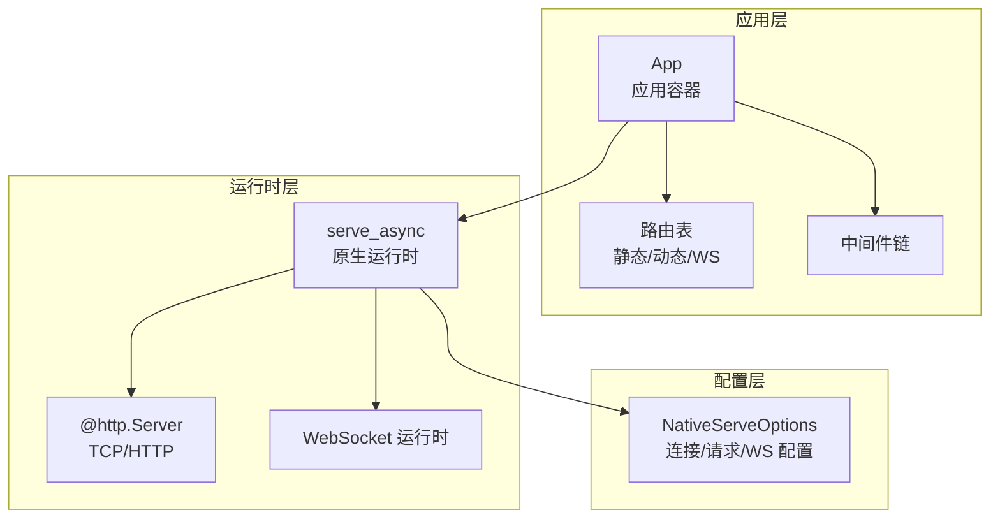
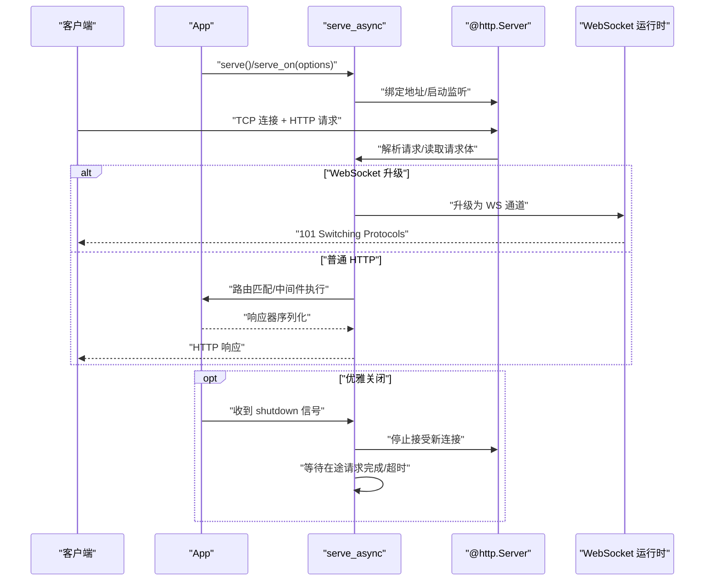
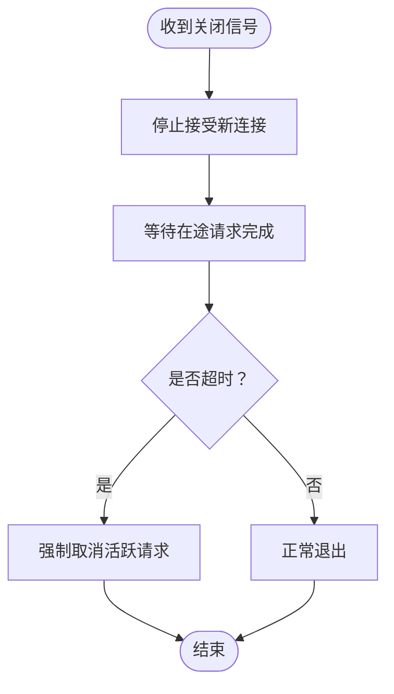
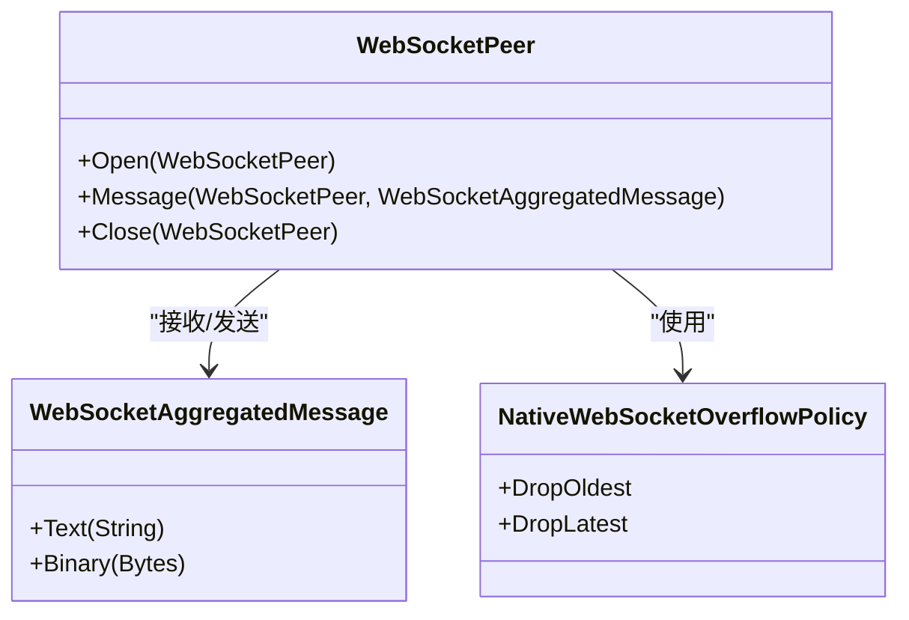
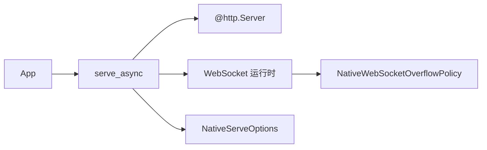

# HTTP 服务器配置

<cite>
**本文引用的文件**
- [ARCHITECTURE.md](file://ARCHITECTURE.md)
- [serve_options.mbt](file://serve_options.mbt)
- [serve_async.mbt](file://serve_async.mbt)
- [serve_async_integration_test.mbt](file://serve_async_integration_test.mbt)
- [websocket/peer.mbt](file://websocket/peer.mbt)
- [websocket/runtime_wbtest.mbt](file://websocket/runtime_wbtest.mbt)
</cite>

## 目录
1. [简介](#简介)
2. [项目结构](#项目结构)
3. [核心组件](#核心组件)
4. [架构总览](#架构总览)
5. [详细组件分析](#详细组件分析)
6. [依赖关系分析](#依赖关系分析)
7. [性能考量](#性能考量)
8. [故障排查指南](#故障排查指南)
9. [结论](#结论)
10. [附录](#附录)

## 简介
本指南面向使用 Crescent HTTP/WebSocket 服务器的开发者，系统讲解服务器启动与配置，涵盖端口监听、连接限制、请求体与超时控制、优雅关闭与信号处理、与现有服务器实例集成、WebSocket 特定配置（消息大小、队列容量与溢出策略），以及生产环境部署与性能调优建议。文档基于仓库中的架构说明、配置定义与测试用例进行整理，确保内容可追溯至实际源码。

## 项目结构
Crescent 将 HTTP 与 WebSocket 能力封装为原生异步运行时，通过 App 类型对外暴露路由、中间件与服务入口；服务器配置集中在 NativeServeOptions，并由 serve_async 提供运行时行为与优雅关闭逻辑。

图示来源
- [ARCHITECTURE.md](file://ARCHITECTURE.md)
- [serve_async.mbt](file://serve_async.mbt)

章节来源
- [ARCHITECTURE.md](file://ARCHITECTURE.md)
- [serve_async.mbt](file://serve_async.mbt)

## 核心组件
- App：应用容器，负责路由注册、中间件装配与服务入口（serve/serve_on）。
- NativeServeOptions：服务器运行时配置对象，统一校验与生效于 HTTP/WS。
- serve_async：原生运行时，负责请求生命周期、路由分发、WS 升级、优雅关闭。
- WebSocket 运行时：WS 消息聚合、队列与溢出策略、读超时与消息大小限制。

章节来源
- [serve_options.mbt](file://serve_options.mbt)
- [serve_async.mbt](file://serve_async.mbt)
- [websocket/peer.mbt](file://websocket/peer.mbt)

## 架构总览
Crescent 的服务启动流程从 App.serve/serve_on 开始，内部委托到 run_native_server。当提供 shutdown 队列时，服务器进入优雅关闭模式：停止接受新连接，等待在途请求完成或达到超时后强制取消。

图示来源
- [ARCHITECTURE.md](file://ARCHITECTURE.md)
- [serve_async.mbt](file://serve_async.mbt)

## 详细组件分析

### 服务器启动与端口配置
- 端口监听：App.serve(port, shutdown?, options?) 会解析地址并创建 @http.Server，然后委托 serve_on。
- 地址解析与复用：服务器以 reuse_addr=true 绑定 0.0.0.0:port，便于快速重启与避免地址占用。
- 与现有服务器实例集成：App.serve_on(server, shutdown?, options?) 接受已存在的 @http.Server 实例，适合多路复用或外部管理的套接字。

章节来源
- [serve_async.mbt](file://serve_async.mbt)

### NativeServeOptions 参数详解
NativeServeOptions 提供统一的服务器配置入口，所有参数均在构造阶段进行范围校验，不合法值将直接导致启动失败（fail-fast）。关键参数与行为如下：

- 并发连接数限制
  - max_connections：限制服务器同时处理的 TCP 连接数；必须为正数，否则抛出错误。
  - 行为：超过上限的新连接将被拒绝或延迟，具体取决于底层实现与系统资源。
  - 参考测试：非正数 max_connections 将被拒绝。

- 请求体大小限制
  - max_request_body_bytes：限制请求体最大字节数；允许为 0（仅允许空体）。
  - 行为：超过限制返回 413 Request Entity Too Large。
  - 参考测试：负值将被拒绝；0 值有效。

- 请求体读取超时
  - request_body_read_timeout_ms：读取请求体的超时时间（毫秒）；必须为正数。
  - 行为：超时返回 408 Request Timeout。
  - 参考测试：0 或负值将被拒绝。

- 处理器与中间件超时
  - handler_timeout_ms：处理器与中间件管道的总超时（毫秒）；必须为正数。
  - 行为：超时返回 504 Gateway Timeout。
  - 参考测试：0 或负值将被拒绝。

- 优雅关闭超时
  - shutdown_timeout_ms：收到关闭信号后的“排空”宽限期（毫秒）；None 表示立即取消。
  - 行为：在此期间停止接受新连接，等待在途请求完成；超时后强制取消。
  - 参考实现：存在超时则采用“排空”模式，否则采用“取消”模式。

- WebSocket：消息大小限制
  - websocket_max_message_bytes：单条 WS 消息的最大字节数；允许为 0（仅允许空消息）。
  - 行为：超过限制的入站消息将触发 1009 Message Too Big 关闭。
  - 参考测试：0 值有效；负值将被拒绝；多段读取场景下同样生效。

- WebSocket：队列容量与溢出策略
  - websocket_outgoing_queue_capacity：每连接出站消息队列容量；必须为正数。
  - websocket_overflow_policy：满队列时的丢弃策略，支持 DropOldest 或 DropLatest。
  - 默认容量：未显式设置时使用运行时默认值。
  - 参考测试：不同溢出策略的行为验证；队列容量 0 将被拒绝。

- WebSocket：读超时
  - websocket_read_timeout_ms：等待下一条入站消息的超时（毫秒）；必须为正数。
  - 行为：超时关闭连接。
  - 参考测试：0 或负值将被拒绝。

章节来源
- [serve_options.mbt](file://serve_options.mbt)
- [serve_async_integration_test.mbt](file://serve_async_integration_test.mbt)
- [websocket/peer.mbt](file://websocket/peer.mbt)

### 优雅关闭机制与信号处理
- 触发方式：通过传入 shutdown 队列实现。当向队列发送一个值或关闭队列时，服务器开始优雅关闭。
- 行为细节：
  - 停止接受新连接；
  - 等待在途请求完成；
  - 若设置了 shutdown_timeout_ms，则在此宽限期内等待；否则立即取消。
- 测试覆盖：包含 WS 客户端在关闭信号下的“going away”关闭行为与多服务器实例复用场景下的清理验证。

图示来源
- [serve_async.mbt](file://serve_async.mbt)
- [serve_async_integration_test.mbt](file://serve_async_integration_test.mbt)

章节来源
- [serve_async.mbt](file://serve_async.mbt)
- [serve_async_integration_test.mbt](file://serve_async_integration_test.mbt)

### 在现有服务器实例上运行应用
- 使用 App.serve_on(server, shutdown?, options?) 将应用挂载到已存在的 @http.Server 上。
- 适用场景：多应用共享同一监听端口、外部进程管理套接字、容器编排或 systemd 管理监听。
- 注意事项：确保 server 已正确绑定地址且未处于监听状态；options 将对 HTTP/WS 生效。

章节来源
- [serve_async.mbt](file://serve_async.mbt)

### 与其他 HTTP 服务集成
- 复用监听：通过 serve_on 与现有的 @http.Server 共享监听，实现多服务共存。
- 中间件与路由：App 的路由与中间件体系与运行时解耦，可在同一服务器上叠加不同应用的路由。
- 注意：共享监听时需关注端口冲突与路由前缀隔离。

章节来源
- [serve_async.mbt](file://serve_async.mbt)

### WebSocket 特定配置
- 消息大小限制：websocket_max_message_bytes 控制入站消息聚合后的总大小，超过将触发 1009 关闭。
- 出站队列容量：websocket_outgoing_queue_capacity 控制每连接的发送缓冲；满队列按策略丢弃最旧或最新消息。
- 溢出策略：NativeWebSocketOverflowPolicy 支持 DropOldest 与 DropLatest。
- 读超时：websocket_read_timeout_ms 控制等待下一条消息的超时，超时关闭连接。
- 默认值：未显式设置时，出站队列容量采用运行时默认值；溢出策略默认 DropOldest。

图示来源
- [websocket/peer.mbt](file://websocket/peer.mbt)

章节来源
- [websocket/peer.mbt](file://websocket/peer.mbt)
- [websocket/runtime_wbtest.mbt](file://websocket/runtime_wbtest.mbt)
- [serve_async.mbt](file://serve_async.mbt)

## 依赖关系分析
- App 依赖 serve_async 提供的服务运行时与生命周期管理。
- serve_async 依赖 moonbitlang/async 的 HTTP/WS 原生能力。
- WebSocket 运行时依赖队列与溢出策略枚举类型。
- NativeServeOptions 作为配置载体，被 serve_async 读取并应用于 HTTP/WS 行为。

图示来源
- [serve_async.mbt](file://serve_async.mbt)
- [websocket/peer.mbt](file://websocket/peer.mbt)

章节来源
- [serve_async.mbt](file://serve_async.mbt)
- [websocket/peer.mbt](file://websocket/peer.mbt)

## 性能考量
- 并发连接数限制：合理设置 max_connections，避免 CPU/内存被过多连接占满；结合系统 fd 限制与负载峰值评估。
- 请求体大小与超时：根据业务场景设置合理的 max_request_body_bytes 与 request_body_read_timeout_ms，防止慢读导致资源浪费。
- 处理器超时：handler_timeout_ms 应覆盖中间件与业务处理的总耗时，避免长尾请求拖垮吞吐。
- 优雅关闭：shutdown_timeout_ms 用于排空流量，建议结合上游负载均衡的健康检查窗口设置。
- WebSocket：
  - 合理设置 websocket_outgoing_queue_capacity，避免频繁丢弃消息；
  - 根据业务选择溢出策略（高优先级消息选 DropLatest，历史消息选 DropOldest）；
  - 设置 websocket_read_timeout_ms 降低空闲连接占用。
- 生产部署建议：
  - 使用 systemd 或容器编排管理进程，配合优雅关闭；
  - 结合反向代理（如 Nginx/Traefik）做 TLS/压缩/限流；
  - 对静态资源启用缓存与压缩（参考静态资源模块的缓存与编码选择逻辑）。

[本节为通用指导，无需特定文件引用]

## 故障排查指南
- 启动即报错（InvalidMaxConnections/InvalidMaxRequestBodyBytes 等）
  - 症状：服务器启动前即失败。
  - 排查：检查 NativeServeOptions 中各参数是否满足正数或非负约束；参考配置校验测试。
  - 参考
    - [serve_options.mbt](file://serve_options.mbt)
- 请求被拒（413/408/504）
  - 症状：客户端收到 413/408/504。
  - 排查：核对 max_request_body_bytes、request_body_read_timeout_ms、handler_timeout_ms 是否过严；必要时放宽。
  - 参考
    - [serve_options.mbt](file://serve_options.mbt)
- WebSocket 异常断开（1009/读超时）
  - 症状：WS 连接因消息过大或长时间无消息而断开。
  - 排查：检查 websocket_max_message_bytes 与 websocket_read_timeout_ms；确认客户端消息长度与发送频率。
  - 参考
    - [serve_options.mbt](file://serve_options.mbt)
    - [serve_async_integration_test.mbt](file://serve_async_integration_test.mbt)
- 优雅关闭无效或立即终止
  - 症状：发送关闭信号后立即停止，未等待在途请求。
  - 排查：确认是否提供了 shutdown 队列；若设置了 shutdown_timeout_ms，确认其值是否过大或过小。
  - 参考
    - [serve_async.mbt](file://serve_async.mbt)
    - [serve_async_integration_test.mbt](file://serve_async_integration_test.mbt)

章节来源
- [serve_options.mbt](file://serve_options.mbt)
- [serve_async.mbt](file://serve_async.mbt)
- [serve_async_integration_test.mbt](file://serve_async_integration_test.mbt)

## 结论
通过 NativeServeOptions，Crescent 提供了对 HTTP/WS 服务器的细粒度控制：从连接并发、请求体与超时，到优雅关闭与 WS 消息/队列策略。结合 serve_on 与 serve 的灵活组合，既可快速启动，也可与现有服务器实例无缝集成。生产环境中，建议以 fail-fast 的配置校验为基础，配合合理的超时与队列策略，辅以外部代理与编排工具，达成稳定与高性能的线上表现。

[本节为总结性内容，无需特定文件引用]

## 附录

### 配置项速查表
- max_connections：正整数，限制并发 TCP 连接数。
- max_request_body_bytes：非负整数，请求体大小限制。
- request_body_read_timeout_ms：正整数，请求体读取超时。
- handler_timeout_ms：正整数，处理器与中间件总超时。
- shutdown_timeout_ms：正整数或无，优雅关闭排空宽限期。
- websocket_max_message_bytes：非负整数，WS 消息大小限制。
- websocket_outgoing_queue_capacity：正整数，WS 出站队列容量。
- websocket_overflow_policy：DropOldest 或 DropLatest。
- websocket_read_timeout_ms：正整数，WS 读超时。

章节来源
- [serve_options.mbt](file://serve_options.mbt)
- [ARCHITECTURE.md](file://ARCHITECTURE.md)