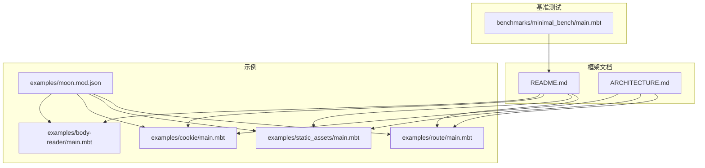
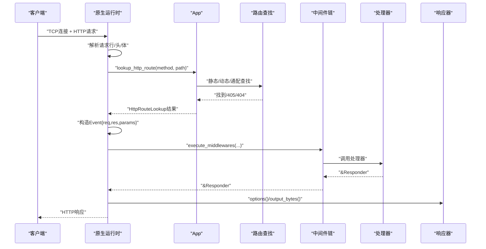
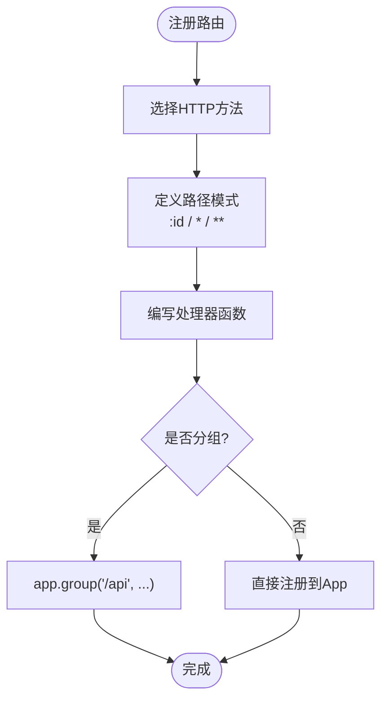
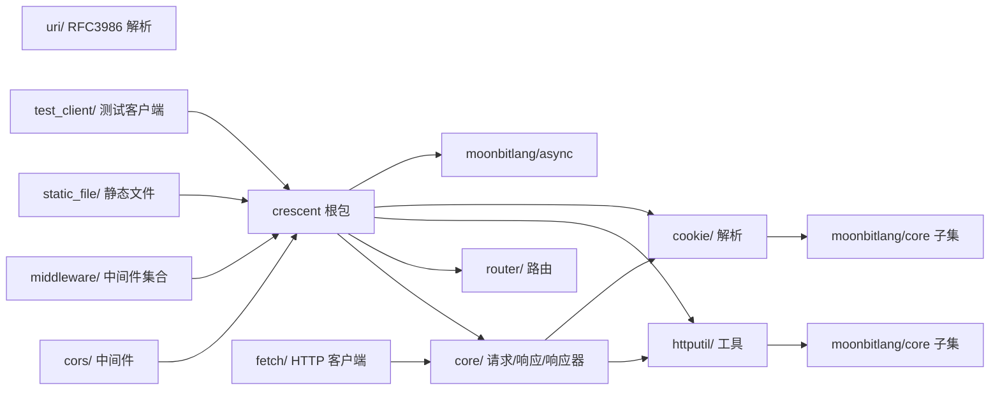

# Web 应用开发

<cite>
**本文引用的文件**
- [README.md](file://README.md)
- [README.mbt.md](file://README.mbt.md)
- [ARCHITECTURE.md](file://ARCHITECTURE.md)
- [examples/route/main.mbt](file://examples/route/main.mbt)
- [examples/static_assets/main.mbt](file://examples/static_assets/main.mbt)
- [examples/cookie/main.mbt](file://examples/cookie/main.mbt)
- [examples/body-reader/main.mbt](file://examples/body-reader/main.mbt)
- [examples/moon.mod.json](file://examples/moon.mod.json)
- [benchmarks/minimal_bench/main.mbt](file://benchmarks/minimal_bench/main.mbt)
</cite>

## 目录
1. [简介](#简介)
2. [项目结构](#项目结构)
3. [核心组件](#核心组件)
4. [架构总览](#架构总览)
5. [详细组件分析](#详细组件分析)
6. [依赖关系分析](#依赖关系分析)
7. [性能考虑](#性能考虑)
8. [故障排查指南](#故障排查指南)
9. [结论](#结论)
10. [附录](#附录)

## 简介
本指南面向希望使用 Crescent 框架在 MoonBit 上构建 Web 应用的开发者。文档从最简单的 Hello World 开始，逐步讲解应用初始化、路由配置、处理器编写、中间件与静态资源、类型安全的 JSON 序列化（derive(ToJson, FromJson)）、RESTful API 设计模式、错误处理策略、测试方法与部署流程，并提供适合初学者的循序渐进学习路径与面向资深开发者的高级技巧。

## 项目结构
仓库包含 Crescent 框架的官方文档、示例与基准测试。核心内容包括：
- 框架文档：README 与 ARCHITECTURE 文档，系统阐述框架设计理念、请求生命周期、路由与中间件模型、响应器与类型安全 JSON。
- 示例程序：路由、静态资源、Cookie、BodyReader 等演示，展示常见 Web 功能。
- 示例模块配置：moon.mod.json 展示了示例工程的依赖与目标平台。
- 基准测试：最小化服务器示例，便于理解底层运行时与性能基线。

**图表来源**
- [README.md](file://README.md)
- [ARCHITECTURE.md](file://ARCHITECTURE.md)
- [examples/route/main.mbt](file://examples/route/main.mbt)
- [examples/static_assets/main.mbt](file://examples/static_assets/main.mbt)
- [examples/cookie/main.mbt](file://examples/cookie/main.mbt)
- [examples/body-reader/main.mbt](file://examples/body-reader/main.mbt)
- [examples/moon.mod.json](file://examples/moon.mod.json)
- [benchmarks/minimal_bench/main.mbt](file://benchmarks/minimal_bench/main.mbt)

**章节来源**
- [README.md](file://README.md)
- [ARCHITECTURE.md](file://ARCHITECTURE.md)
- [examples/moon.mod.json](file://examples/moon.mod.json)

## 核心组件
- 应用容器 App：负责注册路由、挂载中间件、管理 WebSocket 路由、处理未匹配请求与启动服务。
- 请求事件 Event：封装 HttpRequest、HttpResponse 与参数映射，作为处理器与中间件的统一输入。
- 中间件链：洋葱模型执行，支持按路径前缀作用域过滤。
- 路由系统：静态路由 O(1) 查找 + 动态路由（参数、通配符、多级通配）基于基数树 O(路径长度)。
- 响应器 Responder：统一处理字符串、JSON、字节、HTML 等返回值的序列化与头部设置。
- 类型安全 JSON：通过 derive(ToJson, FromJson) 自动生成序列化/反序列化，前后端共享类型契约。

**章节来源**
- [ARCHITECTURE.md](file://ARCHITECTURE.md)
- [README.md](file://README.md)

## 架构总览
Crescent 的请求生命周期从原生异步运行时接收 TCP 连接与 HTTP 请求，解析后进入路由查找，随后按洋葱模型执行中间件链，最终调用处理器生成响应器，再由运行时完成序列化与写回。

**图表来源**
- [ARCHITECTURE.md](file://ARCHITECTURE.md)

## 详细组件分析

### Hello World 与应用初始化
- 使用 App 创建应用实例，注册根路径处理器，启动服务监听端口。
- 支持错误捕获输出，便于调试。

参考路径
- [README.md](file://README.md)
- [examples/route/main.mbt](file://examples/route/main.mbt)

**章节来源**
- [README.md](file://README.md)
- [examples/route/main.mbt](file://examples/route/main.mbt)

### 路由配置与处理器编写
- 支持 GET/POST/PUT/PATCH/DELETE 等方法注册，以及动态参数、通配符与多级通配。
- 提供 group 分组与 resource 快捷注册 REST 资源。
- 支持自定义 404 处理器与 OPTIONS 隐式处理。

参考路径
- [README.md](file://README.md)
- [examples/route/main.mbt](file://examples/route/main.mbt)

**图表来源**
- [README.md](file://README.md)
- [examples/route/main.mbt](file://examples/route/main.mbt)

**章节来源**
- [README.md](file://README.md)
- [examples/route/main.mbt](file://examples/route/main.mbt)

### 中间件与安全头
- 全局或按路径前缀挂载中间件，洋葱模型执行，可读取/修改请求与响应。
- 内置安全头、请求 ID、CORS 等中间件；也可自定义限流等中间件。
- 测试客户端支持内联测试，无需网络端口。

参考路径
- [README.md](file://README.md)
- [examples/route/main.mbt](file://examples/route/main.mbt)

**章节来源**
- [README.md](file://README.md)
- [examples/route/main.mbt](file://examples/route/main.mbt)

### 静态资源与 Cookie
- 静态资源挂载：将本地目录映射为 URL 前缀，支持 ETag、条件请求与索引页回退。
- Cookie 设置/读取/删除：支持属性如 Max-Age、HttpOnly、SameSite 等。

参考路径
- [README.md](file://README.md)
- [examples/static_assets/main.mbt](file://examples/static_assets/main.mbt)
- [examples/cookie/main.mbt](file://examples/cookie/main.mbt)

**章节来源**
- [README.md](file://README.md)
- [examples/static_assets/main.mbt](file://examples/static_assets/main.mbt)
- [examples/cookie/main.mbt](file://examples/cookie/main.mbt)

### 类型安全 JSON 与 BodyReader
- 结构体通过 derive(ToJson, FromJson) 实现自动序列化/反序列化，前后端共享契约。
- 自定义 BodyReader：实现 @crescent.BodyReader trait，从请求体解析自定义格式（如 CSV）。
- 事件体解析：event.json() 自动处理无效 JSON 并返回 400。

参考路径
- [README.md](file://README.md)
- [examples/body-reader/main.mbt](file://examples/body-reader/main.mbt)

**章节来源**
- [README.md](file://README.md)
- [examples/body-reader/main.mbt](file://examples/body-reader/main.mbt)

### WebSocket 与 HTTP 客户端
- WebSocket：支持 onOpen/onMessage/onClose 事件，频道订阅/发布。
- HTTP 客户端：在处理器中发起对外部服务的 HTTP 请求，自动类型化读取响应体。

参考路径
- [README.md](file://README.md)

**章节来源**
- [README.md](file://README.md)

### 错误处理策略
- 所有 get/post/put/patch/delete 处理器自动捕获异常，映射为结构化错误响应（400/404/500 等）。
- 对于健康检查等永不抛错的处理器，使用 get_raw。
- try_json 提供自定义错误处理分支。

参考路径
- [README.md](file://README.md)

**章节来源**
- [README.md](file://README.md)

### 测试方法
- 使用 @test_client.TestClient 在进程内发起请求，断言状态码、头部与响应体。
- 可对 JSON 序列化、安全头、请求 ID、路由行为进行单元测试。

参考路径
- [README.md](file://README.md)

**章节来源**
- [README.md](file://README.md)

### 部署与运行时配置
- 目标平台：仅原生（native），默认 preferred-target 为 native。
- 服务选项：最大并发连接数、请求体大小限制、读取超时、WebSocket 最大消息/队列容量/溢出策略等。
- 优雅关闭：通过异步队列触发关闭信号。
- 外部服务器集成：可在已有 http.Server 上运行。

参考路径
- [README.md](file://README.md)
- [examples/moon.mod.json](file://examples/moon.mod.json)

**章节来源**
- [README.md](file://README.md)
- [examples/moon.mod.json](file://examples/moon.mod.json)

## 依赖关系分析
Crescent 采用子包化设计，核心依赖 moonbitlang/async 提供原生异步 I/O，核心类型与工具分布在 core、router、httputil、cookie、uri 等子包中，彼此低耦合、可独立测试。

**图表来源**
- [ARCHITECTURE.md](file://ARCHITECTURE.md)

**章节来源**
- [ARCHITECTURE.md](file://ARCHITECTURE.md)

## 性能考虑
- 路由查找：静态路由 O(1)，动态路由 O(路径长度)，基数树优先级确保静态/参数/通配命中顺序。
- 中间件链：递归洋葱模型，避免重复分配；无中间件时走快速路径。
- 原生运行时：基于 moonbitlang/async 的协程与非阻塞 I/O，减少上下文切换。
- 基准测试：可通过 minimal_bench 示例验证最小化服务器的吞吐与延迟基线。

**章节来源**
- [ARCHITECTURE.md](file://ARCHITECTURE.md)
- [benchmarks/minimal_bench/main.mbt](file://benchmarks/minimal_bench/main.mbt)

## 故障排查指南
- 404/405：确认路由是否注册、方法是否匹配、是否存在隐式 OPTIONS。
- 参数解析失败：检查 require_param_int/require_param 的调用与传入值类型。
- JSON 解析失败：确认请求体格式与 Content-Type，使用 try_json 获取详细错误信息。
- 中间件未生效：检查 base_path 是否匹配当前请求路径。
- 静态资源不生效：确认挂载前缀与文件路径、索引页回退逻辑。
- WebSocket：确认升级握手成功、频道订阅/发布逻辑正确。

**章节来源**
- [README.md](file://README.md)

## 结论
Crescent 以类型安全与原生性能为核心，提供从路由、中间件、静态资源到 WebSocket 与 HTTP 客户端的完整能力。借助 derive(ToJson, FromJson) 与内置测试客户端，开发者可以快速构建健壮的 REST API，并通过分组、资源注册与中间件体系实现企业级功能。建议初学者从 Hello World 与示例入手，逐步掌握路由与中间件，再深入到类型安全 JSON、WebSocket 与部署配置。

## 附录

### 从零到一：Hello World 到 Todo API
- Hello World：创建 App、注册根路径处理器、启动服务。
- 定义类型：Todo、CreateTodo 等结构体，derive(ToJson, FromJson)。
- 注册路由：列出全部、按 ID 查询、创建、健康检查。
- 中间件：安全头、请求 ID、日志、认证（按需）。
- 测试：使用 TestClient 断言状态码与响应体。
- 部署：原生构建与运行，配置服务选项与优雅关闭。

参考路径
- [README.md](file://README.md)
- [examples/route/main.mbt](file://examples/route/main.mbt)

**章节来源**
- [README.md](file://README.md)
- [examples/route/main.mbt](file://examples/route/main.mbt)