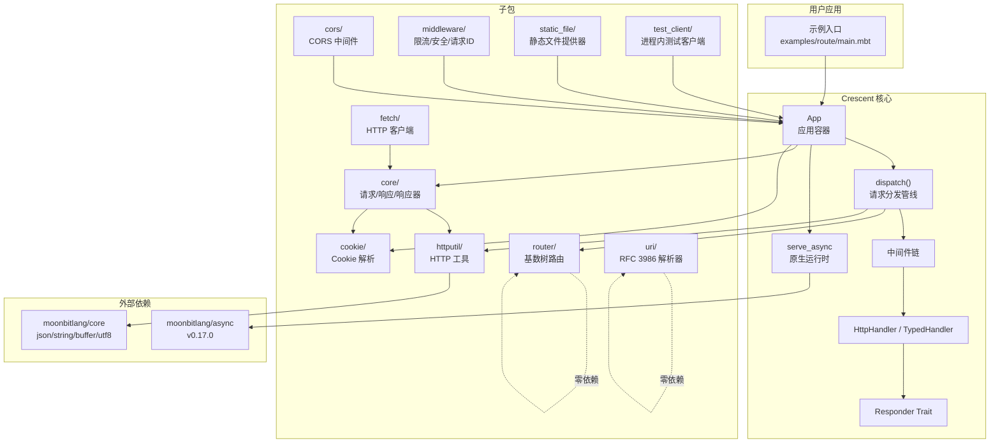
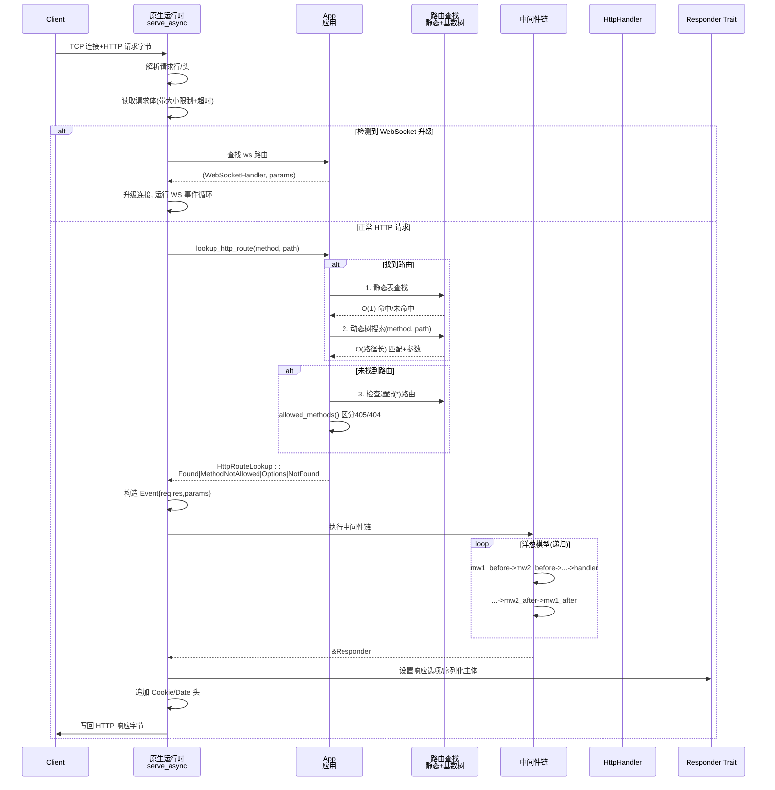
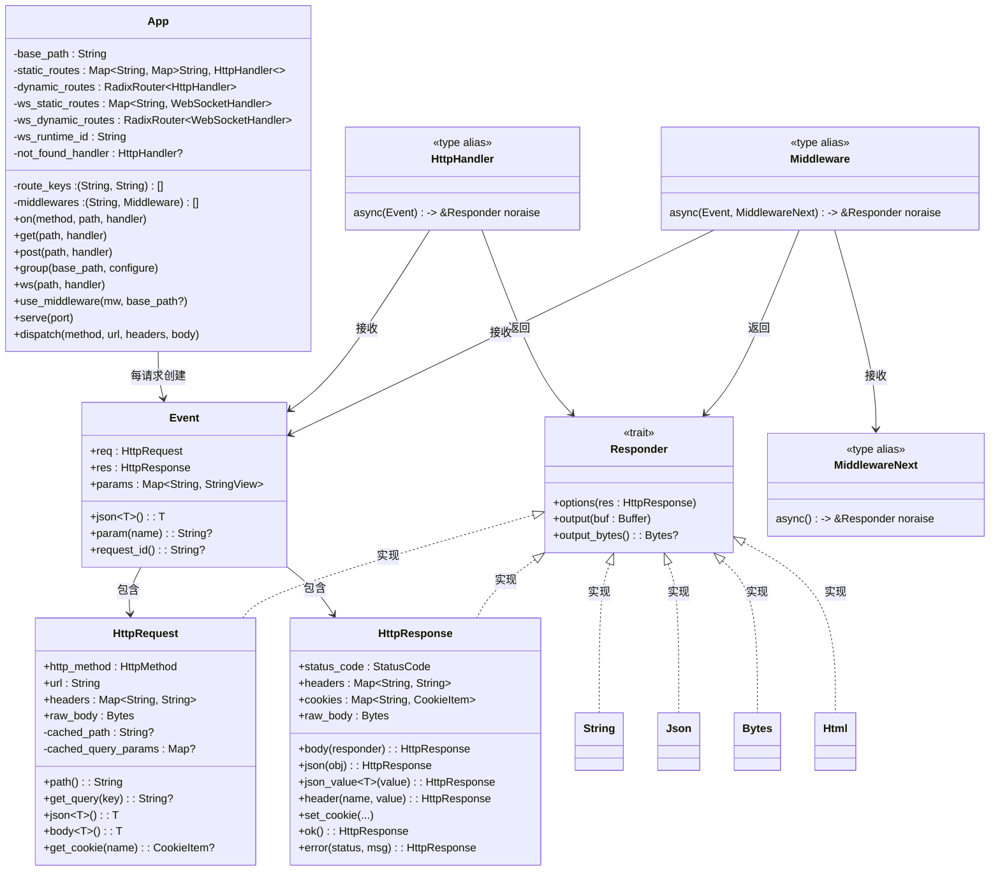
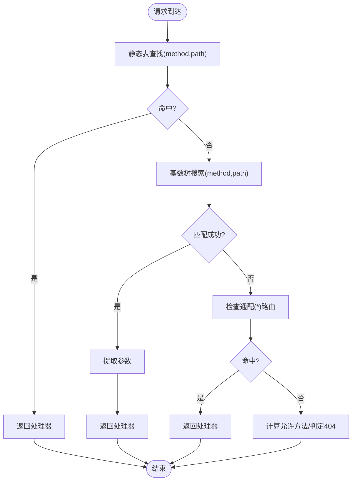
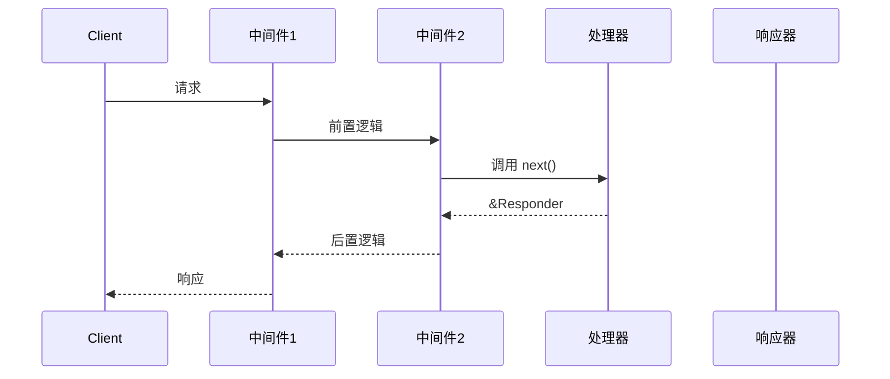
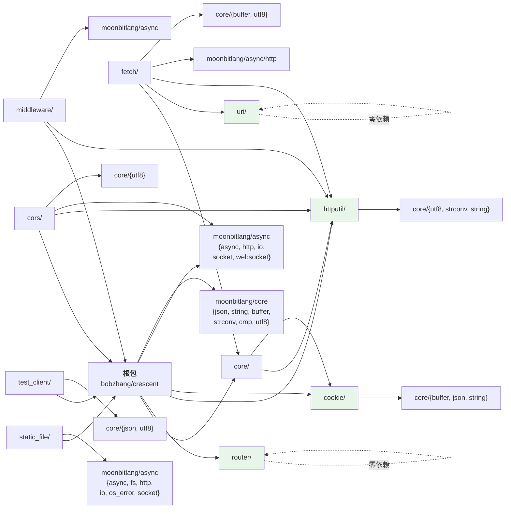

# Web 开发框架

<cite>
**本文引用的文件**
- [README.mbt.md](file://README.mbt.md)
- [README.md](file://README.md)
- [ARCHITECTURE.md](file://ARCHITECTURE.md)
- [index.mbt](file://index.mbt)
- [serve_async.mbt](file://serve_async.mbt)
- [route\main.mbt](file://examples/route/main.mbt)
- [static_assets\main.mbt](file://examples/static_assets/main.mbt)
- [websocket\README.mbt.md](file://moonbitlang/async/src/websocket/README.mbt.md)
</cite>

## 目录
1. [简介](#简介)
2. [项目结构](#项目结构)
3. [核心组件](#核心组件)
4. [架构总览](#架构总览)
5. [详细组件分析](#详细组件分析)
6. [依赖关系分析](#依赖关系分析)
7. [性能考量](#性能考量)
8. [故障排查指南](#故障排查指南)
9. [结论](#结论)
10. [附录](#附录)

## 简介
Crescent 是一个为 MoonBit 设计的原生优先、类型安全、异步友好的 Web 框架。它基于 moonbitlang/async 协作式异步运行时，提供 HTTP 与 WebSocket 支持，并通过洋葱模型中间件、类型化处理器、响应器（Responder）等设计，简化了 Web 应用的构建流程。框架强调“零样板代码”的错误映射：在类型化处理器中抛出的异常会自动转换为结构化的 HTTP 错误响应；对于健康检查等永不失败的处理器，可使用原始处理器避免包裹。

- 原生目标：仅支持 native 后端，不支持 wasm/js。
- 异步原生：请求处理与网络 I/O 全部建立在 moonbitlang/async 的非阻塞套接字与计时器之上。
- 路由与中间件：静态路由 O(1)，动态路由基于基数树 O(路径长度)；中间件采用洋葱模型，支持按路径前缀作用域。
- 静态文件与 CORS：内置静态文件提供器与 CORS 中间件；HTTP 客户端 fetch 提供对外部服务调用能力。
- 测试：提供进程内测试客户端，无需网络 I/O，快速回归。

章节来源
- [README.mbt.md:1-35](file://README.mbt.md#L1-L35)
- [README.md:1-35](file://README.md#L1-L35)

## 项目结构
仓库包含 Crescent 核心与子包，以及示例与架构文档。根包提供应用容器 App、路由注册、中间件链与服务启动；子包涵盖核心类型、路由器、HTTP 工具、Cookie 解析、CORS、中间件集合、URI 解析、静态文件提供器、HTTP 客户端、测试客户端等。

图表来源
- [ARCHITECTURE.md:207-259](file://ARCHITECTURE.md#L207-L259)

章节来源
- [ARCHITECTURE.md:203-259](file://ARCHITECTURE.md#L203-L259)

## 核心组件
- App：应用容器，维护静态/动态路由表、WebSocket 路由、中间件列表、路由键清单、未找到处理器等。支持路由组合并入父级状态，提供 ws 注册、not_found 处理器设置与查询等。
- 请求/响应：HttpRequest/HttpResponse 封装方法、URL、头、体、Cookie、状态码与头部；事件 Event 在每次请求中创建，携带解析后的请求、空响应与参数映射。
- 中间件：洋葱模型，接收 Event 与下一个中间件的延续函数；可前置检查请求、后置检查响应；支持按 base_path 作用域过滤。
- 响应器（Responder）：统一的多态返回接口，支持 String、Json、Bytes、HttpResponse、HttpRequest、Html 等类型，自动设置 Content-Type 并序列化输出。
- 类型化处理器：捕获异常并映射为结构化错误；原始处理器（get_raw）永不失败，适合健康检查或纯文本场景。
- 服务运行时：基于 moonbitlang/async 的原生 HTTP 服务器，支持连接数限制、请求体大小与读取超时、WebSocket 选项、优雅关闭与现有服务器托管。

章节来源
- [index.mbt:1-291](file://index.mbt#L1-L291)
- [README.mbt.md:693-721](file://README.mbt.md#L693-L721)
- [README.mbt.md:722-747](file://README.mbt.md#L722-L747)
- [serve_async.mbt:262-614](file://serve_async.mbt#L262-L614)

## 架构总览
Crescent 的请求生命周期从 TCP 连接与 HTTP 请求字节开始，经由解析、请求体读取、路由查找、中间件链执行、处理器调用、响应器序列化，最终写回客户端。WebSocket 升级路径独立于 HTTP 路由表，但共享同一原生运行时。

图表来源
- [ARCHITECTURE.md:362-412](file://ARCHITECTURE.md#L362-L412)

章节来源
- [ARCHITECTURE.md:357-432](file://ARCHITECTURE.md#L357-L432)

## 详细组件分析

### App 类型与路由注册
- 数据结构拆分：静态路由表（Map[method][path]）用于 O(1) 查找；动态路由（基数树）用于参数化路径；WebSocket 路由同构；中间件按(base_path, middleware)存储；route_keys 用于路由枚举。
- 路由组：group(base_path, configure) 创建子 App，将中间件与路由合并回父级，支持作用域 not_found 处理器与最长匹配策略。
- WebSocket：ws(path, handler) 支持静态/动态路径，基数树保证与 HTTP 路由一致的优先级顺序。

图表来源
- [ARCHITECTURE.md:440-535](file://ARCHITECTURE.md#L440-L535)

章节来源
- [index.mbt:1-291](file://index.mbt#L1-L291)
- [ARCHITECTURE.md:551-611](file://ARCHITECTURE.md#L551-L611)

### 路由系统：静态与动态
- 路由模式：静态段、命名参数(:id)、单段通配(*)、多段通配(**)；编译期解析为 CompiledRoute，减少运行时开销。
- 基数树：每方法一棵树，优先级为静态 > 参数 > 单段通配 > 多段通配；支持回溯匹配，确保正确性与一致性。
- 边界情况：形如“/**/suffix”的路由走备用列表线性扫描。

图表来源
- [ARCHITECTURE.md:614-711](file://ARCHITECTURE.md#L614-L711)

章节来源
- [ARCHITECTURE.md:614-711](file://ARCHITECTURE.md#L614-L711)

### 中间件：洋葱模型与作用域
- 类型定义：Middleware(event, next) -> &Responder，next 为延续函数；支持前置检查请求、后置检查响应、短路返回。
- 执行：execute_middleware_chain 递归构建洋葱，先注册者在外层；按 base_path 过滤生效范围。
- 示例：日志中间件记录耗时；安全头中间件；请求 ID 中间件；按 /api 作用域鉴权。

图表来源
- [ARCHITECTURE.md:713-792](file://ARCHITECTURE.md#L713-L792)
- [README.mbt.md:138-177](file://README.mbt.md#L138-L177)

章节来源
- [ARCHITECTURE.md:713-792](file://ARCHITECTURE.md#L713-L792)
- [README.mbt.md:138-177](file://README.mbt.md#L138-L177)

### 服务运行时与并发模型
- 原生 HTTP 服务器：基于 moonbitlang/async 的非阻塞套接字与计时器；支持最大连接数、请求体大小与读取超时、WebSocket 选项、优雅关闭队列、现有服务器托管。
- 并发：每个请求在原生运行时中以异步任务处理，通过协作式调度避免阻塞；keep-alive 循环中捕获传输错误并关闭连接。
- 关闭：通过 @async.Queue 接收信号触发停止；关闭后不再接受新连接。

章节来源
- [serve_async.mbt:262-614](file://serve_async.mbt#L262-L614)
- [README.mbt.md:611-627](file://README.mbt.md#L611-L627)

### 示例：从 Hello World 到复杂应用
- Hello World：最简示例，注册根路径处理器并启动服务。
- 路由示例：演示全局中间件、分组中间件、动态路由与通配符、自定义 404、异步响应、JSON 响应、回显请求体等。
- 静态资源：挂载 /assets 前缀，将 ./public 下的文件作为 /assets/<文件名> 提供，支持 ETag、If-Modified-Since/If-None-Match、内容协商与目录索引回退。
- WebSocket：在 /chat 上下文，根据事件类型进行订阅/广播/回显。
- Todo API：定义类型（ToJSON/FromJSON），注册 CRUD 路由，自动错误映射，使用 TestClient 进行无网络测试。

章节来源
- [README.mbt.md:20-29](file://README.mbt.md#L20-L29)
- [examples/route/main.mbt:1-86](file://examples/route/main.mbt#L1-L86)
- [examples/static_assets/main.mbt:1-33](file://examples/static_assets/main.mbt#L1-L33)
- [README.mbt.md:406-483](file://README.mbt.md#L406-L483)
- [README.mbt.md:38-297](file://README.mbt.md#L38-L297)

## 依赖关系分析
Crescent 采用模块化设计，根包聚合各子包；部分子包为零依赖（router/、uri/、cookie/），便于独立测试与复用。fetch 子包复用 core/ 类型解耦 HTTP 客户端。

图表来源
- [ARCHITECTURE.md:283-346](file://ARCHITECTURE.md#L283-L346)

章节来源
- [ARCHITECTURE.md:283-346](file://ARCHITECTURE.md#L283-L346)

## 性能考量
- 路由查找：静态路径 O(1)，动态路径 O(路径长度)，预编译路由模板，请求时缓存路径与查询解析。
- 零分配头处理：大小写不敏感的 ASCII 比较，避免字符串分配。
- 直接字节输出：Bytes 与 HttpResponse 绕过中间缓冲区，降低拷贝与分配。
- 中间件与处理器：最小化闭包捕获与堆分配，优先使用简单函数与局部变量。
- 并发与背压：合理设置 max_connections、WebSocket 出站队列容量与溢出策略，避免内存膨胀。
- 静态文件：利用 ETag 与条件请求，减少带宽与 CPU；启用合适的压缩变体（如 .gz）提升传输效率。

章节来源
- [README.mbt.md:884-891](file://README.mbt.md#L884-L891)

## 故障排查指南
- 错误映射：类型化处理器中的异常自动映射为结构化错误响应；非法 JSON、无效参数、未捕获异常分别对应 400/404/500。
- 原始处理器：get_raw 适用于永不失败的处理器（如健康检查），避免包裹导致的额外开销。
- 自定义 404：通过 set_not_found_handler 注册未命中路由的处理器；支持按组作用域的 not_found 处理器，最长匹配优先。
- CORS 问题：确认已注册 CORS 中间件且允许的源/方法/凭据配置正确；浏览器预检请求会先发送 OPTIONS。
- WebSocket：确认升级握手成功、消息大小限制与读取超时设置合理；关注出站队列溢出策略与连接空闲关闭时间。
- 优雅关闭：通过 @async.Queue 发送信号触发停止；确保在关闭期间处理完剩余请求。

章节来源
- [README.mbt.md:693-721](file://README.mbt.md#L693-L721)
- [README.mbt.md:628-627](file://README.mbt.md#L628-L627)
- [README.mbt.md:573-586](file://README.mbt.md#L573-L586)
- [README.mbt.md:462-483](file://README.mbt.md#L462-L483)
- [index.mbt:214-251](file://index.mbt#L214-L251)

## 结论
Crescent 以类型安全与异步原生为核心，结合洋葱模型中间件、两层路由结构与响应器抽象，提供了简洁而强大的 Web 开发体验。其模块化设计与零依赖子包提升了可测试性与可复用性；丰富的示例与测试工具降低了上手门槛。通过合理的性能优化与部署实践，可在生产环境中获得稳定高效的运行表现。

## 附录
- 快速开始：安装 Crescent，编写 Hello World，启动服务并访问本地端口。
- 学习路径建议：
  - 初学者：从 Hello World 与路由示例入手，逐步掌握中间件、静态文件与 CORS。
  - 进阶者：构建 Todo API，学习资源路由、错误映射与测试客户端；引入 WebSocket 与 HTTP 客户端。
  - 专家：研究架构文档与核心实现，理解路由优先级、中间件链与服务运行时细节，进行性能调优与扩展。

章节来源
- [README.mbt.md:14-35](file://README.mbt.md#L14-L35)
- [README.mbt.md:38-297](file://README.mbt.md#L38-L297)
- [ARCHITECTURE.md:1-32](file://ARCHITECTURE.md#L1-L32)