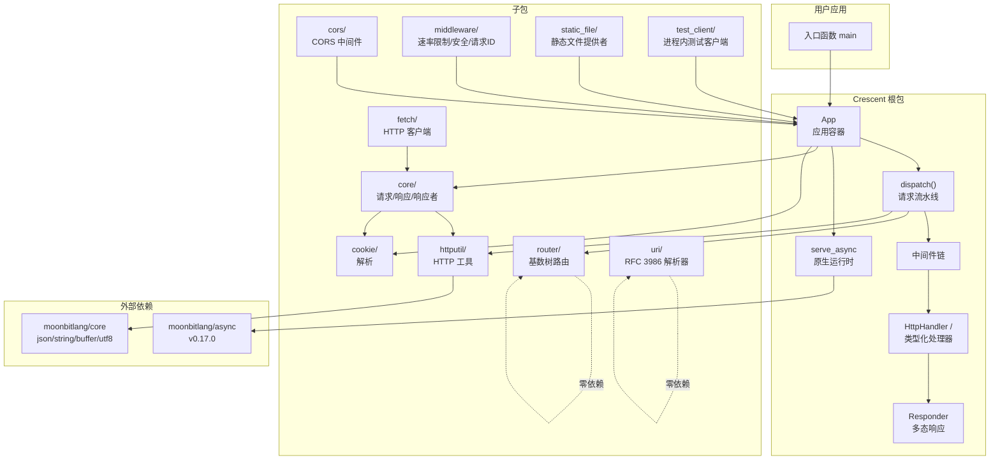
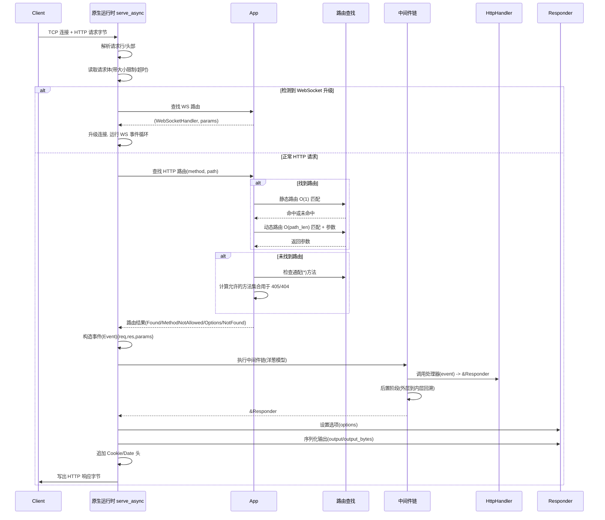
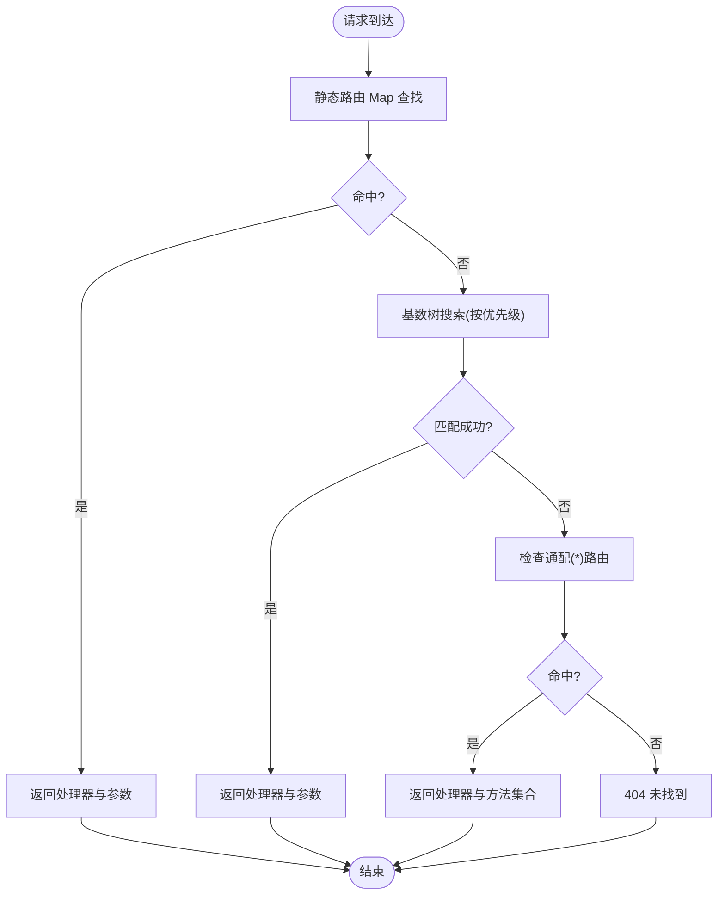
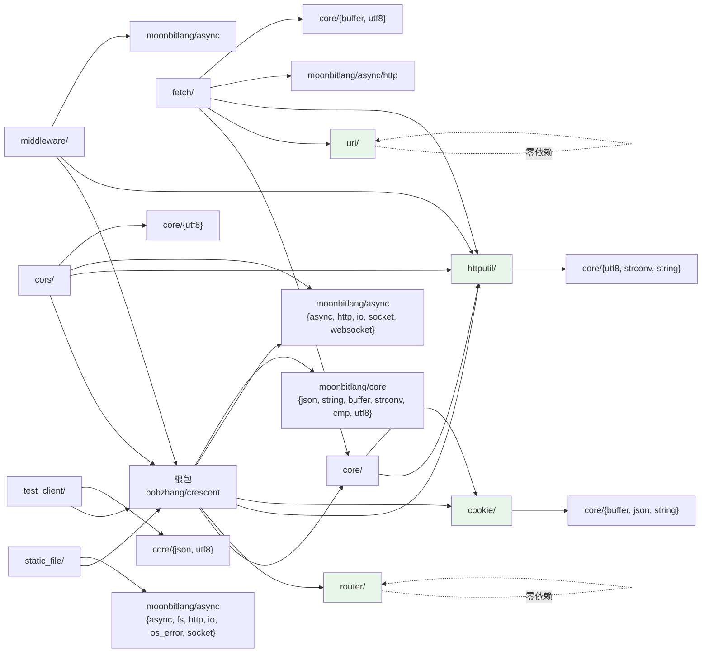

# 框架介绍与架构

<cite>
**本文引用的文件**
- [README.md](file://README.md)
- [ARCHITECTURE.md](file://ARCHITECTURE.md)
- [moon.mod.json](file://moon.mod.json)
- [README.mbt.md](file://README.mbt.md)
- [examples/moon.mod.json](file://examples/moon.mod.json)
- [benchmarks/moon.mod.json](file://benchmarks/moon.mod.json)
</cite>

## 目录
1. [引言](#引言)
2. [项目结构](#项目结构)
3. [核心组件](#核心组件)
4. [架构总览](#架构总览)
5. [详细组件分析](#详细组件分析)
6. [依赖分析](#依赖分析)
7. [性能考量](#性能考量)
8. [故障排查指南](#故障排查指南)
9. [结论](#结论)
10. [附录](#附录)

## 引言
Crescent 是一个为 MoonBit 设计的原生优先、类型安全、面向 AI 的异步 HTTP 与 WebSocket 服务器框架。它基于 MoonBit 的协作式异步运行时 moonbitlang/async 构建，直接使用原生系统调用进行 I/O，目标仅限于原生后端（非 WASM/JS）。Crescent 的设计理念是“让开发者像写 MoonBit 程序一样编写 Web 服务”，自动处理 TCP 接受、HTTP 解析、路由、序列化、并发与协议细节，用户只需专注于业务逻辑。

- 原生性能：直接使用 moonbitlang/async 提供的非阻塞 TCP 套接字与定时器，避免虚拟机层抽象带来的额外开销。
- 类型安全：通过 MoonBit 的强类型系统与内置 JSON 序列化能力，确保 API 合同在前后端一致编译，减少运行时错误。
- AI 友好：框架强调“AI 友好”的关键词，并提供内建的测试客户端与丰富的响应助手，便于构建可测试、可演进的服务。

章节来源
- [README.md:1-59](file://README.md#L1-L59)
- [moon.mod.json:1-21](file://moon.mod.json#L1-L21)

## 项目结构
Crescent 采用模块化组织，根包负责应用容器、请求分发与核心类型，同时包含十个子包，覆盖路由、HTTP 工具、Cookie、CORS、中间件、URI 解析、静态资源、HTTP 客户端、测试客户端等职责。外部依赖主要为 moonbitlang/x 与 moonbitlang/async。

图表来源
- [ARCHITECTURE.md:207-259](file://ARCHITECTURE.md#L207-L259)

章节来源
- [ARCHITECTURE.md:203-259](file://ARCHITECTURE.md#L203-L259)
- [moon.mod.json:1-21](file://moon.mod.json#L1-L21)

## 核心组件
- App：应用容器，维护静态与动态路由表、中间件栈、WebSocket 路由、基础路径与自定义 404 处理器。支持路由组与资源式 CRUD 注册。
- 请求事件 Event：封装 HttpRequest、HttpResponse 与参数映射，提供 JSON 解析、参数提取与请求 ID 访问。
- 中间件 Middleware：洋葱模型，可访问请求与响应，支持按路径前缀作用域；内置安全头、请求 ID、速率限制与 CORS。
- Responder Trait：多态响应接口，将返回值自动序列化为合适的 HTTP 响应体与头部。
- Typed Handler：类型化处理器自动捕获错误并映射为标准 HTTP 错误响应；raw 版本要求无异常，适合健康检查等场景。
- 服务器运行时 serve_async：原生 I/O 桥接 moonbitlang/async，负责连接接受、请求解析、路由查找、中间件执行、响应序列化与写出。

章节来源
- [ARCHITECTURE.md:440-535](file://ARCHITECTURE.md#L440-L535)
- [ARCHITECTURE.md:869-915](file://ARCHITECTURE.md#L869-L915)
- [ARCHITECTURE.md:1061-1129](file://ARCHITECTURE.md#L1061-L1129)

## 架构总览
Crescent 的请求生命周期从原生 TCP 连接开始，经 moonbitlang/async 解析 HTTP 请求，再由 App 查找路由，执行中间件链，最终通过 Responder 将处理器返回值序列化为响应字节流。WebSocket 升级路径独立但共享同一运行时基础设施。

图表来源
- [ARCHITECTURE.md:362-412](file://ARCHITECTURE.md#L362-L412)

章节来源
- [ARCHITECTURE.md:357-432](file://ARCHITECTURE.md#L357-L432)

## 详细组件分析

### 路由系统：静态与动态路由的两层设计
- 静态路由：以 Map[method][path] 存储，O(1) 查找，适用于固定路径如 /users、/health。
- 动态路由：使用基数树 RadixRouter，支持命名参数(:id)、单段通配(*)与多段通配(**)，匹配复杂度 O(路径长度)。
- 路由优先级：静态 > 命名参数 > 单段通配 > 多段通配，且与注册顺序无关，保证语义稳定。
- 路由编译：在注册时将模式编译为 CompiledRoute，运行时复用，避免重复解析。

图表来源
- [ARCHITECTURE.md:414-432](file://ARCHITECTURE.md#L414-L432)

章节来源
- [ARCHITECTURE.md:614-711](file://ARCHITECTURE.md#L614-L711)

### 中间件机制：洋葱模型与路径作用域
- 类型定义：Middleware(event, next) -> &Responder，MiddlewareNext 为后续管道的延续闭包。
- 执行模型：递归构建洋葱链，先按注册顺序进入前置逻辑，再调用 next()，最后按逆序执行后置逻辑。
- 路径作用域：中间件可指定 base_path，仅对匹配路径生效；空 base_path 表示全局。
- 快速路径：未注册或不匹配的中间件直接跳过，避免不必要的开销。

章节来源
- [ARCHITECTURE.md:713-792](file://ARCHITECTURE.md#L713-L792)

### 多态响应者 Responder：统一序列化入口
- 接口方法：options(res)、output(buf)、output_bytes()，分别设置状态码/头部、缓冲区序列化与快速路径。
- 内置实现：String、Json、Bytes、HttpResponse、HttpRequest、Html 等，自动设置 Content-Type 并序列化。
- 扩展点：可通过实现 Responder 为自定义类型提供序列化策略。

章节来源
- [ARCHITECTURE.md:794-867](file://ARCHITECTURE.md#L794-L867)

### 类型化处理器与错误映射
- 两类处理器：
  - typed：app.get/post 等，自动包装错误，将 HttpError 映射为 JSON 错误响应，JSON 解析错误映射为 400，未知错误映射为 500。
  - raw：app.get_raw，要求 noraise，适合健康检查等不会抛错的场景。
- 错误安全：未知错误仅记录真实消息，向客户端返回通用错误，避免泄露内部细节。

章节来源
- [ARCHITECTURE.md:869-915](file://ARCHITECTURE.md#L869-L915)

### 原生服务器运行时 serve_async
- 服务变体：serve、serve_on、run_native_server，支持优雅关闭与自定义配置。
- 关键职责：TCP 接受、HTTP 解析、请求体读取(带大小限制/超时)、WebSocket 升级、路由查找、中间件执行、响应序列化与写出。
- 配置项：最大并发连接、请求体大小限制、读取超时、处理器超时、WebSocket 最大消息、队列容量与溢出策略、读取超时等。

章节来源
- [ARCHITECTURE.md:1061-1129](file://ARCHITECTURE.md#L1061-L1129)

### WebSocket：持久双向通道
- 用户 API：ws("/chat/:room", handler)，事件枚举 Open/Message/Close，消息文本或二进制。
- Peer 操作：text/binary 发送、订阅/取消订阅/广播频道、参数提取。
- Hub 架构：每实例一个 NativeWebSocketHub，连接映射与频道订阅管理；每个连接有出站队列与溢出策略，防止慢消费者导致内存膨胀。

章节来源
- [ARCHITECTURE.md:970-1059](file://ARCHITECTURE.md#L970-L1059)

### 子包与工具
- core：请求/响应/响应者类型，被 fetch 等子包复用。
- router：基数树路由与路由编译。
- httputil：HTTP 头部操作、URL 编解码、multipart 解析、日期格式化等。
- cookie：Cookie 解析与序列化。
- cors：CORS 中间件，处理预检与凭据场景。
- middleware：内置中间件（速率限制、安全头、请求 ID）。
- uri：RFC 3986 URI 解析。
- static_file：文件系统静态资源提供者，支持 ETag、条件请求与目录索引。
- fetch：HTTP 客户端，返回根包的 HttpResponse。
- test_client：进程内测试客户端，绕过网络直连 App::dispatch。

章节来源
- [ARCHITECTURE.md:1131-1213](file://ARCHITECTURE.md#L1131-L1213)

## 依赖分析
Crescent 的依赖关系清晰，根包依赖 moonbitlang/async 与 moonbitlang/x；核心子包尽可能保持零内部依赖，提升可测试性与复用性。

图表来源
- [ARCHITECTURE.md:283-346](file://ARCHITECTURE.md#L283-L346)

章节来源
- [ARCHITECTURE.md:283-346](file://ARCHITECTURE.md#L283-L346)
- [moon.mod.json:4-7](file://moon.mod.json#L4-L7)

## 性能考量
- 路由性能：静态路由 O(1) + 动态路由 O(路径长度)，兼顾常见场景与灵活性。
- 中间件链：递归洋葱模型，无反射，编译期展开，开销可控。
- 响应序列化：Responder.output_bytes 快速路径避免中间缓冲分配；默认按类型自动设置 Content-Type。
- I/O 与并发：基于 moonbitlang/async 的非阻塞套接字与定时器，支持高并发连接与低延迟响应。
- WebSocket：连接级出站队列与溢出策略，防止慢消费者拖垮服务器。
- 配置驱动：通过 NativeServeOptions 在启动时校验并设定上限，避免运行时动态调整带来的不确定性。

章节来源
- [ARCHITECTURE.md:261-280](file://ARCHITECTURE.md#L261-L280)
- [ARCHITECTURE.md:1112-1129](file://ARCHITECTURE.md#L1112-L1129)

## 故障排查指南
- 常见错误映射
  - JSON 解析失败：映射为 400，携带解析错误信息。
  - 参数缺失/类型错误：require_param_int 等会触发 400。
  - 业务异常：raise HttpError(status, message) -> 对应状态码与 JSON 错误体。
  - 未捕获异常：映射为 500，客户端仅见通用错误，日志保留真实堆栈。
- 调试建议
  - 使用 @middleware.request_id() 为请求生成唯一 ID，便于跨服务追踪。
  - 在开发环境启用详细日志，结合测试客户端验证路由、中间件与错误映射。
  - 对 WebSocket 场景，关注队列溢出策略与读取超时配置，避免内存增长。
- 测试与验证
  - 使用 @test_client.TestClient 进行黑盒测试，覆盖路由、中间件、响应序列化与错误路径。
  - 利用 inline test 与 snapshot 测试更新期望值，确保行为稳定。

章节来源
- [README.md:693-721](file://README.md#L693-L721)
- [ARCHITECTURE.md:889-915](file://ARCHITECTURE.md#L889-L915)

## 结论
Crescent 以 MoonBit 的类型系统与 moonbitlang/async 的原生异步能力为基础，提供了高性能、可测试、可扩展的 Web 开发体验。其两层路由、洋葱模型中间件、多态响应者与完善的子包生态，使得开发者能够专注于业务逻辑，同时获得一致的性能与安全性保障。对于需要原生性能与 AI 友好特性的 MoonBit 应用，Crescent 是一个值得信赖的选择。

## 附录
- 示例与基准项目同样声明 preferred-target 为 native，确保与框架目标一致。
- 关键词包含 “ai-friendly”，体现框架在现代开发流程中的定位。

章节来源
- [examples/moon.mod.json:13](file://examples/moon.mod.json#L13)
- [benchmarks/moon.mod.json:13](file://benchmarks/moon.mod.json#L13)
- [moon.mod.json:11-18](file://moon.mod.json#L11-L18)