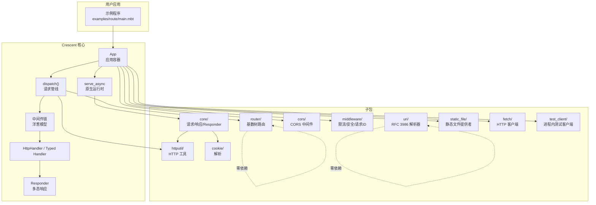
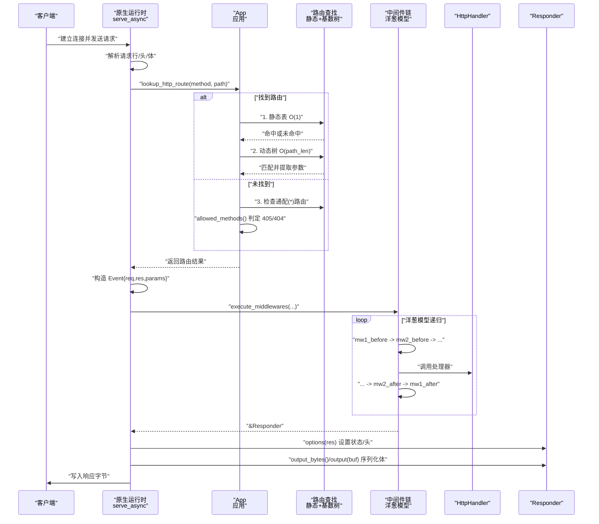
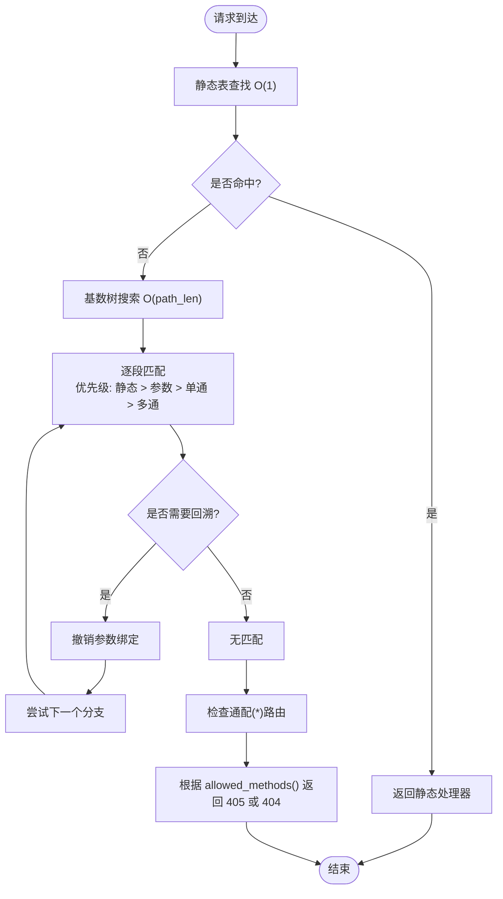
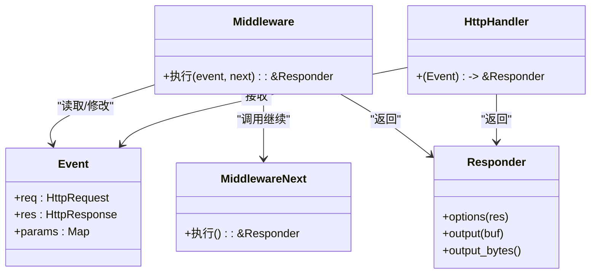
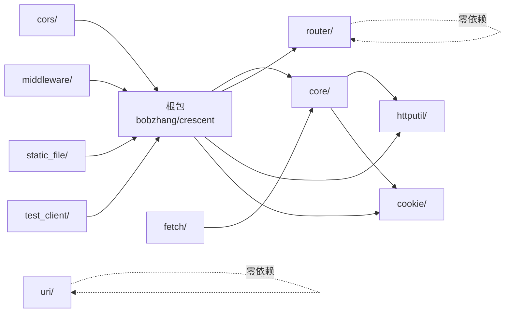

# 路由与中间件

<cite>
**本文引用的文件**   
- [README.md](file://README.md)
- [ARCHITECTURE.md](file://ARCHITECTURE.md)
- [main.mbt](file://examples/route/main.mbt)
</cite>

## 目录
1. [简介](#简介)
2. [项目结构](#项目结构)
3. [核心组件](#核心组件)
4. [架构总览](#架构总览)
5. [详细组件分析](#详细组件分析)
6. [依赖关系分析](#依赖关系分析)
7. [性能考量](#性能考量)
8. [故障排查指南](#故障排查指南)
9. [结论](#结论)
10. [附录](#附录)

## 简介
本文件面向 Crescent 框架的路由系统与中间件机制，提供从概念到实现的完整说明。内容涵盖：
- 路由匹配算法：基于基数树的 O(path length) 动态路由查找，静态路由 O(1) 快速命中
- 路由模式语法：参数捕获、通配符与多级通配符的语义与优先级
- 中间件工作原理：洋葱模型、注册顺序、执行流程与错误传播
- 内置中间件：安全头、请求 ID、限流、CORS 的使用与行为
- 自定义中间件：开发示例与最佳实践
- 路由分组与资源路由：组织与复用
- 性能优化建议与常见问题解决方案

## 项目结构
Crescent 采用模块化设计，核心能力集中在根包，路由与中间件位于核心层；同时提供 cors、middleware、static_file、fetch、test_client 等子包扩展功能。

图表来源
- [ARCHITECTURE.md: 高层架构图:207-259](file://ARCHITECTURE.md#L207-L259)

章节来源
- [ARCHITECTURE.md: 高层架构:203-259](file://ARCHITECTURE.md#L203-L259)
- [README.md: 包列表:892-902](file://README.md#L892-L902)

## 核心组件
- 应用容器 App：维护静态/动态路由表、WebSocket 路由、中间件栈、未匹配处理器等
- 请求事件 Event：封装 HttpRequest、HttpResponse、参数映射
- 中间件 Middleware：接收 Event 与 next 继续函数，可前置/后置处理
- 响应多态 Responder：统一将返回值序列化为 HTTP 响应字节
- 路由编译 CompiledRoute：将路由模板在注册时解析为内部结构
- 基数树 RadixRouter：按方法维护的动态路由查找树

章节来源
- [ARCHITECTURE.md: 类型关系与职责:441-535](file://ARCHITECTURE.md#L441-L535)
- [README.md: 路由与中间件概览:138-177](file://README.md#L138-L177)

## 架构总览
请求生命周期从原生运行时开始，解析请求、查找路由、构建事件、执行中间件链、调用处理器、序列化响应并写出。

图表来源
- [ARCHITECTURE.md: 请求生命周期:363-412](file://ARCHITECTURE.md#L363-L412)

章节来源
- [ARCHITECTURE.md: 请求生命周期与路由查找优先级:357-432](file://ARCHITECTURE.md#L357-L432)

## 详细组件分析

### 路由匹配算法与模式语法
- 路由类型
  - 静态路由：固定路径，O(1) 查找
  - 动态路由：含参数(:id)、单段通配符(*)、多段通配符(**)，O(path length) 基数树查找
- 匹配优先级（同层级）：静态 > 参数 > 单段通配 > 多段通配，确保不会被低优先级覆盖
- 编译期预处理：路由模板在注册时解析为 CompiledRoute，避免每次请求重复解析
- 特殊情况：形如“先 ** 后静态”的路由存储于回退列表，按线性扫描匹配

图表来源
- [ARCHITECTURE.md: 路由查找优先级与基数树:414-432](file://ARCHITECTURE.md#L414-L432)
- [ARCHITECTURE.md: 基数树与回溯:690-710](file://ARCHITECTURE.md#L690-L710)

章节来源
- [README.md: 路由模式语法与复杂度:428-458](file://README.md#L428-L458)
- [ARCHITECTURE.md: 路由编译与基数树:614-710](file://ARCHITECTURE.md#L614-L710)

### 中间件机制与洋葱模型
- 类型与职责
  - Middleware(event, next)：可读写请求/响应，决定是否短路
  - MiddlewareNext：继续执行后续中间件与处理器
- 执行顺序
  - 注册顺序即洋葱外层到内层；outermost 层最先收到请求，最后看到响应
  - 支持按 base_path 进行路径范围限定
- 错误传播
  - Typed Handler 对异常进行自动映射：业务错误映射为结构化 JSON 错误，解析失败映射为 400，其他异常映射为 500
  - Raw Handler 要求 noraise，否则直接导致服务端错误
- 示例
  - 全局中间件：日志、CORS、安全头
  - 分组中间件：仅对 /api/* 生效

图表来源
- [ARCHITECTURE.md: 中间件类型与洋葱模型:713-792](file://ARCHITECTURE.md#L713-L792)

章节来源
- [README.md: 中间件注册与洋葱模型:138-177](file://README.md#L138-L177)
- [ARCHITECTURE.md: 中间件链实现与路径作用域:713-792](file://ARCHITECTURE.md#L713-L792)

### 内置中间件使用指南
- 安全头中间件：设置浏览器安全相关响应头，增强防护
- 请求 ID 中间件：生成/透传 X-Request-Id，便于分布式追踪
- 限流中间件：固定窗口计数，超限时返回 429 并带 Retry-After
- CORS 中间件：处理预检 OPTIONS、允许来源/方法/凭据，必要时反射 Origin 并设置 Vary

章节来源
- [README.md: 内置中间件清单与行为:722-732](file://README.md#L722-L732)
- [ARCHITECTURE.md: CORS 中间件实现要点:1146-1161](file://ARCHITECTURE.md#L1146-L1161)

### 自定义中间件开发示例与最佳实践
- 开发示例：计数器限流中间件，超过阈值返回 429
- 最佳实践
  - 明确职责单一，避免在中间件中做业务逻辑
  - 使用 base_path 精准控制生效范围
  - 注意错误处理：对上游异常进行包装或转换
  - 保持异步特性一致，避免阻塞

章节来源
- [README.md: 自定义中间件示例:733-747](file://README.md#L733-L747)

### 路由分组与资源路由
- 路由分组：共享前缀与中间件，配置完成后合并回父应用
- 资源路由：RESTful 一键注册 list/get/create/update/delete 五类端点

章节来源
- [README.md: 路由分组与资源路由:406-426](file://README.md#L406-L426)
- [README.md: 资源路由示例:301-332](file://README.md#L301-L332)

### 示例：路由与中间件综合演示
- 全局中间件：日志、CORS、安全头
- 分组中间件：仅对 /api/* 生效
- 动态路由：参数捕获、通配符、多段通配符
- 自定义 404 处理器

章节来源
- [examples/route/main.mbt: 示例程序:1-98](file://examples/route/main.mbt#L1-L98)

## 依赖关系分析
- 子包独立性：router、uri、cookie、httputil 为叶子包，零内部依赖，便于单独测试与复用
- 核心耦合：core 提供请求/响应/Responder，被 serve_async、cors、middleware、static_file 等广泛使用
- 外部依赖：moonbitlang/async（原生异步运行时）、moonbitlang/core（基础库）

图表来源
- [ARCHITECTURE.md: 包依赖图:291-346](file://ARCHITECTURE.md#L291-L346)

章节来源
- [ARCHITECTURE.md: 包依赖图与外部依赖:283-356](file://ARCHITECTURE.md#L283-L356)

## 性能考量
- 路由查找
  - 静态路由 O(1)，动态路由 O(path length)
  - 路由模板注册时编译，请求时不重复解析
  - 路径与查询解析缓存，避免重复计算
- 中间件链
  - 无匹配路径的中间件过滤，减少无效遍历
  - 递归构建 next，避免额外分配
- I/O 与序列化
  - 零分配头字段比较（大小写不敏感）
  - Bytes/HttpResponse 直出，跳过中间缓冲
- 服务器选项
  - 可配置并发连接上限、请求体大小限制、读取超时、处理器超时、WebSocket 队列容量与溢出策略等

章节来源
- [README.md: 性能特性:884-891](file://README.md#L884-L891)
- [ARCHITECTURE.md: 请求生命周期与性能点:1061-1129](file://ARCHITECTURE.md#L1061-L1129)

## 故障排查指南
- 404 与 405
  - 404：无路由匹配；可设置自定义未匹配处理器
  - 405：URL 存在但方法不被允许；框架会返回 Allow 头
- CORS 预检
  - 确认 OPTIONS 预检已正确处理并返回允许的来源/方法/凭据
- 中间件顺序
  - 若鉴权在前导致后续中间件无法执行，需调整注册顺序或使用分组限定 base_path
- 错误映射
  - Typed Handler 的异常会被自动映射为 JSON 错误；Raw Handler 不做映射，必须保证 noraise
- 日志与追踪
  - 启用请求 ID 中间件，结合日志输出定位请求链路

章节来源
- [ARCHITECTURE.md: 405/404 判定与 CORS 实现:414-432](file://ARCHITECTURE.md#L414-L432)
- [README.md: 错误映射与响应帮助:693-721](file://README.md#L693-L721)

## 结论
Crescent 通过“静态 O(1) + 动态 O(path length)”的双轨路由与洋葱模型中间件，实现了高性能、可组合、易测试的 Web 框架。内置中间件覆盖安全、可观测性与跨域等常见需求；通过分组与资源路由简化 REST API 的组织与维护。配合完善的性能特性与测试工具，适合构建高并发、类型安全的原生 MoonBit 服务端应用。

## 附录
- 关键 API 与行为参考
  - 路由模式：静态、参数(:id)、单通(*, 1 段)、多通(**, 任意深度)
  - 中间件：洋葱模型、路径作用域、错误映射
  - 内置中间件：安全头、请求 ID、限流、CORS
  - 路由分组与资源路由：共享前缀与中间件、一键 CRUD

章节来源
- [README.md: 路由模式与内置中间件:428-732](file://README.md#L428-L732)
- [examples/route/main.mbt: 示例与演示:1-98](file://examples/route/main.mbt#L1-L98)