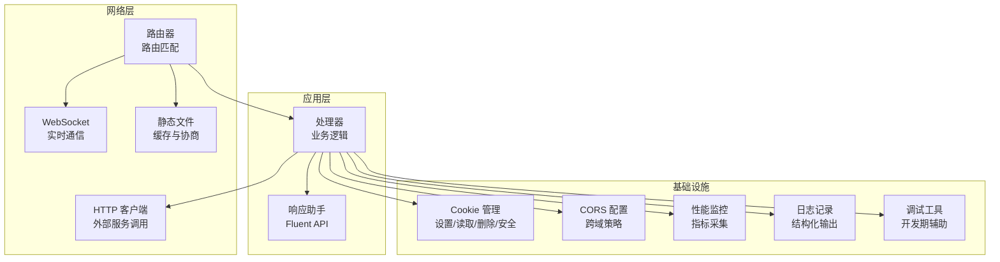
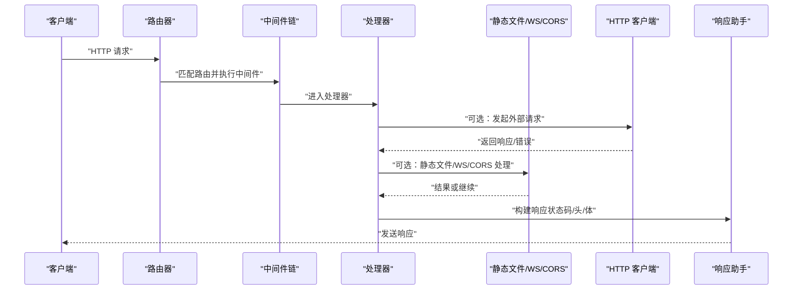
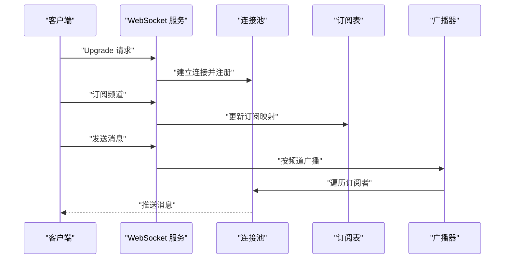
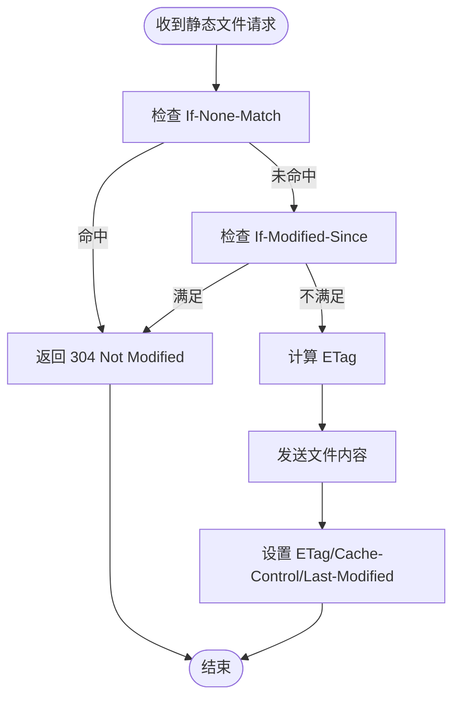
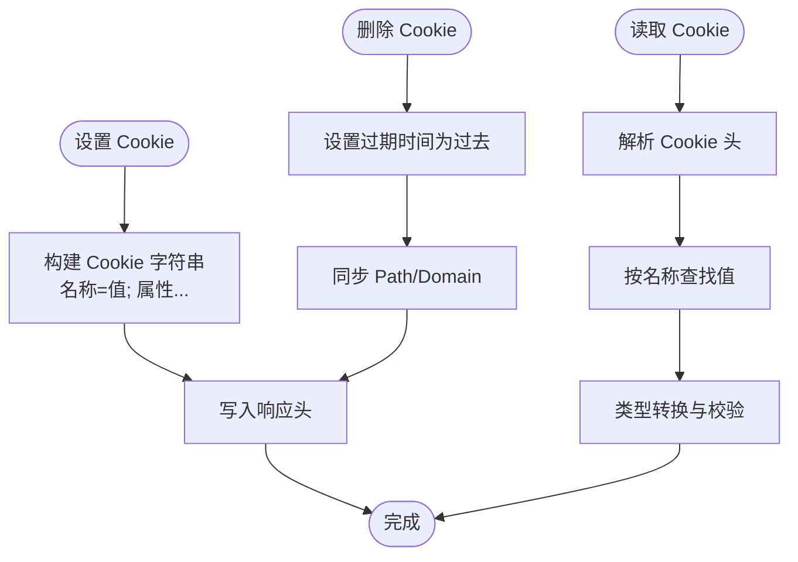
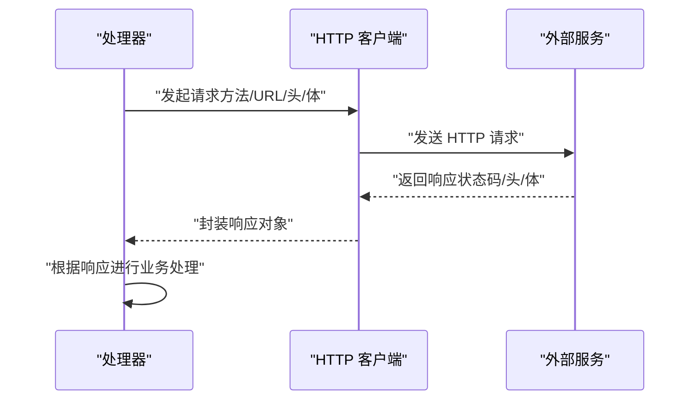
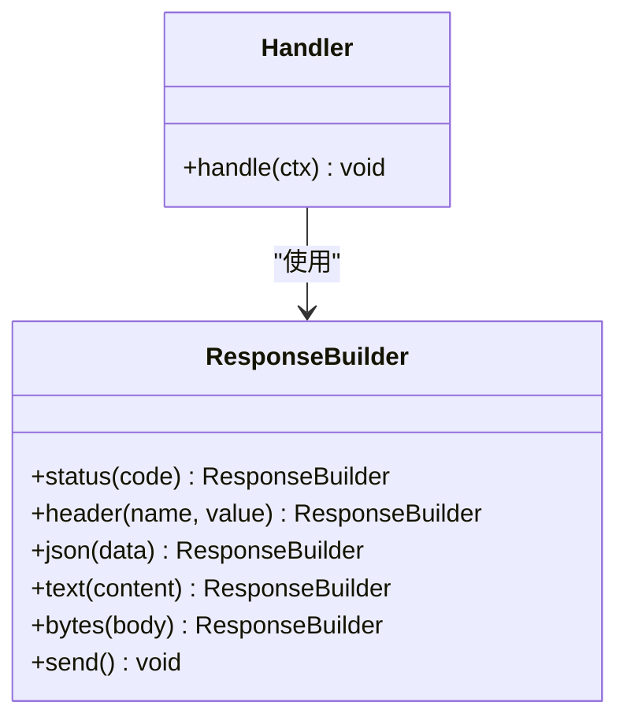
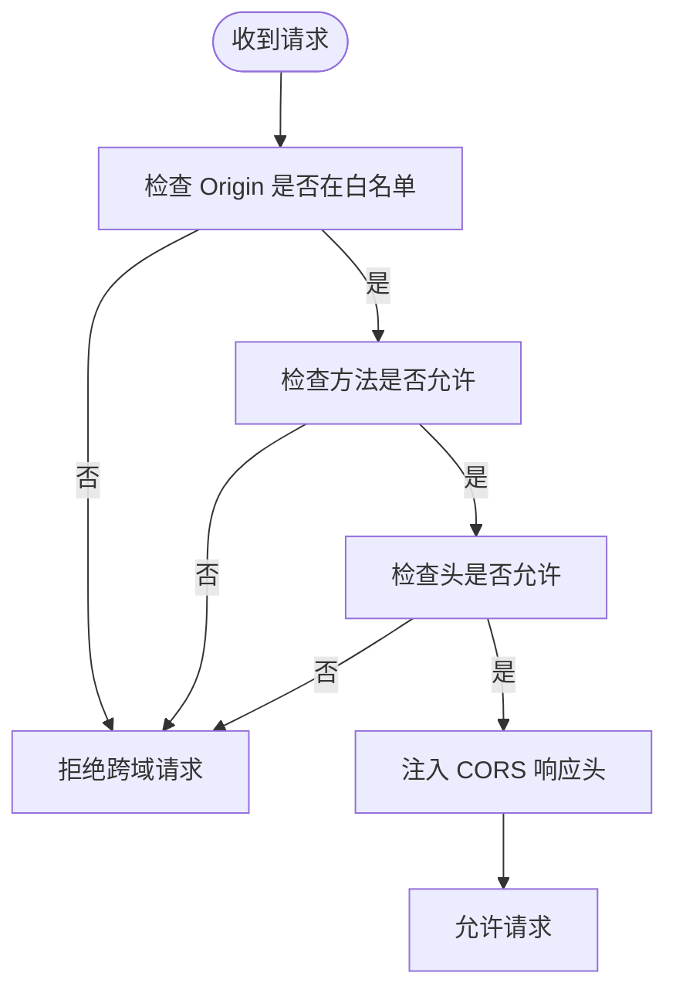
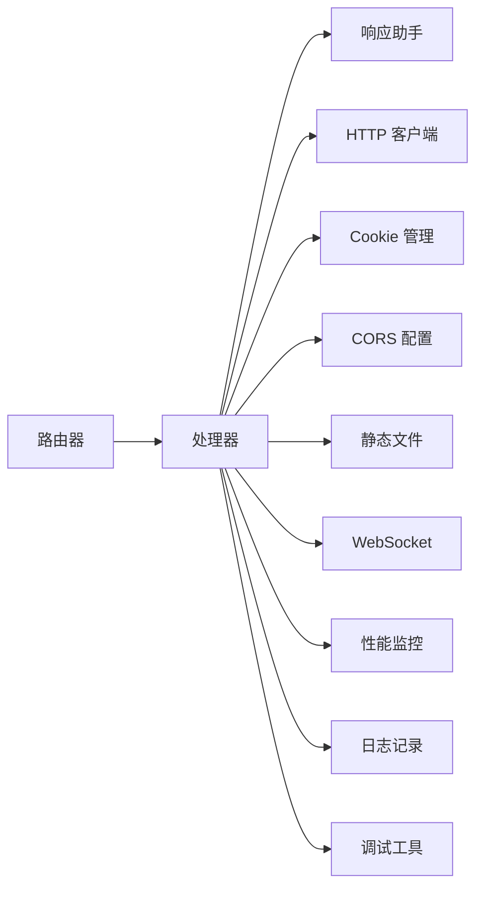

# 高级功能

<cite>
**本文档引用的文件**
- [README.md](file://README.md)
- [main.go](file://main.go)
- [server.go](file://server.go)
- [router.go](file://router.go)
- [handler.go](file://handler.go)
- [websocket.go](file://websocket.go)
- [static.go](file://static.go)
- [cookie.go](file://cookie.go)
- [client.go](file://client.go)
- [response.go](file://response.go)
- [cors.go](file://cors.go)
- [monitoring.go](file://monitoring.go)
- [logging.go](file://logging.go)
- [debug.go](file://debug.go)
</cite>

## 目录
1. [简介](#简介)
2. [项目结构](#项目结构)
3. [核心组件](#核心组件)
4. [架构总览](#架构总览)
5. [详细组件分析](#详细组件分析)
6. [依赖关系分析](#依赖关系分析)
7. [性能考虑](#性能考虑)
8. [故障排除指南](#故障排除指南)
9. [结论](#结论)

## 简介
本文件面向 Crescent 框架的高级功能，系统性阐述以下能力：WebSocket 实时通信（连接管理、消息广播、频道订阅）、静态文件服务（ETag 缓存、条件请求、内容协商）、Cookie 管理（设置、读取、删除、安全属性）、HTTP 客户端（从处理器发起外部请求）、响应助手与 Fluent API、CORS 配置与自定义响应头、以及性能监控、日志记录与调试技巧。文档以渐进方式组织，既适合初学者快速上手，也为资深开发者提供深入的技术细节与最佳实践。

## 项目结构
项目采用模块化分层设计，按功能域划分核心模块：
- 服务器与路由：负责 HTTP 请求入口、路由匹配与中间件链
- 处理器：业务逻辑承载单元，支持注入客户端、上下文与响应助手
- WebSocket：提供实时双向通信能力，含连接生命周期管理与频道广播
- 静态文件：提供高效静态资源服务，支持缓存与条件请求
- Cookie 管理：统一的 Cookie 设置、读取、删除与安全属性配置
- HTTP 客户端：轻量级客户端，便于在处理器中调用外部服务
- 响应助手与 Fluent API：简化响应构造与头部设置
- CORS：跨域策略配置与动态响应头注入
- 监控与日志：性能指标采集与日志记录
- 调试：开发期辅助工具与断点调试建议

**图表来源**
- [router.go](file://router.go)
- [handler.go](file://handler.go)
- [websocket.go](file://websocket.go)
- [static.go](file://static.go)
- [cookie.go](file://cookie.go)
- [client.go](file://client.go)
- [response.go](file://response.go)
- [cors.go](file://cors.go)
- [monitoring.go](file://monitoring.go)
- [logging.go](file://logging.go)
- [debug.go](file://debug.go)

**章节来源**
- [main.go](file://main.go)
- [server.go](file://server.go)
- [router.go](file://router.go)

## 核心组件
- 服务器与路由：负责启动监听、注册路由、执行中间件链与错误恢复
- 处理器：接收请求上下文，调用业务逻辑，返回响应或触发后续处理
- WebSocket：维护连接池、频道订阅表、广播消息与事件通知
- 静态文件：基于 ETag 的强缓存、条件请求处理（If-None-Match/If-Modified-Since）与内容协商
- Cookie：统一 Cookie 生命周期与安全属性（HttpOnly、Secure、SameSite、Path、Domain、Max-Age）
- HTTP 客户端：支持超时、重试、重定向控制与响应体解析
- 响应助手：提供 Fluent API 构造响应、设置状态码与响应头
- CORS：全局或路由级配置，自动注入允许的来源、方法、头与凭据
- 监控与日志：统计请求耗时、QPS、错误率；结构化日志输出
- 调试：断点、追踪与开发期诊断工具

**章节来源**
- [server.go](file://server.go)
- [router.go](file://router.go)
- [handler.go](file://handler.go)

## 架构总览
Crescent 采用“路由 -> 中间件 -> 处理器 -> 响应”的标准流水线，并在关键节点集成 WebSocket、静态文件、Cookie、CORS、监控与日志等高级能力。WebSocket 与静态文件作为路由子系统的一部分，通过中间件或处理器直接接入；HTTP 客户端与响应助手贯穿所有处理器，提升开发效率与一致性。

**图表来源**
- [router.go](file://router.go)
- [handler.go](file://handler.go)
- [client.go](file://client.go)
- [response.go](file://response.go)

## 详细组件分析

### WebSocket 支持
WebSocket 提供实时双向通信能力，涵盖连接生命周期、频道订阅与消息广播。

- 连接处理
  - 握手与升级：在路由层拦截 Upgrade 请求，完成协议升级并建立连接
  - 连接池管理：维护活跃连接集合，支持心跳检测与异常断开清理
  - 事件回调：提供连接建立、消息接收、关闭与错误事件钩子
- 频道订阅
  - 订阅模型：每个连接可订阅多个频道，频道内进行消息分发
  - 订阅表：维护频道到连接集合的映射，支持动态加入/离开
- 消息广播
  - 广播策略：向指定频道内的所有连接广播消息
  - 组播优化：根据订阅表批量推送，避免逐连接发送
  - 错误处理：对失败连接进行清理，保证广播流程健壮性

**图表来源**
- [websocket.go](file://websocket.go)

**章节来源**
- [websocket.go](file://websocket.go)

### 静态文件服务
静态文件服务通过 ETag 缓存与条件请求优化传输效率，同时支持内容协商。

- ETag 缓存
  - 内容指纹：基于文件内容生成唯一 ETag，确保缓存有效性
  - 强缓存：首次请求返回内容与 ETag；后续请求携带 If-None-Match，命中则返回 304
- 条件请求
  - Last-Modified：结合修改时间与 If-Modified-Since 实现条件返回
  - 412/304：根据条件判断返回 412 或 304，减少带宽消耗
- 内容协商
  - MIME 类型：根据扩展名推断 Content-Type
  - 字符集与编码：支持 gzip/deflate 压缩与 Accept-Encoding 协商
  - 缓存策略：合理设置 Cache-Control 与 Expires，平衡新鲜度与性能

**图表来源**
- [static.go](file://static.go)

**章节来源**
- [static.go](file://static.go)

### Cookie 管理机制
Cookie 管理提供统一接口，支持设置、读取、删除与安全属性配置。

- 设置 Cookie
  - 基本属性：名称、值、路径、域、过期时间
  - 安全属性：HttpOnly、Secure、SameSite（Strict/Lax/None）
  - 作用域：Path 与 Domain 控制 Cookie 生效范围
- 读取 Cookie
  - 解析请求头：从 Cookie 头中提取键值对，支持多值合并
  - 类型转换：提供字符串、整数、布尔等常用类型读取方法
- 删除 Cookie
  - 过期策略：设置过期时间为过去时间，触发客户端删除
  - 同步作用域：确保 Path 与 Domain 与设置时一致
- 安全最佳实践
  - 默认 HttpOnly + Secure（HTTPS 环境）
  - SameSite 优先 Lax，跨站登录场景谨慎使用 None
  - 最小权限路径与域，避免过度暴露

**图表来源**
- [cookie.go](file://cookie.go)

**章节来源**
- [cookie.go](file://cookie.go)

### HTTP 客户端功能
HTTP 客户端用于在处理器内部发起对外部服务的请求，支持超时、重试与响应解析。

- 发起请求
  - 方法与 URL：支持 GET/POST/PUT/DELETE 等方法与完整 URL
  - 请求头：自动注入 Host、User-Agent、Content-Type 等常见头
  - 超时控制：可配置连接与读写超时，避免阻塞
- 响应处理
  - 状态码：根据状态码进行分支处理（2xx 成功、3xx 重定向、4xx/5xx 错误）
  - 响应体：支持 JSON、文本、二进制等多种解析方式
  - 重定向：可配置跟随重定向次数与策略
- 错误与重试
  - 网络错误：连接超时、DNS 解析失败等
  - 业务错误：根据状态码与响应体判定是否重试
  - 退避策略：指数退避或固定间隔重试

**图表来源**
- [client.go](file://client.go)

**章节来源**
- [client.go](file://client.go)

### 响应助手与 Fluent API
响应助手提供简洁一致的响应构造方式，配合 Fluent API 提升可读性与可维护性。

- Fluent API 设计
  - 链式调用：先设置状态码，再追加响应头，最后写入响应体
  - 类型安全：针对 JSON、HTML、文本、二进制提供专用方法
  - 默认头：自动设置 Content-Type、Content-Length、Date 等
- 常用模式
  - JSON 响应：序列化对象并设置 application/json
  - 文件下载：设置 Content-Disposition 与合适的 Content-Type
  - 重定向：设置 Location 与 3xx 状态码
- 与处理器集成
  - 在处理器中直接调用响应助手，避免重复样板代码
  - 与 CORS、Cookie 等模块协同，确保响应头一致性

**图表来源**
- [response.go](file://response.go)

**章节来源**
- [response.go](file://response.go)

### CORS 配置与自定义响应头
CORS 提供灵活的跨域策略配置，支持全局与路由级定制，并可注入自定义响应头。

- 全局配置
  - 允许来源：支持通配符与白名单列表
  - 允许方法：GET/POST/PUT/DELETE 等
  - 允许头：Expose-Headers 与 Allow-Headers
  - 凭据：是否允许携带 Cookie 或证书
- 路由级覆盖
  - 特定路由可覆盖全局策略，实现细粒度控制
- 自定义响应头
  - 通过响应助手或中间件统一注入 X-Custom-Header 等
  - 结合安全策略设置 Strict-Transport-Security、X-Frame-Options 等

**图表来源**
- [cors.go](file://cors.go)

**章节来源**
- [cors.go](file://cors.go)

## 依赖关系分析
各模块之间存在清晰的职责边界与依赖方向，整体呈现“路由 -> 处理器 -> 基础设施”的单向依赖。

**图表来源**
- [router.go](file://router.go)
- [handler.go](file://handler.go)
- [response.go](file://response.go)
- [client.go](file://client.go)
- [cookie.go](file://cookie.go)
- [cors.go](file://cors.go)
- [static.go](file://static.go)
- [websocket.go](file://websocket.go)
- [monitoring.go](file://monitoring.go)
- [logging.go](file://logging.go)
- [debug.go](file://debug.go)

**章节来源**
- [router.go](file://router.go)
- [handler.go](file://handler.go)

## 性能考虑
- 静态文件缓存
  - 使用 ETag 与 304 响应显著降低带宽占用
  - 合理设置 Cache-Control，避免频繁回源
- WebSocket 广播
  - 批量推送与订阅表索引优化，避免 O(N) 遍历
  - 心跳与断线清理，维持连接池健康
- HTTP 客户端
  - 连接复用与超时控制，避免资源泄露
  - 重试策略与退避算法，提升外部服务稳定性
- 响应助手
  - 避免重复设置头，减少字符串拼接
  - 对大体积响应采用流式输出
- 监控与日志
  - 采样与聚合，避免高频日志影响吞吐
  - 关键路径埋点，定位性能瓶颈

## 故障排除指南
- WebSocket 连接失败
  - 检查 Upgrade 请求头与路由匹配
  - 核对握手协议版本与子协议
  - 查看连接池与心跳配置
- 静态文件 304 不生效
  - 确认 ETag 计算一致性与 If-None-Match 匹配
  - 检查 Last-Modified 时间戳精度
- Cookie 未生效
  - 核对 Path、Domain 与 SameSite 设置
  - HTTPS 环境下确保 Secure 属性开启
- CORS 跨域被拒
  - 检查 Allow-Origin 与 Allow-Credentials
  - 确认预检请求的 OPTIONS 处理
- HTTP 客户端超时
  - 调整连接与读写超时参数
  - 检查外部服务可用性与网络延迟
- 性能问题
  - 使用监控工具定位慢请求与热点路由
  - 分析日志中的错误分布与异常堆栈

**章节来源**
- [websocket.go](file://websocket.go)
- [static.go](file://static.go)
- [cookie.go](file://cookie.go)
- [cors.go](file://cors.go)
- [client.go](file://client.go)
- [monitoring.go](file://monitoring.go)
- [logging.go](file://logging.go)
- [debug.go](file://debug.go)

## 结论
Crescent 的高级功能围绕“高性能、易用性、安全性”展开：WebSocket 提供实时通信能力；静态文件服务通过 ETag 与条件请求优化缓存；Cookie 管理确保会话安全；HTTP 客户端简化外部服务集成；响应助手与 Fluent API 提升开发效率；CORS 与自定义响应头保障跨域与合规；监控、日志与调试工具贯穿全链路，帮助快速定位问题。建议在生产环境中启用 HTTPS、合理配置 Cookie 安全属性与 CORS 策略，并结合监控与日志持续优化性能与稳定性。