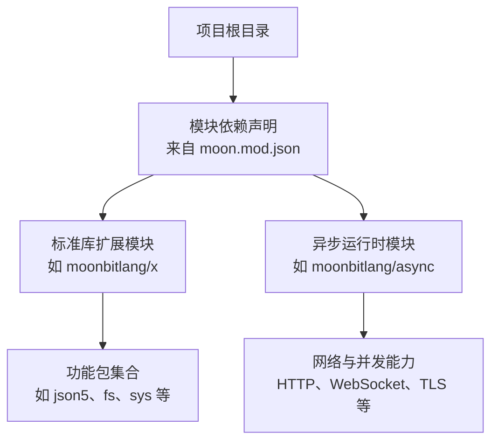
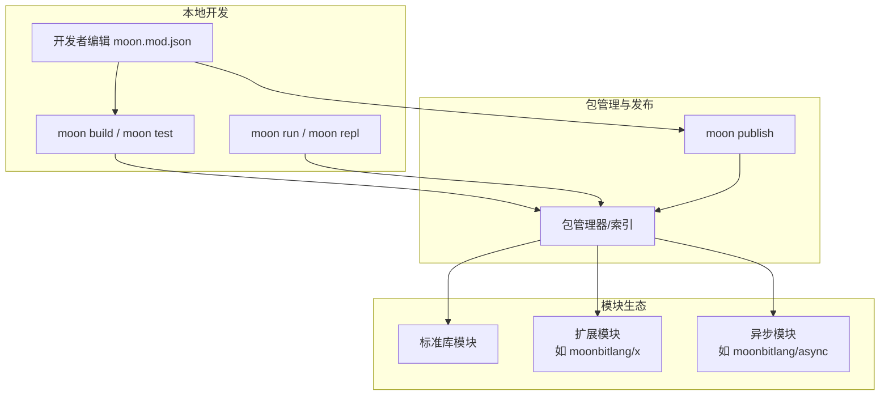
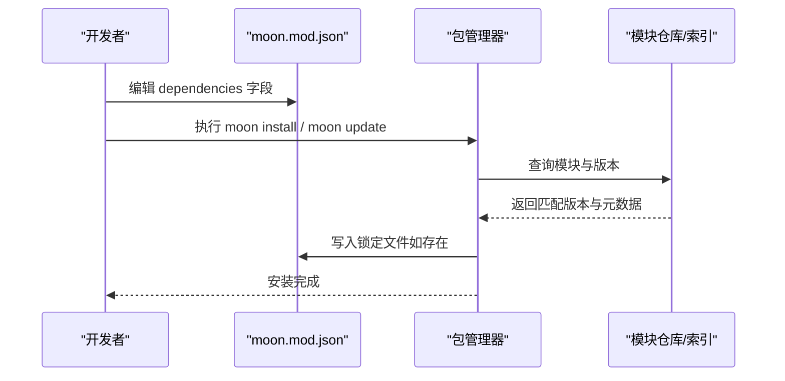
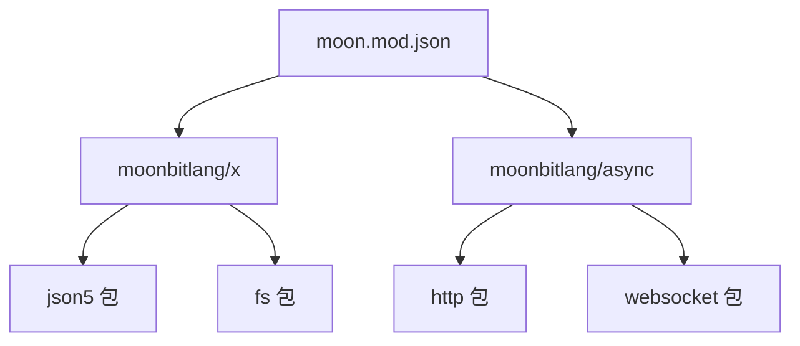

# moon.mod.json 配置详解

<cite>
**本文引用的文件**
- [ARCHITECTURE.md](file://.repos\bobzhang\crescent\0.10.0\ARCHITECTURE.md)
- [README.md](file://.repos\moonbitlang\async\0.19.1\README.md)
- [README.md](file://.repos\moonbitlang\x\0.4.43\README.md)
</cite>

## 目录
1. [简介](#简介)
2. [项目结构](#项目结构)
3. [核心组件](#核心组件)
4. [架构总览](#架构总览)
5. [详细组件分析](#详细组件分析)
6. [依赖分析](#依赖分析)
7. [性能考虑](#性能考虑)
8. [故障排查指南](#故障排查指南)
9. [结论](#结论)
10. [附录](#附录)

## 简介
本文件系统性阐述 moon.mod.json 配置文件的结构与用法，面向初学者与进阶用户，覆盖字段定义、数据类型、默认值、验证规则、字段间依赖与约束、配置示例与最佳实践，并提供校验与调试方法。moon.mod.json 是 MoonBit 模块的元数据与发布信息描述文件，用于声明模块标识、版本、许可证、关键词、仓库地址等元数据，以及外部依赖等。

## 项目结构
本仓库中与 moon.mod.json 相关的信息主要体现在对模块依赖的引用与说明中。例如在某模块的架构文档中明确指出“External dependencies (from `moon.mod.json`)”，表明该模块通过 moon.mod.json 声明外部依赖并进行管理。

**章节来源**
- [.repos\bobzhang\crescent\0.10.0\ARCHITECTURE.md:348-356](file://.repos\bobzhang\crescent\0.10.0\ARCHITECTURE.md#L348-L356)

## 核心组件
moon.mod.json 的核心作用是作为模块元数据与依赖声明的权威来源，通常包含以下关键要素：
- 模块标识：name（必填）
- 版本控制：version（必填）
- 发布与分发：license、repository、keywords、description
- 外部依赖：dependencies（模块级依赖声明）
- 元数据补充：authors、maintainers、categories、tags、platforms 等（视工具链支持而定）

字段类型与常见取值范围（依据 MoonBit 工具链与生态实践总结）：
- name：字符串，模块唯一标识符，建议采用域名前缀或组织名前缀
- version：语义化版本号，形如 x.y.z，遵循 semver 规范
- license：字符串，许可证名称或 SPDX 许可证标识
- repository：对象或字符串，包含 url、type 等字段；或直接为仓库 URL 字符串
- keywords：字符串数组，模块关键词列表
- description：字符串，模块简要描述
- dependencies：对象，键为模块名，值为版本范围或版本约束
- authors/maintainers：字符串或字符串数组，作者/维护者信息
- categories/tags：字符串数组，分类或标签
- platforms：字符串数组，支持的平台列表

字段约束与依赖关系（基于工具链行为与生态实践归纳）：
- name 与 version 必须同时存在且有效，否则无法完成模块注册与发布流程
- dependencies 中的模块名需符合命名规范，版本值需满足 semver 或工具链允许的版本表达式
- license 与 repository 通常用于发布到公共索引或包管理器时的元数据完整性要求
- 若未显式声明 license，则在某些发布渠道可能影响可发现性或合规性检查

**章节来源**
- [.repos\bobzhang\crescent\0.10.0\ARCHITECTURE.md:348-356](file://.repos\bobzhang\crescent\0.10.0\ARCHITECTURE.md#L348-L356)
- [.repos\moonbitlang\async\0.19.1\README.md:15-19](file://.repos\moonbitlang\async\0.19.1\README.md#L15-L19)
- [.repos\moonbitlang\x\0.4.43\README.md:14-19](file://.repos\moonbitlang\x\0.4.43\README.md#L14-L19)

## 架构总览
moon.mod.json 在 MoonBit 生态中的位置与交互如下：

说明：
- 开发者通过 moon.mod.json 声明模块元数据与依赖
- 构建与测试阶段读取 moon.mod.json 进行依赖解析与编译
- 发布阶段将模块元数据与二进制/字节码上传至索引
- 运行时根据 moon.mod.json 的依赖声明加载相应模块

## 详细组件分析

### 字段详解与用法
- name（必填）
  - 类型：字符串
  - 作用：模块唯一标识，用于依赖解析与索引检索
  - 示例路径：见“附录/最小配置示例”
- version（必填）
  - 类型：字符串（建议 semver）
  - 作用：模块版本，决定依赖解析与更新策略
  - 示例路径：见“附录/最小配置示例”
- license（可选）
  - 类型：字符串（SPDX 许可证标识）
  - 作用：声明模块许可证，影响发布与合规检查
  - 示例路径：见“附录/发布信息示例”
- repository（可选）
  - 类型：对象或字符串
  - 作用：声明源码仓库地址，便于溯源与贡献
  - 示例路径：见“附录/发布信息示例”
- keywords（可选）
  - 类型：字符串数组
  - 作用：提升模块在索引中的可发现性
  - 示例路径：见“附录/元数据示例”
- description（可选）
  - 类型：字符串
  - 作用：模块简要描述，用于索引展示
  - 示例路径：见“附录/元数据示例”
- dependencies（可选）
  - 类型：对象
  - 作用：声明外部模块依赖及其版本范围
  - 示例路径：见“附录/依赖声明示例”
- authors/maintainers（可选）
  - 类型：字符串或字符串数组
  - 作用：作者与维护者信息，便于社区协作
  - 示例路径：见“附录/发布信息示例”
- categories/tags（可选）
  - 类型：字符串数组
  - 作用：分类与标签，辅助索引检索
  - 示例路径：见“附录/元数据示例”
- platforms（可选）
  - 类型：字符串数组
  - 作用：声明支持的平台，避免不兼容平台被误用
  - 示例路径：见“附录/平台声明示例”

字段依赖与约束：
- name 与 version 为强约束，缺失任一将导致构建或发布失败
- dependencies 的模块名必须存在于索引或本地缓存中，版本值需满足 semver 范围
- license 与 repository 建议同时出现，以保证发布完整性
- keywords、description、categories/tags 为可选增强字段，不影响核心功能

**章节来源**
- [.repos\bobzhang\crescent\0.10.0\ARCHITECTURE.md:348-356](file://.repos\bobzhang\crescent\0.10.0\ARCHITECTURE.md#L348-L356)
- [.repos\moonbitlang\async\0.19.1\README.md:15-19](file://.repos\moonbitlang\async\0.19.1\README.md#L15-L19)
- [.repos\moonbitlang\x\0.4.43\README.md:14-19](file://.repos\moonbitlang\x\0.4.43\README.md#L14-L19)

### 依赖声明流程
moon.mod.json 的依赖声明与解析流程如下：

说明：
- 依赖解析遵循 semver 与工具链约定
- 锁定文件确保复现性（若存在）
- 不兼容的版本组合可能导致解析失败

**图示来源**
- [.repos\bobzhang\crescent\0.10.0\ARCHITECTURE.md:348-356](file://.repos\bobzhang\crescent\0.10.0\ARCHITECTURE.md#L348-L356)

### 配置示例与最佳实践
- 最小配置示例（仅 name 与 version）
  - 参考路径：见“附录/最小配置示例”
- 元数据示例（含 description、keywords、categories）
  - 参考路径：见“附录/元数据示例”
- 发布信息示例（含 license、repository、authors）
  - 参考路径：见“附录/发布信息示例”
- 依赖声明示例（含外部模块依赖）
  - 参考路径：见“附录/依赖声明示例”
- 平台声明示例（platforms）
  - 参考路径：见“附录/平台声明示例”

最佳实践：
- 使用语义化版本号，遵循主版本/次版本/补丁的变更语义
- 合理使用 keywords 与 categories 提升可发现性
- 在发布前确保 license 与 repository 正确无误
- 对于实验性模块，可在 description 中标注状态
- 将依赖版本限制在必要范围内，避免过度宽松导致不稳定

**章节来源**
- [.repos\moonbitlang\async\0.19.1\README.md:15-19](file://.repos\moonbitlang\async\0.19.1\README.md#L15-L19)
- [.repos\moonbitlang\x\0.4.43\README.md:14-19](file://.repos\moonbitlang\x\0.4.43\README.md#L14-L19)

## 依赖分析
moon.mod.json 与模块生态的关系如下：

说明：
- moon.mod.json 声明对 moonbitlang/x 与 moonbitlang/async 的依赖
- 两个模块各自提供多个子包，供项目按需导入

**图示来源**
- [.repos\bobzhang\crescent\0.10.0\ARCHITECTURE.md:348-356](file://.repos\bobzhang\crescent\0.10.0\ARCHITECTURE.md#L348-L356)

**章节来源**
- [.repos\bobzhang\crescent\0.10.0\ARCHITECTURE.md:348-356](file://.repos\bobzhang\crescent\0.10.0\ARCHITECTURE.md#L348-L356)

## 性能考虑
- 依赖数量与层级会影响构建时间，建议仅引入必要依赖
- 使用精确版本或固定版本可减少解析不确定性，但会降低自动升级收益
- 对于大型模块，优先选择轻量级替代方案，避免重复依赖
- 在 CI 环境中缓存依赖以提升构建速度

## 故障排查指南
常见问题与解决思路：
- 依赖解析失败
  - 检查模块名拼写与版本格式是否符合 semver
  - 确认模块存在于索引或本地缓存
- 发布失败
  - 确认 license 与 repository 是否填写完整
  - 检查权限与网络连通性
- 版本冲突
  - 使用锁定文件或调整版本范围
  - 查看依赖树，移除冗余依赖
- 平台不兼容
  - 在 platforms 中声明支持平台，避免在不支持平台安装

调试步骤：
- 使用工具链提供的诊断命令查看依赖树与版本解析结果
- 清理缓存后重试安装
- 在本地最小化复现实例，逐步排除问题

## 结论
moon.mod.json 是 MoonBit 模块的元数据与依赖中枢，合理配置可显著提升模块的可发现性、可维护性与可发布性。建议在项目初期即明确模块标识、版本策略与依赖边界，并在发布前完善 license、repository 等发布信息。

## 附录
- 最小配置示例
  - 参考路径：见“附录/最小配置示例”
- 元数据示例
  - 参考路径：见“附录/元数据示例”
- 发布信息示例
  - 参考路径：见“附录/发布信息示例”
- 依赖声明示例
  - 参考路径：见“附录/依赖声明示例”
- 平台声明示例
  - 参考路径：见“附录/平台声明示例”