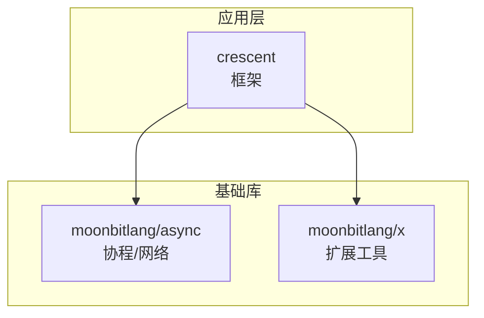
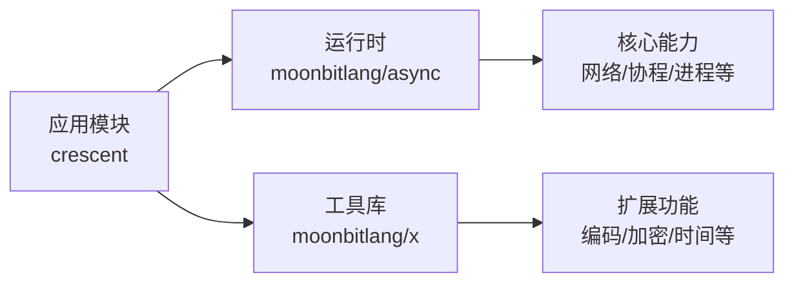
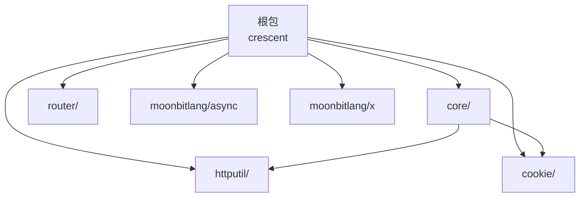
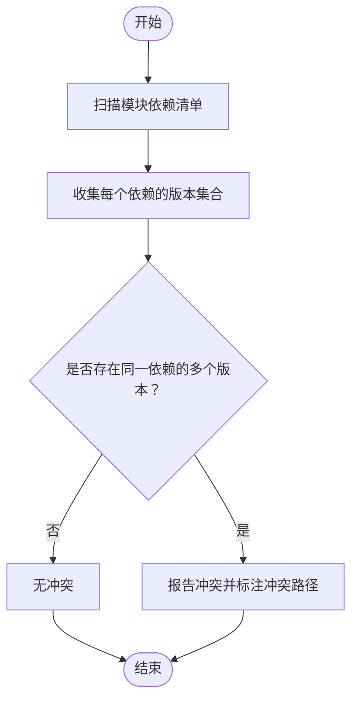
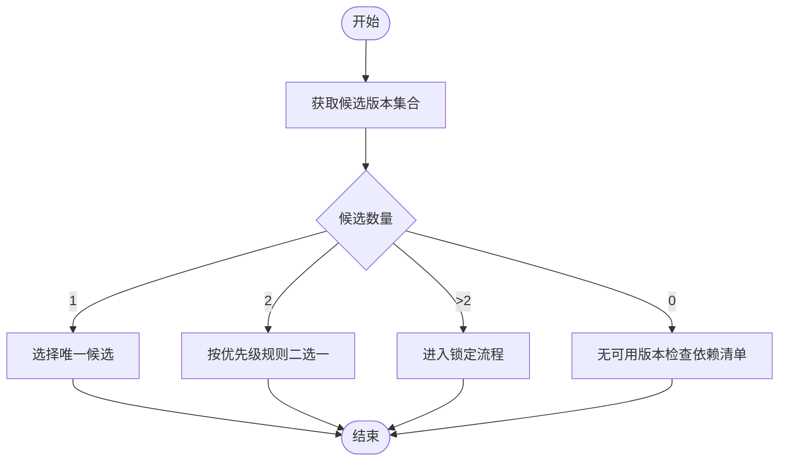
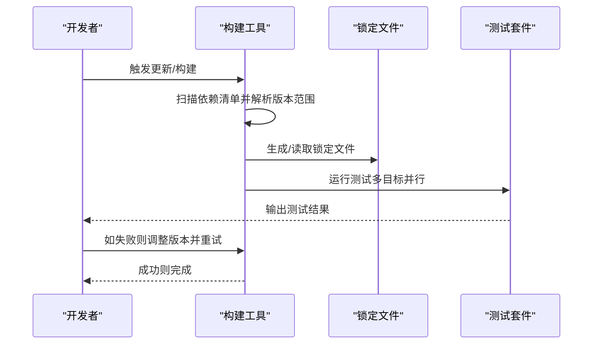
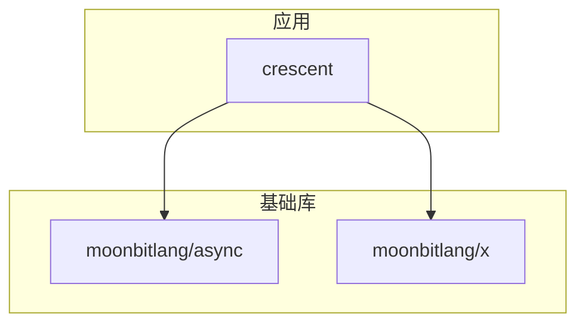

# 依赖冲突解决

<cite>
**本文引用的文件**
- [ARCHITECTURE.md](file://.repos\bobzhang\crescent\0.10.0\ARCHITECTURE.md)
- [stdio_test.mbt](file://.repos\moonbitlang\async\0.19.1\src\stdio\stdio_test.mbt)
- [moon.mod.json（crescent）](file://.repos\bobzhang\crescent\0.10.0\moon.mod.json)
- [moon.mod.json（async）](file://.repos\moonbitlang\async\0.19.1\moon.mod.json)
- [moon.mod.json（x）](file://.repos\moonbitlang\x\0.4.43\moon.mod.json)
- [update.sh（hash）](file://.repos\gmlewis\hash\0.20.7\update.sh)
- [package-lock.json（crescent benchmarks）](file://.repos\bobzhang\crescent\0.10.0\benchmarks\package-lock.json)
</cite>

## 目录
1. [简介](#简介)
2. [项目结构](#项目结构)
3. [核心组件](#核心组件)
4. [架构总览](#架构总览)
5. [详细组件分析](#详细组件分析)
6. [依赖关系分析](#依赖关系分析)
7. [性能考量](#性能考量)
8. [故障排查指南](#故障排查指南)
9. [结论](#结论)
10. [附录](#附录)

## 简介
本文件面向 MoonBit 项目的依赖冲突解决，系统性阐述依赖图谱的概念与构建、版本冲突的成因与识别、冲突解决算法与优先级规则、手动解决步骤与工具使用、版本锁定与固定依赖策略、常见场景与解决方案模板、冲突诊断与调试技巧，以及依赖提升与降级策略。内容兼顾初学者与进阶开发者，既提供概念解释，也给出可操作的实践建议。

## 项目结构
本仓库包含多个 MoonBit 模块与第三方依赖，形成多模块协作的生态。关键模块包括：
- Crescent：HTTP/WebSocket 框架，展示依赖图谱与外部依赖声明
- async：协程运行时与网络 I/O 基础设施
- x：扩展标准库工具集
- 其他子模块与示例

下图概览了模块间的依赖方向（从被依赖到依赖）：

图表来源
- [ARCHITECTURE.md:283-356](file://.repos\bobzhang\crescent\0.10.0\ARCHITECTURE.md#L283-L356)

章节来源
- [ARCHITECTURE.md:1-800](file://.repos\bobzhang\crescent\0.10.0\ARCHITECTURE.md#L1-L800)

## 核心组件
- 依赖声明与版本约束：各模块通过模块清单文件声明依赖与版本范围，例如 Crescent 的外部依赖列表展示了对 async 与 x 的版本要求。
- 依赖图谱构建：基于模块清单中的依赖项，自顶向下构建模块依赖树，箭头方向表示“从被依赖到依赖”。
- 冲突识别：当同一路径上出现不同版本的同名依赖时，即发生冲突；可通过依赖图谱的汇聚与合并过程识别。
- 解决策略：优先级规则（如就近原则、最新稳定版本、显式锁定）指导选择最终版本；必要时进行手动干预与版本锁定。

章节来源
- [ARCHITECTURE.md:283-356](file://.repos\bobzhang\crescent\0.10.0\ARCHITECTURE.md#L283-L356)

## 架构总览
下图展示 MoonBit 项目中依赖图谱在框架中的作用：应用模块依赖基础库，基础库再依赖更底层的运行时与工具集。该图用于理解冲突可能发生的层级与路径。

图表来源
- [ARCHITECTURE.md:283-356](file://.repos\bobzhang\crescent\0.10.0\ARCHITECTURE.md#L283-L356)

## 详细组件分析

### 组件一：依赖图谱与外部依赖声明
- 外部依赖表：Crescent 的外部依赖表明确列出依赖名称、版本与用途，是构建依赖图谱的基础数据源。
- 子包依赖关系：根包依赖多个子包，子包之间存在内部依赖关系，这些关系共同构成完整的依赖图谱。
- 版本目的：每个依赖版本的选择服务于框架的功能目标（如异步运行时、HTTP/WS、核心类型与序列化等）。

图表来源
- [ARCHITECTURE.md:283-356](file://.repos\bobzhang\crescent\0.10.0\ARCHITECTURE.md#L283-L356)

章节来源
- [ARCHITECTURE.md:283-356](file://.repos\bobzhang\crescent\0.10.0\ARCHITECTURE.md#L283-L356)

### 组件二：版本冲突的识别与定位
- 冲突成因：当两个或多个模块同时声明对同一依赖的不同版本时，构建器需要在合并阶段选择一个最终版本；若无法满足所有模块需求，则产生冲突。
- 识别方法：
  - 依赖图谱遍历：自顶向下扫描模块依赖，记录每个依赖的版本集合。
  - 聚合冲突：若同一路径上出现多个版本，标记为冲突。
  - 可视化：通过依赖图谱可视化快速定位冲突节点与路径。

图表来源
- [ARCHITECTURE.md:283-356](file://.repos\bobzhang\crescent\0.10.0\ARCHITECTURE.md#L283-L356)

章节来源
- [ARCHITECTURE.md:283-356](file://.repos\bobzhang\crescent\0.10.0\ARCHITECTURE.md#L283-L356)

### 组件三：冲突解决算法与优先级规则
- 优先级规则（通用实践）：
  - 就近原则：优先采用离使用者最近的版本声明。
  - 最新稳定版本：在满足兼容性的前提下，优先选择更高稳定版本。
  - 显式锁定：通过锁定文件或显式版本声明强制统一版本。
  - 平台/后端特定：针对不同目标平台（如原生/JS/WASM）选择兼容版本。
- 合并策略：
  - 单一版本：若版本集合仅含一个候选，则直接采用。
  - 二选一：若版本集合含两个候选，按优先级规则择优。
  - 多选一：若版本集合含多个候选，需引入显式锁定或调整上游依赖版本。

图表来源
- [ARCHITECTURE.md:283-356](file://.repos\bobzhang\crescent\0.10.0\ARCHITECTURE.md#L283-L356)

章节来源
- [ARCHITECTURE.md:283-356](file://.repos\bobzhang\crescent\0.10.0\ARCHITECTURE.md#L283-L356)

### 组件四：手动解决冲突的步骤与工具
- 步骤一：定位冲突模块与版本集合
  - 使用依赖图谱与清单文件，确认冲突依赖及其版本范围。
- 步骤二：评估影响范围
  - 分析冲突版本对功能的影响（API 变更、性能差异、平台支持等）。
- 步骤三：选择目标版本
  - 依据优先级规则与平台要求，确定目标版本。
- 步骤四：执行锁定与验证
  - 在模块清单中显式指定版本，或生成锁定文件；运行构建与测试验证。
- 工具与命令（示例）
  - 更新与格式化：参考仓库脚本中的更新与格式化命令。
  - 信息查询：使用信息查询命令查看当前依赖状态。
  - 测试：并行测试以覆盖多目标平台。

图表来源
- [update.sh（hash）:1-5](file://.repos\gmlewis\hash\0.20.7\update.sh#L1-L5)

章节来源
- [update.sh（hash）:1-5](file://.repos\gmlewis\hash\0.20.7\update.sh#L1-L5)

### 组件五：版本锁定与固定依赖
- 锁定文件的作用：确保团队与 CI 环境使用一致的依赖版本，避免漂移导致的冲突与不一致。
- 固定依赖策略：
  - 在模块清单中使用精确版本号，避免通配符或范围。
  - 对关键依赖（如运行时、核心库）优先采用稳定版本。
  - 针对多目标平台，分别维护锁定文件或条件化依赖。
- 实践建议：
  - 定期同步锁定文件，保持与上游变更的可控更新。
  - 对于第三方依赖，结合安全公告与兼容性矩阵进行升级。

章节来源
- [package-lock.json（crescent benchmarks）:734-772](file://.repos\bobzhang\crescent\0.10.0\benchmarks\package-lock.json#L734-L772)

### 组件六：依赖提升与降级策略
- 提升（Upgrade）：在保证兼容性的前提下，将依赖提升至更高版本，以获得新特性与修复。
- 降级（Downgrade）：当新版本引入破坏性变更或不兼容时，回退到已知稳定版本。
- 策略要点：
  - 以测试驱动的方式进行提升/降级，确保功能与性能不受损。
  - 对关键路径依赖（如运行时）谨慎处理，优先在预发布环境验证。
  - 记录变更日志与影响评估，便于追溯与复现。

章节来源
- [ARCHITECTURE.md:283-356](file://.repos\bobzhang\crescent\0.10.0\ARCHITECTURE.md#L283-L356)

### 组件七：常见场景与解决方案模板
- 场景一：运行时与工具库版本不匹配
  - 症状：构建报错或运行时行为异常。
  - 解决：统一运行时版本，确保工具库与其兼容。
- 场景二：多模块同时依赖同一库的不同版本
  - 症状：冲突提示与版本回溯失败。
  - 解决：在根模块显式锁定版本，或调整子模块依赖范围。
- 场景三：平台特定依赖冲突
  - 症状：某平台构建成功但另一平台失败。
  - 解决：分离平台依赖，使用条件化声明或独立锁定文件。
- 解决模板（步骤化）：
  1) 定位冲突依赖与版本集合
  2) 评估兼容性与影响
  3) 选择目标版本（就近/稳定/锁定）
  4) 应用锁定并验证
  5) 记录变更与回归测试

章节来源
- [ARCHITECTURE.md:283-356](file://.repos\bobzhang\crescent\0.10.0\ARCHITECTURE.md#L283-L356)

### 组件八：冲突诊断与调试技巧
- 诊断步骤：
  - 生成依赖图谱并导出可视化的依赖树。
  - 使用信息查询命令查看当前解析状态与候选版本。
  - 针对失败模块缩小范围，逐层排除无关依赖。
- 调试技巧：
  - 临时禁用部分依赖以隔离问题模块。
  - 对比不同锁定文件，定位引入冲突的变更。
  - 利用测试矩阵覆盖多版本与多平台组合。

章节来源
- [stdio_test.mbt:15-27](file://.repos\moonbitlang\async\0.19.1\src\stdio\stdio_test.mbt#L15-L27)

## 依赖关系分析
下图展示 MoonBit 项目中模块与依赖之间的关系，强调从应用到基础库的依赖流向，以及外部依赖的版本来源。

图表来源
- [ARCHITECTURE.md:283-356](file://.repos\bobzhang\crescent\0.10.0\ARCHITECTURE.md#L283-L356)

章节来源
- [ARCHITECTURE.md:283-356](file://.repos\bobzhang\crescent\0.10.0\ARCHITECTURE.md#L283-L356)

## 性能考量
- 依赖数量与层级：依赖越多、层级越深，解析与构建时间越长。应尽量减少不必要的依赖与循环依赖。
- 版本范围与解析复杂度：过宽的版本范围会增加解析分支，建议在稳定阶段使用精确版本或严格范围。
- 并行测试与增量构建：通过并行测试与增量构建缩短反馈周期，及时发现依赖问题。

## 故障排查指南
- 常见错误类型
  - 版本冲突：同一依赖出现多个候选版本。
  - 不兼容变更：新版本破坏现有 API 或行为。
  - 平台不匹配：依赖在某些目标平台不可用。
- 排查流程
  - 导出依赖图谱，定位冲突节点与路径。
  - 使用信息查询命令查看候选版本与解析状态。
  - 逐步缩小范围，验证最小复现集。
  - 应用锁定并运行测试，确认修复效果。

章节来源
- [stdio_test.mbt:15-27](file://.repos\moonbitlang\async\0.19.1\src\stdio\stdio_test.mbt#L15-L27)

## 结论
MoonBit 项目的依赖冲突解决依赖于清晰的依赖图谱、严格的版本声明与锁定机制。通过优先级规则与手动干预相结合，可以在保证兼容性与稳定性的同时，灵活应对版本升级与平台差异带来的挑战。建议在团队内建立标准化的依赖管理流程与工具链，持续优化依赖结构与版本策略。

## 附录
- 关键文件索引
  - Crescent 外部依赖表与子包依赖关系：[ARCHITECTURE.md:283-356](file://.repos\bobzhang\crescent\0.10.0\ARCHITECTURE.md#L283-L356)
  - async 模块清单与示例测试：[moon.mod.json（async）](file://.repos\moonbitlang\async\0.19.1\moon.mod.json)，[stdio_test.mbt:15-27](file://.repos\moonbitlang\async\0.19.1\src\stdio\stdio_test.mbt#L15-L27)
  - x 模块清单：[moon.mod.json（x）](file://.repos\moonbitlang\x\0.4.43\moon.mod.json)
  - 更新与测试脚本：[update.sh（hash）:1-5](file://.repos\gmlewis\hash\0.20.7\update.sh#L1-L5)
  - 锁定文件示例：[package-lock.json（crescent benchmarks）:734-772](file://.repos\bobzhang\crescent\0.10.0\benchmarks\package-lock.json#L734-L772)