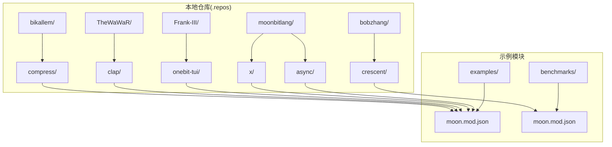
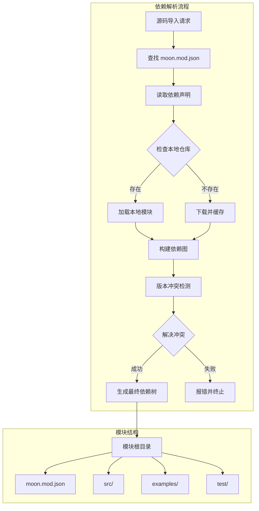
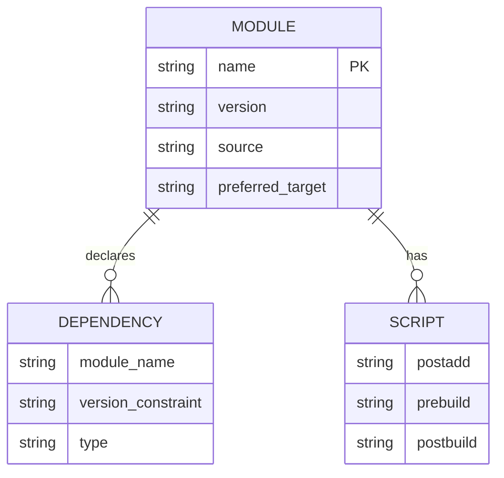
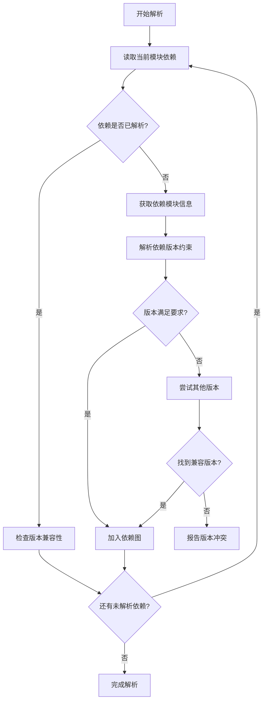
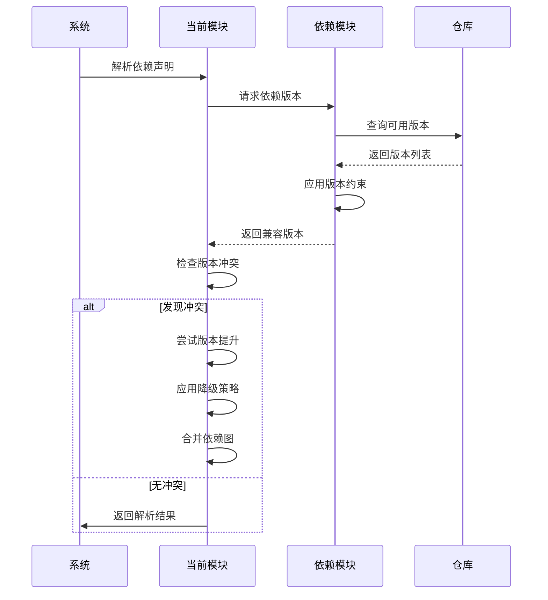
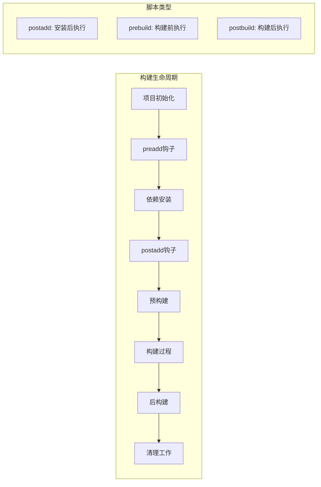
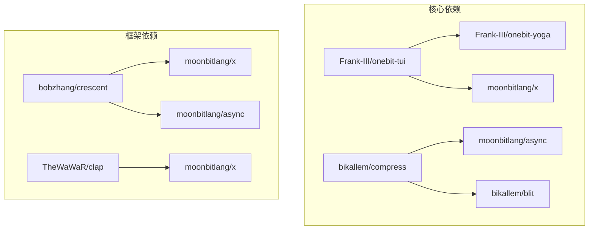
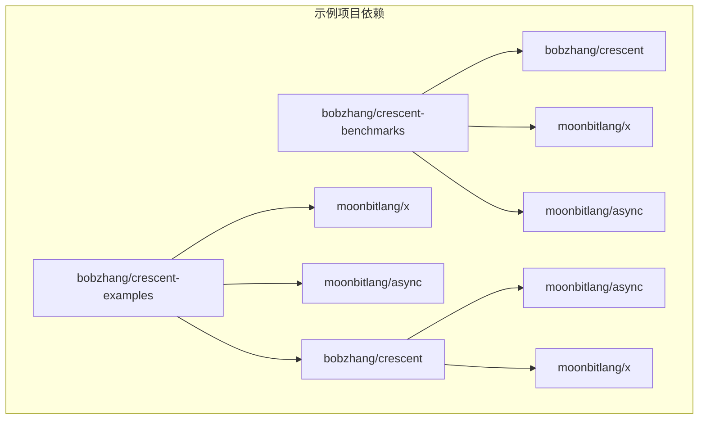

# 依赖管理系统

<cite>
**本文档引用的文件**
- [moon.mod.json](file://.repos/Frank-III/onebit-tui/0.1.3/moon.mod.json)
- [moon.mod.json](file://.repos/TheWaWaR/clap/0.2.6/moon.mod.json)
- [moon.mod.json](file://.repos/bikallem/compress/0.3.4/moon.mod.json)
- [moon.mod.json](file://.repos/bobzhang/crescent/0.10.0/examples/moon.mod.json)
- [moon.mod.json](file://.repos/bobzhang/crescent/0.10.0/benchmarks/moon.mod.json)
- [moon.mod.json](file://.repos/moonbitlang/async/0.19.1/moon.mod.json)
- [moon.mod.json](file://.repos/moonbitlang/x/0.4.43/moon.mod.json)
</cite>

## 目录
1. [简介](#简介)
2. [项目结构](#项目结构)
3. [核心组件](#核心组件)
4. [架构概览](#架构概览)
5. [详细组件分析](#详细组件分析)
6. [依赖关系分析](#依赖关系分析)
7. [性能考虑](#性能考虑)
8. [故障排除指南](#故障排除指南)
9. [结论](#结论)

## 简介

MBOpenClacky 项目采用 MoonBit 语言的模块化依赖管理系统。该项目通过本地仓库（.repos）方式管理第三方依赖，实现了完整的模块导入机制和版本控制策略。

MoonBit 的依赖管理系统基于以下核心概念：
- 模块标识符：采用 "组织名/包名" 格式
- 版本语义：遵循语义化版本控制（SemVer）
- 依赖声明：在 moon.mod.json 文件中明确声明
- 解析机制：从本地仓库查找并解析依赖关系

## 项目结构

项目采用分层的依赖管理架构：



**图表来源**
- [.repos 结构](file://.repos)
- [moon.mod.json 示例](file://.repos/Frank-III/onebit-tui/0.1.3/moon.mod.json)

**章节来源**
- [.repos 目录结构](file://.repos)

## 核心组件

### 模块描述文件 (moon.mod.json)

每个 MoonBit 包都包含一个 moon.mod.json 配置文件，定义了模块的基本信息和依赖关系。

#### 基本字段结构

| 字段名 | 类型 | 必需 | 描述 |
|--------|------|------|------|
| name | string | 是 | 模块完整标识符（组织/包名） |
| version | string | 是 | 模块版本号（语义化版本） |
| readme | string | 否 | 说明文档路径 |
| repository | string | 否 | 代码仓库地址 |
| license | string | 否 | 许可证类型 |
| keywords | array | 否 | 关键词标签 |
| description | string | 否 | 模块描述 |
| deps | object | 否 | 依赖声明对象 |
| source | string | 否 | 源码目录路径 |
| preferred-target | string | 否 | 优先目标平台 |
| exclude | array | 否 | 排除的文件或目录 |
| scripts | object | 否 | 自定义脚本钩子 |

#### 依赖声明机制

依赖通过 deps 对象声明，格式为：
```json
"deps": {
  "模块标识符": "版本约束"
}
```

版本约束支持多种格式：
- 具体版本："0.1.3"
- 版本范围："^0.1.0"（兼容版本）
- 最新版本："*"

**章节来源**
- [moon.mod.json:1-19](file://.repos/Frank-III/onebit-tui/0.1.3/moon.mod.json#L1-L19)
- [moon.mod.json:1-33](file://.repos/bikallem/compress/0.3.4/moon.mod.json#L1-L33)

### 本地仓库管理

项目使用本地仓库模式管理依赖，具有以下特点：

1. **集中存储**：所有依赖包统一存储在 .repos 目录下
2. **版本隔离**：每个包的特定版本独立存放
3. **快速访问**：避免网络下载，提升构建速度
4. **离线可用**：无需网络连接即可进行编译

### 模块导入机制

MoonBit 的模块导入遵循以下规则：

1. **绝对导入**：使用完整模块路径
2. **相对导入**：使用相对路径导入同包内的模块
3. **跨包导入**：通过模块标识符导入其他包的模块
4. **命名空间**：每个包形成独立的命名空间

## 架构概览



**图表来源**
- [moon.mod.json](file://.repos/moonbitlang/async/0.19.1/moon.mod.json)
- [moon.mod.json](file://.repos/moonbitlang/x/0.4.43/moon.mod.json)

## 详细组件分析

### 依赖声明与解析

#### 声明式依赖模型



**图表来源**
- [moon.mod.json:9-17](file://.repos/Frank-III/onebit-tui/0.1.3/moon.mod.json#L9-L17)

#### 依赖解析算法



**图表来源**
- [moon.mod.json:4-7](file://.repos/bikallem/compress/0.3.4/moon.mod.json#L4-L7)

### 版本控制策略

#### 语义化版本管理

项目采用语义化版本控制（Semantic Versioning），版本号格式为：主版本.次版本.修订版

| 版本位 | 变更类型 | 影响范围 |
|--------|----------|----------|
| 主版本 | 不兼容变更 | 可能破坏现有功能 |
| 次版本 | 向后兼容的功能新增 | 新增功能但不破坏现有功能 |
| 修订版 | 向后兼容的问题修复 | 仅修复问题，不影响功能 |

#### 版本约束语法

```mermaid
graph LR
subgraph "版本约束类型"
A[具体版本<br/>"0.1.3"] --> B[精确匹配]
C[兼容版本<br/>"^0.1.0"] --> D[向下兼容]
E[最新版本<br/>"*"] --> F[任意版本]
G[版本范围<br/>">=0.1.0,<0.2.0"] --> H[指定范围]
end
```

**图表来源**
- [moon.mod.json:10-11](file://.repos/Frank-III/onebit-tui/0.1.3/moon.mod.json#L10-L11)

### 依赖冲突解决机制

#### 冲突检测算法



**图表来源**
- [moon.mod.json:4-8](file://.repos/bobzhang/crescent/0.10.0/examples/moon.mod.json#L4-L8)

#### 冲突解决策略

1. **版本提升**：优先选择更高版本的兼容依赖
2. **降级处理**：在必要时降低依赖版本以满足约束
3. **分支合并**：将多个版本的依赖合并到同一依赖树
4. **回退机制**：当无法解决时回退到之前的稳定状态

**章节来源**
- [moon.mod.json:4-8](file://.repos/bobzhang/crescent/0.10.0/benchmarks/moon.mod.json#L4-L8)

### 脚本钩子系统

#### 自定义脚本集成



**图表来源**
- [moon.mod.json:15-17](file://.repos/Frank-III/onebit-tui/0.1.3/moon.mod.json#L15-L17)

**章节来源**
- [moon.mod.json:15-17](file://.repos/Frank-III/onebit-tui/0.1.3/moon.mod.json#L15-L17)

## 依赖关系分析

### 依赖图谱概念

依赖图谱是描述项目中所有模块及其相互依赖关系的可视化表示。它包含以下要素：

1. **节点**：代表各个模块
2. **边**：表示模块间的依赖关系
3. **权重**：表示依赖的版本约束
4. **层次**：表示依赖的深度和方向

### 实际应用示例

#### 一阶依赖关系



**图表来源**
- [moon.mod.json:9-12](file://.repos/Frank-III/onebit-tui/0.1.3/moon.mod.json#L9-L12)
- [moon.mod.json:4-7](file://.repos/bikallem/compress/0.3.4/moon.mod.json#L4-L7)

#### 复杂依赖场景



**图表来源**
- [moon.mod.json:4-8](file://.repos/bobzhang/crescent/0.10.0/examples/moon.mod.json#L4-L8)
- [moon.mod.json:4-8](file://.repos/bobzhang/crescent/0.10.0/benchmarks/moon.mod.json#L4-L8)

**章节来源**
- [moon.mod.json:1-15](file://.repos/bobzhang/crescent/0.10.0/examples/moon.mod.json#L1-L15)
- [moon.mod.json:1-15](file://.repos/bobzhang/crescent/0.10.0/benchmarks/moon.mod.json#L1-L15)

## 性能考虑

### 依赖解析优化

1. **缓存策略**：本地仓库避免重复下载
2. **并行解析**：多依赖同时解析提高效率
3. **增量构建**：只重新构建受影响的模块
4. **版本预取**：提前获取可能需要的依赖版本

### 存储优化

- **去重机制**：相同版本的依赖只存储一份
- **压缩存储**：依赖包采用压缩格式存储
- **按需加载**：只加载当前需要的依赖模块

## 故障排除指南

### 常见问题及解决方案

#### 版本冲突问题

**症状**：构建时出现版本不兼容错误

**解决方案**：
1. 检查所有模块的版本约束
2. 使用兼容版本范围替换具体版本
3. 手动指定统一的依赖版本
4. 更新相关模块到兼容版本

#### 依赖缺失问题

**症状**：找不到指定的依赖模块

**解决方案**：
1. 确认依赖名称拼写正确
2. 检查本地仓库中是否存在该模块
3. 验证模块版本是否正确
4. 清理缓存并重新安装

#### 循环依赖问题

**症状**：构建过程中出现循环引用错误

**解决方案**：
1. 分析依赖图中的循环路径
2. 重构代码结构消除循环依赖
3. 引入抽象层打破循环
4. 重新设计模块接口

**章节来源**
- [moon.mod.json:1-19](file://.repos/Frank-III/onebit-tui/0.1.3/moon.mod.json#L1-L19)
- [moon.mod.json:1-11](file://.repos/TheWaWaR/clap/0.2.6/moon.mod.json#L1-L11)

## 结论

MBOpenClacky 项目的依赖管理系统展现了 MoonBit 语言在模块化开发方面的先进理念。通过本地仓库管理模式、声明式依赖机制和智能冲突解决策略，实现了高效、可靠的依赖管理。

### 主要优势

1. **确定性构建**：本地仓库确保构建过程的可重复性和稳定性
2. **版本控制**：完善的语义化版本支持和冲突解决机制
3. **性能优化**：缓存策略和并行解析提升构建效率
4. **开发体验**：清晰的依赖图谱和直观的错误诊断

### 最佳实践建议

1. **合理使用版本约束**：在保证兼容性的前提下尽量使用宽松的版本范围
2. **定期更新依赖**：及时更新到安全和稳定的版本
3. **维护依赖图谱**：定期审查和优化依赖结构
4. **测试兼容性**：在升级依赖后进行全面的功能测试

这个依赖管理系统为 MoonBit 生态系统的模块化开发提供了坚实的基础，既适合初学者理解基本概念，也为有经验的开发者提供了深入的技术细节。