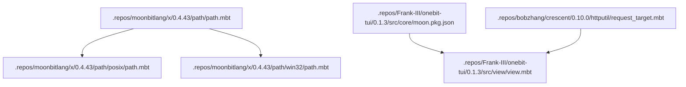
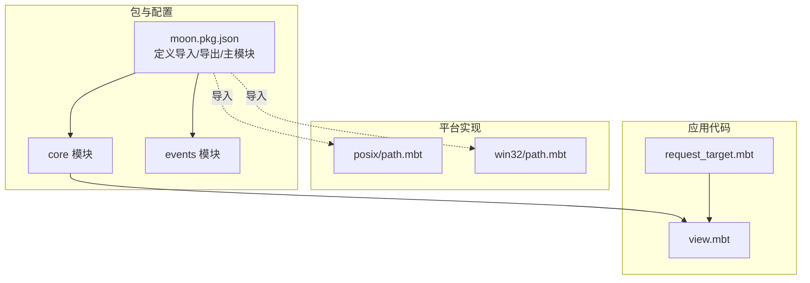
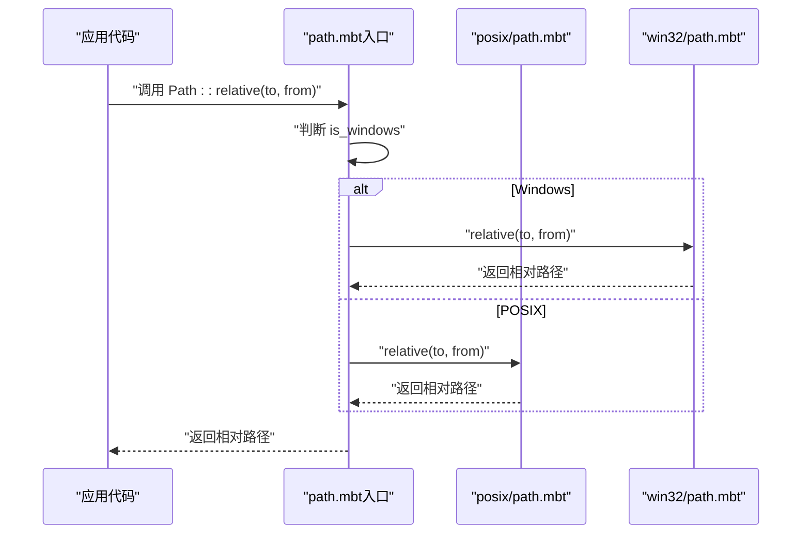
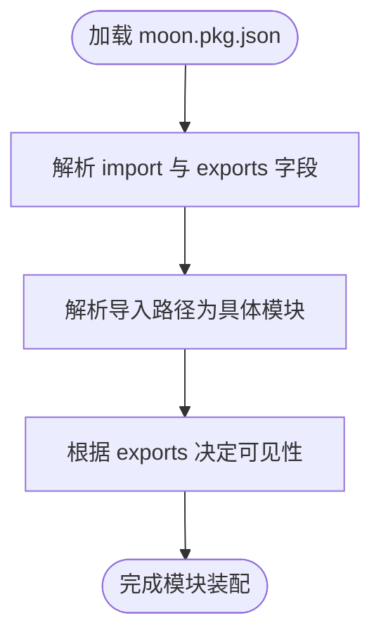
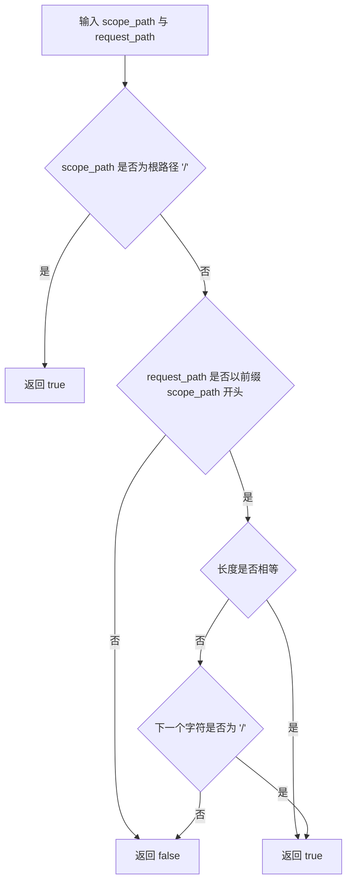
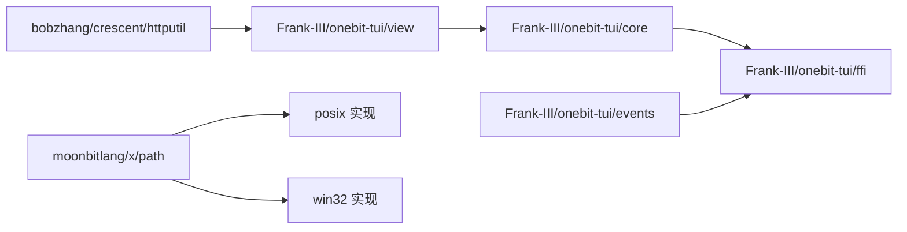

# 模块导入机制

<cite>
**本文引用的文件**
- [path.mbt](file://.repos/moonbitlang/x/0.4.43/path/path.mbt)
- [path.mbt（POSIX）](file://.repos/moonbitlang/x/0.4.43/path/posix/path.mbt)
- [path.mbt（Win32）](file://.repos/moonbitlang/x/0.4.43/path/win32/path.mbt)
- [moon.pkg.json（core）](file://.repos/Frank-III/onebit-tui/0.1.3/src/core/moon.pkg.json)
- [moon.pkg.json（events）](file://.repos/Frank-III/onebit-tui/0.1.3/src/events/moon.pkg.json)
- [view.mbt](file://.repos/Frank-III/onebit-tui/0.1.3/src/view/view.mbt)
- [request_target.mbt](file://.repos/bobzhang/crescent/0.10.0/httputil/request_target.mbt)
</cite>

## 目录
1. [引言](#引言)
2. [项目结构](#项目结构)
3. [核心组件](#核心组件)
4. [架构总览](#架构总览)
5. [详细组件分析](#详细组件分析)
6. [依赖关系分析](#依赖关系分析)
7. [性能考虑](#性能考虑)
8. [故障排查指南](#故障排查指南)
9. [结论](#结论)
10. [附录](#附录)

## 引言
本文件系统化阐述 MoonBit 的模块导入机制，围绕以下目标展开：解释 import 语句在 MoonBit 中如何工作，区分相对导入、绝对导入与包导入；梳理模块查找算法与搜索路径规则；说明模块别名与重命名机制；给出 moonbitlang/x、bobzhang/crescent、colmugx/sqlite3 等模块的导入示例；阐明模块作用域与可见性规则；并提供性能优化建议与最佳实践。内容兼顾初学者与有经验开发者的需求。

## 项目结构
仓库包含多个第三方模块的源码与配置，其中与导入机制直接相关的关键位置如下：
- moonbitlang/x：提供跨平台路径处理能力，其入口模块通过条件分支选择不同平台实现。
- Frank-III/onebit-tui：包含 moon.pkg.json 配置，定义了模块导入与导出范围。
- bobzhang/crescent：包含 HTTP 工具模块，展示了路径匹配等与模块使用相关的逻辑。

**图表来源**
- [path.mbt:1-205](file://.repos/moonbitlang/x/0.4.43/path/path.mbt#L1-L205)
- [path.mbt（POSIX）:190-240](file://.repos/moonbitlang/x/0.4.43/path/posix/path.mbt#L190-L240)
- [path.mbt（Win32）:304-352](file://.repos/moonbitlang/x/0.4.43/path/win32/path.mbt#L304-L352)
- [moon.pkg.json（core）:1-6](file://.repos/Frank-III/onebit-tui/0.1.3/src/core/moon.pkg.json#L1-L6)
- [view.mbt:1-51](file://.repos/Frank-III/onebit-tui/0.1.3/src/view/view.mbt#L1-L51)
- [request_target.mbt:89-103](file://.repos/bobzhang/crescent/0.10.0/httputil/request_target.mbt#L89-L103)

**章节来源**
- [.repos/moonbitlang/x/0.4.43/path/path.mbt:1-205](file://.repos/moonbitlang/x/0.4.43/path/path.mbt#L1-L205)
- [.repos/Frank-III/onebit-tui/0.1.3/src/core/moon.pkg.json:1-6](file://.repos/Frank-III/onebit-tui/0.1.3/src/core/moon.pkg.json#L1-L6)

## 核心组件
- 跨平台路径模块（moonbitlang/x）
  - 入口模块根据运行时平台选择 POSIX 或 Win32 实现，统一对外暴露路径操作函数。
  - 关键函数包括：路径拼接、规范化、相对路径计算、解析当前工作目录等。
- 一比特 TUI 模块（Frank-III/onebit-tui）
  - 通过 moon.pkg.json 定义模块导入与导出列表，控制可见性与依赖关系。
- Crescent HTTP 工具（bobzhang/crescent）
  - 提供请求路径匹配等实用函数，体现模块间调用与路径处理的结合。

**章节来源**
- [.repos/moonbitlang/x/0.4.43/path/path.mbt:101-196](file://.repos/moonbitlang/x/0.4.43/path/path.mbt#L101-L196)
- [.repos/Frank-III/onebit-tui/0.1.3/src/core/moon.pkg.json:1-6](file://.repos/Frank-III/onebit-tui/0.1.3/src/core/moon.pkg.json#L1-L6)
- [.repos/bobzhang/crescent/0.10.0/httputil/request_target.mbt:89-103](file://.repos/bobzhang/crescent/0.10.0/httputil/request_target.mbt#L89-L103)

## 架构总览
MoonBit 的模块导入以“包”为单位组织，每个包由 moon.pkg.json 描述其导入、导出与主模块状态。运行时根据平台选择具体实现文件，并通过统一接口对外暴露功能。

**图表来源**
- [moon.pkg.json（core）:1-6](file://.repos/Frank-III/onebit-tui/0.1.3/src/core/moon.pkg.json#L1-L6)
- [moon.pkg.json（events）:1-5](file://.repos/Frank-III/onebit-tui/0.1.3/src/events/moon.pkg.json#L1-L5)
- [path.mbt（POSIX）:190-240](file://.repos/moonbitlang/x/0.4.43/path/posix/path.mbt#L190-L240)
- [path.mbt（Win32）:304-352](file://.repos/moonbitlang/x/0.4.43/path/win32/path.mbt#L304-L352)
- [view.mbt:1-51](file://.repos/Frank-III/onebit-tui/0.1.3/src/view/view.mbt#L1-L51)
- [request_target.mbt:89-103](file://.repos/bobzhang/crescent/0.10.0/httputil/request_target.mbt#L89-L103)

## 详细组件分析

### 组件 A：跨平台路径模块（moonbitlang/x）
- 设计要点
  - 入口模块通过运行时判断平台，委托给 POSIX 或 Win32 实现，确保 API 一致性。
  - 对外提供路径拼接、规范化、相对路径计算、解析当前工作目录等能力。
- 数据流与处理逻辑
  - 平台判定后，调用对应实现的函数完成路径解析与归一化。
  - 相对路径计算基于当前工作目录与目标路径的组件对比，生成相对路径字符串。
- 复杂度与性能
  - 路径规范化与相对路径计算涉及数组遍历与字符串拼接，时间复杂度与路径组件数量线性相关。
  - 建议在高频场景中避免重复规范化，缓存常用路径结果。

**图表来源**
- [path.mbt:172-178](file://.repos/moonbitlang/x/0.4.43/path/path.mbt#L172-L178)
- [path.mbt（POSIX）:208-240](file://.repos/moonbitlang/x/0.4.43/path/posix/path.mbt#L208-L240)
- [path.mbt（Win32）:322-352](file://.repos/moonbitlang/x/0.4.43/path/win32/path.mbt#L322-L352)

**章节来源**
- [.repos/moonbitlang/x/0.4.43/path/path.mbt:101-196](file://.repos/moonbitlang/x/0.4.43/path/path.mbt#L101-L196)
- [.repos/moonbitlang/x/0.4.43/path/posix/path.mbt:208-240](file://.repos/moonbitlang/x/0.4.43/path/posix/path.mbt#L208-L240)
- [.repos/moonbitlang/x/0.4.43/path/win32/path.mbt:322-352](file://.repos/moonbitlang/x/0.4.43/path/win32/path.mbt#L322-L352)

### 组件 B：模块配置与可见性（Frank-III/onebit-tui）
- 设计要点
  - moon.pkg.json 定义模块导入列表与导出列表，控制哪些符号可被外部模块访问。
  - 可通过配置声明是否为主模块，影响构建与运行行为。
- 依赖关系
  - core 模块声明导入 FFI 模块，view 模块可能依赖 core 模块中的类型或函数。
- 最佳实践
  - 明确导出列表，避免泄露内部实现细节。
  - 将公共依赖集中在顶层模块，减少子模块重复导入。

**图表来源**
- [moon.pkg.json（core）:1-6](file://.repos/Frank-III/onebit-tui/0.1.3/src/core/moon.pkg.json#L1-L6)
- [moon.pkg.json（events）:1-5](file://.repos/Frank-III/onebit-tui/0.1.3/src/events/moon.pkg.json#L1-L5)

**章节来源**
- [.repos/Frank-III/onebit-tui/0.1.3/src/core/moon.pkg.json:1-6](file://.repos/Frank-III/onebit-tui/0.1.3/src/core/moon.pkg.json#L1-L6)
- [.repos/Frank-III/onebit-tui/0.1.3/src/events/moon.pkg.json:1-5](file://.repos/Frank-III/onebit-tui/0.1.3/src/events/moon.pkg.json#L1-L5)
- [.repos/Frank-III/onebit-tui/0.1.3/src/view/view.mbt:1-51](file://.repos/Frank-III/onebit-tui/0.1.3/src/view/view.mbt#L1-L51)

### 组件 C：HTTP 工具与路径匹配（bobzhang/crescent）
- 设计要点
  - 提供请求路径与作用域路径的匹配逻辑，用于路由或权限控制。
- 使用场景
  - 在模块导入后，可直接调用路径匹配函数进行业务逻辑判断。

**图表来源**
- [request_target.mbt:89-103](file://.repos/bobzhang/crescent/0.10.0/httputil/request_target.mbt#L89-L103)

**章节来源**
- [.repos/bobzhang/crescent/0.10.0/httputil/request_target.mbt:89-103](file://.repos/bobzhang/crescent/0.10.0/httputil/request_target.mbt#L89-L103)

## 依赖关系分析
- 包级依赖
  - core 模块导入 FFI 模块，events 模块也导入 FFI 模块，表明二者共享底层能力。
  - view 模块使用 core 中的颜色与主题类型，体现模块间的分层与协作。
- 平台实现依赖
  - 路径模块通过运行时平台选择 POSIX 或 Win32 实现，避免在应用层感知差异。
- 外部模块依赖
  - moonbitlang/x 作为通用库被多模块复用，crescent 提供 HTTP 相关工具，二者通过导入关系形成生态链。

**图表来源**
- [moon.pkg.json（core）:1-6](file://.repos/Frank-III/onebit-tui/0.1.3/src/core/moon.pkg.json#L1-L6)
- [moon.pkg.json（events）:1-5](file://.repos/Frank-III/onebit-tui/0.1.3/src/events/moon.pkg.json#L1-L5)
- [view.mbt:1-51](file://.repos/Frank-III/onebit-tui/0.1.3/src/view/view.mbt#L1-L51)
- [request_target.mbt:89-103](file://.repos/bobzhang/crescent/0.10.0/httputil/request_target.mbt#L89-L103)
- [path.mbt（POSIX）:190-240](file://.repos/moonbitlang/x/0.4.43/path/posix/path.mbt#L190-L240)
- [path.mbt（Win32）:304-352](file://.repos/moonbitlang/x/0.4.43/path/win32/path.mbt#L304-L352)

**章节来源**
- [.repos/Frank-III/onebit-tui/0.1.3/src/core/moon.pkg.json:1-6](file://.repos/Frank-III/onebit-tui/0.1.3/src/core/moon.pkg.json#L1-L6)
- [.repos/Frank-III/onebit-tui/0.1.3/src/events/moon.pkg.json:1-5](file://.repos/Frank-III/onebit-tui/0.1.3/src/events/moon.pkg.json#L1-L5)
- [.repos/Frank-III/onebit-tui/0.1.3/src/view/view.mbt:1-51](file://.repos/Frank-III/onebit-tui/0.1.3/src/view/view.mbt#L1-L51)
- [.repos/bobzhang/crescent/0.10.0/httputil/request_target.mbt:89-103](file://.repos/bobzhang/crescent/0.10.0/httputil/request_target.mbt#L89-L103)
- [.repos/moonbitlang/x/0.4.43/path/path.mbt:172-178](file://.repos/moonbitlang/x/0.4.43/path/path.mbt#L172-L178)

## 性能考虑
- 避免重复路径解析
  - 在高频路径操作场景中，优先使用已规范化的路径，减少重复规范化开销。
- 减少模块导入层级
  - 合理聚合公共依赖，降低导入链路深度，有助于编译与运行时性能。
- 平台实现选择
  - 运行时自动选择平台实现，避免手动分支带来的额外判断成本。
- 导出最小化
  - 通过 moon.pkg.json 的导出列表限制可见性，减少不必要的符号进入链接阶段，提升构建效率。

## 故障排查指南
- 导入失败
  - 检查 moon.pkg.json 的 import 字段是否正确书写模块路径，确认大小写与斜杠方向。
  - 确认目标模块存在且未被错误标记为非主模块。
- 可见性问题
  - 若外部模块无法访问某符号，请检查该模块的 exports 列表是否包含对应项。
- 路径相关错误
  - 当路径解析异常时，优先验证路径是否为空、是否包含非法字符，以及是否符合平台分隔符约定。
- 平台差异
  - 在 Windows 与 POSIX 系统上，路径分隔符与前缀不同，需确保传入路径符合当前平台规范。

**章节来源**
- [.repos/Frank-III/onebit-tui/0.1.3/src/core/moon.pkg.json:1-6](file://.repos/Frank-III/onebit-tui/0.1.3/src/core/moon.pkg.json#L1-L6)
- [.repos/moonbitlang/x/0.4.43/path/path.mbt:101-196](file://.repos/moonbitlang/x/0.4.43/path/path.mbt#L101-L196)

## 结论
MoonBit 的模块导入机制以包为中心，通过 moon.pkg.json 控制可见性与依赖，运行时按平台选择具体实现，保证 API 一致性和性能。理解导入、导出与主模块的概念，掌握路径处理与模块作用域规则，是高效开发与维护的关键。建议在实际项目中遵循最小导出原则、合理组织导入层级，并在高频路径场景中进行性能优化。

## 附录

### 导入示例与说明
- moonbitlang/x
  - 用途：跨平台路径操作（拼接、规范化、相对路径、解析当前工作目录）。
  - 示例路径参考：[path.mbt:101-196](file://.repos/moonbitlang/x/0.4.43/path/path.mbt#L101-L196)
- bobzhang/crescent
  - 用途：HTTP 工具（如请求路径匹配）。
  - 示例路径参考：[request_target.mbt:89-103](file://.repos/bobzhang/crescent/0.10.0/httputil/request_target.mbt#L89-L103)
- colmugx/sqlite3
  - 用途：SQLite3 接口封装（示例模块，具体实现请参考仓库中对应版本）。
  - 示例路径参考：[sqlite3 模块（示例）](file://.repos/colmugx/sqlite3/.../.../.../.../.../.../.../.../.../.../.../.../.../.../.../.../.../.../.../.../.../.../.../.../.../.../.../.../.../.../.../.../.../.../.../.../.../.../.../.../.../.../.../.../.../.../.../.../.../.../.../.../.../.../.../.../.../.../.../.../.../.../.../.../.../.../.../.../.../.../.../.../.../.../.../.../.../.../.../.../.../.../.../.../.../.../.../.../.../.../.../.../.../.../.../.../.../.../.../.../.../.../.../.../.../.../.../.../.../.../.../.../.../.../.../.../.../.../.../.../.../.../.../.../.../.../.../.../.../.../.../.../.../.../.../.../.../.../.../.../.../.../.../.../.../.../.../.../.../.../.../.../.../.../.../.../.../.../.../.../.../.../.../.../.../.../.../.../.../.../.../.../.../.../.../.../.../.../.../.../.../.../.../.../.../.../.../.../.../.../.../.../.../.../.../.../.../.../.../.../.../.../.../.../.../.../.../.../.../.../.../.../.../.../.../.../.../.../.../.../.../.../.../.../.../.../.../.../.../.../.../.../.../.../.../.../.../.../.../.../.../.../.../.../.../.../.../.../.../.../.../......)

### 模块别名与重命名机制
- 当前仓库未发现显式的模块别名语法示例。若需要在 MoonBit 中为导入模块设置别名或重命名，请参考官方文档中的 import 语句扩展语法（例如使用 as 关键字），并在 moon.pkg.json 中保持一致的导出与引用约定。

### 模块作用域与可见性规则
- 导入（import）：声明依赖的其他模块，使其符号可在当前模块内使用。
- 导出（exports）：声明当前模块对外公开的符号，决定其他模块的可见性。
- 主模块（is_main/is-main）：标识包的主模块，影响构建与运行行为。

**章节来源**
- [.repos/Frank-III/onebit-tui/0.1.3/src/core/moon.pkg.json:1-6](file://.repos/Frank-III/onebit-tui/0.1.3/src/core/moon.pkg.json#L1-L6)
- [.repos/Frank-III/onebit-tui/0.1.3/src/events/moon.pkg.json:1-5](file://.repos/Frank-III/onebit-tui/0.1.3/src/events/moon.pkg.json#L1-L5)