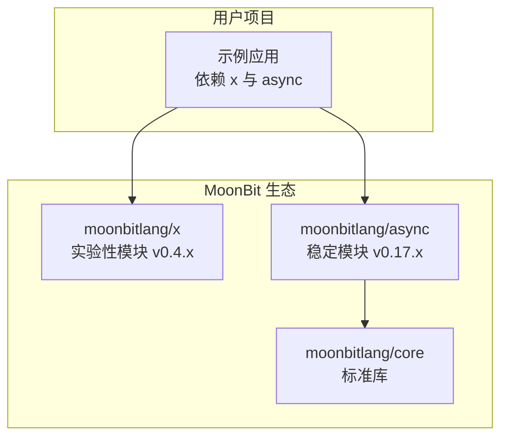
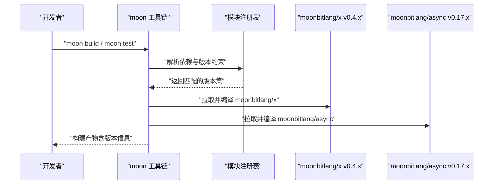
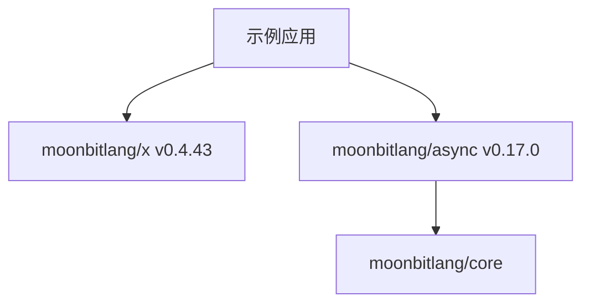

# 版本控制策略

<cite>
**本文引用的文件**
- [ARCHITECTURE.md](file://.repos\bobzhang\crescent\0.10.0\ARCHITECTURE.md)
- [README.md](file://.repos\moonbitlang\x\0.4.43\README.md)
- [moon.mod.json](file://.repos\moonbitlang\x\0.4.43\moon.mod.json)
- [pkg.generated.mbti](file://.repos\moonbitlang\x\0.4.43\json5\pkg.generated.mbti)
- [update.sh](file://.repos\gmlewis\hash\0.20.7\update.sh)
</cite>

## 目录
1. [引言](#引言)
2. [项目结构](#项目结构)
3. [核心组件](#核心组件)
4. [架构总览](#架构总览)
5. [详细组件分析](#详细组件分析)
6. [依赖关系分析](#依赖关系分析)
7. [性能考量](#性能考量)
8. [故障排查指南](#故障排查指南)
9. [结论](#结论)
10. [附录](#附录)

## 引言
本文件面向 MoonBit 项目的版本控制策略，系统阐述 semver 语义化版本控制在 MoonBit 生态中的应用方式，包括版本号格式、兼容性规则、版本范围与约束表达、升级最佳实践、实验性模块与稳定模块的差异、版本冲突检测与解决策略，并结合仓库中实际模块示例（如 moonbitlang/x、moonbitlang/async）给出可操作的版本管理建议与常见问题处理方案。

## 项目结构
本仓库展示了 MoonBit 生态中多个模块的版本化组织方式，典型特征如下：
- 模块元数据通过模块级配置文件维护，例如 moon.mod.json，其中包含模块名称、版本、描述等信息。
- 实验性模块（如 moonbitlang/x）采用独立仓库与版本号管理，用于快速演进与社区反馈收集。
- 稳定模块（如 moonbitlang/async）在框架或生态成熟后逐步迁入标准库或作为稳定依赖被引用。

图示来源
- [.repos\moonbitlang\x\0.4.43\moon.mod.json:1-9](file://.repos\moonbitlang\x\0.4.43\moon.mod.json#L1-L9)
- [.repos\moonbitlang\x\0.4.43\README.md:1-38](file://.repos\moonbitlang\x\0.4.43\README.md#L1-L38)
- [.repos\bobzhang\crescent\0.10.0\ARCHITECTURE.md:348-356](file://.repos\bobzhang\crescent\0.10.0\ARCHITECTURE.md#L348-L356)

章节来源
- [.repos\moonbitlang\x\0.4.43\moon.mod.json:1-9](file://.repos\moonbitlang\x\0.4.43\moon.mod.json#L1-L9)
- [.repos\moonbitlang\x\0.4.43\README.md:1-38](file://.repos\moonbitlang\x\0.4.43\README.md#L1-L38)
- [.repos\bobzhang\crescent\0.10.0\ARCHITECTURE.md:348-356](file://.repos\bobzhang\crescent\0.10.0\ARCHITECTURE.md#L348-L356)

## 核心组件
- 模块元数据与版本声明：模块通过 moon.mod.json 声明自身版本，便于工具链解析与依赖解析。
- 实验性模块（moonbitlang/x）：用于承载尚未进入标准库的实验性能力，版本迭代更频繁，API 变更风险较高。
- 稳定模块（moonbitlang/async）：提供稳定的运行时与网络能力，版本遵循 semver 兼容性约定。
- 生成接口文件（pkg.generated.mbti）：导出包的公开类型、错误与特性，是版本兼容性验证的重要依据。

章节来源
- [.repos\moonbitlang\x\0.4.43\moon.mod.json:1-9](file://.repos\moonbitlang\x\0.4.43\moon.mod.json#L1-L9)
- [.repos\moonbitlang\x\0.4.43\README.md:1-38](file://.repos\moonbitlang\x\0.4.43\README.md#L1-L38)
- [.repos\moonbitlang\x\0.4.43\json5\pkg.generated.mbti:1-35](file://.repos\moonbitlang\x\0.4.43\json5\pkg.generated.mbti#L1-L35)
- [.repos\bobzhang\crescent\0.10.0\ARCHITECTURE.md:348-356](file://.repos\bobzhang\crescent\0.10.0\ARCHITECTURE.md#L348-L356)

## 架构总览
下图展示 MoonBit 项目对依赖模块的版本选择与兼容性影响路径。用户项目在构建时会根据依赖声明解析到具体版本，实验性模块与稳定模块的版本变化可能影响编译期类型与运行期行为。

图示来源
- [.repos\bobzhang\crescent\0.10.0\ARCHITECTURE.md:348-356](file://.repos\bobzhang\crescent\0.10.0\ARCHITECTURE.md#L348-L356)
- [.repos\moonbitlang\x\0.4.43\README.md:1-38](file://.repos\moonbitlang\x\0.4.43\README.md#L1-L38)

## 详细组件分析

### 组件 A：semver 语义化版本控制在 MoonBit 的应用
- 版本号格式：主版本.次版本.修订版本（例如 0.4.43、0.17.0）。主版本号变更通常表示破坏性更新；次版本号变更表示向后兼容的功能新增；修订版本号变更表示向后兼容的问题修复。
- 兼容性规则：
  - 向后兼容：次版本与修订版本的更新不应破坏现有 API 使用。
  - 破坏性变更：仅在主版本号递增时引入，需配合迁移指南与测试覆盖。
- 在 MoonBit 生态中，稳定模块（如 moonbitlang/async）应严格遵循 semver；实验性模块（如 moonbitlang/x）允许更灵活的演进，但建议在版本号中体现其实验性质与潜在不稳定性。

章节来源
- [.repos\moonbitlang\x\0.4.43\README.md:1-38](file://.repos\moonbitlang\x\0.4.43\README.md#L1-L38)
- [.repos\bobzhang\crescent\0.10.0\ARCHITECTURE.md:348-356](file://.repos\bobzhang\crescent\0.10.0\ARCHITECTURE.md#L348-L356)

### 组件 B：在 moon.mod.json 中指定版本范围与约束条件
- 模块元数据：moon.mod.json 包含模块名称、版本、仓库地址、许可证等信息，是版本解析与发布流程的基础。
- 版本约束：在实际项目中，版本范围可通过依赖声明语法表达（例如使用插入符号 ^ 或波浪号 ~ 等），以允许在兼容范围内自动升级次要版本或修订版本，同时避免破坏性更新。
- 示例参考：moonbitlang/x 与 moonbitlang/async 的版本号分别为 0.4.43 与 0.17.0，表明它们处于不同的演进阶段。

章节来源
- [.repos\moonbitlang\x\0.4.43\moon.mod.json:1-9](file://.repos\moonbitlang\x\0.4.43\moon.mod.json#L1-L9)
- [.repos\bobzhang\crescent\0.10.0\ARCHITECTURE.md:348-356](file://.repos\bobzhang\crescent\0.10.0\ARCHITECTURE.md#L348-L356)

### 组件 C：实验性版本（如 x 库）与稳定版本的区别
- 实验性模块（moonbitlang/x）：
  - 定位：承载尚未进入标准库的实验性能力，API 变更频率高，稳定性较低。
  - 版本策略：建议在版本号中体现实验性质，便于使用者评估风险。
  - 迁移路径：随着功能成熟与社区反馈，逐步合并至标准库或形成稳定模块。
- 稳定模块（moonbitlang/async）：
  - 定位：提供成熟的运行时与网络能力，版本演进遵循 semver 兼容性。
  - 版本策略：优先保证向后兼容，破坏性变更需谨慎并提供迁移指导。

章节来源
- [.repos\moonbitlang\x\0.4.43\README.md:1-38](file://.repos\moonbitlang\x\0.4.43\README.md#L1-L38)
- [.repos\bobzhang\crescent\0.10.0\ARCHITECTURE.md:348-356](file://.repos\bobzhang\crescent\0.10.0\ARCHITECTURE.md#L348-L356)

### 组件 D：版本升级的最佳实践与注意事项
- 最佳实践：
  - 对稳定模块采用 semver 的兼容升级策略，优先使用插入符号 ^ 限定主版本不变。
  - 对实验性模块采用更严格的锁定策略，避免频繁的破坏性变更影响构建稳定性。
  - 在 CI 中执行多版本兼容性测试，确保升级不会引入回归。
- 注意事项：
  - 升级前进行充分的本地与 CI 测试，关注生成接口文件（pkg.generated.mbti）中的类型变更。
  - 关注模块 README 中的变更说明与迁移指引，尤其是实验性模块的不稳定提示。

章节来源
- [.repos\moonbitlang\x\0.4.43\README.md:1-38](file://.repos\moonbitlang\x\0.4.43\README.md#L1-L38)
- [.repos\moonbitlang\x\0.4.43\json5\pkg.generated.mbti:1-35](file://.repos\moonbitlang\x\0.4.43\json5\pkg.generated.mbti#L1-L35)
- [.repos\gmlewis\hash\0.20.7\update.sh:1-4](file://.repos\gmlewis\hash\0.20.7\update.sh#L1-L4)

### 组件 E：版本冲突检测与解决策略
- 冲突检测：
  - 当多个依赖同时指向同一模块的不同版本时，工具链会尝试解析到一个统一版本；若无法满足兼容性约束，则报告冲突。
  - 通过查看依赖树与版本范围，定位冲突来源模块与版本区间。
- 解决策略：
  - 统一升级到更高版本：当存在兼容性时，优先将所有依赖升级到最新稳定版本。
  - 锁定关键模块版本：对实验性模块采用固定版本，避免随时间漂移导致的不一致。
  - 分支隔离：在大型项目中，将实验性模块与稳定模块的使用限制在不同子系统，降低耦合度。

章节来源
- [.repos\bobzhang\crescent\0.10.0\ARCHITECTURE.md:348-356](file://.repos\bobzhang\crescent\0.10.0\ARCHITECTURE.md#L348-L356)
- [.repos\moonbitlang\x\0.4.43\README.md:1-38](file://.repos\moonbitlang\x\0.4.43\README.md#L1-L38)

### 组件 F：版本管理示例与常见问题解决方案
- 示例场景：
  - 项目同时依赖 moonbitlang/x 与 moonbitlang/async，前者版本为 0.4.43，后者为 0.17.0。建议在构建脚本中先执行更新命令，再进行格式化、信息查询与测试，确保依赖一致性。
- 常见问题：
  - 实验性模块频繁变更导致构建失败：建议在项目中锁定实验性模块版本，或在 CI 中对实验性模块单独测试。
  - 生成接口文件类型不匹配：检查 pkg.generated.mbti 中导出的类型与错误定义是否与当前版本一致，必要时重新生成或同步版本。

章节来源
- [.repos\gmlewis\hash\0.20.7\update.sh:1-4](file://.repos\gmlewis\hash\0.20.7\update.sh#L1-L4)
- [.repos\moonbitlang\x\0.4.43\json5\pkg.generated.mbti:1-35](file://.repos\moonbitlang\x\0.4.43\json5\pkg.generated.mbti#L1-L35)

## 依赖关系分析
下图展示示例应用对 moonbitlang/x 与 moonbitlang/async 的依赖关系，以及它们与标准库的关系。

图示来源
- [.repos\bobzhang\crescent\0.10.0\ARCHITECTURE.md:348-356](file://.repos\bobzhang\crescent\0.10.0\ARCHITECTURE.md#L348-L356)
- [.repos\moonbitlang\x\0.4.43\moon.mod.json:1-9](file://.repos\moonbitlang\x\0.4.43\moon.mod.json#L1-L9)

章节来源
- [.repos\bobzhang\crescent\0.10.0\ARCHITECTURE.md:348-356](file://.repos\bobzhang\crescent\0.10.0\ARCHITECTURE.md#L348-L356)
- [.repos\moonbitlang\x\0.4.43\moon.mod.json:1-9](file://.repos\moonbitlang\x\0.4.43\moon.mod.json#L1-L9)

## 性能考量
- 版本锁定与缓存：在 CI 中缓存依赖解析结果与构建产物，减少重复下载与解析时间。
- 依赖精简：定期清理不再使用的依赖，降低解析复杂度与构建时间。
- 实验性模块隔离：将实验性模块限制在特定子系统，避免全局传播带来的版本漂移与性能回退。

## 故障排查指南
- 构建失败与版本不兼容：
  - 检查 moon.mod.json 中的版本范围与实际可用版本是否匹配。
  - 查看 pkg.generated.mbti 中导出类型与错误定义是否与当前版本一致。
- 实验性模块不稳定：
  - 在项目中锁定实验性模块版本，避免随时间漂移。
  - 将实验性模块的使用限制在可控范围内，便于快速回滚。
- CI 多版本测试：
  - 在 CI 中增加多版本矩阵测试，覆盖关键稳定模块与实验性模块的组合。

章节来源
- [.repos\moonbitlang\x\0.4.43\README.md:1-38](file://.repos\moonbitlang\x\0.4.43\README.md#L1-L38)
- [.repos\moonbitlang\x\0.4.43\json5\pkg.generated.mbti:1-35](file://.repos\moonbitlang\x\0.4.43\json5\pkg.generated.mbti#L1-L35)
- [.repos\gmlewis\hash\0.20.7\update.sh:1-4](file://.repos\gmlewis\hash\0.20.7\update.sh#L1-L4)

## 结论
MoonBit 的版本控制策略应以 semver 为基础，结合实验性模块与稳定模块的不同演进节奏，制定差异化的版本管理策略。通过明确的版本范围约束、严格的兼容性测试与完善的冲突解决流程，可以在保证开发效率的同时，最大化系统的稳定性与可维护性。

## 附录
- 初学者建议：从稳定模块开始，逐步引入实验性模块；在项目中明确记录版本策略与升级流程。
- 高级用户建议：利用 CI 多版本矩阵测试、依赖锁与生成接口文件校验，实现自动化与可视化的版本治理。