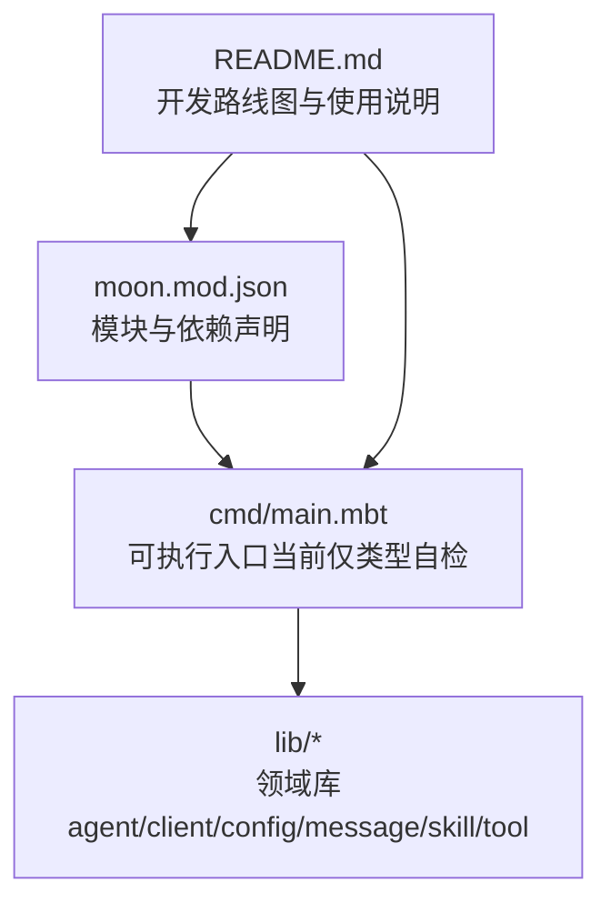
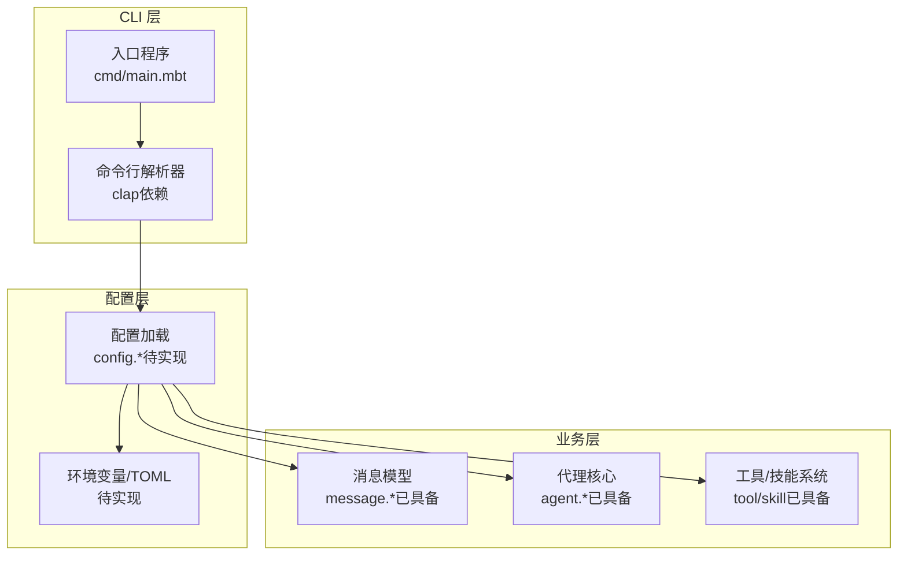
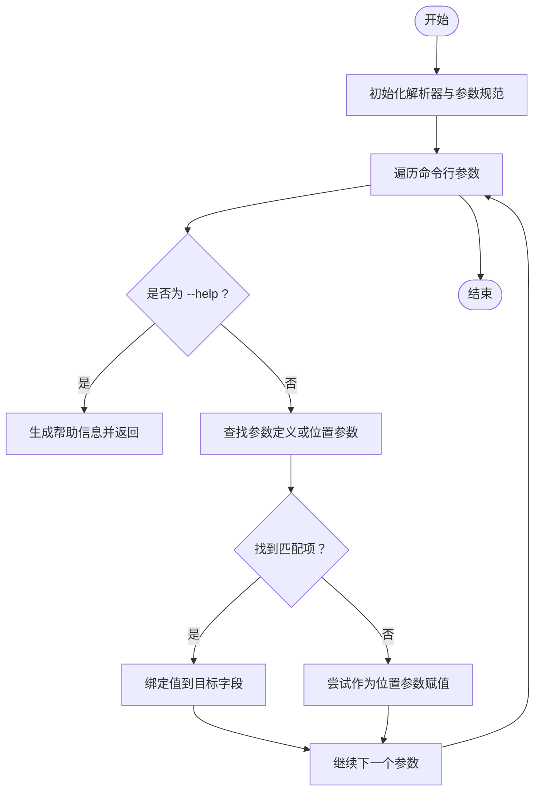
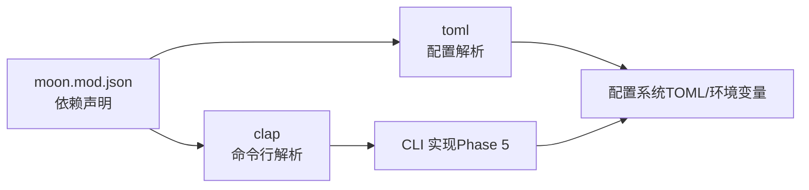

# 命令行界面

<cite>
**本文引用的文件**
- [cmd/main.mbt](file://cmd/main.mbt)
- [README.md](file://README.md)
- [moon.mod.json](file://moon.mod.json)
- [.mooncakes/TheWaWaR/clap/src/parser.mbt](file://.mooncakes/TheWaWaR/clap/src/parser.mbt)
</cite>

## 目录
1. [简介](#简介)
2. [项目结构](#项目结构)
3. [核心组件](#核心组件)
4. [架构总览](#架构总览)
5. [详细组件分析](#详细组件分析)
6. [依赖分析](#依赖分析)
7. [性能考虑](#性能考虑)
8. [故障排查指南](#故障排查指南)
9. [结论](#结论)
10. [附录](#附录)

## 简介
本文件为 MBOpenClacky 的命令行界面（CLI）提供系统化文档。根据当前仓库内容，CLI 当前处于“脚手架与核心类型自检”阶段，尚未实现完整的参数解析与子命令功能。本文基于现有实现与开发路线图，给出 CLI 设计思路、参数解析机制、用户交互模式、可用参数与子命令的规划、与内部配置系统的映射关系、错误处理与帮助信息、调试选项以及从入门到进阶的使用建议。

## 项目结构
- 可执行入口位于 cmd/main.mbt，当前仅进行核心类型的初始化演示与默认配置打印，用于验证工程脚手架与依赖可用性。
- 项目模块与依赖定义于 moon.mod.json，其中声明了与 CLI 相关的依赖：clap（命令行解析）、toml（配置解析）等。
- README.md 提供了完整的开发路线图，明确 Phase 5 为 CLI 界面（基于 clap），Phase 6 为 TUI 界面，Phase 7 为 Web 服务器。

**图表来源**
- [cmd/main.mbt:1-27](file://cmd/main.mbt#L1-L27)
- [moon.mod.json:1-16](file://moon.mod.json#L1-L16)
- [README.md:159-177](file://README.md#L159-L177)

**章节来源**
- [cmd/main.mbt:1-27](file://cmd/main.mbt#L1-L27)
- [README.md:83-151](file://README.md#L83-L151)
- [moon.mod.json:1-16](file://moon.mod.json#L1-L16)

## 核心组件
- 可执行入口（cmd/main.mbt）
  - 打印版本与简要说明
  - 初始化默认 Agent 配置并打印关键字段
  - 构造用户消息并打印角色与内容
  - 创建 Agent 实例并打印会话、状态与来源
  - 输出“核心类型初始化成功”的提示
- 依赖与模块
  - moon.mod.json 声明了 clap（命令行解析）、toml（配置解析）等依赖，为后续 CLI 功能奠定基础
- 开发路线图
  - Phase 5：CLI 界面（基于 clap）
  - Phase 6：TUI 界面（基于 onebit-tui）
  - Phase 7：Web 服务器（基于 crescent）

**章节来源**
- [cmd/main.mbt:3-26](file://cmd/main.mbt#L3-L26)
- [moon.mod.json:4-8](file://moon.mod.json#L4-L8)
- [README.md:159-177](file://README.md#L159-L177)

## 架构总览
下图展示了 CLI 的整体设计思路：入口负责初始化与演示，随后通过配置系统加载用户设置，再进入交互循环或执行具体子命令。当前入口尚未接入参数解析与子命令，但已预留与配置系统对接的空间。

**图表来源**
- [cmd/main.mbt:3-26](file://cmd/main.mbt#L3-L26)
- [moon.mod.json:4-8](file://moon.mod.json#L4-L8)

## 详细组件分析

### 参数解析机制（基于 clap 依赖）
- 解析流程概述
  - 解析器接收命令行参数数组与可选环境变量映射
  - 分析参数规范，生成帮助信息或执行参数绑定
  - 支持全局参数、位置参数与子命令链
  - 遇到 “--help” 时返回帮助文本
- 关键行为
  - 命令名与子命令链维护
  - 参数长度统计与校验
  - 当遇到未知参数或位置参数不匹配时，抛出解析错误
- 适用范围
  - 作为 CLI 的基础解析能力，支持后续 Phase 5 的实现

**图表来源**
- [.mooncakes/TheWaWaR/clap/src/parser.mbt:39-76](file://.mooncakes/TheWaWaR/clap/src/parser.mbt#L39-L76)

**章节来源**
- [.mooncakes/TheWaWaR/clap/src/parser.mbt:39-76](file://.mooncakes/TheWaWaR/clap/src/parser.mbt#L39-L76)

### 用户交互模式（规划）
- 交互循环
  - 读取用户输入，封装为消息对象
  - 将消息交由代理核心处理，触发工具调用或技能执行
  - 流式输出响应（SSE/流式接口，后续阶段）
- 子命令
  - 会话管理：列出、切换、删除会话
  - 配置管理：查看、更新配置项（与 TOML/环境变量映射）
  - 工具/技能：执行内置工具或技能
  - 导出/导入：导出会话记录或批量导入
- 调试与诊断
  - 详细日志开关
  - 请求/响应转储
  - 性能指标采集

（本节为基于开发路线图的规划说明，不直接分析具体文件）

### 命令行参数与内部配置系统的映射（规划）
- 参数到配置字段的映射
  - --max-tokens -> 配置中的最大令牌数
  - --permission -> 权限模式（例如只读/可写）
  - --model -> LLM 模型名称
  - --temperature -> 采样温度
  - --session-id -> 当前会话标识
  - --config-file -> TOML 配置文件路径
- 环境变量优先级
  - CLI 参数 > 环境变量 > TOML 配置 > 默认值
- 配置加载顺序
  - 读取默认配置
  - 应用 TOML 文件覆盖
  - 应用环境变量覆盖
  - 应用 CLI 参数覆盖

（本节为基于开发路线图的规划说明，不直接分析具体文件）

### 使用示例（规划）
- 基础启动
  - 直接运行入口，观察默认配置与类型初始化结果
- 会话交互
  - 输入自然语言，查看代理回复
  - 使用工具/技能扩展能力
- 高级配置
  - 指定配置文件路径
  - 设置模型与采样参数
  - 控制权限模式与最大令牌数

（本节为基于开发路线图的规划说明，不直接分析具体文件）

## 依赖分析
- 依赖关系
  - moon.mod.json 声明了 clap、toml 等依赖，为 CLI 与配置系统提供基础能力
  - README.md 的开发路线图明确了 Phase 5（CLI）、Phase 6（TUI）、Phase 7（Web）的演进顺序
- 潜在耦合
  - CLI 与配置系统紧密耦合，需确保参数解析与配置加载的一致性
  - 与上游依赖（clap）的升级需关注解析行为变化

**图表来源**
- [moon.mod.json:4-8](file://moon.mod.json#L4-L8)

**章节来源**
- [moon.mod.json:4-8](file://moon.mod.json#L4-L8)
- [README.md:159-177](file://README.md#L159-L177)

## 性能考虑
- 启动时间
  - MoonBit AOT 编译到原生代码，相比解释型语言具有更快的启动速度
- 内存占用
  - 无运行时虚拟机开销，部署更轻量
- 并发与流式
  - 后续阶段将引入异步原语与流式响应处理，提升交互体验

（本节为一般性讨论，不直接分析具体文件）

## 故障排查指南
- 常见问题
  - 参数解析失败：检查参数拼写与顺序，确认是否为未知参数
  - 配置加载异常：检查 TOML 文件格式与路径，确认环境变量键名正确
  - 会话/权限相关错误：确认权限模式与会话 ID 是否匹配
- 调试建议
  - 启用详细日志，观察参数绑定与配置加载过程
  - 使用 --help 查看帮助信息，核对可用参数与子命令
  - 逐步缩小问题范围：先验证入口初始化，再验证配置加载，最后验证交互循环

（本节为一般性讨论，不直接分析具体文件）

## 结论
当前 MBOpenClacky 的 CLI 处于早期阶段，入口已完成核心类型自检，为后续 Phase 5 的 CLI 实现打下基础。基于 moon.mod.json 与 README.md 的依赖与路线图，CLI 将依托 clap 提供强大的参数解析能力，并与配置系统（toml）协同工作，逐步实现会话管理、工具/技能调用与流式交互等功能。建议开发者在实现过程中严格遵循参数解析与配置加载的优先级规则，并提供完善的帮助信息与调试选项，以兼顾初学者与高级用户的需求。

## 附录
- 快速开始
  - 安装 MoonBit 工具链与依赖
  - 构建并运行入口程序，观察默认配置与类型初始化结果
- 进阶建议
  - 在 Phase 5 完成后，逐步引入子命令与交互循环
  - 在 Phase 6 引入 TUI，提供更丰富的交互体验
  - 在 Phase 7 引入 Web 服务器，支持多端访问

**章节来源**
- [README.md:118-149](file://README.md#L118-L149)