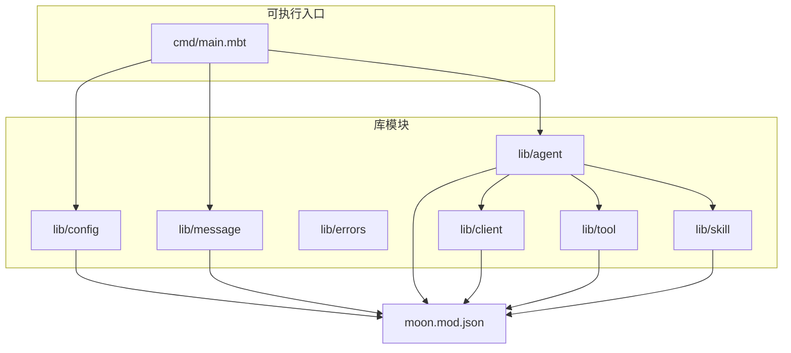
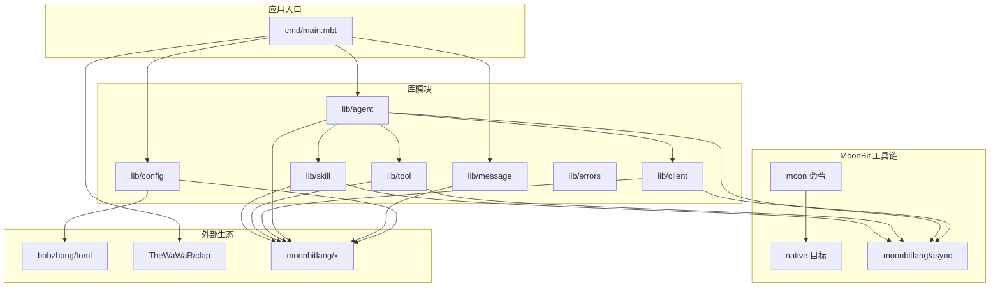
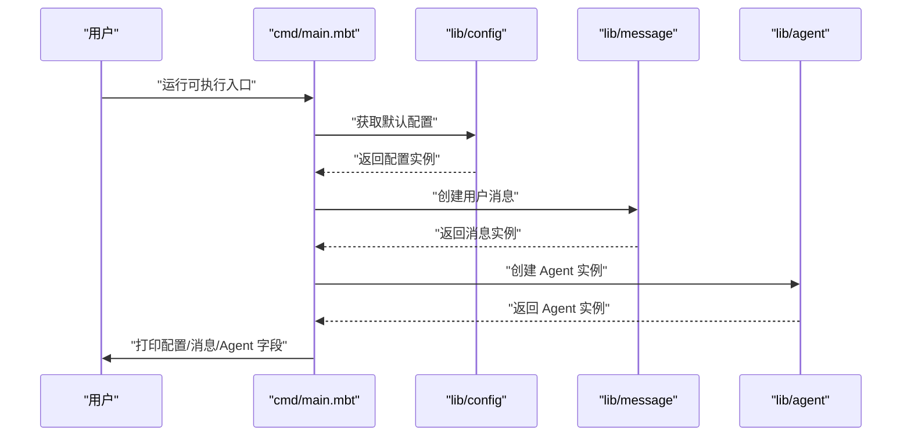
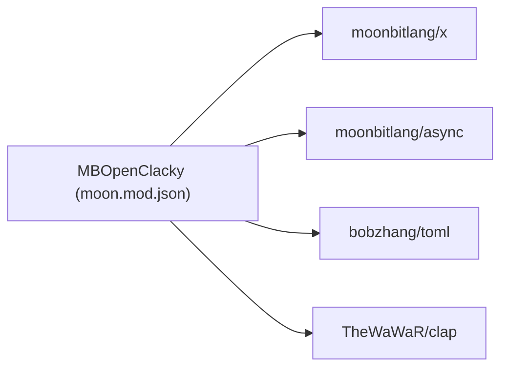

# 开发指南

<cite>
**本文引用的文件**
- [README.md](file://README.md)
- [moon.mod.json](file://moon.mod.json)
- [cmd/main.mbt](file://cmd/main.mbt)
</cite>

## 目录
1. [简介](#简介)
2. [项目结构](#项目结构)
3. [核心组件](#核心组件)
4. [架构总览](#架构总览)
5. [详细组件分析](#详细组件分析)
6. [依赖分析](#依赖分析)
7. [性能考虑](#性能考虑)
8. [故障排除指南](#故障排除指南)
9. [结论](#结论)
10. [附录](#附录)

## 简介
本指南面向新老贡献者，帮助你在 MBOpenClacky 项目中高效开展开发工作。项目以 MoonBit 语言重写原 Ruby 项目 openclacky，目标是在保留核心能力（LLM 交互、Agent 对话循环、工具系统、技能系统、IM 渠道集成、CLI + Web UI）的同时，利用 MoonBit 的类型安全、AOT 编译、统一异步原语与包管理工具链，构建更易维护、性能更优、生态更自洽的 AI Agent CLI 工具。

## 项目结构
项目采用“可执行入口 + 领域库模块”的分层组织方式，便于按阶段迭代与职责分离：
- cmd：可执行入口，当前包含最小化示例，用于验证核心类型初始化。
- lib：按领域拆分的库模块，包括 agent、client、config、errors、message、skill、tool 等。
- moon.mod.json：模块元信息与依赖声明，定义首选目标平台与依赖包。
- README.md：项目背景、目标、使用说明与开发路线。

图表来源
- [cmd/main.mbt:1-27](file://cmd/main.mbt#L1-L27)
- [moon.mod.json:1-16](file://moon.mod.json#L1-L16)

章节来源
- [README.md:83-108](file://README.md#L83-L108)
- [moon.mod.json:1-16](file://moon.mod.json#L1-L16)

## 核心组件
- 可执行入口（cmd/main.mbt）
  - 当前演示了核心类型的构造与打印，用于验证脚手架与类型系统是否正常。
  - 示例涉及配置、消息与 Agent 的初始化与字段展示。
- 配置系统（lib/config）
  - 负责从 TOML、环境变量与路径加载配置，支持后续阶段的逐步完善。
- 消息与角色（lib/message）
  - 提供消息、角色、工具调用与工具结果等核心类型，支撑对话循环与工具调用的数据结构。
- 客户端抽象（lib/client）
  - 抽象 LLM 后端接口，为多厂商（如 Claude、OpenAI、DeepSeek）提供统一接入点。
- 工具系统（lib/tool）
  - 提供可扩展的工具 trait 与内置工具集合，支持文件读写、Shell 执行等能力。
- 技能系统（lib/skill）
  - 提供可扩展的“可执行能力”机制，作为 Agent 的能力扩展点。
- Agent 核心（lib/agent）
  - 在消息、工具、技能之上实现对话循环、工具调用与成本追踪等核心逻辑。
- 错误体系（lib/errors）
  - 统一错误类型层次，配合 MoonBit 的 checked error handling 机制提升健壮性。

章节来源
- [cmd/main.mbt:1-27](file://cmd/main.mbt#L1-L27)
- [README.md:83-108](file://README.md#L83-L108)

## 架构总览
下图展示了从可执行入口到各库模块的依赖关系，以及 MoonBit 工具链与外部生态的集成位置。

图表来源
- [moon.mod.json:1-16](file://moon.mod.json#L1-L16)
- [cmd/main.mbt:1-27](file://cmd/main.mbt#L1-L27)

## 详细组件分析

### 可执行入口（cmd/main.mbt）
- 职责
  - 展示核心类型初始化与字段输出，验证模块导入与类型系统工作正常。
- 关键行为
  - 构造默认 Agent 配置并打印关键字段。
  - 构造用户消息并打印角色与内容。
  - 构造 Agent 实例并打印会话、状态与来源。
- 依赖
  - 依赖 lib/config、lib/message、lib/agent 的默认导出与类型方法。

图表来源
- [cmd/main.mbt:8-22](file://cmd/main.mbt#L8-L22)

章节来源
- [cmd/main.mbt:1-27](file://cmd/main.mbt#L1-L27)

### 配置系统（lib/config）
- 设计要点
  - 支持从 TOML、环境变量与路径加载配置，为后续阶段提供灵活的配置来源。
- 与工具链的关系
  - 依赖 bobzhang/toml 进行 TOML 解析，moonbitlang/x 提供通用工具能力。
- 与业务模块的关系
  - 为 Agent、Client、Tool、Skill 等模块提供统一的配置入口。

章节来源
- [README.md:83-108](file://README.md#L83-L108)
- [moon.mod.json:4-8](file://moon.mod.json#L4-L8)

### 消息与角色（lib/message）
- 设计要点
  - 定义消息、角色、工具调用与工具结果等核心类型，支撑对话循环与工具调用的数据结构。
- 与工具链的关系
  - 依赖 moonbitlang/x 提供的基础类型与工具函数。
- 与业务模块的关系
  - 为 Agent、Client、Tool、Skill 等模块提供统一的数据契约。

章节来源
- [README.md:83-108](file://README.md#L83-L108)
- [moon.mod.json:5](file://moon.mod.json#L5)

### 客户端抽象（lib/client）
- 设计要点
  - 抽象 LLM 后端接口，屏蔽不同厂商 API 的差异，支持流式响应（SSE）与并发调用。
- 与工具链的关系
  - 依赖 moonbitlang/async 提供的统一异步原语（HTTP、WebSocket、Process）。
- 与业务模块的关系
  - 为 Agent 提供统一的推理与对话能力。

章节来源
- [README.md:68-76](file://README.md#L68-L76)
- [moon.mod.json:6](file://moon.mod.json#L6)

### 工具系统（lib/tool）
- 设计要点
  - 提供可扩展的工具 trait 与内置工具集合，支持文件读写、Shell 执行等能力。
- 与工具链的关系
  - 依赖 moonbitlang/async 进行并发与流式处理。
- 与业务模块的关系
  - 为 Agent 提供外部能力扩展点。

章节来源
- [README.md:68-76](file://README.md#L68-L76)
- [moon.mod.json:6](file://moon.mod.json#L6)

### 技能系统（lib/skill）
- 设计要点
  - 提供可扩展的“可执行能力”机制，作为 Agent 的能力扩展点。
- 与工具链的关系
  - 依赖 moonbitlang/async 与 moonbitlang/x。
- 与业务模块的关系
  - 与 Agent、Tool 协作，形成统一的能力编排。

章节来源
- [README.md:68-76](file://README.md#L68-L76)
- [moon.mod.json:5-6](file://moon.mod.json#L5-L6)

### Agent 核心（lib/agent）
- 设计要点
  - 在消息、工具、技能之上实现对话循环、工具调用与成本追踪等核心逻辑。
- 与工具链的关系
  - 依赖 moonbitlang/async 与 moonbitlang/x。
- 与业务模块的关系
  - 作为协调器，串联 Config、Message、Client、Tool、Skill。

章节来源
- [README.md:68-76](file://README.md#L68-L76)
- [moon.mod.json:5-6](file://moon.mod.json#L5-L6)

### 错误体系（lib/errors）
- 设计要点
  - 统一错误类型层次，配合 MoonBit 的 checked error handling 机制提升健壮性。
- 与工具链的关系
  - 依赖 moonbitlang/x。
- 与业务模块的关系
  - 为所有模块提供一致的错误处理契约。

章节来源
- [README.md:53-57](file://README.md#L53-L57)
- [moon.mod.json:5](file://moon.mod.json#L5)

## 依赖分析
- 模块元信息
  - 名称、版本、许可证、关键词与首选目标平台均在 moon.mod.json 中声明。
  - 依赖包括 moonbitlang/x、moonbitlang/async、bobzhang/toml、TheWaWaR/clap。
- 依赖关系可视化

图表来源
- [moon.mod.json:1-16](file://moon.mod.json#L1-L16)

章节来源
- [moon.mod.json:1-16](file://moon.mod.json#L1-L16)

## 性能考虑
- 启动与运行效率
  - MoonBit AOT 编译到原生代码，相较 Ruby 的解释执行，启动与运行延迟显著降低，更适合本地常驻或一次性命令调用。
- 内存占用
  - 无 VM 与 GC 元数据负担，二进制可分发，部署更轻量。
- 异步与并发
  - 借助 moonbitlang/async 的统一异步原语，可直观地编写流式 LLM 响应处理与并发工具调用，避免复杂线程/纤程风格。
- 工具链与构建
  - 使用 moon 命令进行 check、build、run、test、fmt、doc、ide，构建可复现、依赖可管理。

章节来源
- [README.md:58-69](file://README.md#L58-L69)
- [README.md:110-158](file://README.md#L110-L158)

## 故障排除指南
- 环境与工具链
  - 确认已安装满足要求的 MoonBit 工具链版本，并将 native 设为目标平台。
  - 若依赖安装失败，先执行更新与安装命令，再进行检查与构建。
- 构建与运行
  - 使用 moon check 确保类型与语法无误；使用 moon build 进行构建；使用 moon run 直接运行入口模块。
  - 如需指定目标平台，可通过 moon build --target native 显式指定。
- 常见问题定位
  - 若入口示例无法运行，请检查核心类型导入与默认构造是否可用。
  - 若配置加载异常，请检查 TOML 文件格式与环境变量键名是否匹配。

章节来源
- [README.md:110-158](file://README.md#L110-L158)
- [cmd/main.mbt:1-27](file://cmd/main.mbt#L1-L27)

## 结论
本指南围绕 MBOpenClacky 的项目结构、核心组件、依赖关系与开发流程提供了系统性的说明。建议新贡献者从 cmd/main.mbt 的最小示例入手，逐步熟悉各库模块的职责与接口，再结合 moon.mod.json 的依赖声明与 README.md 的开发路线，按阶段推进功能落地。通过 MoonBit 的类型安全、AOT 编译与统一异步原语，项目将具备更好的可维护性与性能表现。

## 附录
- 开发环境搭建步骤
  - 安装 MoonBit 工具链并确认版本满足要求。
  - 在项目根目录执行依赖更新与安装。
  - 使用 moon check 进行类型与语法检查。
  - 使用 moon build 进行构建，或使用 moon run 直接运行入口模块。
- 代码规范与最佳实践
  - 使用 MoonBit 的 checked error handling 与 Option/Result 类型，避免运行时错误。
  - 优先采用 struct + trait 的组合模式，明确模块边界与扩展点。
  - 通过 moon 命令族（check、fmt、test、doc、ide）保证代码质量与一致性。
- 测试策略与持续集成
  - 使用 moon test 运行测试套件，建议按模块划分测试用例并覆盖关键路径。
  - 在 CI 中加入 moon check、moon test 与 moon build 步骤，确保构建可复现。
- 贡献指南
  - 提交前确保通过 moon check、moon test 与 moon fmt。
  - 提交信息遵循简洁清晰的描述，必要时附带变更说明与影响范围。
  - 发起 Pull Request 前进行本地自测，确保不影响现有功能。

章节来源
- [README.md:110-158](file://README.md#L110-L158)
- [moon.mod.json:1-16](file://moon.mod.json#L1-L16)