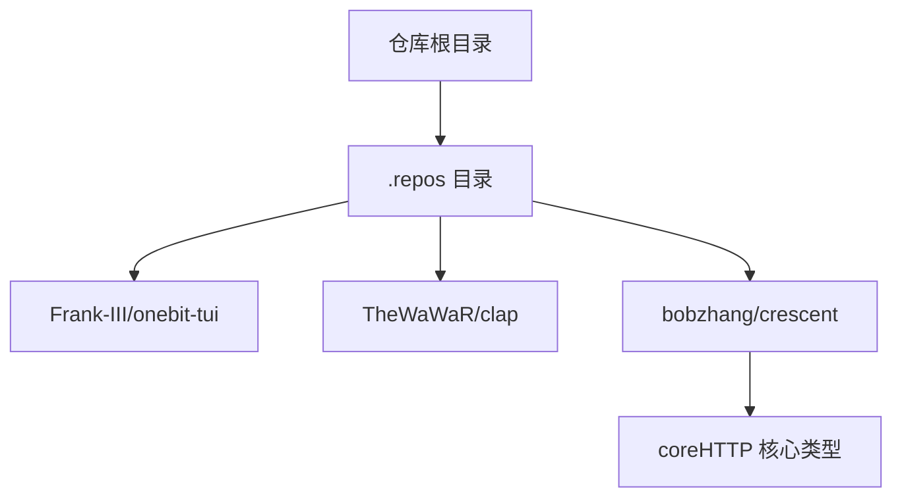
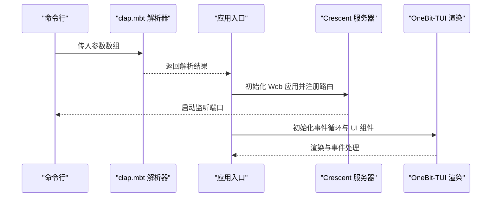
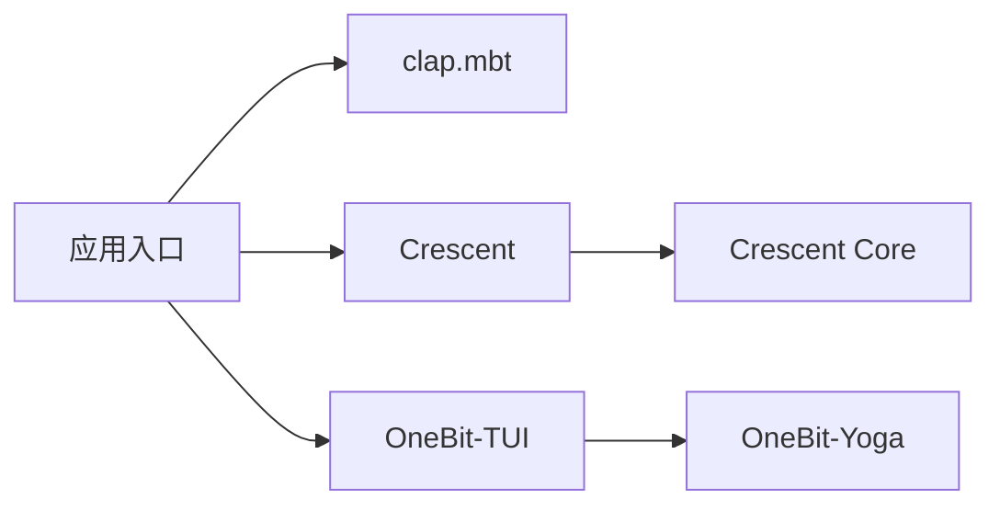

# 快速开始

<cite>
**本文引用的文件**
- [README.md（OneBit-TUI）](file://.repos/Frank-III/onebit-tui/0.1.3/README.md)
- [README.md（clap.mbt）](file://.repos/TheWaWaR/clap/0.2.6/README.md)
- [README.md（Crescent）](file://.repos/bobzhang/crescent/0.10.0/README.md)
- [README.md（Crescent 核心包）](file://.repos/bobzhang/crescent/0.10.0/core/README.md)
- [AGENTS.md（Crescent 项目指南）](file://.repos/bobzhang/crescent/0.10.0/AGENTS.md)
</cite>

## 目录
1. [简介](#简介)
2. [项目结构](#项目结构)
3. [核心组件](#核心组件)
4. [架构总览](#架构总览)
5. [详细组件分析](#详细组件分析)
6. [依赖关系分析](#依赖关系分析)
7. [性能考虑](#性能考虑)
8. [故障排查指南](#故障排查指南)
9. [结论](#结论)
10. [附录](#附录)

## 简介
本指南面向初学者，帮助你在本地快速搭建 MoonBit 开发与运行环境，并完成第一个 MoonBit 程序的编写与运行。你将学习到：
- MoonBit 工具链的安装与配置
- 如何在本仓库中使用 mooncake 包管理器添加依赖
- 编写并运行第一个 MoonBit 程序（含命令行参数解析与 Web 服务示例）
- 常见初始化问题与解决方案

为便于理解，本指南以仓库中已提供的 README 文档为依据，结合命令行操作与路径引用，给出可直接执行的步骤。

## 项目结构
本仓库采用 mooncake 外部依赖管理模式，所有第三方包位于 .repos 目录下，按组织/作者分层存放。你可以通过 moon add 将这些包作为依赖引入你的项目。

图表来源
- [.repos 目录结构](file://.repos)

章节来源
- [.repos 目录结构](file://.repos)

## 核心组件
- OneBit-TUI：终端 UI 库，提供声明式组件、Yoga 布局与高性能原生渲染能力。适合构建 TUI 应用。
- clap.mbt：命令行参数解析库，支持多级子命令、默认值、帮助输出等。
- Crescent：Web 框架，原生优先、类型安全，提供路由、中间件、静态资源、WebSocket、CORS 等能力。

章节来源
- [README.md（OneBit-TUI）:1-414](file://.repos/Frank-III/onebit-tui/0.1.3/README.md#L1-L414)
- [README.md（clap.mbt）:1-50](file://.repos/TheWaWaR/clap/0.2.6/README.md#L1-L50)
- [README.md（Crescent）:1-914](file://.repos/bobzhang/crescent/0.10.0/README.md#L1-L914)
- [README.md（Crescent 核心包）:1-450](file://.repos/bobzhang/crescent/0.10.0/core/README.md#L1-L450)

## 架构总览
下图展示了从“命令行参数解析”到“Web 服务”的典型调用流程，以及 OneBit-TUI 的渲染链路。

图表来源
- [README.md（clap.mbt）:15-50](file://.repos/TheWaWaR/clap/0.2.6/README.md#L15-L50)
- [README.md（Crescent）:20-34](file://.repos/bobzhang/crescent/0.10.0/README.md#L20-L34)
- [README.md（OneBit-TUI）:90-132](file://.repos/Frank-III/onebit-tui/0.1.3/README.md#L90-L132)

## 详细组件分析

### 组件一：命令行参数解析（clap.mbt）
- 功能要点
  - 支持标志位、命名参数、位置参数、子命令、默认值、环境变量、帮助输出等。
  - 可生成与 Rust 的 clap 类似的帮助信息。
- 使用方式
  - 新建解析器，定义子命令与参数，使用 parse! 获取解析结果。
  - 通过 --help 自动生成帮助文本。
- 示例参考
  - [简单示例与帮助生成:15-50](file://.repos/TheWaWaR/clap/0.2.6/README.md#L15-L50)

章节来源
- [README.md（clap.mbt）:1-50](file://.repos/TheWaWaR/clap/0.2.6/README.md#L1-L50)

### 组件二：Web 框架（Crescent）
- 功能要点
  - 原生优先、类型安全、AI 友好。
  - 提供路由、中间件、静态资源、WebSocket、CORS、错误映射、响应助手等。
- 典型流程
  - 定义类型（derive(ToJson, FromJson)），注册路由，添加中间件，启动服务。
- 示例参考
  - [Hello World 与启动服务:20-34](file://.repos/bobzhang/crescent/0.10.0/README.md#L20-L34)
  - [REST API 走读（类型、路由、中间件、测试）:38-286](file://.repos/bobzhang/crescent/0.10.0/README.md#L38-L286)
  - [WebSocket、静态资源、Cookies、HTTP 客户端等:462-572](file://.repos/bobzhang/crescent/0.10.0/README.md#L462-L572)

章节来源
- [README.md（Crescent）:1-914](file://.repos/bobzhang/crescent/0.10.0/README.md#L1-L914)

### 组件三：终端 UI（OneBit-TUI）
- 功能要点
  - 声明式 View、Yoga Flexbox 布局、原生渲染、输入事件、焦点管理等。
- 示例参考
  - [Hello World 计数器示例:90-132](file://.repos/Frank-III/onebit-tui/0.1.3/README.md#L90-L132)
  - [布局与样式、内置控件、事件处理、焦点管理:134-290](file://.repos/Frank-III/onebit-tui/0.1.3/README.md#L134-L290)

章节来源
- [README.md（OneBit-TUI）:1-414](file://.repos/Frank-III/onebit-tui/0.1.3/README.md#L1-L414)

## 依赖关系分析
- 包管理与版本
  - 本仓库通过 mooncake 引入依赖，例如 OneBit-TUI 与 Crescent 等。
  - 依赖版本与链接参数在各包的 README 中有明确说明。
- 链接与平台
  - OneBit-TUI 需要 Zig 0.14.x 与 C/C++ 工具链，并在 moon.pkg.json 中配置 native 链接参数。
  - Crescent 仅支持原生目标（native），需显式指定 --target native 运行。
- 依赖关系示意

图表来源
- [README.md（OneBit-TUI）:31-88](file://.repos/Frank-III/onebit-tui/0.1.3/README.md#L31-L88)
- [README.md（Crescent）:14-18](file://.repos/bobzhang/crescent/0.10.0/README.md#L14-L18)
- [README.md（Crescent 核心包）:1-45](file://.repos/bobzhang/crescent/0.10.0/core/README.md#L1-L45)

章节来源
- [README.md（OneBit-TUI）:23-56](file://.repos/Frank-III/onebit-tui/0.1.3/README.md#L23-L56)
- [README.md（Crescent）:8-18](file://.repos/bobzhang/crescent/0.10.0/README.md#L8-L18)

## 性能考虑
- 原生优先：Crescent 与 OneBit-TUI 均强调原生运行时，避免虚拟机开销，适合高并发与低延迟场景。
- 路由匹配：Crescent 使用基数树进行路由匹配，时间复杂度与路径长度相关，优于按路由数量线性扫描。
- 渲染与事件：OneBit-TUI 采用 Zig/C 原生渲染器，结合 Yoga 布局引擎，减少跨语言调用成本。

章节来源
- [README.md（Crescent）:438-439](file://.repos/bobzhang/crescent/0.10.0/README.md#L438-L439)
- [README.md（OneBit-TUI）:292-310](file://.repos/Frank-III/onebit-tui/0.1.3/README.md#L292-L310)

## 故障排查指南
- OneBit-TUI 链接与平台
  - 若出现链接错误，请确认 moon.pkg.json 中的 native 链接参数已正确设置；确保 Zig 版本为 0.14.x；确认 libopentui.a 与 libyoga_wrap.a、libyogacore.a 存在于 .mooncakes 对应路径。
  - 参考：[链接与 Zig 版本要求:363-382](file://.repos/Frank-III/onebit-tui/0.1.3/README.md#L363-L382)
- 平台支持
  - Windows 当前为实验性支持，建议使用 WSL。
  - 参考：[平台支持说明:312-317](file://.repos/Frank-III/onebit-tui/0.1.3/README.md#L312-L317)
- Crescent 目标与运行
  - 请始终使用 --target native 运行 Crescent 应用。
  - 参考：[安装与运行说明:14-18](file://.repos/bobzhang/crescent/0.10.0/README.md#L14-L18)
- 代码风格与模块组织
  - 项目遵循块注释与包组织约定，便于重构与维护。
  - 参考：[项目指南:15-22](file://.repos/bobzhang/crescent/0.10.0/AGENTS.md#L15-L22)

章节来源
- [README.md（OneBit-TUI）:351-382](file://.repos/Frank-III/onebit-tui/0.1.3/README.md#L351-L382)
- [README.md（Crescent）:8-12](file://.repos/bobzhang/crescent/0.10.0/README.md#L8-L12)
- [AGENTS.md（Crescent 项目指南）:15-22](file://.repos/bobzhang/crescent/0.10.0/AGENTS.md#L15-L22)

## 结论
通过本指南，你已经完成了 MoonBit 工具链的准备、依赖的添加与配置，并基于仓库中的示例编写与运行了第一个 MoonBit 程序。你可以在此基础上继续探索命令行参数解析、Web 服务开发与终端 UI 构建。

## 附录

### A. 环境准备与工具链安装
- 安装 MoonBit 语言工具链（编译器、包管理器等）
  - 参考官方安装指南与包管理器说明
- 安装 Zig 0.14.x（用于 OneBit-TUI）
  - 参考：[Zig 安装与版本要求:372-382](file://.repos/Frank-III/onebit-tui/0.1.3/README.md#L372-L382)

章节来源
- [README.md（OneBit-TUI）:23-28](file://.repos/Frank-III/onebit-tui/0.1.3/README.md#L23-L28)
- [README.md（OneBit-TUI）:372-382](file://.repos/Frank-III/onebit-tui/0.1.3/README.md#L372-L382)

### B. 克隆项目与设置依赖环境
- 使用 mooncake 添加依赖
  - OneBit-TUI：参见 README 中的添加命令与链接参数配置
  - Crescent：参见 README 中的添加命令
- 参考
  - [OneBit-TUI 添加与链接配置:17-50](file://.repos/Frank-III/onebit-tui/0.1.3/README.md#L17-L50)
  - [Crescent 添加命令:14-18](file://.repos/bobzhang/crescent/0.10.0/README.md#L14-L18)

章节来源
- [README.md（OneBit-TUI）:17-50](file://.repos/Frank-III/onebit-tui/0.1.3/README.md#L17-L50)
- [README.md（Crescent）:14-18](file://.repos/bobzhang/crescent/0.10.0/README.md#L14-L18)

### C. 第一个 MoonBit 程序：命令行参数解析
- 步骤
  - 使用 clap.mbt 创建解析器，定义子命令与参数
  - 调用 parse! 获取解析结果
  - 生成帮助信息（--help）
- 参考
  - [示例与帮助生成:15-50](file://.repos/TheWaWaR/clap/0.2.6/README.md#L15-L50)

章节来源
- [README.md（clap.mbt）:15-50](file://.repos/TheWaWaR/clap/0.2.6/README.md#L15-L50)

### D. 第一个 MoonBit 程序：Web 服务
- 步骤
  - 定义类型（derive(ToJson, FromJson)）
  - 初始化 Crescent 应用，注册路由
  - 添加中间件（如安全头、请求 ID、限流、CORS）
  - 启动服务（指定端口）
- 参考
  - [Hello World 与启动服务:20-34](file://.repos/bobzhang/crescent/0.10.0/README.md#L20-L34)
  - [REST API 走读与中间件示例:94-177](file://.repos/bobzhang/crescent/0.10.0/README.md#L94-L177)
  - [CORS、静态资源、WebSocket 等:573-586](file://.repos/bobzhang/crescent/0.10.0/README.md#L573-L586)

章节来源
- [README.md（Crescent）:20-34](file://.repos/bobzhang/crescent/0.10.0/README.md#L20-L34)
- [README.md（Crescent）:94-177](file://.repos/bobzhang/crescent/0.10.0/README.md#L94-L177)
- [README.md（Crescent）:573-586](file://.repos/bobzhang/crescent/0.10.0/README.md#L573-L586)

### E. 第一个 MoonBit 程序：终端 UI（TUI）
- 步骤
  - 初始化 App，构建 UI（容器、文本、边框、标题等）
  - 注册事件处理器（按键、鼠标、窗口大小变化）
  - 运行事件循环
- 参考
  - [计数器示例与事件循环:90-132](file://.repos/Frank-III/onebit-tui/0.1.3/README.md#L90-L132)
  - [布局与样式、内置控件、事件处理:134-256](file://.repos/Frank-III/onebit-tui/0.1.3/README.md#L134-L256)

章节来源
- [README.md（OneBit-TUI）:90-132](file://.repos/Frank-III/onebit-tui/0.1.3/README.md#L90-L132)
- [README.md（OneBit-TUI）:134-256](file://.repos/Frank-III/onebit-tui/0.1.3/README.md#L134-L256)

### F. 常见初始化问题与解决方案
- 链接错误
  - 确认 moon.pkg.json 中 native 链接参数正确；确保 Zig 0.14.x；检查 .mooncakes 下的静态库是否存在。
  - 参考：[链接与 Zig 版本要求:363-382](file://.repos/Frank-III/onebit-tui/0.1.3/README.md#L363-L382)
- Windows 平台
  - 实验性支持，建议使用 WSL。
  - 参考：[平台支持说明:312-317](file://.repos/Frank-III/onebit-tui/0.1.3/README.md#L312-L317)
- Crescent 运行目标
  - 必须使用 --target native。
  - 参考：[安装与运行说明:8-12](file://.repos/bobzhang/crescent/0.10.0/README.md#L8-L12)

章节来源
- [README.md（OneBit-TUI）:363-382](file://.repos/Frank-III/onebit-tui/0.1.3/README.md#L363-L382)
- [README.md（OneBit-TUI）:312-317](file://.repos/Frank-III/onebit-tui/0.1.3/README.md#L312-L317)
- [README.md（Crescent）:8-12](file://.repos/bobzhang/crescent/0.10.0/README.md#L8-L12)