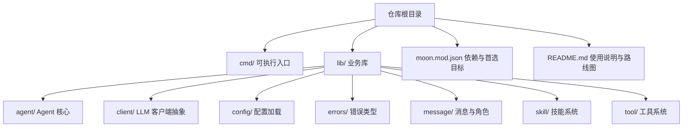
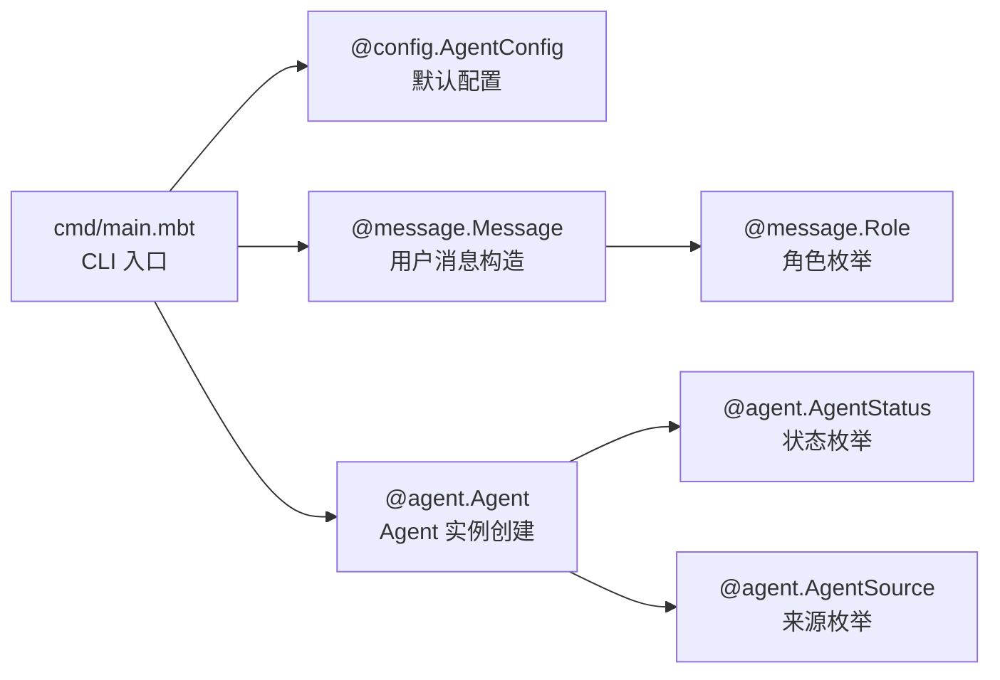
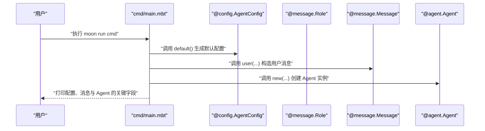
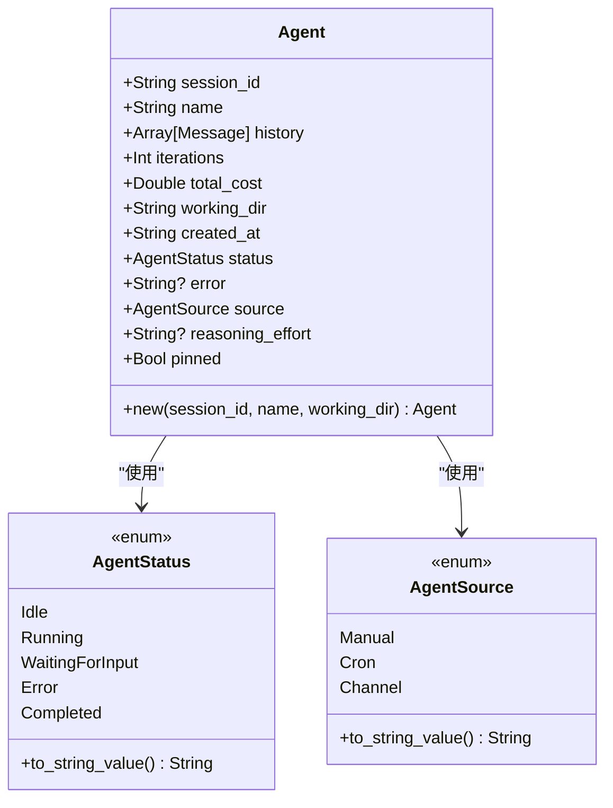
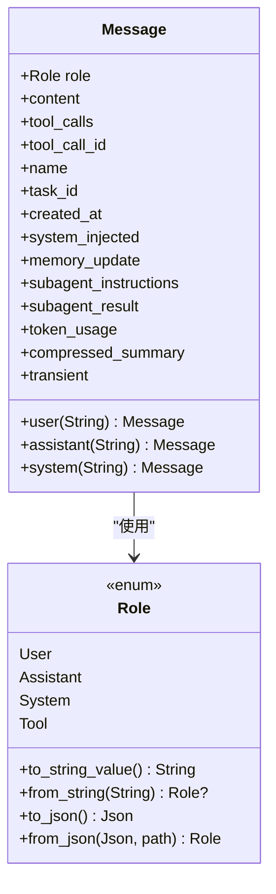
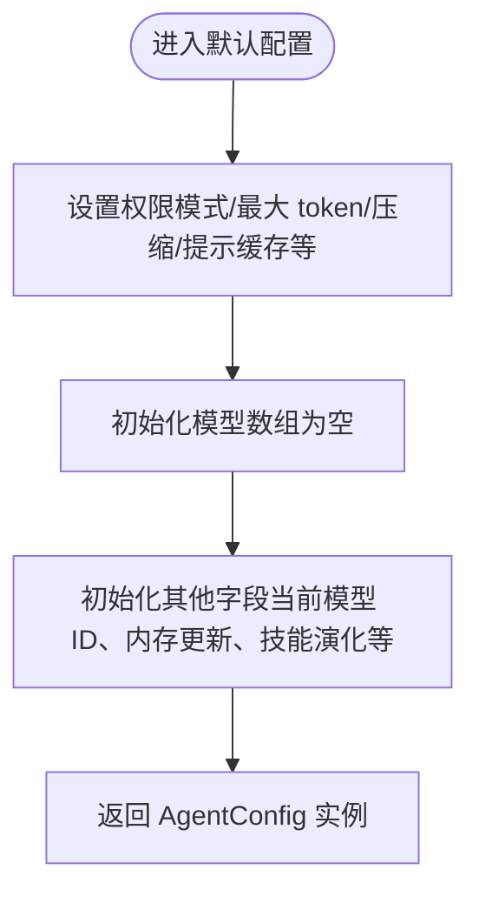
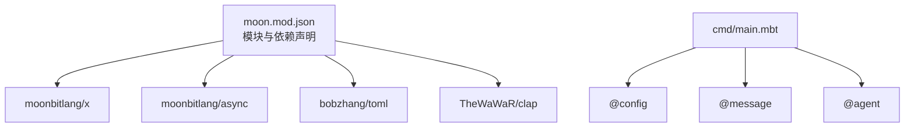

# 快速开始

<cite>
**本文引用的文件**
- [README.md](file://README.md)
- [moon.mod.json](file://moon.mod.json)
- [cmd/main.mbt](file://cmd/main.mbt)
- [lib/agent/agent.mbt](file://lib/agent/agent.mbt)
- [lib/agent/status.mbt](file://lib/agent/status.mbt)
- [lib/message/message.mbt](file://lib/message/message.mbt)
- [lib/message/role.mbt](file://lib/message/role.mbt)
- [lib/config/agent.mbt](file://lib/config/agent.mbt)
</cite>

## 目录
1. [简介](#简介)
2. [项目结构](#项目结构)
3. [核心组件](#核心组件)
4. [架构总览](#架构总览)
5. [详细组件分析](#详细组件分析)
6. [依赖分析](#依赖分析)
7. [性能考量](#性能考量)
8. [故障排查指南](#故障排查指南)
9. [结论](#结论)
10. [附录](#附录)

## 简介
本指南面向首次接触 MBOpenClacky 的开发者，帮助你在最短时间内完成环境准备、依赖获取、类型检查、构建与运行，并验证安装是否成功。文档覆盖从源码到可执行文件的完整流程，同时提供常见问题排查建议，确保你能快速看到预期效果。

## 项目结构
MBOpenClacky 采用 MoonBit 的模块化组织方式，核心入口位于 cmd，业务逻辑分布在 lib 下的多个子包（agent、client、config、errors、message、skill、tool）。模块元信息与依赖声明集中在 moon.mod.json，README.md 提供了环境要求、命令示例与开发路线。

图表来源
- [README.md:83-117](file://README.md#L83-L117)
- [moon.mod.json:1-16](file://moon.mod.json#L1-L16)

章节来源
- [README.md:83-117](file://README.md#L83-L117)
- [moon.mod.json:1-16](file://moon.mod.json#L1-L16)

## 核心组件
- cmd/main.mbt：CLI 入口，当前用于演示核心类型的初始化与打印，验证脚手架是否搭建完整。
- lib/agent：定义 Agent 结构体与状态枚举，提供默认实例创建方法。
- lib/message：定义消息与角色枚举，提供多种便捷构造函数。
- lib/config：定义 AgentConfig 结构体与默认值，体现配置加载与序列化支持。
- moon.mod.json：声明模块名、版本、依赖与首选目标（native）。

章节来源
- [cmd/main.mbt:1-27](file://cmd/main.mbt#L1-L27)
- [lib/agent/agent.mbt:1-39](file://lib/agent/agent.mbt#L1-L39)
- [lib/agent/status.mbt:1-49](file://lib/agent/status.mbt#L1-L49)
- [lib/message/message.mbt:57-118](file://lib/message/message.mbt#L57-L118)
- [lib/message/role.mbt:1-52](file://lib/message/role.mbt#L1-L52)
- [lib/config/agent.mbt:1-33](file://lib/config/agent.mbt#L1-L33)
- [moon.mod.json:1-16](file://moon.mod.json#L1-L16)

## 架构总览
下图展示了从命令行到核心类型的调用关系，以及各模块之间的依赖方向。

图表来源
- [cmd/main.mbt:8-22](file://cmd/main.mbt#L8-L22)
- [lib/config/agent.mbt:18-33](file://lib/config/agent.mbt#L18-L33)
- [lib/message/message.mbt:57-76](file://lib/message/message.mbt#L57-L76)
- [lib/agent/agent.mbt:19-39](file://lib/agent/agent.mbt#L19-L39)
- [lib/agent/status.mbt:3-9](file://lib/agent/status.mbt#L3-L9)
- [lib/agent/status.mbt:13-17](file://lib/agent/status.mbt#L13-L17)
- [lib/message/role.mbt:5-10](file://lib/message/role.mbt#L5-L10)

## 详细组件分析

### 组件：CLI 入口与核心类型演示
- 目的：验证脚手架与类型系统是否正常工作，输出默认配置、消息与 Agent 实例的关键字段。
- 关键行为：
  - 打印版本与简要描述。
  - 构造默认 AgentConfig 并打印关键字段。
  - 构造用户消息并打印角色与内容。
  - 创建 Agent 实例并打印会话、状态与来源。
- 注意事项：
  - 当前实现仅进行类型自检，后续阶段将接入 CLI 参数、配置加载与 LLM 调用。

图表来源
- [cmd/main.mbt:3-26](file://cmd/main.mbt#L3-L26)
- [lib/config/agent.mbt:18-33](file://lib/config/agent.mbt#L18-L33)
- [lib/message/message.mbt:57-76](file://lib/message/message.mbt#L57-L76)
- [lib/agent/agent.mbt:19-39](file://lib/agent/agent.mbt#L19-L39)

章节来源
- [cmd/main.mbt:1-27](file://cmd/main.mbt#L1-L27)

### 组件：Agent 与状态
- 目的：封装一次会话的上下文，包括历史消息、迭代次数、成本统计、状态与来源等。
- 关键行为：
  - 提供默认构造函数，填充合理的初始值。
  - 状态与来源通过枚举表达，支持字符串化以便序列化。
- 复杂度：构造与访问均为 O(1)，适合高频调用。

图表来源
- [lib/agent/agent.mbt:3-16](file://lib/agent/agent.mbt#L3-L16)
- [lib/agent/agent.mbt:19-39](file://lib/agent/agent.mbt#L19-L39)
- [lib/agent/status.mbt:3-9](file://lib/agent/status.mbt#L3-L9)
- [lib/agent/status.mbt:13-17](file://lib/agent/status.mbt#L13-L17)
- [lib/agent/status.mbt:21-29](file://lib/agent/status.mbt#L21-L29)
- [lib/agent/status.mbt:33-38](file://lib/agent/status.mbt#L33-L38)

章节来源
- [lib/agent/agent.mbt:1-39](file://lib/agent/agent.mbt#L1-L39)
- [lib/agent/status.mbt:1-49](file://lib/agent/status.mbt#L1-L49)

### 组件：消息与角色
- 目的：统一表示对话中的不同角色与内容，支持 JSON 序列化与反序列化。
- 关键行为：
  - 提供多种便捷构造函数（用户、助手、系统）。
  - 角色枚举支持字符串化与 JSON 解析。
- 复杂度：构造与转换均为 O(1)。

图表来源
- [lib/message/role.mbt:5-10](file://lib/message/role.mbt#L5-L10)
- [lib/message/role.mbt:14-21](file://lib/message/role.mbt#L14-L21)
- [lib/message/role.mbt:27-35](file://lib/message/role.mbt#L27-L35)
- [lib/message/message.mbt:57-76](file://lib/message/message.mbt#L57-L76)
- [lib/message/message.mbt:77-97](file://lib/message/message.mbt#L77-L97)
- [lib/message/message.mbt:99-118](file://lib/message/message.mbt#L99-L118)

章节来源
- [lib/message/role.mbt:1-52](file://lib/message/role.mbt#L1-L52)
- [lib/message/message.mbt:57-118](file://lib/message/message.mbt#L57-L118)

### 组件：配置
- 目的：承载 Agent 的运行参数（权限模式、最大 token 数、模型列表等），提供默认值。
- 关键行为：
  - 提供默认配置构造函数，包含合理的缺省值。
  - 支持派生调试与 JSON 序列化接口。
- 复杂度：构造与访问均为 O(1)。

图表来源
- [lib/config/agent.mbt:18-33](file://lib/config/agent.mbt#L18-L33)

章节来源
- [lib/config/agent.mbt:1-33](file://lib/config/agent.mbt#L1-L33)

## 依赖分析
- 依赖来源：moon.mod.json 声明了核心依赖（标准库扩展、异步、TOML、命令行解析）。
- 目标后端：preferred-target 设为 native，便于直接运行与分发。
- 依赖关系：cmd 依赖 lib 下的 config、message、agent；lib 内部模块通过包可见性与导入组织。

图表来源
- [moon.mod.json:4-14](file://moon.mod.json#L4-L14)
- [cmd/main.mbt:8-22](file://cmd/main.mbt#L8-L22)

章节来源
- [moon.mod.json:1-16](file://moon.mod.json#L1-L16)
- [cmd/main.mbt:1-27](file://cmd/main.mbt#L1-L27)

## 性能考量
- AOT 编译：native 目标编译为原生代码，启动与运行延迟更低，适合 CLI 场景。
- 内存占用：无虚拟机与 GC 元数据负担，二进制更轻量，便于分发。
- 无需运行时：终端用户无需额外安装语言运行时，单一可执行文件即可运行。

## 故障排查指南
- 无法找到 moon 命令
  - 现象：执行 moon update/install/check/build/run 报错。
  - 排查：确认已安装 MoonBit 工具链并加入 PATH；参考官方下载页。
  - 参考来源
    - [README.md:110-117](file://README.md#L110-L117)
- 构建失败或找不到依赖
  - 现象：moon build/update/install 报错或依赖拉取失败。
  - 排查：先执行依赖更新与安装；检查网络与代理；清理缓存后重试。
  - 参考来源
    - [README.md:118-123](file://README.md#L118-L123)
- 目标后端不匹配
  - 现象：构建产物与运行环境不一致。
  - 排查：确认 preferred-target 为 native；必要时显式指定 --target native。
  - 参考来源
    - [README.md:131-139](file://README.md#L131-L139)
    - [moon.mod.json:14](file://moon.mod.json#L14)
- 运行时报错或无输出
  - 现象：moon run cmd 成功但无预期输出。
  - 排查：当前入口仅进行类型自检；等待后续阶段接入 CLI 与 LLM 功能。
  - 参考来源
    - [README.md:151](file://README.md#L151)
    - [cmd/main.mbt:1-27](file://cmd/main.mbt#L1-L27)

## 结论
通过本快速开始指南，你已经完成了环境准备、依赖获取、类型检查、构建与运行的全流程，并验证了脚手架与核心类型的可用性。随着后续阶段推进，CLI、配置系统、LLM 客户端、工具与技能系统等功能将逐步落地，届时你可以体验更完整的 AI Agent CLI 能力。

## 附录

### 从源码到可执行文件的完整流程
- 环境要求与安装
  - 安装 MoonBit 工具链，推荐版本与下载地址见 README。
  - 参考来源
    - [README.md:110-117](file://README.md#L110-L117)
- 获取依赖
  - 执行依赖更新与安装。
  - 参考来源
    - [README.md:118-123](file://README.md#L118-L123)
- 类型与语法检查
  - 运行类型检查，确保代码符合 MoonBit 类型系统约束。
  - 参考来源
    - [README.md:125-129](file://README.md#L125-L129)
- 构建
  - 默认按 preferred-target（native）构建；也可显式指定后端。
  - 参考来源
    - [README.md:131-139](file://README.md#L131-L139)
    - [moon.mod.json:14](file://moon.mod.json#L14)
- 运行
  - 直接运行 CLI 入口；或运行已构建的可执行文件。
  - 参考来源
    - [README.md:141-149](file://README.md#L141-L149)
- 测试（可选）
  - 运行测试以验证当前实现。
  - 参考来源
    - [README.md:153-157](file://README.md#L153-L157)

### 基本使用示例（验证安装）
- 示例目的：确认 MoonBit 工具链与项目脚手架正常工作。
- 步骤
  - 运行 CLI 入口，观察输出是否包含默认配置、消息与 Agent 的关键字段。
  - 参考来源
    - [cmd/main.mbt:3-26](file://cmd/main.mbt#L3-L26)