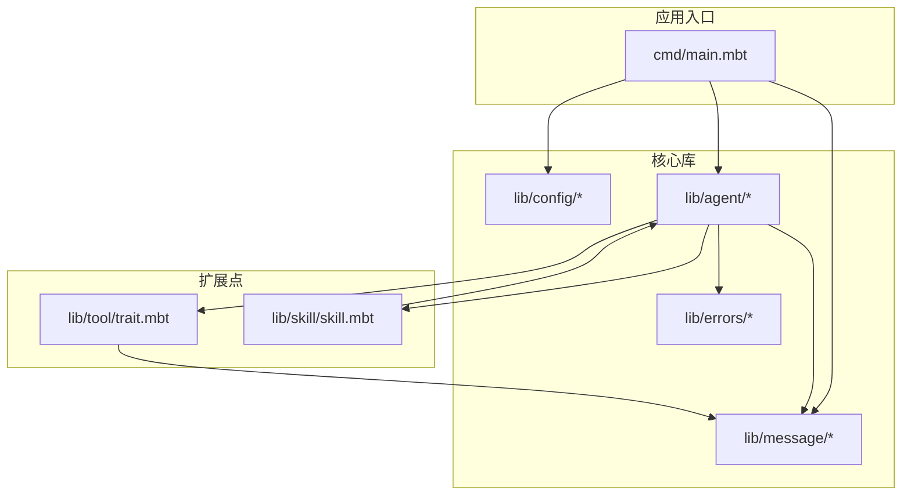
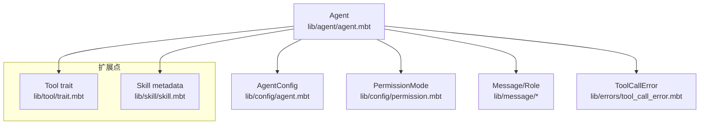
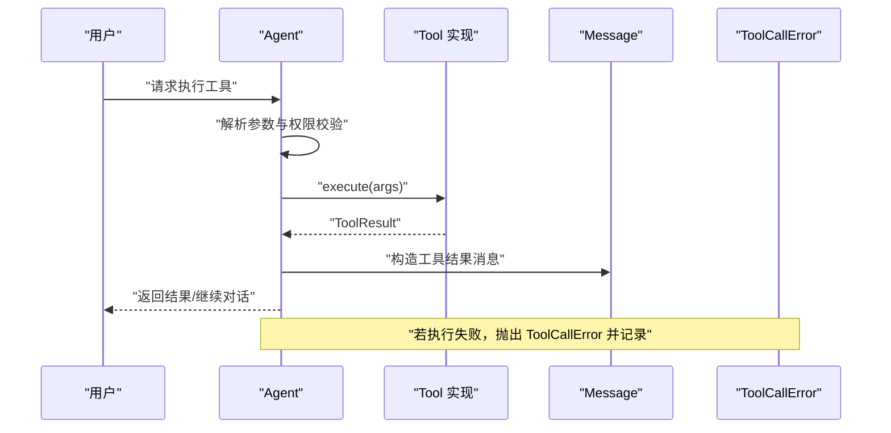
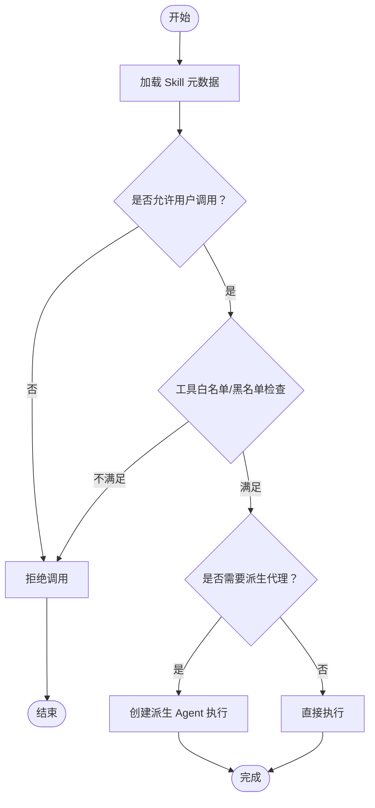
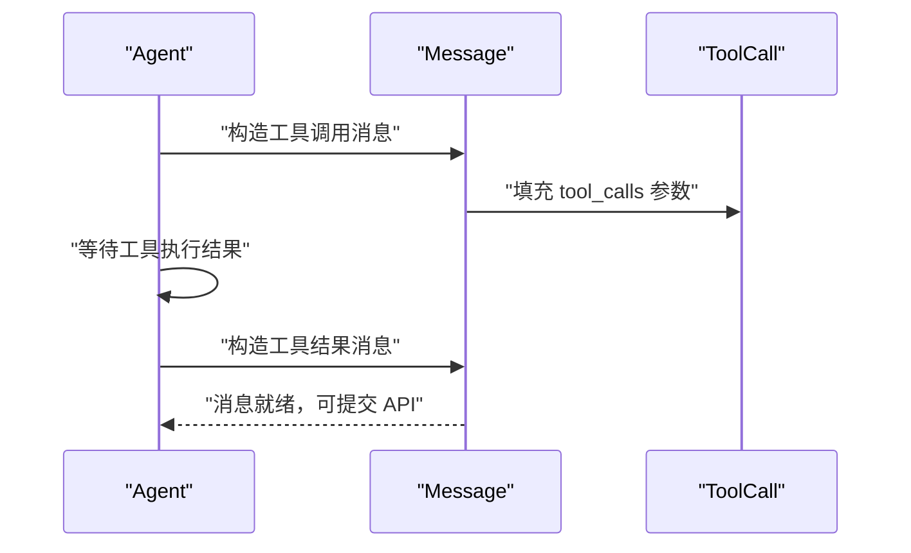
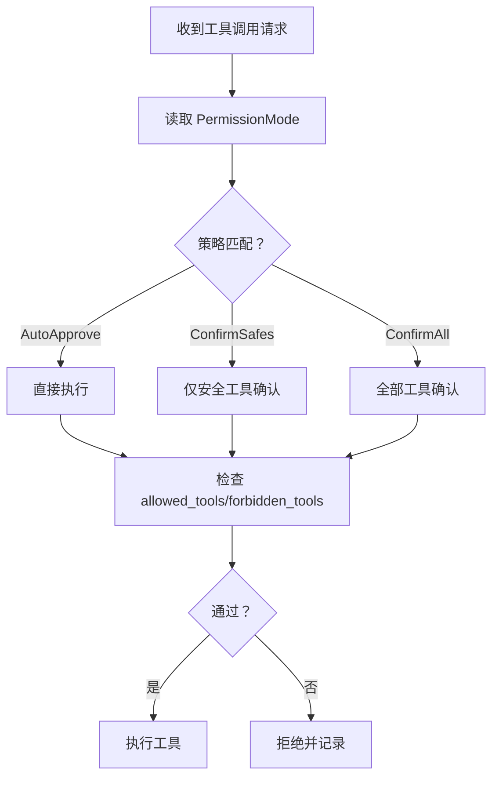
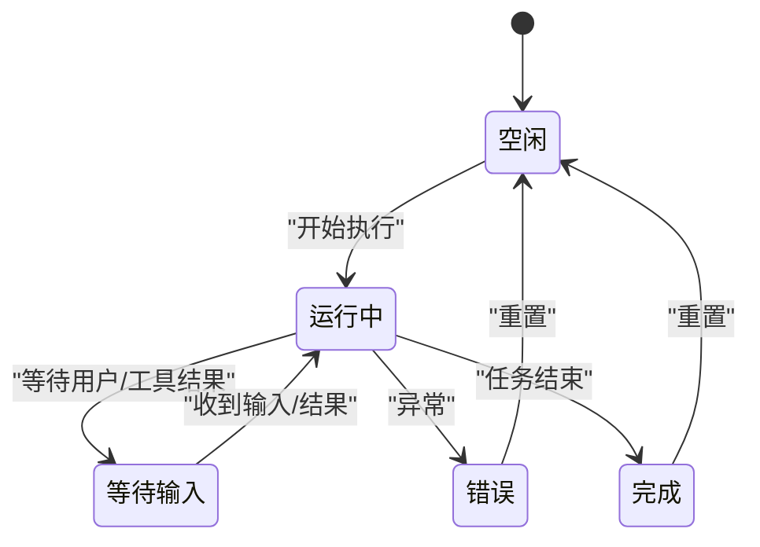
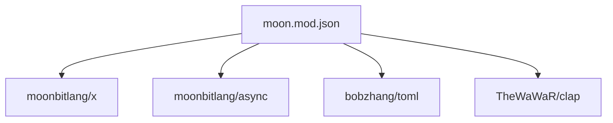

# 扩展开发

<cite>
**本文引用的文件**
- [README.md](file://README.md)
- [moon.mod.json](file://moon.mod.json)
- [cmd/main.mbt](file://cmd/main.mbt)
- [lib/tool/trait.mbt](file://lib/tool/trait.mbt)
- [lib/skill/skill.mbt](file://lib/skill/skill.mbt)
- [lib/message/tool_call.mbt](file://lib/message/tool_call.mbt)
- [lib/config/agent.mbt](file://lib/config/agent.mbt)
- [lib/config/permission.mbt](file://lib/config/permission.mbt)
- [lib/agent/agent.mbt](file://lib/agent/agent.mbt)
- [lib/agent/status.mbt](file://lib/agent/status.mbt)
- [lib/message/message.mbt](file://lib/message/message.mbt)
- [lib/message/role.mbt](file://lib/message/role.mbt)
- [lib/errors/tool_call_error.mbt](file://lib/errors/tool_call_error.mbt)
</cite>

## 目录
1. [简介](#简介)
2. [项目结构](#项目结构)
3. [核心组件](#核心组件)
4. [架构总览](#架构总览)
5. [详细组件分析](#详细组件分析)
6. [依赖分析](#依赖分析)
7. [性能考量](#性能考量)
8. [故障排查指南](#故障排查指南)
9. [结论](#结论)
10. [附录](#附录)

## 简介
本指南面向希望为 MBOpenClacky 开发自定义扩展的开发者，重点围绕“工具（Tool）”与“技能（Skill）”两大扩展点展开。文档将解释接口设计原理、实现要求、元数据管理、注册与使用流程、调试技巧以及性能优化建议，并给出与核心系统的集成模式与兼容性考虑。MBOpenClacky 采用 MoonBit 语言，强调类型安全、可维护性与可扩展性，工具与技能均通过清晰的接口与元数据进行解耦。

## 项目结构
项目采用按领域划分的包结构，核心扩展点集中在 lib/tool 与 lib/skill，同时消息与权限等基础设施为工具与技能的调用提供支撑。

图表来源
- [cmd/main.mbt:1-27](file://cmd/main.mbt#L1-L27)
- [lib/tool/trait.mbt:1-29](file://lib/tool/trait.mbt#L1-L29)
- [lib/skill/skill.mbt:1-47](file://lib/skill/skill.mbt#L1-L47)
- [lib/message/message.mbt:1-200](file://lib/message/message.mbt#L1-L200)
- [lib/config/agent.mbt:1-200](file://lib/config/agent.mbt#L1-L200)
- [lib/agent/agent.mbt:1-200](file://lib/agent/agent.mbt#L1-L200)
- [lib/errors/tool_call_error.mbt:1-200](file://lib/errors/tool_call_error.mbt#L1-L200)

章节来源
- [README.md:83-108](file://README.md#L83-L108)
- [moon.mod.json:1-16](file://moon.mod.json#L1-L16)

## 核心组件
- 工具接口（Tool trait）
  - 角色：定义所有工具的统一行为契约，允许外部包实现新工具。
  - 关键方法：名称、描述、参数模式、分类、执行、调用格式化、结果格式化、函数定义导出。
- 技能元数据（Skill 结构）
  - 角色：承载技能的元信息（名称、描述、是否允许用户调用、允许/禁止工具列表、上下文、钩子、派生代理等）。
  - 关键字段：name、name_zh、description、description_zh、disable_model_invocation、user_invocable、allowed_tools、forbidden_tools、context、hooks、fork_agent、model、auto_summarize、source、directory 等。
- 消息与角色（Message/Role）
  - 角色：封装消息内容、工具调用与工具结果，支持 API 序列化与内部字段剥离。
- 权限与配置（PermissionMode/AgentConfig）
  - 角色：控制工具执行前的确认策略（自动、确认安全、确认全部），以及全局配置项（模型、令牌上限、压缩、提示缓存、记忆更新等）。
- Agent 状态与来源（AgentStatus/AgentSource）
  - 角色：记录会话状态与来源，用于 UI 与日志展示。

章节来源
- [lib/tool/trait.mbt:1-29](file://lib/tool/trait.mbt#L1-L29)
- [lib/skill/skill.mbt:1-47](file://lib/skill/skill.mbt#L1-L47)
- [lib/message/message.mbt:1-200](file://lib/message/message.mbt#L1-L200)
- [lib/message/role.mbt:1-200](file://lib/message/role.mbt#L1-L200)
- [lib/config/permission.mbt:1-200](file://lib/config/permission.mbt#L1-L200)
- [lib/config/agent.mbt:1-200](file://lib/config/agent.mbt#L1-L200)
- [lib/agent/status.mbt:1-200](file://lib/agent/status.mbt#L1-L200)
- [lib/agent/agent.mbt:1-200](file://lib/agent/agent.mbt#L1-L200)

## 架构总览
下图展示了扩展点与核心系统的交互关系：Agent 作为编排器，依据配置与权限策略决定是否执行工具与技能；工具通过 Tool trait 提供统一接口；技能通过元数据描述能力边界与调用约束；消息与角色负责在 API 与内部流转之间转换。

图表来源
- [lib/agent/agent.mbt:1-200](file://lib/agent/agent.mbt#L1-L200)
- [lib/config/agent.mbt:1-200](file://lib/config/agent.mbt#L1-L200)
- [lib/config/permission.mbt:1-200](file://lib/config/permission.mbt#L1-L200)
- [lib/message/message.mbt:1-200](file://lib/message/message.mbt#L1-L200)
- [lib/errors/tool_call_error.mbt:1-200](file://lib/errors/tool_call_error.mbt#L1-L200)
- [lib/tool/trait.mbt:1-29](file://lib/tool/trait.mbt#L1-L29)
- [lib/skill/skill.mbt:1-47](file://lib/skill/skill.mbt#L1-L47)

## 详细组件分析

### 工具接口（Tool）设计与实现
- 设计原则
  - 统一契约：通过 trait 约束工具的名称、描述、参数模式、分类、执行、格式化与函数定义导出。
  - 可发现性：参数模式（JSON Schema）用于向 LLM 描述工具输入，便于自动化调用。
  - 可视化：提供调用与结果格式化方法，便于 UI 展示。
  - 可移植：函数定义导出用于 API 提交，保证与不同后端的兼容性。
- 实现要点
  - 参数校验：在 execute 中严格校验 Map[String, Json] 的键与类型，必要时返回错误。
  - 幂等与副作用：对于有副作用的操作，结合 PermissionMode 与 allowed_tools/forbidden_tools 控制。
  - 性能：避免在 execute 中进行阻塞操作，必要时使用异步或批处理。
  - 日志：在 format_call/format_result 中输出简洁可读的信息，便于调试与审计。
- 典型流程（序列图）

图表来源
- [lib/tool/trait.mbt:1-29](file://lib/tool/trait.mbt#L1-L29)
- [lib/message/tool_call.mbt:1-200](file://lib/message/tool_call.mbt#L1-L200)
- [lib/errors/tool_call_error.mbt:1-200](file://lib/errors/tool_call_error.mbt#L1-L200)

章节来源
- [lib/tool/trait.mbt:1-29](file://lib/tool/trait.mbt#L1-L29)

### 技能系统（Skill）扩展机制与元数据管理
- 元数据结构
  - 名称与多语言：name/name_zh，description/description_zh。
  - 调用控制：disable_model_invocation、user_invocable、fork_agent、model。
  - 工具边界：allowed_tools、forbidden_tools。
  - 上下文与钩子：context、hooks。
  - 溯源：source、directory。
- 扩展机制
  - 通过 Skill::default 快速生成具备默认值的元数据对象。
  - 在 Agent 中根据 user_invocable 与 allowed_tools/forbidden_tools 决定是否允许调用。
  - 若 fork_agent 为真，可在派生代理中隔离执行环境。
- 典型流程（流程图）

图表来源
- [lib/skill/skill.mbt:1-47](file://lib/skill/skill.mbt#L1-L47)
- [lib/agent/agent.mbt:1-200](file://lib/agent/agent.mbt#L1-L200)

章节来源
- [lib/skill/skill.mbt:1-47](file://lib/skill/skill.mbt#L1-L47)

### 消息与工具调用（Message/ToolCall）
- Message
  - 支持文本与内容块两种内容形式，提供 to_api_message 将内部字段剥离，确保对外 API 传输的数据干净。
  - 提供便捷构造器：user、assistant、system、tool_result。
- ToolCall
  - 表达一次工具调用的参数与标识，配合 Message 的 tool_calls 字段参与对话循环。
- 典型流程（序列图）

图表来源
- [lib/message/message.mbt:1-200](file://lib/message/message.mbt#L1-L200)
- [lib/message/tool_call.mbt:1-200](file://lib/message/tool_call.mbt#L1-L200)

章节来源
- [lib/message/message.mbt:1-200](file://lib/message/message.mbt#L1-L200)
- [lib/message/tool_call.mbt:1-200](file://lib/message/tool_call.mbt#L1-L200)

### 权限与配置（PermissionMode/AgentConfig）
- PermissionMode
  - 控制工具执行前的确认策略：AutoApprove、ConfirmSafes、ConfirmAll。
  - 与 allowed_tools/forbidden_tools 协同，形成“策略-工具”矩阵。
- AgentConfig
  - 包含模型、令牌上限、压缩、提示缓存、记忆更新、最大运行/空闲代理数等全局开关。
- 典型流程（流程图）

图表来源
- [lib/config/permission.mbt:1-200](file://lib/config/permission.mbt#L1-L200)
- [lib/config/agent.mbt:1-200](file://lib/config/agent.mbt#L1-L200)

章节来源
- [lib/config/permission.mbt:1-200](file://lib/config/permission.mbt#L1-L200)
- [lib/config/agent.mbt:1-200](file://lib/config/agent.mbt#L1-L200)

### Agent 核心（对话循环、状态与来源）
- Agent
  - 维护会话 ID、名称、历史、迭代次数、总成本、工作目录、创建时间、状态、错误、来源、推理努力、是否固定等。
  - 提供默认构造器，便于快速初始化。
- AgentStatus/AgentSource
  - 状态枚举：Idle、Running、WaitingForInput、Error、Completed。
  - 来源枚举：Manual、Cron、Channel。
- 典型流程（状态图）

图表来源
- [lib/agent/agent.mbt:1-200](file://lib/agent/agent.mbt#L1-L200)
- [lib/agent/status.mbt:1-200](file://lib/agent/status.mbt#L1-L200)

章节来源
- [lib/agent/agent.mbt:1-200](file://lib/agent/agent.mbt#L1-L200)
- [lib/agent/status.mbt:1-200](file://lib/agent/status.mbt#L1-L200)

## 依赖分析
- 模块内聚与耦合
  - 工具与技能通过接口与元数据与 Agent 解耦，消息与角色提供稳定的输入输出契约。
  - 权限与配置作为横切关注点，影响工具与技能的执行边界。
- 外部依赖
  - moon.mod.json 声明了核心依赖：moonbitlang/x、moonbitlang/async、bobzhang/toml、TheWaWaR/clap。
- 依赖可视化

图表来源
- [moon.mod.json:1-16](file://moon.mod.json#L1-L16)

章节来源
- [moon.mod.json:1-16](file://moon.mod.json#L1-L16)

## 性能考量
- 工具执行
  - 避免阻塞：将耗时操作异步化，或在工具内部使用批处理减少调用次数。
  - 参数校验前置：在 execute 前进行键与类型校验，尽早失败。
  - 结果格式化：尽量使用轻量字符串拼接，避免复杂对象序列化。
- 技能执行
  - fork_agent：对高风险或长耗时技能启用派生代理，隔离副作用。
  - allowed_tools/forbidden_tools：通过白名单/黑名单限制工具集合，降低执行开销。
- 消息与序列化
  - 使用 to_api_message 剥离内部字段，减少 API 传输体积。
  - 合理使用压缩与缓存（配置项 enable_compression、enable_prompt_caching）。
- Agent 状态
  - 控制 max_running_agents/max_idle_agents，避免资源争用。

## 故障排查指南
- 工具调用错误
  - 使用 ToolCallError 记录失败原因，结合 format_call/format_result 输出上下文信息，便于定位。
  - 在 execute 中捕获并转换底层异常为 ToolCallError，确保错误路径可追踪。
- 权限与策略
  - 检查 PermissionMode 与 allowed_tools/forbidden_tools 是否与预期一致。
  - 若出现“未授权”或“被拒绝”，优先核对策略配置与工具分类。
- 消息一致性
  - 确保 Message 的 role/content/tool_calls/tool_call_id 与工具返回一致。
  - 使用 to_api_message 前检查内部字段是否被正确剥离。
- 调试建议
  - 在 cmd/main.mbt 中添加最小化自检，验证核心类型初始化是否成功。
  - 逐步增加复杂度：先验证工具接口，再接入技能元数据，最后联调 Agent 循环。

章节来源
- [lib/errors/tool_call_error.mbt:1-200](file://lib/errors/tool_call_error.mbt#L1-L200)
- [lib/message/message.mbt:1-200](file://lib/message/message.mbt#L1-L200)
- [cmd/main.mbt:1-27](file://cmd/main.mbt#L1-L27)

## 结论
通过 Tool trait 与 Skill 元数据，MBOpenClacky 为工具与技能提供了清晰、可扩展的接口与管理机制。结合权限策略、消息契约与 Agent 状态机，开发者可以构建稳定、可观测且高性能的扩展。建议在实现中遵循“参数校验前置、结果格式化轻量、异步化耗时操作、白名单/黑名单控制”的最佳实践，并利用错误与日志体系进行持续优化。

## 附录
- 开发步骤建议
  - 第一步：实现 Tool trait，提供 name、description、parameters、category、execute、format_call、format_result、to_function_definition。
  - 第二步：编写 Skill 元数据，设置 user_invocable、allowed_tools、forbidden_tools、context、hooks、fork_agent 等。
  - 第三步：在 Agent 中注册工具与技能，配置 PermissionMode 与 AgentConfig。
  - 第四步：在 cmd/main.mbt 中进行最小化自检，逐步联调。
- 兼容性考虑
  - 函数定义导出需与 LLM 后端兼容（例如 OpenAI 函数格式）。
  - JSON Schema 参数模式需覆盖所有必填与可选参数，确保 LLM 能正确推断。
  - 多语言元数据（name_zh/description_zh）便于国际化 UI 展示。