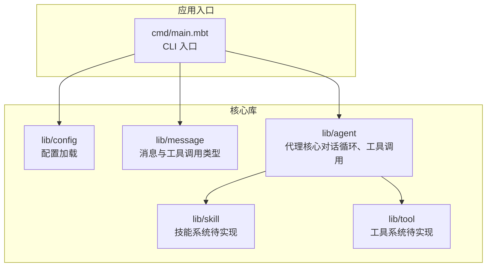
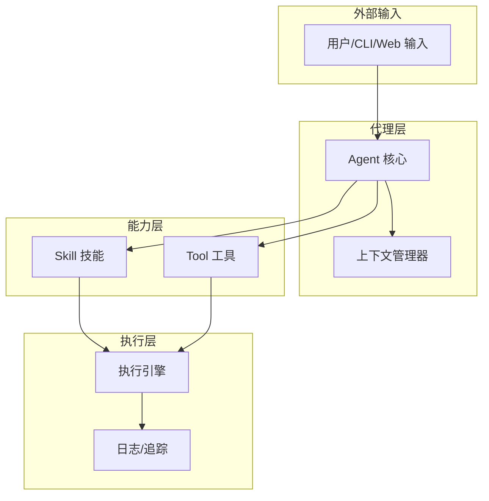
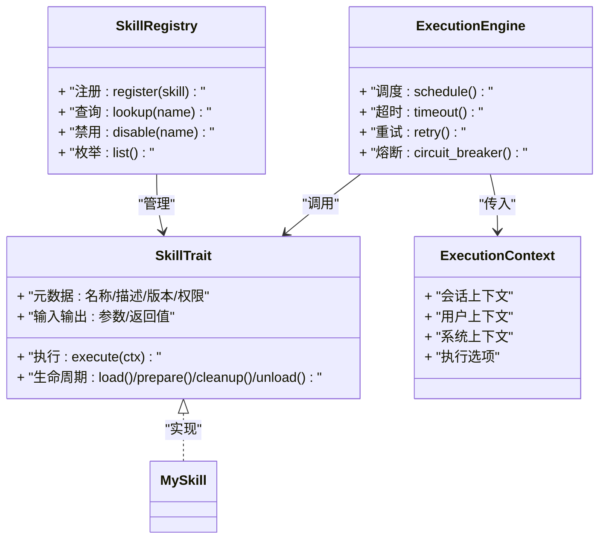
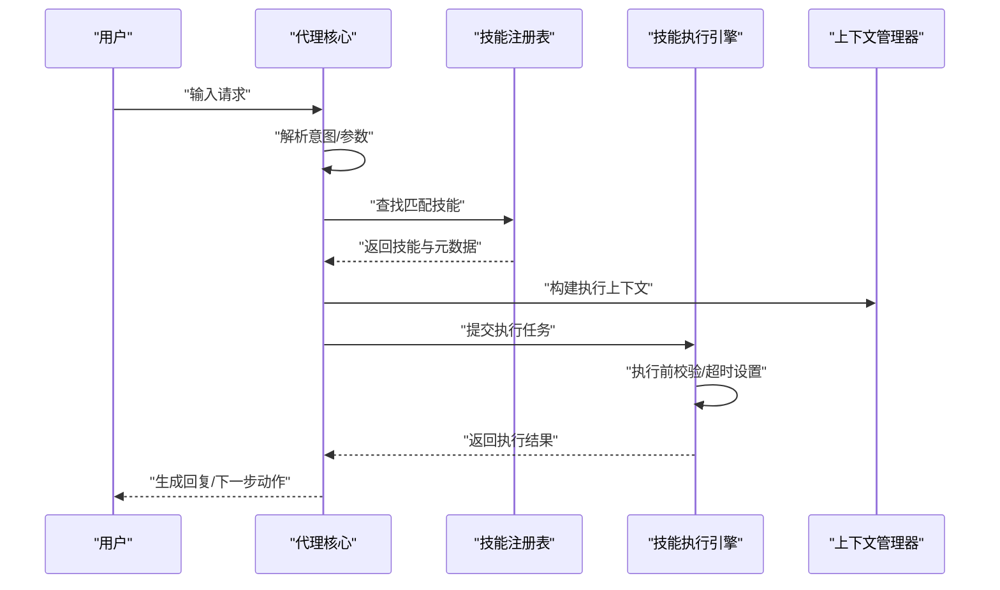
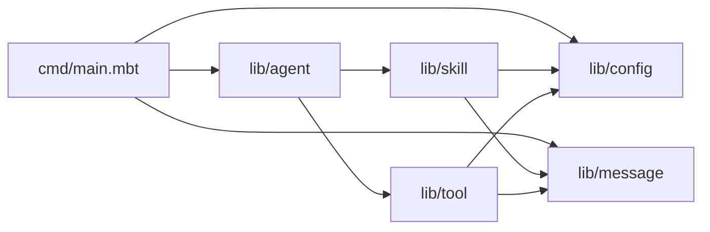

# 技能系统扩展

<cite>
**本文引用的文件**
- [README.md](file://README.md)
- [main.mbt](file://cmd/main.mbt)
- [moon.mod.json](file://moon.mod.json)
</cite>

## 目录
1. [简介](#简介)
2. [项目结构](#项目结构)
3. [核心组件](#核心组件)
4. [架构总览](#架构总览)
5. [详细组件分析](#详细组件分析)
6. [依赖分析](#依赖分析)
7. [性能考虑](#性能考虑)
8. [故障排查指南](#故障排查指南)
9. [结论](#结论)
10. [附录](#附录)

## 简介
本指南围绕 MBOpenClacky 的“技能系统扩展”主题，结合现有仓库信息，给出可操作的扩展蓝图与最佳实践。根据项目 README 的规划，技能系统（Phase 8）是后续开发阶段的重要组成部分，目标是在保留原项目核心能力的前提下，借助 MoonBit 的类型系统与工程化能力，实现可扩展、可维护、可测试的“技能”能力模块。

本指南涵盖：
- 技能系统的核心概念与扩展机制
- 技能元数据管理、执行控制与上下文管理
- 从接口实现到注册使用的完整开发流程
- 技能与工具系统的集成方式与调用机制
- 权限控制、状态管理与生命周期管理的最佳实践
- 复杂技能的实现模式与扩展点
- 调试技巧、性能考虑与与代理系统的交互模式

## 项目结构
当前仓库已明确划分了领域模块，技能系统作为独立模块位于 lib/skill。下图展示了与技能系统相关的主要模块及其职责：

图表来源
- [README.md:83-108](file://README.md#L83-L108)
- [main.mbt:1-27](file://cmd/main.mbt#L1-L27)

章节来源
- [README.md:83-108](file://README.md#L83-L108)
- [main.mbt:1-27](file://cmd/main.mbt#L1-L27)

## 核心组件
- 技能系统（lib/skill）
  - 职责：承载可扩展的能力单元，支持元数据管理、执行控制、上下文传递与生命周期管理。
  - 扩展点：通过 trait/接口定义技能契约，通过注册表集中管理技能清单与路由。
- 工具系统（lib/tool）
  - 职责：提供底层能力（如文件读写、Shell 调用等），技能可组合使用工具完成复杂任务。
- 代理核心（lib/agent）
  - 职责：编排对话循环、调度工具与技能、追踪成本与状态。
- 消息与类型（lib/message）
  - 职责：统一消息结构、角色、工具调用与结果类型，为技能与工具提供数据契约。
- 配置（lib/config）
  - 职责：加载 TOML/环境变量/路径配置，为技能与代理提供运行参数与策略开关。

章节来源
- [README.md:83-108](file://README.md#L83-L108)

## 架构总览
技能系统在整体架构中的位置如下：

该图为概念性架构示意，用于帮助理解技能系统在代理与工具之间的定位与交互关系。

## 详细组件分析

### 技能系统设计蓝图
- 技能契约（Trait/Interface）
  - 定义技能的输入输出、元数据字段（名称、描述、版本、权限、参数约束等）、执行方法签名与上下文参数。
  - 建议采用“结构体 + trait”的组合模式，确保类型安全与扩展性。
- 注册表与路由
  - 提供技能注册、查询、禁用与优先级排序能力，支持按名称/标签/权限维度筛选。
  - 支持动态加载与热更新（在 MoonBit 工程化能力范围内可行）。
- 元数据管理
  - 字段建议：id、name、description、version、tags、permissions、input_schema、output_schema、cost_model、timeout、visibility。
  - 与配置系统联动，支持通过 TOML/环境变量覆盖默认元数据。
- 执行控制
  - 支持同步/异步执行、超时控制、重试策略、熔断与降级。
  - 提供执行前校验（参数校验、权限校验、资源配额）与执行后归档（结果缓存、成本统计、审计日志）。
- 上下文管理
  - 传递会话上下文（session_id、history、memory）、用户上下文（user_id、role、permission）、系统上下文（timestamp、trace_id、node_id）。
  - 支持上下文裁剪与注入，避免敏感信息泄露。
- 生命周期管理
  - 初始化（load）、准备（prepare）、执行（execute）、清理（cleanup）、销毁（unload）。
  - 支持幂等与回滚，异常时自动清理临时资源。

### 技能与工具系统的集成与调用机制
- 调用链路
  - 代理核心接收用户请求，解析为消息与意图。
  - 根据意图选择技能或工具，或组合两者。
  - 将上下文注入执行引擎，执行完成后汇总结果。
- 调度策略
  - 优先级：内置技能 > 第三方技能 > 工具组合。
  - 负载均衡：多实例部署时支持分片与副本。
  - 降级策略：当技能不可用时回退到工具或提示用户。
- 结果聚合
  - 将技能输出与工具结果合并为统一的消息结构，交由代理继续对话循环。

### 权限控制、状态管理与生命周期管理最佳实践
- 权限控制
  - 基于角色与策略的访问控制（RBAC），技能元数据中声明所需权限，执行前进行授权校验。
  - 支持白名单/黑名单与动态权限开关。
- 状态管理
  - 会话状态：保存历史、记忆与进度，支持快照与恢复。
  - 技能状态：记录执行次数、成功率、失败原因，用于健康监控与自动修复。
- 生命周期管理
  - 初始化：加载配置、连接依赖、预热资源。
  - 准备：参数校验、资源预分配、上下文预热。
  - 执行：事务化执行，异常回滚。
  - 清理：释放锁、关闭连接、删除临时文件。
  - 销毁：注销监听、回收内存、通知观察者。

### 复杂技能实现模式
- 组合模式：将多个简单技能组合为复合技能，支持条件分支与并行执行。
- 状态机模式：将长流程拆分为多个步骤，每个步骤为一个技能，通过状态机协调。
- 观察者模式：技能执行过程中向外部系统推送事件，便于监控与告警。
- 策略模式：根据输入动态选择不同执行策略，提升灵活性。

### 调试技巧与性能考虑
- 调试
  - 使用结构化日志记录 trace_id、输入输出、耗时与错误栈。
  - 提供“dry-run”模式，离线验证技能逻辑与参数。
  - 单元测试覆盖边界条件与异常路径。
- 性能
  - 缓存热点数据与中间结果，减少重复计算。
  - 异步执行与并发限制，避免阻塞代理主循环。
  - 监控指标：执行时延、吞吐量、错误率、资源占用。

### 与代理系统的交互模式
- 请求-响应：代理发起调用，技能返回结果或错误。
- 流式回调：技能在执行过程中分段返回中间结果，代理实时渲染。
- 事件订阅：技能发布事件，代理订阅并触发后续动作。

## 依赖分析
- 模块依赖
  - cmd/main.mbt 依赖 config、message、agent 等模块，技能系统应在 agent 与 tool 之后实现。
  - 技能系统依赖 message（消息与工具调用类型）、config（配置与权限）、tool（底层能力）。
- 外部依赖
  - 项目声明了 moon.mod.json 作为模块元信息与依赖声明，技能系统实现时需遵循该文件的依赖管理规范。

图表来源
- [main.mbt:1-27](file://cmd/main.mbt#L1-L27)
- [README.md:83-108](file://README.md#L83-L108)

章节来源
- [main.mbt:1-27](file://cmd/main.mbt#L1-L27)
- [README.md:83-108](file://README.md#L83-L108)

## 性能考虑
- 执行效率
  - 将热点技能编译为原生代码，减少启动与调用开销。
  - 使用对象池与连接池，避免频繁创建销毁资源。
- 并发与限流
  - 为技能设置最大并发数与队列长度，防止过载。
  - 对外部依赖（如网络、数据库）实施超时与重试。
- 监控与可观测性
  - 采集关键指标（P95/P99 延迟、错误率、资源使用）。
  - 与代理核心的日志与追踪系统打通，形成端到端链路。

## 故障排查指南
- 常见问题
  - 技能未注册：检查注册表初始化与导入顺序。
  - 权限不足：核对元数据中的权限声明与执行前校验逻辑。
  - 超时与死锁：调整超时阈值与并发限制，排查阻塞点。
  - 上下文丢失：确认上下文注入与传递链路完整。
- 排查步骤
  - 启用详细日志，定位失败节点。
  - 使用单元测试隔离问题范围。
  - 对比正常与异常输入，缩小差异。
  - 快速回滚到上一个稳定版本，验证修复。

## 结论
技能系统是 MBOpenClacky 的关键扩展点，它将“可扩展能力”以类型安全、可测试、可维护的方式引入代理核心。通过明确的契约、完善的元数据与执行控制、严谨的上下文与生命周期管理，以及与工具系统的无缝集成，技能系统能够支撑复杂业务场景并保持良好的工程化水平。建议按照本文提供的蓝图与最佳实践，逐步完善技能系统的实现与测试，确保与代理核心的协同稳定与高效。

## 附录
- 开发路线建议
  - Phase 8：技能系统（trait/接口、注册表、执行引擎、上下文管理）
  - Phase 9：工具系统（与技能组合）
  - Phase 10：代理核心（对话循环、调度策略、成本追踪）
  - Phase 11：CLI/TUI/Web（界面与交互）
- 参考实现风格
  - 采用 struct + trait 的组合模式，确保类型安全与扩展性。
  - 使用 checked error handling 与 Result 风格组合，避免 nil 与运行时错误。
  - 以 moon mod 与 moon toolchain 为工程化基础，保证可复现与可维护性。