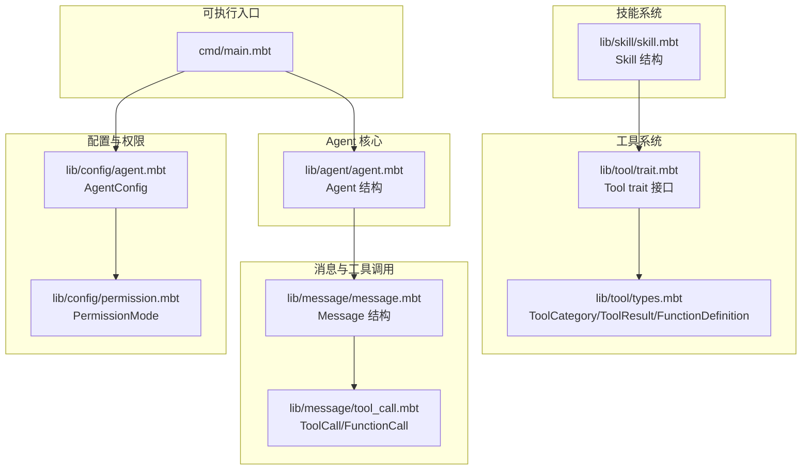
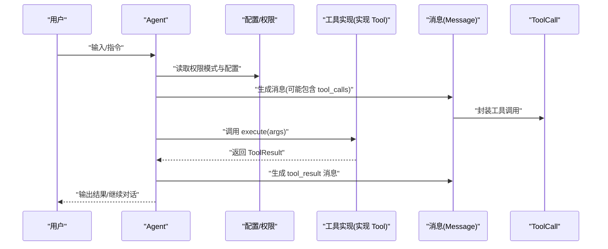
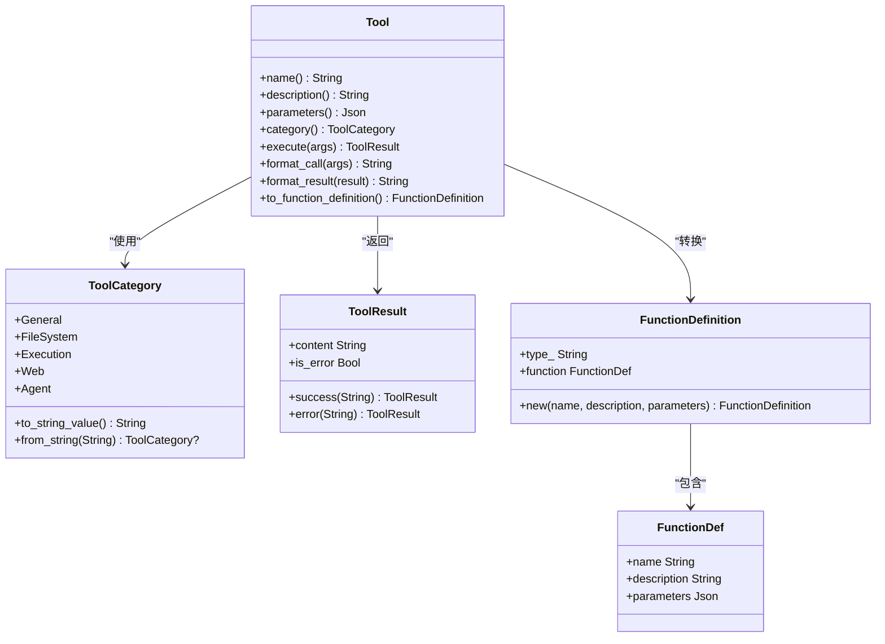
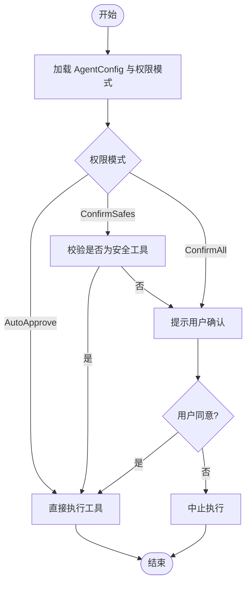
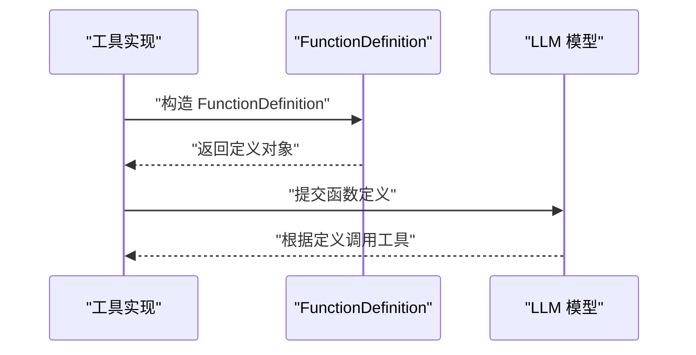
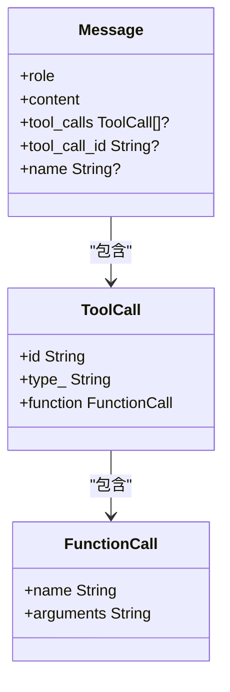
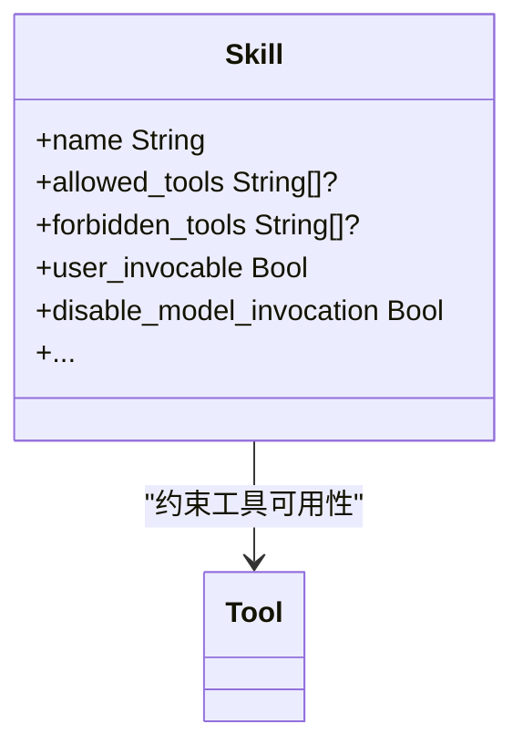
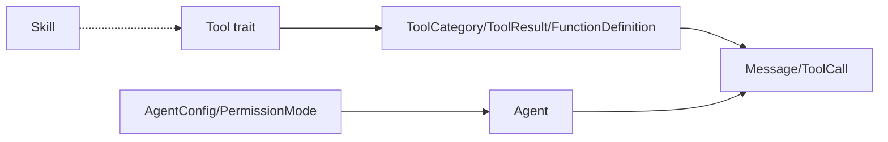

# 自定义工具开发

<cite>
**本文引用的文件**
- [README.md](file://README.md)
- [cmd/main.mbt](file://cmd/main.mbt)
- [lib/tool/trait.mbt](file://lib/tool/trait.mbt)
- [lib/tool/types.mbt](file://lib/tool/types.mbt)
- [lib/message/tool_call.mbt](file://lib/message/tool_call.mbt)
- [lib/message/message.mbt](file://lib/message/message.mbt)
- [lib/skill/skill.mbt](file://lib/skill/skill.mbt)
- [lib/config/permission.mbt](file://lib/config/permission.mbt)
- [lib/config/agent.mbt](file://lib/config/agent.mbt)
- [lib/agent/agent.mbt](file://lib/agent/agent.mbt)
</cite>

## 目录
1. [简介](#简介)
2. [项目结构](#项目结构)
3. [核心组件](#核心组件)
4. [架构总览](#架构总览)
5. [详细组件分析](#详细组件分析)
6. [依赖分析](#依赖分析)
7. [性能考量](#性能考量)
8. [故障排查指南](#故障排查指南)
9. [结论](#结论)
10. [附录](#附录)

## 简介
本指南面向希望为 MBOpenClacky 开发自定义工具的开发者，围绕 Tool trait 接口的设计原理与实现要求展开，系统讲解每个接口方法的职责与最佳实践，覆盖参数校验、错误处理、结果格式化、UI 展示、OpenAI 函数定义转换、工具分类与权限控制机制，并给出调试技巧与性能优化建议。

## 项目结构
MBOpenClacky 采用 MoonBit 的模块化组织方式，核心与工具系统位于 lib 目录下，cmd 为可执行入口。工具系统的关键类型与接口集中在 lib/tool 子模块，消息与工具调用类型在 lib/message，权限与配置在 lib/config，技能系统在 lib/skill，Agent 核心在 lib/agent。

**图表来源**
- [cmd/main.mbt:1-27](file://cmd/main.mbt#L1-L27)
- [lib/tool/trait.mbt:1-29](file://lib/tool/trait.mbt#L1-L29)
- [lib/tool/types.mbt:1-83](file://lib/tool/types.mbt#L1-L83)
- [lib/message/message.mbt:1-165](file://lib/message/message.mbt#L1-L165)
- [lib/message/tool_call.mbt:1-26](file://lib/message/tool_call.mbt#L1-L26)
- [lib/config/agent.mbt:1-33](file://lib/config/agent.mbt#L1-L33)
- [lib/config/permission.mbt:1-47](file://lib/config/permission.mbt#L1-L47)
- [lib/skill/skill.mbt:1-48](file://lib/skill/skill.mbt#L1-L48)
- [lib/agent/agent.mbt:1-40](file://lib/agent/agent.mbt#L1-L40)

**章节来源**
- [README.md:83-106](file://README.md#L83-L106)
- [cmd/main.mbt:1-27](file://cmd/main.mbt#L1-L27)

## 核心组件
- Tool trait：定义工具的标准接口，包括名称、描述、参数 JSON Schema、分类、执行、UI 格式化、OpenAI 函数定义转换等。
- ToolCategory：工具分类枚举，用于分组与权限控制。
- ToolResult：工具执行结果封装，包含内容与错误标记。
- FunctionDefinition/FunctionDef：OpenAI 兼容的函数定义结构，便于注册工具。
- ToolCall/FunctionCall：消息中的工具调用结构，承载工具名与参数字符串。
- AgentConfig/PermissionMode：Agent 配置与权限模式，影响工具调用前的确认策略。
- Skill：技能元数据，可限制允许/禁止使用的工具集合。
- Agent：会话主体，持有历史、状态、工作目录等，贯穿工具调用生命周期。

**章节来源**
- [lib/tool/trait.mbt:1-29](file://lib/tool/trait.mbt#L1-L29)
- [lib/tool/types.mbt:1-83](file://lib/tool/types.mbt#L1-L83)
- [lib/message/tool_call.mbt:1-26](file://lib/message/tool_call.mbt#L1-L26)
- [lib/config/permission.mbt:1-47](file://lib/config/permission.mbt#L1-L47)
- [lib/config/agent.mbt:1-33](file://lib/config/agent.mbt#L1-L33)
- [lib/skill/skill.mbt:1-48](file://lib/skill/skill.mbt#L1-L48)
- [lib/agent/agent.mbt:1-40](file://lib/agent/agent.mbt#L1-L40)

## 架构总览
工具系统围绕 Tool trait 展开，Agent 在对话循环中根据配置与权限决定是否执行工具。消息层负责承载工具调用与结果，技能系统可进一步约束工具可用性。OpenAI 函数定义用于向模型暴露工具签名。

**图表来源**
- [lib/agent/agent.mbt:1-40](file://lib/agent/agent.mbt#L1-L40)
- [lib/config/agent.mbt:1-33](file://lib/config/agent.mbt#L1-L33)
- [lib/config/permission.mbt:1-47](file://lib/config/permission.mbt#L1-L47)
- [lib/message/message.mbt:120-143](file://lib/message/message.mbt#L120-L143)
- [lib/message/tool_call.mbt:1-26](file://lib/message/tool_call.mbt#L1-L26)
- [lib/tool/trait.mbt:18-19](file://lib/tool/trait.mbt#L18-L19)

## 详细组件分析

### Tool trait 接口详解
- name()：返回工具的规范名称，用于唯一标识与日志记录。
- description()：返回人类可读的工具用途描述，帮助用户理解工具作用。
- parameters()：返回 JSON Schema，描述工具参数的结构、类型、必填项与约束。
- category()：返回工具分类，用于分组与权限控制。
- execute()：核心执行逻辑，接收参数映射，返回 ToolResult。
- format_call()：将调用参数格式化为 UI 友好文本，便于展示与审计。
- format_result()：将 ToolResult 格式化为 UI 友好文本，便于用户阅读。
- to_function_definition()：将工具转换为 OpenAI 函数定义，便于模型调用。

**图表来源**
- [lib/tool/trait.mbt:5-29](file://lib/tool/trait.mbt#L5-L29)
- [lib/tool/types.mbt:3-9](file://lib/tool/types.mbt#L3-L9)
- [lib/tool/types.mbt:43-58](file://lib/tool/types.mbt#L43-L58)
- [lib/tool/types.mbt:62-73](file://lib/tool/types.mbt#L62-L73)

**章节来源**
- [lib/tool/trait.mbt:1-29](file://lib/tool/trait.mbt#L1-L29)
- [lib/tool/types.mbt:1-83](file://lib/tool/types.mbt#L1-L83)

### 工具分类系统与权限控制
- 工具分类：ToolCategory 提供通用、文件系统、执行、Web、Agent 分类，支持序列化与反序列化。
- 权限模式：PermissionMode 控制工具调用前的确认策略，包括自动批准、仅确认安全项、全部确认。
- 集成点：AgentConfig 持有权限模式与最大 token 等配置；Agent 在执行流程中依据配置与权限决定行为。

**图表来源**
- [lib/config/permission.mbt:5-9](file://lib/config/permission.mbt#L5-L9)
- [lib/config/agent.mbt:3-15](file://lib/config/agent.mbt#L3-L15)

**章节来源**
- [lib/tool/types.mbt:3-39](file://lib/tool/types.mbt#L3-L39)
- [lib/config/permission.mbt:1-47](file://lib/config/permission.mbt#L1-L47)
- [lib/config/agent.mbt:1-33](file://lib/config/agent.mbt#L1-L33)

### OpenAI 函数定义转换
工具通过 to_function_definition() 输出 OpenAI 兼容的函数定义，包含类型、函数名、描述与参数 JSON Schema。该定义可用于模型调用工具。

**图表来源**
- [lib/tool/types.mbt:69-83](file://lib/tool/types.mbt#L69-L83)
- [lib/tool/trait.mbt:27-28](file://lib/tool/trait.mbt#L27-L28)

**章节来源**
- [lib/tool/types.mbt:61-83](file://lib/tool/types.mbt#L61-L83)

### 消息与工具调用
消息结构支持 tool_calls 字段，工具执行结果通过 tool_result 消息回传。ToolCall/FunctionCall 封装了工具调用的标识、类型与参数字符串。

**图表来源**
- [lib/message/message.mbt:20-37](file://lib/message/message.mbt#L20-L37)
- [lib/message/tool_call.mbt:3-16](file://lib/message/tool_call.mbt#L3-L16)

**章节来源**
- [lib/message/message.mbt:1-165](file://lib/message/message.mbt#L1-L165)
- [lib/message/tool_call.mbt:1-26](file://lib/message/tool_call.mbt#L1-L26)

### 技能系统与工具约束
技能结构包含允许/禁止工具列表、是否允许用户调用等字段，可与工具分类配合实现更细粒度的访问控制。

**图表来源**
- [lib/skill/skill.mbt:5-23](file://lib/skill/skill.mbt#L5-L23)

**章节来源**
- [lib/skill/skill.mbt:1-48](file://lib/skill/skill.mbt#L1-L48)

### 自定义工具实现示例（步骤与要点）
以下为实现自定义工具的步骤与最佳实践，不包含具体代码片段，请参考相应文件路径定位实现细节：

- 步骤 1：定义工具类型并实现 Tool trait
  - 在实现文件中声明类型并实现 name()/description()/parameters()/category()，确保参数 JSON Schema 完整、必填项明确。
  - 参考路径：[lib/tool/trait.mbt:5-29](file://lib/tool/trait.mbt#L5-L29)

- 步骤 2：实现 execute() 执行逻辑
  - 解析参数映射，进行参数校验与边界检查。
  - 执行核心操作，捕获异常并返回 ToolResult.success()/ToolResult.error()。
  - 参考路径：[lib/tool/trait.mbt:18-19](file://lib/tool/trait.mbt#L18-L19)，[lib/tool/types.mbt:43-58](file://lib/tool/types.mbt#L43-L58)

- 步骤 3：实现 UI 格式化方法
  - format_call()：将参数映射格式化为 UI 友好字符串，便于审计与调试。
  - format_result()：将 ToolResult 格式化为简洁可读的结果文本。
  - 参考路径：[lib/tool/trait.mbt:21-25](file://lib/tool/trait.mbt#L21-L25)

- 步骤 4：实现 to_function_definition()
  - 返回 FunctionDefinition，其中 parameters 使用 parameters() 的 JSON Schema。
  - 参考路径：[lib/tool/types.mbt:69-83](file://lib/tool/types.mbt#L69-L83)，[lib/tool/trait.mbt:27-28](file://lib/tool/trait.mbt#L27-L28)

- 步骤 5：选择合适的 ToolCategory 并与权限模式匹配
  - 例如文件系统类工具归入 FileSystem，执行类工具归入 Execution，Web 类工具归入 Web。
  - 参考路径：[lib/tool/types.mbt:3-9](file://lib/tool/types.mbt#L3-L9)，[lib/config/permission.mbt:5-9](file://lib/config/permission.mbt#L5-L9)

- 步骤 6：与 Agent/消息系统集成
  - 在 Agent 的对话循环中，依据配置与权限决定是否调用工具。
  - 工具结果通过 Message::tool_result() 生成消息回传。
  - 参考路径：[lib/agent/agent.mbt:1-40](file://lib/agent/agent.mbt#L1-L40)，[lib/message/message.mbt:120-143](file://lib/message/message.mbt#L120-L143)

- 步骤 7：与技能系统协同
  - 若需要限制工具可用性，可在技能结构中配置 allowed_tools/forbidden_tools。
  - 参考路径：[lib/skill/skill.mbt:5-23](file://lib/skill/skill.mbt#L5-L23)

**章节来源**
- [lib/tool/trait.mbt:1-29](file://lib/tool/trait.mbt#L1-L29)
- [lib/tool/types.mbt:1-83](file://lib/tool/types.mbt#L1-L83)
- [lib/message/message.mbt:120-143](file://lib/message/message.mbt#L120-L143)
- [lib/skill/skill.mbt:1-48](file://lib/skill/skill.mbt#L1-L48)
- [lib/agent/agent.mbt:1-40](file://lib/agent/agent.mbt#L1-L40)

## 依赖分析
- 工具实现依赖 Tool trait 与 ToolCategory/ToolResult/FunctionDefinition 等类型。
- Agent 依赖配置与权限模式，结合消息系统传递工具调用与结果。
- 技能系统可作为工具可用性的补充约束。

**图表来源**
- [lib/tool/trait.mbt:5-29](file://lib/tool/trait.mbt#L5-L29)
- [lib/tool/types.mbt:1-83](file://lib/tool/types.mbt#L1-L83)
- [lib/message/message.mbt:1-165](file://lib/message/message.mbt#L1-L165)
- [lib/config/agent.mbt:1-33](file://lib/config/agent.mbt#L1-L33)
- [lib/config/permission.mbt:1-47](file://lib/config/permission.mbt#L1-L47)
- [lib/skill/skill.mbt:1-48](file://lib/skill/skill.mbt#L1-L48)

**章节来源**
- [lib/tool/trait.mbt:1-29](file://lib/tool/trait.mbt#L1-L29)
- [lib/tool/types.mbt:1-83](file://lib/tool/types.mbt#L1-L83)
- [lib/message/message.mbt:1-165](file://lib/message/message.mbt#L1-L165)
- [lib/config/agent.mbt:1-33](file://lib/config/agent.mbt#L1-L33)
- [lib/config/permission.mbt:1-47](file://lib/config/permission.mbt#L1-L47)
- [lib/skill/skill.mbt:1-48](file://lib/skill/skill.mbt#L1-L48)

## 性能考量
- 参数校验前置：在 execute() 前通过 parameters() 的 JSON Schema 进行快速校验，减少无效调用。
- 结果缓存：对于重复输入可考虑缓存 ToolResult，但需注意缓存键与失效策略。
- I/O 优化：文件系统与网络类工具尽量批量处理、合并请求，避免频繁系统调用。
- UI 格式化：format_call()/format_result() 应避免复杂计算，优先使用预格式化或简单拼接。
- 权限与确认：合理设置 PermissionMode，避免不必要的用户交互导致的延迟。

## 故障排查指南
- 参数解析失败：检查 parameters() 返回的 JSON Schema 是否与调用参数一致，必要时在 format_call() 中打印参数摘要辅助诊断。
- 执行异常：在 execute() 中捕获异常并返回 ToolResult.error()，同时记录错误上下文。
- 结果未显示：确认 Message::tool_result() 的 tool_call_id 与 ToolCall.id 匹配，确保消息结构正确。
- 权限拒绝：检查 AgentConfig 的 permission_mode 与工具分类，确认是否需要用户确认。
- 技能限制：若工具被禁止，检查技能结构中的 forbidden_tools/allowed_tools 配置。

**章节来源**
- [lib/tool/types.mbt:43-58](file://lib/tool/types.mbt#L43-L58)
- [lib/message/message.mbt:120-143](file://lib/message/message.mbt#L120-L143)
- [lib/config/permission.mbt:1-47](file://lib/config/permission.mbt#L1-L47)
- [lib/skill/skill.mbt:5-23](file://lib/skill/skill.mbt#L5-L23)

## 结论
Tool trait 为 MBOpenClacky 的工具系统提供了统一、可扩展的接口。通过规范的参数 JSON Schema、清晰的分类与权限控制、完善的 UI 格式化与 OpenAI 函数定义转换，开发者可以快速实现高质量的自定义工具，并与 Agent、消息、技能与配置系统无缝集成。

## 附录
- 快速参考
  - 接口方法：name/description/parameters/category/execute/format_call/format_result/to_function_definition
  - 关键类型：ToolCategory/ToolResult/FunctionDefinition/FunctionDef
  - 消息类型：Message/ToolCall/FunctionCall
  - 配置类型：AgentConfig/PermissionMode
  - 技能类型：Skill

**章节来源**
- [lib/tool/trait.mbt:1-29](file://lib/tool/trait.mbt#L1-L29)
- [lib/tool/types.mbt:1-83](file://lib/tool/types.mbt#L1-L83)
- [lib/message/message.mbt:1-165](file://lib/message/message.mbt#L1-L165)
- [lib/message/tool_call.mbt:1-26](file://lib/message/tool_call.mbt#L1-L26)
- [lib/config/agent.mbt:1-33](file://lib/config/agent.mbt#L1-L33)
- [lib/config/permission.mbt:1-47](file://lib/config/permission.mbt#L1-L47)
- [lib/skill/skill.mbt:1-48](file://lib/skill/skill.mbt#L1-L48)
- [README.md:83-106](file://README.md#L83-L106)