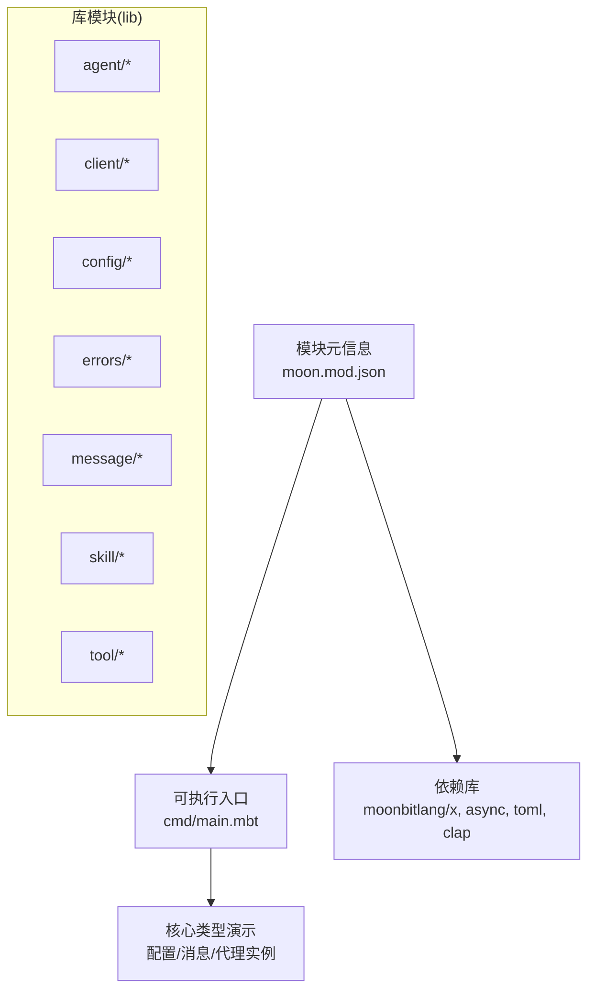
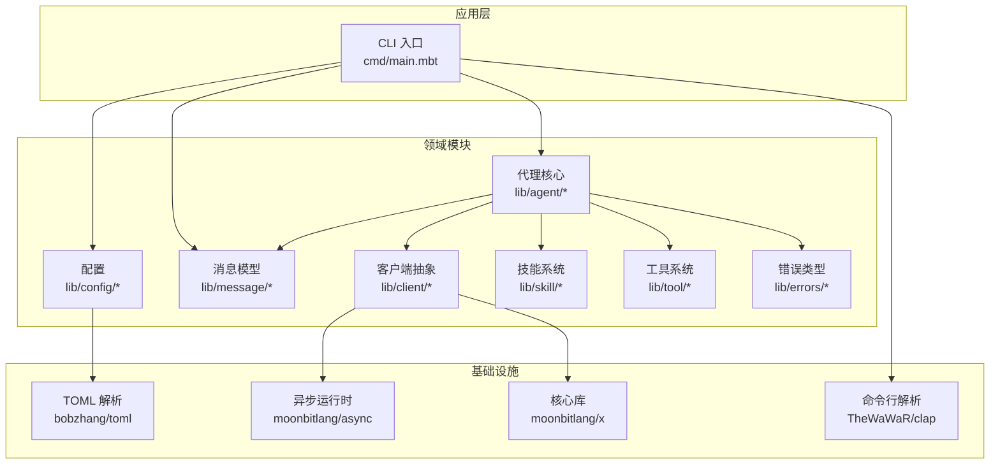
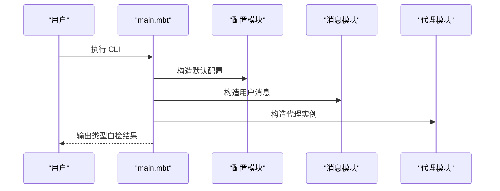
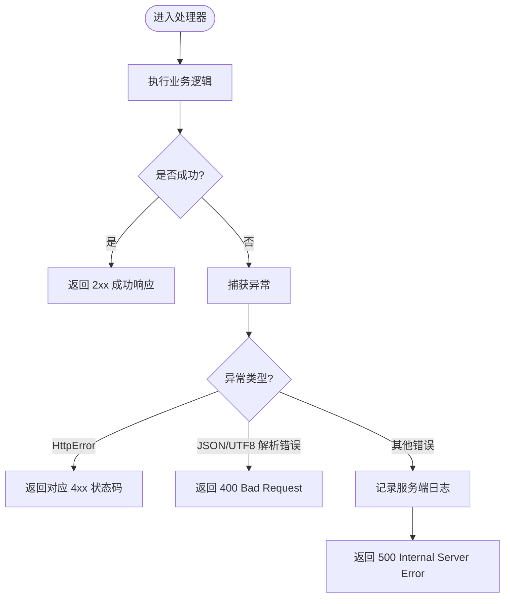
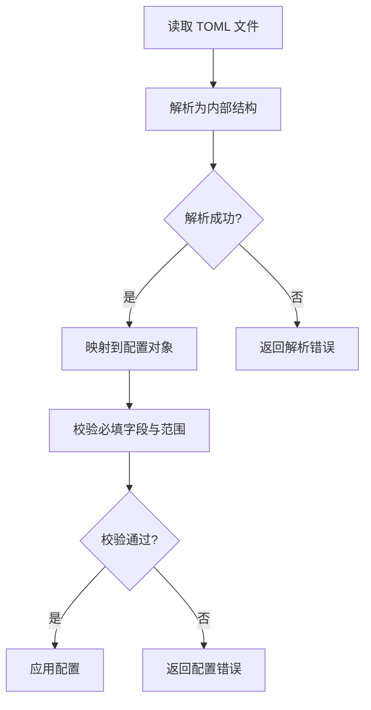
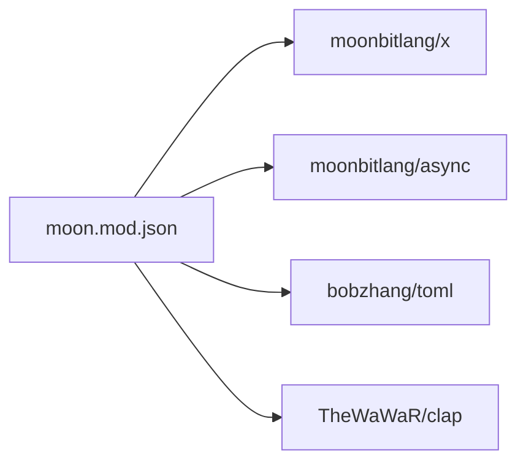

# 故障排除

<cite>
**本文引用的文件**
- [README.md](file://README.md)
- [moon.mod.json](file://moon.mod.json)
- [cmd/main.mbt](file://cmd/main.mbt)
- [.repos/bobzhang/crescent/0.10.0/error.mbt](file://.repos/bobzhang/crescent/0.10.0/error.mbt)
- [.repos/bobzhang/crescent/0.10.0/typed_handler.mbt](file://.repos/bobzhang/crescent/0.10.0/typed_handler.mbt)
- [.repos/colmugx/sqlite3/0.2.0/native/sqlite3.h](file://.repos/colmugx/sqlite3/0.2.0/native/sqlite3.h)
- [.mooncakes/bobzhang/toml/e2e/testdata/invalid/table/text-after-table.toml](file://.mooncakes/bobzhang/toml/e2e/testdata/invalid/table/text-after-table.toml)
- [.mooncakes/bobzhang/toml/additional_official_tests_test.mbt](file://.mooncakes/bobzhang/toml/additional_official_tests_test.mbt)
- [.mooncakes/bobzhang/toml/comprehensive_test.mbt](file://.mooncakes/bobzhang/toml/comprehensive_test.mbt)
</cite>

## 目录
1. [简介](#简介)
2. [项目结构](#项目结构)
3. [核心组件](#核心组件)
4. [架构总览](#架构总览)
5. [详细组件分析](#详细组件分析)
6. [依赖分析](#依赖分析)
7. [性能考虑](#性能考虑)
8. [故障排除指南](#故障排除指南)
9. [结论](#结论)
10. [附录](#附录)

## 简介
本指南面向 MBOpenClacky 的使用者与运维人员，提供系统化的安装、配置、运行与排错方法。文档覆盖常见问题与解决方案、错误信息解读、日志与性能分析、网络诊断、跨平台差异处理、错误分类与优先级、预防性维护与健康检查建议。由于当前仓库处于早期阶段，核心 CLI 入口仅进行基础类型自检，完整功能将在后续阶段逐步实现。

## 项目结构
- 顶层模块定义与首选目标在模块元信息中声明，依赖包括核心库、异步运行时、TOML 解析、命令行解析等。
- 可执行入口位于 cmd 目录，当前实现用于验证核心类型初始化。
- lib 下按领域拆分子包（agent、client、config、errors、message、skill、tool），便于后续按阶段开发与维护。

图示来源
- [moon.mod.json:1-16](file://moon.mod.json#L1-L16)
- [cmd/main.mbt:1-27](file://cmd/main.mbt#L1-L27)

章节来源
- [README.md:83-106](file://README.md#L83-L106)
- [moon.mod.json:1-16](file://moon.mod.json#L1-L16)
- [cmd/main.mbt:1-27](file://cmd/main.mbt#L1-L27)

## 核心组件
- 可执行入口：负责打印版本信息与演示核心类型构造（配置、消息、代理），用于验证脚手架与依赖是否正确。
- 模块元信息：声明项目名称、版本、依赖、首选目标（native）与关键字等。
- 依赖生态：核心库、异步运行时、TOML 解析、命令行解析等，为后续阶段（HTTP 客户端、LLM API、工具/技能系统、Agent 循环、CLI/TUI/Web）奠定基础。

章节来源
- [cmd/main.mbt:1-27](file://cmd/main.mbt#L1-L27)
- [moon.mod.json:1-16](file://moon.mod.json#L1-L16)

## 架构总览
下图展示从 CLI 入口到各领域模块的高层交互，以及错误处理与网络相关依赖的参与位置。

图示来源
- [cmd/main.mbt:1-27](file://cmd/main.mbt#L1-L27)
- [moon.mod.json:4-9](file://moon.mod.json#L4-L9)

## 详细组件分析

### CLI 入口与类型自检
- 当前行为：打印版本信息与三条类型自检输出，验证默认配置、用户消息与代理实例的构造。
- 关键点：若类型自检失败，通常指向依赖缺失、模块导入错误或类型签名不匹配。
- 建议：在本地构建后运行，确认输出与预期一致；若失败，先执行依赖更新与构建流程。

图示来源
- [cmd/main.mbt:8-22](file://cmd/main.mbt#L8-L22)

章节来源
- [cmd/main.mbt:1-27](file://cmd/main.mbt#L1-L27)

### 错误处理与网络相关依赖
- 错误类型：HTTP 错误、I/O 错误、网络错误、执行错误等，用于区分业务错误与系统错误。
- 错误包装器：将异常转换为合适的 HTTP 响应，未知错误返回 500 并隐藏内部细节。
- 安全性：未知错误在服务端记录真实信息，客户端仅返回通用错误提示。

图示来源
- [.repos/bobzhang/crescent/0.10.0/typed_handler.mbt:8-34](file://.repos/bobzhang/crescent/0.10.0/typed_handler.mbt#L8-L34)
- [.repos/bobzhang/crescent/0.10.0/error.mbt:1-11](file://.repos/bobzhang/crescent/0.10.0/error.mbt#L1-L11)

章节来源
- [.repos/bobzhang/crescent/0.10.0/typed_handler.mbt:1-131](file://.repos/bobzhang/crescent/0.10.0/typed_handler.mbt#L1-L131)
- [.repos/bobzhang/crescent/0.10.0/error.mbt:1-11](file://.repos/bobzhang/crescent/0.10.0/error.mbt#L1-L11)

### 配置与 TOML 解析
- TOML 解析：支持复杂嵌套结构与多种数据类型，适用于数据库连接、应用设置、缓存与功能开关等配置场景。
- 常见问题：TOML 语法错误、键名重复、非法字符、表后文本等会导致解析失败。
- 建议：使用官方测试样例作为参考，逐步增加配置项并验证解析结果。

图示来源
- [.mooncakes/bobzhang/toml/additional_official_tests_test.mbt:202-245](file://.mooncakes/bobzhang/toml/additional_official_tests_test.mbt#L202-L245)
- [.mooncakes/bobzhang/toml/comprehensive_test.mbt:340-373](file://.mooncakes/bobzhang/toml/comprehensive_test.mbt#L340-L373)
- [.mooncakes/bobzhang/toml/e2e/testdata/invalid/table/text-after-table.toml:1-1](file://.mooncakes/bobzhang/toml/e2e/testdata/invalid/table/text-after-table.toml#L1-L1)

章节来源
- [.mooncakes/bobzhang/toml/additional_official_tests_test.mbt:202-245](file://.mooncakes/bobzhang/toml/additional_official_tests_test.mbt#L202-L245)
- [.mooncakes/bobzhang/toml/comprehensive_test.mbt:340-373](file://.mooncakes/bobzhang/toml/comprehensive_test.mbt#L340-L373)
- [.mooncakes/bobzhang/toml/e2e/testdata/invalid/table/text-after-table.toml:1-1](file://.mooncakes/bobzhang/toml/e2e/testdata/invalid/table/text-after-table.toml#L1-L1)

### SQLite 与日志接口
- 日志接口：提供错误日志回调，可用于记录底层错误码与格式化消息，便于定位数据库相关问题。
- 建议：在集成持久化时启用日志回调，结合错误码与上下文信息进行排查。

章节来源
- [.repos/colmugx/sqlite3/0.2.0/native/sqlite3.h:9666-9687](file://.repos/colmugx/sqlite3/0.2.0/native/sqlite3.h#L9666-L9687)

## 依赖分析
- 模块元信息声明了核心依赖与首选目标，确保构建一致性与可复现性。
- 依赖关系影响后续阶段的实现路径：例如 HTTP 客户端与 SSE 流式响应需要异步运行时与核心库支持；Web 服务依赖 HTTP 工具与错误包装器。

图示来源
- [moon.mod.json:4-9](file://moon.mod.json#L4-L9)

章节来源
- [moon.mod.json:1-16](file://moon.mod.json#L1-L16)

## 性能考虑
- 启动与运行延迟：AOT 编译到原生代码相比解释执行具有更低的启动与运行延迟。
- 内存占用：无 VM 与 GC 元数据负担，二进制更轻量，适合本地常驻或一次性命令调用。
- 无需运行时：终端用户无需安装额外运行时，单一可执行文件即可运行。
- 异步并发：借助统一异步原语，可直观地编写流式 LLM 响应处理与并发工具调用。

章节来源
- [README.md:58-76](file://README.md#L58-L76)

## 故障排除指南

### 一、安装与环境问题
- 症状：无法运行或找不到可执行文件
  - 检查工具链版本与首选目标是否满足要求
  - 确认已执行依赖更新与安装
  - 尝试重新构建并使用构建产物路径运行
- 症状：类型检查失败或模块导入报错
  - 清理构建缓存后重试
  - 确认模块可见性与包结构符合 MoonBit 规范
- 症状：跨平台运行异常
  - 确认构建目标与运行平台一致
  - 检查权限与路径分隔符差异

章节来源
- [README.md:110-158](file://README.md#L110-L158)
- [moon.mod.json:14](file://moon.mod.json#L14)

### 二、配置错误
- 症状：配置解析失败或字段缺失
  - 使用官方测试样例作为参考，逐步添加配置项
  - 检查 TOML 语法与键名规范，避免非法字符与表后文本
  - 校验必填字段与取值范围
- 症状：配置生效异常
  - 确认配置加载顺序与优先级（文件/环境变量/默认值）
  - 在应用前打印配置快照进行核对

章节来源
- [.mooncakes/bobzhang/toml/additional_official_tests_test.mbt:202-245](file://.mooncakes/bobzhang/toml/additional_official_tests_test.mbt#L202-L245)
- [.mooncakes/bobzhang/toml/comprehensive_test.mbt:340-373](file://.mooncakes/bobzhang/toml/comprehensive_test.mbt#L340-L373)
- [.mooncakes/bobzhang/toml/e2e/testdata/invalid/table/text-after-table.toml:1-1](file://.mooncakes/bobzhang/toml/e2e/testdata/invalid/table/text-after-table.toml#L1-L1)

### 三、运行时异常与错误分类
- 分类与优先级
  - 4xx 业务错误：优先处理，修正请求参数或资源状态
  - 400 解析错误：修正输入格式（JSON/TOML/UTF-8）
  - 500 未知错误：记录服务端日志并回退到安全响应
- 常见错误类型
  - HTTP 错误：业务逻辑错误，返回明确状态码与消息
  - I/O 错误：文件/路径/权限问题
  - 网络错误：连接/超时/不可达
  - 执行错误：子进程/外部命令失败
- 处理建议
  - 严格区分业务错误与系统错误
  - 对未知错误进行安全降级，避免泄露内部细节
  - 在服务端记录真实错误，客户端返回通用提示

章节来源
- [.repos/bobzhang/crescent/0.10.0/error.mbt:1-11](file://.repos/bobzhang/crescent/0.10.0/error.mbt#L1-L11)
- [.repos/bobzhang/crescent/0.10.0/typed_handler.mbt:8-34](file://.repos/bobzhang/crescent/0.10.0/typed_handler.mbt#L8-L34)

### 四、日志分析
- 启用 SQLite 日志回调，结合错误码与上下文定位问题
- 在 Web 服务中利用错误包装器记录服务端日志
- 建议：在开发阶段开启详细日志，在生产阶段控制日志级别与敏感信息脱敏

章节来源
- [.repos/colmugx/sqlite3/0.2.0/native/sqlite3.h:9666-9687](file://.repos/colmugx/sqlite3/0.2.0/native/sqlite3.h#L9666-L9687)
- [.repos/bobzhang/crescent/0.10.0/typed_handler.mbt:28-31](file://.repos/bobzhang/crescent/0.10.0/typed_handler.mbt#L28-L31)

### 五、性能分析
- 启动与运行延迟：对比不同目标（native/wasm）与构建配置
- 内存占用：监控二进制大小与运行时内存变化
- 并发与流式：评估异步原语对吞吐的影响
- 建议：在基准场景下进行对比测试，记录关键指标

章节来源
- [README.md:58-76](file://README.md#L58-L76)

### 六、网络诊断
- 连通性：检查代理/防火墙/代理配置
- 超时与重试：合理设置超时与重试策略
- 协议与编码：确保 UTF-8 与 JSON 编解码正确
- 建议：在网络层引入可观测性，记录请求/响应与错误码

章节来源
- [.repos/bobzhang/crescent/0.10.0/typed_handler.mbt:12-26](file://.repos/bobzhang/crescent/0.10.0/typed_handler.mbt#L12-L26)

### 七、跨平台与环境差异
- Windows/macOS/Linux：注意路径分隔符、换行符、权限差异
- 构建目标：确保与运行平台一致
- 依赖缓存：清理缓存后重试，避免版本冲突

章节来源
- [README.md:110-116](file://README.md#L110-L116)

### 八、预防性维护与健康检查
- 依赖更新：定期更新依赖并进行类型检查与构建验证
- 配置审计：定期审查配置项，清理过期或冗余设置
- 健康检查：在关键路径增加探针与告警
- 备份与回滚：对配置与数据进行备份，建立回滚预案

章节来源
- [README.md:118-158](file://README.md#L118-L158)

## 结论
本指南提供了从安装到运行、从配置到错误处理的系统化排错方法。鉴于项目仍处于早期阶段，建议优先完成依赖与构建验证，再逐步接入后续阶段的功能模块。随着 Agent 核心、HTTP 客户端、工具/技能系统与 UI 的完善，故障排除流程也将随之扩展与细化。

## 附录
- 快速检查清单
  - 工具链版本与首选目标满足要求
  - 依赖已更新与安装
  - 构建成功并可执行
  - 配置解析通过并校验通过
  - 错误分类清晰，日志记录完整
  - 性能指标在可接受范围内
  - 跨平台差异已处理