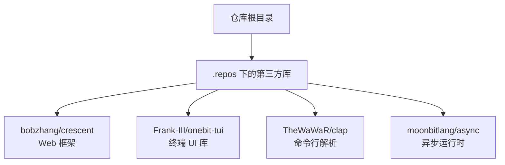
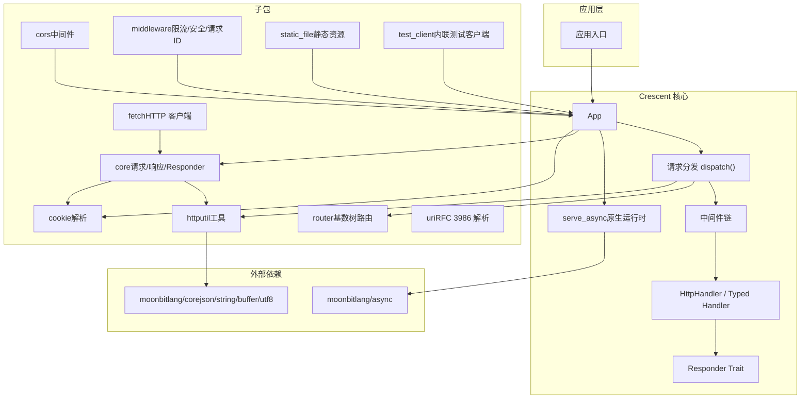
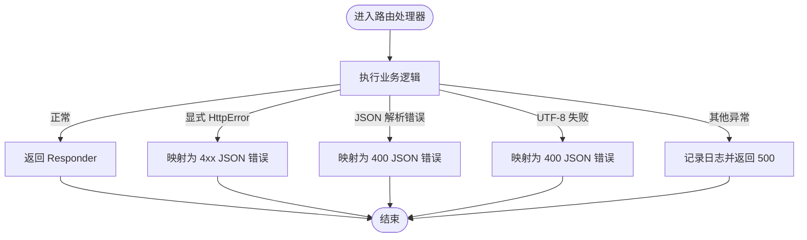
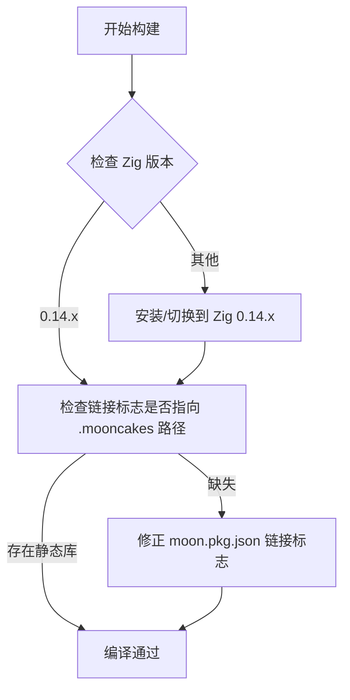

# 常见错误解决

<cite>
**本文引用的文件**
- [README.md（OneBit-TUI）](file://.repos/Frank-III/onebit-tui/0.1.3/README.md)
- [README.md（clap）](file://.repos/TheWaWaR/clap/0.2.6/README.md)
- [README.md（Crescent）](file://.repos/bobzhang/crescent/0.10.0/README.md)
- [ARCHITECTURE.md（Crescent）](file://.repos/bobzhang/crescent/0.10.0/ARCHITECTURE.md)
- [typed_handler.mbt（Crescent）](file://.repos/bobzhang/crescent/0.10.0/typed_handler.mbt)
- [pkg.generated.mbti（moonbitlang/async/os_error）](file://.repos/moonbitlang/async/0.19.1/src/os_error/pkg.generated.mbti)
</cite>

## 目录
1. [简介](#简介)
2. [项目结构](#项目结构)
3. [核心组件](#核心组件)
4. [架构总览](#架构总览)
5. [详细组件分析](#详细组件分析)
6. [依赖与错误对照表](#依赖与错误对照表)
7. [性能与稳定性建议](#性能与稳定性建议)
8. [故障排除清单](#故障排除清单)
9. [结论](#结论)

## 简介
本指南聚焦 MoonBit 开发中最常见的错误类型与解决方案，覆盖依赖导入错误、模块解析失败、编译错误、运行时异常等，并针对 moonbitlang/x 实验性库、Crescent Web 框架、OneBit-TUI 终端 UI 库、clap 命令行参数库等组件提供具体排查步骤与修复建议。文档同时给出错误代码对照表与快速排查清单，帮助初学者按步骤定位问题，也为有经验的开发者提供高效定位与修复路径。

## 项目结构
仓库包含多个 MoonBit 第三方实验性库与示例包，其中与本指南密切相关的组件如下：
- Crescent Web 框架：提供 HTTP/WebSocket 路由、中间件、静态资源、测试客户端等能力
- OneBit-TUI：终端 UI 库，需要正确配置 Zig 与链接标志
- clap：命令行参数解析库
- moonbitlang/async：异步运行时与系统错误类型定义

## 核心组件
- Crescent：基于 moonbitlang/async 的原生 HTTP/WebSocket 框架，支持路由、中间件、静态资源、WebSocket、CORS、Cookie、限流、安全头等；自动将错误映射为标准 HTTP 响应。
- OneBit-TUI：终端 UI 库，使用 Zig/C 渲染器与 Yoga 布局引擎，需正确设置链接标志与 Zig 版本。
- clap：命令行参数解析器，支持多级子命令、默认值、环境变量、帮助输出等。
- moonbitlang/async：提供异步运行时与系统错误类型（如 OSError），便于在底层 I/O 错误时进行诊断。

章节来源
- [.repos/bobzhang/crescent/0.10.0/README.md:1-300](file://.repos/bobzhang/crescent/0.10.0/README.md#L1-L300)
- [.repos/Frank-III/onebit-tui/0.1.3/README.md:1-414](file://.repos/Frank-III/onebit-tui/0.1.3/README.md#L1-L414)
- [.repos/TheWaWaR/clap/0.2.6/README.md:1-50](file://.repos/TheWaWaR/clap/0.2.6/README.md#L1-L50)
- [.repos/moonbitlang/async/0.19.1/src/os_error/pkg.generated.mbti:1-31](file://.repos/moonbitlang/async/0.19.1/src/os_error/pkg.generated.mbti#L1-L31)

## 架构总览
下图展示 Crescent 的高层架构与关键子包关系，以及与 moonbitlang/async 的依赖关系。

图表来源
- [.repos/bobzhang/crescent/0.10.0/ARCHITECTURE.md:203-259](file://.repos/bobzhang/crescent/0.10.0/ARCHITECTURE.md#L203-L259)

章节来源
- [.repos/bobzhang/crescent/0.10.0/ARCHITECTURE.md:1-259](file://.repos/bobzhang/crescent/0.10.0/ARCHITECTURE.md#L1-L259)

## 详细组件分析

### Crescent Web 框架：错误映射与自动响应
- 自动错误映射：所有路由处理器通过包装函数捕获错误并返回标准化 HTTP 响应，包括 JSON 错误体、状态码等。
- 典型场景：
  - 显式抛出 HttpError：映射到对应状态码与 JSON 错误体
  - JSON 解析失败：自动返回 400 与解析错误消息
  - 非法 UTF-8 请求体：返回 400
  - 未处理异常：记录日志并返回 500

图表来源
- [.repos/bobzhang/crescent/0.10.0/typed_handler.mbt:8-34](file://.repos/bobzhang/crescent/0.10.0/typed_handler.mbt#L8-L34)

章节来源
- [.repos/bobzhang/crescent/0.10.0/README.md:693-721](file://.repos/bobzhang/crescent/0.10.0/README.md#L693-L721)
- [.repos/bobzhang/crescent/0.10.0/typed_handler.mbt:1-34](file://.repos/bobzhang/crescent/0.10.0/typed_handler.mbt#L1-L34)

### OneBit-TUI 终端 UI：链接与构建问题
- 常见症状
  - 链接阶段找不到静态库或符号
  - Zig 版本不兼容导致构建失败
  - 运行时报 FFI 相关警告或崩溃
- 根因与修复
  - 确认 moon.pkg.json 中的 native 链接标志指向正确的 .mooncakes 安装产物路径
  - 确保 Zig 版本为 0.14.x（0.15.x 不兼容）
  - 若出现大量 FFI 注解告警，可暂时忽略（非致命）

图表来源
- [.repos/Frank-III/onebit-tui/0.1.3/README.md:363-383](file://.repos/Frank-III/onebit-tui/0.1.3/README.md#L363-L383)

章节来源
- [.repos/Frank-III/onebit-tui/0.1.3/README.md:351-414](file://.repos/Frank-III/onebit-tui/0.1.3/README.md#L351-L414)

### clap 命令行参数：解析与帮助生成
- 常见症状
  - 参数未识别、短选项冲突、帮助输出不符合预期
- 根因与修复
  - 检查参数定义与子命令层级是否正确
  - 使用内置帮助生成能力验证输出格式
  - 注意命名参数长度上限与位置参数顺序

章节来源
- [.repos/TheWaWaR/clap/0.2.6/README.md:1-50](file://.repos/TheWaWaR/clap/0.2.6/README.md#L1-L50)

### moonbitlang/async：系统错误与 OSError
- 常见症状
  - I/O 操作报错，errno 值不明确
- 根因与修复
  - 使用 OSError 类型与 errno 工具函数判断具体错误类别（如权限拒绝、连接被拒、不存在等）
  - 在上层框架中结合错误映射策略统一处理

章节来源
- [.repos/moonbitlang/async/0.19.1/src/os_error/pkg.generated.mbti:1-31](file://.repos/moonbitlang/async/0.19.1/src/os_error/pkg.generated.mbti#L1-L31)

## 依赖与错误对照表

### Crescent 常见错误映射
- 显式抛出 HttpError：映射为 JSON 错误体与对应状态码
- JSON 解析失败：映射为 400，携带解析错误消息
- 非法 UTF-8 请求体：映射为 400，提示无效 UTF-8
- 未处理异常：记录日志并返回 500

章节来源
- [.repos/bobzhang/crescent/0.10.0/README.md:693-721](file://.repos/bobzhang/crescent/0.10.0/README.md#L693-L721)
- [.repos/bobzhang/crescent/0.10.0/typed_handler.mbt:8-34](file://.repos/bobzhang/crescent/0.10.0/typed_handler.mbt#L8-L34)

### OneBit-TUI 链接与版本问题
- 链接错误：检查 moon.pkg.json 中 native 链接标志是否指向 .mooncakes 安装产物
- Zig 版本不兼容：确保使用 0.14.x
- FFI 警告：大量注解告警通常不影响功能，可暂时忽略

章节来源
- [.repos/Frank-III/onebit-tui/0.1.3/README.md:363-383](file://.repos/Frank-III/onebit-tui/0.1.3/README.md#L363-L383)

### moonbitlang/async 系统错误类别
- 常见错误类别：权限拒绝、连接被拒、不存在、中断、非阻塞 I/O 错误等
- 建议：在上层框架或业务逻辑中根据错误类别决定重试、降级或返回用户可理解的错误

章节来源
- [.repos/moonbitlang/async/0.19.1/src/os_error/pkg.generated.mbti:15-26](file://.repos/moonbitlang/async/0.19.1/src/os_error/pkg.generated.mbti#L15-L26)

## 性能与稳定性建议
- Crescent
  - 使用路由模式匹配（基数树）以获得 O(路径长度) 的匹配复杂度
  - 合理设置请求体大小限制与超时，避免资源耗尽
  - 对静态资源启用 ETag 与内容协商，减少带宽占用
- OneBit-TUI
  - 避免在事件循环中执行阻塞操作，保持 UI 流畅
  - 控制滚动与布局计算的复杂度，必要时拆分渲染批次
- 异步 I/O
  - 利用 moonbitlang/async 的非阻塞特性，避免同步阻塞调用

## 故障排除清单

- 通用排查
  - 确认 MoonBit 编译器与工具链版本满足目标库要求
  - 检查 moon.pkg.json 的 import 与 link 配置是否完整
  - 清理缓存后重新安装依赖（如涉及 .mooncakes 内容）

- Crescent
  - 确认 serve 目标为 native，且未误用 wasm/js
  - 检查路由注册顺序与中间件洋葱模型是否符合预期
  - 使用测试客户端验证错误映射与响应行为
  - 如需自定义错误响应，使用 try_json 或 get_raw（仅在确定不会抛错时）

- OneBit-TUI
  - 确认 Zig 0.14.x 已安装且 PATH 可用
  - 核对 moon.pkg.json 中 native 链接标志与 .mooncakes 路径一致
  - 忽略大量 FFI 注解告警（非致命）

- clap
  - 校验参数定义与子命令层级
  - 使用内置帮助输出校验格式是否符合预期

- moonbitlang/async
  - 使用 errno 工具函数定位底层系统错误类别
  - 在上层框架中统一错误处理策略

章节来源
- [.repos/bobzhang/crescent/0.10.0/README.md:1-14](file://.repos/bobzhang/crescent/0.10.0/README.md#L1-L14)
- [.repos/bobzhang/crescent/0.10.0/README.md:588-627](file://.repos/bobzhang/crescent/0.10.0/README.md#L588-L627)
- [.repos/Frank-III/onebit-tui/0.1.3/README.md:351-414](file://.repos/Frank-III/onebit-tui/0.1.3/README.md#L351-L414)
- [.repos/TheWaWaR/clap/0.2.6/README.md:1-50](file://.repos/TheWaWaR/clap/0.2.6/README.md#L1-L50)
- [.repos/moonbitlang/async/0.19.1/src/os_error/pkg.generated.mbti:1-31](file://.repos/moonbitlang/async/0.19.1/src/os_error/pkg.generated.mbti#L1-L31)

## 结论
通过本指南，开发者可以系统化地定位与修复 MoonBit 开发中的常见错误，尤其在使用 Crescent Web 框架、OneBit-TUI 终端 UI 库与 moonbitlang/async 异步运行时时，能够依据错误映射策略、链接标志配置与系统错误类别快速恢复服务。建议在团队内建立统一的错误处理规范与依赖管理流程，以降低集成风险并提升开发效率。