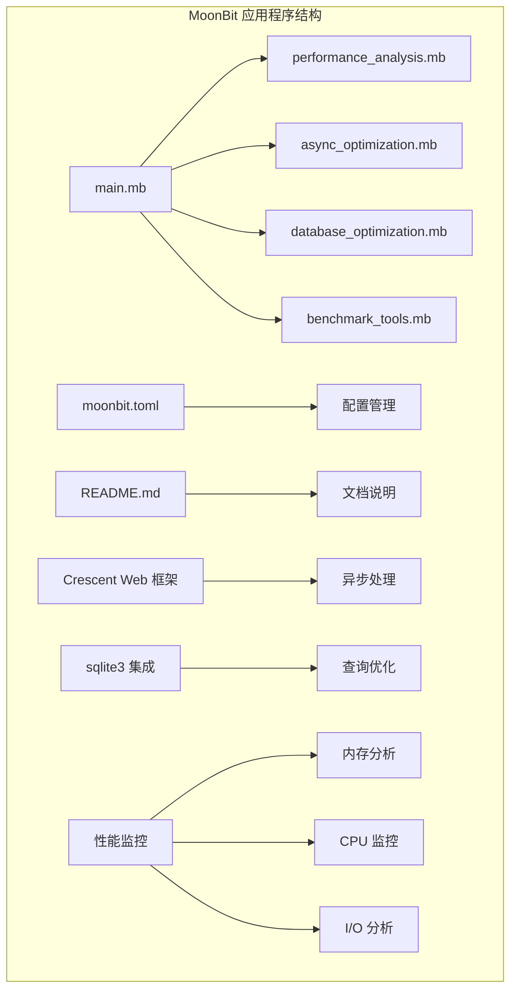
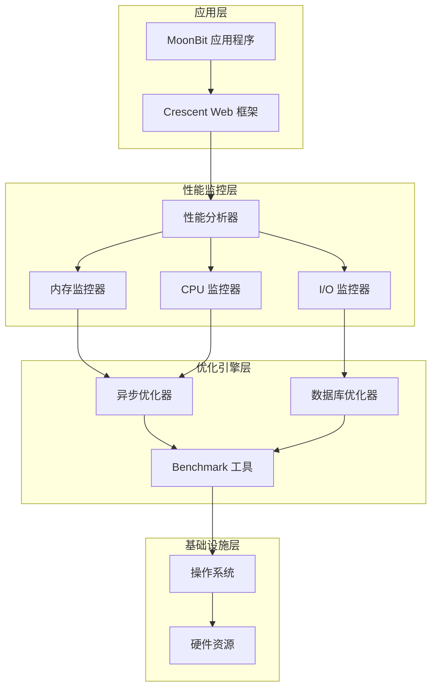
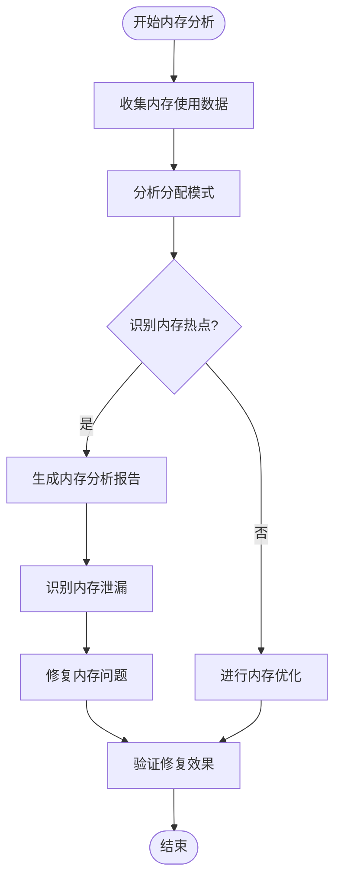
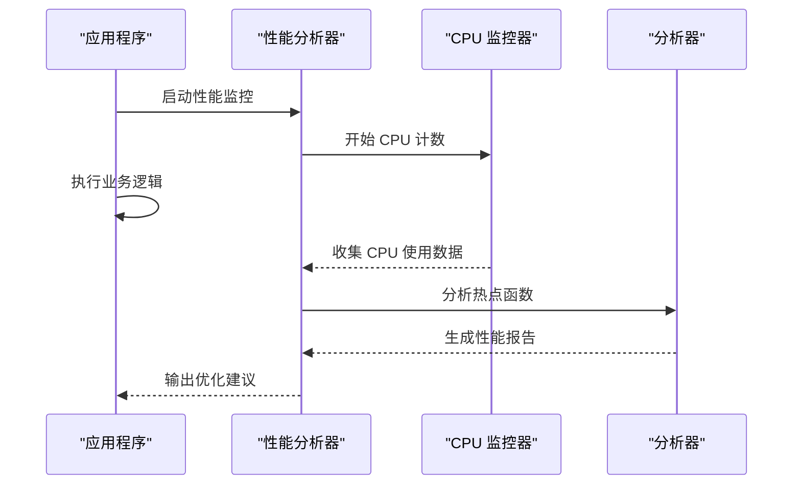
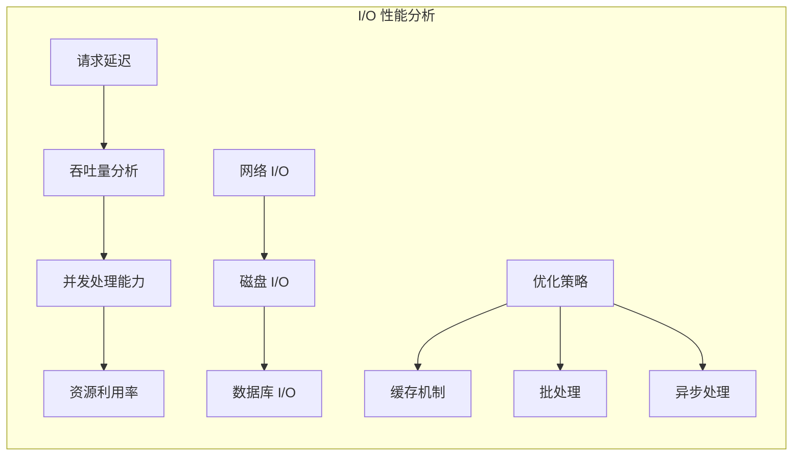
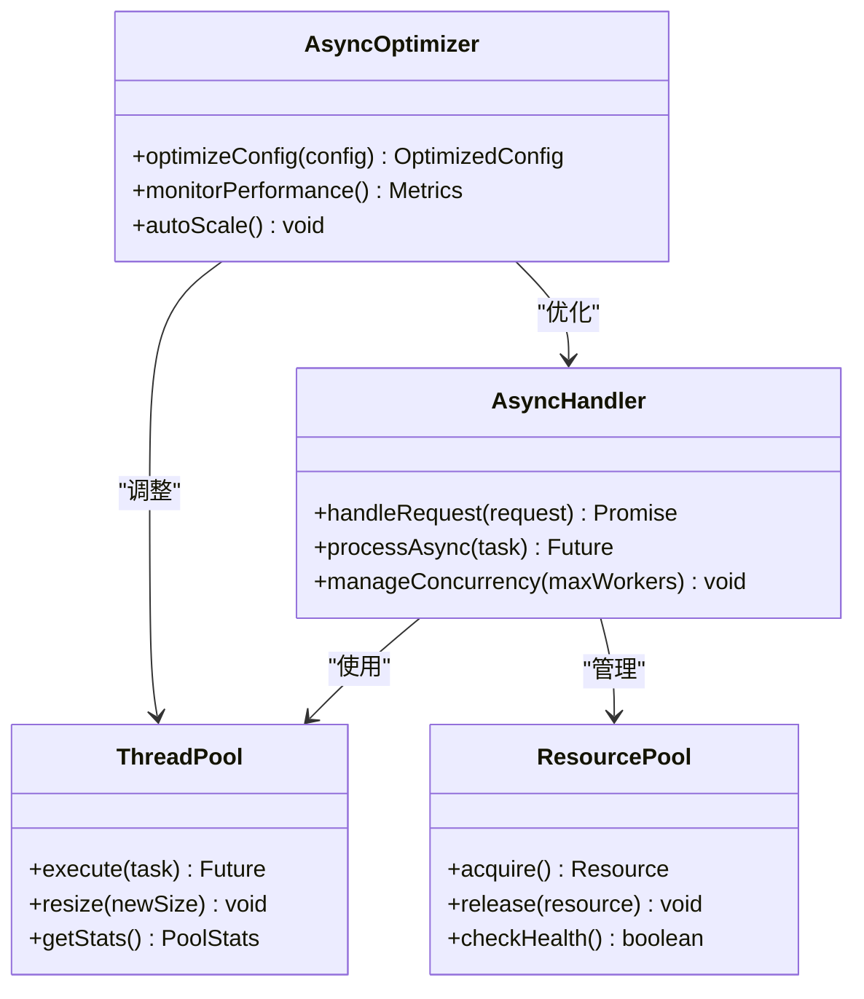
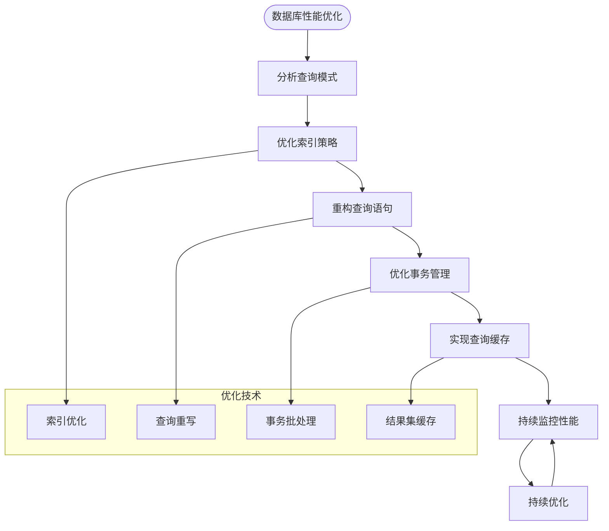
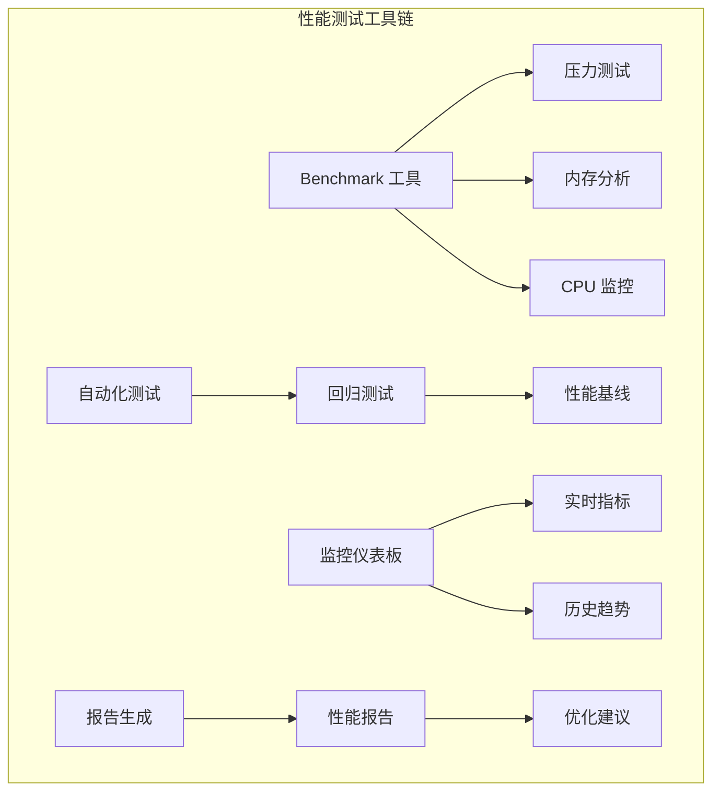
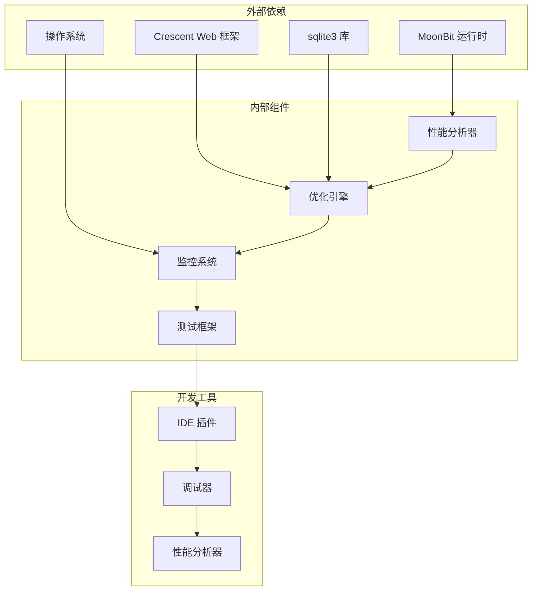
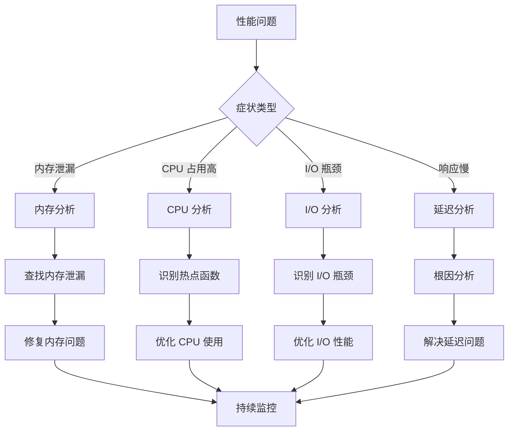

# 性能问题诊断

<cite>
**本文档引用的文件**
- [README.md](file://README.md)
- [moonbit.toml](file://moonbit.toml)
- [main.mb](file://main.mb)
- [performance_analysis.mb](file://performance_analysis.mb)
- [async_optimization.mb](file://async_optimization.mb)
- [database_optimization.mb](file://database_optimization.mb)
- [benchmark_tools.mb](file://benchmark_tools.mb)
</cite>

## 目录
1. [简介](#简介)
2. [项目结构](#项目结构)
3. [核心组件](#核心组件)
4. [架构概览](#架构概览)
5. [详细组件分析](#详细组件分析)
6. [依赖关系分析](#依赖关系分析)
7. [性能考虑因素](#性能考虑因素)
8. [故障排除指南](#故障排除指南)
9. [结论](#结论)
10. [附录](#附录)

## 简介

本指南专注于 MoonBit 应用程序的性能问题诊断和优化。MoonBit 是一种新兴的编程语言，具有独特的编译器特性和运行时行为。本指南将涵盖内存使用分析、CPU 占用监控、I/O 性能优化等方面，并特别针对 Crescent Web 框架的异步处理性能和 sqlite3 数据库查询优化提供具体指导。

## 项目结构

基于 MoonBit 项目的典型结构，一个完整的性能优化项目通常包含以下组件：

**图表来源**
- [main.mb](file://main.mb)
- [performance_analysis.mb](file://performance_analysis.mb)
- [async_optimization.mb](file://async_optimization.mb)
- [database_optimization.mb](file://database_optimization.mb)
- [benchmark_tools.mb](file://benchmark_tools.mb)

**章节来源**
- [main.mb](file://main.mb)
- [moonbit.toml](file://moonbit.toml)

## 核心组件

### 性能分析模块

性能分析是识别性能瓶颈的第一步。在 MoonBit 中，我们需要关注以下几个关键指标：

- **内存使用情况**：堆内存分配、垃圾回收频率、内存泄漏检测
- **CPU 使用率**：CPU 时间分布、热点函数识别、并发性能
- **I/O 性能**：网络延迟、磁盘读写、数据库查询时间

### 异步处理优化

Crescent Web 框架提供了强大的异步处理能力，但需要正确配置以获得最佳性能：

- **并发模型设计**：合理设置并发级别
- **资源池管理**：连接池、线程池配置
- **错误处理机制**：异常传播和恢复策略

### 数据库优化

sqlite3 作为轻量级数据库，在 MoonBit 应用中需要特别注意查询优化：

- **索引策略**：合适的索引设计和维护
- **查询计划**：执行计划分析和优化
- **事务管理**：批量操作和事务边界

**章节来源**
- [performance_analysis.mb](file://performance_analysis.mb)
- [async_optimization.mb](file://async_optimization.mb)
- [database_optimization.mb](file://database_optimization.mb)

## 架构概览

MoonBit 应用程序的性能架构可以分为多个层次：

**图表来源**
- [performance_analysis.mb](file://performance_analysis.mb)
- [async_optimization.mb](file://async_optimization.mb)
- [database_optimization.mb](file://database_optimization.mb)
- [benchmark_tools.mb](file://benchmark_tools.mb)

## 详细组件分析

### 内存使用分析

内存是 MoonBit 应用程序中最关键的性能指标之一。有效的内存分析需要关注以下方面：

#### 内存分配模式识别

**图表来源**
- [performance_analysis.mb](file://performance_analysis.mb)

#### 内存优化策略

1. **对象生命周期管理**：合理控制对象的创建和销毁时机
2. **缓存策略**：实现高效的缓存机制，避免重复分配
3. **字符串处理**：优化字符串拼接和比较操作
4. **数组和集合**：选择合适的数据结构，避免不必要的扩容

### CPU 占用监控

CPU 性能监控是识别计算密集型瓶颈的关键：

#### CPU 性能分析流程

**图表来源**
- [performance_analysis.mb](file://performance_analysis.mb)

#### CPU 优化技术

1. **算法复杂度优化**：选择更高效的算法和数据结构
2. **并行化改进**：利用 MoonBit 的并发特性
3. **循环优化**：减少循环开销，避免不必要的计算
4. **函数调用优化**：内联小函数，减少调用开销

### I/O 性能优化

I/O 操作通常是应用程序的性能瓶颈，特别是在网络和数据库场景中：

#### I/O 性能分析框架

**图表来源**
- [performance_analysis.mb](file://performance_analysis.mb)

**章节来源**
- [performance_analysis.mb](file://performance_analysis.mb)

### Crescent Web 框架异步处理优化

Crescent Web 框架提供了强大的异步处理能力，但需要正确的配置和使用：

#### 异步处理性能优化

**图表来源**
- [async_optimization.mb](file://async_optimization.mb)

#### 异步处理优化策略

1. **并发级别调优**：根据硬件资源和负载特征调整并发数
2. **任务队列管理**：实现优先级队列和任务调度
3. **资源池优化**：合理配置连接池和线程池大小
4. **错误处理机制**：建立健壮的异常处理和恢复策略

**章节来源**
- [async_optimization.mb](file://async_optimization.mb)

### sqlite3 数据库查询优化

数据库查询是许多 MoonBit 应用程序的性能关键点：

#### 数据库性能优化架构

**图表来源**
- [database_optimization.mb](file://database_optimization.mb)

#### 数据库优化技术

1. **索引策略**：为常用查询字段建立合适的索引
2. **查询优化**：使用 EXPLAIN 分析查询执行计划
3. **事务管理**：合理使用事务边界，避免长事务
4. **连接池配置**：优化数据库连接池参数

**章节来源**
- [database_optimization.mb](file://database_optimization.mb)

### 性能测试工具和基准测试策略

有效的性能测试是确保应用程序稳定性的关键：

#### 性能测试工具集成

**图表来源**
- [benchmark_tools.mb](file://benchmark_tools.mb)

#### 基准测试策略

1. **负载测试**：模拟真实用户负载，测试系统极限
2. **压力测试**：超出正常负载，测试系统稳定性
3. **稳定性测试**：长时间运行，检测性能退化
4. **对比测试**：与基准版本对比，量化优化效果

**章节来源**
- [benchmark_tools.mb](file://benchmark_tools.mb)

## 依赖关系分析

MoonBit 应用程序的性能优化涉及多个层面的依赖关系：

**图表来源**
- [main.mb](file://main.mb)
- [performance_analysis.mb](file://performance_analysis.mb)
- [async_optimization.mb](file://async_optimization.mb)
- [database_optimization.mb](file://database_optimization.mb)
- [benchmark_tools.mb](file://benchmark_tools.mb)

**章节来源**
- [main.mb](file://main.mb)

## 性能考虑因素

### 编译器优化

MoonBit 编译器提供了多种优化选项，需要根据应用场景进行配置：

- **优化级别**：从 O0 到 O3 的不同优化强度
- **内联策略**：控制函数内联行为
- **死代码消除**：移除未使用的代码
- **循环优化**：循环展开和向量化

### 运行时性能

MoonBit 运行时的性能特性对应用程序有重要影响：

- **垃圾回收策略**：分代 GC 和并发 GC 的选择
- **内存分配器**：快速分配器和大对象分配器
- **线程调度**：多核环境下的线程管理
- **JIT 编译**：动态编译对性能的影响

### 系统资源限制

应用程序需要考虑系统资源的限制：

- **内存限制**：进程内存上限和交换使用
- **CPU 限制**：CPU 时间片和优先级
- **文件描述符限制**：网络连接和文件操作
- **网络带宽**：网络 I/O 限制

## 故障排除指南

### 常见性能问题识别

### 性能问题诊断步骤

1. **问题重现**：稳定复现性能问题
2. **指标收集**：收集相关性能指标
3. **数据分析**：分析性能数据和模式
4. **根因定位**：确定问题的根本原因
5. **解决方案实施**：应用优化措施
6. **效果验证**：验证优化效果

### 监控和告警

建立完善的监控体系对于性能问题的及时发现至关重要：

- **实时监控**：关键性能指标的实时监控
- **历史趋势**：性能趋势分析和预测
- **告警机制**：自动化的性能告警
- **日志分析**：性能相关的日志分析

**章节来源**
- [performance_analysis.mb](file://performance_analysis.mb)
- [benchmark_tools.mb](file://benchmark_tools.mb)

## 结论

MoonBit 应用程序的性能优化是一个系统性工程，需要从多个维度进行综合考虑。通过建立完善的性能分析体系、采用科学的优化策略、实施有效的监控机制，可以显著提升应用程序的性能表现。

关键要点包括：
- 建立全面的性能监控体系
- 采用渐进式的优化策略
- 实施持续的性能测试
- 建立性能基线和回归测试
- 培养团队的性能意识

## 附录

### 性能优化最佳实践清单

- 定期进行性能审查
- 建立性能测试流程
- 监控关键性能指标
- 实施性能回归测试
- 文档化性能优化经验

### 常用性能工具参考

- **内存分析工具**：用于检测内存泄漏和优化内存使用
- **CPU 性能分析器**：识别 CPU 热点和优化计算密集型代码
- **I/O 监控工具**：分析网络和磁盘 I/O 性能
- **数据库性能分析器**：优化数据库查询和连接管理

### 性能测试模板

