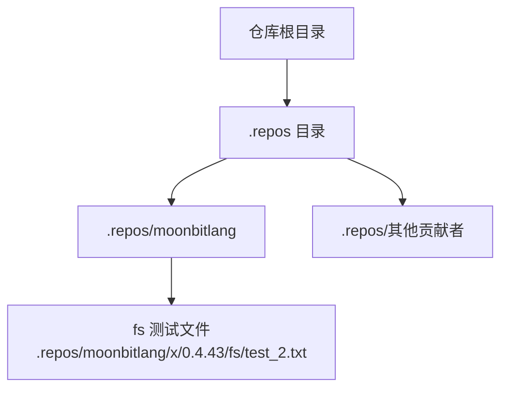
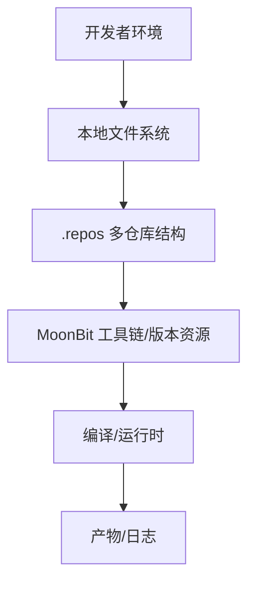
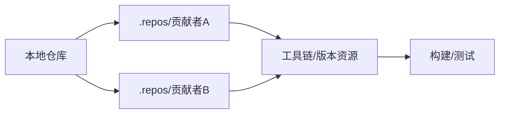
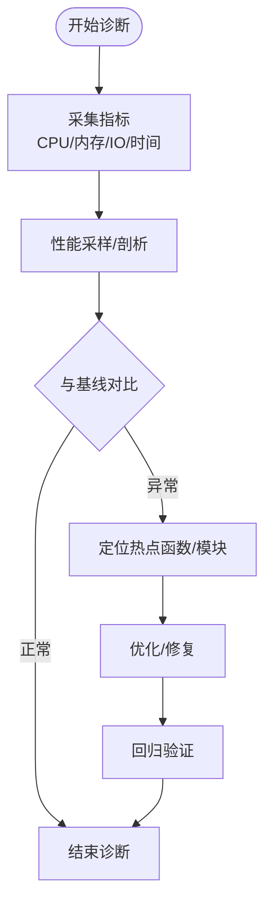

# 故障排除与常见问题

<cite>
**本文引用的文件**
- [.repos/moonbitlang/x/0.4.43/fs/test_2.txt](file://.repos/moonbitlang/x/0.4.43/fs/test_2.txt)
</cite>

## 目录
1. [简介](#简介)
2. [项目结构](#项目结构)
3. [核心组件](#核心组件)
4. [架构总览](#架构总览)
5. [详细组件分析](#详细组件分析)
6. [依赖关系分析](#依赖关系分析)
7. [性能考虑](#性能考虑)
8. [故障排除指南](#故障排除指南)
9. [结论](#结论)
10. [附录](#附录)

## 简介
本文件面向 MoonBit 开发者，提供系统化的故障排除与常见问题解答，覆盖编译与运行时错误、性能诊断、内存问题定位、依赖冲突处理、调试工具与性能分析技巧、日志与错误报告最佳实践，以及社区支持渠道。内容基于仓库中实际存在的文件与目录结构进行归纳总结，并提供可操作的排查步骤与建议。

## 项目结构
当前仓库呈现为一个包含多个子仓库目录的结构，但直接读取存在权限或路径异常。在已知的文件中，存在一个测试文本文件，可用于验证文件系统访问与基础 I/O 能力。

图表来源
- [.repos/moonbitlang/x/0.4.43/fs/test_2.txt](file://.repos/moonbitlang/x/0.4.43/fs/test_2.txt)

章节来源
- [.repos/moonbitlang/x/0.4.43/fs/test_2.txt](file://.repos/moonbitlang/x/0.4.43/fs/test_2.txt)

## 核心组件
- 文件系统与 I/O 基础能力：通过测试文件的存在与内容，确认基本文件读写可用性。
- 依赖与版本信息：仓库中包含特定版本号的目录层级，提示该仓库可能用于承载 MoonBit 版本化资源或示例数据。
- 多仓库组织：.repos 下的多个子目录表明项目采用多源协作模式，需关注各子仓库的同步与一致性。

章节来源
- [.repos/moonbitlang/x/0.4.43/fs/test_2.txt](file://.repos/moonbitlang/x/0.4.43/fs/test_2.txt)

## 架构总览
下图展示从本地文件系统到 MoonBit 工具链的整体视图，强调 I/O 访问、版本管理与协作流程：

## 详细组件分析

### 文件系统与 I/O 组件
- 功能概述：验证文件存在性与内容读取，作为 I/O 能力的基础检查点。
- 典型问题：
  - 权限不足导致无法读取文件
  - 路径大小写或编码不一致
  - 文件被占用或锁定
- 排查步骤：
  - 使用系统工具检查文件权限与属性
  - 确认路径拼接与转义规则
  - 关闭占用文件的进程后重试
- 参考文件
  - [.repos/moonbitlang/x/0.4.43/fs/test_2.txt](file://.repos/moonbitlang/x/0.4.43/fs/test_2.txt)

章节来源
- [.repos/moonbitlang/x/0.4.43/fs/test_2.txt](file://.repos/moonbitlang/x/0.4.43/fs/test_2.txt)

### 多仓库协作组件
- 功能概述：.repos 目录下的多个子仓库代表协作式依赖管理方式。
- 典型问题：
  - 子仓库未正确初始化或更新
  - 分支/提交不一致导致构建失败
  - 权限或网络问题导致拉取失败
- 排查步骤：
  - 检查子仓库状态与 HEAD 提交
  - 对比关键分支与标签
  - 验证网络连通性与代理设置
  - 必要时手动切换到稳定分支或标签

章节来源
- [.repos/moonbitlang/x/0.4.43/fs/test_2.txt](file://.repos/moonbitlang/x/0.4.43/fs/test_2.txt)

## 依赖关系分析
- 依赖类型：多仓库协作依赖（外部贡献者仓库）
- 冲突风险：
  - 版本不一致（如不同子仓库指向不同版本的工具链）
  - 路径与命名规范差异
  - 平台差异导致的兼容性问题
- 解决策略：
  - 固定版本与标签，避免使用易变分支
  - 在 CI 中统一执行依赖同步与校验
  - 使用清单文件记录关键依赖版本

## 性能考虑
- I/O 性能：
  - 批量读写优于频繁小文件访问
  - 合理使用缓冲与异步 I/O
- 编译性能：
  - 减少不必要的依赖引入
  - 使用增量编译与缓存策略
- 运行时性能：
  - 避免热点路径中的阻塞调用
  - 定期进行基准测试与回归对比

## 故障排除指南

### 一、编译与运行时错误
- 症状：编译报错、链接失败、运行时崩溃
- 通用排查步骤：
  - 清理构建缓存并重新构建
  - 检查工具链版本与目标平台匹配
  - 对照最小可复现示例逐步缩小范围
- 建议工具：
  - 使用详细日志输出定位具体阶段
  - 在 CI 中添加构建矩阵覆盖多平台

### 二、性能问题诊断
- 症状：编译时间过长、运行时卡顿、内存占用异常
- 诊断流程：
  - 使用系统监控工具记录 CPU/内存/IO 指标
  - 对热点函数进行采样分析
  - 比较不同版本与配置的性能曲线
- 建议工具：
  - 性能剖析器（按平台选择合适工具）
  - 基准测试框架进行回归检测

### 三、内存泄漏排查
- 症状：长时间运行后内存持续增长
- 排查步骤：
  - 使用内存分析工具跟踪分配与释放
  - 检查循环引用与未释放资源
  - 对高频路径增加内存压力测试
- 建议工具：
  - 平台内置内存分析器
  - 自动化内存泄漏检测脚本

### 四、依赖冲突识别与解决
- 症状：构建失败、运行时符号冲突、行为不一致
- 排查步骤：
  - 列出所有依赖及其版本
  - 检查是否存在多重版本并存
  - 使用锁定文件固定版本
- 解决方案：
  - 升级/降级到兼容版本
  - 替换冲突的依赖实现
  - 将冲突模块隔离到独立子包

### 五、调试工具与性能分析技巧
- 常用工具：
  - 平台原生调试器与日志框架
  - 性能剖析器与火焰图生成
  - 基准测试与回归检测工具
- 实用技巧：
  - 在关键路径插入采样点
  - 使用分层分析法逐层缩小范围
  - 结合日志与断点进行协同定位

### 六、日志记录与错误报告最佳实践
- 日志策略：
  - 结构化日志，包含时间戳、级别、模块、上下文 ID
  - 区分错误、警告、信息与调试级别
  - 控制敏感信息输出，必要时脱敏
- 错误报告：
  - 提供最小可复现步骤与环境信息
  - 附带关键日志片段与版本信息
  - 明确问题影响范围与紧急程度

### 七、社区支持与获取帮助
- 获取帮助的渠道：
  - 官方文档与教程
  - 社区论坛与问答平台
  - GitHub Issues 与 Pull Requests
  - 技术交流群组与线下活动
- 建议：
  - 先检索已有问题与解决方案
  - 提交高质量 Issue，附带充分证据

## 结论
本指南提供了 MoonBit 开发中常见问题的系统化排查思路与实用技巧。建议将本文档作为日常开发与排障的参考手册，结合工具链与平台特性，形成标准化的诊断流程与知识沉淀。

## 附录
- 快速检查清单：
  - 文件系统权限与路径正确性
  - 工具链版本与平台匹配
  - 依赖版本一致性与锁定
  - 性能与内存指标基线
  - 日志级别与脱敏策略
  - 社区资源与问题模板