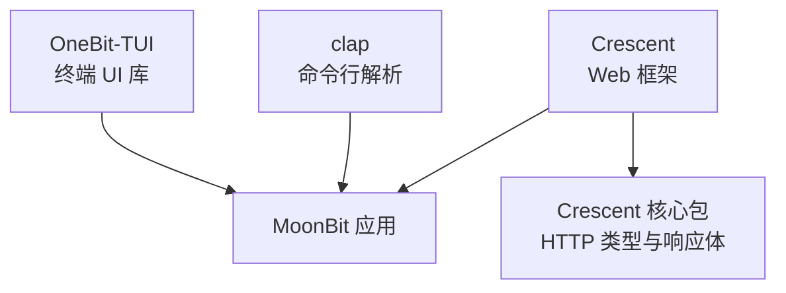
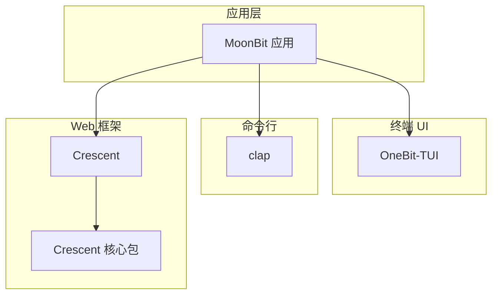
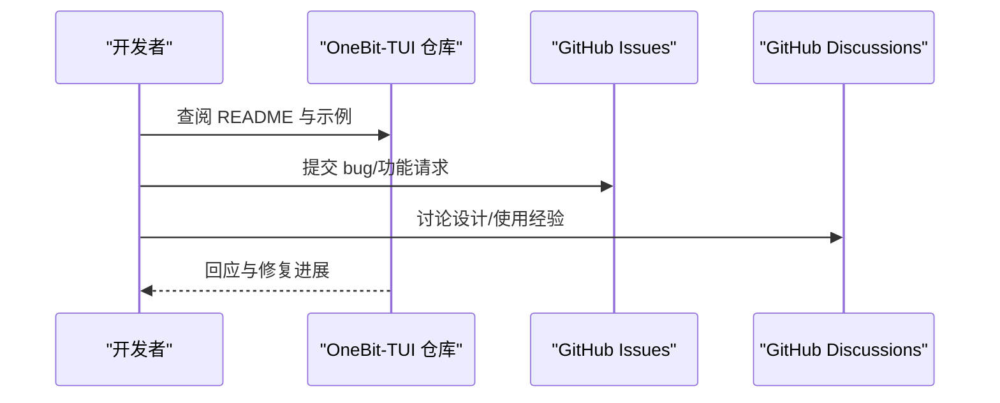
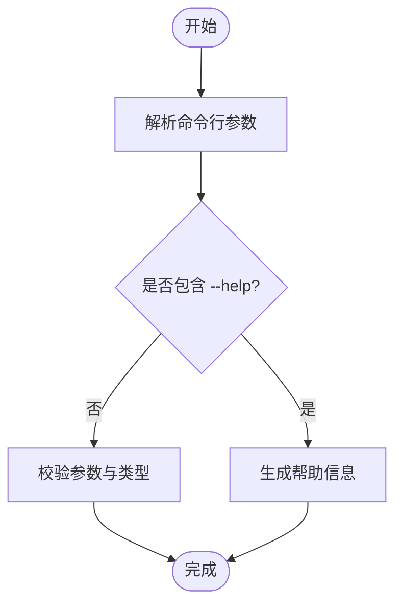
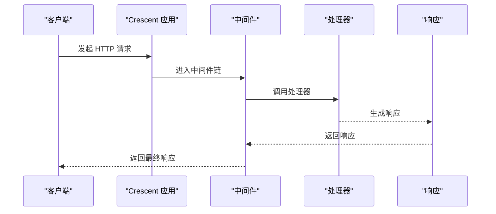
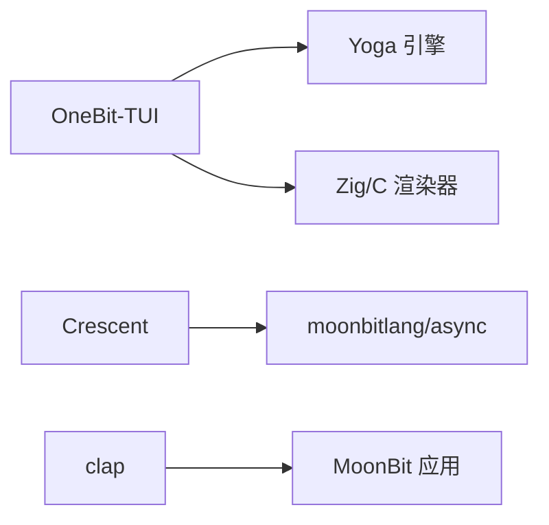
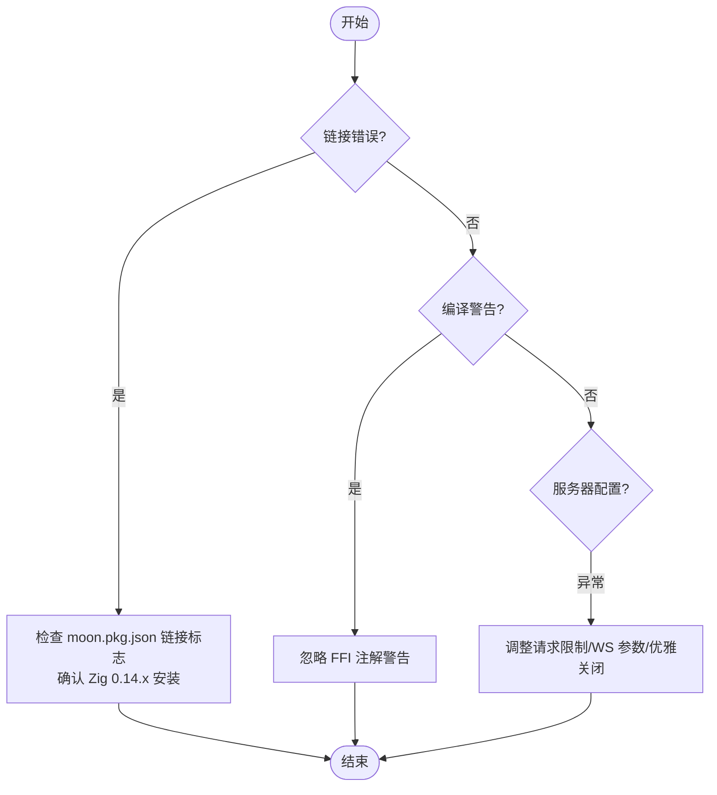

# 社区支持

<cite>
**本文引用的文件**
- [README.md（OneBit-TUI）](file://.repos/Frank-III/onebit-tui/0.1.3/README.md)
- [README.md（clap）](file://.repos/TheWaWaR/clap/0.2.6/README.md)
- [README.md（Crescent）](file://.repos/bobzhang/crescent/0.10.0/README.md)
- [README.md（Crescent 核心包）](file://.repos/bobzhang/crescent/0.10.0/core/README.md)
</cite>

## 目录
1. [简介](#简介)
2. [项目结构](#项目结构)
3. [核心组件](#核心组件)
4. [架构总览](#架构总览)
5. [详细组件分析](#详细组件分析)
6. [依赖关系分析](#依赖关系分析)
7. [性能与可用性考量](#性能与可用性考量)
8. [故障排查指南](#故障排查指南)
9. [结论](#结论)
10. [附录：获取帮助与参与社区](#附录获取帮助与参与社区)

## 简介
本指南面向 MoonBit 新手与贡献者，聚焦于如何高效获取 MoonBit 社区支持与资源，涵盖官方文档、社区论坛、GitHub Issues、Discord 等渠道的使用方法；如何有效提问与报告问题；参与社区的方式与贡献路径；学习资源与参考资料推荐；以及社区活动与开发者交流机会。同时提供新用户的入门指导与最佳实践建议。

## 项目结构
当前仓库包含 MoonBit 生态中若干活跃的第三方包与示例，它们共同构成了 MoonBit 社区的知识与工具基础：
- OneBit-TUI：终端用户界面库，提供声明式组件、Yoga 布局与高性能原生渲染能力。
- clap：命令行参数解析器，支持多级子命令、类型化参数与帮助输出。
- Crescent：Web 框架，强调原生优先、类型安全与 AI 友好，提供路由、中间件、静态资源、WebSocket、HTTP 客户端等能力。

**图表来源**
- [.repos/Frank-III/onebit-tui/0.1.3/README.md:1-414](file://.repos/Frank-III/onebit-tui/0.1.3/README.md#L1-L414)
- [.repos/TheWaWaR/clap/0.2.6/README.md:1-50](file://.repos/TheWaWaR/clap/0.2.6/README.md#L1-L50)
- [.repos/bobzhang/crescent/0.10.0/README.md:1-914](file://.repos/bobzhang/crescent/0.10.0/README.md#L1-L914)
- [.repos/bobzhang/crescent/0.10.0/core/README.md:1-450](file://.repos/bobzhang/crescent/0.10.0/core/README.md#L1-L450)

**章节来源**
- [.repos/Frank-III/onebit-tui/0.1.3/README.md:1-414](file://.repos/Frank-III/onebit-tui/0.1.3/README.md#L1-L414)
- [.repos/TheWaWaR/clap/0.2.6/README.md:1-50](file://.repos/TheWaWaR/clap/0.2.6/README.md#L1-L50)
- [.repos/bobzhang/crescent/0.10.0/README.md:1-914](file://.repos/bobzhang/crescent/0.10.0/README.md#L1-L914)
- [.repos/bobzhang/crescent/0.10.0/core/README.md:1-450](file://.repos/bobzhang/crescent/0.10.0/core/README.md#L1-L450)

## 核心组件
- OneBit-TUI：提供声明式视图、Yoga 弹性布局、事件循环与焦点管理，适合构建高性能终端应用。
- clap：提供灵活的命令行参数解析，支持多级子命令、默认值、环境变量注入与帮助输出。
- Crescent：提供 Web 服务端能力，包括路由、中间件、静态资源、WebSocket、HTTP 客户端与错误处理等。

这些组件在社区中被广泛使用，是获取帮助与参与讨论的重要话题载体。

**章节来源**
- [.repos/Frank-III/onebit-tui/0.1.3/README.md:1-414](file://.repos/Frank-III/onebit-tui/0.1.3/README.md#L1-L414)
- [.repos/TheWaWaR/clap/0.2.6/README.md:1-50](file://.repos/TheWaWaR/clap/0.2.6/README.md#L1-L50)
- [.repos/bobzhang/crescent/0.10.0/README.md:1-914](file://.repos/bobzhang/crescent/0.10.0/README.md#L1-L914)

## 架构总览
下图展示了 MoonBit 应用与生态组件之间的关系：应用层通过 OneBit-TUI 构建终端 UI，通过 clap 解析命令行参数，通过 Crescent 提供 Web 服务与中间件能力。

**图表来源**
- [.repos/Frank-III/onebit-tui/0.1.3/README.md:1-414](file://.repos/Frank-III/onebit-tui/0.1.3/README.md#L1-L414)
- [.repos/TheWaWaR/clap/0.2.6/README.md:1-50](file://.repos/TheWaWaR/clap/0.2.6/README.md#L1-L50)
- [.repos/bobzhang/crescent/0.10.0/README.md:1-914](file://.repos/bobzhang/crescent/0.10.0/README.md#L1-L914)
- [.repos/bobzhang/crescent/0.10.0/core/README.md:1-450](file://.repos/bobzhang/crescent/0.10.0/core/README.md#L1-L450)

## 详细组件分析

### OneBit-TUI 组件分析
- 功能要点：声明式 UI、Yoga 弹性布局、事件循环与焦点管理、跨平台原生渲染。
- 使用场景：终端应用、工具类 UI、TUI 游戏或交互式工具。
- 获取帮助与支持：通过 GitHub Issues 与 Discussions 提交问题与交流。

**图表来源**
- [.repos/Frank-III/onebit-tui/0.1.3/README.md:395-400](file://.repos/Frank-III/onebit-tui/0.1.3/README.md#L395-L400)

**章节来源**
- [.repos/Frank-III/onebit-tui/0.1.3/README.md:1-414](file://.repos/Frank-III/onebit-tui/0.1.3/README.md#L1-L414)

### clap 组件分析
- 功能要点：支持标志位/命名/位置参数、子命令、自定义值类型、帮助输出生成。
- 使用场景：CLI 工具开发、脚手架与自动化工具。
- 获取帮助与支持：通过 Issues 与 Discussions 提交问题与寻求帮助。

**图表来源**
- [.repos/TheWaWaR/clap/0.2.6/README.md:15-50](file://.repos/TheWaWaR/clap/0.2.6/README.md#L15-L50)

**章节来源**
- [.repos/TheWaWaR/clap/0.2.6/README.md:1-50](file://.repos/TheWaWaR/clap/0.2.6/README.md#L1-L50)

### Crescent 组件分析
- 功能要点：路由、中间件、静态资源、WebSocket、HTTP 客户端、错误处理与响应助手。
- 使用场景：后端服务、API 网关、实时通信与静态资源托管。
- 获取帮助与支持：通过 Issues 与 Discussions 提交问题与寻求帮助。

**图表来源**
- [.repos/bobzhang/crescent/0.10.0/README.md:140-177](file://.repos/bobzhang/crescent/0.10.0/README.md#L140-L177)

**章节来源**
- [.repos/bobzhang/crescent/0.10.0/README.md:1-914](file://.repos/bobzhang/crescent/0.10.0/README.md#L1-L914)
- [.repos/bobzhang/crescent/0.10.0/core/README.md:1-450](file://.repos/bobzhang/crescent/0.10.0/core/README.md#L1-L450)

## 依赖关系分析
- OneBit-TUI 依赖 Yoga 布局引擎与 Zig/C 渲染器，适用于 macOS/Linux 平台，Windows 支持为实验性。
- Crescent 依赖 moonbitlang/async 的 HTTP/WebSocket 实现，目标为原生平台。
- clap 作为独立库，可直接集成到 MoonBit 应用中。

**图表来源**
- [.repos/Frank-III/onebit-tui/0.1.3/README.md:312-318](file://.repos/Frank-III/onebit-tui/0.1.3/README.md#L312-L318)
- [.repos/bobzhang/crescent/0.10.0/README.md:8-12](file://.repos/bobzhang/crescent/0.10.0/README.md#L8-L12)
- [.repos/TheWaWaR/clap/0.2.6/README.md:1-14](file://.repos/TheWaWaR/clap/0.2.6/README.md#L1-L14)

**章节来源**
- [.repos/Frank-III/onebit-tui/0.1.3/README.md:312-318](file://.repos/Frank-III/onebit-tui/0.1.3/README.md#L312-L318)
- [.repos/bobzhang/crescent/0.10.0/README.md:8-12](file://.repos/bobzhang/crescent/0.10.0/README.md#L8-L12)
- [.repos/TheWaWaR/clap/0.2.6/README.md:1-14](file://.repos/TheWaWaR/clap/0.2.6/README.md#L1-L14)

## 性能与可用性考量
- OneBit-TUI：跨平台支持以 macOS/Linux 为主，Windows 需要 WSL；构建时依赖 Zig 0.14.x，避免与更高版本的不兼容。
- Crescent：原生目标，具备高性能网络与异步能力；支持请求限制、WebSocket 配置与优雅关闭。
- clap：解析效率高，支持无限层级子命令，适合复杂 CLI 场景。

**章节来源**
- [.repos/Frank-III/onebit-tui/0.1.3/README.md:312-318](file://.repos/Frank-III/onebit-tui/0.1.3/README.md#L312-L318)
- [.repos/bobzhang/crescent/0.10.0/README.md:588-627](file://.repos/bobzhang/crescent/0.10.0/README.md#L588-L627)
- [.repos/TheWaWaR/clap/0.2.6/README.md:1-14](file://.repos/TheWaWaR/clap/0.2.6/README.md#L1-L14)

## 故障排查指南
- OneBit-TUI 构建警告：编译期间可能出现约百条 FFI 注解相关警告，不影响功能，可忽略。
- OneBit-TUI 链接错误：确保 moon.pkg.json 中的链接标志正确设置，Zig 版本为 0.14.x，且依赖库存在。
- Crescent 服务器配置：根据需要调整连接数、请求体大小、读取超时、WebSocket 消息大小与队列容量等参数。
- clap 参数解析：注意命名参数长度填满即结束当前参数，合理组织参数顺序与分组。

**图表来源**
- [.repos/Frank-III/onebit-tui/0.1.3/README.md:351-383](file://.repos/Frank-III/onebit-tui/0.1.3/README.md#L351-L383)
- [.repos/bobzhang/crescent/0.10.0/README.md:588-627](file://.repos/bobzhang/crescent/0.10.0/README.md#L588-L627)

**章节来源**
- [.repos/Frank-III/onebit-tui/0.1.3/README.md:351-383](file://.repos/Frank-III/onebit-tui/0.1.3/README.md#L351-L383)
- [.repos/bobzhang/crescent/0.10.0/README.md:588-627](file://.repos/bobzhang/crescent/0.10.0/README.md#L588-L627)

## 结论
MoonBit 社区围绕 OneBit-TUI、clap、Crescent 等核心组件形成了丰富的生态与实践案例。通过官方文档、GitHub Issues 与 Discussions、社区论坛与 Discord 等渠道，用户可以高效获取帮助、参与讨论并贡献代码。建议新用户从官方文档入手，结合示例与测试用例快速上手，并遵循最佳实践进行提问与报告问题。

## 附录：获取帮助与参与社区
- 官方文档与示例
  - OneBit-TUI：参考其 README 中的“快速开始”、“示例”与“架构”部分。
  - clap：参考其 README 中的“用法”与“示例”。
  - Crescent：参考其 README 中的“安装”、“Hello World”、“中间件”、“静态资源”、“WebSocket”等章节。
  - Crescent 核心包：参考其 README 中的“HTTP 请求/响应类型”、“响应体与错误处理”等章节。
- 社区与支持渠道
  - GitHub Issues：用于提交 bug 报告与功能请求。
  - GitHub Discussions：用于设计讨论、使用经验分享与技术咨询。
  - 包索引站点：可通过包索引站点查阅与下载 MoonBit 包。
- 如何有效提问与报告问题
  - 描述清晰的问题背景与复现步骤，附上最小可复现实例与运行环境信息。
  - 在 Issues 中选择合适的标签与模板，便于维护者快速定位与处理。
  - 在 Discussions 中先检索已有主题，避免重复提问。
- 参与社区与贡献
  - 从修复小 bug、改进文档与示例入手，逐步深入核心功能。
  - 关注各项目的“贡献”章节，了解开发流程与规范。
- 学习资源与参考资料
  - 各组件的 README 与示例是最佳起点。
  - 结合测试用例理解 API 行为与边界条件。
- 社区活动与开发者交流
  - 关注各项目在 GitHub 上的 Releases、里程碑与讨论区动态。
  - 参与开源协作，积极回复他人问题，分享使用经验与最佳实践。

**章节来源**
- [.repos/Frank-III/onebit-tui/0.1.3/README.md:395-400](file://.repos/Frank-III/onebit-tui/0.1.3/README.md#L395-L400)
- [.repos/TheWaWaR/clap/0.2.6/README.md:15-50](file://.repos/TheWaWaR/clap/0.2.6/README.md#L15-L50)
- [.repos/bobzhang/crescent/0.10.0/README.md:14-34](file://.repos/bobzhang/crescent/0.10.0/README.md#L14-L34)
- [.repos/bobzhang/crescent/0.10.0/core/README.md:17-32](file://.repos/bobzhang/crescent/0.10.0/core/README.md#L17-L32)