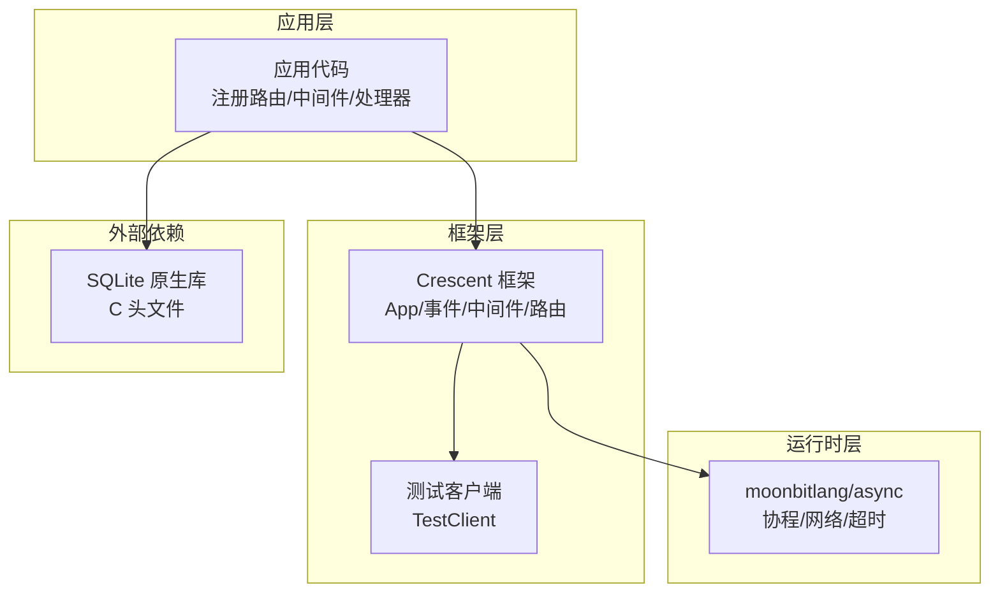
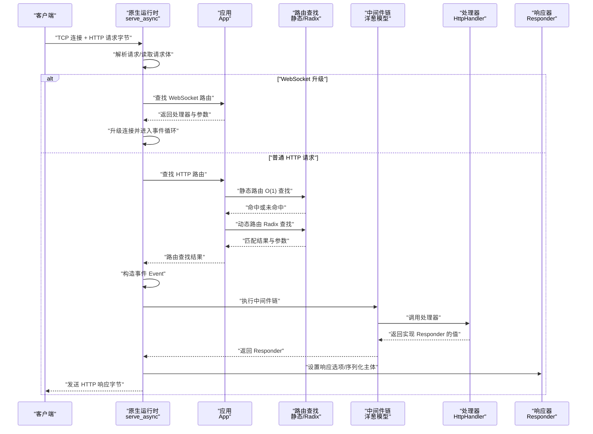
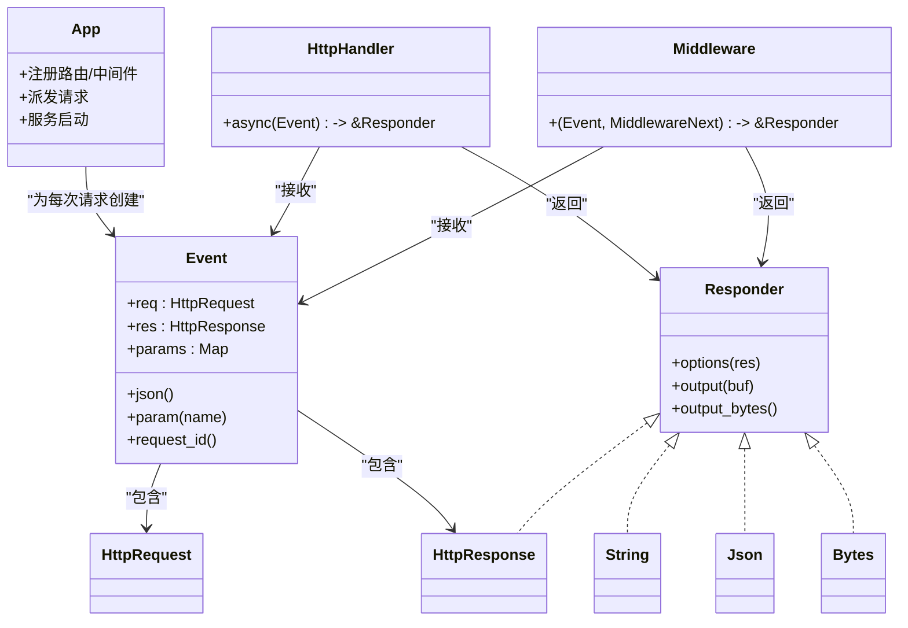
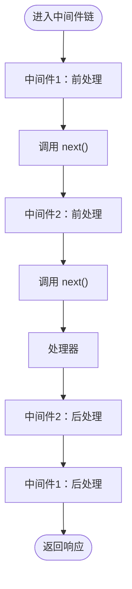
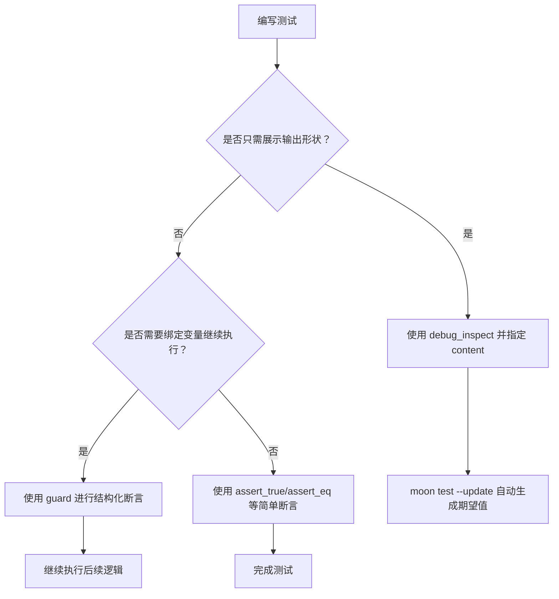
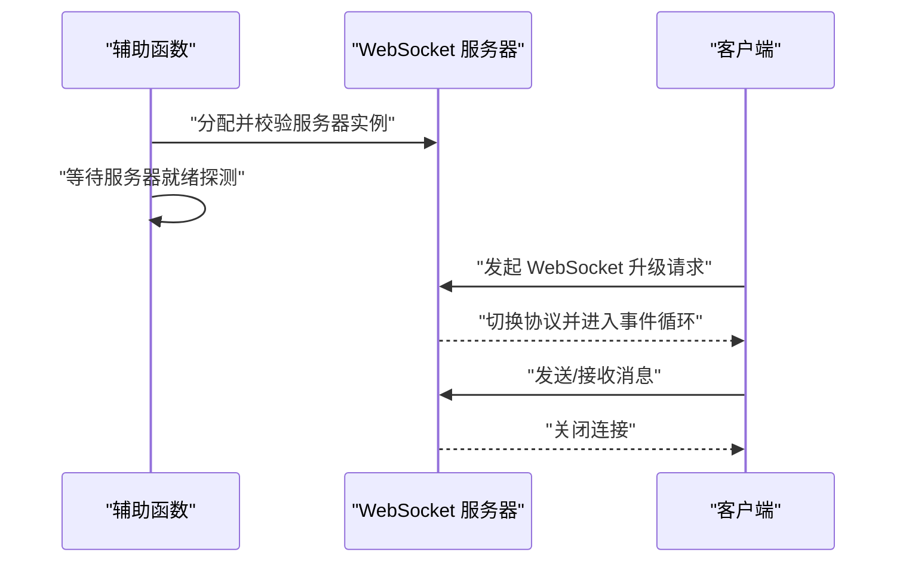
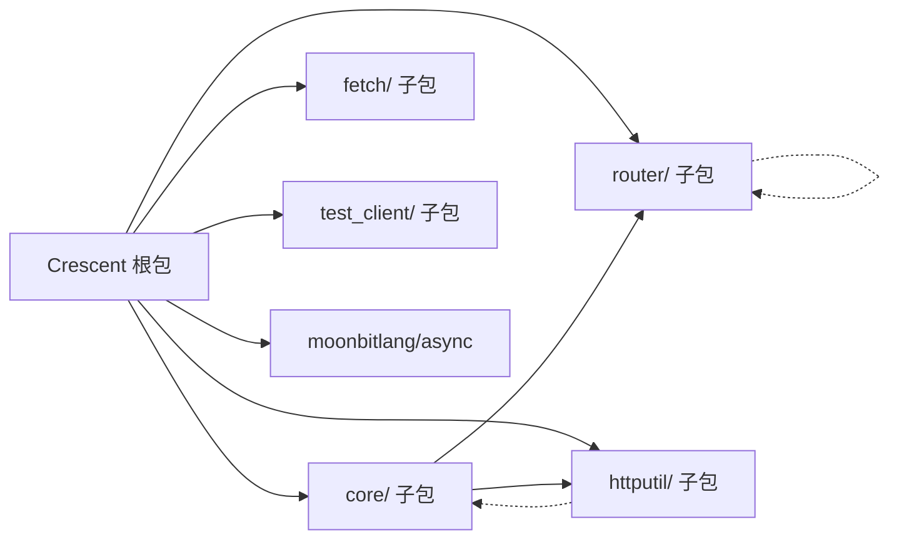

# 调试技巧

<cite>
**本文引用的文件**
- [README.md](file://README.md)
- [ARCHITECTURE.md](file://ARCHITECTURE.md)
- [TESTING.md](file://TESTING.md)
- [websocket_async_native_wbtest.mbt](file://websocket_async_native_wbtest.mbt)
- [deprecated.mbt](file://src/deprecated.mbt)
- [deprecated.mbt](file://src/internal/coroutine/deprecated.mbt)
- [deprecated.mbt](file://examples/udp_ping_pong/deprecated.mbt)
- [sqlite3.h](file://native/sqlite3.h)
</cite>

## 目录
1. [简介](#简介)
2. [项目结构](#项目结构)
3. [核心组件](#核心组件)
4. [架构总览](#架构总览)
5. [详细组件分析](#详细组件分析)
6. [依赖分析](#依赖分析)
7. [性能考虑](#性能考虑)
8. [故障排查指南](#故障排查指南)
9. [结论](#结论)
10. [附录](#附录)

## 简介
本指南面向 MoonBit 开发者，系统讲解在 MoonBit 语言与 Crescent 框架中进行调试的方法与工具，涵盖断点设置、变量检查、调用栈跟踪、日志记录、单元与集成测试调试策略，以及对实验性库与第三方库的调试技巧。文档同时给出常见问题的解决思路与调试思维模式，帮助你快速定位问题并高效修复。

## 项目结构
该仓库包含多个 MoonBit 语言的子模块与示例，其中与调试密切相关的部分包括：
- Crescent 框架：提供 HTTP/WebSocket 服务、路由、中间件、响应序列化、测试客户端等能力，是调试 HTTP 请求处理链路的核心对象。
- 异步运行时（moonbitlang/async）：提供协程、网络 I/O、超时控制等基础能力，调试异步逻辑时需关注其行为。
- 示例与测试：包含白盒测试（_wbtest.mbt）、快照测试（inspect/debug_inspect）、内联测试等，是验证与调试业务逻辑的重要手段。
- 第三方库头文件：如 SQLite 的 C 头文件，用于在 MoonBit 中通过 FFI 使用原生库时的调试参考。

图示来源
- [ARCHITECTURE.md](file://ARCHITECTURE.md)
- [README.md](file://README.md)

章节来源
- [ARCHITECTURE.md](file://ARCHITECTURE.md)
- [README.md](file://README.md)

## 核心组件
- 应用容器 App：负责路由注册、中间件编排、请求派发与错误映射。
- 事件 Event：封装 HttpRequest/HttpResponse 与参数提取，是调试时检查输入输出的关键对象。
- 中间件 Middleware：洋葱模型执行链，适合插入日志、计时、鉴权等横切关注点，便于分段定位问题。
- 测试客户端 TestClient：在无网络 I/O 的情况下直接触发 App 的调度流程，适合快速验证路由、中间件与处理器的行为。
- 运行时 async：提供协程与网络 I/O，调试异步逻辑时需关注超时、并发与资源释放。

章节来源
- [ARCHITECTURE.md](file://ARCHITECTURE.md)
- [README.md](file://README.md)

## 架构总览
下图展示了从客户端到服务器再到响应写出的完整请求生命周期，有助于在调试时定位问题发生在哪个阶段。

图示来源
- [ARCHITECTURE.md](file://ARCHITECTURE.md)

## 详细组件分析

### 组件一：App 与事件 Event 的调试要点
- 断点设置建议：在 App 的路由注册处、中间件入口与处理器函数内部设置断点；在事件 Event 上检查请求路径、查询参数、头部、JSON 载荷与已解析的参数。
- 变量检查：利用事件提供的参数提取与 JSON 解析辅助函数，确认输入是否符合预期；若出现类型不匹配或解析失败，优先检查上游数据源与中间件对请求的修改。
- 调用栈跟踪：通过中间件的“前/后”两段逻辑，结合计时与日志，逐步缩小问题范围；必要时在处理器末尾输出响应摘要以验证序列化过程。

图示来源
- [ARCHITECTURE.md](file://ARCHITECTURE.md)

章节来源
- [ARCHITECTURE.md](file://ARCHITECTURE.md)

### 组件二：中间件链的调试策略
- 调试思维：采用“洋葱模型”逐层验证，先检查外层中间件（如安全头、请求 ID、计时），再深入到业务中间件（鉴权、限流）。
- 实践技巧：在中间件中打印请求/响应摘要、耗时统计与关键上下文（如请求 ID），以便串联分布式追踪。
- 快速定位：若某一层导致后续处理器无法执行，通常表现为响应未按预期生成或状态码异常。

图示来源
- [ARCHITECTURE.md](file://ARCHITECTURE.md)

章节来源
- [ARCHITECTURE.md](file://ARCHITECTURE.md)

### 组件三：测试与快照调试（debug_inspect/guard）
- 快照测试：使用 debug_inspect 对复杂结构进行快照比对，借助 moon test --update 自动生成期望值，减少手写断言的维护成本。
- 结构化断言：当需要进一步操作解构出的值时，使用 guard 进行模式匹配，避免冗长的 match/fail 嵌套。
- 测试分布：黑盒测试优先，白盒测试仅在难以通过公共 API 验证的内部细节（如 WebSocket 内核）使用。

图示来源
- [TESTING.md](file://TESTING.md)

章节来源
- [TESTING.md](file://TESTING.md)
- [ARCHITECTURE.md](file://ARCHITECTURE.md)

### 组件四：WebSocket 生命周期调试
- 白盒测试：通过专用的白盒测试文件与辅助函数，验证 WebSocket 生命周期、消息队列丢弃策略与 Hub 原语。
- 调试步骤：先确保服务器就绪与端口可用，再通过 HTTP 探测端点确认 WebSocket 就绪，最后建立连接并观察事件流转。

图示来源
- [websocket_async_native_wbtest.mbt](file://websocket_async_native_wbtest.mbt)

章节来源
- [websocket_async_native_wbtest.mbt](file://websocket_async_native_wbtest.mbt)

### 组件五：异步运行时与超时调试
- 关注点：协程调度、网络 I/O 超时、请求体读取限制与重试机制。调试时可结合计时与日志，定位阻塞点或超时原因。
- 兼容性提示：运行时中存在被标记为过时的 Show 实现，建议改用 Debug 相关 API 或 @debug.to_string 进行字符串化输出，避免潜在兼容性问题。

章节来源
- [deprecated.mbt](file://src/deprecated.mbt)
- [deprecated.mbt](file://src/internal/coroutine/deprecated.mbt)
- [deprecated.mbt](file://examples/udp_ping_pong/deprecated.mbt)

### 组件六：第三方库（以 SQLite 为例）的调试
- FFI 调试：通过查看原生头文件中的日志接口与错误码，理解底层库的错误传播路径，并在 MoonBit 层面进行适配与包装。
- 最佳实践：对外暴露稳定的错误类型与错误消息，避免直接透传底层错误码；在边界处增加日志与断言，便于定位问题。

章节来源
- [sqlite3.h](file://native/sqlite3.h)

## 依赖分析
- Crescent 与 moonbitlang/async：Crescent 的原生服务器运行时依赖 async 提供的网络与协程能力；调试时需关注两者交互。
- 子包解耦：核心类型与 HTTP 工具拆分为独立子包，降低耦合度，便于单独测试与调试。
- 外部依赖：版本固定于 moon.mod.json 中的依赖清单，升级时需评估对调试流程的影响。

图示来源
- [ARCHITECTURE.md](file://ARCHITECTURE.md)

章节来源
- [ARCHITECTURE.md](file://ARCHITECTURE.md)

## 性能考虑
- 路由查找优化：静态路由 O(1)，动态路由基于 Radix 树 O(路径长度)；在高频路径上优先使用静态路由，减少参数捕获。
- 中间件顺序：外层中间件负责通用横切逻辑，内层靠近处理器；避免在中间件中做昂贵计算或阻塞 I/O。
- 日志开销：在生产环境降低日志级别，仅在调试阶段开启详细日志；注意日志格式与编码开销。

## 故障排查指南
- 常见问题与定位
  - 路由不匹配：检查路由模式、参数命名与通配符使用；优先使用静态路由覆盖高频路径。
  - 参数解析失败：确认请求体类型、Content-Type 与参数名；使用 require_param_* 系列函数进行显式校验。
  - 中间件未生效：确认中间件注册顺序与 base_path 匹配；检查是否被后续中间件覆盖。
  - WebSocket 无法升级：检查服务器就绪探测与端口占用；确认客户端握手请求头正确。
  - 第三方库错误：通过日志接口与错误码定位底层问题，向上转换为统一错误类型。
- 调试工具与技巧
  - 使用 TestClient 直接触发 App 的调度流程，快速验证路由、中间件与处理器。
  - 在中间件中插入计时与日志，配合请求 ID 进行跨服务追踪。
  - 利用快照测试与结构化断言，减少手工断言维护成本并提升回归稳定性。

章节来源
- [TESTING.md](file://TESTING.md)
- [ARCHITECTURE.md](file://ARCHITECTURE.md)
- [websocket_async_native_wbtest.mbt](file://websocket_async_native_wbtest.mbt)

## 结论
MoonBit 的调试体系围绕“请求生命周期 + 中间件链 + 测试客户端”的闭环展开。通过合理设置断点、利用快照与结构化断言、结合计时与日志，可以高效定位问题并修复。对于第三方库与实验性特性，建议通过 FFI 包装与统一错误抽象，增强可观测性与可维护性。

## 附录
- 调试思维模式
  - 自顶向下：先看整体流程（路由查找 → 中间件链 → 处理器），再深入具体环节。
  - 分而治之：将复杂请求拆分为静态/动态路由、参数、中间件与处理器四个层面逐一验证。
  - 可观测性优先：在关键节点输出上下文信息（请求 ID、路径、参数、耗时），便于复盘与自动化告警。
- 常见场景
  - 输入校验失败：优先检查参数提取与 JSON 解析，必要时使用 require_param_*。
  - 中间件异常：在中间件前后分别输出日志，确认是否提前返回或阻塞。
  - WebSocket 事件异常：通过白盒测试辅助函数验证生命周期与消息队列策略。
  - 第三方库调用：通过日志接口与错误码映射，向上暴露稳定错误类型。