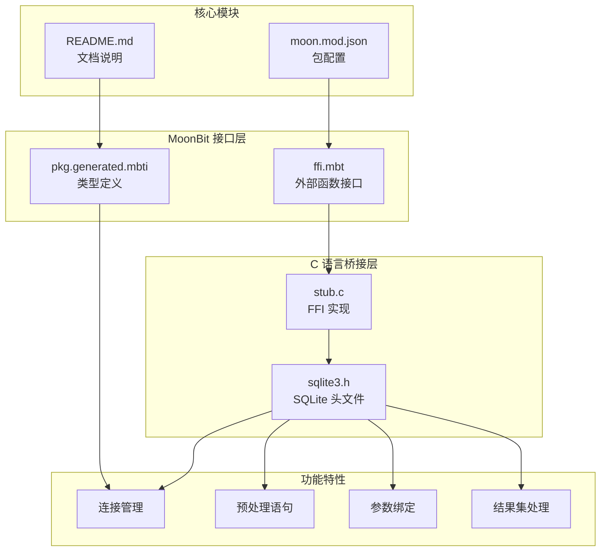
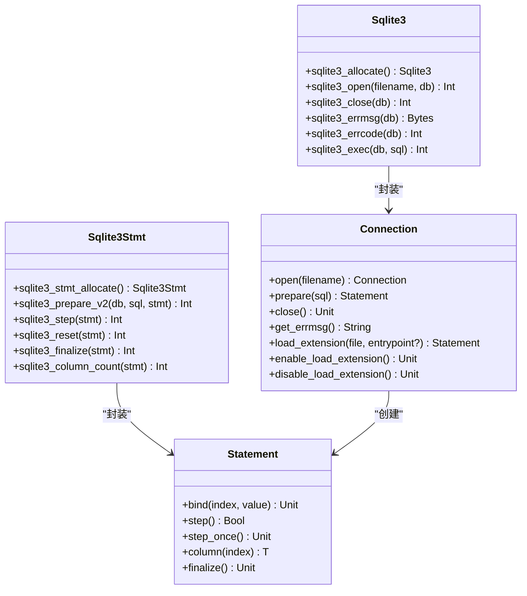
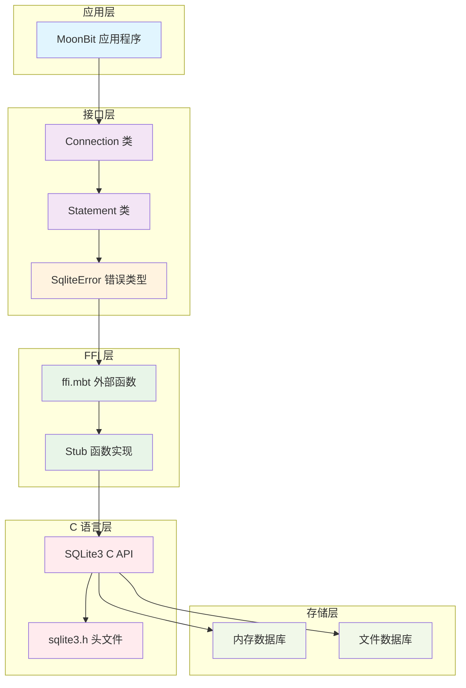
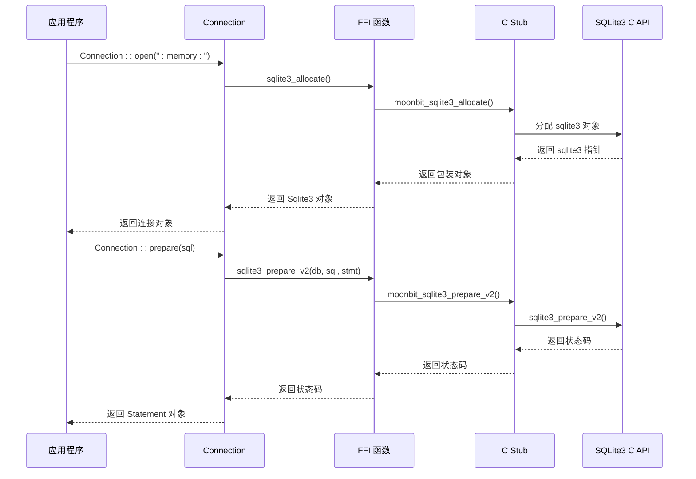
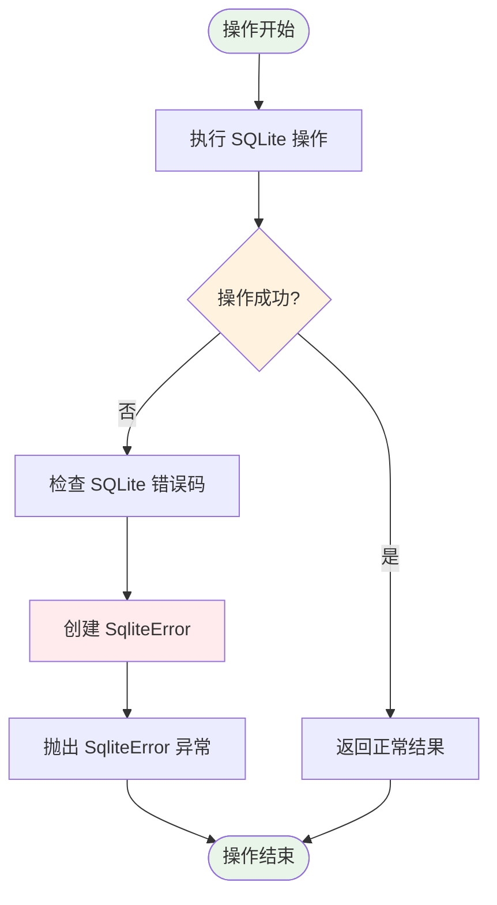
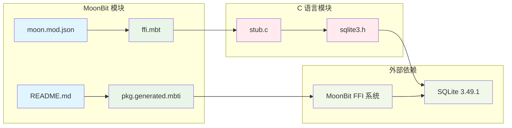
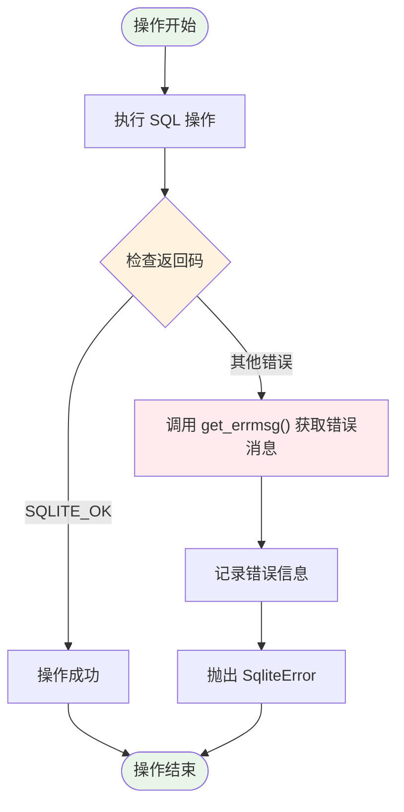

# SQLite3 库概述

<cite>
**本文档引用的文件**
- [moon.mod.json](file://.repos/colmugx/sqlite3/0.2.0/moon.mod.json)
- [README.md](file://.repos/colmugx/sqlite3/0.2.0/README.md)
- [ffi.mbt](file://.repos/colmugx/sqlite3/0.2.0/native/ffi.mbt)
- [stub.c](file://.repos/colmugx/sqlite3/0.2.0/native/stub.c)
- [pkg.generated.mbti](file://.repos/colmugx/sqlite3/0.2.0/pkg.generated.mbti)
- [sqlite3.h](file://.repos/colmugx/sqlite3/0.2.0/native/sqlite3.h)
</cite>

## 目录
1. [简介](#简介)
2. [项目结构](#项目结构)
3. [核心组件](#核心组件)
4. [架构概览](#架构概览)
5. [详细组件分析](#详细组件分析)
6. [依赖关系分析](#依赖关系分析)
7. [性能考虑](#性能考虑)
8. [故障排除指南](#故障排除指南)
9. [结论](#结论)
10. [附录](#附录)

## 简介

colmugx/sqlite3 是一个为 MoonBit 语言设计的轻量级、低级别的 SQLite3 绑定库。该库提供了对 SQLite3 C API 的薄封装接口，使开发者能够直接访问 SQLite 的核心功能，而无需使用复杂的 ORM 或完整的查询框架。该库当前支持 MoonBit 的 `native` 目标，并直接在仓库中打包了 SQLite 合并源代码。

**版本信息**: 0.2.0
**SQLite 版本**: 3.49.1
**目标平台**: 仅支持 native 目标

## 项目结构

该库采用模块化设计，主要包含以下组件：



**图表来源**
- [moon.mod.json:1-11](file://.repos/colmugx/sqlite3/0.2.0/moon.mod.json#L1-L11)
- [ffi.mbt:1-150](file://.repos/colmugx/sqlite3/0.2.0/native/ffi.mbt#L1-L150)
- [stub.c:1-125](file://.repos/colmugx/sqlite3/0.2.0/native/stub.c#L1-L125)

**章节来源**
- [moon.mod.json:1-11](file://.repos/colmugx/sqlite3/0.2.0/moon.mod.json#L1-L11)
- [README.md:1-237](file://.repos/colmugx/sqlite3/0.2.0/README.md#L1-L237)

## 核心组件

### 连接管理组件

库提供了两个核心类型：`Sqlite3` 和 `Sqlite3Stmt`，分别代表数据库连接和预处理语句。



**图表来源**
- [ffi.mbt:1-150](file://.repos/colmugx/sqlite3/0.2.0/native/ffi.mbt#L1-L150)
- [pkg.generated.mbti:88-135](file://.repos/colmugx/sqlite3/0.2.0/pkg.generated.mbti#L88-L135)

### 参数绑定和列读取

库支持多种数据类型的绑定和读取：

| MoonBit 类型 | 绑定到 SQLite | 从 SQLite 读取 |
|-------------|---------------|----------------|
| `Int` | `INTEGER` | `Int` |
| `Int64` | `INTEGER` | `Int64` |
| `Double` | `REAL` | `Double` |
| `String` | `TEXT` | `String` |
| `Bytes` | `BLOB` | `Bytes` |

**章节来源**
- [pkg.generated.mbti:121-134](file://.repos/colmugx/sqlite3/0.2.0/pkg.generated.mbti#L121-L134)
- [README.md:189-200](file://.repos/colmugx/sqlite3/0.2.0/README.md#L189-L200)

## 架构概览

该库采用三层架构设计：



**图表来源**
- [ffi.mbt:1-150](file://.repos/colmugx/sqlite3/0.2.0/native/ffi.mbt#L1-L150)
- [stub.c:1-125](file://.repos/colmugx/sqlite3/0.2.0/native/stub.c#L1-L125)
- [pkg.generated.mbti:88-135](file://.repos/colmugx/sqlite3/0.2.0/pkg.generated.mbti#L88-L135)

## 详细组件分析

### FFI 函数映射

库将 SQLite3 C API 映射到 MoonBit 外部函数：



**图表来源**
- [ffi.mbt:8-39](file://.repos/colmugx/sqlite3/0.2.0/native/ffi.mbt#L8-L39)
- [stub.c:21-125](file://.repos/colmugx/sqlite3/0.2.0/native/stub.c#L21-L125)

### 错误处理机制

库使用 MoonBit 的错误处理机制：



**图表来源**
- [pkg.generated.mbti:83-86](file://.repos/colmugx/sqlite3/0.2.0/pkg.generated.mbti#L83-L86)
- [README.md:148-171](file://.repos/colmugx/sqlite3/0.2.0/README.md#L148-L171)

**章节来源**
- [ffi.mbt:1-150](file://.repos/colmugx/sqlite3/0.2.0/native/ffi.mbt#L1-L150)
- [stub.c:1-125](file://.repos/colmugx/sqlite3/0.2.0/native/stub.c#L1-L125)
- [pkg.generated.mbti:83-135](file://.repos/colmugx/sqlite3/0.2.0/pkg.generated.mbti#L83-L135)

## 依赖关系分析

### 内部依赖关系



**图表来源**
- [moon.mod.json:1-11](file://.repos/colmugx/sqlite3/0.2.0/moon.mod.json#L1-L11)
- [ffi.mbt:1-150](file://.repos/colmugx/sqlite3/0.2.0/native/ffi.mbt#L1-L150)
- [stub.c:1-125](file://.repos/colmugx/sqlite3/0.2.0/native/stub.c#L1-L125)

### 外部接口依赖

库通过 MoonBit 的 FFI 系统与 SQLite C API 交互，所有外部调用都通过 stub.c 文件中的 C 函数实现。

**章节来源**
- [moon.mod.json:1-11](file://.repos/colmugx/sqlite3/0.2.0/moon.mod.json#L1-L11)
- [ffi.mbt:1-150](file://.repos/colmugx/sqlite3/0.2.0/native/ffi.mbt#L1-L150)

## 性能考虑

### 资源管理

该库采用手动资源管理模式，要求开发者显式管理连接和语句的生命周期：

- 每个 `Statement` 必须调用 `finalize()` 方法
- 每个 `Connection` 必须调用 `close()` 方法
- 预处理语句在执行后通常被视为一次性对象

### 内存管理

- 使用 MoonBit 的外部对象机制管理 SQLite 对象的生命周期
- C 代码负责释放底层 SQLite 资源
- 字符串处理采用 UTF-8 编码，字符串读取使用容错解码

### 并发性

- SQLite 支持多线程模式，但需要正确配置
- 库不提供内置的并发控制，需要应用程序自行管理

## 故障排除指南

### 常见错误类型

库导出了完整的 SQLite 错误码常量，包括：
- `SQLITE_OK` - 操作成功
- `SQLITE_ERROR` - 一般错误
- `SQLITE_BUSY` - 数据库忙
- `SQLITE_MISUSE` - API 使用错误
- `SQLITE_CONSTRAINT` - 约束违反
- `SQLITE_CANTOPEN` - 无法打开文件

### 错误诊断



**图表来源**
- [pkg.generated.mbti:10-78](file://.repos/colmugx/sqlite3/0.2.0/pkg.generated.mbti#L10-L78)
- [ffi.mbt:18-24](file://.repos/colmugx/sqlite3/0.2.0/native/ffi.mbt#L18-L24)

**章节来源**
- [README.md:148-171](file://.repos/colmugx/sqlite3/0.2.0/README.md#L148-L171)
- [pkg.generated.mbti:10-78](file://.repos/colmugx/sqlite3/0.2.0/pkg.generated.mbti#L10-L78)

## 结论

colmugx/sqlite3 库是一个精心设计的低级别数据库绑定库，具有以下特点：

### 设计优势

1. **薄封装设计** - 直接暴露 SQLite C API 的核心功能
2. **类型安全** - 提供 MoonBit 类型系统的强类型绑定
3. **资源控制** - 手动资源管理确保精确的内存控制
4. **错误处理** - 完整的错误码支持和诊断能力

### 适用场景

- 需要直接控制数据库操作的应用
- 对性能有严格要求的场景
- 需要 SQLite 特定功能的应用
- 不希望引入复杂 ORM 层的项目

### 选择建议

**选择该库当**：
- 需要 SQLite 的全部功能
- 要求最小的运行时开销
- 需要精确的资源控制
- 开发者熟悉 SQLite C API

**避免使用该库当**：
- 需要高级 ORM 功能
- 希望自动化的查询构建器
- 不愿意处理手动资源管理
- 需要复杂的事务管理

## 附录

### 安装和使用

```bash
# 添加依赖
moon add colmugx/sqlite3
```

### 快速开始示例

基本数据库操作流程：
1. `Connection::open` - 打开数据库连接
2. `Connection::prepare` - 创建预处理语句
3. 对于无结果的语句，调用 `Statement::step_once`
4. 对于查询，重复调用 `Statement::step()` 直到返回 `false`
5. 使用 `Statement::column(index=...)` 读取列值
6. 调用 `Statement::finalize()` 释放语句
7. 调用 `Connection::close()` 关闭连接

### API 参考

**Connection 类方法**：
- `open(filename)` - 打开数据库连接
- `prepare(sql)` - 创建预处理语句
- `close()` - 关闭数据库连接
- `get_errmsg()` - 获取最近的错误消息

**Statement 类方法**：
- `bind(index, value)` - 绑定参数
- `step()` - 执行一步操作
- `step_once()` - 执行一次且不产生行
- `column(index)` - 读取列值
- `finalize()` - 销毁预处理语句

**章节来源**
- [README.md:14-20](file://.repos/colmugx/sqlite3/0.2.0/README.md#L14-L20)
- [README.md:22-82](file://.repos/colmugx/sqlite3/0.2.0/README.md#L22-L82)
- [README.md:172-200](file://.repos/colmugx/sqlite3/0.2.0/README.md#L172-L200)