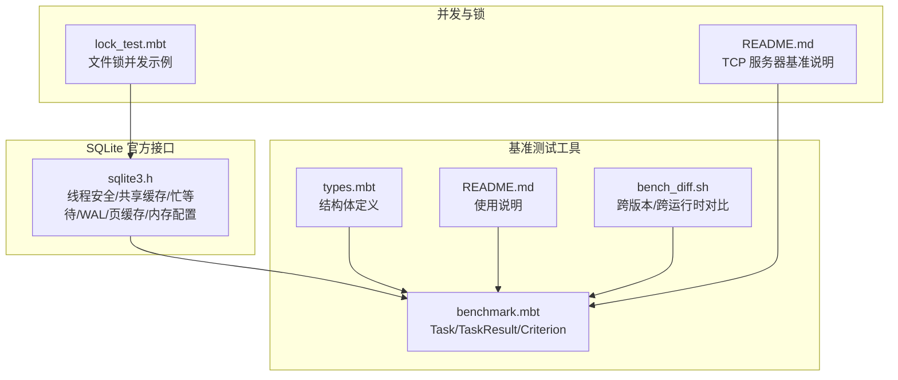
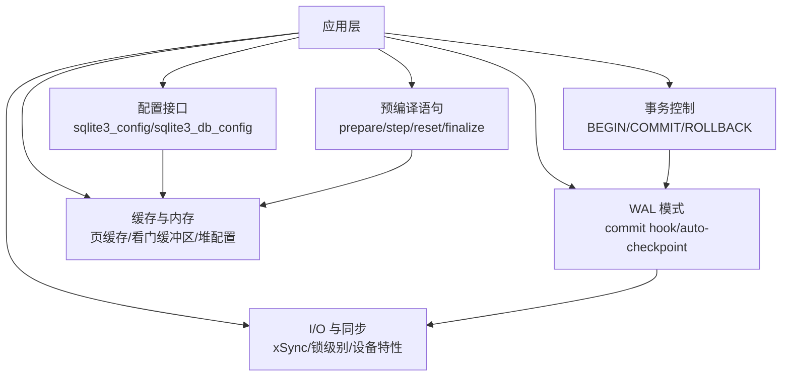
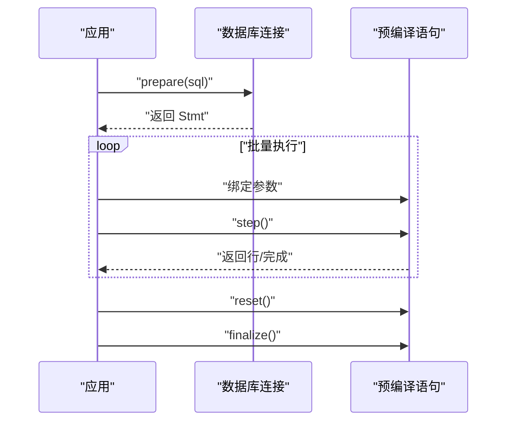
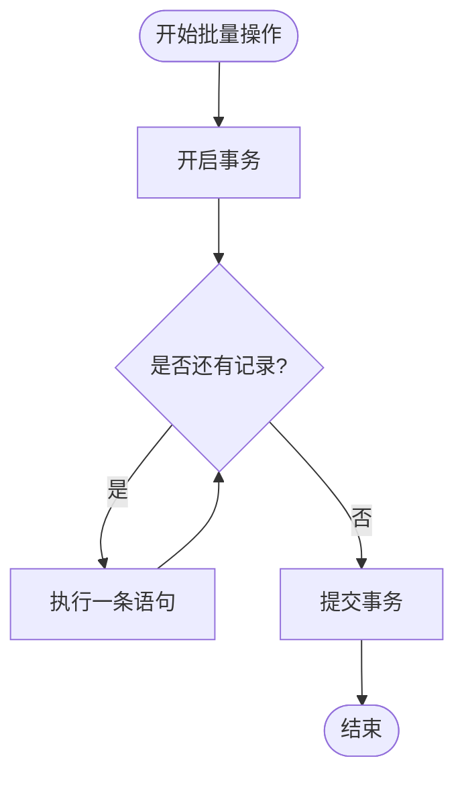
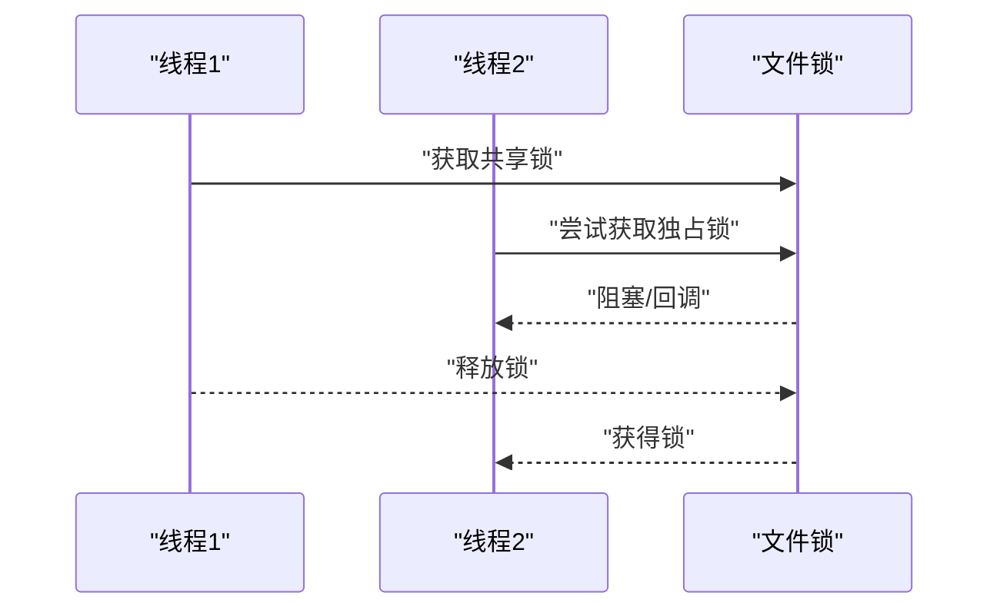
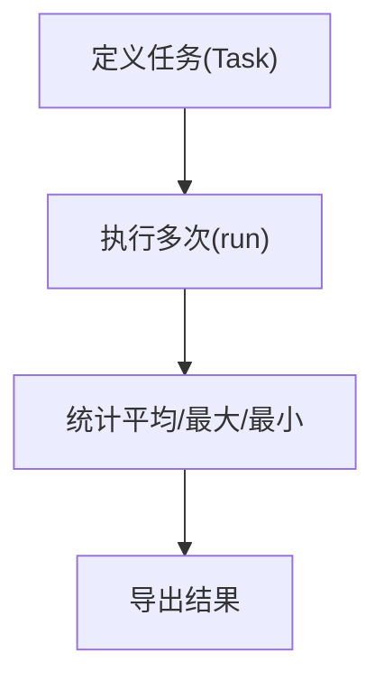
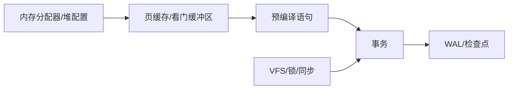

# 性能优化技巧

<cite>
**本文引用的文件**
- [sqlite3.h](file://.repos/colmugx/sqlite3/0.2.0/native/sqlite3.h)
- [benchmark.mbt](file://.repos/moonbitlang/x/0.4.43/benchmark/benchmark.mbt)
- [types.mbt](file://.repos/moonbitlang/x/0.4.43/benchmark/types.mbt)
- [README.md](file://.repos/moonbitlang/x/0.4.43/benchmark/README.md)
- [bench_diff.sh](file://.repos/moonbitlang/x/0.4.43/encoding/internal/benchmark/bench_diff.sh)
- [README.md](file://.repos/moonbitlang/async/0.19.1/examples/tcp_server_benchmark/README.md)
- [lock_test.mbt](file://.repos/moonbitlang/async/0.19.1/src/fs/lock_test.mbt)
</cite>

## 目录
1. [简介](#简介)
2. [项目结构](#项目结构)
3. [核心组件](#核心组件)
4. [架构总览](#架构总览)
5. [详细组件分析](#详细组件分析)
6. [依赖分析](#依赖分析)
7. [性能考量](#性能考量)
8. [故障排查指南](#故障排查指南)
9. [结论](#结论)
10. [附录](#附录)

## 简介
本文件围绕 SQLite3 的性能优化进行系统化整理，结合仓库中提供的官方头文件与 MoonBit 生态中的基准测试工具，给出可操作的优化策略与实践建议。内容涵盖：
- 预编译语句与缓存机制
- 批量操作与事务处理
- 索引与查询优化最佳实践
- 内存管理与资源释放
- 数据类型选择对性能的影响
- 实际性能测试与基准测试方法
- 并发访问与锁竞争优化
- SQLite 配置选项与调优参数
- 性能监控与分析工具使用

## 项目结构
本仓库包含以下与性能优化直接相关的材料：
- SQLite 官方 C API 头文件：提供线程安全、共享缓存、忙等待、WAL 检查点、页缓存、内存分配器等大量性能相关接口与常量定义
- MoonBit 基准测试包：提供任务驱动的统计型基准测试框架（平均/最大/最小耗时）
- 基准脚本：提供跨平台/跨运行时的对比基准执行与日志导出
- 文件锁测试：展示并发锁行为，有助于理解并发场景下的锁竞争与阻塞

**图表来源**
- [sqlite3.h:1663-2994](file://.repos/colmugx/sqlite3/0.2.0/native/sqlite3.h#L1663-L2994)
- [benchmark.mbt:15-41](file://.repos/moonbitlang/x/0.4.43/benchmark/benchmark.mbt#L15-L41)
- [types.mbt:15-36](file://.repos/moonbitlang/x/0.4.43/benchmark/types.mbt#L15-L36)
- [README.md:1-58](file://.repos/moonbitlang/x/0.4.43/benchmark/README.md#L1-L58)
- [bench_diff.sh:51-73](file://.repos/moonbitlang/x/0.4.43/encoding/internal/benchmark/bench_diff.sh#L51-L73)
- [lock_test.mbt:26-260](file://.repos/moonbitlang/async/0.19.1/src/fs/lock_test.mbt#L26-L260)
- [README.md:1-15](file://.repos/moonbitlang/async/0.19.1/examples/tcp_server_benchmark/README.md#L1-L15)

**章节来源**
- [sqlite3.h:1663-2994](file://.repos/colmugx/sqlite3/0.2.0/native/sqlite3.h#L1663-L2994)
- [benchmark.mbt:15-41](file://.repos/moonbitlang/x/0.4.43/benchmark/benchmark.mbt#L15-L41)
- [types.mbt:15-36](file://.repos/moonbitlang/x/0.4.43/benchmark/types.mbt#L15-L36)
- [README.md:1-58](file://.repos/moonbitlang/x/0.4.43/benchmark/README.md#L1-L58)
- [bench_diff.sh:51-73](file://.repos/moonbitlang/x/0.4.43/encoding/internal/benchmark/bench_diff.sh#L51-L73)
- [lock_test.mbt:26-260](file://.repos/moonbitlang/async/0.19.1/src/fs/lock_test.mbt#L26-L260)
- [README.md:1-15](file://.repos/moonbitlang/async/0.19.1/examples/tcp_server_benchmark/README.md#L1-L15)

## 核心组件
- 线程安全与并发模型
  - 线程安全检测与运行时配置接口，支持单线程/多线程/序列化模式切换
  - 忙等待回调与超时设置，避免长时间阻塞
- 缓存与内存管理
  - 页缓存配置、共享缓存开关、内存池与堆配置、看门缓冲区配置
  - 运行时内存统计与高水位标记
- WAL 与检查点
  - WAL 提交钩子、自动检查点阈值、显式检查点模式（被动/全/重启/截断）
- I/O 与同步
  - 同步标志、设备特性、文件锁级别
- 预编译语句与状态码
  - 预编译语句生命周期、重置与中断、结果码与扩展结果码

**章节来源**
- [sqlite3.h:256](file://.repos/colmugx/sqlite3/0.2.0/native/sqlite3.h#L256)
- [sqlite3.h:1663-2994](file://.repos/colmugx/sqlite3/0.2.0/native/sqlite3.h#L1663-L2994)
- [sqlite3.h:1900-2099](file://.repos/colmugx/sqlite3/0.2.0/native/sqlite3.h#L1900-L2099)
- [sqlite3.h:9689-9881](file://.repos/colmugx/sqlite3/0.2.0/native/sqlite3.h#L9689-L9881)
- [sqlite3.h:446-574](file://.repos/colmugx/sqlite3/0.2.0/native/sqlite3.h#L446-L574)

## 架构总览
下图展示了 SQLite3 在性能优化层面的关键交互路径：应用通过配置接口调整全局/连接级参数，利用预编译语句与事务减少解析与锁开销；在 WAL 模式下配合检查点策略平衡写入吞吐与读取一致性；同时通过忙等待与中断机制提升长查询的可控性。

**图表来源**
- [sqlite3.h:1663-2994](file://.repos/colmugx/sqlite3/0.2.0/native/sqlite3.h#L1663-L2994)
- [sqlite3.h:9689-9881](file://.repos/colmugx/sqlite3/0.2.0/native/sqlite3.h#L9689-L9881)
- [sqlite3.h:1900-2099](file://.repos/colmugx/sqlite3/0.2.0/native/sqlite3.h#L1900-L2099)

## 详细组件分析

### 组件一：预编译语句与缓存机制
- 使用要点
  - 将重复执行的 SQL 预编译为“预编译语句”，避免每次执行都进行 SQL 解析与计划生成
  - 在事务内复用同一预编译语句，减少锁竞争与上下文切换
  - 对于只读或低频更新场景，可启用共享缓存以降低内存占用（注意兼容性与风险）
- 关键接口与能力
  - 预编译语句生命周期：准备、步骤推进、重置、最终化
  - 中断与重置：在长查询或批量操作中，允许外部中断并清理状态
  - 结果码与扩展结果码：用于区分错误类型与定位问题
- 性能收益
  - 显著降低 CPU 开销（解析/优化）
  - 减少锁持有时间（在事务内复用）
  - 更稳定的延迟分布（避免首次编译抖动）

**图表来源**
- [sqlite3.h:427-433](file://.repos/colmugx/sqlite3/0.2.0/native/sqlite3.h#L427-L433)
- [sqlite3.h:5476](file://.repos/colmugx/sqlite3/0.2.0/native/sqlite3.h#L5476)
- [sqlite3.h:2834-2861](file://.repos/colmugx/sqlite3/0.2.0/native/sqlite3.h#L2834-L2861)

**章节来源**
- [sqlite3.h:427-433](file://.repos/colmugx/sqlite3/0.2.0/native/sqlite3.h#L427-L433)
- [sqlite3.h:5476](file://.repos/colmugx/sqlite3/0.2.0/native/sqlite3.h#L5476)
- [sqlite3.h:2834-2861](file://.repos/colmugx/sqlite3/0.2.0/native/sqlite3.h#L2834-L2861)

### 组件二：批量操作与事务处理
- 使用要点
  - 将多个插入/更新/删除放入单个事务中，减少 WAL 日志与检查点压力
  - 控制事务大小，避免长时间持有写锁导致阻塞
  - 对大体量数据采用分批提交策略，并在批次间进行必要的检查点
- 关键接口与能力
  - 事务控制：BEGIN/COMMIT/ROLLBACK
  - 忙等待与超时：通过回调或超时避免无限等待
  - 中断：在长事务中允许外部取消
- 性能收益
  - 显著降低元数据写入次数
  - 减少锁竞争与上下文切换
  - 平滑吞吐曲线，避免尾部延迟尖峰

**图表来源**
- [sqlite3.h:2971-2994](file://.repos/colmugx/sqlite3/0.2.0/native/sqlite3.h#L2971-L2994)

**章节来源**
- [sqlite3.h:2971-2994](file://.repos/colmugx/sqlite3/0.2.0/native/sqlite3.h#L2971-L2994)

### 组件三：索引与查询优化最佳实践
- 使用要点
  - 为高频过滤/连接列建立合适索引，避免全表扫描
  - 利用覆盖索引减少回表成本（可通过配置项控制优化器行为）
  - 避免在索引列上使用函数或隐式转换，防止索引失效
  - 使用 EXPLAIN QUERY PLAN 分析执行计划，识别潜在瓶颈
- 关键接口与能力
  - 覆盖索引扫描配置项（可按需启用/禁用）
  - 查询结果码与扩展结果码辅助诊断
- 性能收益
  - 显著降低 I/O 与 CPU 成本
  - 改善响应时间分布

**章节来源**
- [sqlite3.h:2045-2057](file://.repos/colmugx/sqlite3/0.2.0/native/sqlite3.h#L2045-L2057)
- [sqlite3.h:446-574](file://.repos/colmugx/sqlite3/0.2.0/native/sqlite3.h#L446-L574)

### 组件四：内存管理与资源释放
- 使用要点
  - 正确释放预编译语句与 BLOB 句柄，避免僵尸连接
  - 合理配置页缓存与看门缓冲区，平衡内存占用与命中率
  - 在需要时使用自定义内存分配器（如 memsys3/5）或静态堆
  - 监控内存使用与高水位，识别异常增长
- 关键接口与能力
  - 页缓存配置（静态内存/动态分配）
  - 看门缓冲区配置
  - 自定义内存分配器与堆配置
  - 运行时内存统计与高水位
- 性能收益
  - 降低碎片化与 GC 压力
  - 提升缓存命中率与稳定性

**图表来源**
- [sqlite3.h:1900-2099](file://.repos/colmugx/sqlite3/0.2.0/native/sqlite3.h#L1900-L2099)
- [sqlite3.h:319-354](file://.repos/colmugx/sqlite3/0.2.0/native/sqlite3.h#L319-L354)

**章节来源**
- [sqlite3.h:1900-2099](file://.repos/colmugx/sqlite3/0.2.0/native/sqlite3.h#L1900-L2099)
- [sqlite3.h:319-354](file://.repos/colmugx/sqlite3/0.2.0/native/sqlite3.h#L319-L354)

### 组件五：数据类型选择对性能的影响
- 使用要点
  - 优先使用整型主键与紧凑类型，减少存储与索引开销
  - 文本字段尽量限制长度，避免过大的 BLOB/TEXT 导致 I/O 压力
  - 数值计算尽量使用整数或定点类型，避免浮点转换
- 性能收益
  - 降低磁盘占用与页分裂概率
  - 提升索引与排序效率

**章节来源**
- [sqlite3.h:290-313](file://.repos/colmugx/sqlite3/0.2.0/native/sqlite3.h#L290-L313)

### 组件六：并发访问与锁竞争优化
- 使用要点
  - 在多线程环境中合理选择线程模式（单线程/多线程/序列化）
  - 使用忙等待回调或超时避免长时间阻塞
  - 通过文件锁测试理解共享/独占锁的行为与阻塞链路
- 关键接口与能力
  - 线程安全检测与运行时配置
  - 忙等待回调与超时
  - 文件锁行为（共享/独占）
- 性能收益
  - 降低锁竞争带来的尾延迟
  - 提升并发吞吐与稳定性

**图表来源**
- [sqlite3.h:246-256](file://.repos/colmugx/sqlite3/0.2.0/native/sqlite3.h#L246-L256)
- [sqlite3.h:2971-2994](file://.repos/colmugx/sqlite3/0.2.0/native/sqlite3.h#L2971-L2994)
- [lock_test.mbt:26-260](file://.repos/moonbitlang/async/0.19.1/src/fs/lock_test.mbt#L26-L260)

**章节来源**
- [sqlite3.h:246-256](file://.repos/colmugx/sqlite3/0.2.0/native/sqlite3.h#L246-L256)
- [sqlite3.h:2971-2994](file://.repos/colmugx/sqlite3/0.2.0/native/sqlite3.h#L2971-L2994)
- [lock_test.mbt:26-260](file://.repos/moonbitlang/async/0.19.1/src/fs/lock_test.mbt#L26-L260)

### 组件七：SQLite 配置选项与调优参数
- 全局配置
  - 页缓存、看门缓冲区、内存分配器、URI 处理、覆盖索引扫描、内存映射大小等
- 连接级配置
  - 主库名、看门缓冲区、外键/触发器/FTS3 分词器/扩展加载开关、关闭时清空检查点等
- WAL 与检查点
  - 自动检查点阈值、显式检查点模式（被动/全/重启/截断）
- 性能收益
  - 精细化控制内存与 I/O 行为，适配不同工作负载

**章节来源**
- [sqlite3.h:1900-2099](file://.repos/colmugx/sqlite3/0.2.0/native/sqlite3.h#L1900-L2099)
- [sqlite3.h:2619-2625](file://.repos/colmugx/sqlite3/0.2.0/native/sqlite3.h#L2619-L2625)
- [sqlite3.h:9689-9881](file://.repos/colmugx/sqlite3/0.2.0/native/sqlite3.h#L9689-L9881)

### 组件八：性能监控与分析工具
- 基准测试框架
  - 任务驱动的统计型测试：平均/最大/最小耗时，便于对比不同实现
  - 支持指定执行次数，提高统计显著性
- 跨版本/跨运行时对比
  - 脚本化执行与 Markdown 导出，便于长期趋势追踪
- TCP 服务器基准
  - 提供端到端压力测试参考流程

**图表来源**
- [benchmark.mbt:15-41](file://.repos/moonbitlang/x/0.4.43/benchmark/benchmark.mbt#L15-L41)
- [types.mbt:15-36](file://.repos/moonbitlang/x/0.4.43/benchmark/types.mbt#L15-L36)
- [README.md:1-58](file://.repos/moonbitlang/x/0.4.43/benchmark/README.md#L1-L58)
- [bench_diff.sh:51-73](file://.repos/moonbitlang/x/0.4.43/encoding/internal/benchmark/bench_diff.sh#L51-L73)
- [README.md:1-15](file://.repos/moonbitlang/async/0.19.1/examples/tcp_server_benchmark/README.md#L1-L15)

**章节来源**
- [benchmark.mbt:15-41](file://.repos/moonbitlang/x/0.4.43/benchmark/benchmark.mbt#L15-L41)
- [types.mbt:15-36](file://.repos/moonbitlang/x/0.4.43/benchmark/types.mbt#L15-L36)
- [README.md:1-58](file://.repos/moonbitlang/x/0.4.43/benchmark/README.md#L1-L58)
- [bench_diff.sh:51-73](file://.repos/moonbitlang/x/0.4.43/encoding/internal/benchmark/bench_diff.sh#L51-L73)
- [README.md:1-15](file://.repos/moonbitlang/async/0.19.1/examples/tcp_server_benchmark/README.md#L1-L15)

## 依赖分析
- 组件耦合关系
  - 预编译语句与连接紧密耦合，需在同一连接内复用
  - 事务与 WAL 检查点存在天然依赖：批量写入后需适时检查点
  - 内存配置影响页缓存与看门缓冲区，进而影响 I/O 与锁竞争
- 外部依赖
  - 文件系统锁与 VFS 层面的同步策略
  - 运行时环境（线程模型、内存分配器）对性能有直接影响

**图表来源**
- [sqlite3.h:1900-2099](file://.repos/colmugx/sqlite3/0.2.0/native/sqlite3.h#L1900-L2099)
- [sqlite3.h:9689-9881](file://.repos/colmugx/sqlite3/0.2.0/native/sqlite3.h#L9689-L9881)

**章节来源**
- [sqlite3.h:1900-2099](file://.repos/colmugx/sqlite3/0.2.0/native/sqlite3.h#L1900-L2099)
- [sqlite3.h:9689-9881](file://.repos/colmugx/sqlite3/0.2.0/native/sqlite3.h#L9689-L9881)

## 性能考量
- 预编译语句与缓存
  - 在高频路径上复用预编译语句，减少解析与计划开销
  - 合理设置页缓存大小与看门缓冲区，提升热点数据命中率
- 批量与事务
  - 将小粒度写操作合并为事务，降低元数据写入频率
  - 控制事务规模，避免长时间持有写锁
- 索引与查询
  - 为常见过滤/连接列建立索引，避免全表扫描
  - 使用覆盖索引减少回表
- 并发与锁
  - 选择合适的线程模式，避免不必要的互斥
  - 使用忙等待回调或超时，避免阻塞放大
- 内存与 I/O
  - 配置合适的内存分配策略与内存映射大小
  - 在 WAL 模式下合理设置自动检查点阈值

## 故障排查指南
- 常见错误与处理
  - 锁冲突/忙等待：通过 busy_handler 或 busy_timeout 降低阻塞
  - 内存不足：调整页缓存/看门缓冲区，或切换到更保守的内存分配策略
  - I/O 错误：检查设备特性与同步标志，必要时降低同步强度
- 监控与诊断
  - 使用扩展结果码定位具体错误类别
  - 通过基准测试对比不同配置的性能差异
  - 使用文件锁测试验证并发场景下的锁行为

**章节来源**
- [sqlite3.h:2971-2994](file://.repos/colmugx/sqlite3/0.2.0/native/sqlite3.h#L2971-L2994)
- [sqlite3.h:446-574](file://.repos/colmugx/sqlite3/0.2.0/native/sqlite3.h#L446-L574)
- [lock_test.mbt:26-260](file://.repos/moonbitlang/async/0.19.1/src/fs/lock_test.mbt#L26-L260)

## 结论
通过对 SQLite3 的接口与 MoonBit 基准测试工具的综合运用，可以在不牺牲正确性的前提下，系统性地提升数据库性能。关键在于：
- 以预编译语句与事务为核心，降低解析与锁开销
- 以索引与查询优化为基础，减少 I/O 与 CPU 成本
- 以内存与 I/O 配置为抓手，适配不同工作负载
- 以并发与锁策略为保障，避免阻塞放大
- 以基准测试与监控为手段，持续迭代优化

## 附录
- 实践清单
  - 在高频路径上启用预编译语句与事务
  - 为关键列建立索引并定期评估执行计划
  - 配置页缓存与看门缓冲区，观察命中率与延迟
  - 在 WAL 模式下设置合理的自动检查点阈值
  - 使用基准测试对比不同配置的性能差异
  - 通过文件锁测试验证并发场景下的稳定性