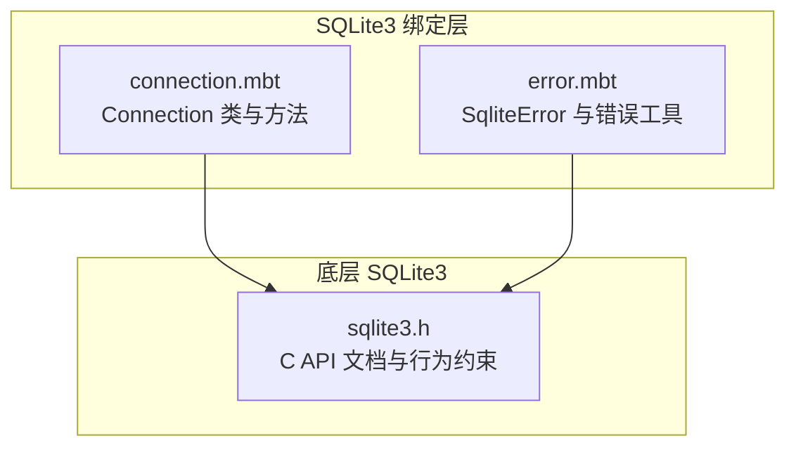
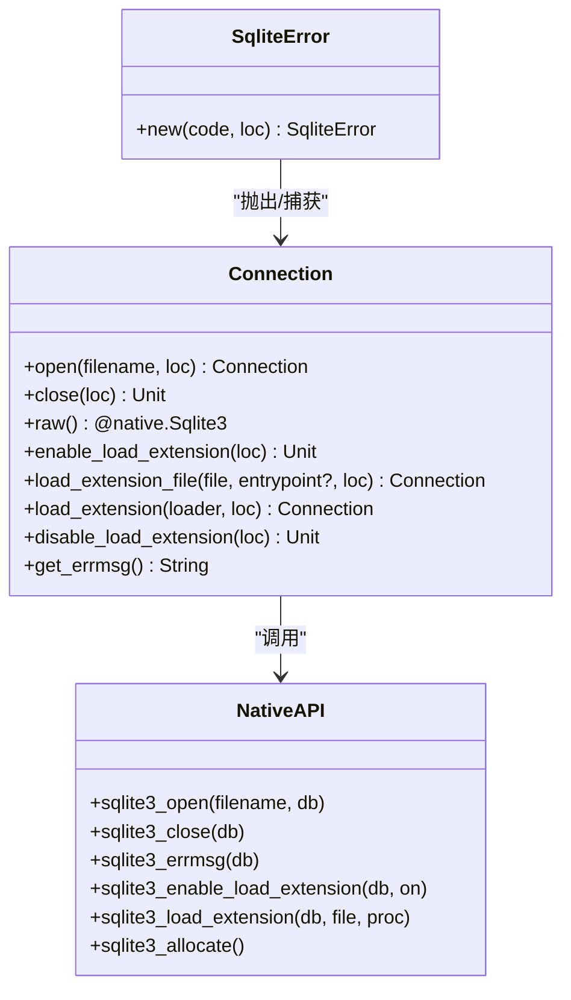
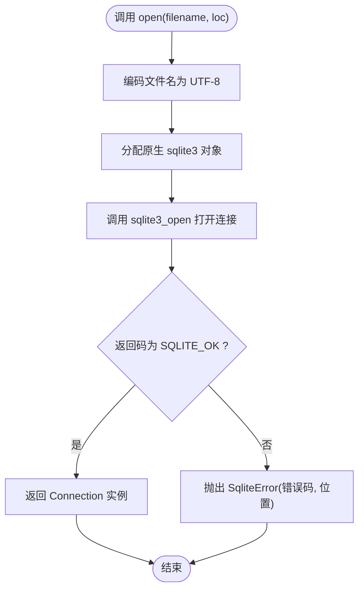
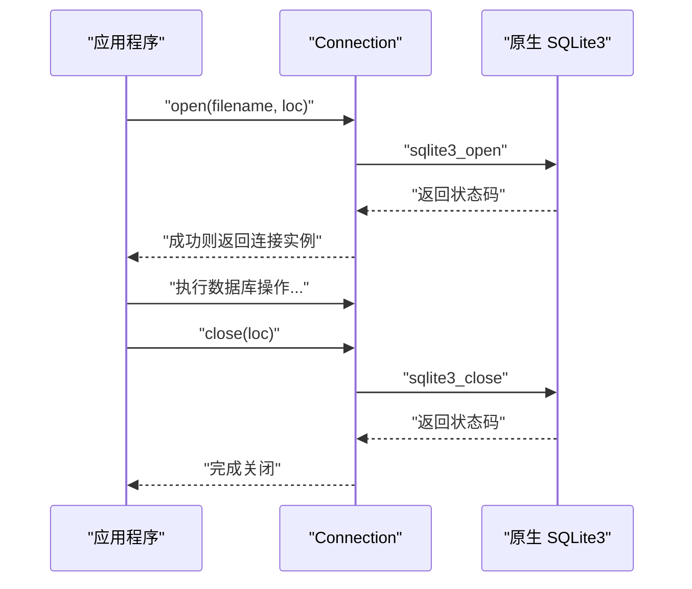
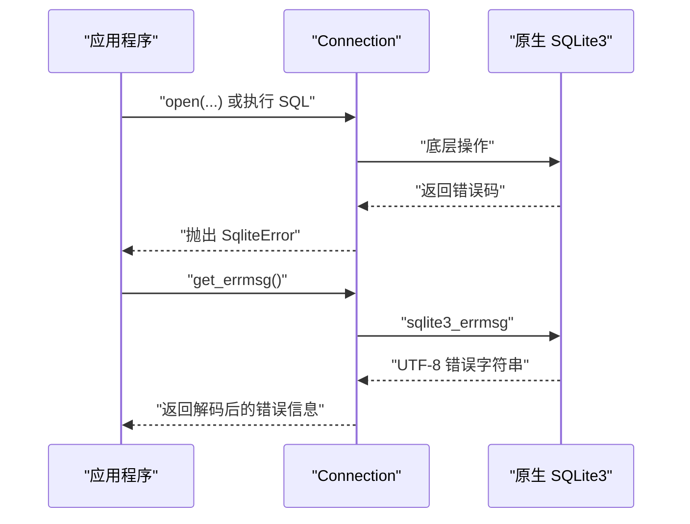
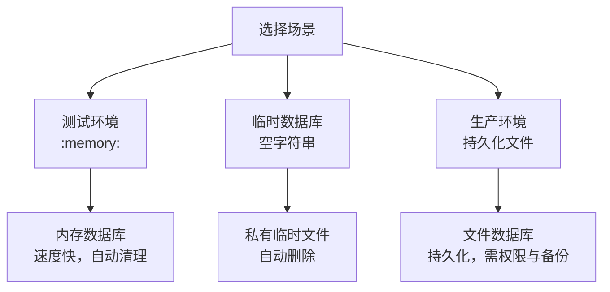
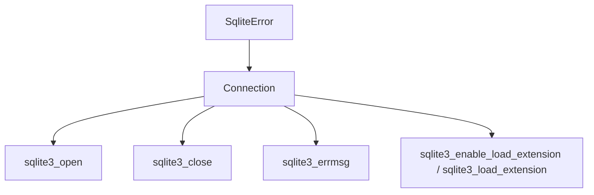

# 数据库连接管理

<cite>
**本文档引用的文件**
- [connection.mbt](file://.repos/colmugx/sqlite3/0.2.0/connection.mbt)
- [error.mbt](file://.repos/colmugx/sqlite3/0.2.0/error.mbt)
- [sqlite3.h](file://.repos/colmugx/sqlite3/0.2.0/native/sqlite3.h)
</cite>

## 目录
1. [简介](#简介)
2. [项目结构](#项目结构)
3. [核心组件](#核心组件)
4. [架构概览](#架构概览)
5. [详细组件分析](#详细组件分析)
6. [依赖关系分析](#依赖关系分析)
7. [性能考虑](#性能考虑)
8. [故障排除指南](#故障排除指南)
9. [结论](#结论)
10. [附录](#附录)

## 简介
本文件系统性阐述数据库连接管理，重点围绕 Connection 类及其方法的使用模式展开。内容涵盖：
- Connection 类的完整方法族与职责边界
- Connection::open() 的多种用法：内存数据库(":memory:")与文件数据库
- 连接生命周期管理：正确打开、使用与关闭流程
- 错误信息获取最佳实践：get_errmsg() 的使用
- 连接池策略与并发访问注意事项
- 连接失败的错误处理与重试机制
- 不同场景的实际应用示例：测试环境、生产环境与临时数据库

## 项目结构
该仓库包含 MoonBit 语言绑定的 SQLite3 接口实现，核心位于以下文件：
- connection.mbt：定义 Connection 结构体及连接操作方法
- error.mbt：定义 SqliteError 及错误处理辅助函数
- sqlite3.h：SQLite3 C API 头文件，提供底层接口说明与行为约束

**图表来源**
- [connection.mbt:1-88](file://.repos/colmugx/sqlite3/0.2.0/connection.mbt#L1-L88)
- [error.mbt:1-16](file://.repos/colmugx/sqlite3/0.2.0/error.mbt#L1-L16)
- [sqlite3.h:3593-3792](file://.repos/colmugx/sqlite3/0.2.0/native/sqlite3.h#L3593-L3792)

**章节来源**
- [connection.mbt:1-88](file://.repos/colmugx/sqlite3/0.2.0/connection.mbt#L1-L88)
- [error.mbt:1-16](file://.repos/colmugx/sqlite3/0.2.0/error.mbt#L1-L16)
- [sqlite3.h:3593-3792](file://.repos/colmugx/sqlite3/0.2.0/native/sqlite3.h#L3593-L3792)

## 核心组件
- Connection 结构体：封装底层原生数据库句柄，提供安全的生命周期管理与便捷方法。
- Connection::open()：打开数据库连接，支持文件路径与特殊名称（如 ":memory:"）。
- Connection::close()：释放连接资源，确保无泄漏。
- Connection::get_errmsg()：获取最近一次操作的错误信息字符串。
- SqliteError：统一的错误类型，携带错误码与调用位置信息。

关键职责边界：
- 打开/关闭：由 Connection::open()/close() 负责，保证资源正确分配与回收。
- 错误处理：通过 SqliteError 捕获底层返回码，并在必要时调用 get_errmsg() 获取人类可读错误描述。
- 扩展加载：提供启用/禁用扩展加载与按文件加载扩展的能力，便于功能增强。

**章节来源**
- [connection.mbt:1-88](file://.repos/colmugx/sqlite3/0.2.0/connection.mbt#L1-L88)
- [error.mbt:1-16](file://.repos/colmugx/sqlite3/0.2.0/error.mbt#L1-L16)

## 架构概览
下图展示了 Connection 类与其方法在整体架构中的位置，以及与底层 SQLite3 API 的交互关系。

**图表来源**
- [connection.mbt:1-88](file://.repos/colmugx/sqlite3/0.2.0/connection.mbt#L1-L88)
- [error.mbt:1-16](file://.repos/colmugx/sqlite3/0.2.0/error.mbt#L1-L16)
- [sqlite3.h:3593-3792](file://.repos/colmugx/sqlite3/0.2.0/native/sqlite3.h#L3593-L3792)

## 详细组件分析

### Connection::open() 方法详解
- 功能：根据提供的文件名打开数据库连接，返回 Connection 实例。
- 输入参数：
  - filename: 数据库文件路径或特殊名称（如 ":memory:"）。
  - loc: 调用位置信息，用于错误上下文记录。
- 行为特征：
  - 内存数据库：当 filename 为 ":memory:" 时，创建私有的临时内存数据库，连接关闭后自动消失。
  - 文件数据库：当 filename 为普通路径时，打开或创建对应文件数据库。
  - URI 支持：若启用 URI 解析，filename 可以是符合 RFC 3986 的 URI，支持 vfs、mode、cache、psow 等查询参数。
  - 线程模型：可通过标志位选择多线程或序列化模式；缓存模式可配置共享或私有。
- 错误处理：非 SQLITE_OK 返回码将触发异常，携带错误码与位置信息。

**图表来源**
- [connection.mbt:6-18](file://.repos/colmugx/sqlite3/0.2.0/connection.mbt#L6-L18)
- [sqlite3.h:3593-3792](file://.repos/colmugx/sqlite3/0.2.0/native/sqlite3.h#L3593-L3792)

**章节来源**
- [connection.mbt:6-18](file://.repos/colmugx/sqlite3/0.2.0/connection.mbt#L6-L18)
- [sqlite3.h:3593-3792](file://.repos/colmugx/sqlite3/0.2.0/native/sqlite3.h#L3593-L3792)

### 连接生命周期管理
- 正确打开：使用 Connection::open() 获取连接实例。
- 使用阶段：执行 SQL 操作、事务控制、扩展加载等。
- 正确关闭：使用 Connection::close() 释放底层资源，避免句柄泄漏。
- 资源释放原则：无论成功与否，都应在适当时机调用 close()；在异常路径中也应确保释放。

**图表来源**
- [connection.mbt:6-30](file://.repos/colmugx/sqlite3/0.2.0/connection.mbt#L6-L30)
- [sqlite3.h:3593-3792](file://.repos/colmugx/sqlite3/0.2.0/native/sqlite3.h#L3593-L3792)

**章节来源**
- [connection.mbt:6-30](file://.repos/colmugx/sqlite3/0.2.0/connection.mbt#L6-L30)

### 错误信息获取最佳实践：get_errmsg()
- 适用场景：在连接失败、SQL 执行失败等异常分支中，调用 get_errmsg() 获取人类可读的错误描述。
- 实现要点：
  - 仅在需要向用户或日志输出错误时调用，避免在正常路径频繁调用造成性能损耗。
  - 与 SqliteError 配合使用：先捕获异常，再根据需要调用 get_errmsg() 获取详细信息。
  - 注意错误消息的生命周期与编码：内部使用 UTF-8 字符串，对外提供解码后的字符串。

**图表来源**
- [error.mbt:7-10](file://.repos/colmugx/sqlite3/0.2.0/error.mbt#L7-L10)
- [connection.mbt:6-18](file://.repos/colmugx/sqlite3/0.2.0/connection.mbt#L6-L18)

**章节来源**
- [error.mbt:7-10](file://.repos/colmugx/sqlite3/0.2.0/error.mbt#L7-L10)

### 连接池策略与并发访问注意事项
- 线程模型：
  - 多线程模式：每个线程使用独立的数据库连接，避免共享同一连接的并发问题。
  - 序列化模式：允许多个线程共享同一连接，但内部通过互斥锁保护，适合轻量并发。
- 缓存模式：
  - 共享缓存：多个连接共享数据库缓存与模式数据结构，提升性能但需谨慎使用。
  - 私有缓存：每个连接拥有独立缓存，避免跨连接干扰。
- 并发建议：
  - 生产环境优先采用每线程/每任务一个连接的策略，减少锁竞争。
  - 如需共享连接，请明确设置序列化模式并严格控制事务边界。
  - 避免在多线程同时对同一连接进行写操作，防止死锁与数据竞争。

**章节来源**
- [sqlite3.h:7055-7099](file://.repos/colmugx/sqlite3/0.2.0/native/sqlite3.h#L7055-L7099)
- [sqlite3.h:3658-3683](file://.repos/colmugx/sqlite3/0.2.0/native/sqlite3.h#L3658-L3683)

### 连接失败的错误处理与重试机制
- 错误捕获：所有底层失败均会转换为 SqliteError，包含错误码与调用位置。
- 建议的重试策略：
  - 对于瞬时性错误（如锁超时），可在业务层实施指数退避重试。
  - 对于永久性错误（如权限不足、路径不存在），直接上报并终止流程。
  - 在重试前清理上一次失败的状态，必要时重新打开连接。
- 日志与可观测性：结合 get_errmsg() 输出详细错误信息，便于定位问题。

**章节来源**
- [error.mbt:1-16](file://.repos/colmugx/sqlite3/0.2.0/error.mbt#L1-L16)
- [connection.mbt:6-18](file://.repos/colmugx/sqlite3/0.2.0/connection.mbt#L6-L18)

### 不同连接场景的实际应用示例
- 测试环境（内存数据库）：
  - 使用 ":memory:" 作为连接名，实现快速、隔离的测试数据库。
  - 特点：无需磁盘 IO，速度快；进程退出后自动清理。
- 临时数据库（匿名文件）：
  - 使用空字符串作为文件名，创建私有临时文件数据库。
  - 特点：自动删除，适合一次性任务或临时数据处理。
- 生产环境（持久化文件数据库）：
  - 使用绝对或相对路径指定数据库文件，配合权限与备份策略。
  - 特点：数据持久化，需关注并发、事务与性能优化。

**图表来源**
- [sqlite3.h:3714-3724](file://.repos/colmugx/sqlite3/0.2.0/native/sqlite3.h#L3714-L3724)

**章节来源**
- [sqlite3.h:3714-3724](file://.repos/colmugx/sqlite3/0.2.0/native/sqlite3.h#L3714-L3724)

## 依赖关系分析
- Connection 依赖原生 SQLite3 API：open/close/errmsg/load_extension 等。
- 错误处理依赖 SqliteError：统一异常模型与位置信息。
- 并发与缓存策略依赖 SQLite3 的线程模型与共享缓存开关。

**图表来源**
- [connection.mbt:1-88](file://.repos/colmugx/sqlite3/0.2.0/connection.mbt#L1-L88)
- [error.mbt:1-16](file://.repos/colmugx/sqlite3/0.2.0/error.mbt#L1-L16)
- [sqlite3.h:3593-3792](file://.repos/colmugx/sqlite3/0.2.0/native/sqlite3.h#L3593-L3792)

**章节来源**
- [connection.mbt:1-88](file://.repos/colmugx/sqlite3/0.2.0/connection.mbt#L1-L88)
- [error.mbt:1-16](file://.repos/colmugx/sqlite3/0.2.0/error.mbt#L1-L16)
- [sqlite3.h:3593-3792](file://.repos/colmugx/sqlite3/0.2.0/native/sqlite3.h#L3593-L3792)

## 性能考虑
- 连接数量：在高并发场景下，优先采用每线程/每任务独立连接，降低锁竞争。
- 缓存策略：默认私有缓存更安全；如需全局共享缓存，评估性能收益与一致性成本。
- I/O 优化：内存数据库适合频繁读写的测试；生产环境优先本地 SSD，合理设置 WAL 模式。
- 错误处理开销：避免在热路径频繁调用 get_errmsg()，仅在异常分支使用。

## 故障排除指南
- 常见错误与排查：
  - 权限不足：检查文件路径权限与目录存在性。
  - 路径冲突：使用绝对路径或规范化路径，避免符号链接问题。
  - 并发冲突：确认线程模型与缓存模式设置，避免跨线程共享写操作。
- 错误信息获取：
  - 在捕获到 SqliteError 后，调用 get_errmsg() 获取详细错误描述，辅助定位问题。
- 重试与降级：
  - 对于可重试错误，实施指数退避；对于不可恢复错误，记录日志并终止流程。

**章节来源**
- [error.mbt:7-10](file://.repos/colmugx/sqlite3/0.2.0/error.mbt#L7-L10)
- [connection.mbt:6-18](file://.repos/colmugx/sqlite3/0.2.0/connection.mbt#L6-L18)

## 结论
通过 Connection 类提供的统一接口，可以安全地管理 SQLite3 连接生命周期，覆盖从内存数据库到持久化文件数据库的多种场景。结合 SqliteError 与 get_errmsg()，能够实现清晰的错误处理与可观测性。在高并发与生产环境中，应遵循每线程/每任务独立连接的原则，并谨慎配置线程模型与缓存模式，以获得稳定与高性能的表现。

## 附录
- 关键 API 参考：
  - 打开连接：参见 sqlite3_open/open_v2 的行为与标志位说明。
  - 关闭连接：参见 sqlite3_close 的资源释放要求。
  - 错误信息：参见 sqlite3_errmsg 的使用与生命周期。
  - 扩展加载：参见 sqlite3_enable_load_extension 与 sqlite3_load_extension 的使用。

**章节来源**
- [sqlite3.h:3593-3792](file://.repos/colmugx/sqlite3/0.2.0/native/sqlite3.h#L3593-L3792)
- [sqlite3.h:7055-7099](file://.repos/colmugx/sqlite3/0.2.0/native/sqlite3.h#L7055-L7099)