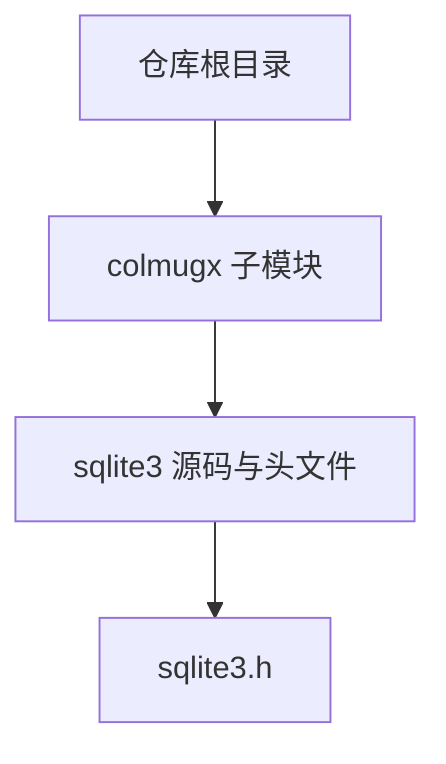
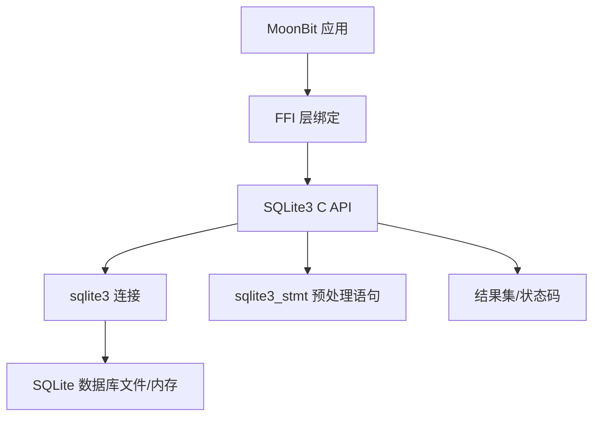
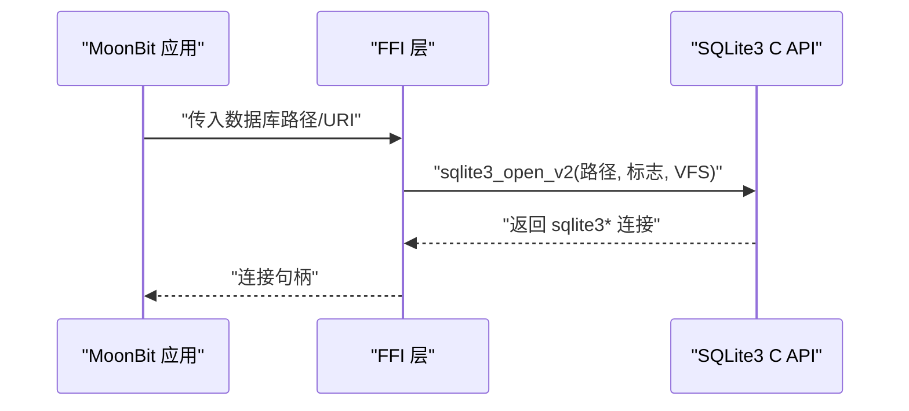
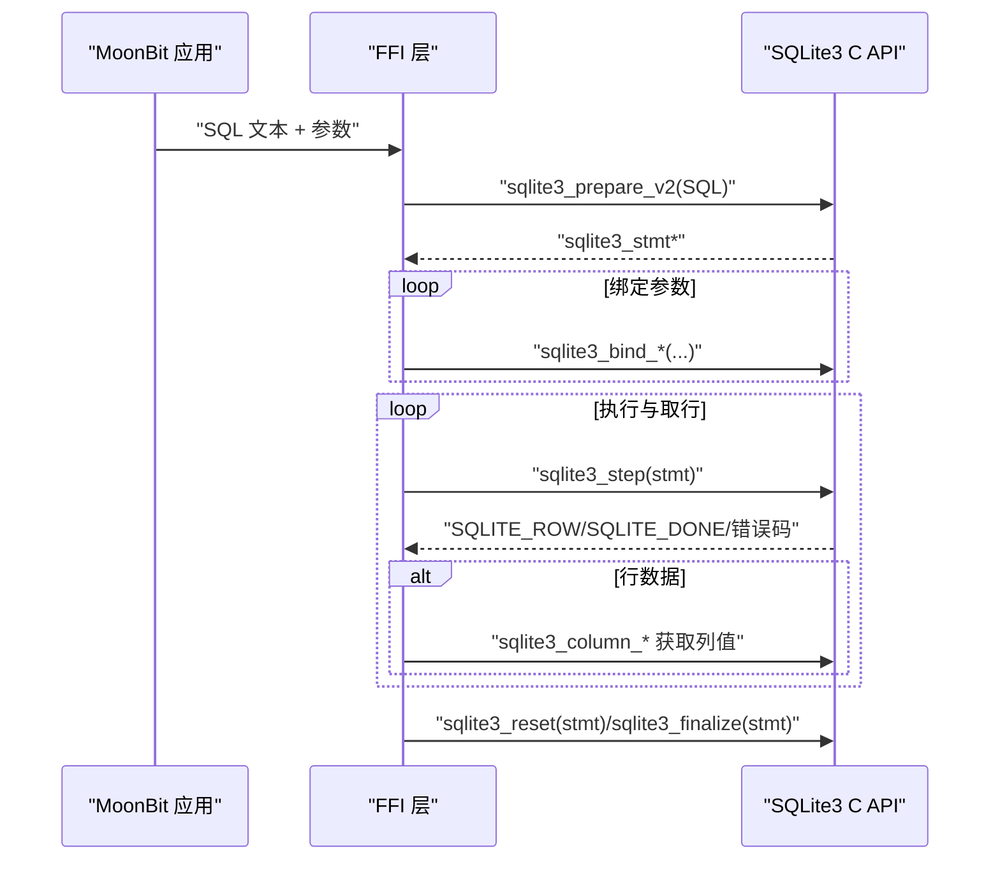
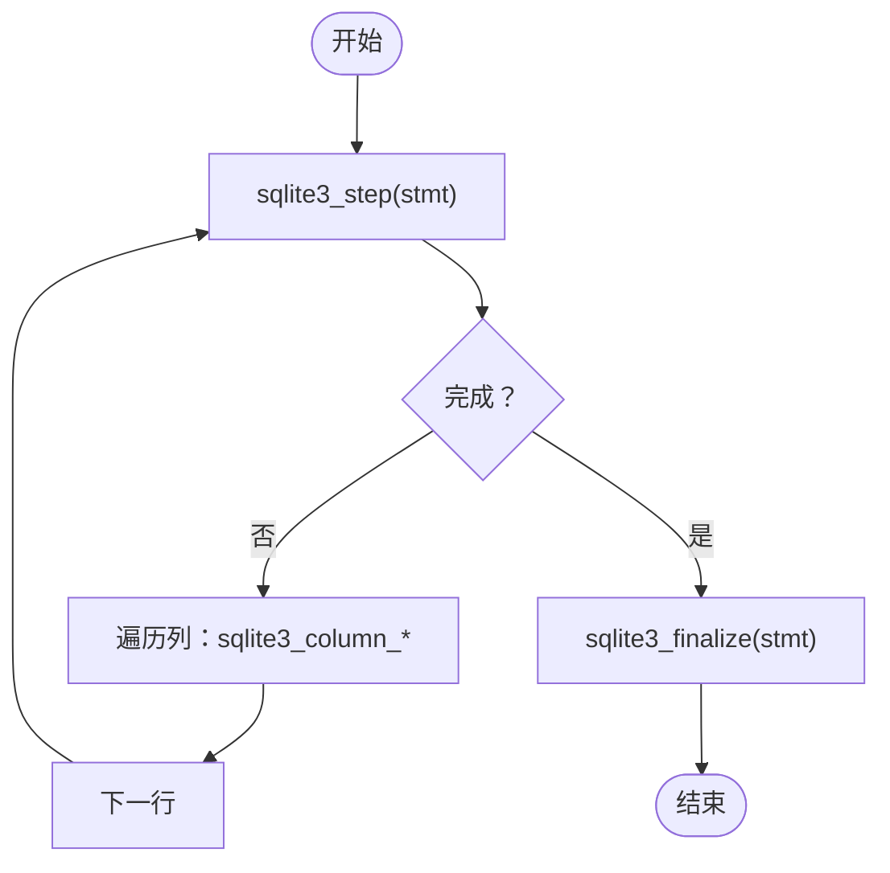
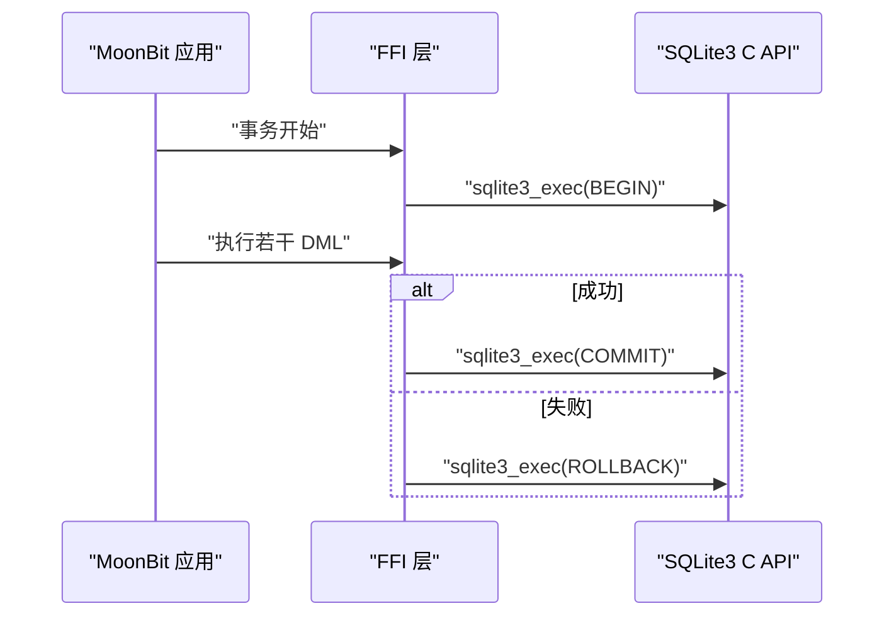
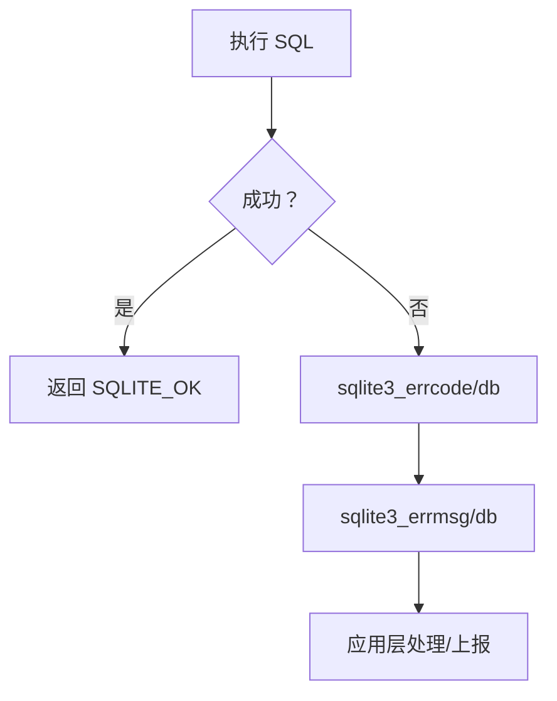
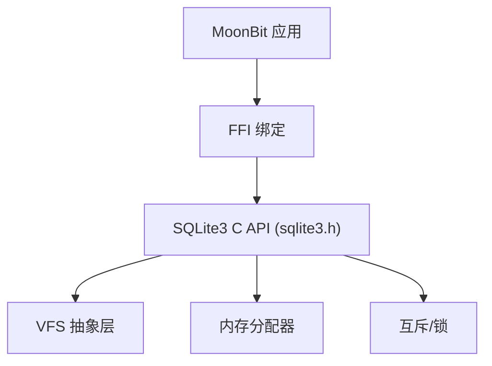

# 数据库集成

<cite>
**本文档引用的文件**
- [sqlite3.h](file://.repos/colmugx/sqlite3/0.2.0/native/sqlite3.h)
</cite>

## 目录
1. [简介](#简介)
2. [项目结构](#项目结构)
3. [核心组件](#核心组件)
4. [架构总览](#架构总览)
5. [详细组件分析](#详细组件分析)
6. [依赖关系分析](#依赖关系分析)
7. [性能考量](#性能考量)
8. [故障排查指南](#故障排查指南)
9. [结论](#结论)
10. [附录](#附录)

## 简介
本文件面向在 MoonBit 生态中集成 SQLite3 的开发者，系统性阐述 colmugx/sqlite3 库在该环境下的可用能力与使用方式。基于仓库中提供的 SQLite3 官方 C 头文件，我们梳理了数据库连接、SQL 预处理与执行、结果集处理、事务控制、错误码与诊断、线程模型与配置、以及与 MoonBit 语言的数据类型映射与转换要点，并给出针对不同复杂度场景的实践建议。

## 项目结构
- 仓库根目录包含多个子模块目录（如 .repos/colmugx 等），其中 colmugx/sqlite3 提供了 SQLite3 的 C 头文件，可用于 MoonBit 通过 FFI 调用 SQLite3 的底层接口。
- 本仓库未包含 colmugx/sqlite3 的 MoonBit 绑定源码，但提供了 SQLite3 官方 C API 头文件，可作为 MoonBit 侧绑定开发的权威参考。

**图表来源**
- [sqlite3.h](file://.repos/colmugx/sqlite3/0.2.0/native/sqlite3.h)

**章节来源**
- [sqlite3.h](file://.repos/colmugx/sqlite3/0.2.0/native/sqlite3.h)

## 核心组件
- 数据库连接对象：sqlite3（数据库连接句柄）
- 预编译语句对象：sqlite3_stmt（准备好的 SQL 语句）
- 值对象：sqlite3_value（动态类型的值容器）
- 上下文对象：sqlite3_context（SQL 函数执行上下文）

这些对象贯穿“打开连接 → 编译 SQL → 绑定参数 → 执行 → 获取结果 → 重置/释放”的完整生命周期。

**章节来源**
- [sqlite3.h](file://.repos/colmugx/sqlite3/0.2.0/native/sqlite3.h)

## 架构总览
下图展示了 MoonBit 通过 FFI 调用 SQLite3 的典型交互流程：MoonBit 侧负责准备 SQL、绑定参数、解析结果；SQLite3 负责编译、执行与返回状态码。

**图表来源**
- [sqlite3.h](file://.repos/colmugx/sqlite3/0.2.0/native/sqlite3.h)

## 详细组件分析

### 1) 数据库连接与打开
- 支持 UTF-8 与 UTF-16 文件名接口，支持多种打开标志位（只读、读写、创建、内存数据库、URI 解析、互斥模式、共享缓存等）。
- 支持通过 VFS 指定操作系统抽象层，支持 URI 查询参数（vfs、mode、cache、psow、nolock、immutable 等）。
- 可设置扩展结果码、线程模型（单线程/多线程/序列化）、日志回调、内存分配器等。

**图表来源**
- [sqlite3.h](file://.repos/colmugx/sqlite3/0.2.0/native/sqlite3.h)

**章节来源**
- [sqlite3.h](file://.repos/colmugx/sqlite3/0.2.0/native/sqlite3.h)

### 2) SQL 预处理与执行
- 使用 sqlite3_prepare_v2/v3 编译 SQL，支持持久化提示、规范化、禁用虚拟表等标志。
- 使用 sqlite3_bind_* 系列绑定参数（整数、浮点、文本、Blob、指针、零填充 Blob 等），支持静态/瞬时/销毁器生命周期策略。
- 使用 sqlite3_step 执行，循环读取行，使用 sqlite3_column_* 获取列值。
- 使用 sqlite3_reset 重置语句，sqlite3_finalize 释放资源。

**图表来源**
- [sqlite3.h](file://.repos/colmugx/sqlite3/0.2.0/native/sqlite3.h)

**章节来源**
- [sqlite3.h](file://.repos/colmugx/sqlite3/0.2.0/native/sqlite3.h)

### 3) 结果集处理与列访问
- 列访问接口支持文本、UTF-16、Blob、整数、浮点等多种类型；支持获取列名、列数、行数统计等。
- 对于 sqlite3_get_table 兼容接口，返回二维结果表，需调用 sqlite3_free_table 释放。

**图表来源**
- [sqlite3.h](file://.repos/colmugx/sqlite3/0.2.0/native/sqlite3.h)

**章节来源**
- [sqlite3.h](file://.repos/colmugx/sqlite3/0.2.0/native/sqlite3.h)

### 4) 事务与并发控制
- 支持 BEGIN/COMMIT/ROLLBACK/SAVEPOINT/RELEASE 等事务控制语句。
- 支持忙等待回调 sqlite3_busy_handler 与超时 sqlite3_busy_timeout。
- 支持中断长时间运行查询 sqlite3_interrupt。
- 线程模型可通过 sqlite3_config 设置为单线程、多线程、序列化模式。

**图表来源**
- [sqlite3.h](file://.repos/colmugx/sqlite3/0.2.0/native/sqlite3.h)

**章节来源**
- [sqlite3.h](file://.repos/colmugx/sqlite3/0.2.0/native/sqlite3.h)

### 5) 错误处理与诊断
- 错误码与扩展错误码：sqlite3_errcode、sqlite3_extended_errcode、sqlite3_errmsg、sqlite3_errmsg16、sqlite3_error_offset。
- 支持错误日志回调配置（sqlite3_config SQLITE_CONFIG_LOG）。
- 支持查询最近一次错误字符串 sqlite3_errstr。

**图表来源**
- [sqlite3.h](file://.repos/colmugx/sqlite3/0.2.0/native/sqlite3.h)

**章节来源**
- [sqlite3.h](file://.repos/colmugx/sqlite3/0.2.0/native/sqlite3.h)

### 6) 线程模型与配置
- 线程模式：单线程、多线程、序列化；可通过 sqlite3_config 配置。
- 内存分配器、页缓存、堆栈大小、MMap 大小、排序器阈值等均可通过 sqlite3_config 与 sqlite3_db_config 调整。

**章节来源**
- [sqlite3.h](file://.repos/colmugx/sqlite3/0.2.0/native/sqlite3.h)

### 7) 与 MoonBit 的数据类型映射与转换
- 文本/字符串：UTF-8 文本对应 SQLite TEXT；UTF-16 文本对应 sqlite3_bind_text16；长文本可使用 sqlite3_bind_text64 并指定编码。
- 数值：整型与大整型映射到 sqlite3_int64/sqlite3_uint64；浮点映射到 double。
- BLOB：使用 sqlite3_bind_blob 或 sqlite3_bind_zeroblob。
- NULL：使用 sqlite3_bind_null。
- 指针：使用 sqlite3_bind_pointer（谨慎使用，注意生命周期与销毁器）。
- 日期时间：通常以 TEXT/NUMERIC 存储，由应用层解析。
- 注意：MoonBit 侧应确保字符串编码正确（UTF-8），避免跨语言边界出现乱码或截断。

**章节来源**
- [sqlite3.h](file://.repos/colmugx/sqlite3/0.2.0/native/sqlite3.h)

### 8) 数据库迁移与版本管理
- 版本号与源 ID：通过 SQLITE_VERSION/SQLITE_VERSION_NUMBER/SQLITE_SOURCE_ID 获取运行时版本信息。
- 迁移策略建议：
  - 使用 PRAGMA 步进式升级（如 schema_version）。
  - 在应用启动时检测版本并执行必要的 ALTER TABLE/CREATE INDEX/数据修复。
  - 对于破坏性变更，采用“备份旧库 → 升级 → 校验 → 回滚”机制。
  - 使用 sqlite3_serialize/deserialize（若启用）进行内存数据库迁移或快照。
- 注意：迁移过程应保持事务一致性，失败时回滚并记录错误。

**章节来源**
- [sqlite3.h](file://.repos/colmugx/sqlite3/0.2.0/native/sqlite3.h)

### 9) 实际数据库设计示例与查询优化建议
- 设计示例（概念性说明）：
  - 用户表：主键自增、索引覆盖常用查询字段（如用户名、邮箱）。
  - 订单表：外键关联用户表，按时间建立复合索引。
  - 日志表：按天分区或使用 WAL 模式提升写入吞吐。
- 查询优化建议：
  - 使用 EXPLAIN/EXPLAIN QUERY PLAN 分析执行计划。
  - 合理使用索引（唯一索引、前缀索引、函数索引、降序索引）。
  - 避免 SELECT *，仅取必要列。
  - 将频繁过滤条件放在 WHERE 前部，利用索引下推。
  - 对大数据量更新/删除，分批执行并使用事务包裹。
  - 使用参数化查询防止注入与提升缓存命中率。

[本节为概念性内容，不直接分析具体文件]

### 10) 不同复杂度场景的指导
- 小型应用（本地文件数据库）：
  - 使用默认配置，开启 WAL 提升并发写入。
  - 通过 URI 参数设置 cache=private 降低共享开销。
- 中大型应用（多线程/高并发）：
  - 使用序列化线程模式，合理设置页缓存与堆大小。
  - 使用 sqlite3_progress_handler 与 sqlite3_trace_v2 监控长查询。
  - 严格参数化与索引设计，避免全表扫描。
- 云原生/容器化：
  - 使用内存数据库或 WAL 模式，结合持久化策略。
  - 通过 sqlite3_config 设置 MMAP 大小与排序器阈值，平衡 I/O 与内存占用。

[本节为概念性内容，不直接分析具体文件]

## 依赖关系分析
- MoonBit 应用依赖 FFI 层将 SQLite3 C API 映射到 MoonBit 类型系统。
- FFI 层依赖 SQLite3 C API（sqlite3.h）定义的接口与常量。
- SQLite3 C API 依赖 VFS 抽象层、内存分配器、互斥锁等运行时设施。

**图表来源**
- [sqlite3.h](file://.repos/colmugx/sqlite3/0.2.0/native/sqlite3.h)

**章节来源**
- [sqlite3.h](file://.repos/colmugx/sqlite3/0.2.0/native/sqlite3.h)

## 性能考量
- I/O 与缓存：
  - 通过 sqlite3_config/DBCONFIG 调整页缓存、堆大小、MMap 限制。
  - 使用 WAL 模式提升写入吞吐，配合 checkpoint 策略。
- 查询优化：
  - 使用 EXPLAIN/EXPLAIN QUERY PLAN 识别慢查询。
  - 合理索引设计与覆盖索引减少回表。
- 并发与锁：
  - 选择合适的线程模式（序列化/多线程）。
  - 使用 sqlite3_busy_handler/timeout 降低锁竞争影响。
- 内存与生命周期：
  - 使用 SQLITE_STATIC/SQLITE_TRANSIENT 控制绑定对象生命周期。
  - 避免在回调中修改当前连接状态，防止死锁。

[本节提供通用建议，不直接分析具体文件]

## 故障排查指南
- 常见错误码与定位：
  - SQLITE_BUSY/SQLITE_LOCKED：并发写入冲突，检查事务与锁策略。
  - SQLITE_IOERR/SQLITE_CORRUPT：磁盘 I/O 或文件损坏，检查权限与存储介质。
  - SQLITE_CONSTRAINT：违反约束（唯一、外键、非空），核对输入数据。
  - SQLITE_INTERRUPT：用户取消或超时，检查 sqlite3_interrupt 使用。
- 诊断工具：
  - sqlite3_trace_v2/trace/profile 监控执行与耗时。
  - sqlite3_log 配置全局错误日志回调。
  - sqlite3_error_offset 获取最近错误的偏移位置。

**章节来源**
- [sqlite3.h](file://.repos/colmugx/sqlite3/0.2.0/native/sqlite3.h)

## 结论
通过 SQLite3 C API（sqlite3.h）提供的丰富接口，MoonBit 应用可以高效地完成数据库连接、SQL 预处理与执行、结果集处理、事务控制与错误诊断。结合合理的线程模型、内存与 I/O 配置、索引与查询优化策略，可在不同复杂度的应用场景中获得稳定且高性能的数据库体验。迁移与版本管理建议遵循“最小变更、可回滚、可验证”的原则，确保数据安全与业务连续性。

## 附录
- 关键接口速查（基于 sqlite3.h）：
  - 连接：sqlite3_open_v2、sqlite3_close
  - 预处理：sqlite3_prepare_v2/v3、sqlite3_finalize
  - 绑定：sqlite3_bind_* 系列
  - 执行：sqlite3_step、sqlite3_reset
  - 结果：sqlite3_column_*、sqlite3_get_table
  - 事务：BEGIN/COMMIT/ROLLBACK/SAVEPOINT/RELEASE
  - 错误：sqlite3_errcode/errmsg/error_offset
  - 配置：sqlite3_config、sqlite3_db_config、sqlite3_trace_v2

**章节来源**
- [sqlite3.h](file://.repos/colmugx/sqlite3/0.2.0/native/sqlite3.h)