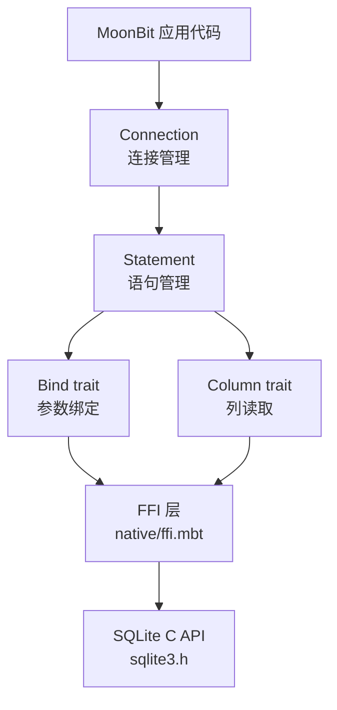
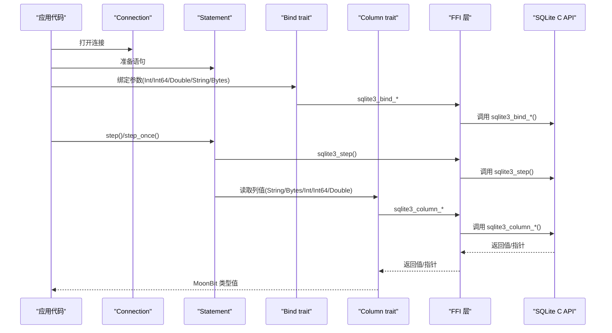
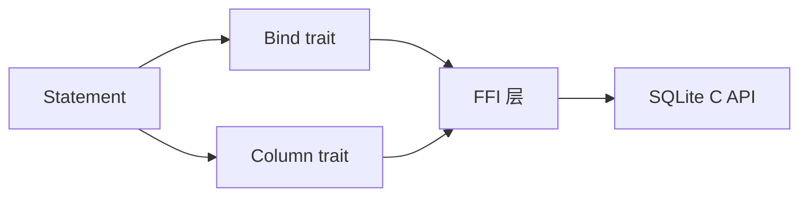

# 数据类型映射

<cite>
**本文引用的文件**
- [ffi.mbt](file://.repos/colmugx/sqlite3/0.2.0/native/ffi.mbt)
- [bind.mbt](file://.repos/colmugx/sqlite3/0.2.0/bind.mbt)
- [column.mbt](file://.repos/colmugx/sqlite3/0.2.0/column.mbt)
- [stmt.mbt](file://.repos/colmugx/sqlite3/0.2.0/stmt.mbt)
- [connection.mbt](file://.repos/colmugx/sqlite3/0.2.0/connection.mbt)
- [error.mbt](file://.repos/colmugx/sqlite3/0.2.0/error.mbt)
- [README.md](file://.repos/colmugx/sqlite3/0.2.0/README.md)
- [sqlite3.h](file://.repos/colmugx/sqlite3/0.2.0/native/sqlite3.h)
- [pkg.generated.mbti](file://.repos/colmugx/sqlite3/0.2.0/pkg.generated.mbti)
- [sqlite-vec.c](file://.repos/colmugx/sqlite3/0.2.0/native/sqlite-vec.c)
</cite>

## 目录
1. [简介](#简介)
2. [项目结构](#项目结构)
3. [核心组件](#核心组件)
4. [架构总览](#架构总览)
5. [详细组件分析](#详细组件分析)
6. [依赖关系分析](#依赖关系分析)
7. [性能考量](#性能考量)
8. [故障排查指南](#故障排查指南)
9. [结论](#结论)
10. [附录](#附录)

## 简介
本文件系统性梳理 MoonBit 与 SQLite 的数据类型映射与实现细节，覆盖 INTEGER、REAL、TEXT、BLOB 的绑定与读取机制，字符串编码（UTF-8）与字节处理差异，NULL 值处理的限制与扩展方案，以及精度与范围考虑、最佳实践与常见陷阱，并结合仓库中的实现源码路径进行说明。

## 项目结构
该仓库为 MoonBit 的 SQLite 绑定库，采用“薄封装 + 低层 API”设计，直接暴露 SQLite C API 的工作流：打开连接、准备语句、绑定参数、执行步进、读取列值。核心文件组织如下：
- 连接与语句：通过 MoonBit 结构体包装原生句柄，提供 open/prepare/finalize/step 等方法
- 绑定与列读取：通过 trait 将 MoonBit 类型映射到 SQLite 的 INTEGER/REAL/TEXT/BLOB
- FFI 层：将 MoonBit 调用桥接到 sqlite3 C API
- 文档与常量：README 提供映射表与约束说明；pkg.generated.mbti 暴露 SQLite 常量

图表来源
- [stmt.mbt:1-72](file://.repos/colmugx/sqlite3/0.2.0/stmt.mbt#L1-L72)
- [bind.mbt:1-48](file://.repos/colmugx/sqlite3/0.2.0/bind.mbt#L1-L48)
- [column.mbt:1-29](file://.repos/colmugx/sqlite3/0.2.0/column.mbt#L1-L29)
- [ffi.mbt:57-131](file://.repos/colmugx/sqlite3/0.2.0/native/ffi.mbt#L57-L131)
- [sqlite3.h:5155-5409](file://.repos/colmugx/sqlite3/0.2.0/native/sqlite3.h#L5155-L5409)

章节来源
- [README.md:1-237](file://.repos/colmugx/sqlite3/0.2.0/README.md#L1-L237)
- [stmt.mbt:1-72](file://.repos/colmugx/sqlite3/0.2.0/stmt.mbt#L1-L72)

## 核心组件
- 连接 Connection：负责打开/关闭数据库连接，加载扩展等
- 语句 Statement：负责 prepare、bind、step、column、finalize
- 绑定 Bind trait：将 MoonBit 类型映射到 SQLite 绑定函数
- 列读取 Column trait：将 SQLite 列值映射到 MoonBit 类型
- FFI 层：MoonBit 与 sqlite3 C API 的桥接
- 常量与结果码：pkg.generated.mbti 暴露 SQLite 常量，error.mbt 提供错误消息解码

章节来源
- [connection.mbt:1-87](file://.repos/colmugx/sqlite3/0.2.0/connection.mbt#L1-L87)
- [stmt.mbt:1-72](file://.repos/colmugx/sqlite3/0.2.0/stmt.mbt#L1-L72)
- [bind.mbt:1-48](file://.repos/colmugx/sqlite3/0.2.0/bind.mbt#L1-L48)
- [column.mbt:1-29](file://.repos/colmugx/sqlite3/0.2.0/column.mbt#L1-L29)
- [pkg.generated.mbti:1-78](file://.repos/colmugx/sqlite3/0.2.0/pkg.generated.mbti#L1-L78)
- [error.mbt:1-16](file://.repos/colmugx/sqlite3/0.2.0/error.mbt#L1-L16)

## 架构总览
下图展示从 MoonBit 应用到 SQLite C API 的调用链路，以及数据在各层之间的类型映射。

图表来源
- [stmt.mbt:23-35](file://.repos/colmugx/sqlite3/0.2.0/stmt.mbt#L23-L35)
- [bind.mbt:7-48](file://.repos/colmugx/sqlite3/0.2.0/bind.mbt#L7-L48)
- [column.mbt:7-29](file://.repos/colmugx/sqlite3/0.2.0/column.mbt#L7-L29)
- [ffi.mbt:59-131](file://.repos/colmugx/sqlite3/0.2.0/native/ffi.mbt#L59-L131)
- [sqlite3.h:4829-5409](file://.repos/colmugx/sqlite3/0.2.0/native/sqlite3.h#L4829-L5409)

## 详细组件分析

### 数据类型映射表与实现要点
- 映射关系
  - Int → INTEGER（绑定与读取均为 Int）
  - Int64 → INTEGER（绑定与读取均为 Int64）
  - Double → REAL（绑定与读取均为 Double）
  - String → TEXT（绑定时按 UTF-8 编码；读取时使用“带替换符”的 UTF-8 解码）
  - Bytes → BLOB（绑定与读取均为 Bytes）

- 实现细节
  - 绑定时，String 先经 UTF-8 编码再传入 sqlite3_bind_text；Bytes 直接传入 sqlite3_bind_blob
  - 读取时，String 使用“损失式 UTF-8 解码”，Bytes 直接返回底层 BLOB 指针
  - Integer/Real 读取分别调用 sqlite3_column_int/int64/double

- 注意事项
  - 参数索引从 1 开始，列索引从 0 开始
  - String 绑定时按 UTF-8 编码；读取时若遇到非法 UTF-8，会以替换字符处理
  - 当前公开 API 不支持显式绑定/解码 NULL，也不提供列类型检查 API

章节来源
- [README.md:191-208](file://.repos/colmugx/sqlite3/0.2.0/README.md#L191-L208)
- [bind.mbt:7-48](file://.repos/colmugx/sqlite3/0.2.0/bind.mbt#L7-L48)
- [column.mbt:7-29](file://.repos/colmugx/sqlite3/0.2.0/column.mbt#L7-L29)
- [ffi.mbt:59-131](file://.repos/colmugx/sqlite3/0.2.0/native/ffi.mbt#L59-L131)

### 字符串编码（UTF-8）与字节处理差异
- 绑定阶段
  - String 经 UTF-8 编码后作为 TEXT 写入数据库
  - Bytes 直接作为 BLOB 写入数据库
- 读取阶段
  - String 读取采用“损失式 UTF-8 解码”，即遇到非法序列会替换为替换字符
  - Bytes 读取直接返回底层 BLOB 指针，适合二进制数据或需要无损字节处理的场景
- 特殊说明
  - 若需严格无损处理任意字节序列，请优先使用 Bytes 类型

章节来源
- [README.md:206-206](file://.repos/colmugx/sqlite3/0.2.0/README.md#L206-L206)
- [bind.mbt:39-48](file://.repos/colmugx/sqlite3/0.2.0/bind.mbt#L39-L48)
- [column.mbt:27-29](file://.repos/colmugx/sqlite3/0.2.0/column.mbt#L27-L29)

### INTEGER、REAL、TEXT、BLOB 的绑定与读取机制
- 绑定
  - 整数：Int → sqlite3_bind_int；Int64 → sqlite3_bind_int64
  - 浮点：Double → sqlite3_bind_double
  - 文本：String → sqlite3_bind_text（UTF-8）
  - 二进制：Bytes → sqlite3_bind_blob
- 读取
  - 整数：sqlite3_column_int/int64 → MoonBit Int/Int64
  - 浮点：sqlite3_column_double → MoonBit Double
  - 文本：sqlite3_column_text → MoonBit String（损失式 UTF-8 解码）
  - 二进制：sqlite3_column_blob → MoonBit Bytes

章节来源
- [bind.mbt:7-48](file://.repos/colmugx/sqlite3/0.2.0/bind.mbt#L7-L48)
- [column.mbt:7-29](file://.repos/colmugx/sqlite3/0.2.0/column.mbt#L7-L29)
- [ffi.mbt:59-131](file://.repos/colmugx/sqlite3/0.2.0/native/ffi.mbt#L59-L131)
- [sqlite3.h:5155-5409](file://.repos/colmugx/sqlite3/0.2.0/native/sqlite3.h#L5155-L5409)

### NULL 值处理的限制与扩展方案
- 限制
  - 公开 API 不支持显式绑定/解码 NULL
  - 未提供列类型检查 API，无法在运行时区分 NULL 与其他类型
- 行为参考
  - SQLite 对 NULL 的自动类型转换规则见 sqlite3.h 中的注释
- 扩展建议
  - 若需精确处理 NULL，可在当前库基础上扩展 Column trait，增加对 sqlite3_column_type 的调用与 NULL 分支处理
  - 或在应用层约定“空字符串/零值/空字节序列”表示 NULL 的替代策略（需谨慎评估业务语义）

章节来源
- [README.md:207-207](file://.repos/colmugx/sqlite3/0.2.0/README.md#L207-L207)
- [sqlite3.h:5306-5330](file://.repos/colmugx/sqlite3/0.2.0/native/sqlite3.h#L5306-L5330)

### 精度与范围考虑（整数与浮点）
- 整数
  - Int/Int64 在绑定时均映射为 INTEGER；读取时分别返回 Int/Int64
  - 需关注 MoonBit 整数位宽与目标平台的范围边界
- 浮点
  - Double → REAL；读取为 Double
  - 注意 SQLite REAL 的 IEEE 64 位双精度与 MoonBit Double 的一致性
- 自动类型转换
  - SQLite 支持跨类型转换（如 INTEGER/REAL/TEXT/BLOB），具体规则见 sqlite3.h 注释
  - 转换可能影响指针有效性与内存生命周期，详见 sqlite3.h 对 sqlite3_column_text/blob 等的说明

章节来源
- [sqlite3.h:5306-5330](file://.repos/colmugx/sqlite3/0.2.0/native/sqlite3.h#L5306-L5330)
- [sqlite3.h:5238-5262](file://.repos/colmugx/sqlite3/0.2.0/native/sqlite3.h#L5238-L5262)

### 类型转换最佳实践与常见陷阱
- 最佳实践
  - 文本统一使用 String 并确保输入为合法 UTF-8；若包含任意二进制数据，使用 Bytes
  - 明确区分参数索引（从 1 开始）与列索引（从 0 开始）
  - 每个 Statement 与 Connection 都需显式 finalize/close
  - 使用 step_once 仅用于无行返回的语句，查询语句使用 step 循环
- 常见陷阱
  - 将 String 绑定为 TEXT 后读取为 String，若数据库中存储了非 UTF-8 文本，读取会出现替换字符
  - 忘记区分参数索引与列索引导致的错位
  - 未调用 finalize/close 导致资源泄漏
  - 期望 NULL 值但未提供公开 API 时的误判

章节来源
- [README.md:205-208](file://.repos/colmugx/sqlite3/0.2.0/README.md#L205-L208)
- [stmt.mbt:39-60](file://.repos/colmugx/sqlite3/0.2.0/stmt.mbt#L39-L60)

### 实际使用示例与性能考虑
- 示例定位
  - 快速开始与多行查询、BLOB 往返示例位于 README.md 的测试片段中
- 性能建议
  - 复用 Prepared Statement，避免重复 prepare
  - 使用 UTF-8 文本时尽量减少不必要的转码与复制
  - BLOB 数据较大时，注意内存占用与拷贝成本
  - 正确释放资源，防止句柄泄漏

章节来源
- [README.md:26-146](file://.repos/colmugx/sqlite3/0.2.0/README.md#L26-L146)

### 特殊数据类型与自定义编码需求
- 特殊类型
  - 仓库内包含向量扩展（sqlite-vec）相关实现，展示了将 BLOB/TEXT 解析为向量的逻辑
- 自定义编码
  - 可基于现有 Bytes 绑定/读取机制，自行实现上层编码（如 JSON、MessagePack 等），先将数据序列化为 Bytes 再入库
  - 读取时反序列化回目标结构

章节来源
- [sqlite-vec.c:1110-10242](file://.repos/colmugx/sqlite3/0.2.0/native/sqlite-vec.c#L1110-L10242)

## 依赖关系分析
- 组件耦合
  - Statement 依赖 Bind/Column trait，二者进一步依赖 FFI 层
  - FFI 层依赖 sqlite3.h 的 C API
- 外部依赖
  - SQLite 官方 C API（内置 sqlite3.c/sqlite3.h）
  - MoonBit 核心编码（UTF-8 编解码）

图表来源
- [stmt.mbt:23-35](file://.repos/colmugx/sqlite3/0.2.0/stmt.mbt#L23-L35)
- [bind.mbt:2-4](file://.repos/colmugx/sqlite3/0.2.0/bind.mbt#L2-L4)
- [column.mbt:2-4](file://.repos/colmugx/sqlite3/0.2.0/column.mbt#L2-L4)
- [ffi.mbt:57-131](file://.repos/colmugx/sqlite3/0.2.0/native/ffi.mbt#L57-L131)
- [sqlite3.h:4829-5409](file://.repos/colmugx/sqlite3/0.2.0/native/sqlite3.h#L4829-L5409)

章节来源
- [pkg.generated.mbti:1-78](file://.repos/colmugx/sqlite3/0.2.0/pkg.generated.mbti#L1-L78)
- [ffi.mbt:57-131](file://.repos/colmugx/sqlite3/0.2.0/native/ffi.mbt#L57-L131)

## 性能考量
- 绑定与读取
  - Text/Blob 绑定时采用“瞬态”策略（SQLITE_TRANSIENT），SQLite 会复制数据，避免外部缓冲区失效风险，但带来额外内存拷贝
  - 读取 Text/Blob 指针需注意生命周期，避免后续调用导致指针失效
- 查询迭代
  - 使用 step() 逐行读取，避免一次性拉取大量数据
- 资源管理
  - finalize/close 必须成对出现，防止句柄与连接泄漏

章节来源
- [sqlite3.h:4770-4782](file://.repos/colmugx/sqlite3/0.2.0/native/sqlite3.h#L4770-L4782)
- [sqlite3.h:5390-5399](file://.repos/colmugx/sqlite3/0.2.0/native/sqlite3.h#L5390-L5399)
- [stmt.mbt:64-72](file://.repos/colmugx/sqlite3/0.2.0/stmt.mbt#L64-L72)

## 故障排查指南
- 错误类型与消息
  - 使用 SqliteError 包装 (result_code, SourceLoc)，便于分类与定位
  - 通过 Connection::get_errmsg 获取人类可读的 UTF-8 错误信息（内部以 UTF-8 存储，读取时损失式解码）
- 常见问题
  - 参数索引从 1 开始，列索引从 0 开始，容易混淆
  - String 读取为损失式 UTF-8 解码，若业务要求严格无损，应使用 Bytes
  - 未区分 NULL 与空值，需扩展 Column trait 或引入约定

章节来源
- [error.mbt:1-16](file://.repos/colmugx/sqlite3/0.2.0/error.mbt#L1-L16)
- [README.md:205-208](file://.repos/colmugx/sqlite3/0.2.0/README.md#L205-L208)

## 结论
本库提供了 MoonBit 与 SQLite 的轻量级绑定，遵循“最小 API 面向 SQLite 原生工作流”。数据类型映射清晰：Int/Int64→INTEGER，Double→REAL，String→TEXT（UTF-8），Bytes→BLOB。字符串编码与字节处理差异明确，NULL 值处理受限但可通过扩展补齐。遵循索引规则、正确释放资源、合理选择 String/Bytes，是稳定使用的前提。

## 附录
- 常用 SQLite 结果码（部分）
  - SQLITE_OK、SQLITE_ROW、SQLITE_DONE、SQLITE_ERROR、SQLITE_BUSY、SQLITE_MISUSE、SQLITE_CONSTRAINT、SQLITE_CANTOPEN

章节来源
- [pkg.generated.mbti:10-78](file://.repos/colmugx/sqlite3/0.2.0/pkg.generated.mbti#L10-L78)