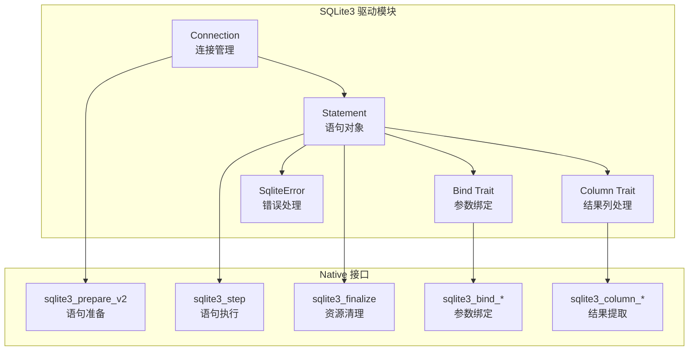
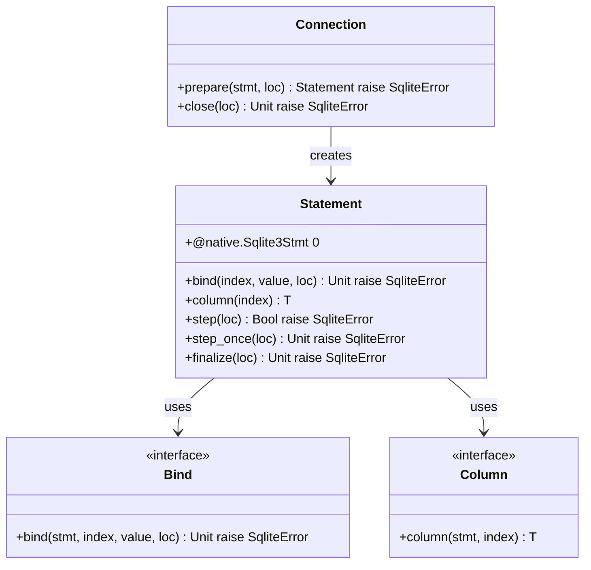
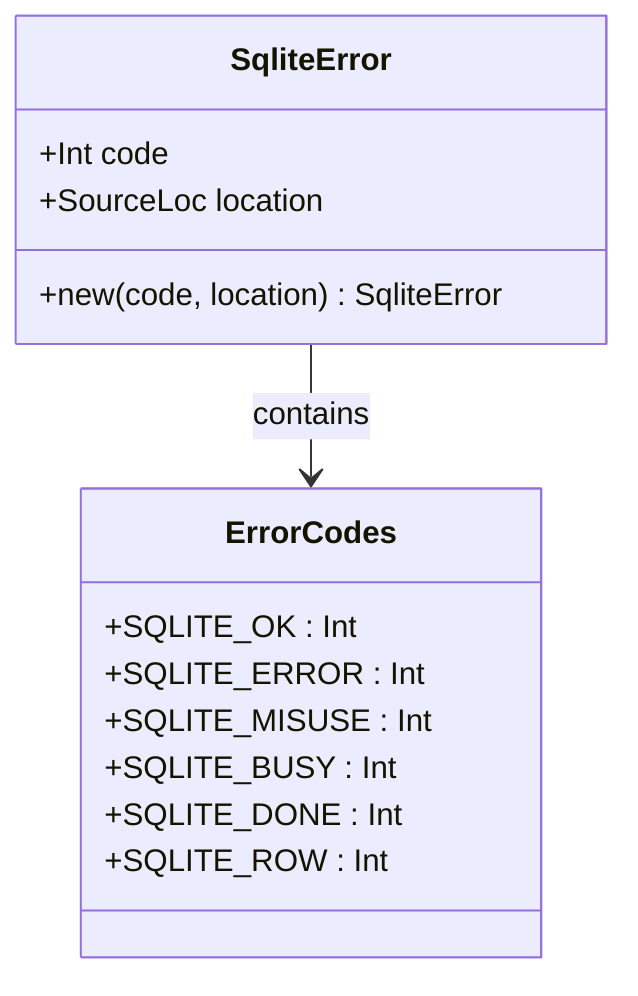
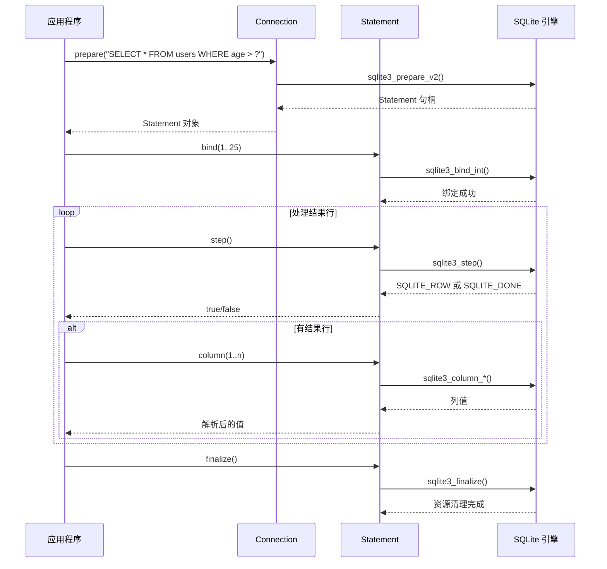
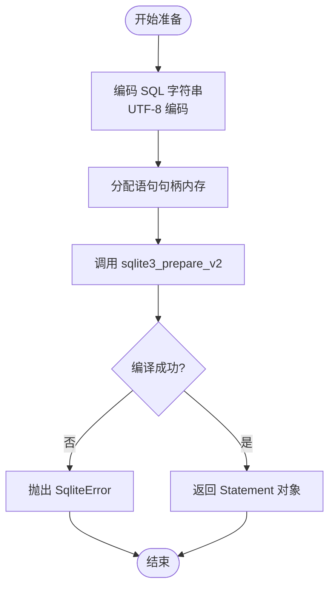
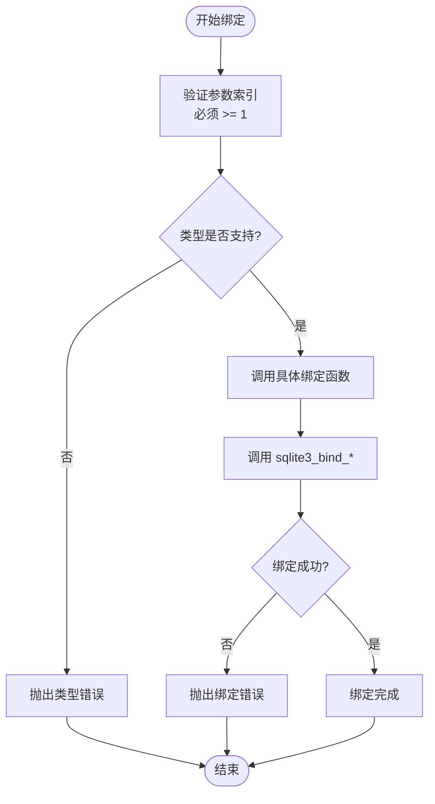
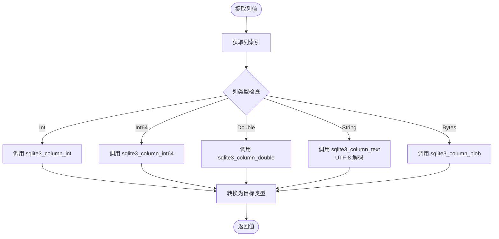
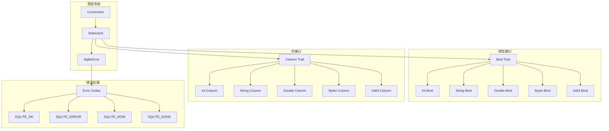
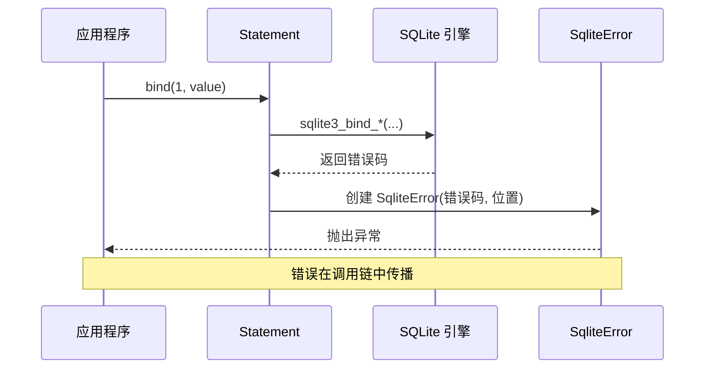

# 语句准备和执行

<cite>
**本文档引用的文件**
- [stmt.mbt](file://stmt.mbt)
- [pkg.generated.mbti](file://pkg.generated.mbti)
- [bind.mbt](file://bind.mbt)
- [column.mbt](file://column.mbt)
- [sqlite3.h](file://native/sqlite3.h)
</cite>

## 目录
1. [简介](#简介)
2. [项目结构](#项目结构)
3. [核心组件](#核心组件)
4. [架构概览](#架构概览)
5. [详细组件分析](#详细组件分析)
6. [依赖关系分析](#依赖关系分析)
7. [性能考虑](#性能考虑)
8. [故障排除指南](#故障排除指南)
9. [结论](#结论)

## 简介

本文档深入介绍了 MoonBit SQLite3 驱动中 Statement 类的核心功能和使用模式。该驱动提供了对 SQLite 数据库的类型安全访问，支持 SQL 语句的准备、参数绑定、执行和结果处理。文档将详细说明 prepare() 方法的使用、bind() 方法的参数绑定机制、step() 和 step_once() 方法的区别，以及语句生命周期管理的最佳实践。

## 项目结构

该项目采用模块化设计，主要包含以下关键组件：



**图表来源**
- [stmt.mbt:1-73](file://stmt.mbt#L1-L73)
- [pkg.generated.mbti:89-135](file://pkg.generated.mbti#L89-L135)

**章节来源**
- [stmt.mbt:1-73](file://stmt.mbt#L1-L73)
- [pkg.generated.mbti:1-135](file://pkg.generated.mbti#L1-L135)

## 核心组件

### Statement 结构体

Statement 是 SQLite3 驱动的核心数据结构，封装了底层的 SQLite 语句句柄：



**图表来源**
- [stmt.mbt:2](file://stmt.mbt#L2)
- [pkg.generated.mbti:107-116](file://pkg.generated.mbti#L107-L116)

### 错误处理系统

驱动使用自定义的 SqliteError 类型来统一处理 SQLite 操作中的错误：



**图表来源**
- [pkg.generated.mbti:83-85](file://pkg.generated.mbti#L83-L85)
- [pkg.generated.mbti:62-74](file://pkg.generated.mbti#L62-L74)

**章节来源**
- [stmt.mbt:1-73](file://stmt.mbt#L1-L73)
- [pkg.generated.mbti:83-135](file://pkg.generated.mbti#L83-L135)

## 架构概览

整个语句执行流程遵循标准的 SQLite 模式：准备语句 → 绑定参数 → 执行循环 → 清理资源。



**图表来源**
- [stmt.mbt:6-19](file://stmt.mbt#L6-L19)
- [stmt.mbt:23-30](file://stmt.mbt#L23-L30)
- [stmt.mbt:39-49](file://stmt.mbt#L39-L49)
- [stmt.mbt:64-72](file://stmt.mbt#L64-L72)

## 详细组件分析

### prepare() 方法详解

prepare() 方法负责将 SQL 语句编译为可执行的 SQLite 语句对象：

#### 准备过程
1. **SQL 字符串编码**：将输入的字符串转换为 UTF-8 编码
2. **内存分配**：为语句句柄分配内存空间
3. **编译执行**：调用 SQLite 的 prepare_v2 函数进行语句编译
4. **状态检查**：验证编译结果并返回适当的错误信息

#### 使用模式


**图表来源**
- [stmt.mbt:10-19](file://stmt.mbt#L10-L19)

**章节来源**
- [stmt.mbt:6-19](file://stmt.mbt#L6-L19)

### bind() 方法参数绑定机制

bind() 方法实现了类型安全的参数绑定，支持多种数据类型：

#### 支持的数据类型
- **整数类型**：Int、Int64
- **浮点类型**：Double
- **文本类型**：String（自动 UTF-8 编码）
- **二进制类型**：Bytes

#### 参数索引规则
- **索引从 1 开始**：第一个参数使用索引 1，第二个参数使用索引 2，以此类推
- **位置绑定**：参数按声明顺序绑定到占位符
- **类型安全**：通过泛型约束确保绑定的类型正确

#### 绑定流程


**图表来源**
- [bind.mbt:2-4](file://bind.mbt#L2-L4)
- [bind.mbt:7-12](file://bind.mbt#L7-L12)

**章节来源**
- [bind.mbt:1-48](file://bind.mbt#L1-L48)
- [pkg.generated.mbti:121-126](file://pkg.generated.mbti#L121-L126)

### step() 和 step_once() 方法对比

这两个方法都用于执行已准备的语句，但有不同的使用场景：

#### step() 方法
- **返回布尔值**：true 表示有新行可用，false 表示执行完成
- **适合查询语句**：主要用于 SELECT 查询等会产生多行结果的语句
- **循环控制**：可以配合 while 循环处理多行结果

#### step_once() 方法
- **无返回值**：只执行一次步骤
- **严格模式**：如果语句仍有可用行，会抛出错误
- **适合非查询语句**：主要用于 INSERT、UPDATE、DELETE 等不会产生结果行的语句

```mermaid
flowchart TD
Start([执行语句]) --> StepType{"选择执行方法"}
StepType --> |step()| StepLoop["执行 sqlite3_step()<br/>检查返回码"]
StepType --> |step_once()| StepOnce["执行 sqlite3_step()<br/>严格检查"]
StepLoop --> CheckRow{"返回码检查"}
CheckRow --> |SQLITE_ROW| HasRow["返回 true<br/>有新行"]
CheckRow --> |SQLITE_DONE| Done["返回 false<br/>执行完成"]
CheckRow --> |其他| Error["抛出 SqliteError"]
StepOnce --> CheckStrict{"仍有可用行?"}
CheckStrict --> |是| StrictError["抛出 SQLITE_ROW 错误"]
CheckStrict --> |否| Success["执行成功"]
HasRow --> End([结束])
Done --> End
Error --> End
StrictError --> End
Success --> End
```

**图表来源**
- [stmt.mbt:39-49](file://stmt.mbt#L39-L49)
- [stmt.mbt:53-60](file://stmt.mbt#L53-L60)

**章节来源**
- [stmt.mbt:39-60](file://stmt.mbt#L39-L60)

### column() 方法结果提取

column() 方法用于从当前结果行中提取指定索引的列值：

#### 支持的列类型
- **整数类型**：Int、Int64
- **浮点类型**：Double
- **文本类型**：String（自动 UTF-8 解码）
- **二进制类型**：Bytes

#### 提取流程


**图表来源**
- [column.mbt:2-4](file://column.mbt#L2-L4)
- [column.mbt:7-29](file://column.mbt#L7-L29)

**章节来源**
- [column.mbt:1-29](file://column.mbt#L1-L29)

### finalize() 方法资源管理

finalize() 方法负责释放语句占用的所有资源：

#### 生命周期管理
- **强制清理**：无论语句执行是否完成，都必须调用 finalize() 释放资源
- **异常安全**：即使在执行过程中发生错误，也要确保资源得到清理
- **内存管理**：释放底层 SQLite 分配的内存空间

#### 最佳实践
- 在 try-finally 块中使用 finalize()
- 避免语句对象超出作用域时泄漏
- 对于长时间运行的应用，定期检查资源使用情况

**章节来源**
- [stmt.mbt:64-72](file://stmt.mbt#L64-L72)

## 依赖关系分析

### 类型系统依赖



**图表来源**
- [pkg.generated.mbti:107-135](file://pkg.generated.mbti#L107-L135)
- [bind.mbt:1-48](file://bind.mbt#L1-L48)
- [column.mbt:1-29](file://column.mbt#L1-L29)

### 错误传播机制



**图表来源**
- [bind.mbt:8-11](file://bind.mbt#L8-L11)
- [stmt.mbt:109-116](file://stmt.mbt#L109-L116)

**章节来源**
- [pkg.generated.mbti:83-85](file://pkg.generated.mbti#L83-L85)
- [bind.mbt:1-48](file://bind.mbt#L1-L48)
- [stmt.mbt:1-73](file://stmt.mbt#L1-L73)

## 性能考虑

### 语句复用策略

虽然当前实现没有直接提供重置功能，但可以通过以下方式优化性能：

1. **语句缓存**：对于重复执行的相同 SQL 语句，可以缓存 Statement 对象
2. **参数绑定优化**：避免频繁创建和销毁语句对象
3. **批量操作**：使用事务包装多个操作以减少开销

### 内存管理

- **及时清理**：确保每个 Statement 对象在使用后都调用 finalize()
- **避免泄漏**：在异常情况下也要保证资源清理
- **监控内存**：对于大量临时语句，建议监控内存使用情况

### 执行效率

- **索引利用**：合理设计数据库索引以提高查询性能
- **参数化查询**：使用参数绑定避免 SQL 注入同时提高缓存效率
- **批处理**：对于大量相似操作，考虑使用批处理方式

## 故障排除指南

### 常见错误类型

| 错误代码 | 含义 | 可能原因 | 解决方案 |
|---------|------|----------|----------|
| SQLITE_MISUSE | 使用不当 | 参数索引无效或类型不匹配 | 检查参数索引从 1 开始，确认数据类型正确 |
| SQLITE_BUSY | 数据库忙 | 数据库被其他连接锁定 | 实现重试逻辑或调整并发策略 |
| SQLITE_ERROR | 一般错误 | 语法错误或其他 SQLite 错误 | 检查 SQL 语法和数据库状态 |
| SQLITE_RANGE | 索引越界 | 访问不存在的列或参数 | 验证列索引和参数数量 |

### 调试技巧

1. **启用详细日志**：记录 SQL 语句和参数值
2. **检查返回码**：在每个 SQLite 调用后检查返回码
3. **单元测试**：为关键路径编写单元测试
4. **资源监控**：监控语句对象的数量和生命周期

### 最佳实践清单

- ✅ 始终在 finally 块中调用 finalize()
- ✅ 参数索引必须从 1 开始且连续
- ✅ 使用类型安全的绑定方法
- ✅ 对于查询语句使用 step() 循环处理
- ✅ 对于非查询语句使用 step_once() 进行严格检查
- ✅ 及时处理和记录错误信息
- ✅ 合理设计数据库索引以提高性能

**章节来源**
- [pkg.generated.mbti:62-74](file://pkg.generated.mbti#L62-L74)
- [stmt.mbt:109-116](file://stmt.mbt#L109-L116)

## 结论

MoonBit SQLite3 驱动提供了类型安全、易于使用的数据库访问接口。通过理解 Statement 类的核心功能和正确的使用模式，开发者可以构建高效、可靠的数据库应用程序。

关键要点总结：
- **类型安全**：通过泛型和接口确保编译时类型检查
- **资源管理**：严格的生命周期管理确保资源正确释放
- **错误处理**：统一的错误类型提供清晰的错误信息
- **性能优化**：合理的使用模式和最佳实践提升应用性能

建议开发者在实际项目中遵循本文档提供的最佳实践，以确保代码的质量和可靠性。