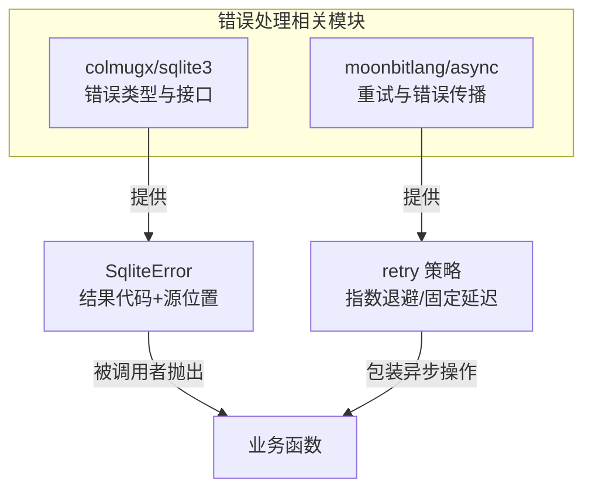
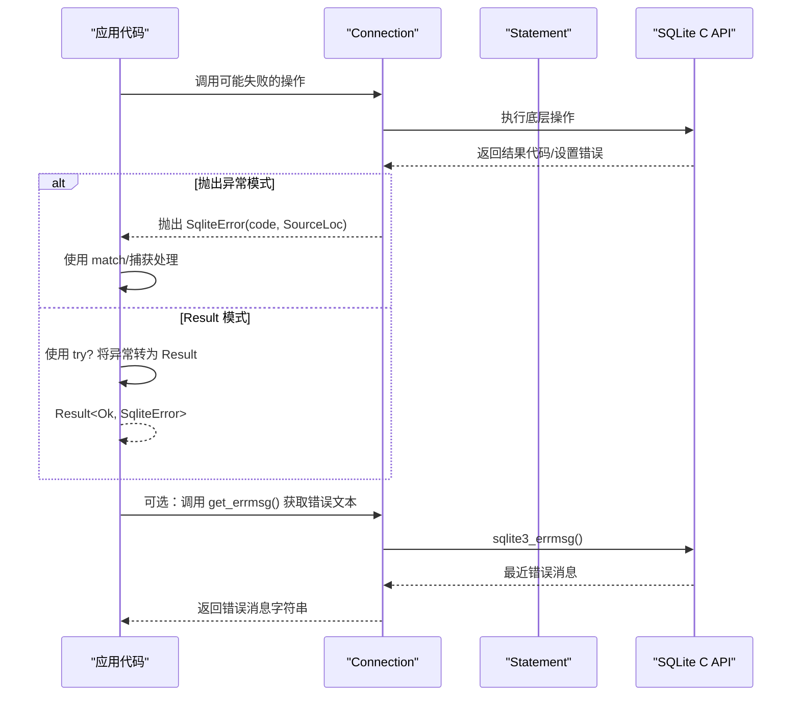
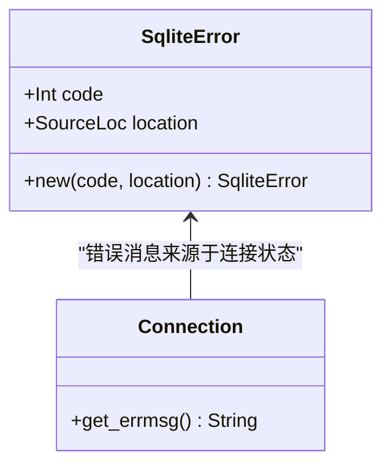
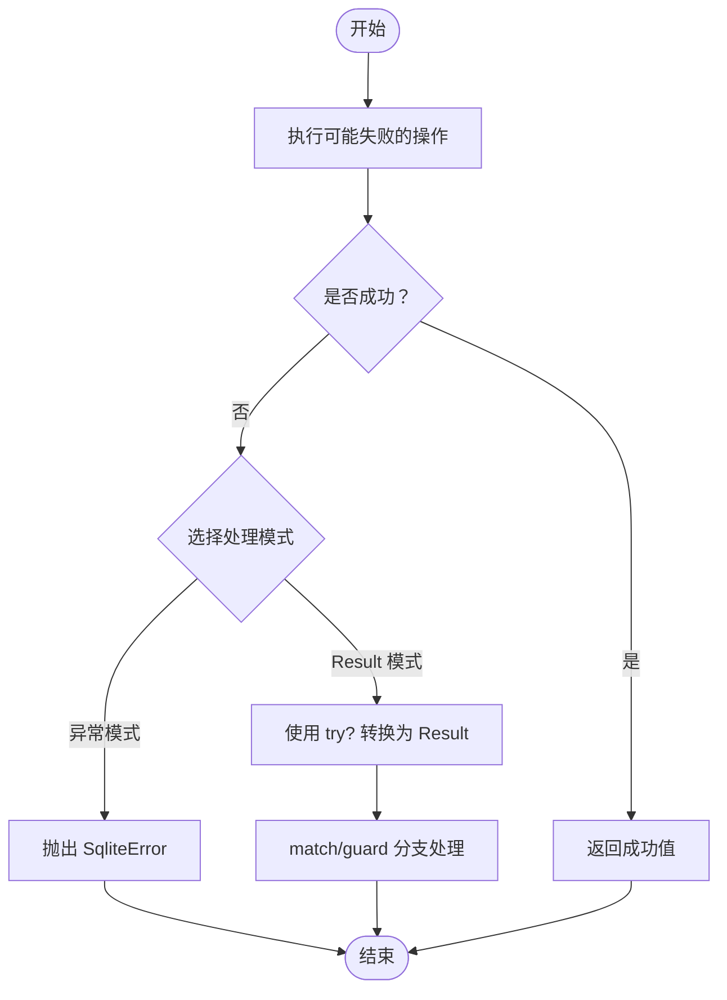
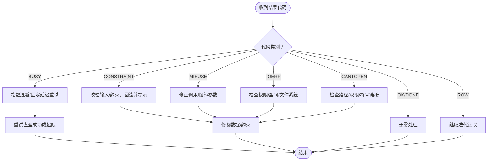
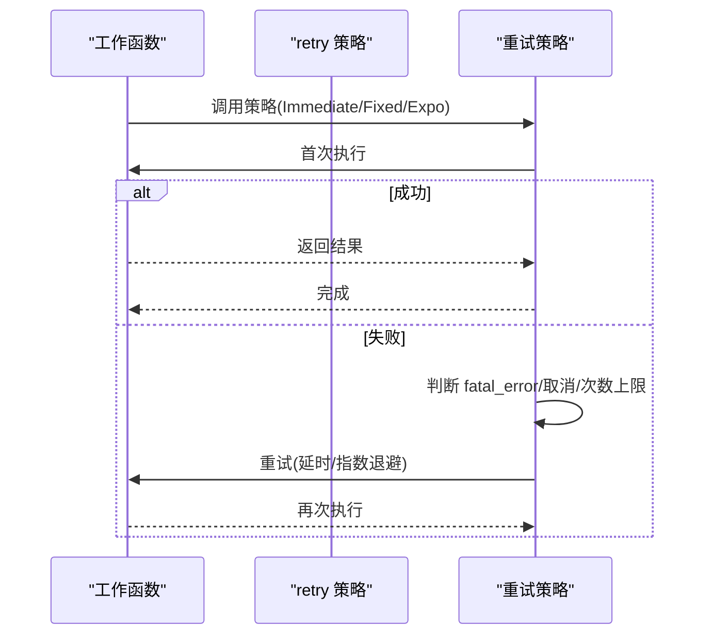
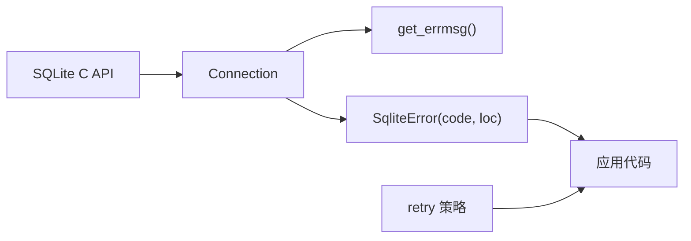

# 错误处理机制

<cite>
**本文引用的文件**
- [error.mbt](file://.repos/colmugx/sqlite3/0.2.0/error.mbt)
- [README.mbt.md](file://.repos/colmugx/sqlite3/0.2.0/README.mbt.md)
- [sqlite3.h](file://.repos/colmugx/sqlite3/0.2.0/native/sqlite3.h)
- [async.mbt](file://.repos/moonbitlang/async/0.19.1/src/async.mbt)
- [retry_test.mbt](file://.repos/moonbitlang/async/0.19.1/src/retry_test.mbt)
</cite>

## 目录
1. [简介](#简介)
2. [项目结构](#项目结构)
3. [核心组件](#核心组件)
4. [架构总览](#架构总览)
5. [详细组件分析](#详细组件分析)
6. [依赖关系分析](#依赖关系分析)
7. [性能考量](#性能考量)
8. [故障排除指南](#故障排除指南)
9. [结论](#结论)
10. [附录](#附录)

## 简介
本文件系统性地阐述 MoonBit SQLite 绑定中的错误处理机制，重点围绕 SqliteError 的结构与使用方式展开，覆盖两种错误处理模式（异常抛出与 Result 类型处理）、结果代码与源位置信息、常见 SQLite 结果代码的含义与处理策略、错误分类与恢复机制（如 SQLITE_BUSY、SQLITE_CONSTRAINT），以及 try? 操作符的显式错误处理用法。同时提供错误日志记录与调试的最佳实践、实际错误处理示例路径与故障排除指南，并解释错误消息获取与诊断技巧。

## 项目结构
该仓库包含 MoonBit SQLite 绑定与 MoonBit 异步库两部分，错误处理相关内容主要集中在 colmugx/sqlite3 包中，异步重试与错误传播在 moonbitlang/async 中有参考实现。

**图表来源**
- [error.mbt:1-16](file://.repos/colmugx/sqlite3/0.2.0/error.mbt#L1-L16)
- [README.mbt.md:148-187](file://.repos/colmugx/sqlite3/0.2.0/README.mbt.md#L148-L187)
- [async.mbt:166-211](file://.repos/moonbitlang/async/0.19.1/src/async.mbt#L166-L211)

**章节来源**
- [README.mbt.md:148-187](file://.repos/colmugx/sqlite3/0.2.0/README.mbt.md#L148-L187)

## 核心组件
- SqliteError：封装 (Int, SourceLoc)，用于携带 SQLite 结果代码与抛错时的源码位置，便于匹配与定位。
- 连接级错误消息：通过 Connection::get_errmsg 获取最近一次错误的 UTF-8 文本，辅助诊断。
- 结果常量：导出常用 SQLite 结果代码（如 SQLITE_OK、SQLITE_ROW、SQLITE_DONE、SQLITE_ERROR、SQLITE_BUSY、SQLITE_CONSTRAINT、SQLITE_CANTOPEN 等），便于上层分类与诊断。
- 异步重试：moonbitlang/async 提供 retry 策略（Immediate、FixedDelay、ExponentialDelay），可与错误处理结合实现自动恢复。

**章节来源**
- [error.mbt:1-16](file://.repos/colmugx/sqlite3/0.2.0/error.mbt#L1-L16)
- [README.mbt.md:210-224](file://.repos/colmugx/sqlite3/0.2.0/README.mbt.md#L210-L224)
- [async.mbt:166-211](file://.repos/moonbitlang/async/0.19.1/src/async.mbt#L166-L211)

## 架构总览
下图展示了错误从底层 SQLite 返回到上层 MoonBit 代码的整体流程，以及两种处理模式的入口。

**图表来源**
- [error.mbt:7-10](file://.repos/colmugx/sqlite3/0.2.0/error.mbt#L7-L10)
- [README.mbt.md:148-187](file://.repos/colmugx/sqlite3/0.2.0/README.mbt.md#L148-L187)

## 详细组件分析

### SqliteError 结构与使用
- 结构定义：SqliteError 包含 (Int, SourceLoc)，其中 Int 为 SQLite 结果代码，SourceLoc 为抛错处的源码位置，便于定位问题。
- 构造函数：SqliteError::new(code, loc) 用于构造错误值。
- 连接级错误消息：Connection::get_errmsg() 通过 sqlite3_errmsg 获取最近一次错误文本，返回 UTF-8 字符串。

**图表来源**
- [error.mbt:2-15](file://.repos/colmugx/sqlite3/0.2.0/error.mbt#L2-L15)

**章节来源**
- [error.mbt:1-16](file://.repos/colmugx/sqlite3/0.2.0/error.mbt#L1-L16)

### 两种错误处理模式
- 异常抛出模式：所有可能失败的公共操作均会抛出 SqliteError；上层通过 match 或捕获处理。
- Result 类型模式：使用 try? 将异常转换为 Result，从而以显式分支处理错误，避免异常传播。

**图表来源**
- [README.mbt.md:148-170](file://.repos/colmugx/sqlite3/0.2.0/README.mbt.md#L148-L170)

**章节来源**
- [README.mbt.md:148-170](file://.repos/colmugx/sqlite3/0.2.0/README.mbt.md#L148-L170)

### 结果代码与源位置信息
- 结果代码：SqliteError 携带 SQLite 原生结果代码，便于按类别处理（如 SQLITE_BUSY、SQLITE_CONSTRAINT、SQLITE_MISUSE 等）。
- 源位置信息：SourceLoc 记录抛错位置，有助于快速定位调用点。
- 常用结果代码导出：包内导出常见结果代码常量，便于上层进行分类与诊断。

**章节来源**
- [README.mbt.md:210-224](file://.repos/colmugx/sqlite3/0.2.0/README.mbt.md#L210-L224)
- [error.mbt:13-15](file://.repos/colmugx/sqlite3/0.2.0/error.mbt#L13-L15)

### 常见 SQLite 结果代码与处理策略
以下为常见结果代码的语义与建议处理策略（基于 SQLite 头文件定义与 MoonBit 绑定导出）：

- SQLITE_OK（0）：成功，无需处理。
- SQLITE_BUSY（5）：数据库文件被锁，建议采用指数退避或固定延迟重试，或稍后重试。
- SQLITE_CONSTRAINT（19）：约束违反，建议检查输入数据、唯一键冲突、外键约束等，必要时回滚事务并提示用户。
- SQLITE_MISUSE（21）：库使用不当，通常意味着 API 调用顺序或参数错误，应修正调用逻辑。
- SQLITE_IOERR（10）：磁盘 I/O 错误，建议检查存储权限、磁盘空间、文件系统状态。
- SQLITE_CANTOPEN（14）：无法打开数据库文件，检查路径、权限、符号链接、临时目录等。
- SQLITE_ROW（100）、SQLITE_DONE（101）：查询迭代状态，非错误，但需正确处理循环与完成条件。

**图表来源**
- [sqlite3.h:446-477](file://.repos/colmugx/sqlite3/0.2.0/native/sqlite3.h#L446-L477)
- [sqlite3.h:497-572](file://.repos/colmugx/sqlite3/0.2.0/native/sqlite3.h#L497-L572)

**章节来源**
- [sqlite3.h:446-477](file://.repos/colmugx/sqlite3/0.2.0/native/sqlite3.h#L446-L477)
- [sqlite3.h:497-572](file://.repos/colmugx/sqlite3/0.2.0/native/sqlite3.h#L497-L572)

### 错误分类与恢复机制
- 分类依据：基于结果代码进行分类（如 I/O 类、约束类、锁等待类、使用不当类）。
- 恢复策略：
  - 对于 SQLITE_BUSY，可采用指数退避或固定延迟重试，结合最大重试次数与致命错误过滤器。
  - 对于 SQLITE_CONSTRAINT，优先检查输入与约束，必要时回滚并提示用户。
  - 对于 SQLITE_IOERR/CANTOPEN，检查系统环境与权限。
- 参考实现：moonbitlang/async 的 retry 函数提供了 Immediate、FixedDelay、ExponentialDelay 三种策略，支持 fatal_error 过滤与取消传播。

**图表来源**
- [async.mbt:166-211](file://.repos/moonbitlang/async/0.19.1/src/async.mbt#L166-L211)
- [retry_test.mbt:16-78](file://.repos/moonbitlang/async/0.19.1/src/retry_test.mbt#L16-L78)

**章节来源**
- [async.mbt:166-211](file://.repos/moonbitlang/async/0.19.1/src/async.mbt#L166-L211)
- [retry_test.mbt:16-78](file://.repos/moonbitlang/async/0.19.1/src/retry_test.mbt#L16-L78)

### try? 操作符与显式错误处理
- 作用：将可能抛出异常的表达式转换为 Result，从而以显式分支替代异常传播。
- 示例路径：README 中的“error handling”测试展示了如何使用 try? 将 Connection::prepare 的异常转换为 Result，并断言错误存在与获取错误消息。

**章节来源**
- [README.mbt.md:152-168](file://.repos/colmugx/sqlite3/0.2.0/README.mbt.md#L152-L168)

### 错误消息获取与诊断技巧
- 获取最近错误消息：通过 Connection::get_errmsg() 获取 UTF-8 错误文本，辅助定位问题。
- 错误偏移与描述：SQLite 提供 sqlite3_error_offset() 与 sqlite3_errstr()，可用于定位 SQL 中的错误位置与获取英文错误描述（绑定中通过连接级接口暴露）。
- 日志记录：可结合异步库的错误传播与重试机制，记录重试次数、延迟时间与最终错误，便于排障。

**章节来源**
- [error.mbt:7-10](file://.repos/colmugx/sqlite3/0.2.0/error.mbt#L7-L10)
- [sqlite3.h:4090-4129](file://.repos/colmugx/sqlite3/0.2.0/native/sqlite3.h#L4090-L4129)

## 依赖关系分析
- SqliteError 依赖 SQLite 结果代码与源位置信息，用于精确分类与定位。
- 连接级错误消息依赖 SQLite 的 sqlite3_errmsg 接口。
- 异步重试策略与错误处理解耦，可在业务层组合使用。

**图表来源**
- [error.mbt:7-15](file://.repos/colmugx/sqlite3/0.2.0/error.mbt#L7-L15)
- [async.mbt:166-211](file://.repos/moonbitlang/async/0.19.1/src/async.mbt#L166-L211)

**章节来源**
- [error.mbt:1-16](file://.repos/colmugx/sqlite3/0.2.0/error.mbt#L1-L16)
- [async.mbt:166-211](file://.repos/moonbitlang/async/0.19.1/src/async.mbt#L166-L211)

## 性能考量
- 重试策略选择：指数退避适合波动性较高的场景，固定延迟适合确定性延迟需求；注意设置最大重试次数与超时，避免无限重试导致资源耗尽。
- 错误消息获取：频繁调用 get_errmsg() 仅用于诊断，不应在热路径中过度使用。
- I/O 错误与锁等待：对 SQLITE_BUSY 与 SQLITE_IOERR 应区分处理，避免不必要的重试与阻塞。

## 故障排除指南
- SQLITE_BUSY：检查并发写入、事务持有时间、文件系统锁；采用指数退避重试并设置上限。
- SQLITE_CONSTRAINT：核对唯一键、外键、NOT NULL 等约束；回滚并提示具体约束名称。
- SQLITE_MISUSE：检查参数索引（参数从 1 开始）、列索引（从 0 开始）与语句生命周期；确保 finalize/close 正确调用。
- SQLITE_IOERR/CANTOPEN：检查路径、权限、磁盘空间、符号链接与临时目录配置。
- 获取诊断信息：使用 get_errmsg() 获取最近错误文本；结合 SourceLoc 快速定位调用点。

**章节来源**
- [README.mbt.md:201-209](file://.repos/colmugx/sqlite3/0.2.0/README.mbt.md#L201-L209)
- [error.mbt:7-10](file://.repos/colmugx/sqlite3/0.2.0/error.mbt#L7-L10)

## 结论
MoonBit SQLite 绑定通过 SqliteError 将 SQLite 结果代码与源位置信息结合，既支持异常抛出模式也支持 Result 显式处理模式。配合连接级错误消息与常见结果代码导出，开发者可以高效地进行错误分类与诊断。对于可恢复错误（如 SQLITE_BUSY），可结合异步库的 retry 策略实现自动恢复；对于不可恢复错误（如 SQLITE_MISUSE、约束冲突），应通过修正调用或输入数据来解决。实践中建议在热路径中谨慎使用重试与错误消息获取，平衡性能与可观测性。

## 附录
- 实际示例路径（不展示代码内容）：
  - 异常抛出与 Result 模式的示例：[README.mbt.md:152-168](file://.repos/colmugx/sqlite3/0.2.0/README.mbt.md#L152-L168)
  - 常用结果代码导出列表：[README.mbt.md:210-224](file://.repos/colmugx/sqlite3/0.2.0/README.mbt.md#L210-L224)
  - 异步重试策略与测试：[async.mbt:166-211](file://.repos/moonbitlang/async/0.19.1/src/async.mbt#L166-L211)、[retry_test.mbt:16-78](file://.repos/moonbitlang/async/0.19.1/src/retry_test.mbt#L16-L78)
- 参考 SQLite 结果代码与扩展结果代码：
  - [sqlite3.h:446-477](file://.repos/colmugx/sqlite3/0.2.0/native/sqlite3.h#L446-L477)
  - [sqlite3.h:497-572](file://.repos/colmugx/sqlite3/0.2.0/native/sqlite3.h#L497-L572)