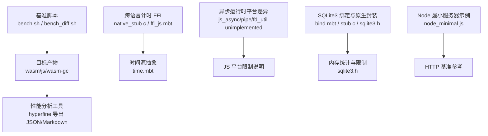
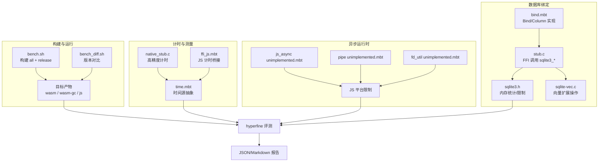
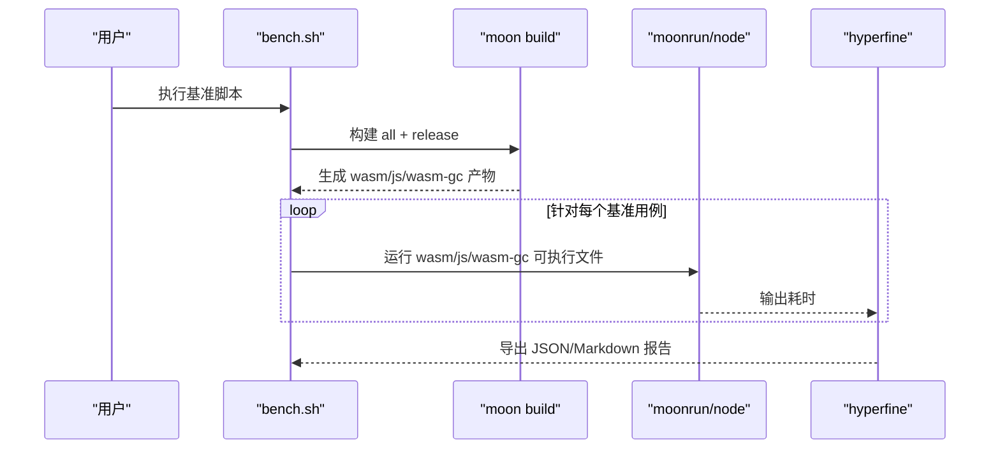
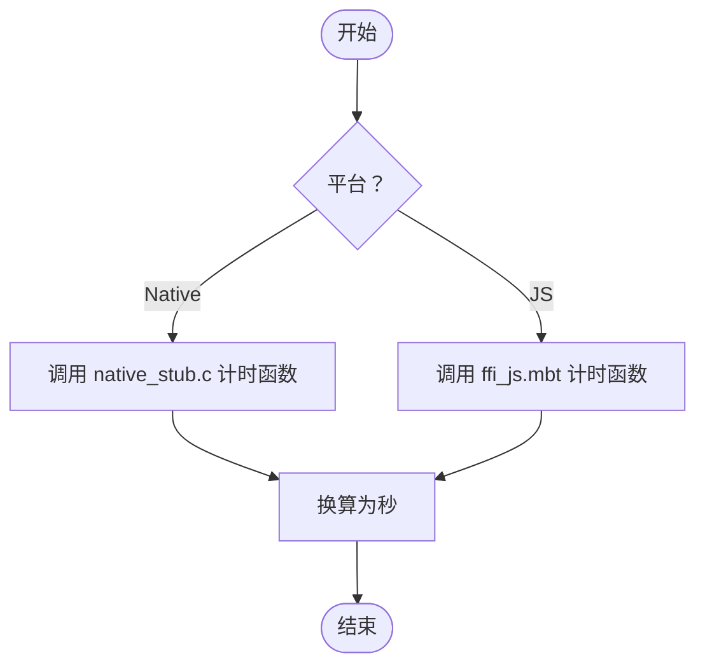
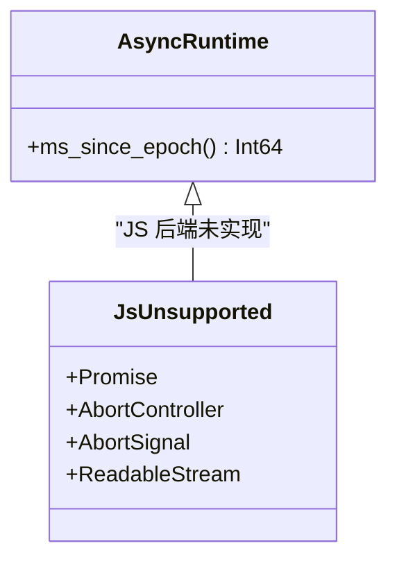
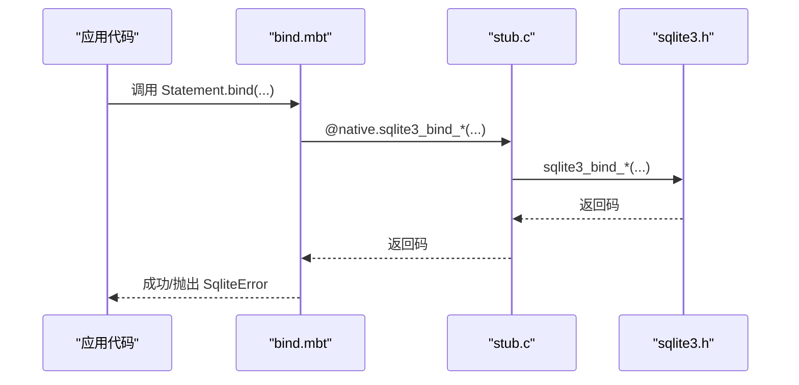
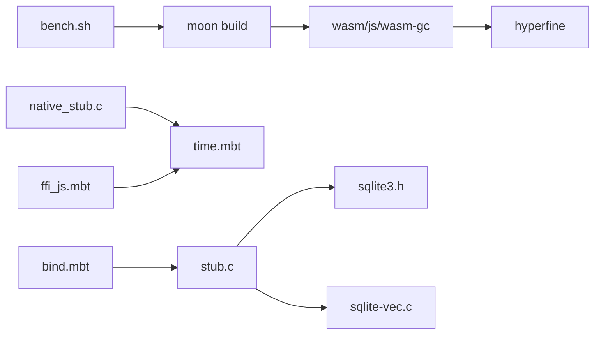

# 性能优化

<cite>
**本文引用的文件**
- [bench.sh](file://.repos/moonbitlang/x/0.4.43/encoding/internal/benchmark/bench.sh)
- [bench_diff.sh](file://.repos/moonbitlang/x/0.4.43/encoding/internal/benchmark/bench_diff.sh)
- [native_stub.c](file://.repos/moonbitlang/x/0.4.43/benchmark/internal/benchmark_ffi/native_stub.c)
- [ffi_js.mbt](file://.repos/moonbitlang/x/0.4.43/benchmark/internal/benchmark_ffi/ffi_js.mbt)
- [time.mbt](file://.repos/moonbitlang/async/0.19.1/src/internal/time/time.mbt)
- [unimplemented.mbt（async js）](file://.repos/moonbitlang/async/0.19.1/src/js_async/unimplemented.mbt)
- [unimplemented.mbt（async pipe）](file://.repos/moonbitlang/async/0.19.1/src/pipe/unimplemented.mbt)
- [unimplemented.mbt（async fd_util）](file://.repos/moonbitlang/async/0.19.1/src/internal/fd_util/unimplemented.mbt)
- [bind.mbt](file://.repos/colmugx/sqlite3/0.2.0/bind.mbt)
- [sqlite3.h](file://.repos/colmugx/sqlite3/0.2.0/native/sqlite3.h)
- [stub.c](file://.repos/colmugx/sqlite3/0.2.0/native/stub.c)
- [sqlite-vec.c](file://.repos/colmugx/sqlite3/0.2.0/native/sqlite-vec.c)
- [node_minimal.js](file://.repos/bobzhang/crescent/0.10.0/benchmarks/node_minimal.js)
</cite>

## 目录
1. [简介](#简介)
2. [项目结构](#项目结构)
3. [核心组件](#核心组件)
4. [架构总览](#架构总览)
5. [详细组件分析](#详细组件分析)
6. [依赖关系分析](#依赖关系分析)
7. [性能考量](#性能考量)
8. [故障排查指南](#故障排查指南)
9. [结论](#结论)
10. [附录](#附录)

## 简介
本指南面向 MoonBit 项目，系统性地梳理编译与运行时优化、多目标平台（JS/WASM/Native）性能差异与策略、内存与垃圾回收优化、异步编程对性能的影响、SQLite3 绑定库的查询与绑定优化、性能分析与基准测试方法，以及缓存与数据预取策略。内容基于仓库中现有的基准脚本、跨语言 FFI 计时实现、异步运行时平台差异、SQLite3 绑定与原生封装等实际代码片段进行归纳总结。

## 项目结构
本仓库以“子模块”形式组织 MoonBit 生态组件，围绕以下主题展开：
- 基准与对比：MoonBit 编码/解码基准、跨语言对比脚本、Node 最小服务器示例
- 异步运行时：JS 后端不支持项、时间源与平台差异、Promise/Abort 支持范围
- 数据库绑定：SQLite3 绑定接口、原生 FFI 封装、内存统计与限制
- 跨语言计时：JS 与 Native 的高精度计时 FFI 实现

图表来源
- [bench.sh:1-53](file://.repos/moonbitlang/x/0.4.43/encoding/internal/benchmark/bench.sh#L1-L53)
- [bench_diff.sh:51-73](file://.repos/moonbitlang/x/0.4.43/encoding/internal/benchmark/bench_diff.sh#L51-L73)
- [native_stub.c:1-37](file://.repos/moonbitlang/x/0.4.43/benchmark/internal/benchmark_ffi/native_stub.c#L1-L37)
- [ffi_js.mbt:1-29](file://.repos/moonbitlang/x/0.4.43/benchmark/internal/benchmark_ffi/ffi_js.mbt#L1-L29)
- [time.mbt:1-69](file://.repos/moonbitlang/async/0.19.1/src/internal/time/time.mbt#L1-L69)
- [unimplemented.mbt（async js）:1-234](file://.repos/moonbitlang/async/0.19.1/src/js_async/unimplemented.mbt#L1-L234)
- [unimplemented.mbt（async pipe）:1-24](file://.repos/moonbitlang/async/0.19.1/src/pipe/unimplemented.mbt#L1-L24)
- [unimplemented.mbt（async fd_util）:1-25](file://.repos/moonbitlang/async/0.19.1/src/internal/fd_util/unimplemented.mbt#L1-L25)
- [bind.mbt:1-49](file://.repos/colmugx/sqlite3/0.2.0/bind.mbt#L1-L49)
- [sqlite3.h:1768-7184](file://.repos/colmugx/sqlite3/0.2.0/native/sqlite3.h#L1768-L7184)
- [stub.c:127-190](file://.repos/colmugx/sqlite3/0.2.0/native/stub.c#L127-L190)
- [node_minimal.js:1-10](file://.repos/bobzhang/crescent/0.10.0/benchmarks/node_minimal.js#L1-L10)

章节来源
- [bench.sh:1-53](file://.repos/moonbitlang/x/0.4.43/encoding/internal/benchmark/bench.sh#L1-L53)
- [bench_diff.sh:51-73](file://.repos/moonbitlang/x/0.4.43/encoding/internal/benchmark/bench_diff.sh#L51-L73)
- [native_stub.c:1-37](file://.repos/moonbitlang/x/0.4.43/benchmark/internal/benchmark_ffi/native_stub.c#L1-L37)
- [ffi_js.mbt:1-29](file://.repos/moonbitlang/x/0.4.43/benchmark/internal/benchmark_ffi/ffi_js.mbt#L1-L29)
- [time.mbt:1-69](file://.repos/moonbitlang/async/0.19.1/src/internal/time/time.mbt#L1-L69)
- [unimplemented.mbt（async js）:1-234](file://.repos/moonbitlang/async/0.19.1/src/js_async/unimplemented.mbt#L1-L234)
- [unimplemented.mbt（async pipe）:1-24](file://.repos/moonbitlang/async/0.19.1/src/pipe/unimplemented.mbt#L1-L24)
- [unimplemented.mbt（async fd_util）:1-25](file://.repos/moonbitlang/async/0.19.1/src/internal/fd_util/unimplemented.mbt#L1-L25)
- [bind.mbt:1-49](file://.repos/colmugx/sqlite3/0.2.0/bind.mbt#L1-L49)
- [sqlite3.h:1768-7184](file://.repos/colmugx/sqlite3/0.2.0/native/sqlite3.h#L1768-L7184)
- [stub.c:127-190](file://.repos/colmugx/sqlite3/0.2.0/native/stub.c#L127-L190)
- [node_minimal.js:1-10](file://.repos/bobzhang/crescent/0.10.0/benchmarks/node_minimal.js#L1-L10)

## 核心组件
- 基准与对比
  - 使用统一的构建与运行流程，针对 wasm、wasm-gc、js 三种目标导出结果，并通过 hyperfine 进行对比评测，输出 JSON/Markdown 报告，便于版本间回归分析。
- 跨语言计时 FFI
  - Native 使用高精度计时 API 获取起止时间与秒级转换；JS 侧通过 Date 对象计算耗时，作为跨语言计时的桥接层。
- 异步运行时平台差异
  - 在 JS 后端，部分异步类型与功能未实现或不可用，需在设计阶段规避相关路径。
- SQLite3 绑定与原生封装
  - MoonBit 侧定义 Bind/Column trait 与实现，原生侧通过 FFI 调用 sqlite3 接口；同时提供内存统计与软硬堆限制配置入口。

章节来源
- [bench.sh:1-53](file://.repos/moonbitlang/x/0.4.43/encoding/internal/benchmark/bench.sh#L1-L53)
- [bench_diff.sh:51-73](file://.repos/moonbitlang/x/0.4.43/encoding/internal/benchmark/bench_diff.sh#L51-L73)
- [native_stub.c:1-37](file://.repos/moonbitlang/x/0.4.43/benchmark/internal/benchmark_ffi/native_stub.c#L1-L37)
- [ffi_js.mbt:1-29](file://.repos/moonbitlang/x/0.4.43/benchmark/internal/benchmark_ffi/ffi_js.mbt#L1-L29)
- [time.mbt:1-69](file://.repos/moonbitlang/async/0.19.1/src/internal/time/time.mbt#L1-L69)
- [unimplemented.mbt（async js）:1-234](file://.repos/moonbitlang/async/0.19.1/src/js_async/unimplemented.mbt#L1-L234)
- [bind.mbt:1-49](file://.repos/colmugx/sqlite3/0.2.0/bind.mbt#L1-L49)
- [stub.c:127-190](file://.repos/colmugx/sqlite3/0.2.0/native/stub.c#L127-L190)

## 架构总览
下图展示 MoonBit 项目在多目标平台上的性能相关架构：构建与运行、跨语言计时、异步运行时差异、数据库绑定与原生交互。

图表来源
- [bench.sh:1-53](file://.repos/moonbitlang/x/0.4.43/encoding/internal/benchmark/bench.sh#L1-L53)
- [bench_diff.sh:51-73](file://.repos/moonbitlang/x/0.4.43/encoding/internal/benchmark/bench_diff.sh#L51-L73)
- [native_stub.c:1-37](file://.repos/moonbitlang/x/0.4.43/benchmark/internal/benchmark_ffi/native_stub.c#L1-L37)
- [ffi_js.mbt:1-29](file://.repos/moonbitlang/x/0.4.43/benchmark/internal/benchmark_ffi/ffi_js.mbt#L1-L29)
- [time.mbt:1-69](file://.repos/moonbitlang/async/0.19.1/src/internal/time/time.mbt#L1-L69)
- [unimplemented.mbt（async js）:1-234](file://.repos/moonbitlang/async/0.19.1/src/js_async/unimplemented.mbt#L1-L234)
- [unimplemented.mbt（async pipe）:1-24](file://.repos/moonbitlang/async/0.19.1/src/pipe/unimplemented.mbt#L1-L24)
- [unimplemented.mbt（async fd_util）:1-25](file://.repos/moonbitlang/async/0.19.1/src/internal/fd_util/unimplemented.mbt#L1-L25)
- [bind.mbt:1-49](file://.repos/colmugx/sqlite3/0.2.0/bind.mbt#L1-L49)
- [stub.c:127-190](file://.repos/colmugx/sqlite3/0.2.0/native/stub.c#L127-L190)
- [sqlite3.h:1768-7184](file://.repos/colmugx/sqlite3/0.2.0/native/sqlite3.h#L1768-L7184)
- [sqlite-vec.c:9489-9531](file://.repos/colmugx/sqlite3/0.2.0/native/sqlite-vec.c#L9489-L9531)

## 详细组件分析

### 基准与对比流程
- 统一构建：在基准目录执行构建并产出 all 目标产物。
- 多目标运行：分别运行 wasm、wasm-gc、js 产物，使用随机种子驱动输入，确保可重复性。
- 性能对比：通过 hyperfine 对比不同目标的执行时间，导出 JSON/Markdown 报告，便于版本回归分析。

图表来源
- [bench.sh:1-53](file://.repos/moonbitlang/x/0.4.43/encoding/internal/benchmark/bench.sh#L1-L53)
- [bench_diff.sh:51-73](file://.repos/moonbitlang/x/0.4.43/encoding/internal/benchmark/bench_diff.sh#L51-L73)

章节来源
- [bench.sh:1-53](file://.repos/moonbitlang/x/0.4.43/encoding/internal/benchmark/bench.sh#L1-L53)
- [bench_diff.sh:51-73](file://.repos/moonbitlang/x/0.4.43/encoding/internal/benchmark/bench_diff.sh#L51-L73)

### 跨语言计时 FFI
- Native：使用高精度计时 API 获取起止时间戳与频率换算，保证纳秒到秒的高精度转换。
- JS：通过 Date 对象获取毫秒时间，计算差值得到秒级耗时，作为跨语言计时桥接层。

图表来源
- [native_stub.c:1-37](file://.repos/moonbitlang/x/0.4.43/benchmark/internal/benchmark_ffi/native_stub.c#L1-L37)
- [ffi_js.mbt:1-29](file://.repos/moonbitlang/x/0.4.43/benchmark/internal/benchmark_ffi/ffi_js.mbt#L1-L29)
- [time.mbt:1-69](file://.repos/moonbitlang/async/0.19.1/src/internal/time/time.mbt#L1-L69)

章节来源
- [native_stub.c:1-37](file://.repos/moonbitlang/x/0.4.43/benchmark/internal/benchmark_ffi/native_stub.c#L1-L37)
- [ffi_js.mbt:1-29](file://.repos/moonbitlang/x/0.4.43/benchmark/internal/benchmark_ffi/ffi_js.mbt#L1-L29)
- [time.mbt:1-69](file://.repos/moonbitlang/async/0.19.1/src/internal/time/time.mbt#L1-L69)

### 异步运行时平台差异
- JS 后端限制：Promise、AbortController/Signal、ReadableStream、管道等类型在 JS 后端未实现或不可用，需在设计阶段规避相关路径。
- 时间源差异：JS 后端提供基于 Date 的时间源，其他后端提供原生计时 API；WASM 后端未实现该函数。

图表来源
- [time.mbt:1-69](file://.repos/moonbitlang/async/0.19.1/src/internal/time/time.mbt#L1-L69)
- [unimplemented.mbt（async js）:1-234](file://.repos/moonbitlang/async/0.19.1/src/js_async/unimplemented.mbt#L1-L234)
- [unimplemented.mbt（async pipe）:1-24](file://.repos/moonbitlang/async/0.19.1/src/pipe/unimplemented.mbt#L1-L24)
- [unimplemented.mbt（async fd_util）:1-25](file://.repos/moonbitlang/async/0.19.1/src/internal/fd_util/unimplemented.mbt#L1-L25)

章节来源
- [time.mbt:1-69](file://.repos/moonbitlang/async/0.19.1/src/internal/time/time.mbt#L1-L69)
- [unimplemented.mbt（async js）:1-234](file://.repos/moonbitlang/async/0.19.1/src/js_async/unimplemented.mbt#L1-L234)
- [unimplemented.mbt（async pipe）:1-24](file://.repos/moonbitlang/async/0.19.1/src/pipe/unimplemented.mbt#L1-L24)
- [unimplemented.mbt（async fd_util）:1-25](file://.repos/moonbitlang/async/0.19.1/src/internal/fd_util/unimplemented.mbt#L1-L25)

### SQLite3 绑定与原生封装
- 绑定接口：MoonBit 定义 Bind/Column trait 与具体类型实现，将参数绑定到原生 sqlite3_stmt。
- 原生封装：通过 FFI 调用 sqlite3_step/reset/finalize 等函数；字符串/字节绑定涉及 UTF-8 编码。
- 内存管理：提供内存使用统计与软硬堆限制配置入口，便于控制内存峰值与 GC 压力。

图表来源
- [bind.mbt:1-49](file://.repos/colmugx/sqlite3/0.2.0/bind.mbt#L1-L49)
- [stub.c:127-190](file://.repos/colmugx/sqlite3/0.2.0/native/stub.c#L127-L190)
- [sqlite3.h:1768-7184](file://.repos/colmugx/sqlite3/0.2.0/native/sqlite3.h#L1768-L7184)

章节来源
- [bind.mbt:1-49](file://.repos/colmugx/sqlite3/0.2.0/bind.mbt#L1-L49)
- [stub.c:127-190](file://.repos/colmugx/sqlite3/0.2.0/native/stub.c#L127-L190)
- [sqlite3.h:1768-7184](file://.repos/colmugx/sqlite3/0.2.0/native/sqlite3.h#L1768-L7184)

## 依赖关系分析
- 构建与运行链路：bench.sh → moon build → 产物 → hyperfine 评测
- 计时链路：native_stub.c / ffi_js.mbt → time.mbt → 评测
- 异步链路：js_async/pipe/fd_util unimplemented → 平台能力边界
- 数据库链路：bind.mbt → stub.c → sqlite3.h → sqlite-vec.c

图表来源
- [bench.sh:1-53](file://.repos/moonbitlang/x/0.4.43/encoding/internal/benchmark/bench.sh#L1-L53)
- [native_stub.c:1-37](file://.repos/moonbitlang/x/0.4.43/benchmark/internal/benchmark_ffi/native_stub.c#L1-L37)
- [ffi_js.mbt:1-29](file://.repos/moonbitlang/x/0.4.43/benchmark/internal/benchmark_ffi/ffi_js.mbt#L1-L29)
- [time.mbt:1-69](file://.repos/moonbitlang/async/0.19.1/src/internal/time/time.mbt#L1-L69)
- [bind.mbt:1-49](file://.repos/colmugx/sqlite3/0.2.0/bind.mbt#L1-L49)
- [stub.c:127-190](file://.repos/colmugx/sqlite3/0.2.0/native/stub.c#L127-L190)
- [sqlite3.h:1768-7184](file://.repos/colmugx/sqlite3/0.2.0/native/sqlite3.h#L1768-L7184)
- [sqlite-vec.c:9489-9531](file://.repos/colmugx/sqlite3/0.2.0/native/sqlite-vec.c#L9489-L9531)

章节来源
- [bench.sh:1-53](file://.repos/moonbitlang/x/0.4.43/encoding/internal/benchmark/bench.sh#L1-L53)
- [native_stub.c:1-37](file://.repos/moonbitlang/x/0.4.43/benchmark/internal/benchmark_ffi/native_stub.c#L1-L37)
- [ffi_js.mbt:1-29](file://.repos/moonbitlang/x/0.4.43/benchmark/internal/benchmark_ffi/ffi_js.mbt#L1-L29)
- [time.mbt:1-69](file://.repos/moonbitlang/async/0.19.1/src/internal/time/time.mbt#L1-L69)
- [bind.mbt:1-49](file://.repos/colmugx/sqlite3/0.2.0/bind.mbt#L1-L49)
- [stub.c:127-190](file://.repos/colmugx/sqlite3/0.2.0/native/stub.c#L127-L190)
- [sqlite3.h:1768-7184](file://.repos/colmugx/sqlite3/0.2.0/native/sqlite3.h#L1768-L7184)
- [sqlite-vec.c:9489-9531](file://.repos/colmugx/sqlite3/0.2.0/native/sqlite-vec.c#L9489-L9531)

## 性能考量
- 编译与运行时优化
  - 使用 release 构建以启用优化；针对 wasm/wasm-gc/js 分别评测，定位平台特定瓶颈。
  - 利用 hyperfine 的 warmup 与导出格式，稳定对比不同提交或配置的性能变化。
- 目标平台特性与策略
  - JS 后端：避免使用 JS 不支持的异步类型与功能；计时采用 Date，注意时钟调整导致的时间跳跃问题。
  - Native：使用高精度计时 API，适合 CPU 密集型任务；注意系统调用开销。
  - WASM：未实现某些时间源，需在设计上规避或提供替代方案。
- 内存与 GC 优化
  - 合理设置软硬堆限制，结合内存使用统计接口监控峰值；避免频繁大对象分配与逃逸。
  - SQLite3 绑定时，尽量复用 Statement 与缓冲区，减少 UTF-8 编码与拷贝次数。
- 异步编程对性能的影响
  - 在 JS 后端避免依赖未实现的异步类型；如需取消语义，应明确在调用方传递 AbortSignal。
  - 结合计时 FFI 测量异步等待与回调开销，评估事件循环压力。
- 数据库查询优化（SQLite3）
  - 使用 Bind/Column trait 的类型化绑定，减少错误与重试成本。
  - 复用 Prepared Statement，批量绑定与步进，避免逐条执行带来的系统调用放大。
  - 关注内存统计与限制，防止内存峰值过高触发 GC 抖动。
- 性能分析与瓶颈识别
  - 使用基准脚本与 hyperfine 输出进行回归分析；结合 JS/Node 基准参考（如最小 HTTP 服务器）评估 I/O 与并发场景。
  - 通过计时 FFI 对热点路径进行采样，定位 CPU 与系统调用热点。
- 缓存与数据预取
  - 预热常用 Prepared Statement 与常驻数据结构，降低首次调用开销。
  - 在 I/O 密集场景，结合异步模型与流式处理，减少阻塞与上下文切换。

章节来源
- [bench.sh:1-53](file://.repos/moonbitlang/x/0.4.43/encoding/internal/benchmark/bench.sh#L1-L53)
- [bench_diff.sh:51-73](file://.repos/moonbitlang/x/0.4.43/encoding/internal/benchmark/bench_diff.sh#L51-L73)
- [node_minimal.js:1-10](file://.repos/bobzhang/crescent/0.10.0/benchmarks/node_minimal.js#L1-L10)
- [time.mbt:1-69](file://.repos/moonbitlang/async/0.19.1/src/internal/time/time.mbt#L1-L69)
- [unimplemented.mbt（async js）:1-234](file://.repos/moonbitlang/async/0.19.1/src/js_async/unimplemented.mbt#L1-L234)
- [bind.mbt:1-49](file://.repos/colmugx/sqlite3/0.2.0/bind.mbt#L1-L49)
- [sqlite3.h:1768-7184](file://.repos/colmugx/sqlite3/0.2.0/native/sqlite3.h#L1768-L7184)

## 故障排查指南
- JS 后端不可用功能
  - Promise、AbortController/Signal、ReadableStream、管道等在 JS 后端未实现，若使用会触发未实现错误；应在设计阶段规避或提供降级路径。
- 计时异常
  - JS 后端时间源基于 Date，可能受系统时钟调整影响；Native 使用高精度计时 API，适合微基准。
- SQLite3 绑定错误
  - 绑定返回非 SQLITE_OK 时抛出 SqliteError；检查参数索引、类型与 UTF-8 编码是否正确。
- 内存与 GC 抖动
  - 使用内存统计接口观察峰值；必要时调整软硬堆限制，减少大对象分配与频繁拷贝。

章节来源
- [unimplemented.mbt（async js）:1-234](file://.repos/moonbitlang/async/0.19.1/src/js_async/unimplemented.mbt#L1-L234)
- [unimplemented.mbt（async pipe）:1-24](file://.repos/moonbitlang/async/0.19.1/src/pipe/unimplemented.mbt#L1-L24)
- [unimplemented.mbt（async fd_util）:1-25](file://.repos/moonbitlang/async/0.19.1/src/internal/fd_util/unimplemented.mbt#L1-L25)
- [time.mbt:1-69](file://.repos/moonbitlang/async/0.19.1/src/internal/time/time.mbt#L1-L69)
- [bind.mbt:1-49](file://.repos/colmugx/sqlite3/0.2.0/bind.mbt#L1-L49)
- [sqlite3.h:1768-7184](file://.repos/colmugx/sqlite3/0.2.0/native/sqlite3.h#L1768-L7184)

## 结论
通过统一的基准脚本、跨语言计时 FFI、平台差异化的异步运行时设计、以及 SQLite3 绑定与原生封装，MoonBit 项目能够在多目标平台上进行系统性的性能优化与分析。建议在设计阶段即考虑 JS 后端限制，利用 release 构建与 hyperfine 进行回归对比，结合计时 FFI 精确定位热点，并通过内存统计与限制策略控制 GC 压力，最终实现稳定且高性能的跨平台应用。

## 附录
- 参考实现路径
  - 基准脚本与对比：[bench.sh](file://.repos/moonbitlang/x/0.4.43/encoding/internal/benchmark/bench.sh)，[bench_diff.sh](file://.repos/moonbitlang/x/0.4.43/encoding/internal/benchmark/bench_diff.sh)
  - 跨语言计时：[native_stub.c](file://.repos/moonbitlang/x/0.4.43/benchmark/internal/benchmark_ffi/native_stub.c)，[ffi_js.mbt](file://.repos/moonbitlang/x/0.4.43/benchmark/internal/benchmark_ffi/ffi_js.mbt)，[time.mbt](file://.repos/moonbitlang/async/0.19.1/src/internal/time/time.mbt)
  - 异步运行时平台差异：[unimplemented.mbt（async js）](file://.repos/moonbitlang/async/0.19.1/src/js_async/unimplemented.mbt)，[unimplemented.mbt（async pipe）](file://.repos/moonbitlang/async/0.19.1/src/pipe/unimplemented.mbt)，[unimplemented.mbt（async fd_util）](file://.repos/moonbitlang/async/0.19.1/src/internal/fd_util/unimplemented.mbt)
  - SQLite3 绑定与原生封装：[bind.mbt](file://.repos/colmugx/sqlite3/0.2.0/bind.mbt)，[stub.c](file://.repos/colmugx/sqlite3/0.2.0/native/stub.c)，[sqlite3.h](file://.repos/colmugx/sqlite3/0.2.0/native/sqlite3.h)，[sqlite-vec.c](file://.repos/colmugx/sqlite3/0.2.0/native/sqlite-vec.c)
  - Node 基准参考：[node_minimal.js](file://.repos/bobzhang/crescent/0.10.0/benchmarks/node_minimal.js)