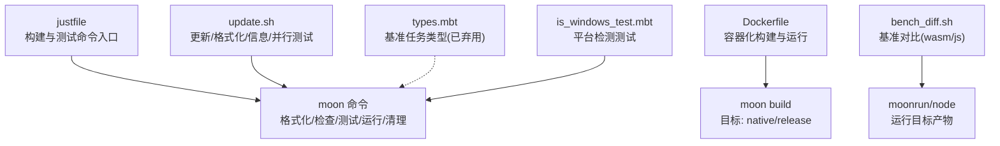
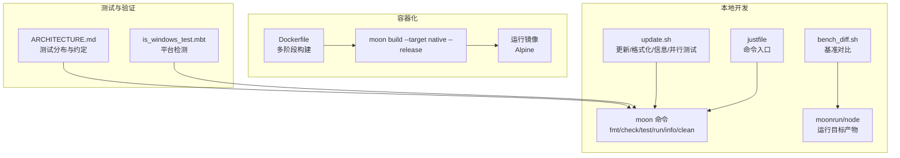
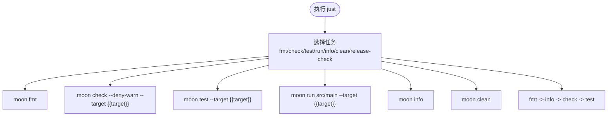
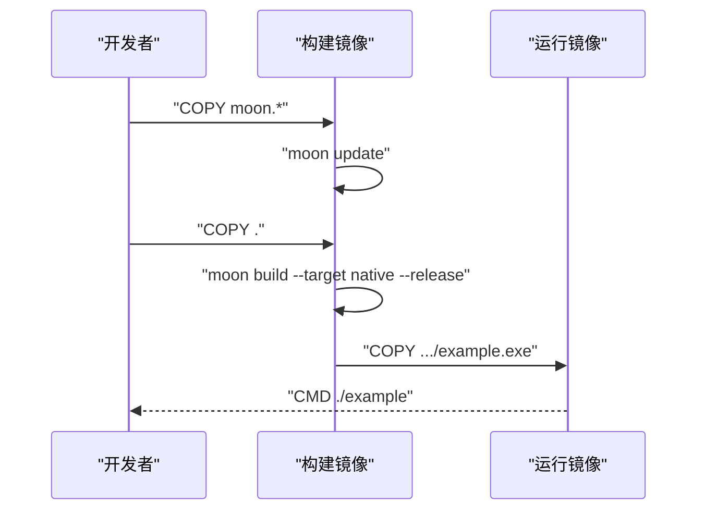
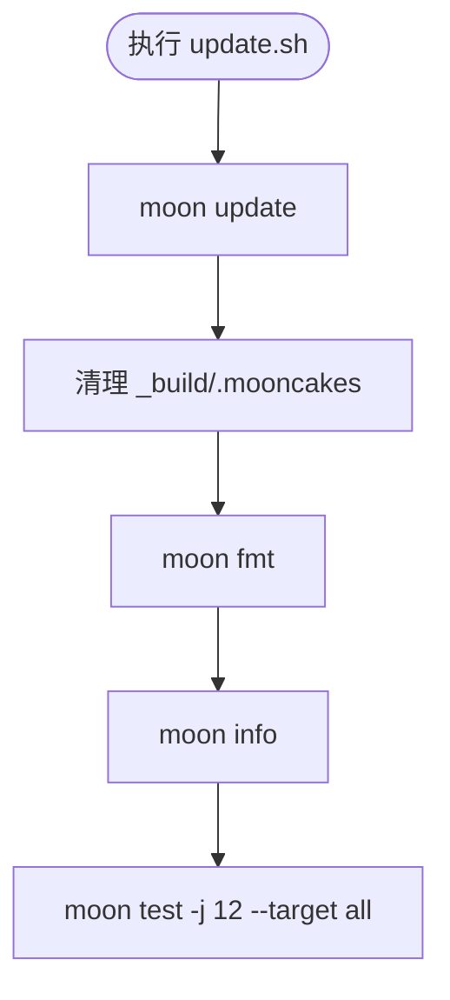
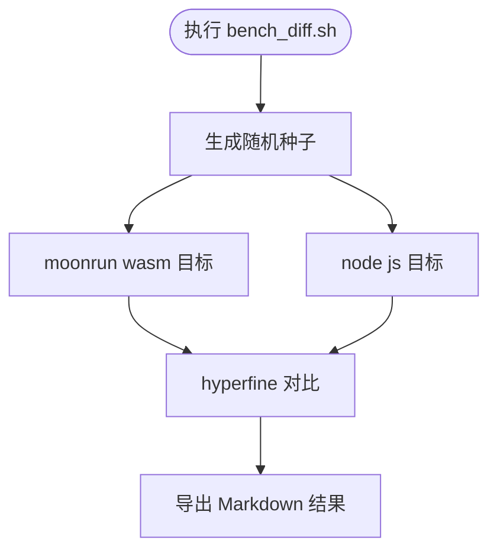
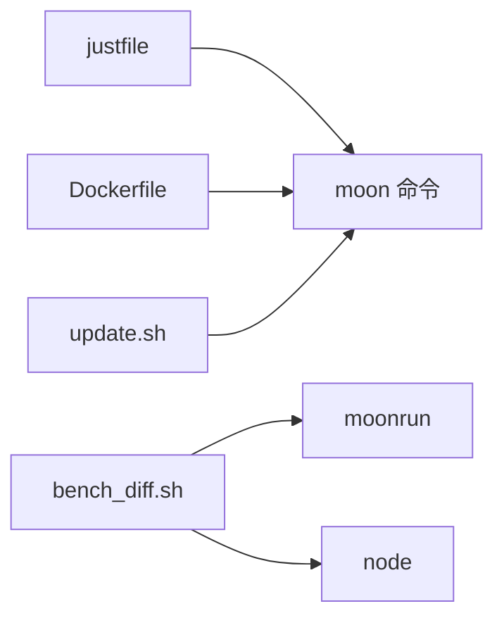

# 构建与部署

<cite>
**本文引用的文件**
- [justfile](file://.repos/f4ah6o/sse/0.3.0/justfile)
- [Dockerfile](file://.repos/bobzhang/crescent/0.10.0/Dockerfile)
- [update.sh](file://.repos/gmlewis/hash/0.20.7/update.sh)
- [bench_diff.sh](file://.repos/moonbitlang/x/0.4.43/encoding/internal/benchmark/bench_diff.sh)
- [types.mbt](file://.repos/moonbitlang/x/0.4.43/benchmark/types.mbt)
- [is_windows_test.mbt](file://.repos/moonbitlang/x/0.4.43/path/internal/ffi/is_windows_test.mbt)
- [MIGRATION_STATUS.md](file://.repos/Frank-III/onebit-tui/0.1.3/MIGRATION_STATUS.md)
- [ARCHITECTURE.md](file://.repos/bobzhang/crescent/0.10.0/ARCHITECTURE.md)
</cite>

## 目录
1. [简介](#简介)
2. [项目结构](#项目结构)
3. [核心组件](#核心组件)
4. [架构总览](#架构总览)
5. [详细组件分析](#详细组件分析)
6. [依赖分析](#依赖分析)
7. [性能考虑](#性能考虑)
8. [故障排查指南](#故障排查指南)
9. [结论](#结论)
10. [附录](#附录)

## 简介
本指南面向 MoonBit 项目的构建与部署，围绕仓库中可得的构建脚本与配置文件，系统阐述以下内容：
- 使用 justfile 中定义的构建命令进行项目构建的流程与要点
- MoonBit 项目的编译目标、优化选项与输出格式
- 测试策略与自动化测试配置方法（含并行测试与快照测试）
- 性能优化技术与调试技巧（含基准对比与运行时检测）
- 部署最佳实践（容器化与多目标平台）
- 持续集成与持续部署的配置思路（基于现有脚本与模板）
- 构建脚本的自定义与扩展方法
- 面向不同规模项目的构建与部署建议

## 项目结构
本仓库采用子模块组织方式，集中存放多个 MoonBit 相关组件与示例。与构建和部署直接相关的关键文件包括：
- justfile：提供统一的构建、测试、格式化等命令入口
- Dockerfile：演示 MoonBit 应用在容器中的构建与运行
- update.sh：示例更新、格式化、信息查询与并行测试脚本
- bench_diff.sh：基准对比脚本，支持 wasm 与 js 目标
- types.mbt：基准任务类型定义（已弃用，建议使用 moon bench）
- is_windows_test.mbt：平台检测测试样例
- ARCHITECTURE.md：测试分布与约定（黑盒/白盒/内联测试、快照测试）

**图表来源**
- [.repos/f4ah6o/sse/0.3.0/justfile:1-31](file://.repos/f4ah6o/sse/0.3.0/justfile#L1-L31)
- [.repos/bobzhang/crescent/0.10.0/Dockerfile:1-37](file://.repos/bobzhang/crescent/0.10.0/Dockerfile#L1-L37)
- [.repos/gmlewis/hash/0.20.7/update.sh:1-5](file://.repos/gmlewis/hash/0.20.7/update.sh#L1-L5)
- [.repos/moonbitlang/x/0.4.43/encoding/internal/benchmark/bench_diff.sh:51-73](file://.repos/moonbitlang/x/0.4.43/encoding/internal/benchmark/bench_diff.sh#L51-L73)
- [.repos/moonbitlang/x/0.4.43/benchmark/types.mbt:1-36](file://.repos/moonbitlang/x/0.4.43/benchmark/types.mbt#L1-L36)
- [.repos/moonbitlang/x/0.4.43/path/internal/ffi/is_windows_test.mbt:1-30](file://.repos/moonbitlang/x/0.4.43/path/internal/ffi/is_windows_test.mbt#L1-L30)

**章节来源**
- [.repos/f4ah6o/sse/0.3.0/justfile:1-31](file://.repos/f4ah6o/sse/0.3.0/justfile#L1-L31)
- [.repos/bobzhang/crescent/0.10.0/Dockerfile:1-37](file://.repos/bobzhang/crescent/0.10.0/Dockerfile#L1-L37)
- [.repos/gmlewis/hash/0.20.7/update.sh:1-5](file://.repos/gmlewis/hash/0.20.7/update.sh#L1-L5)
- [.repos/moonbitlang/x/0.4.43/encoding/internal/benchmark/bench_diff.sh:51-73](file://.repos/moonbitlang/x/0.4.43/encoding/internal/benchmark/bench_diff.sh#L51-L73)
- [.repos/moonbitlang/x/0.4.43/benchmark/types.mbt:1-36](file://.repos/moonbitlang/x/0.4.43/benchmark/types.mbt#L1-L36)
- [.repos/moonbitlang/x/0.4.43/path/internal/ffi/is_windows_test.mbt:1-30](file://.repos/moonbitlang/x/0.4.43/path/internal/ffi/is_windows_test.mbt#L1-L30)
- [.repos/bobzhang/crescent/0.10.0/ARCHITECTURE.md:1237-1264](file://.repos/bobzhang/crescent/0.10.0/ARCHITECTURE.md#L1237-L1264)

## 核心组件
- justfile：提供统一的构建命令入口，支持格式化、检查、测试、运行、信息查询与清理，并通过变量控制目标平台（默认 js）。
- Dockerfile：演示 MoonBit 应用在容器中的构建与运行，使用 MoonBit 工具链安装与 moon build --target native --release。
- update.sh：示例脚本，展示 moon update、格式化、信息查询与并行测试（-j 12）。
- bench_diff.sh：基准对比脚本，支持 wasm 与 js 目标，结合 hyperfine 进行基准测试与结果导出。
- types.mbt：基准任务类型定义（已弃用），建议改用 moon bench。
- is_windows_test.mbt：平台检测测试样例，演示如何在测试中检测运行平台。
- ARCHITECTURE.md：测试分布与约定，包含黑盒/白盒/内联测试与快照测试。

**章节来源**
- [.repos/f4ah6o/sse/0.3.0/justfile:1-31](file://.repos/f4ah6o/sse/0.3.0/justfile#L1-L31)
- [.repos/bobzhang/crescent/0.10.0/Dockerfile:1-37](file://.repos/bobzhang/crescent/0.10.0/Dockerfile#L1-L37)
- [.repos/gmlewis/hash/0.20.7/update.sh:1-5](file://.repos/gmlewis/hash/0.20.7/update.sh#L1-L5)
- [.repos/moonbitlang/x/0.4.43/encoding/internal/benchmark/bench_diff.sh:51-73](file://.repos/moonbitlang/x/0.4.43/encoding/internal/benchmark/bench_diff.sh#L51-L73)
- [.repos/moonbitlang/x/0.4.43/benchmark/types.mbt:1-36](file://.repos/moonbitlang/x/0.4.43/benchmark/types.mbt#L1-L36)
- [.repos/moonbitlang/x/0.4.43/path/internal/ffi/is_windows_test.mbt:1-30](file://.repos/moonbitlang/x/0.4.43/path/internal/ffi/is_windows_test.mbt#L1-L30)
- [.repos/bobzhang/crescent/0.10.0/ARCHITECTURE.md:1237-1264](file://.repos/bobzhang/crescent/0.10.0/ARCHITECTURE.md#L1237-L1264)

## 架构总览
下图展示了从本地开发到容器化部署的整体流程，以及与 MoonBit 工具链的交互关系。

**图表来源**
- [.repos/f4ah6o/sse/0.3.0/justfile:1-31](file://.repos/f4ah6o/sse/0.3.0/justfile#L1-L31)
- [.repos/gmlewis/hash/0.20.7/update.sh:1-5](file://.repos/gmlewis/hash/0.20.7/update.sh#L1-L5)
- [.repos/moonbitlang/x/0.4.43/encoding/internal/benchmark/bench_diff.sh:51-73](file://.repos/moonbitlang/x/0.4.43/encoding/internal/benchmark/bench_diff.sh#L51-L73)
- [.repos/bobzhang/crescent/0.10.0/Dockerfile:1-37](file://.repos/bobzhang/crescent/0.10.0/Dockerfile#L1-L37)
- [.repos/moonbitlang/x/0.4.43/path/internal/ffi/is_windows_test.mbt:1-30](file://.repos/moonbitlang/x/0.4.43/path/internal/ffi/is_windows_test.mbt#L1-L30)
- [.repos/bobzhang/crescent/0.10.0/ARCHITECTURE.md:1237-1264](file://.repos/bobzhang/crescent/0.10.0/ARCHITECTURE.md#L1237-L1264)

## 详细组件分析

### justfile：统一构建命令入口
- 变量与默认行为：通过变量控制目标平台（如 js），默认任务组合包含检查与测试。
- 常用命令：
  - 格式化：调用 moon fmt
  - 检查：调用 moon check 并启用“拒绝警告”
  - 测试：调用 moon test，支持更新期望值
  - 运行：调用 moon run 指向主入口
  - 信息：调用 moon info
  - 清理：调用 moon clean
  - 发布前检查：按顺序执行格式化、信息、检查与测试

**图表来源**
- [.repos/f4ah6o/sse/0.3.0/justfile:1-31](file://.repos/f4ah6o/sse/0.3.0/justfile#L1-L31)

**章节来源**
- [.repos/f4ah6o/sse/0.3.0/justfile:1-31](file://.repos/f4ah6o/sse/0.3.0/justfile#L1-L31)

### Dockerfile：容器化构建与运行
- 多阶段构建：先在构建阶段安装 MoonBit 工具链并执行 moon build --target native --release，再将产物复制到精简运行镜像（Alpine）。
- 关键步骤：
  - 安装工具链与依赖
  - 复制 moon.* 以利用缓存
  - 执行 moon update
  - 复制源码并构建
  - 将产物复制到运行镜像并设置入口命令

**图表来源**
- [.repos/bobzhang/crescent/0.10.0/Dockerfile:1-37](file://.repos/bobzhang/crescent/0.10.0/Dockerfile#L1-L37)

**章节来源**
- [.repos/bobzhang/crescent/0.10.0/Dockerfile:1-37](file://.repos/bobzhang/crescent/0.10.0/Dockerfile#L1-L37)

### update.sh：自动化测试与更新流程
- 功能：更新依赖、清理构建缓存、格式化、查看信息、并行测试（-j 12）。
- 适用场景：CI 或本地一键更新与质量门禁。

**图表来源**
- [.repos/gmlewis/hash/0.20.7/update.sh:1-5](file://.repos/gmlewis/hash/0.20.7/update.sh#L1-L5)

**章节来源**
- [.repos/gmlewis/hash/0.20.7/update.sh:1-5](file://.repos/gmlewis/hash/0.20.7/update.sh#L1-L5)

### bench_diff.sh：基准对比与导出
- 目标：对比当前与比较分支在 wasm 与 js 目标上的性能差异。
- 工具：hyperfine 进行基准测试，moonrun 运行 wasm，node 运行 js。
- 输出：将结果导出为 Markdown 文件，便于归档与对比。

**图表来源**
- [.repos/moonbitlang/x/0.4.43/encoding/internal/benchmark/bench_diff.sh:51-73](file://.repos/moonbitlang/x/0.4.43/encoding/internal/benchmark/bench_diff.sh#L51-L73)

**章节来源**
- [.repos/moonbitlang/x/0.4.43/encoding/internal/benchmark/bench_diff.sh:51-73](file://.repos/moonbitlang/x/0.4.43/encoding/internal/benchmark/bench_diff.sh#L51-L73)

### types.mbt：基准任务类型（已弃用）
- 说明：该文件定义了旧版基准任务类型，建议改用 moon bench。
- 影响：若项目仍在使用旧版基准，请迁移至 moon bench 以获得更好的工具链支持。

**章节来源**
- [.repos/moonbitlang/x/0.4.43/benchmark/types.mbt:1-36](file://.repos/moonbitlang/x/0.4.43/benchmark/types.mbt#L1-L36)

### is_windows_test.mbt：平台检测测试
- 示例：通过环境变量判断平台并在测试中断言。
- 用途：在跨平台测试中识别 Windows 环境，辅助条件化测试逻辑。

**章节来源**
- [.repos/moonbitlang/x/0.4.43/path/internal/ffi/is_windows_test.mbt:1-30](file://.repos/moonbitlang/x/0.4.43/path/internal/ffi/is_windows_test.mbt#L1-L30)

### ARCHITECTURE.md：测试分布与约定
- 测试分类：黑盒测试（_test.mbt）、白盒测试（_wbtest.mbt）、内联测试（test "..." 块）。
- 快照测试：使用 moon test --update 自动更新期望值。
- 测试分布：服务器集成、WebSocket、路由匹配、HTTP 工具、中间件、CORS、全栈等类别。

**章节来源**
- [.repos/bobzhang/crescent/0.10.0/ARCHITECTURE.md:1237-1264](file://.repos/bobzhang/crescent/0.10.0/ARCHITECTURE.md#L1237-L1264)

### MIGRATION_STATUS.md：构建错误修复与目标迁移
- 说明：记录构建错误修复、演示运行与文件清理等目标。
- 启示：在迁移或修复过程中，优先解决构建错误并确保演示可用。

**章节来源**
- [.repos/Frank-III/onebit-tui/0.1.3/MIGRATION_STATUS.md:63-68](file://.repos/Frank-III/onebit-tui/0.1.3/MIGRATION_STATUS.md#L63-L68)

## 依赖分析
- 组件耦合：
  - justfile 与 moon 命令高度耦合，负责统一入口
  - Dockerfile 依赖 MoonBit 工具链与构建产物
  - bench_diff.sh 依赖 hyperfine、moonrun 与 node
  - update.sh 串联 moon update、fmt、info、test
- 外部依赖：
  - MoonBit CLI（安装与工具链）
  - hyperfine（基准对比）
  - node（js 目标运行）
  - docker（容器化构建）

**图表来源**
- [.repos/f4ah6o/sse/0.3.0/justfile:1-31](file://.repos/f4ah6o/sse/0.3.0/justfile#L1-L31)
- [.repos/bobzhang/crescent/0.10.0/Dockerfile:1-37](file://.repos/bobzhang/crescent/0.10.0/Dockerfile#L1-L37)
- [.repos/gmlewis/hash/0.20.7/update.sh:1-5](file://.repos/gmlewis/hash/0.20.7/update.sh#L1-L5)
- [.repos/moonbitlang/x/0.4.43/encoding/internal/benchmark/bench_diff.sh:51-73](file://.repos/moonbitlang/x/0.4.43/encoding/internal/benchmark/bench_diff.sh#L51-L73)

**章节来源**
- [.repos/f4ah6o/sse/0.3.0/justfile:1-31](file://.repos/f4ah6o/sse/0.3.0/justfile#L1-L31)
- [.repos/bobzhang/crescent/0.10.0/Dockerfile:1-37](file://.repos/bobzhang/crescent/0.10.0/Dockerfile#L1-L37)
- [.repos/gmlewis/hash/0.20.7/update.sh:1-5](file://.repos/gmlewis/hash/0.20.7/update.sh#L1-L5)
- [.repos/moonbitlang/x/0.4.43/encoding/internal/benchmark/bench_diff.sh:51-73](file://.repos/moonbitlang/x/0.4.43/encoding/internal/benchmark/bench_diff.sh#L51-L73)

## 性能考虑
- 目标选择：
  - native：适合桌面/服务端原生应用，通常具备更佳性能
  - js：适合浏览器或 Node.js 环境
  - wasm/wasm-gc：适合 Web 环境，wasm-gc 更加紧凑
- 基准对比：
  - 使用 bench_diff.sh 对比不同目标的性能差异
  - 通过 hyperfine 设置预热轮次与导出结果
- 并行测试：
  - update.sh 使用 -j 12 并行测试，提升 CI 效率
- 调试技巧：
  - 在测试中加入平台检测（如 is_windows_test.mbt），以便在不同平台定位问题
  - 使用 moon info 查看构建信息，辅助诊断

**章节来源**
- [.repos/moonbitlang/x/0.4.43/encoding/internal/benchmark/bench_diff.sh:51-73](file://.repos/moonbitlang/x/0.4.43/encoding/internal/benchmark/bench_diff.sh#L51-L73)
- [.repos/gmlewis/hash/0.20.7/update.sh:1-5](file://.repos/gmlewis/hash/0.20.7/update.sh#L1-L5)
- [.repos/moonbitlang/x/0.4.43/path/internal/ffi/is_windows_test.mbt:1-30](file://.repos/moonbitlang/x/0.4.43/path/internal/ffi/is_windows_test.mbt#L1-L30)

## 故障排查指南
- 构建错误修复：
  - 参考 MIGRATION_STATUS.md 的修复目标，优先解决构建错误并确保演示可用
- 测试失败定位：
  - 使用 ARCHITECTURE.md 的测试分布与约定，区分黑盒/白盒/内联测试
  - 快照测试可通过 moon test --update 更新期望值
- 平台差异：
  - 使用 is_windows_test.mbt 的模式，在测试中检测平台差异
- 容器构建问题：
  - 确认 Dockerfile 中工具链安装与 moon build 步骤是否成功
  - 检查产物路径与运行镜像 CMD 是否正确

**章节来源**
- [.repos/Frank-III/onebit-tui/0.1.3/MIGRATION_STATUS.md:63-68](file://.repos/Frank-III/onebit-tui/0.1.3/MIGRATION_STATUS.md#L63-L68)
- [.repos/bobzhang/crescent/0.10.0/ARCHITECTURE.md:1237-1264](file://.repos/bobzhang/crescent/0.10.0/ARCHITECTURE.md#L1237-L1264)
- [.repos/moonbitlang/x/0.4.43/path/internal/ffi/is_windows_test.mbt:1-30](file://.repos/moonbitlang/x/0.4.43/path/internal/ffi/is_windows_test.mbt#L1-L30)
- [.repos/bobzhang/crescent/0.10.0/Dockerfile:1-37](file://.repos/bobzhang/crescent/0.10.0/Dockerfile#L1-L37)

## 结论
本指南基于仓库中现有的 justfile、Dockerfile、脚本与文档，总结了 MoonBit 项目的构建与部署实践。通过统一的命令入口、容器化构建、并行测试与基准对比，能够有效提升开发效率与交付质量。建议在实际项目中：
- 使用 justfile 管理常用命令
- 采用 Dockerfile 实现一致的构建与运行环境
- 利用并行测试与基准对比优化性能
- 遵循测试约定，合理使用快照测试与平台检测

## 附录
- 不同规模项目的建议：
  - 小型项目：仅需 justfile 与本地 moon 命令即可满足日常开发与测试
  - 中型项目：引入 Dockerfile 与 update.sh，形成 CI 基础
  - 大型项目：增加 bench_diff.sh 与平台检测测试，完善测试矩阵与性能基线
- 持续集成与持续部署：
  - CI：在流水线中执行 moon update、moon fmt、moon check、moon test -j 并行测试
  - CD：基于 Dockerfile 构建镜像并推送至镜像仓库，配合编排平台部署