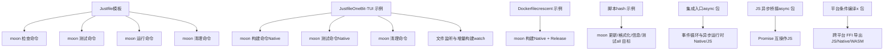
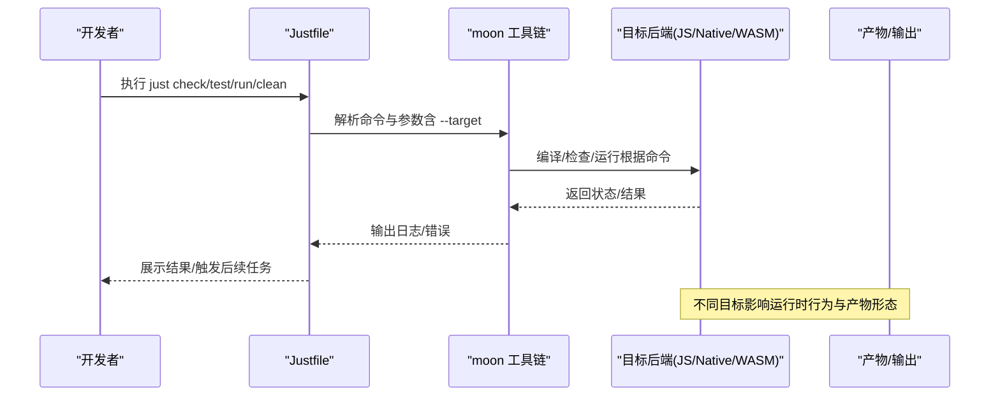
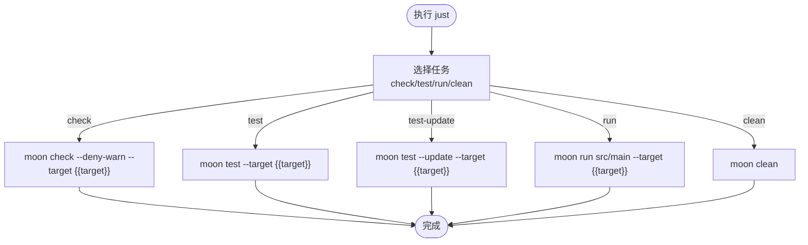
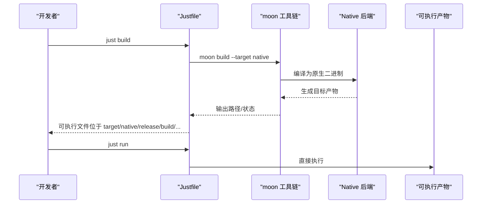
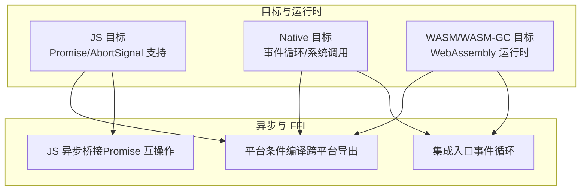
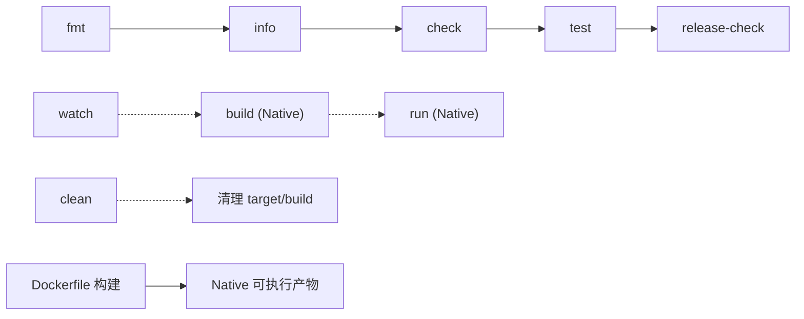

# 构建流程

<cite>
**本文引用的文件**
- [justfile（模板）](file://.repos/f4ah6o/sse/0.3.0/justfile)
- [justfile（OneBit-TUI 示例）](file://.repos/Frank-III/onebit-tui/0.1.3/justfile)
- [Dockerfile（crescent 示例）](file://.repos/bobzhang/crescent/0.10.0/Dockerfile)
- [脚本（hash 示例）](file://.repos/gmlewis/hash/0.20.7/update.sh)
- [集成入口（async 包）](file://.repos/moonbitlang/async/0.19.1/src/integration.mbt)
- [JS 异步桥接（async 包）](file://.repos/moonbitlang/async/0.19.1/src/js_async/js_async.mbt)
- [平台条件编译（x 包）](file://.repos/moonbitlang/x/0.4.43/path/internal/ffi/is_windows.mbt)
</cite>

## 目录
1. [简介](#简介)
2. [项目结构](#项目结构)
3. [核心组件](#核心组件)
4. [架构总览](#架构总览)
5. [详细组件分析](#详细组件分析)
6. [依赖分析](#依赖分析)
7. [性能考虑](#性能考虑)
8. [故障排查指南](#故障排查指南)
9. [结论](#结论)
10. [附录](#附录)

## 简介
本文件面向 MoonBit 项目的日常开发与构建，围绕仓库中的 justfile 与相关工具链命令，系统化梳理从代码检查、测试、运行到清理的标准流程，并结合 MoonBit 的多目标特性（如 JS、Native、WASM），给出目标配置最佳实践与自动化优化建议。读者无需深入掌握 MoonBit 语言细节，即可按本文步骤完成本地开发与持续集成构建。

## 项目结构
本仓库采用“子模块/外部依赖”组织方式，核心构建命令集中在各子模块的 justfile 中；同时通过 moon 工具链在不同目标之间进行编译与运行。下图展示与构建流程直接相关的文件与角色：

图表来源
- [.repos/f4ah6o/sse/0.3.0/justfile](file://.repos/f4ah6o/sse/0.3.0/justfile)
- [.repos/Frank-III/onebit-tui/0.1.3/justfile](file://.repos/Frank-III/onebit-tui/0.1.3/justfile)
- [.repos/bobzhang/crescent/0.10.0/Dockerfile](file://.repos/bobzhang/crescent/0.10.0/Dockerfile)
- [.repos/gmlewis/hash/0.20.7/update.sh](file://.repos/gmlewis/hash/0.20.7/update.sh)
- [.repos/moonbitlang/async/0.19.1/src/integration.mbt](file://.repos/moonbitlang/async/0.19.1/src/integration.mbt)
- [.repos/moonbitlang/async/0.19.1/src/js_async/js_async.mbt](file://.repos/moonbitlang/async/0.19.1/src/js_async/js_async.mbt)
- [.repos/moonbitlang/x/0.4.43/path/internal/ffi/is_windows.mbt](file://.repos/moonbitlang/x/0.4.43/path/internal/ffi/is_windows.mbt)

章节来源
- [.repos/f4ah6o/sse/0.3.0/justfile](file://.repos/f4ah6o/sse/0.3.0/justfile)
- [.repos/Frank-III/onebit-tui/0.1.3/justfile](file://.repos/Frank-III/onebit-tui/0.1.3/justfile)
- [.repos/bobzhang/crescent/0.10.0/Dockerfile](file://.repos/bobzhang/crescent/0.10.0/Dockerfile)
- [.repos/gmlewis/hash/0.20.7/update.sh](file://.repos/gmlewis/hash/0.20.7/update.sh)

## 核心组件
- Justfile（模板）
  - 提供默认任务链：check + test
  - 关键命令：moon fmt、moon check（带拒绝警告）、moon test、moon test --update、moon run、moon info、moon clean
  - 变量：target 默认为 js
  - 作用：统一本地开发命令入口，便于团队协作与 CI 复用

- Justfile（OneBit-TUI 示例）
  - 提供 moon build（Native）、moon check/test（Native）、moon clean、watch 等任务
  - 适合桌面端或终端交互类应用的本地快速迭代

- Dockerfile（crescent 示例）
  - 在容器内安装 MoonBit 工具链并执行 moon build --target native --release
  - 适合将 Native 产物打包为可执行镜像

- 脚本（hash 示例）
  - 使用 moon update、moon fmt、moon info、moon test -j 12 --target all
  - 展示并行测试与全目标测试的实践

章节来源
- [.repos/f4ah6o/sse/0.3.0/justfile](file://.repos/f4ah6o/sse/0.3.0/justfile)
- [.repos/Frank-III/onebit-tui/0.1.3/justfile](file://.repos/Frank-III/onebit-tui/0.1.3/justfile)
- [.repos/bobzhang/crescent/0.10.0/Dockerfile](file://.repos/bobzhang/crescent/0.10.0/Dockerfile)
- [.repos/gmlewis/hash/0.20.7/update.sh](file://.repos/gmlewis/hash/0.20.7/update.sh)

## 架构总览
下图展示从开发者执行 just 命令到 MoonBit 工具链处理、再到目标产物产出的整体流程。该流程在不同目标（JS/Native/WASM）下具备一致的命令语义，但具体实现与运行时行为会因目标而异。

图表来源
- [.repos/f4ah6o/sse/0.3.0/justfile](file://.repos/f4ah6o/sse/0.3.0/justfile)
- [.repos/Frank-III/onebit-tui/0.1.3/justfile](file://.repos/Frank-III/onebit-tui/0.1.3/justfile)
- [.repos/bobzhang/crescent/0.10.0/Dockerfile](file://.repos/bobzhang/crescent/0.10.0/Dockerfile)

## 详细组件分析

### 组件一：Justfile（模板）中的构建命令
- 默认任务链：default: check test
- 核心命令与用途
  - fmt：格式化代码
  - check：语法与类型检查，--deny-warn 将警告视为错误，确保质量门槛
  - test：运行测试
  - test-update：更新测试基准（用于变更预期输出）
  - run：执行主程序入口（指定文件）
  - info：打印项目信息
  - clean：清理构建产物
- 参数与变量
  - --target {{target}}：通过变量注入目标类型（默认 js）
  - {{target}}：在模板中由 just 替换为实际值

图表来源
- [.repos/f4ah6o/sse/0.3.0/justfile](file://.repos/f4ah6o/sse/0.3.0/justfile)

章节来源
- [.repos/f4ah6o/sse/0.3.0/justfile](file://.repos/f4ah6o/sse/0.3.0/justfile)

### 组件二：Justfile（OneBit-TUI 示例）中的 Native 构建
- 任务要点
  - build：moon build --target native
  - check/test：moon check/test --target native
  - clean：moon clean 并删除 target/build 目录
  - watch：文件变更时自动触发构建
- 适用场景
  - 桌面端/终端交互应用，强调本地原生体验与 FFI 能力

图表来源
- [.repos/Frank-III/onebit-tui/0.1.3/justfile](file://.repos/Frank-III/onebit-tui/0.1.3/justfile)

章节来源
- [.repos/Frank-III/onebit-tui/0.1.3/justfile](file://.repos/Frank-III/onebit-tui/0.1.3/justfile)

### 组件三：Dockerfile（crescent 示例）中的容器化构建
- 关键步骤
  - 安装 MoonBit 工具链
  - moon update（拉取依赖）
  - moon build --target native --release（生产构建）
- 价值
  - 将 Native 产物打包为可执行镜像，便于部署与分发

章节来源
- [.repos/bobzhang/crescent/0.10.0/Dockerfile](file://.repos/bobzhang/crescent/0.10.0/Dockerfile)

### 组件四：脚本（hash 示例）中的并行与全目标测试
- 命令组合
  - moon update、moon fmt、moon info
  - moon test -j 12 --target all（并行度 12，覆盖所有目标）
- 价值
  - 快速验证多目标兼容性与稳定性

章节来源
- [.repos/gmlewis/hash/0.20.7/update.sh](file://.repos/gmlewis/hash/0.20.7/update.sh)

### 组件五：MoonBit 目标与运行时差异（概念性说明）
- 目标类型与典型用途
  - JS：浏览器/Node 环境，支持 Promise/Abort 等 JS 特性
  - Native：桌面/服务器原生二进制，具备事件循环与系统调用能力
  - WASM/WASM-GC：WebAssembly 目标，适配浏览器或服务端运行时
- 运行时差异
  - 异步运行时：Native 侧通过事件循环驱动，JS 侧通过协程与事件循环配合
  - FFI 导出：不同目标下导出符号与平台绑定存在差异（例如 Windows 平台检测）

图表来源
- [.repos/moonbitlang/async/0.19.1/src/integration.mbt](file://.repos/moonbitlang/async/0.19.1/src/integration.mbt)
- [.repos/moonbitlang/async/0.19.1/src/js_async/js_async.mbt](file://.repos/moonbitlang/async/0.19.1/src/js_async/js_async.mbt)
- [.repos/moonbitlang/x/0.4.43/path/internal/ffi/is_windows.mbt](file://.repos/moonbitlang/x/0.4.43/path/internal/ffi/is_windows.mbt)

## 依赖分析
- 任务耦合关系
  - 模板 Justfile：fmt → info → check → test → release-check（串联）
  - OneBit-TUI Justfile：build 与 run/interactive/advanced 等任务解耦，watch 作为独立观察者
- 外部依赖
  - moon 工具链版本与可用目标由项目依赖与工具链决定
  - Dockerfile 依赖 moon CLI 安装脚本与系统包管理器
- 潜在风险
  - 目标切换（如从 js 切换到 native）可能导致 FFI 符号或平台 API 不匹配
  - 并行测试（--target all）可能受并发资源限制

图表来源
- [.repos/f4ah6o/sse/0.3.0/justfile](file://.repos/f4ah6o/sse/0.3.0/justfile)
- [.repos/Frank-III/onebit-tui/0.1.3/justfile](file://.repos/Frank-III/onebit-tui/0.1.3/justfile)
- [.repos/bobzhang/crescent/0.10.0/Dockerfile](file://.repos/bobzhang/crescent/0.10.0/Dockerfile)

章节来源
- [.repos/f4ah6o/sse/0.3.0/justfile](file://.repos/f4ah6o/sse/0.3.0/justfile)
- [.repos/Frank-III/onebit-tui/0.1.3/justfile](file://.repos/Frank-III/onebit-tui/0.1.3/justfile)
- [.repos/bobzhang/crescent/0.10.0/Dockerfile](file://.repos/bobzhang/crescent/0.10.0/Dockerfile)

## 性能考虑
- 并行测试
  - 使用 -j 选项提升测试执行效率（参考脚本示例）
  - 注意资源竞争与输出干扰，必要时调整并行度
- 构建缓存与增量
  - 优先使用增量构建与文件监听（watch），减少重复编译时间
  - 在 CI 中复用缓存层，避免每次重新安装工具链
- 目标选择
  - 开发阶段可优先使用 js 目标以获得更快反馈
  - 发布前务必在 native/wasm 等目标上做回归测试
- 容器化构建
  - 将 moon update 与构建分离，利用镜像层缓存加速

## 故障排查指南
- 检查阶段失败（--deny-warn）
  - 现象：警告被视作错误导致失败
  - 排查：逐条修复告警；若确需放宽，可在本地临时移除 --deny-warn 进行快速验证
  - 参考命令路径：[模板 Justfile 中的 check](file://.repos/f4ah6o/sse/0.3.0/justfile)
- 测试更新
  - 现象：测试输出与预期不符
  - 排查：使用 --update 生成新预期；核对变更是否合理
  - 参考命令路径：[模板 Justfile 中的 test-update](file://.repos/f4ah6o/sse/0.3.0/justfile)
- 运行失败
  - 现象：moon run 报错或找不到入口
  - 排查：确认主程序文件路径正确；检查 --target 是否与期望一致
  - 参考命令路径：[模板 Justfile 中的 run](file://.repos/f4ah6o/sse/0.3.0/justfile)
- 清理不彻底
  - 现象：构建残留导致后续问题
  - 排查：执行 moon clean；必要时手动清理 target/build
  - 参考命令路径：[模板 Justfile 中的 clean](file://.repos/f4ah6o/sse/0.3.0/justfile)
- 目标不兼容
  - 现象：JS 与 Native 的 FFI 或平台 API 差异导致运行时错误
  - 排查：使用条件编译与平台探测（如 Windows 平台检测）；在对应目标下分别验证
  - 参考文件路径：[平台条件编译（x 包）](file://.repos/moonbitlang/x/0.4.43/path/internal/ffi/is_windows.mbt)

章节来源
- [.repos/f4ah6o/sse/0.3.0/justfile](file://.repos/f4ah6o/sse/0.3.0/justfile)
- [.repos/gmlewis/hash/0.20.7/update.sh](file://.repos/gmlewis/hash/0.20.7/update.sh)
- [.repos/moonbitlang/x/0.4.43/path/internal/ffi/is_windows.mbt](file://.repos/moonbitlang/x/0.4.43/path/internal/ffi/is_windows.mbt)

## 结论
通过 Justfile 统一构建命令、moon 工具链提供一致的检查/测试/运行语义，以及针对不同目标（JS/Native/WASM）的差异化运行时行为，可以形成高效、可复现且易于维护的 MoonBit 项目构建体系。建议在本地采用增量构建与并行测试，在 CI 中引入多目标回归与容器化发布，以平衡速度与质量。

## 附录

### A. moon check --deny-warn --target {{target}} 的作用与参数说明
- 作用
  - 对当前包及其依赖进行语法与类型检查
  - 将警告视为错误，强制在提交前解决潜在问题
- 关键参数
  - --deny-warn：将警告转为错误
  - --target：指定目标后端（如 js、native、wasm、wasm-gc 等）
- 最佳实践
  - 在 PR 与 CI 中开启该检查，保证质量门槛
  - 本地开发可临时关闭以快速迭代，提交前恢复

章节来源
- [.repos/f4ah6o/sse/0.3.0/justfile](file://.repos/f4ah6o/sse/0.3.0/justfile)

### B. moon test 的两种模式
- 普通测试
  - 用途：验证功能正确性
  - 命令：moon test --target {{target}}
- 更新测试
  - 用途：当预期输出发生变化时，更新基准
  - 命令：moon test --update --target {{target}}

章节来源
- [.repos/f4ah6o/sse/0.3.0/justfile](file://.repos/f4ah6o/sse/0.3.0/justfile)

### C. moon run 如何执行主程序文件
- 作用：直接运行指定的主程序入口
- 常见用法：moon run src/main --target {{target}}
- 注意事项
  - 确认入口文件路径正确
  - 目标类型应与运行环境匹配（如浏览器/Node/原生）

章节来源
- [.repos/f4ah6o/sse/0.3.0/justfile](file://.repos/f4ah6o/sse/0.3.0/justfile)

### D. 构建目标配置最佳实践
- JS 目标
  - 适合前端/Node 场景，支持 Promise/AbortSignal
  - 与前端生态集成良好，便于调试与测试
- Native 目标
  - 适合桌面/服务器应用，具备事件循环与系统调用能力
  - 适合需要高性能与系统级访问的场景
- WASM/WASM-GC 目标
  - 适合浏览器或服务端 WASM 运行时
  - 需关注内存模型与 GC 行为差异
- 平台与 FFI
  - 使用条件编译与平台探测（如 Windows 平台检测）保证跨平台一致性
  - 在不同目标下分别验证 FFI 导出与调用

章节来源
- [.repos/moonbitlang/async/0.19.1/src/integration.mbt](file://.repos/moonbitlang/async/0.19.1/src/integration.mbt)
- [.repos/moonbitlang/async/0.19.1/src/js_async/js_async.mbt](file://.repos/moonbitlang/async/0.19.1/src/js_async/js_async.mbt)
- [.repos/moonbitlang/x/0.4.43/path/internal/ffi/is_windows.mbt](file://.repos/moonbitlang/x/0.4.43/path/internal/ffi/is_windows.mbt)

### E. 自动化与优化建议
- 本地开发
  - 使用 watch 实现文件变更自动构建
  - 在模板 Justfile 中串联 fmt → info → check → test，形成“发布前自检”
- CI/CD
  - 并行测试：moon test -j N --target all
  - 多目标回归：在不同矩阵中执行 native/js/wasm
  - 容器化构建：Dockerfile 中先缓存依赖，再构建产物
- 产物与分发
  - Native：将可执行文件打包为容器镜像或发行包
  - JS：在前端工程中集成构建与打包流程

章节来源
- [.repos/Frank-III/onebit-tui/0.1.3/justfile](file://.repos/Frank-III/onebit-tui/0.1.3/justfile)
- [.repos/bobzhang/crescent/0.10.0/Dockerfile](file://.repos/bobzhang/crescent/0.10.0/Dockerfile)
- [.repos/gmlewis/hash/0.20.7/update.sh](file://.repos/gmlewis/hash/0.20.7/update.sh)