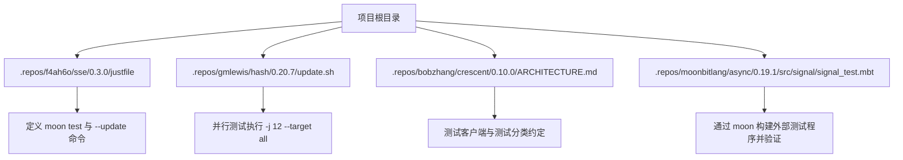
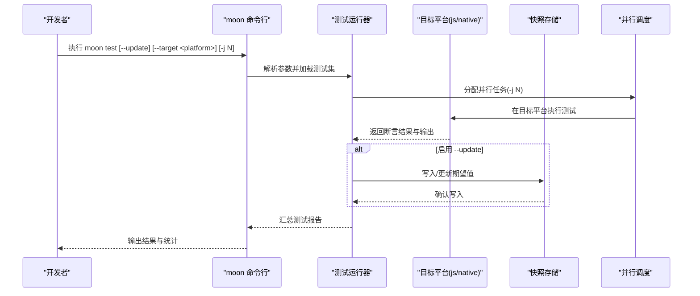
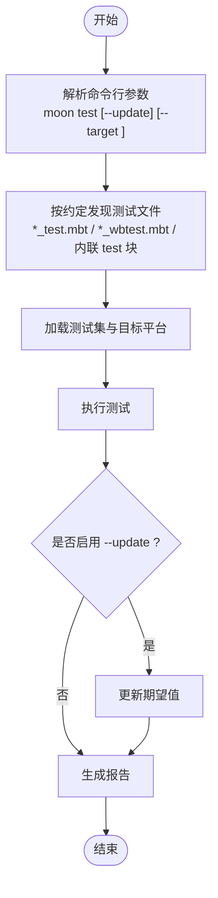
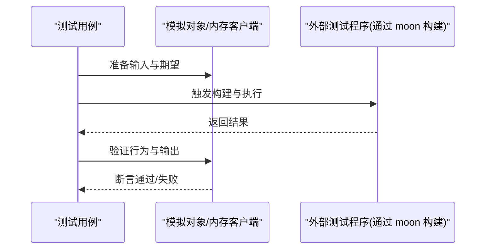
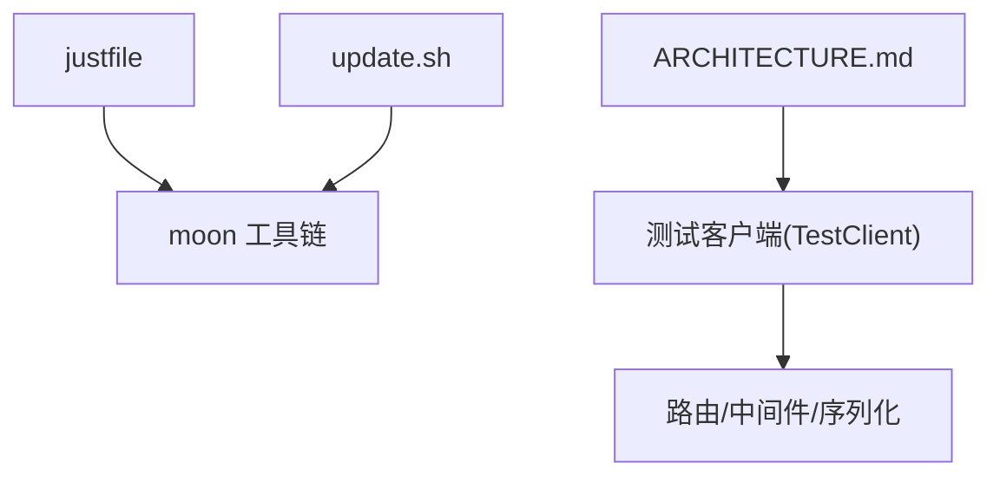

# 测试策略

<cite>
**本文引用的文件**
- [justfile](file://.repos/f4ah6o/sse/0.3.0/justfile)
- [update.sh](file://.repos/gmlewis/hash/0.20.7/update.sh)
- [ARCHITECTURE.md](file://.repos/bobzhang/crescent/0.10.0/ARCHITECTURE.md)
- [signal_test.mbt](file://.repos/moonbitlang/async/0.19.1/src/signal/signal_test.mbt)
</cite>

## 目录
1. [引言](#引言)
2. [项目结构](#项目结构)
3. [核心组件](#核心组件)
4. [架构总览](#架构总览)
5. [详细组件分析](#详细组件分析)
6. [依赖分析](#依赖分析)
7. [性能考虑](#性能考虑)
8. [故障排查指南](#故障排查指南)
9. [结论](#结论)
10. [附录](#附录)

## 引言
本指南面向 MoonBit 项目团队，系统化制定测试策略与实施规范，覆盖命令行测试工具使用、测试发现机制、更新模式应用、测试分层组织、覆盖率监控、测试数据与模拟对象、环境配置与并行执行优化，以及失败诊断与调试技巧。文档以仓库中实际存在的脚本与架构说明为依据，结合 MoonBit 测试生态的最佳实践进行总结。

## 项目结构
围绕测试相关的关键位置与文件如下：
- 任务编排与测试命令：通过 justfile 定义 moon test 及其更新模式的便捷入口，并指定目标平台（如 js）。
- 并行测试执行示例：在 shell 脚本中使用 moon test -j N --target all 进行多核并行与全平台目标测试。
- 测试基础设施与约定：在架构文档中明确测试客户端、黑盒/白盒/内联测试、快照测试等实践。
- 测试程序构建与进程交互：在信号测试中演示如何通过 moon 构建外部测试程序并进行验证。



**图表来源**
- [.repos/f4ah6o/sse/0.3.0/justfile](file://.repos/f4ah6o/sse/0.3.0/justfile)
- [.repos/gmlewis/hash/0.20.7/update.sh](file://.repos/gmlewis/hash/0.20.7/update.sh)
- [.repos/bobzhang/crescent/0.10.0/ARCHITECTURE.md](file://.repos/bobzhang/crescent/0.10.0/ARCHITECTURE.md)
- [.repos/moonbitlang/async/0.19.1/src/signal/signal_test.mbt](file://.repos/moonbitlang/async/0.19.1/src/signal/signal_test.mbt)

**章节来源**
- [.repos/f4ah6o/sse/0.3.0/justfile](file://.repos/f4ah6o/sse/0.3.0/justfile)
- [.repos/gmlewis/hash/0.20.7/update.sh](file://.repos/gmlewis/hash/0.20.7/update.sh)
- [.repos/bobzhang/crescent/0.10.0/ARCHITECTURE.md](file://.repos/bobzhang/crescent/0.10.0/ARCHITECTURE.md)
- [.repos/moonbitlang/async/0.19.1/src/signal/signal_test.mbt](file://.repos/moonbitlang/async/0.19.1/src/signal/signal_test.mbt)

## 核心组件
- 测试命令与目标平台
  - 使用 moon test 指定目标平台（如 js），便于在不同运行时下验证行为一致性。
  - 使用 moon test --update 启用快照更新模式，自动更新期望值，常用于回归对比与基准稳定。
- 并行测试执行
  - 通过 moon test -j N 提升 CI 与本地测试吞吐，N 通常设置为 CPU 核数或略低以避免资源争用。
  - 结合 --target all 对多目标进行批量测试，确保跨平台兼容性。
- 测试客户端与黑盒/白盒测试
  - 在内存中直接调用应用路由与中间件管道，不经过网络 I/O，快速验证路由、序列化与错误映射。
  - 黑盒测试优先，白盒测试仅在难以通过公共 API 验证的内部实现上使用。
- 快照测试与更新
  - 使用 inspect(value, content="expected") 与 --update 自动更新期望内容，适合结构化输出与格式化结果的回归校验。

**章节来源**
- [.repos/f4ah6o/sse/0.3.0/justfile](file://.repos/f4ah6o/sse/0.3.0/justfile)
- [.repos/gmlewis/hash/0.20.7/update.sh](file://.repos/gmlewis/hash/0.20.7/update.sh)
- [.repos/bobzhang/crescent/0.10.0/ARCHITECTURE.md](file://.repos/bobzhang/crescent/0.10.0/ARCHITECTURE.md)

## 架构总览
下图展示从命令行到测试执行与验证的整体流程，包括快照更新与并行执行的关键节点。



**图表来源**
- [.repos/f4ah6o/sse/0.3.0/justfile](file://.repos/f4ah6o/sse/0.3.0/justfile)
- [.repos/gmlewis/hash/0.20.7/update.sh](file://.repos/gmlewis/hash/0.20.7/update.sh)
- [.repos/bobzhang/crescent/0.10.0/ARCHITECTURE.md](file://.repos/bobzhang/crescent/0.10.0/ARCHITECTURE.md)

## 详细组件分析

### 组件一：测试命令与发现机制
- 命令入口
  - 通过 justfile 中的 test 与 test-update 目标，统一暴露 moon test 与 moon test --update，便于团队标准化执行。
  - 目标平台通过变量 target 控制，支持 js 等多运行时。
- 测试发现
  - MoonBit 项目中存在 *_test.mbt 与 *_wbtest.mbt 文件命名约定，分别对应黑盒与白盒测试；内联测试可嵌入源文件中的 test "..." 块。
  - 测试客户端 TestClient 支持在内存中调用路由与中间件，无需网络 I/O，提升测试速度与稳定性。



**图表来源**
- [.repos/f4ah6o/sse/0.3.0/justfile](file://.repos/f4ah6o/sse/0.3.0/justfile)
- [.repos/bobzhang/crescent/0.10.0/ARCHITECTURE.md](file://.repos/bobzhang/crescent/0.10.0/ARCHITECTURE.md)

**章节来源**
- [.repos/f4ah6o/sse/0.3.0/justfile](file://.repos/f4ah6o/sse/0.3.0/justfile)
- [.repos/bobzhang/crescent/0.10.0/ARCHITECTURE.md](file://.repos/bobzhang/crescent/0.10.0/ARCHITECTURE.md)

### 组件二：测试更新模式 moon test --update
- 应用场景
  - 当输出格式或结构发生变化时，通过 --update 自动更新期望值，减少手工维护成本。
  - 适用于快照测试与格式化输出的回归对比，确保变更可控且可追踪。
- 注意事项
  - 更新前应充分理解变更影响范围，必要时对相关测试用例进行评审。
  - 在 CI 中谨慎使用 --update，建议仅在受控分支或手动触发流程中启用。
  - 与版本控制配合，确保期望值变更被清晰记录与审查。

**章节来源**
- [.repos/bobzhang/crescent/0.10.0/ARCHITECTURE.md](file://.repos/bobzhang/crescent/0.10.0/ARCHITECTURE.md)

### 组件三：测试分层组织建议
- 单元测试（黑盒）
  - 优先采用 *_test.mbt，通过公共 API 验证功能正确性，保持测试与实现解耦。
- 白盒测试（白盒）
  - 仅在难以通过公共 API 验证的内部逻辑（如 WebSocket 内部状态）使用 *_wbtest.mbt。
- 内联测试
  - 将小规模测试就近放入源文件的 test "..." 块，便于在修改代码附近快速验证。
- 集成测试与端到端测试
  - 利用测试客户端在内存中验证路由、中间件与序列化；对于需要真实网络 I/O 的场景，另行编写 serve_async_integration_test.mbt 等集成测试。

```mermaid
graph TB
Unit["单元测试(_*test.mbt)"] --> Blackbox["黑盒测试(公共API)"]
Unit --> Inline["内联测试(test \"...\")"]
Integration["集成测试"] --> MemoryClient["内存测试客户端(TestClient)"]
Integration --> NetworkIO["真实网络I/O(serve_async_integration_test.mbt)"]
E2E["端到端测试"] --> NetworkIO
```

**图表来源**
- [.repos/bobzhang/crescent/0.10.0/ARCHITECTURE.md](file://.repos/bobzhang/crescent/0.10.0/ARCHITECTURE.md)

**章节来源**
- [.repos/bobzhang/crescent/0.10.0/ARCHITECTURE.md](file://.repos/bobzhang/crescent/0.10.0/ARCHITECTURE.md)

### 组件四：测试覆盖率与报告
- 覆盖率监控
  - 在 CI 中启用 moon test 的覆盖率输出（若语言层面支持），并将其上传至覆盖率服务或作为 PR 检查项。
- 报告生成
  - 使用 moon test 的标准输出与退出码，结合 CI 平台的测试报告功能，生成可视化报告。
- 建议
  - 将覆盖率阈值纳入质量门禁，逐步提升关键路径与边界条件的覆盖。

[本节为通用实践说明，不直接分析具体文件，故无“章节来源”]

### 组件五：测试数据管理与模拟对象
- 测试数据
  - 使用内联测试与独立测试文件组织输入/期望数据，确保测试可重复与可读。
- 模拟对象
  - 对于外部依赖（如网络、文件系统），在内存中构造模拟对象或使用 TestClient 替代真实网络 I/O，保证测试稳定性与速度。
- 外部程序构建与验证
  - 在信号测试中展示了通过 moon 构建外部测试程序并验证其行为的模式，可借鉴到需要外部可执行程序参与的测试场景。



**图表来源**
- [.repos/moonbitlang/async/0.19.1/src/signal/signal_test.mbt](file://.repos/moonbitlang/async/0.19.1/src/signal/signal_test.mbt)

**章节来源**
- [.repos/moonbitlang/async/0.19.1/src/signal/signal_test.mbt](file://.repos/moonbitlang/async/0.19.1/src/signal/signal_test.mbt)

### 组件六：测试环境配置与并行执行优化
- 环境配置
  - 通过 justfile 统一 target 平台，确保本地与 CI 环境一致。
  - 在 CI 中使用 -j N 并行执行，N 推荐为 CPU 核数或略低，避免 I/O 抢占。
- 并行优化
  - 将耗时较长的测试拆分为独立套件，利用 -j N 并行运行，缩短整体测试时间。
  - 对需要共享资源的测试进行串行化，避免竞态与资源冲突。

**章节来源**
- [.repos/f4ah6o/sse/0.3.0/justfile](file://.repos/f4ah6o/sse/0.3.0/justfile)
- [.repos/gmlewis/hash/0.20.7/update.sh](file://.repos/gmlewis/hash/0.20.7/update.sh)

## 依赖分析
- 命令依赖
  - justfile 依赖 moon 工具链完成格式化、检查与测试；update.sh 展示了 moon test -j 12 --target all 的并行执行模式。
- 测试基础设施依赖
  - ARCHITECTURE.md 描述了测试客户端与各类测试分布，体现测试模块间的职责划分与协作关系。



**图表来源**
- [.repos/f4ah6o/sse/0.3.0/justfile](file://.repos/f4ah6o/sse/0.3.0/justfile)
- [.repos/gmlewis/hash/0.20.7/update.sh](file://.repos/gmlewis/hash/0.20.7/update.sh)
- [.repos/bobzhang/crescent/0.10.0/ARCHITECTURE.md](file://.repos/bobzhang/crescent/0.10.0/ARCHITECTURE.md)

**章节来源**
- [.repos/f4ah6o/sse/0.3.0/justfile](file://.repos/f4ah6o/sse/0.3.0/justfile)
- [.repos/gmlewis/hash/0.20.7/update.sh](file://.repos/gmlewis/hash/0.20.7/update.sh)
- [.repos/bobzhang/crescent/0.10.0/ARCHITECTURE.md](file://.repos/bobzhang/crescent/0.10.0/ARCHITECTURE.md)

## 性能考虑
- 并行度选择
  - 在本地开发中适度开启 -j，提升反馈速度；在 CI 中根据 runner 资源动态调整 N，避免过度竞争。
- 目标平台选择
  - 优先在 js 平台上进行快速验证，再用 --target all 或特定 native 平台进行最终确认。
- 测试拆分
  - 将大套件拆分为多个子套件，分别并行执行，缩短总耗时。

[本节为通用指导，不直接分析具体文件，故无“章节来源”]

## 故障排查指南
- 常见问题定位
  - 断言失败：优先检查输入数据与期望值，确认是否因输出格式变化导致。
  - 并行冲突：当出现资源竞争或竞态时，临时关闭并行或串行化相关测试。
  - 外部程序构建失败：参考信号测试中的构建流程，确认 moon build 步骤与路径配置。
- 调试技巧
  - 使用更详细的日志输出与最小复现用例，逐步缩小问题范围。
  - 在 CI 中保留失败时的 artifacts 与日志，便于离线分析。

**章节来源**
- [.repos/moonbitlang/async/0.19.1/src/signal/signal_test.mbt](file://.repos/moonbitlang/async/0.19.1/src/signal/signal_test.mbt)

## 结论
通过统一的命令入口、清晰的测试分层与快照更新机制、合理的并行执行策略以及完善的故障排查流程，MoonBit 项目可以建立高效、稳定且可演进的测试体系。建议在团队内推广 justfile 与 update.sh 中的实践，并在 CI 中固化覆盖率与报告流程，持续提升代码质量与交付效率。

## 附录
- 命令速查
  - moon test [--target <platform>]：在指定平台执行测试。
  - moon test --update [--target <platform>]：启用快照更新模式。
  - moon test -j N --target all：并行执行所有目标平台测试。
- 最佳实践清单
  - 优先使用黑盒测试，必要时引入白盒测试。
  - 使用内联测试覆盖小而紧的逻辑。
  - 通过 --update 管理期望值变更，严格审查每次更新。
  - 在 CI 中启用覆盖率与报告，设置质量门禁。

[本节为通用汇总，不直接分析具体文件，故无“章节来源”]