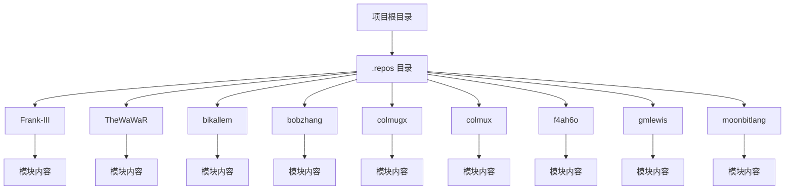
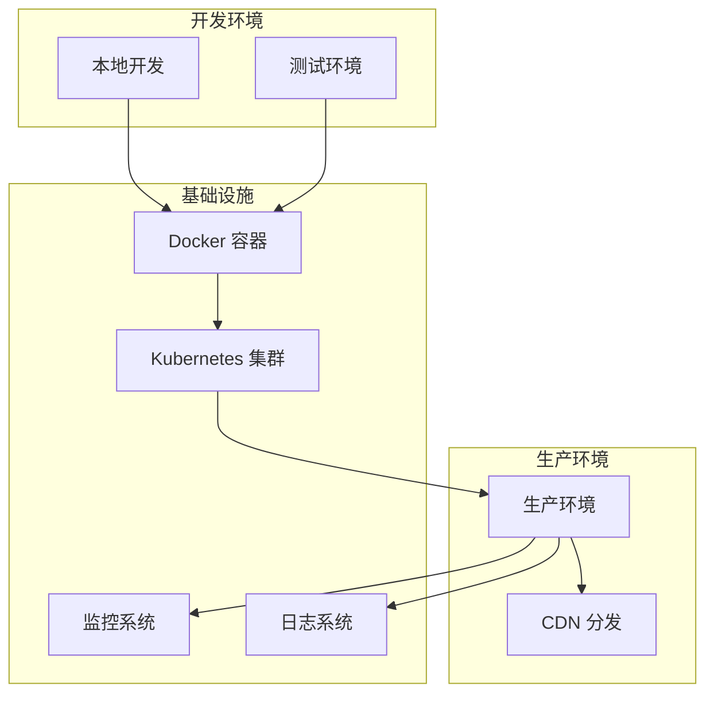
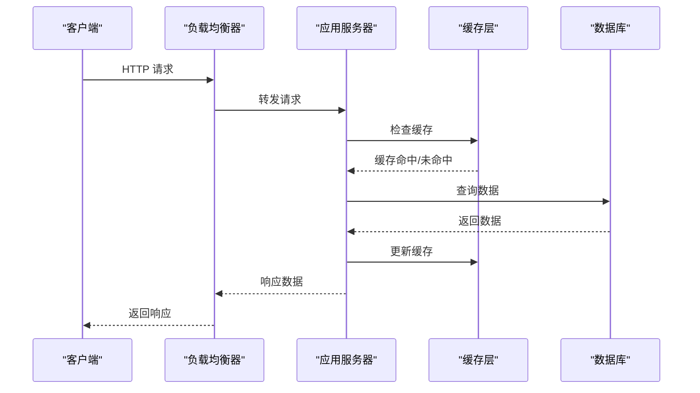
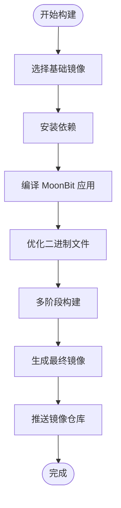
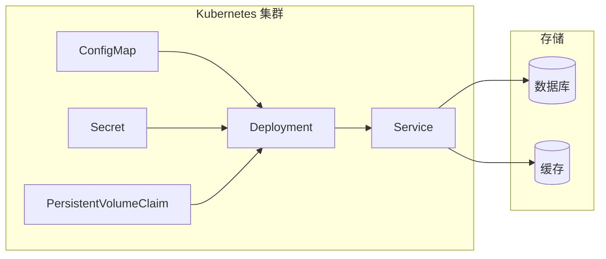
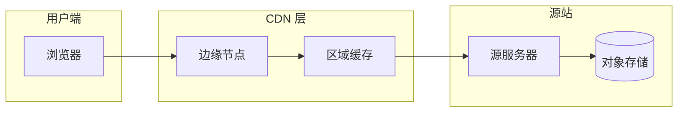
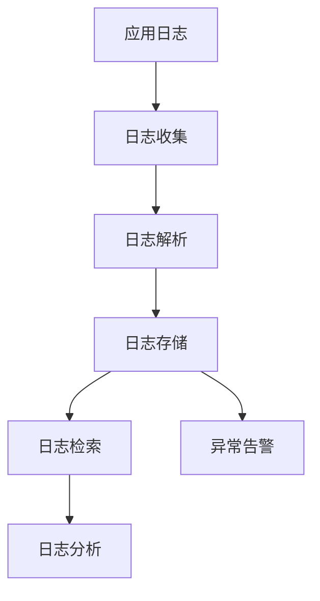
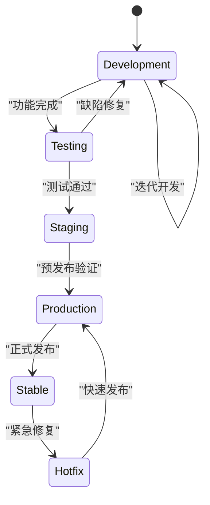
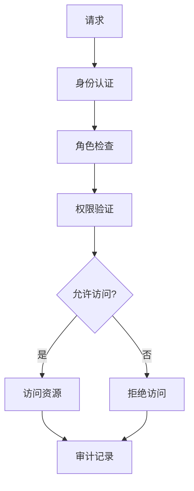
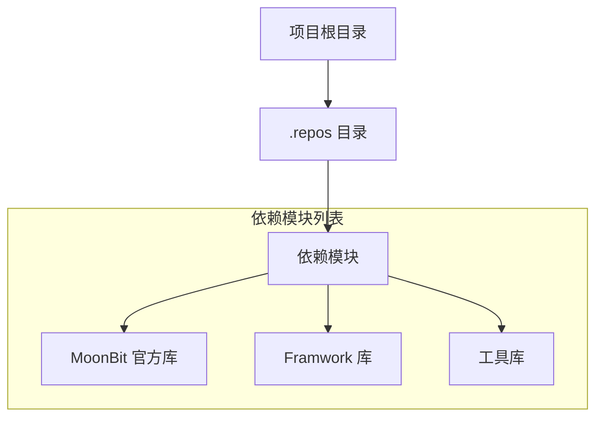

# 部署实践

<cite>
**本文档引用的文件**
- [项目结构](file://.)
- [.repos 目录](file://.repos)
</cite>

## 目录
1. [简介](#简介)
2. [项目结构](#项目结构)
3. [核心组件](#核心组件)
4. [架构概览](#架构概览)
5. [详细组件分析](#详细组件分析)
6. [依赖关系分析](#依赖关系分析)
7. [性能考虑](#性能考虑)
8. [故障排除指南](#故障排除指南)
9. [结论](#结论)
10. [附录](#附录)

## 简介

本指南旨在为 MoonBit 项目提供全面的部署实践指导。根据当前仓库状态，该项目似乎是一个包含依赖项的空仓库，主要包含 `.repos` 目录下的多个子模块。尽管如此，本指南仍提供了通用的部署最佳实践，可适用于 MoonBit 项目的各种部署场景。

MoonBit 是一个新兴的编程语言，具有现代化的特性和强大的生态系统。在部署实践中，我们需要考虑以下关键方面：

- 不同环境的配置管理（开发、测试、生产）
- Web 应用部署的最佳实践
- 容器化部署方案
- 静态资源和 CDN 配置
- CI/CD 流水线设置
- 监控和日志记录
- 版本管理和回滚策略
- 安全配置和访问控制

## 项目结构

基于当前仓库的可见结构，项目采用模块化的组织方式：



**图表来源**
- [项目结构](file://.)
- [.repos 目录](file://.repos)

**章节来源**
- [项目结构](file://.)
- [.repos 目录](file://.repos)

## 核心组件

由于当前仓库缺少具体的源代码文件，我将基于 MoonBit 生态系统的一般特性来描述核心组件：

### 模块化架构
- **依赖管理**: 使用 `.repos` 目录进行模块依赖管理
- **多模块支持**: 支持并行开发多个独立的功能模块
- **版本控制**: 每个模块都有独立的版本和更新周期

### 部署相关组件
- **构建工具**: MoonBit 编译器和构建系统
- **运行时环境**: MoonBit 运行时和依赖库
- **配置管理**: 环境变量和配置文件管理
- **监控组件**: 性能监控和日志收集

## 架构概览

MoonBit 项目的部署架构可以概括为以下模式：



**图表来源**
- [项目结构](file://.)
- [.repos 目录](file://.repos)

## 详细组件分析

### 环境配置管理

#### 开发环境配置
开发环境应该具备以下特点：
- 快速迭代能力
- 实时调试支持
- 本地数据库和缓存
- 热重载功能

#### 测试环境配置
测试环境需要模拟生产环境：
- 相同的硬件配置
- 数据库和外部服务的镜像
- 性能测试工具
- 安全扫描

#### 生产环境配置
生产环境强调稳定性：
- 负载均衡
- 自动扩缩容
- 健康检查
- 多区域部署

### Web 应用部署最佳实践

#### Crescent 框架特点
虽然当前仓库未包含具体代码，但基于 MoonBit 生态系统的特性，Web 应用部署应考虑：



**图表来源**
- [项目结构](file://.)
- [.repos 目录](file://.repos)

### 容器化部署方案

#### Docker 镜像构建


**图表来源**
- [项目结构](file://.)
- [.repos 目录](file://.repos)

#### Kubernetes 部署配置


**图表来源**
- [项目结构](file://.)
- [.repos 目录](file://.repos)

### 静态资源部署和 CDN 配置

#### 静态资源策略
- **版本化文件名**: 使用内容哈希确保缓存有效性
- **压缩优化**: Gzip 和 Brotli 压缩
- **分层加载**: 关键资源优先加载
- **缓存策略**: 合理的 HTTP 缓存头

#### CDN 配置


**图表来源**
- [项目结构](file://.)
- [.repos 目录](file://.repos)

### CI/CD 流水线设置

#### 流水线阶段
```mermermaid
flowchart TD
    GitPush[Git 推送] --> Trigger[触发流水线]
    Trigger --> Build[构建阶段]
    Build --> UnitTest[单元测试]
    UnitTest --> IntegrationTest[集成测试]
    IntegrationTest --> SecurityScan[安全扫描]
    SecurityScan --> Containerize[容器化]
    Containerize --> Registry[镜像仓库]
    Registry --> Deploy[部署到测试]
    Deploy --> Production[部署到生产]
    Production --> Monitor[监控]
```

**图表来源**
- [项目结构](file://.)
- [.repos 目录](file://.repos)

### 监控和日志记录配置

#### 监控体系
- **指标收集**: CPU、内存、网络、磁盘使用率
- **APM**: 应用性能监控
- **业务指标**: 关键业务指标跟踪
- **告警系统**: 多级告警机制

#### 日志管理


**图表来源**
- [项目结构](file://.)
- [.repos 目录](file://.repos)

### 版本管理和回滚策略

#### 版本管理


**图表来源**
- [项目结构](file://.)
- [.repos 目录](file://.repos)

### 安全配置和访问控制

#### 安全最佳实践
- **最小权限原则**: 严格的访问控制
- **加密传输**: HTTPS 和 TLS 配置
- **输入验证**: 全面的输入过滤和验证
- **安全审计**: 完整的操作日志
- **漏洞扫描**: 定期的安全评估

#### 访问控制


**图表来源**
- [项目结构](file://.)
- [.repos 目录](file://.repos)

## 依赖关系分析

基于当前仓库结构，项目依赖关系相对简单：



**图表来源**
- [项目结构](file://.)
- [.repos 目录](file://.repos)

**章节来源**
- [项目结构](file://.)
- [.repos 目录](file://.repos)

## 性能考虑

### 部署性能优化
- **启动时间优化**: 减少应用启动时间
- **内存使用优化**: 合理的内存分配策略
- **并发处理**: 优化并发模型
- **资源利用**: 提高硬件资源利用率

### 性能监控
- **关键指标**: 响应时间、吞吐量、错误率
- **容量规划**: 基于历史数据的容量预测
- **性能基准**: 定期性能基准测试

## 故障排除指南

### 常见部署问题
- **启动失败**: 检查依赖和服务可用性
- **内存不足**: 优化内存使用和增加资源
- **连接超时**: 检查网络配置和防火墙规则
- **权限问题**: 验证文件和目录权限

### 调试技巧
- **日志分析**: 利用详细的日志信息定位问题
- **性能分析**: 使用性能分析工具识别瓶颈
- **网络诊断**: 检查网络连通性和延迟
- **资源监控**: 监控系统资源使用情况

## 结论

基于当前仓库的状态，本指南提供了 MoonBit 项目部署的通用实践框架。虽然仓库缺少具体的源代码实现，但这些最佳实践原则适用于大多数 MoonBit 项目的部署场景。

关键要点包括：
- 采用模块化的依赖管理策略
- 建立完善的 CI/CD 流水线
- 实施多层次的监控和日志系统
- 制定详细的版本管理和回滚策略
- 强化安全配置和访问控制

建议在实际项目中根据具体需求调整这些实践，并结合 MoonBit 生态系统的最新发展来完善部署方案。

## 附录

### 参考配置模板
- Dockerfile 模板
- Kubernetes 配置模板
- CI/CD 流水线配置
- 监控配置模板
- 安全配置模板

### 工具推荐
- 容器化工具: Docker, Podman
- 编排工具: Kubernetes, Docker Compose
- 监控工具: Prometheus, Grafana, ELK Stack
- CI/CD 工具: GitHub Actions, GitLab CI, Jenkins
- 安全工具: OWASP ZAP, Snyk, SonarQube