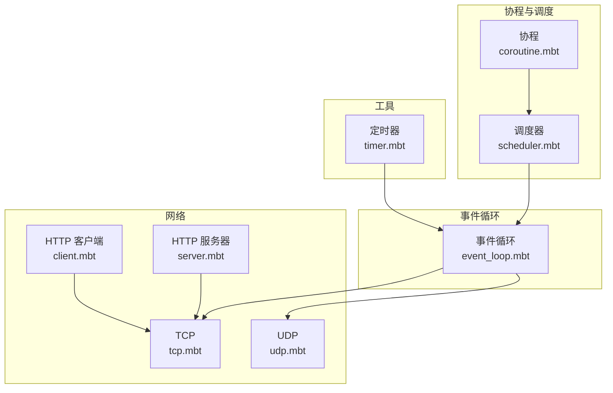
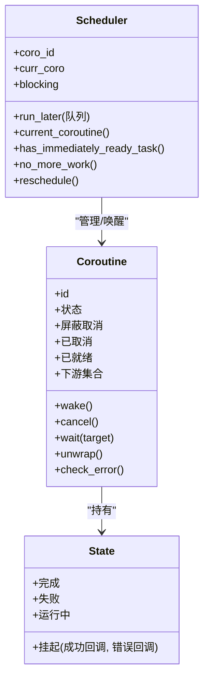
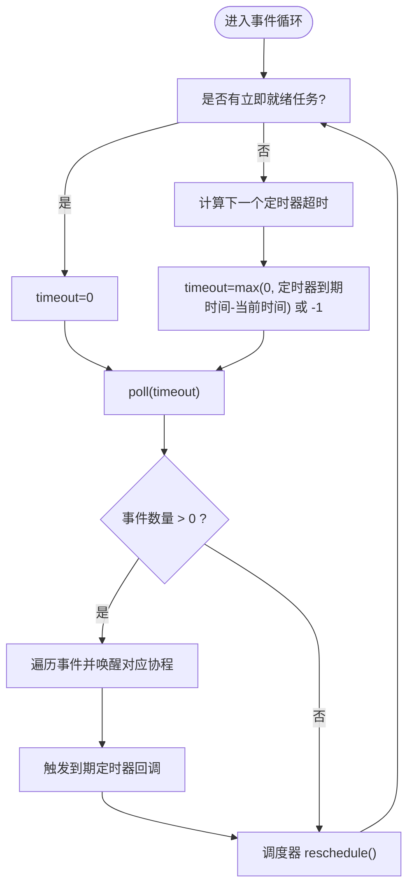
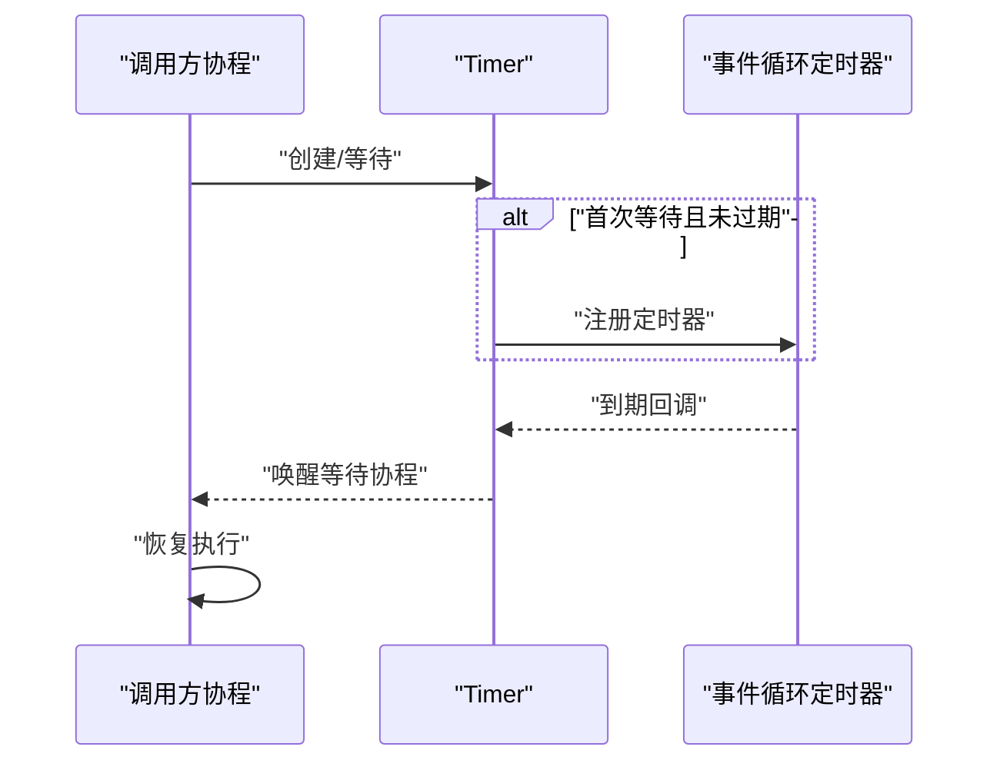
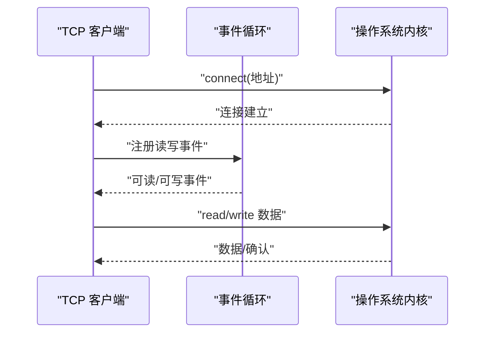
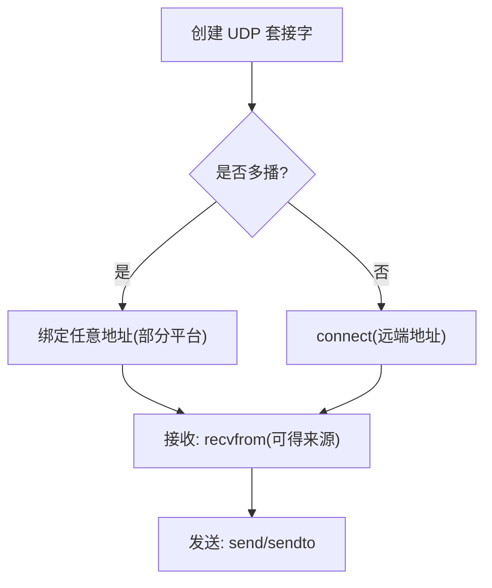
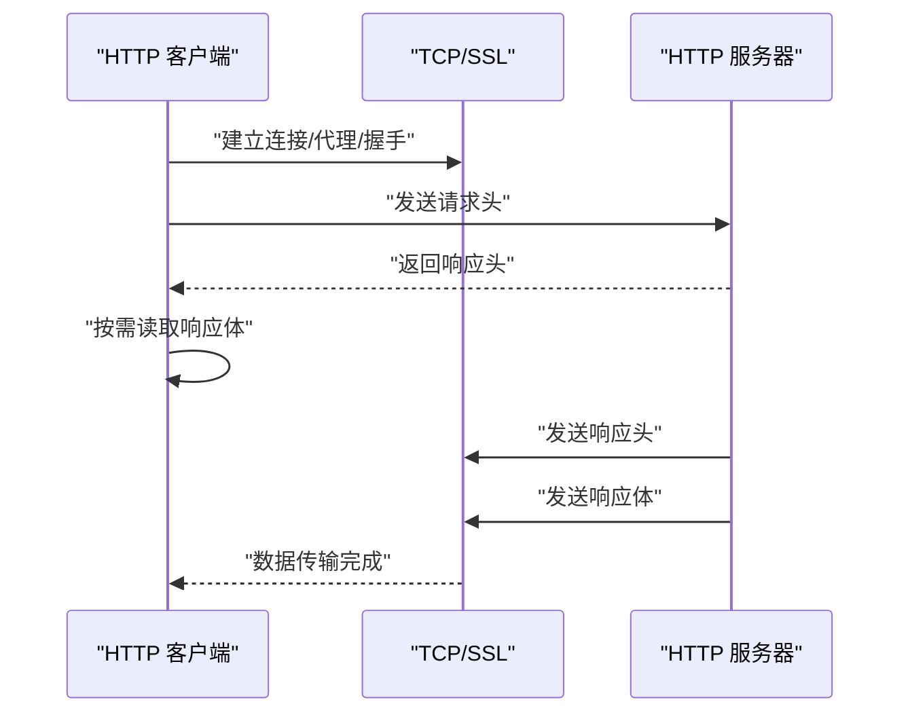
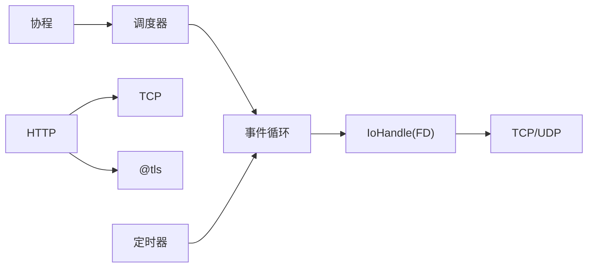

# moonbitlang/async 异步库

<cite>
**本文引用的文件**
- [coroutine.mbt](file://.repos/moonbitlang/async/0.19.1/src/internal/coroutine/coroutine.mbt)
- [scheduler.mbt](file://.repos/moonbitlang/async/0.19.1/src/internal/coroutine/scheduler.mbt)
- [event_loop.mbt](file://.repos/moonbitlang/async/0.19.1/src/internal/event_loop/event_loop.mbt)
- [timer.mbt](file://.repos/moonbitlang/async/0.19.1/src/timer.mbt)
- [client.mbt](file://.repos/moonbitlang/async/0.19.1/src/http/client.mbt)
- [server.mbt](file://.repos/moonbitlang/async/0.19.1/src/http/server.mbt)
- [tcp.mbt](file://.repos/moonbitlang/async/0.19.1/src/socket/tcp.mbt)
- [udp.mbt](file://.repos/moonbitlang/async/0.19.1/src/socket/udp.mbt)
- [pause_test.mbt](file://.repos/moonbitlang/async/0.19.1/src/internal/coroutine/pause_test.mbt)
</cite>

## 目录
1. [简介](#简介)
2. [项目结构](#项目结构)
3. [核心组件](#核心组件)
4. [架构总览](#架构总览)
5. [详细组件分析](#详细组件分析)
6. [依赖关系分析](#依赖关系分析)
7. [性能考虑](#性能考虑)
8. [故障排查指南](#故障排查指南)
9. [结论](#结论)
10. [附录](#附录)

## 简介
moonbitlang/async 是 MoonBit 生态中的异步运行时与网络库，提供协程、事件循环、定时器、HTTP 客户端/服务器以及 TCP/UDP 网络编程能力。其设计目标是通过非阻塞 I/O 与轻量级协程调度，在单线程模型下实现高并发与高性能的异步编程体验。

本库面向不同层次用户：
- 初学者：提供基础协程与事件循环概念、简单示例路径与最佳实践
- 高级用户：深入到调度器、事件循环、I/O 处理、TLS/代理等内部机制

## 项目结构
仓库采用按功能域划分的模块化组织方式，核心目录与职责概览：
- internal/coroutine：协程状态机、调度器、取消与等待机制
- internal/event_loop：事件循环、平台适配、IO 多路复用、定时器、线程池集成
- http：HTTP 客户端与服务器，请求/响应解析与发送
- socket：TCP/UDP 客户端与服务器，地址管理与多播支持
- timer：定时器抽象与睡眠等待
- 其他子模块：fs/io/os_error/pipe/process/semaphore/signal/websocket 等



图表来源
- [coroutine.mbt:1-194](file://.repos/moonbitlang/async/0.19.1/src/internal/coroutine/coroutine.mbt#L1-L194)
- [scheduler.mbt:1-68](file://.repos/moonbitlang/async/0.19.1/src/internal/coroutine/scheduler.mbt#L1-L68)
- [event_loop.mbt:1-538](file://.repos/moonbitlang/async/0.19.1/src/internal/event_loop/event_loop.mbt#L1-L538)
- [tcp.mbt:1-298](file://.repos/moonbitlang/async/0.19.1/src/socket/tcp.mbt#L1-L298)
- [udp.mbt:1-571](file://.repos/moonbitlang/async/0.19.1/src/socket/udp.mbt#L1-L571)
- [client.mbt:1-317](file://.repos/moonbitlang/async/0.19.1/src/http/client.mbt#L1-L317)
- [server.mbt:1-299](file://.repos/moonbitlang/async/0.19.1/src/http/server.mbt#L1-L299)
- [timer.mbt:1-143](file://.repos/moonbitlang/async/0.19.1/src/timer.mbt#L1-L143)

章节来源
- [coroutine.mbt:1-194](file://.repos/moonbitlang/async/0.19.1/src/internal/coroutine/coroutine.mbt#L1-L194)
- [scheduler.mbt:1-68](file://.repos/moonbitlang/async/0.19.1/src/internal/coroutine/scheduler.mbt#L1-L68)
- [event_loop.mbt:1-538](file://.repos/moonbitlang/async/0.19.1/src/internal/event_loop/event_loop.mbt#L1-L538)
- [tcp.mbt:1-298](file://.repos/moonbitlang/async/0.19.1/src/socket/tcp.mbt#L1-L298)
- [udp.mbt:1-571](file://.repos/moonbitlang/async/0.19.1/src/socket/udp.mbt#L1-L571)
- [client.mbt:1-317](file://.repos/moonbitlang/async/0.19.1/src/http/client.mbt#L1-L317)
- [server.mbt:1-299](file://.repos/moonbitlang/async/0.19.1/src/http/server.mbt#L1-L299)
- [timer.mbt:1-143](file://.repos/moonbitlang/async/0.19.1/src/timer.mbt#L1-L143)

## 核心组件
- 协程与调度
  - 协程状态机：完成、失败、运行中、挂起（含成功/错误回调）
  - 调度器：维护就绪队列、当前协程、阻塞计数，执行轮转
  - 取消与保护：屏蔽取消、检查取消、取消传播
- 事件循环
  - 平台适配：Linux/MacOS/Windows 不同实现
  - IO 多路复用：基于 poll/select，注册 FD 事件，处理完成事件
  - 定时器：最小堆式定时器集合，到期回调唤醒等待协程
  - 线程池：后台作业执行与取消，完成事件回传
- 网络
  - TCP：连接、监听、接受、读写、保活、并发限制
  - UDP：客户端/服务器、多播加入/接口/环回/TTL 设置、收发
  - HTTP：客户端（支持代理、TLS）、服务器（请求读取、响应发送、连接管理）
- 工具
  - 定时器：一次性定时器、刷新、取消、多等待者
  - 睡眠：基于定时器的非抢占式睡眠

章节来源
- [coroutine.mbt:16-134](file://.repos/moonbitlang/async/0.19.1/src/internal/coroutine/coroutine.mbt#L16-L134)
- [scheduler.mbt:16-68](file://.repos/moonbitlang/async/0.19.1/src/internal/coroutine/scheduler.mbt#L16-L68)
- [event_loop.mbt:38-155](file://.repos/moonbitlang/async/0.19.1/src/internal/event_loop/event_loop.mbt#L38-L155)
- [timer.mbt:48-143](file://.repos/moonbitlang/async/0.19.1/src/timer.mbt#L48-L143)
- [tcp.mbt:16-298](file://.repos/moonbitlang/async/0.19.1/src/socket/tcp.mbt#L16-L298)
- [udp.mbt:16-571](file://.repos/moonbitlang/async/0.19.1/src/socket/udp.mbt#L16-L571)
- [client.mbt:23-98](file://.repos/moonbitlang/async/0.19.1/src/http/client.mbt#L23-L98)
- [server.mbt:17-299](file://.repos/moonbitlang/async/0.19.1/src/http/server.mbt#L17-L299)

## 架构总览
异步运行时以“协程 + 事件循环”为核心，协程在挂起点交出控制权，事件循环驱动 IO 与定时器，完成后唤醒对应协程继续执行。网络组件通过事件循环的 IoHandle 将 FD 注册到 poll，并在事件到达时唤醒等待的协程。

```mermaid
sequenceDiagram
participant App as "应用协程"
participant Sched as "调度器"
participant Loop as "事件循环"
participant Poll as "IO 多路复用"
participant Net as "网络组件(TCP/UDP)"
participant Timer as "定时器"
App->>Sched : "spawn/fork 新协程"
Sched->>App : "标记为就绪"
loop "事件循环主循环"
Sched->>Loop : "reschedule() 执行就绪协程"
alt "协程调用阻塞操作"
App->>Net : "发起异步 IO/网络请求"
Net->>Poll : "注册 FD/事件"
App->>Sched : "suspend() 挂起"
Sched->>Loop : "让出控制权"
Poll-->>Loop : "事件到达(可读/可写/完成)"
Loop->>Net : "查询事件来源"
Net->>Sched : "唤醒等待协程"
end
opt "有定时器到期"
Timer-->>Sched : "唤醒等待协程"
end
end
```

图表来源
- [scheduler.mbt:52-68](file://.repos/moonbitlang/async/0.19.1/src/internal/coroutine/scheduler.mbt#L52-L68)
- [event_loop.mbt:212-233](file://.repos/moonbitlang/async/0.19.1/src/internal/event_loop/event_loop.mbt#L212-L233)
- [coroutine.mbt:76-103](file://.repos/moonbitlang/async/0.19.1/src/internal/coroutine/coroutine.mbt#L76-L103)
- [timer.mbt:19-24](file://.repos/moonbitlang/async/0.19.1/src/timer.mbt#L19-L24)

## 详细组件分析

### 协程与调度器
- 状态机
  - 运行中：正在执行
  - 挂起：保存成功/错误回调，等待事件或定时器
  - 完成/失败：结果已定，等待上层检查
- 关键操作
  - spawn：创建新协程并立即入队
  - pause/suspend：挂起当前协程，允许调度器推进其他任务
  - wake：将协程标记为就绪
  - wait：等待另一个协程结束或失败
  - 取消：支持屏蔽取消、检查取消、传播取消
- 调度策略
  - reschedule：执行一轮就绪队列，避免饥饿
  - has_immediately_ready_task/no_more_work：事件循环决策依据



图表来源
- [coroutine.mbt:16-41](file://.repos/moonbitlang/async/0.19.1/src/internal/coroutine/coroutine.mbt#L16-L41)
- [coroutine.mbt:106-134](file://.repos/moonbitlang/async/0.19.1/src/internal/coroutine/coroutine.mbt#L106-L134)
- [scheduler.mbt:16-34](file://.repos/moonbitlang/async/0.19.1/src/internal/coroutine/scheduler.mbt#L16-L34)
- [scheduler.mbt:52-68](file://.repos/moonbitlang/async/0.19.1/src/internal/coroutine/scheduler.mbt#L52-L68)

章节来源
- [coroutine.mbt:16-194](file://.repos/moonbitlang/async/0.19.1/src/internal/coroutine/coroutine.mbt#L16-L194)
- [scheduler.mbt:16-68](file://.repos/moonbitlang/async/0.19.1/src/internal/coroutine/scheduler.mbt#L16-L68)
- [pause_test.mbt:16-52](file://.repos/moonbitlang/async/0.19.1/src/internal/coroutine/pause_test.mbt#L16-L52)

### 事件循环与平台适配
- 初始化与生命周期
  - with_event_loop：创建事件循环、安装信号处理器、运行主协程
  - run_forever：主循环，处理 IO 事件、定时器、清理资源
- IO 事件处理
  - wait_for_event：计算超时，调用 poll，处理到期定时器
  - poll：根据平台分派，Linux 使用 pipe 通知与完成队列，Windows 使用自定义完成包
  - handle_completed_job：处理线程池完成事件，唤醒等待协程
- 清理与泄漏检测
  - cleanup：关闭 FD、取消剩余作业、回收线程池
  - check_fd_leak：环境变量开关检测未关闭 FD



图表来源
- [event_loop.mbt:212-233](file://.repos/moonbitlang/async/0.19.1/src/internal/event_loop/event_loop.mbt#L212-L233)
- [event_loop.mbt:265-325](file://.repos/moonbitlang/async/0.19.1/src/internal/event_loop/event_loop.mbt#L265-L325)
- [event_loop.mbt:411-433](file://.repos/moonbitlang/async/0.19.1/src/internal/event_loop/event_loop.mbt#L411-L433)

章节来源
- [event_loop.mbt:182-233](file://.repos/moonbitlang/async/0.19.1/src/internal/event_loop/event_loop.mbt#L182-L233)
- [event_loop.mbt:265-325](file://.repos/moonbitlang/async/0.19.1/src/internal/event_loop/event_loop.mbt#L265-L325)
- [event_loop.mbt:411-433](file://.repos/moonbitlang/async/0.19.1/src/internal/event_loop/event_loop.mbt#L411-L433)

### 定时器与睡眠
- sleep：创建一次性定时器，挂起直到到期或被取消
- Timer：支持多个等待者、刷新、取消；未等待者不占用资源
- 性能：定时器集合使用有序结构，到期时批量唤醒



图表来源
- [timer.mbt:19-24](file://.repos/moonbitlang/async/0.19.1/src/timer.mbt#L19-L24)
- [timer.mbt:96-119](file://.repos/moonbitlang/async/0.19.1/src/timer.mbt#L96-L119)

章节来源
- [timer.mbt:19-143](file://.repos/moonbitlang/async/0.19.1/src/timer.mbt#L19-L143)

### TCP 客户端与服务器
- TCP 客户端
  - connect：创建套接字、禁用 Nagle、建立连接、获取本地地址
  - 读写：实现 @io.Reader/@Writer 接口，缓冲读取
  - keepalive：可配置空闲、探测间隔与次数
- TCP 服务器
  - TcpServer::new：绑定地址、IPv6 双栈、SO_REUSEADDR、listen
  - run_forever：并发限制（信号量）、接受连接、派生子协程处理
  - accept：跨平台差异处理，设置 CLOEXEC、Nagle



图表来源
- [tcp.mbt:250-268](file://.repos/moonbitlang/async/0.19.1/src/socket/tcp.mbt#L250-L268)
- [tcp.mbt:285-297](file://.repos/moonbitlang/async/0.19.1/src/socket/tcp.mbt#L285-L297)
- [tcp.mbt:72-105](file://.repos/moonbitlang/async/0.19.1/src/socket/tcp.mbt#L72-L105)
- [tcp.mbt:130-162](file://.repos/moonbitlang/async/0.19.1/src/socket/tcp.mbt#L130-L162)

章节来源
- [tcp.mbt:16-298](file://.repos/moonbitlang/async/0.19.1/src/socket/tcp.mbt#L16-L298)

### UDP 客户端与服务器
- UdpClient
  - 连接语义：UDP 是无连接的，这里表示“固定远端”，便于简化通信
  - 多播：在某些平台绑定任意地址，接收来自任意对端的数据
  - 发送/接收：send/sendto/recv/recvfrom，支持带来源地址的接收
- UdpServer
  - 绑定监听：支持双栈、随机端口、获取实际地址
  - 多播仅服务器：multicast() 创建共享的多播只接收服务器
  - 多播加入：IPv4/IPv6 分别的接口选择、环回、TTL 设置



图表来源
- [udp.mbt:44-73](file://.repos/moonbitlang/async/0.19.1/src/socket/udp.mbt#L44-L73)
- [udp.mbt:459-487](file://.repos/moonbitlang/async/0.19.1/src/socket/udp.mbt#L459-L487)
- [udp.mbt:529-540](file://.repos/moonbitlang/async/0.19.1/src/socket/udp.mbt#L529-L540)
- [udp.mbt:221-247](file://.repos/moonbitlang/async/0.19.1/src/socket/udp.mbt#L221-L247)
- [udp.mbt:269-299](file://.repos/moonbitlang/async/0.19.1/src/socket/udp.mbt#L269-L299)

章节来源
- [udp.mbt:16-571](file://.repos/moonbitlang/async/0.19.1/src/socket/udp.mbt#L16-L571)

### HTTP 客户端与服务器
- HTTP 客户端
  - Client::connect：解析主机、可选代理 CONNECT、TLS 握手、构造 Reader/Sender
  - 请求/响应：request/end_request、get/post/put、flush、跳过响应体
  - 透传模式：enter_passthrough_mode 用于 CONNECT/升级场景
- HTTP 服务器
  - ServerConnection：从 TCP 连接创建，读取请求、发送响应、写响应体
  - Server::run_forever：接受连接、循环处理请求、自动结束响应
  - 透传模式：enter_passthrough_mode 支持隧道/升级



图表来源
- [client.mbt:40-98](file://.repos/moonbitlang/async/0.19.1/src/http/client.mbt#L40-L98)
- [client.mbt:245-253](file://.repos/moonbitlang/async/0.19.1/src/http/client.mbt#L245-L253)
- [client.mbt:210-220](file://.repos/moonbitlang/async/0.19.1/src/http/client.mbt#L210-L220)
- [server.mbt:224-279](file://.repos/moonbitlang/async/0.19.1/src/http/server.mbt#L224-L279)
- [server.mbt:166-180](file://.repos/moonbitlang/async/0.19.1/src/http/server.mbt#L166-L180)

章节来源
- [client.mbt:1-317](file://.repos/moonbitlang/async/0.19.1/src/http/client.mbt#L1-L317)
- [server.mbt:1-299](file://.repos/moonbitlang/async/0.19.1/src/http/server.mbt#L1-L299)

## 依赖关系分析
- 内部耦合
  - 协程依赖调度器进行唤醒/挂起
  - 事件循环依赖平台适配与 IO 多路复用
  - 网络组件通过 IoHandle 封装 FD，统一注册/注销与事件回调
  - HTTP 基于 TCP 实现，可选 TLS 与代理
- 外部依赖
  - 系统调用：socket/bind/listen/connect/read/write/poll/select
  - 平台差异：Windows 与类 Unix 的事件模型与线程池实现
- 循环依赖
  - 无直接循环依赖，模块间通过接口与事件回调解耦



图表来源
- [coroutine.mbt:106-134](file://.repos/moonbitlang/async/0.19.1/src/internal/coroutine/coroutine.mbt#L106-L134)
- [event_loop.mbt:38-70](file://.repos/moonbitlang/async/0.19.1/src/internal/event_loop/event_loop.mbt#L38-L70)
- [tcp.mbt:17-39](file://.repos/moonbitlang/async/0.19.1/src/socket/tcp.mbt#L17-L39)
- [udp.mbt:25-30](file://.repos/moonbitlang/async/0.19.1/src/socket/udp.mbt#L25-L30)
- [client.mbt:23-28](file://.repos/moonbitlang/async/0.19.1/src/http/client.mbt#L23-L28)
- [timer.mbt:19-24](file://.repos/moonbitlang/async/0.19.1/src/timer.mbt#L19-L24)

章节来源
- [coroutine.mbt:106-134](file://.repos/moonbitlang/async/0.19.1/src/internal/coroutine/coroutine.mbt#L106-L134)
- [event_loop.mbt:38-70](file://.repos/moonbitlang/async/0.19.1/src/internal/event_loop/event_loop.mbt#L38-L70)
- [tcp.mbt:17-39](file://.repos/moonbitlang/async/0.19.1/src/socket/tcp.mbt#L17-L39)
- [udp.mbt:25-30](file://.repos/moonbitlang/async/0.19.1/src/socket/udp.mbt#L25-L30)
- [client.mbt:23-28](file://.repos/moonbitlang/async/0.19.1/src/http/client.mbt#L23-L28)
- [timer.mbt:19-24](file://.repos/moonbitlang/async/0.19.1/src/timer.mbt#L19-L24)

## 性能考虑
- 减少上下文切换
  - 使用 pause() 在可重入点让出，避免不必要的 suspend
  - 合理使用 protect_from_cancel，避免频繁取消检查
- IO 并发
  - TCP/UDP 限制单协程读写，多读者/写者应使用工作协程 + 队列
  - 服务器可通过信号量限制并发连接数，防止资源耗尽
- 定时器与轮询
  - sleep 与定时器尽量批量化，减少事件循环轮次
  - 合理设置 poll 超时，避免忙轮询
- 线程池
  - 后台作业过多会增加线程池竞争，必要时拆分任务粒度
- 网络参数
  - TCP_NAGLE 默认禁用，降低延迟
  - keepalive 参数按场景调整，平衡保活与开销

## 故障排查指南
- 协程未被唤醒
  - 检查是否正确调用 wake()/unwrap()/wait()
  - 确认事件循环主循环未提前退出
- 取消未生效
  - 确认未屏蔽取消（shielded），检查 is_being_cancelled/check_cancellation
  - 使用 protect_from_cancel 包裹需要保护的逻辑
- 文件描述符泄漏
  - 开启 MOONBIT_ASYNC_CHECK_FD_LEAK 环境变量进行泄漏检测
  - 确保所有 TCP/UDP/HTTP 对象在使用后关闭
- 网络错误
  - 查看 os_error 映射与 errno_is_cancelled 行为
  - Windows 平台注意完成包与自定义事件区分
- 定时器异常
  - 检查 Timer::cancel 与 refresh 的调用时机
  - 确保未在已终止/已取消状态下继续等待

章节来源
- [coroutine.mbt:52-62](file://.repos/moonbitlang/async/0.19.1/src/internal/coroutine/coroutine.mbt#L52-L62)
- [event_loop.mbt:328-340](file://.repos/moonbitlang/async/0.19.1/src/internal/event_loop/event_loop.mbt#L328-L340)
- [event_loop.mbt:490-524](file://.repos/moonbitlang/async/0.19.1/src/internal/event_loop/event_loop.mbt#L490-L524)
- [timer.mbt:86-88](file://.repos/moonbitlang/async/0.19.1/src/timer.mbt#L86-L88)

## 结论
moonbitlang/async 提供了从协程调度到网络编程的完整异步生态。其核心优势在于：
- 以事件循环驱动的非阻塞 IO，配合协程实现高并发
- 平台适配完善，Linux/MacOS/Windows 一致行为
- 网络组件覆盖 TCP/UDP/HTTP，支持 TLS 与代理
- 工具链完善（定时器、信号、进程、管道等），便于构建复杂应用

建议在生产环境中结合本文的性能与故障排查建议，合理设计并发模型与错误处理策略。

## 附录
- 使用示例路径（不展示具体代码，仅提供定位）
  - 协程挂起与等待：[pause_test.mbt:16-52](file://.repos/moonbitlang/async/0.19.1/src/internal/coroutine/pause_test.mbt#L16-L52)
  - HTTP 客户端 GET 请求：[client.mbt:264-275](file://.repos/moonbitlang/async/0.19.1/src/http/client.mbt#L264-L275)
  - HTTP 服务器主循环：[server.mbt:260-279](file://.repos/moonbitlang/async/0.19.1/src/http/server.mbt#L260-L279)
  - TCP 服务器并发限制：[tcp.mbt:137-162](file://.repos/moonbitlang/async/0.19.1/src/socket/tcp.mbt#L137-L162)
  - UDP 多播加入：[udp.mbt:394-405](file://.repos/moonbitlang/async/0.19.1/src/socket/udp.mbt#L394-L405)