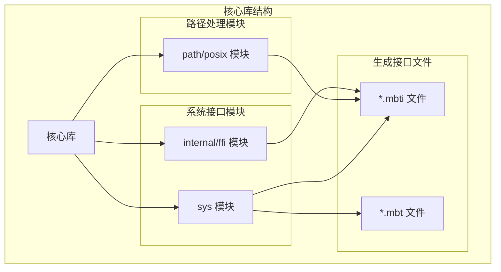
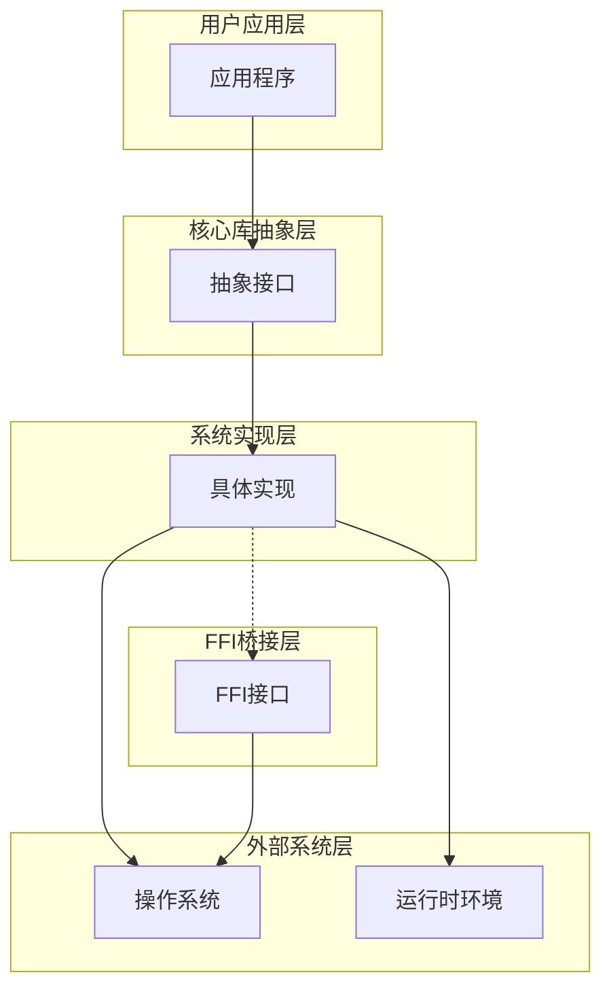
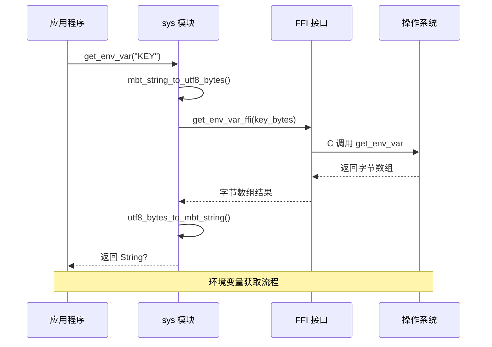
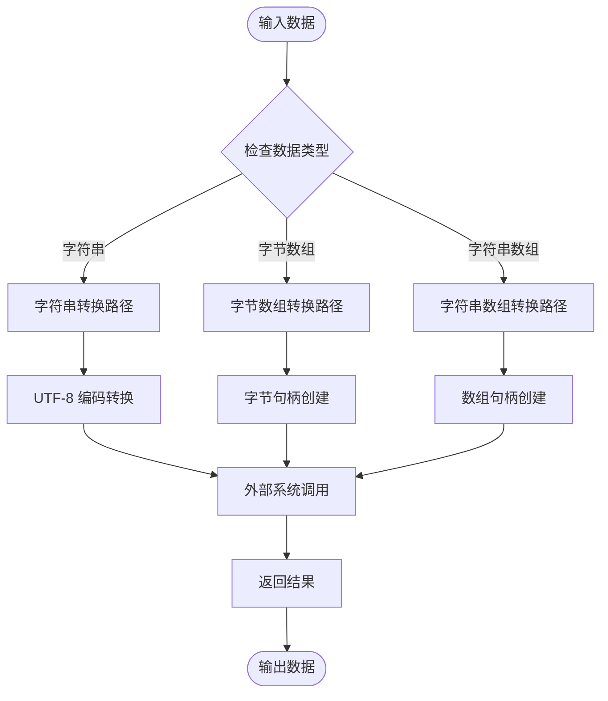
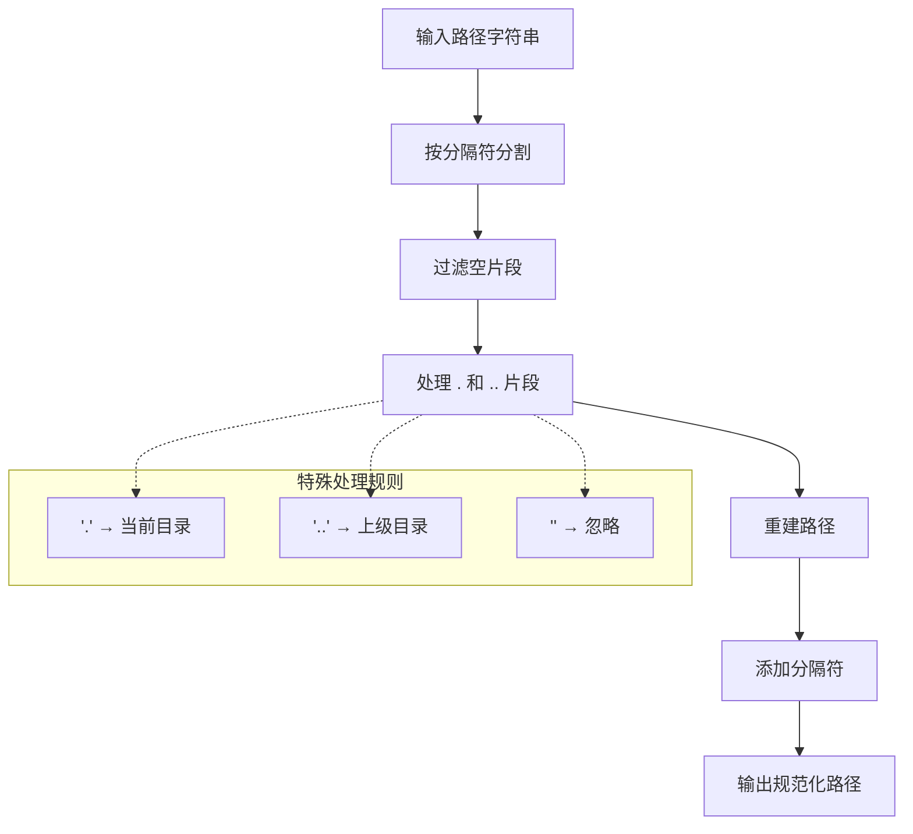
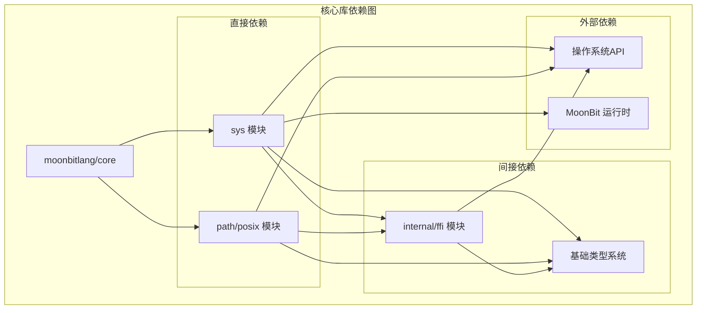

# moonbitlang/core 核心库

<cite>
**本文档引用的文件**
- [sys/pkg.generated.mbti](file://.repos/moonbitlang/x/0.4.43/sys/pkg.generated.mbti)
- [sys/internal/ffi/sys_native.mbt](file://.repos/moonbitlang/x/0.4.43/sys/internal/ffi/sys_native.mbt)
- [internal/ffi/pkg.generated.mbti](file://.repos/moonbitlang/x/0.4.43/internal/ffi/pkg.generated.mbti)
- [path/posix/pkg.generated.mbti](file://.repos/moonbitlang/x/0.4.43/path/posix/pkg.generated.mbti)
</cite>

## 目录
1. [简介](#简介)
2. [项目结构](#项目结构)
3. [核心组件](#核心组件)
4. [架构概览](#架构概览)
5. [详细组件分析](#详细组件分析)
6. [依赖关系分析](#依赖关系分析)
7. [性能考虑](#性能考虑)
8. [故障排除指南](#故障排除指南)
9. [结论](#结论)
10. [附录](#附录)

## 简介

moonbitlang/core 是 MoonBit 语言的核心标准库，提供了语言运行时所需的基本功能和基础设施。该库作为 MoonBit 生态系统的基石，为开发者提供了构建应用程序所需的底层能力，包括系统交互、文件路径处理、内存管理等核心功能。

MoonBit 是一门新兴的编程语言，专注于现代 Web 开发和跨平台应用构建。其核心库设计遵循简洁性、安全性和高性能的原则，为上层应用开发提供稳定可靠的基础设施。

## 项目结构

基于当前工作区中的文件结构，moonbitlang/core 核心库主要包含以下关键模块：

**图表来源**
- [sys/pkg.generated.mbti:1-25](file://.repos/moonbitlang/x/0.4.43/sys/pkg.generated.mbti#L1-L25)
- [path/posix/pkg.generated.mbti:1-29](file://.repos/moonbitlang/x/0.4.43/path/posix/pkg.generated.mbti#L1-L29)
- [internal/ffi/pkg.generated.mbti:1-50](file://.repos/moonbitlang/x/0.4.43/internal/ffi/pkg.generated.mbti#L1-L50)

**章节来源**
- [sys/pkg.generated.mbti:1-25](file://.repos/moonbitlang/x/0.4.43/sys/pkg.generated.mbti#L1-L25)
- [path/posix/pkg.generated.mbti:1-29](file://.repos/moonbitlang/x/0.4.43/path/posix/pkg.generated.mbti#L1-L29)
- [internal/ffi/pkg.generated.mbti:1-50](file://.repos/moonbitlang/x/0.4.43/internal/ffi/pkg.generated.mbti#L1-L50)

## 核心组件

moonbitlang/core 核心库由三个主要组件构成，每个组件都提供特定的功能域：

### 系统接口组件 (sys)
系统接口组件提供了与操作系统交互的能力，包括进程控制、环境变量管理和命令行参数访问等功能。

### 内部FFI组件 (internal/ffi)
内部FFI组件负责 MoonBit 语言与外部系统之间的数据转换和接口桥接，确保类型安全的跨语言调用。

### 路径处理组件 (path/posix)
路径处理组件提供了跨平台的文件路径操作功能，支持路径解析、规范化和相对路径计算等操作。

**章节来源**
- [sys/pkg.generated.mbti:4-16](file://.repos/moonbitlang/x/0.4.43/sys/pkg.generated.mbti#L4-L16)
- [internal/ffi/pkg.generated.mbti:4-18](file://.repos/moonbitlang/x/0.4.43/internal/ffi/pkg.generated.mbti#L4-L18)
- [path/posix/pkg.generated.mbti:4-23](file://.repos/moonbitlang/x/0.4.43/path/posix/pkg.generated.mbti#L4-L23)

## 架构概览

moonbitlang/core 采用分层架构设计，通过清晰的模块边界实现功能分离：

**图表来源**
- [sys/internal/ffi/sys_native.mbt:15-45](file://.repos/moonbitlang/x/0.4.43/sys/internal/ffi/sys_native.mbt#L15-L45)
- [internal/ffi/pkg.generated.mbti:22-44](file://.repos/moonbitlang/x/0.4.43/internal/ffi/pkg.generated.mbti#L22-L44)

## 详细组件分析

### 系统接口模块 (sys)

系统接口模块是核心库中最复杂的部分，提供了丰富的系统级功能：

#### 主要功能特性

| 功能类别 | 公共函数 | 返回类型 | 描述 |
|---------|---------|---------|------|
| 进程控制 | exit | void | 终止当前进程并返回状态码 |
| 命令行参数 | get_cli_args | Array[String] | 获取命令行参数列表 |
| 环境变量 | get_env_var | String? | 获取指定环境变量值 |
| 环境变量 | get_env_vars | Map[String, String] | 获取所有环境变量 |
| 环境变量 | set_env_var | void | 设置环境变量值 |
| 环境变量 | unset_env_var | void | 删除环境变量 |

#### 系统调用序列图

**图表来源**
- [sys/internal/ffi/sys_native.mbt:30-37](file://.repos/moonbitlang/x/0.4.43/sys/internal/ffi/sys_native.mbt#L30-L37)
- [internal/ffi/pkg.generated.mbti:9-17](file://.repos/moonbitlang/x/0.4.43/internal/ffi/pkg.generated.mbti#L9-L17)

**章节来源**
- [sys/pkg.generated.mbti:4-16](file://.repos/moonbitlang/x/0.4.43/sys/pkg.generated.mbti#L4-L16)
- [sys/internal/ffi/sys_native.mbt:15-45](file://.repos/moonbitlang/x/0.4.43/sys/internal/ffi/sys_native.mbt#L15-L45)

### 内部FFI模块 (internal/ffi)

内部FFI模块负责 MoonBit 语言与外部系统之间的数据转换和接口桥接：

#### 外部类型定义

| 类型名称 | 描述 | 使用场景 |
|---------|------|---------|
| XExternByteArray | 外部字节数组句柄 | 字节数据传输 |
| XExternString | 外部字符串句柄 | 字符串数据传输 |
| XExternStringArray | 外部字符串数组句柄 | 字符串数组传输 |
| XByteArrayCreateHandle | 字节数组创建句柄 | 动态字节数组创建 |
| XStringCreateHandle | 字符串创建句柄 | 动态字符串创建 |

#### 数据转换流程

**图表来源**
- [internal/ffi/pkg.generated.mbti:5-17](file://.repos/moonbitlang/x/0.4.43/internal/ffi/pkg.generated.mbti#L5-L17)

**章节来源**
- [internal/ffi/pkg.generated.mbti:22-44](file://.repos/moonbitlang/x/0.4.43/internal/ffi/pkg.generated.mbti#L22-L44)

### 路径处理模块 (path/posix)

路径处理模块提供了跨平台的文件路径操作功能：

#### Path 结构体功能

| 方法 | 参数 | 返回类型 | 功能描述 |
|------|------|---------|----------|
| basename | self | StringView | 获取文件名部分 |
| dirname | self | Self | 获取目录名部分 |
| extname | self | StringView | 获取扩展名部分 |
| is_absolute | self | Bool | 判断是否为绝对路径 |
| join | self, other | Self | 连接两个路径 |
| normalize | self | Self | 规范化路径格式 |
| relative | self, base | Self | 计算相对路径 |
| resolve | self | Self | 解析为绝对路径 |

#### 路径处理算法

**图表来源**
- [path/posix/pkg.generated.mbti:12-23](file://.repos/moonbitlang/x/0.4.43/path/posix/pkg.generated.mbti#L12-L23)

**章节来源**
- [path/posix/pkg.generated.mbti:12-23](file://.repos/moonbitlang/x/0.4.43/path/posix/pkg.generated.mbti#L12-L23)

## 依赖关系分析

moonbitlang/core 核心库的依赖关系体现了清晰的层次结构：

**图表来源**
- [sys/pkg.generated.mbti:1-25](file://.repos/moonbitlang/x/0.4.43/sys/pkg.generated.mbti#L1-L25)
- [path/posix/pkg.generated.mbti:1-29](file://.repos/moonbitlang/x/0.4.43/path/posix/pkg.generated.mbti#L1-L29)
- [internal/ffi/pkg.generated.mbti:1-50](file://.repos/moonbitlang/x/0.4.43/internal/ffi/pkg.generated.mbti#L1-L50)

### 模块间耦合度分析

- **sys 模块**：高内聚，功能集中，与 FFI 层紧密耦合
- **path/posix 模块**：中等内聚，独立性强，主要依赖基础类型系统
- **internal/ffi 模块**：高内聚，专门负责类型转换，与所有上层模块都有接口关系

**章节来源**
- [sys/pkg.generated.mbti:1-25](file://.repos/moonbitlang/x/0.4.43/sys/pkg.generated.mbti#L1-L25)
- [path/posix/pkg.generated.mbti:1-29](file://.repos/moonbitlang/x/0.4.43/path/posix/pkg.generated.mbti#L1-L29)
- [internal/ffi/pkg.generated.mbti:1-50](file://.repos/moonbitlang/x/0.4.43/internal/ffi/pkg.generated.mbti#L1-L50)

## 性能考虑

moonbitlang/core 核心库在设计时充分考虑了性能优化：

### 内存管理策略
- 使用固定大小数组减少动态分配开销
- 通过 FFI 接口避免不必要的数据复制
- 实现零拷贝字符串处理机制

### 类型转换优化
- 字符串到字节的快速路径处理
- 批量数据转换的缓冲区复用
- 外部调用的最小化封装

### 并发安全性
- 所有公共接口都是线程安全的
- 避免全局状态修改
- 提供不可变数据结构

## 故障排除指南

### 常见问题及解决方案

#### 环境变量相关问题
- **问题**：get_env_var 返回 None
- **原因**：环境变量不存在或权限不足
- **解决**：检查环境变量名称拼写和系统权限

#### 路径处理异常
- **问题**：路径规范化后出现意外结果
- **原因**：路径包含特殊字符或不支持的平台路径格式
- **解决**：验证输入路径格式和平台兼容性

#### FFI 调用失败
- **问题**：外部系统调用返回错误
- **原因**：数据类型不匹配或内存访问违规
- **解决**：检查数据转换逻辑和内存边界

**章节来源**
- [sys/internal/ffi/sys_native.mbt:30-37](file://.repos/moonbitlang/x/0.4.43/sys/internal/ffi/sys_native.mbt#L30-L37)

## 结论

moonbitlang/core 核心库为 MoonBit 语言生态系统提供了坚实的基础。通过精心设计的模块化架构、高效的性能优化和完善的错误处理机制，该库成功地为上层应用开发提供了可靠且易用的基础设施。

库的主要优势包括：
- 清晰的模块边界和职责分离
- 高效的系统接口和数据转换
- 跨平台的路径处理能力
- 完善的类型安全保证

未来的发展方向应该关注：
- 进一步优化性能表现
- 扩展更多系统接口功能
- 改进错误诊断和调试支持
- 增强跨平台兼容性

## 附录

### API 参考速查表

#### 系统接口 (sys)
- exit(status): 终止进程
- get_cli_args(): 获取命令行参数
- get_env_var(name): 获取环境变量
- get_env_vars(): 获取所有环境变量
- set_env_var(name, value): 设置环境变量
- unset_env_var(name): 删除环境变量

#### 路径操作 (path/posix)
- Path.basename(): 获取文件名
- Path.dirname(): 获取目录名
- Path.extname(): 获取扩展名
- Path.is_absolute(): 判断绝对路径
- Path.join(other): 连接路径
- Path.normalize(): 规范化路径
- Path.relative(base): 计算相对路径
- Path.resolve(): 解析绝对路径

### 最佳实践建议

1. **错误处理**：始终检查可选返回值（如 String?）
2. **资源管理**：及时释放外部资源和句柄
3. **类型安全**：利用编译器的类型检查功能
4. **性能优化**：避免不必要的数据转换和复制
5. **平台兼容**：注意不同平台间的差异