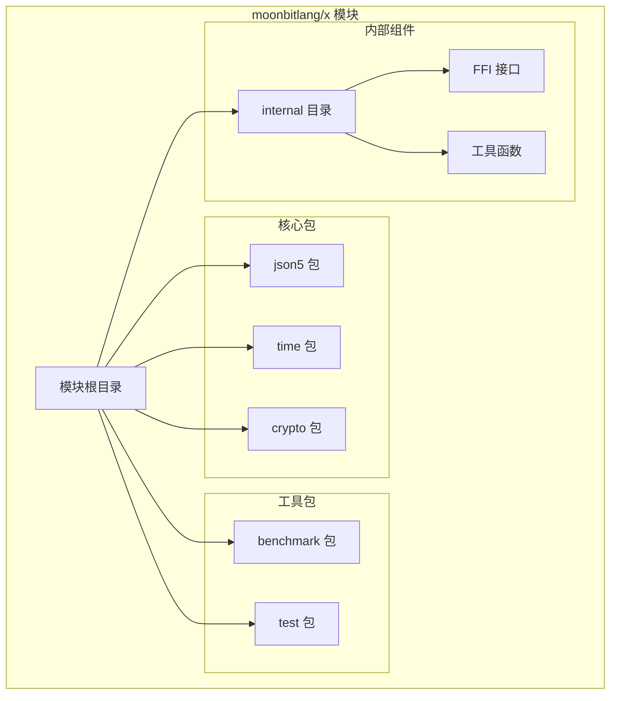
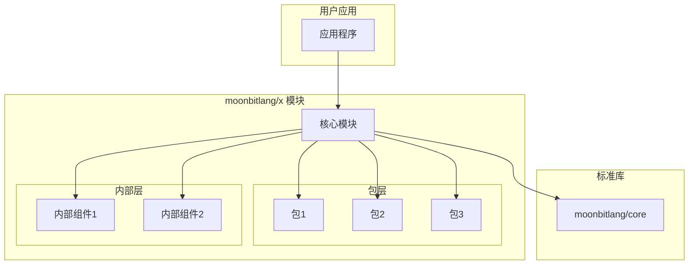
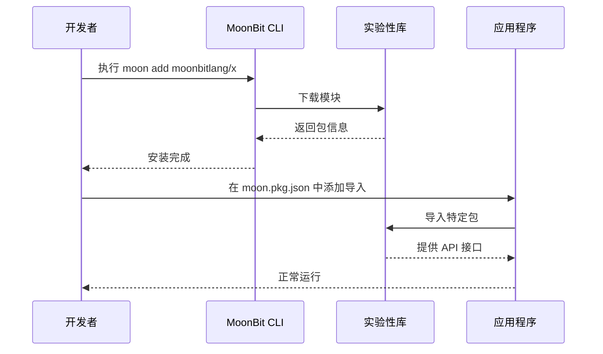
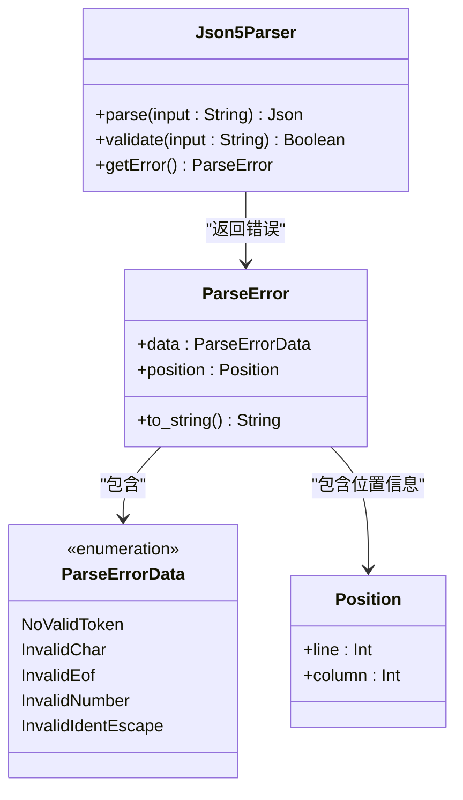
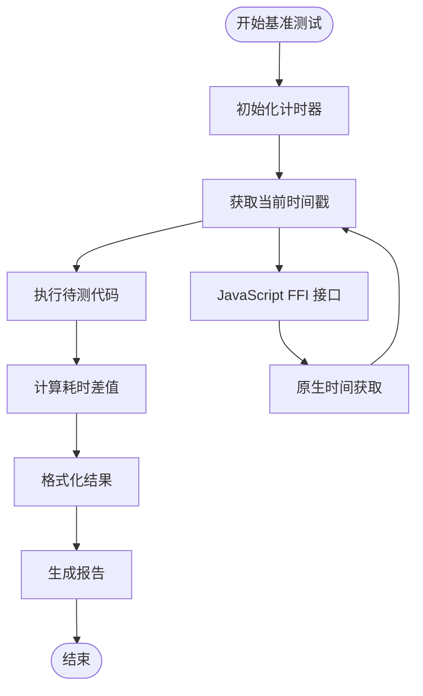
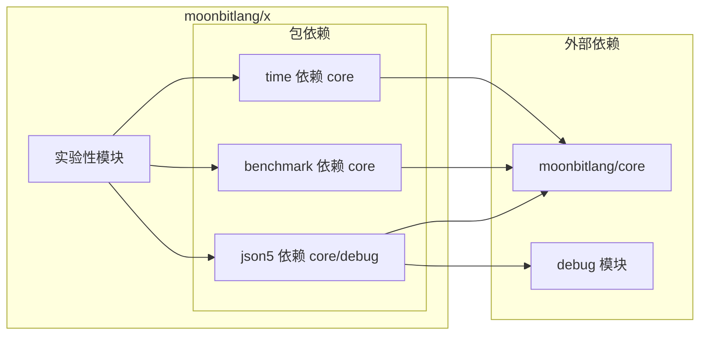
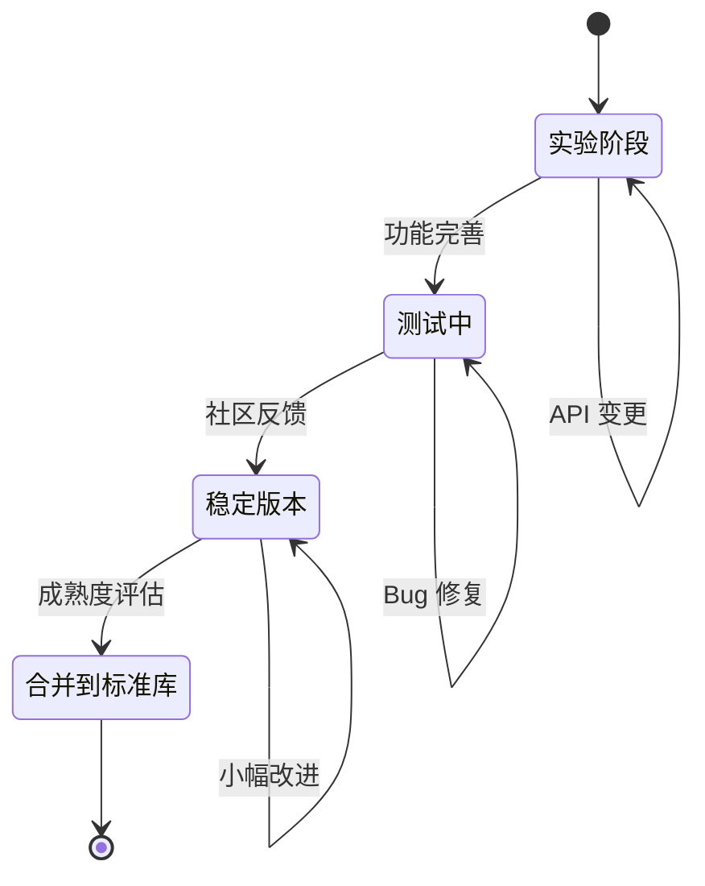

# moonbitlang/x 实验性库

<cite>
**本文档引用的文件**
- [README.md](file://.repos/moonbitlang/x/0.4.43/README.md)
- [json5/README.mbt.md](file://.repos/moonbitlang/x/0.4.43/json5/README.mbt.md)
- [json5/pkg.generated.mbti](file://.repos/moonbitlang/x/0.4.43/json5/pkg.generated.mbti)
- [benchmark/internal/benchmark_ffi/ffi_js.mbt](file://.repos/moonbitlang/x/0.4.43/benchmark/internal/benchmark_ffi/ffi_js.mbt)
</cite>

## 目录
1. [简介](#简介)
2. [项目结构](#项目结构)
3. [核心组件](#核心组件)
4. [架构概览](#架构概览)
5. [详细组件分析](#详细组件分析)
6. [依赖关系分析](#依赖关系分析)
7. [性能考虑](#性能考虑)
8. [故障排除指南](#故障排除指南)
9. [结论](#结论)
10. [附录](#附录)

## 简介

moonbitlang/x 是 MoonBit 语言的一个实验性库模块，包含多个正在开发和测试中的包。这些包具有以下特点：

- **实验性质**：作为新功能的试验田，允许快速迭代和社区反馈
- **频繁变更**：API 可能会随着版本更新而变化
- **孵化目标**：成熟的包可能会被合并到标准库 moonbitlang/core 中
- **多包集合**：包含 json5、benchmark 等不同领域的实验性实现

该库的设计目的是为 MoonBit 生态系统提供一个灵活的实验平台，让开发者能够提前体验新功能，同时收集社区反馈来指导正式功能的开发。

## 项目结构

moonbitlang/x 采用模块化组织结构，主要包含以下核心部分：

**图表来源**
- [.repos/moonbitlang/x/0.4.43/README.md:1-38](file://.repos/moonbitlang/x/0.4.43/README.md#L1-L38)

**章节来源**
- [.repos/moonbitlang/x/0.4.43/README.md:1-38](file://.repos/moonbitlang/x/0.4.43/README.md#L1-L38)

## 核心组件

### 实验性包生态系统

moonbitlang/x 包含多个实验性包，每个包都有其特定的功能领域：

#### JSON5 解析器
- **功能**：提供 JSON5 格式数据的解析能力
- **状态**：当前仅实现解析功能
- **来源**：基于流行的 JavaScript JSON5 库移植

#### 性能基准测试
- **功能**：提供性能测试和基准测量工具
- **特性**：支持跨平台性能测试
- **实现**：包含 JavaScript 外部接口集成

#### 时间处理
- **功能**：扩展时间相关的处理能力
- **目标**：提供更丰富的日期时间操作

#### 加密功能
- **功能**：基础加密算法和安全工具
- **状态**：作为实验性功能提供

**章节来源**
- [.repos/moonbitlang/x/0.4.43/json5/README.mbt.md:1-6](file://.repos/moonbitlang/x/0.4.43/json5/README.mbt.md#L1-L6)

## 架构概览

### 模块依赖关系

**图表来源**
- [.repos/moonbitlang/x/0.4.43/README.md:5-10](file://.repos/moonbitlang/x/0.4.43/README.md#L5-L10)

### 使用流程

**图表来源**
- [.repos/moonbitlang/x/0.4.43/README.md:12-29](file://.repos/moonbitlang/x/0.4.43/README.md#L12-L29)

## 详细组件分析

### JSON5 包分析

#### API 设计

**图表来源**
- [.repos/moonbitlang/x/0.4.43/json5/pkg.generated.mbti:8-35](file://.repos/moonbitlang/x/0.4.43/json5/pkg.generated.mbti#L8-L35)

#### 错误处理机制

JSON5 包实现了完善的错误处理系统：

| 错误类型 | 触发条件 | 位置信息 |
|---------|---------|---------|
| NoValidToken | 无法识别有效标记 | 记录位置 |
| InvalidChar | 遇到无效字符 | 字符位置 |
| InvalidEof | 过早遇到文件结束 | 行列位置 |
| InvalidNumber | 数字格式错误 | 数字位置和原因 |
| InvalidIdentEscape | 标识符转义错误 | 转义位置 |

**章节来源**
- [.repos/moonbitlang/x/0.4.43/json5/pkg.generated.mbti:11-35](file://.repos/moonbitlang/x/0.4.43/json5/pkg.generated.mbti#L11-L35)

### 性能基准测试包

#### FFI 接口设计

**图表来源**
- [.repos/moonbitlang/x/0.4.43/benchmark/internal/benchmark_ffi/ffi_js.mbt:15-28](file://.repos/moonbitlang/x/0.4.43/benchmark/internal/benchmark_ffi/ffi_js.mbt#L15-L28)

**章节来源**
- [.repos/moonbitlang/x/0.4.43/benchmark/internal/benchmark_ffi/ffi_js.mbt:1-28](file://.repos/moonbitlang/x/0.4.43/benchmark/internal/benchmark_ffi/ffi_js.mbt#L1-L28)

## 依赖关系分析

### 模块间依赖

**图表来源**
- [.repos/moonbitlang/x/0.4.43/json5/pkg.generated.mbti:4-6](file://.repos/moonbitlang/x/0.4.43/json5/pkg.generated.mbti#L4-L6)

### 版本管理策略

**图表来源**
- [.repos/moonbitlang/x/0.4.43/README.md:9-10](file://.repos/moonbitlang/x/0.4.43/README.md#L9-L10)

## 性能考虑

### 实验性库的性能特征

1. **开发优先**：实验性库优先保证功能正确性，性能优化可能不是首要考虑
2. **API 稳定性**：频繁的 API 变更可能影响性能优化的持续性
3. **内存管理**：实验性功能可能使用较新的内存管理模式
4. **编译时优化**：某些实验性功能可能受益于 MoonBit 的编译时优化

### 最佳实践建议

- **监控性能影响**：在生产环境中使用前进行性能基准测试
- **渐进式采用**：从小规模使用开始，逐步扩大应用范围
- **版本锁定**：在项目中锁定具体的实验性库版本
- **定期更新**：关注实验性库的更新日志，及时评估升级风险

## 故障排除指南

### 常见问题及解决方案

#### 依赖安装问题
- **症状**：moon add 命令执行失败
- **解决方案**：检查网络连接，确认 moonbitlang/x 版本号正确

#### 导入错误
- **症状**：在 moon.pkg.json 中导入包时报错
- **解决方案**：确认包名拼写正确，检查版本兼容性

#### API 变更导致的问题
- **症状**：代码编译失败，提示 API 不匹配
- **解决方案**：查看版本变更日志，更新代码以适配新 API

#### 性能问题
- **症状**：实验性功能运行缓慢
- **解决方案**：使用 benchmark 包进行性能测试，寻找优化机会

**章节来源**
- [.repos/moonbitlang/x/0.4.43/README.md:31-31](file://.repos/moonbitlang/x/0.4.43/README.md#L31-L31)

## 结论

moonbitlang/x 实验性库为 MoonBit 生态系统提供了重要的创新平台。通过实验性包的形式，开发者可以：

1. **提前体验新功能**：在正式发布前试用潜在的新特性
2. **提供反馈**：通过实际使用为功能改进提供宝贵意见
3. **参与生态建设**：直接参与到 MoonBit 语言的发展中

### 发展前景

- **标准化路径**：表现优秀的实验性功能将被合并到标准库
- **社区驱动**：社区反馈将成为功能发展方向的重要因素
- **持续演进**：保持与 MoonBit 语言整体发展同步

### 使用建议

- **谨慎采用**：在生产环境中谨慎使用实验性功能
- **版本管理**：建立严格的版本控制和更新策略
- **监控维护**：定期检查实验性库的更新状态

## 附录

### 快速开始指南

#### 安装步骤
1. 使用 `moon add moonbitlang/x` 命令添加依赖
2. 在 `moon.pkg.json` 文件中添加所需的包导入
3. 编译并测试功能

#### 版本变更提醒
由于实验性库的 API 可能频繁变更，请：
- 定期检查更新日志
- 在项目中锁定具体版本
- 建立升级测试流程

**章节来源**
- [.repos/moonbitlang/x/0.4.43/README.md:12-31](file://.repos/moonbitlang/x/0.4.43/README.md#L12-L31)