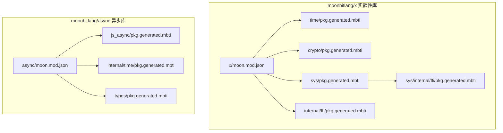
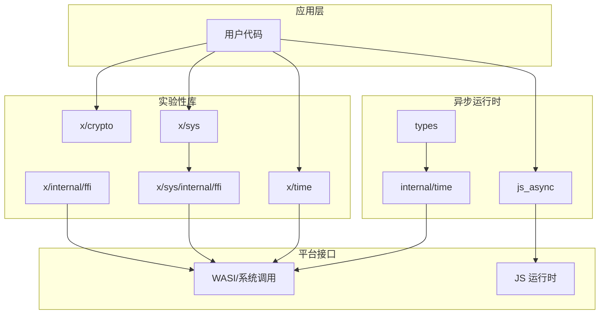
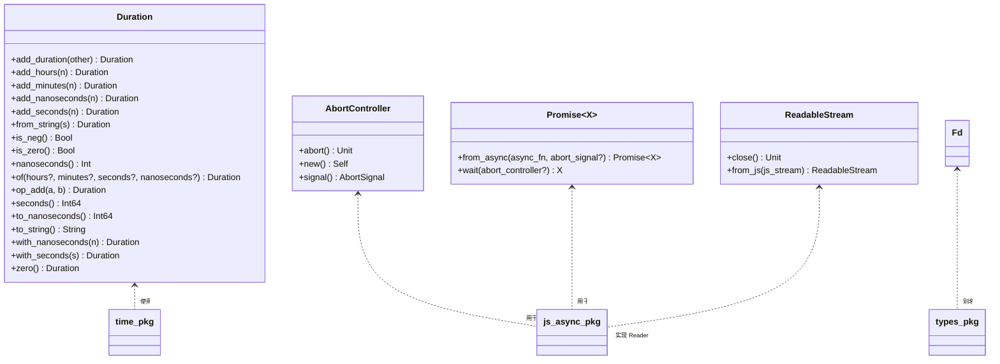
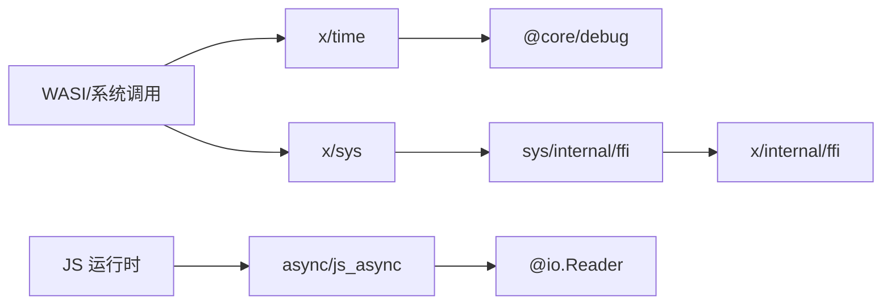

# 核心库详解

<cite>
**本文档引用的文件**
- [moon.mod.json](file://.repos/moonbitlang/async/0.19.1/moon.mod.json)
- [pkg.generated.mbti](file://.repos/moonbitlang/async/0.19.1/src/js_async/pkg.generated.mbti)
- [pkg.generated.mbti](file://.repos/moonbitlang/async/0.19.1/src/internal/time/pkg.generated.mbti)
- [pkg.generated.mbti](file://.repos/moonbitlang/async/0.19.1/src/types/pkg.generated.mbti)
- [moon.mod.json](file://.repos/moonbitlang/x/0.4.43/moon.mod.json)
- [pkg.generated.mbti](file://.repos/moonbitlang/x/0.4.43/crypto/pkg.generated.mbti)
- [pkg.generated.mbti](file://.repos/moonbitlang/x/0.4.43/time/pkg.generated.mbti)
- [README.mbt.md](file://.repos/moonbitlang/x/0.4.43/time/README.mbt.md)
- [pkg.generated.mbti](file://.repos/moonbitlang/x/0.4.43/sys/pkg.generated.mbti)
- [pkg.generated.mbti](file://.repos/moonbitlang/x/0.4.43/sys/internal/ffi/pkg.generated.mbti)
- [sys_native.mbt](file://.repos/moonbitlang/x/0.4.43/sys/internal/ffi/sys_native.mbt)
- [pkg.generated.mbti](file://.repos/moonbitlang/x/0.4.43/internal/ffi/pkg.generated.mbti)
</cite>

## 目录
1. [简介](#简介)
2. [项目结构](#项目结构)
3. [核心组件](#核心组件)
4. [架构概览](#架构概览)
5. [详细组件分析](#详细组件分析)
6. [依赖分析](#依赖分析)
7. [性能考虑](#性能考虑)
8. [故障排除指南](#故障排除指南)
9. [结论](#结论)
10. [附录](#附录)

## 简介
本文件为 MoonBit 核心库的综合技术文档，重点覆盖以下三个库：
- moonbitlang/x：实验性功能库，包含时间(time)、加密(crypto)、系统(sys)等模块
- moonbitlang/async：异步运行时库，提供协程与网络功能
- moonbitlang/core：核心基础库（在本仓库中通过内部依赖体现）

文档将从系统架构、组件关系、数据流、处理逻辑、集成点、错误处理与性能特征等方面进行深入分析，并提供使用示例路径、最佳实践、安全注意事项以及针对不同经验水平开发者的分层技术深度。

## 项目结构
仓库采用多库并行的组织方式，核心库分布在 .repos 下的不同子目录中。moonbitlang/x 作为实验性功能集合，moonbitlang/async 提供异步编程能力，二者均通过模块化设计实现高内聚低耦合。

**图表来源**
- [.repos/moonbitlang/x/0.4.43/moon.mod.json:1-10](file://.repos/moonbitlang/x/0.4.43/moon.mod.json#L1-L10)
- [.repos/moonbitlang/async/0.19.1/moon.mod.json:1-13](file://.repos/moonbitlang/async/0.19.1/moon.mod.json#L1-L13)

**章节来源**
- [.repos/moonbitlang/x/0.4.43/moon.mod.json:1-10](file://.repos/moonbitlang/x/0.4.43/moon.mod.json#L1-L10)
- [.repos/moonbitlang/async/0.19.1/moon.mod.json:1-13](file://.repos/moonbitlang/async/0.19.1/moon.mod.json#L1-L13)

## 核心组件
本节概述各库的关键组件及其职责边界：

- moonbitlang/x 实验性库
  - time：提供时间测量与操作，支持固定时区与时长(Duration)计算
  - crypto：提供哈希与 HMAC 等加密摘要函数，包含多种算法
  - sys：提供系统级接口（环境变量、命令行参数、退出码等）
  - internal/ffi：跨语言调用桥接，负责字符串与字节数组的转换
  - sys/internal/ffi：系统原生接口封装（如 CLI 参数获取、环境变量访问）

- moonbitlang/async 异步库
  - js_async：与 JavaScript Promise/AbortController/ReadableStream 等互操作
  - internal/time：提供毫秒级时间戳查询
  - types：定义通用类型别名（如文件描述符 Fd）

这些组件通过模块化导出与内部依赖形成清晰的层次结构，便于按需引入与组合使用。

**章节来源**
- [.repos/moonbitlang/x/0.4.43/time/pkg.generated.mbti:1-40](file://.repos/moonbitlang/x/0.4.43/time/pkg.generated.mbti#L1-L40)
- [.repos/moonbitlang/x/0.4.43/crypto/pkg.generated.mbti:1-36](file://.repos/moonbitlang/x/0.4.43/crypto/pkg.generated.mbti#L1-L36)
- [.repos/moonbitlang/x/0.4.43/sys/pkg.generated.mbti:1-23](file://.repos/moonbitlang/x/0.4.43/sys/pkg.generated.mbti#L1-L23)
- [.repos/moonbitlang/x/0.4.43/internal/ffi/pkg.generated.mbti:1-48](file://.repos/moonbitlang/x/0.4.43/internal/ffi/pkg.generated.mbti#L1-L48)
- [.repos/moonbitlang/x/0.4.43/sys/internal/ffi/pkg.generated.mbti:1-23](file://.repos/moonbitlang/x/0.4.43/sys/internal/ffi/pkg.generated.mbti#L1-L23)
- [.repos/moonbitlang/async/0.19.1/src/js_async/pkg.generated.mbti:1-40](file://.repos/moonbitlang/async/0.19.1/src/js_async/pkg.generated.mbti#L1-L40)
- [.repos/moonbitlang/async/0.19.1/src/internal/time/pkg.generated.mbti:1-13](file://.repos/moonbitlang/async/0.19.1/src/internal/time/pkg.generated.mbti#L1-L13)
- [.repos/moonbitlang/async/0.19.1/src/types/pkg.generated.mbti:1-13](file://.repos/moonbitlang/async/0.19.1/src/types/pkg.generated.mbti#L1-L13)

## 架构概览
下图展示了异步库与实验性库之间的协作关系，以及它们如何通过内部模块与外部平台（如 WASI）交互。

**图表来源**
- [.repos/moonbitlang/async/0.19.1/src/js_async/pkg.generated.mbti:1-40](file://.repos/moonbitlang/async/0.19.1/src/js_async/pkg.generated.mbti#L1-L40)
- [.repos/moonbitlang/async/0.19.1/src/internal/time/pkg.generated.mbti:1-13](file://.repos/moonbitlang/async/0.19.1/src/internal/time/pkg.generated.mbti#L1-L13)
- [.repos/moonbitlang/async/0.19.1/src/types/pkg.generated.mbti:1-13](file://.repos/moonbitlang/async/0.19.1/src/types/pkg.generated.mbti#L1-L13)
- [.repos/moonbitlang/x/0.4.43/time/pkg.generated.mbti:1-40](file://.repos/moonbitlang/x/0.4.43/time/pkg.generated.mbti#L1-L40)
- [.repos/moonbitlang/x/0.4.43/sys/pkg.generated.mbti:1-23](file://.repos/moonbitlang/x/0.4.43/sys/pkg.generated.mbti#L1-L23)
- [.repos/moonbitlang/x/0.4.43/sys/internal/ffi/pkg.generated.mbti:1-23](file://.repos/moonbitlang/x/0.4.43/sys/internal/ffi/pkg.generated.mbti#L1-L23)
- [.repos/moonbitlang/x/0.4.43/internal/ffi/pkg.generated.mbti:1-48](file://.repos/moonbitlang/x/0.4.43/internal/ffi/pkg.generated.mbti#L1-L48)

## 详细组件分析

### 时间模块（moonbitlang/x/time）
- 功能要点
  - 提供时长(Duration)类型与加法运算、纳秒/秒转换、字符串表示等
  - 支持固定时区创建与 UTC 偏移常量
  - 支持从 Unix 秒与时区构造 ZonedDateTime
  - 文档明确当前实现不包含闰秒与夏令时偏移切换

- 使用场景
  - 计时与耗时统计
  - 时间格式化与解析（基于字符串表示）
  - 时区换算与固定时区管理

- 示例路径
  - [时间模块 API 定义:22-40](file://.repos/moonbitlang/x/0.4.43/time/pkg.generated.mbti#L22-L40)
  - [时间模块 README 示例:11-24](file://.repos/moonbitlang/x/0.4.43/time/README.mbt.md#L11-L24)

- 最佳实践
  - 明确时区来源：在 wasm-gc 后端通过 WASI 获取当前 Unix 秒与偏移
  - 避免依赖夏令时切换：当前实现不支持 DST 切换
  - 使用 Duration 进行时间增量计算，避免直接操作纳秒值

**章节来源**
- [.repos/moonbitlang/x/0.4.43/time/pkg.generated.mbti:1-40](file://.repos/moonbitlang/x/0.4.43/time/pkg.generated.mbti#L1-L40)
- [.repos/moonbitlang/x/0.4.43/time/README.mbt.md:1-33](file://.repos/moonbitlang/x/0.4.43/time/README.mbt.md#L1-L33)

### 加密模块（moonbitlang/x/crypto）
- 功能要点
  - 提供多种哈希算法（MD5、SHA-1、SHA-224、SHA-256、SM3 等）
  - 提供 HMAC 摘要计算
  - 提供字节序列与十六进制字符串互转工具

- 使用场景
  - 数据完整性校验
  - 密钥派生与消息认证
  - 日志与调试输出的十六进制展示

- 示例路径
  - [加密模块 API 定义:1-36](file://.repos/moonbitlang/x/0.4.43/crypto/pkg.generated.mbti#L1-L36)

- 最佳实践
  - 优先选择 SHA-256 或更高强度算法
  - 对于敏感数据，使用 HMAC 并妥善管理密钥
  - 注意算法弃用标记（如某些 ChaCha 变体已标注 deprecated）

**章节来源**
- [.repos/moonbitlang/x/0.4.43/crypto/pkg.generated.mbti:1-36](file://.repos/moonbitlang/x/0.4.43/crypto/pkg.generated.mbti#L1-L36)

### 系统模块（moonbitlang/x/sys 与 sys/internal/ffi）
- 功能要点
  - 提供环境变量读写、命令行参数获取、进程退出码等系统接口
  - sys/internal/ffi 提供与底层平台的 FFI 调用封装
  - internal/ffi 提供字符串与字节数组的跨语言转换

- 使用场景
  - 配置管理（读取环境变量）
  - 命令行工具（解析参数）
  - 进程控制（退出码）

- 示例路径
  - [系统模块 API 定义:1-23](file://.repos/moonbitlang/x/0.4.43/sys/pkg.generated.mbti#L1-L23)
  - [系统 FFI 模块 API 定义:1-23](file://.repos/moonbitlang/x/0.4.43/sys/internal/ffi/pkg.generated.mbti#L1-L23)
  - [系统原生实现示例:19-37](file://.repos/moonbitlang/x/0.4.43/sys/internal/ffi/sys_native.mbt#L19-L37)
  - [内部 FFI 工具函数:5-17](file://.repos/moonbitlang/x/0.4.43/internal/ffi/pkg.generated.mbti#L5-L17)

- 最佳实践
  - 统一使用 UTF-8 编码处理字符串
  - 在跨语言边界谨慎处理空值与异常
  - 尽量通过 sys 接口而非直接调用 FFI

**章节来源**
- [.repos/moonbitlang/x/0.4.43/sys/pkg.generated.mbti:1-23](file://.repos/moonbitlang/x/0.4.43/sys/pkg.generated.mbti#L1-L23)
- [.repos/moonbitlang/x/0.4.43/sys/internal/ffi/pkg.generated.mbti:1-23](file://.repos/moonbitlang/x/0.4.43/sys/internal/ffi/pkg.generated.mbti#L1-L23)
- [.repos/moonbitlang/x/0.4.43/sys/internal/ffi/sys_native.mbt:19-37](file://.repos/moonbitlang/x/0.4.43/sys/internal/ffi/sys_native.mbt#L19-L37)
- [.repos/moonbitlang/x/0.4.43/internal/ffi/pkg.generated.mbti:1-48](file://.repos/moonbitlang/x/0.4.43/internal/ffi/pkg.generated.mbti#L1-L48)

### 异步运行时（moonbitlang/async）
- 功能要点
  - js_async：与 JS Promise/AbortController/ReadableStream 互操作，支持超时与取消
  - internal/time：提供毫秒级时间戳查询
  - types：定义文件描述符等类型别名

- 使用场景
  - Web 平台上的异步任务编排
  - 可取消的网络请求与流式数据处理

- 示例路径
  - [js_async 模块 API 定义:1-40](file://.repos/moonbitlang/async/0.19.1/src/js_async/pkg.generated.mbti#L1-L40)
  - [internal/time 模块 API 定义:1-13](file://.repos/moonbitlang/async/0.19.1/src/internal/time/pkg.generated.mbti#L1-L13)
  - [types 模块 API 定义:1-13](file://.repos/moonbitlang/async/0.19.1/src/types/pkg.generated.mbti#L1-L13)

- 最佳实践
  - 使用 AbortController 控制任务生命周期
  - 对 Promise 进行超时包装，避免无限等待
  - 在流式读取场景中及时关闭资源

**章节来源**
- [.repos/moonbitlang/async/0.19.1/src/js_async/pkg.generated.mbti:1-40](file://.repos/moonbitlang/async/0.19.1/src/js_async/pkg.generated.mbti#L1-L40)
- [.repos/moonbitlang/async/0.19.1/src/internal/time/pkg.generated.mbti:1-13](file://.repos/moonbitlang/async/0.19.1/src/internal/time/pkg.generated.mbti#L1-L13)
- [.repos/moonbitlang/async/0.19.1/src/types/pkg.generated.mbti:1-13](file://.repos/moonbitlang/async/0.19.1/src/types/pkg.generated.mbti#L1-L13)

### 类关系与接口契约（代码级视图）

**图表来源**
- [.repos/moonbitlang/x/0.4.43/time/pkg.generated.mbti:22-40](file://.repos/moonbitlang/x/0.4.43/time/pkg.generated.mbti#L22-L40)
- [.repos/moonbitlang/async/0.19.1/src/js_async/pkg.generated.mbti:16-36](file://.repos/moonbitlang/async/0.19.1/src/js_async/pkg.generated.mbti#L16-L36)
- [.repos/moonbitlang/async/0.19.1/src/types/pkg.generated.mbti:11-11](file://.repos/moonbitlang/async/0.19.1/src/types/pkg.generated.mbti#L11-L11)

## 依赖分析
- 内部依赖
  - x/time 依赖 core/debug（用于调试信息）
  - x/sys 通过 sys/internal/ffi 与平台交互
  - x/internal/ffi 提供跨语言数据转换工具
  - async/js_async 依赖 io 接口以适配可读流

- 外部依赖
  - 异步库与 JS 运行时互操作（Promise/AbortController/ReadableStream）
  - 实验性库通过 WASI 获取系统时间与环境信息

**图表来源**
- [.repos/moonbitlang/x/0.4.43/time/pkg.generated.mbti:4-6](file://.repos/moonbitlang/x/0.4.43/time/pkg.generated.mbti#L4-L6)
- [.repos/moonbitlang/x/0.4.43/sys/pkg.generated.mbti:1-23](file://.repos/moonbitlang/x/0.4.43/sys/pkg.generated.mbti#L1-L23)
- [.repos/moonbitlang/x/0.4.43/sys/internal/ffi/pkg.generated.mbti:1-23](file://.repos/moonbitlang/x/0.4.43/sys/internal/ffi/pkg.generated.mbti#L1-L23)
- [.repos/moonbitlang/x/0.4.43/internal/ffi/pkg.generated.mbti:1-48](file://.repos/moonbitlang/x/0.4.43/internal/ffi/pkg.generated.mbti#L1-L48)
- [.repos/moonbitlang/async/0.19.1/src/js_async/pkg.generated.mbti:4-6](file://.repos/moonbitlang/async/0.19.1/src/js_async/pkg.generated.mbti#L4-L6)

**章节来源**
- [.repos/moonbitlang/x/0.4.43/time/pkg.generated.mbti:4-6](file://.repos/moonbitlang/x/0.4.43/time/pkg.generated.mbti#L4-L6)
- [.repos/moonbitlang/x/0.4.43/sys/pkg.generated.mbti:1-23](file://.repos/moonbitlang/x/0.4.43/sys/pkg.generated.mbti#L1-L23)
- [.repos/moonbitlang/async/0.19.1/src/js_async/pkg.generated.mbti:4-6](file://.repos/moonbitlang/async/0.19.1/src/js_async/pkg.generated.mbti#L4-L6)

## 性能考虑
- 时间计算
  - 使用 Duration 进行时间增量计算，避免频繁纳秒/秒转换
  - 避免在热路径中进行字符串格式化与解析

- 加密摘要
  - 优先使用 SHA-256，减少碰撞风险
  - 对大块数据进行分块处理，降低内存峰值

- 系统接口
  - 统一编码策略（UTF-8），减少转换开销
  - 批量读取环境变量，避免多次系统调用

- 异步互操作
  - 合理设置超时与取消信号，防止资源泄漏
  - 流式读取时及时关闭资源，避免句柄泄露

[本节为通用性能建议，无需特定文件来源]

## 故障排除指南
- 时间相关问题
  - 当前实现不支持夏令时切换，请在需要精确时区换算时谨慎使用
  - 若出现时间戳不一致，检查 WASI 提供的 Unix 秒与偏移是否正确

- 加密相关问题
  - 对于弃用的 ChaCha 算法，请替换为推荐的 SHA-256/HMAC
  - 十六进制输出不匹配时，确认输入字节序列与编码一致性

- 系统接口问题
  - 环境变量为空或不存在时，检查键名大小写与平台差异
  - 字符串转换异常时，确认 UTF-8 编码与边界条件

- 异步互操作问题
  - Promise 等待超时或未响应时，检查 AbortController 的使用
  - ReadableStream 无法读取时，确认流状态与关闭时机

**章节来源**
- [.repos/moonbitlang/x/0.4.43/time/README.mbt.md:26-32](file://.repos/moonbitlang/x/0.4.43/time/README.mbt.md#L26-L32)
- [.repos/moonbitlang/x/0.4.43/crypto/pkg.generated.mbti:7-14](file://.repos/moonbitlang/x/0.4.43/crypto/pkg.generated.mbti#L7-L14)
- [.repos/moonbitlang/x/0.4.43/sys/internal/ffi/sys_native.mbt:19-37](file://.repos/moonbitlang/x/0.4.43/sys/internal/ffi/sys_native.mbt#L19-L37)
- [.repos/moonbitlang/async/0.19.1/src/js_async/pkg.generated.mbti:8-31](file://.repos/moonbitlang/async/0.19.1/src/js_async/pkg.generated.mbti#L8-L31)

## 结论
moonbitlang/x 与 moonbitlang/async 通过模块化设计提供了丰富的实验性功能与异步能力。开发者应根据目标平台（WASM/JS）合理选择模块，并遵循最佳实践以确保性能与安全性。未来版本计划进一步完善时间格式化、单调时钟与多时区支持，建议关注官方更新。

[本节为总结性内容，无需特定文件来源]

## 附录
- 使用示例路径索引
  - 时间模块示例：[时间模块 README 示例:11-24](file://.repos/moonbitlang/x/0.4.43/time/README.mbt.md#L11-L24)
  - 系统接口示例：[系统原生实现示例:19-37](file://.repos/moonbitlang/x/0.4.43/sys/internal/ffi/sys_native.mbt#L19-L37)
  - 异步互操作示例：[js_async 模块 API 定义:8-31](file://.repos/moonbitlang/async/0.19.1/src/js_async/pkg.generated.mbti#L8-L31)

- 安全注意事项
  - 严格管理密钥与随机数源
  - 在跨语言边界进行严格的输入验证与错误处理
  - 避免在日志中输出敏感信息

[本节为补充信息，无需特定文件来源]