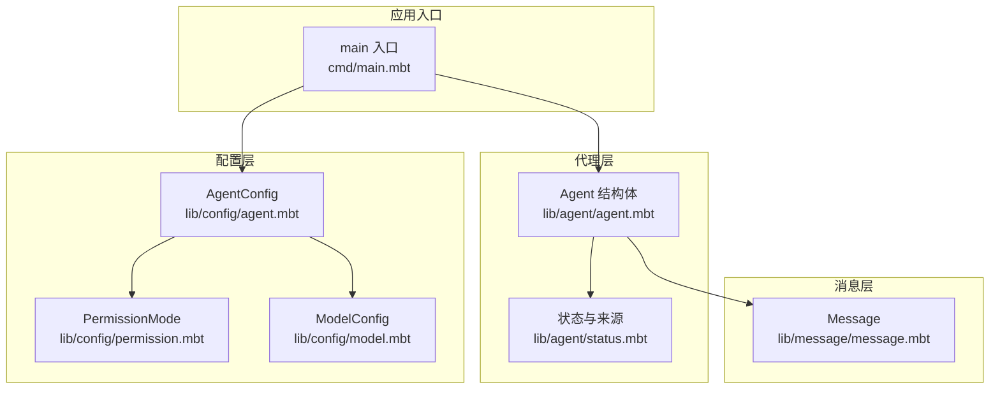
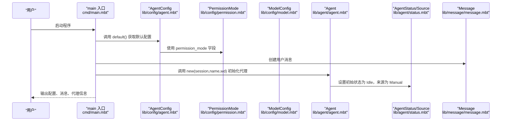
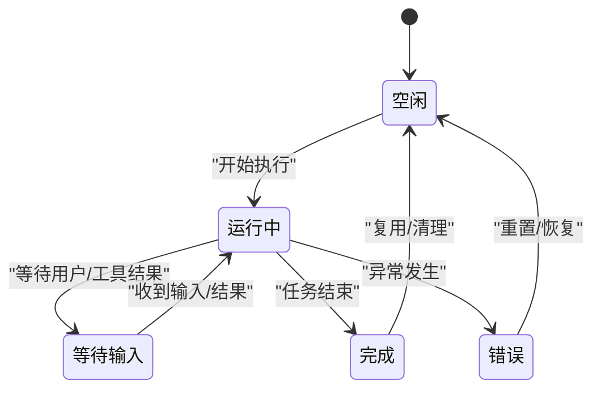
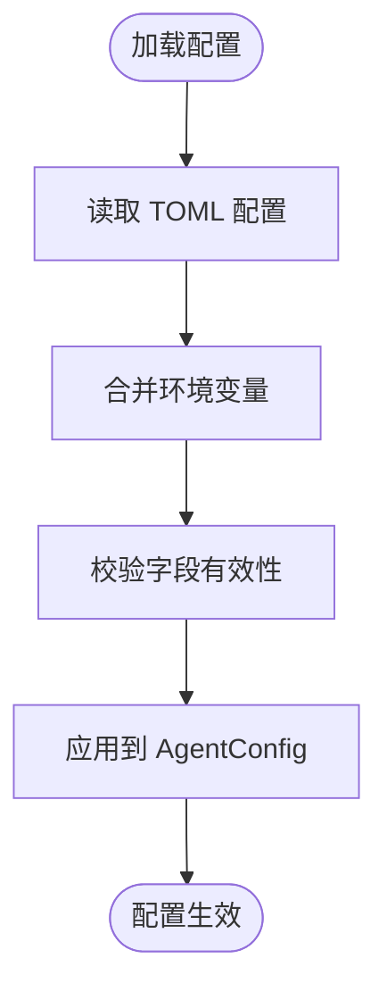
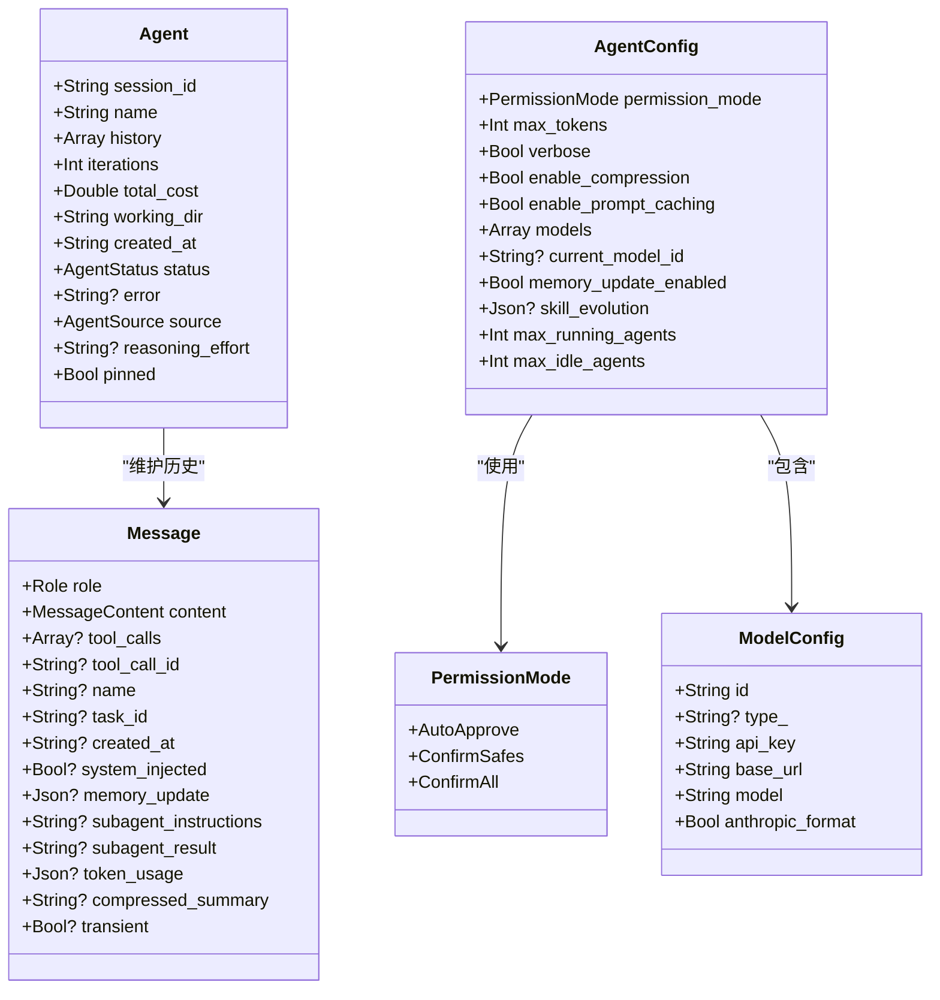
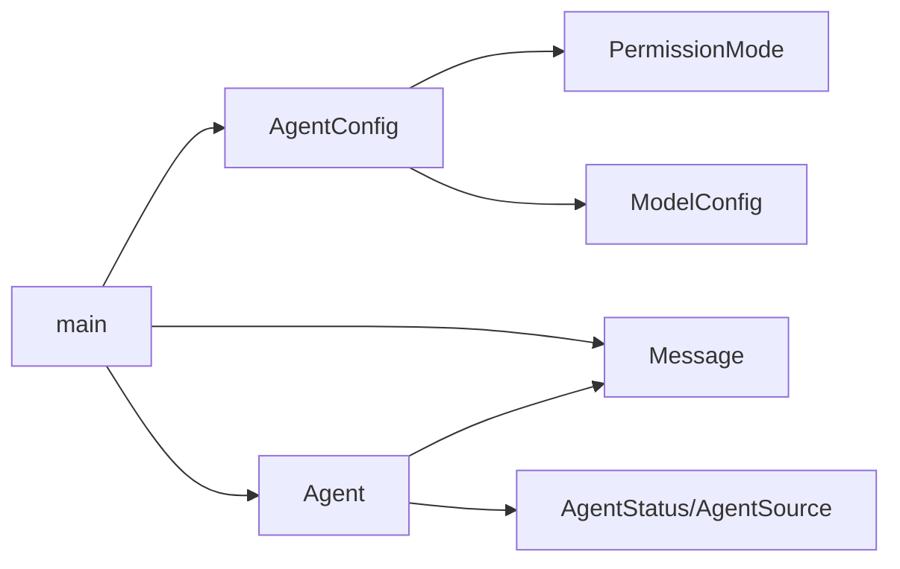

# 代理系统

<cite>
**本文引用的文件**
- [lib/agent/agent.mbt](file://lib/agent/agent.mbt)
- [lib/agent/status.mbt](file://lib/agent/status.mbt)
- [lib/config/agent.mbt](file://lib/config/agent.mbt)
- [lib/config/permission.mbt](file://lib/config/permission.mbt)
- [lib/config/model.mbt](file://lib/config/model.mbt)
- [lib/message/message.mbt](file://lib/message/message.mbt)
- [cmd/main.mbt](file://cmd/main.mbt)
</cite>

## 目录
1. [简介](#简介)
2. [项目结构](#项目结构)
3. [核心组件](#核心组件)
4. [架构总览](#架构总览)
5. [详细组件分析](#详细组件分析)
6. [依赖分析](#依赖分析)
7. [性能考虑](#性能考虑)
8. [故障排查指南](#故障排查指南)
9. [结论](#结论)
10. [附录](#附录)

## 简介
本文件面向代理系统模块，围绕 Agent 结构体的设计理念、会话生命周期管理机制与状态跟踪系统进行深入技术文档化；同时覆盖 AgentConfig 的配置管理（默认值、运行时参数更新、权限控制）、AgentStatus 与 AgentSource 枚举在状态转换中的作用，并通过具体代码示例路径展示代理的创建、初始化与销毁流程。文档还阐述代理与消息系统、配置系统的交互关系，提供最佳实践与常见问题解决方案。

## 项目结构
代理系统位于 lib 目录下，核心文件分布如下：
- 代理主体：lib/agent/agent.mbt
- 代理状态与来源：lib/agent/status.mbt
- 配置模型：lib/config/agent.mbt、lib/config/permission.mbt、lib/config/model.mbt
- 消息模型：lib/message/message.mbt
- 示例入口：cmd/main.mbt

图表来源
- [lib/agent/agent.mbt:1-40](file://lib/agent/agent.mbt#L1-L40)
- [lib/agent/status.mbt:1-50](file://lib/agent/status.mbt#L1-L50)
- [lib/config/agent.mbt:1-34](file://lib/config/agent.mbt#L1-L34)
- [lib/config/permission.mbt:1-48](file://lib/config/permission.mbt#L1-L48)
- [lib/config/model.mbt:1-22](file://lib/config/model.mbt#L1-L22)
- [lib/message/message.mbt:1-165](file://lib/message/message.mbt#L1-L165)
- [cmd/main.mbt:1-27](file://cmd/main.mbt#L1-L27)

章节来源
- [lib/agent/agent.mbt:1-40](file://lib/agent/agent.mbt#L1-L40)
- [lib/agent/status.mbt:1-50](file://lib/agent/status.mbt#L1-L50)
- [lib/config/agent.mbt:1-34](file://lib/config/agent.mbt#L1-L34)
- [lib/config/permission.mbt:1-48](file://lib/config/permission.mbt#L1-L48)
- [lib/config/model.mbt:1-22](file://lib/config/model.mbt#L1-L22)
- [lib/message/message.mbt:1-165](file://lib/message/message.mbt#L1-L165)
- [cmd/main.mbt:1-27](file://cmd/main.mbt#L1-L27)

## 核心组件
本节聚焦代理系统的关键数据结构与行为接口，包括 Agent、AgentStatus、AgentSource、AgentConfig 及其相互关系。

- Agent：会话级实体，维护对话历史、迭代次数、成本统计、工作目录、创建时间、当前状态、错误信息、来源、推理强度、是否置顶等字段。
- AgentStatus：代理会话的运行状态机，支持空闲、运行中、等待输入、错误、完成五种状态。
- AgentSource：代理会话的启动来源，支持手动、定时任务、通道三种来源。
- AgentConfig：代理运行所需的全局配置，包含权限模式、最大令牌数、压缩与提示缓存开关、模型列表、当前模型 ID、内存更新开关、技能演化配置、并发代理上限等。
- PermissionMode：工具执行前的权限控制策略，支持自动放行、仅确认安全项、全部确认。
- ModelConfig：单个大模型端点配置，包含标识、类型、密钥、基础地址、模型名、Anthropic 格式标志。
- Message：对话消息，区分用户、助手、系统、工具结果等角色，支持文本或内容块，具备内部字段以便序列化与 API 提交剥离。

章节来源
- [lib/agent/agent.mbt:1-40](file://lib/agent/agent.mbt#L1-L40)
- [lib/agent/status.mbt:1-50](file://lib/agent/status.mbt#L1-L50)
- [lib/config/agent.mbt:1-34](file://lib/config/agent.mbt#L1-L34)
- [lib/config/permission.mbt:1-48](file://lib/config/permission.mbt#L1-L48)
- [lib/config/model.mbt:1-22](file://lib/config/model.mbt#L1-L22)
- [lib/message/message.mbt:1-165](file://lib/message/message.mbt#L1-L165)

## 架构总览
代理系统采用分层设计：上层由 Agent 承载会话与状态，中间层由 AgentConfig 提供配置驱动，底层由 Message 提供消息抽象，PermissionMode 与 ModelConfig 作为配置子域参与控制与模型选择。main 入口演示了配置、消息与代理的初始化与打印。

图表来源
- [cmd/main.mbt:1-27](file://cmd/main.mbt#L1-L27)
- [lib/config/agent.mbt:1-34](file://lib/config/agent.mbt#L1-L34)
- [lib/config/permission.mbt:1-48](file://lib/config/permission.mbt#L1-L48)
- [lib/config/model.mbt:1-22](file://lib/config/model.mbt#L1-L22)
- [lib/agent/agent.mbt:1-40](file://lib/agent/agent.mbt#L1-L40)
- [lib/agent/status.mbt:1-50](file://lib/agent/status.mbt#L1-L50)
- [lib/message/message.mbt:1-165](file://lib/message/message.mbt#L1-L165)

## 详细组件分析

### Agent 结构体与会话生命周期
- 设计理念
  - 以会话为中心：session_id 唯一标识一次交互；history 记录消息流转；iterations 与 total_cost 支持成本与迭代度量；working_dir 与 created_at 提供环境与时间上下文；pinned 支持置顶标记。
  - 状态驱动：status 字段承载状态机，error 字段记录异常，便于统一的生命周期管理与可观测性。
  - 来源可追溯：source 字段区分手动、定时、通道来源，便于审计与自动化场景控制。
- 生命周期管理
  - 创建：new 构造函数提供默认值，初始状态为 Idle，来源为 Manual。
  - 运行：根据业务逻辑推进到 Running 或 WaitingForInput；若出现异常进入 Error；完成后进入 Completed。
  - 销毁：在资源回收阶段清理 history、释放工作目录占用的资源（如需），并重置状态为 Idle 或移除会话。
- 状态跟踪
  - 状态转换由外部控制器驱动，Agent 仅负责保存当前状态与来源，并提供序列化支持（ToJSON）以便持久化与传输。

图表来源
- [lib/agent/status.mbt:1-50](file://lib/agent/status.mbt#L1-L50)
- [lib/agent/agent.mbt:1-40](file://lib/agent/agent.mbt#L1-L40)

章节来源
- [lib/agent/agent.mbt:1-40](file://lib/agent/agent.mbt#L1-L40)
- [lib/agent/status.mbt:1-50](file://lib/agent/status.mbt#L1-L50)

### AgentConfig 配置管理
- 默认值设置
  - default() 提供合理的默认值：权限模式为“确认安全”、最大令牌数为 16384、压缩与提示缓存开启、模型列表为空、当前模型 ID 未设置、内存更新关闭、技能演化配置为空、最大运行与空闲代理数均为 10。
- 运行时参数更新
  - 通过加载 TOML 配置文件与环境变量合并的方式动态更新配置；AgentConfig 中的字段直接映射到运行时行为（如 max_tokens、enable_compression、enable_prompt_caching、models、current_model_id、memory_update_enabled、skill_evolution、max_running_agents、max_idle_agents）。
- 权限控制
  - permission_mode 与 PermissionMode 枚举配合，决定工具执行前的确认策略（自动放行、仅确认安全项、全部确认）。PermissionMode 支持字符串序列化与反序列化，确保配置文件与运行时一致。

图表来源
- [lib/config/agent.mbt:1-34](file://lib/config/agent.mbt#L1-L34)
- [lib/config/permission.mbt:1-48](file://lib/config/permission.mbt#L1-L48)

章节来源
- [lib/config/agent.mbt:1-34](file://lib/config/agent.mbt#L1-L34)
- [lib/config/permission.mbt:1-48](file://lib/config/permission.mbt#L1-L48)

### AgentStatus 与 AgentSource 枚举
- AgentStatus
  - 状态集合：Idle、Running、WaitingForInput、Error、Completed。
  - 序列化：to_string_value 将状态映射为 JSON/TOML 友好的字符串；ToJson 实现用于对象序列化。
- AgentSource
  - 来源集合：Manual、Cron、Channel。
  - 序列化：to_string_value 将来源映射为字符串；ToJson 实现用于对象序列化。
- 在状态转换中的作用
  - 状态机由外部控制器推进，Agent 仅保存当前状态；来源字段用于审计与自动化场景区分。

章节来源
- [lib/agent/status.mbt:1-50](file://lib/agent/status.mbt#L1-L50)

### 代理与消息系统、配置系统的交互
- 与消息系统交互
  - Agent.history 存储 @message.Message 列表；Message 提供多种构造器（用户、助手、系统、工具结果）与 to_api_message 剥离内部字段的能力，确保对外 API 调用只携带必要字段。
- 与配置系统交互
  - AgentConfig 决定代理的行为边界（如 max_tokens、enable_compression、enable_prompt_caching、models、current_model_id、memory_update_enabled、skill_evolution、max_running_agents、max_idle_agents）；PermissionMode 控制工具执行前的确认策略。
- 与入口程序交互
  - main 展示了配置、消息与代理的初始化与打印，验证各组件协同工作。

图表来源
- [lib/agent/agent.mbt:1-40](file://lib/agent/agent.mbt#L1-L40)
- [lib/message/message.mbt:1-165](file://lib/message/message.mbt#L1-L165)
- [lib/config/agent.mbt:1-34](file://lib/config/agent.mbt#L1-L34)
- [lib/config/permission.mbt:1-48](file://lib/config/permission.mbt#L1-L48)
- [lib/config/model.mbt:1-22](file://lib/config/model.mbt#L1-L22)

章节来源
- [lib/agent/agent.mbt:1-40](file://lib/agent/agent.mbt#L1-L40)
- [lib/message/message.mbt:1-165](file://lib/message/message.mbt#L1-L165)
- [lib/config/agent.mbt:1-34](file://lib/config/agent.mbt#L1-L34)
- [lib/config/permission.mbt:1-48](file://lib/config/permission.mbt#L1-L48)
- [lib/config/model.mbt:1-22](file://lib/config/model.mbt#L1-L22)

### 代码示例路径（代理创建、初始化与销毁）
- 创建代理
  - 示例路径：[lib/agent/agent.mbt:20-39](file://lib/agent/agent.mbt#L20-L39)
- 初始化配置
  - 示例路径：[lib/config/agent.mbt:18-33](file://lib/config/agent.mbt#L18-L33)
- 初始化消息
  - 示例路径：[lib/message/message.mbt:58-76](file://lib/message/message.mbt#L58-L76)
- 打印与验证
  - 示例路径：[cmd/main.mbt:9-22](file://cmd/main.mbt#L9-L22)
- 销毁与清理（建议流程）
  - 清理 history：在销毁阶段清空或归档历史。
  - 释放资源：释放工作目录占用的临时资源。
  - 状态复位：将 status 置为 Idle，error 清空，便于复用。

章节来源
- [lib/agent/agent.mbt:20-39](file://lib/agent/agent.mbt#L20-L39)
- [lib/config/agent.mbt:18-33](file://lib/config/agent.mbt#L18-L33)
- [lib/message/message.mbt:58-76](file://lib/message/message.mbt#L58-L76)
- [cmd/main.mbt:9-22](file://cmd/main.mbt#L9-L22)

## 依赖分析
- 组件耦合
  - Agent 对 Message 有强依赖（历史存储），对 AgentStatus/AgentSource 有弱依赖（状态与来源）。
  - AgentConfig 对 PermissionMode 与 ModelConfig 有依赖，用于权限控制与模型选择。
- 外部依赖
  - main 依赖配置、消息与代理模块进行初始化演示。
- 接口契约
  - ToJson/FromJson 实现确保状态与来源、权限模式等枚举类型的序列化一致性。

图表来源
- [lib/agent/agent.mbt:1-40](file://lib/agent/agent.mbt#L1-L40)
- [lib/agent/status.mbt:1-50](file://lib/agent/status.mbt#L1-L50)
- [lib/config/agent.mbt:1-34](file://lib/config/agent.mbt#L1-L34)
- [lib/config/permission.mbt:1-48](file://lib/config/permission.mbt#L1-L48)
- [lib/config/model.mbt:1-22](file://lib/config/model.mbt#L1-L22)
- [lib/message/message.mbt:1-165](file://lib/message/message.mbt#L1-L165)
- [cmd/main.mbt:1-27](file://cmd/main.mbt#L1-L27)

章节来源
- [lib/agent/agent.mbt:1-40](file://lib/agent/agent.mbt#L1-L40)
- [lib/agent/status.mbt:1-50](file://lib/agent/status.mbt#L1-L50)
- [lib/config/agent.mbt:1-34](file://lib/config/agent.mbt#L1-L34)
- [lib/config/permission.mbt:1-48](file://lib/config/permission.mbt#L1-L48)
- [lib/config/model.mbt:1-22](file://lib/config/model.mbt#L1-L22)
- [lib/message/message.mbt:1-165](file://lib/message/message.mbt#L1-L165)
- [cmd/main.mbt:1-27](file://cmd/main.mbt#L1-L27)

## 性能考虑
- 历史存储优化
  - 对历史消息进行分页或压缩存储，结合 enable_compression 与 enable_prompt_caching，减少内存与带宽压力。
- 并发与限流
  - 通过 max_running_agents 与 max_idle_agents 控制并发规模，避免资源争用。
- 模型选择
  - current_model_id 与 models 配置应与任务复杂度匹配，避免不必要的高成本模型调用。
- 序列化开销
  - 使用 ToJson/FromJson 时注意字段剥离（如 Message.to_api_message），减少不必要的序列化负载。

## 故障排查指南
- 状态异常
  - 若状态长期停留在 Error，检查 Agent.error 字段与日志输出，定位异常原因并重置为 Idle。
- 权限问题
  - 若工具执行被阻断，检查 PermissionMode 配置与 ConfirmSafes/ConfirmAll 的策略差异。
- 配置不生效
  - 确认 TOML 文件与环境变量合并顺序，验证字段解析（如 PermissionMode::from_json）是否成功。
- 消息格式错误
  - 使用 Message.to_api_message 剥离内部字段后再提交 API，避免因内部字段导致的序列化或协议错误。

章节来源
- [lib/agent/status.mbt:1-50](file://lib/agent/status.mbt#L1-L50)
- [lib/config/permission.mbt:1-48](file://lib/config/permission.mbt#L1-L48)
- [lib/message/message.mbt:146-165](file://lib/message/message.mbt#L146-L165)

## 结论
代理系统通过清晰的数据结构与状态机设计，实现了会话级的生命周期管理与可观测性；配置系统提供了灵活的运行时参数与权限控制能力；消息系统则保证了对外 API 的简洁与安全。结合本文的最佳实践与故障排查建议，可在实际工程中稳定地构建与扩展代理能力。

## 附录
- 最佳实践
  - 明确状态转换规则，避免跨状态跳跃。
  - 合理设置并发上限，防止资源耗尽。
  - 使用默认配置作为基线，按需增量调整。
  - 严格区分内部字段与对外字段，确保序列化安全。
- 常见问题
  - 状态未更新：检查外部控制器的状态推进逻辑。
  - 权限确认过多：调整 PermissionMode 为 AutoApprove 或 ConfirmSafes。
  - 历史过大：启用压缩与缓存，定期清理旧会话。