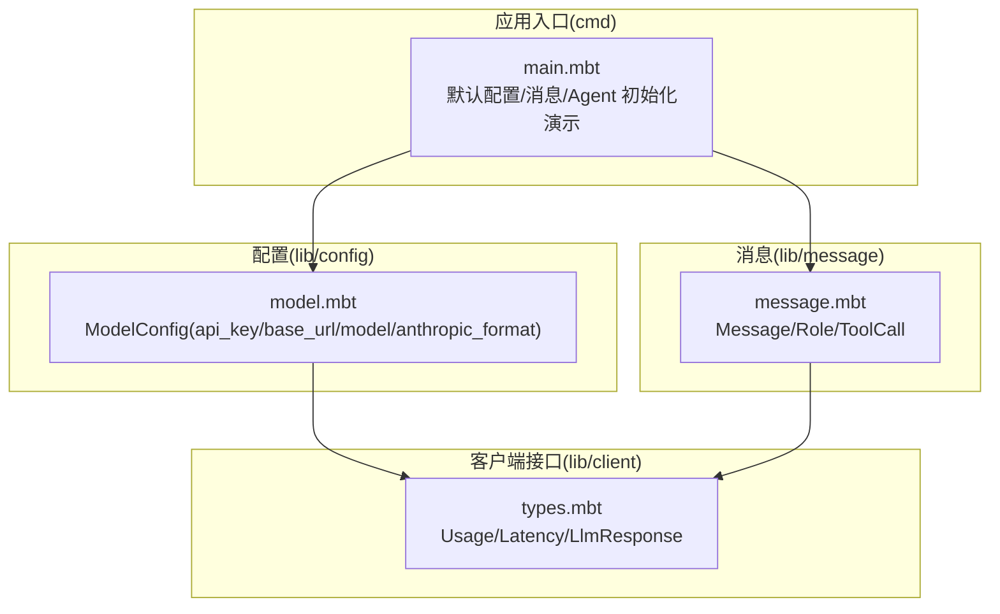
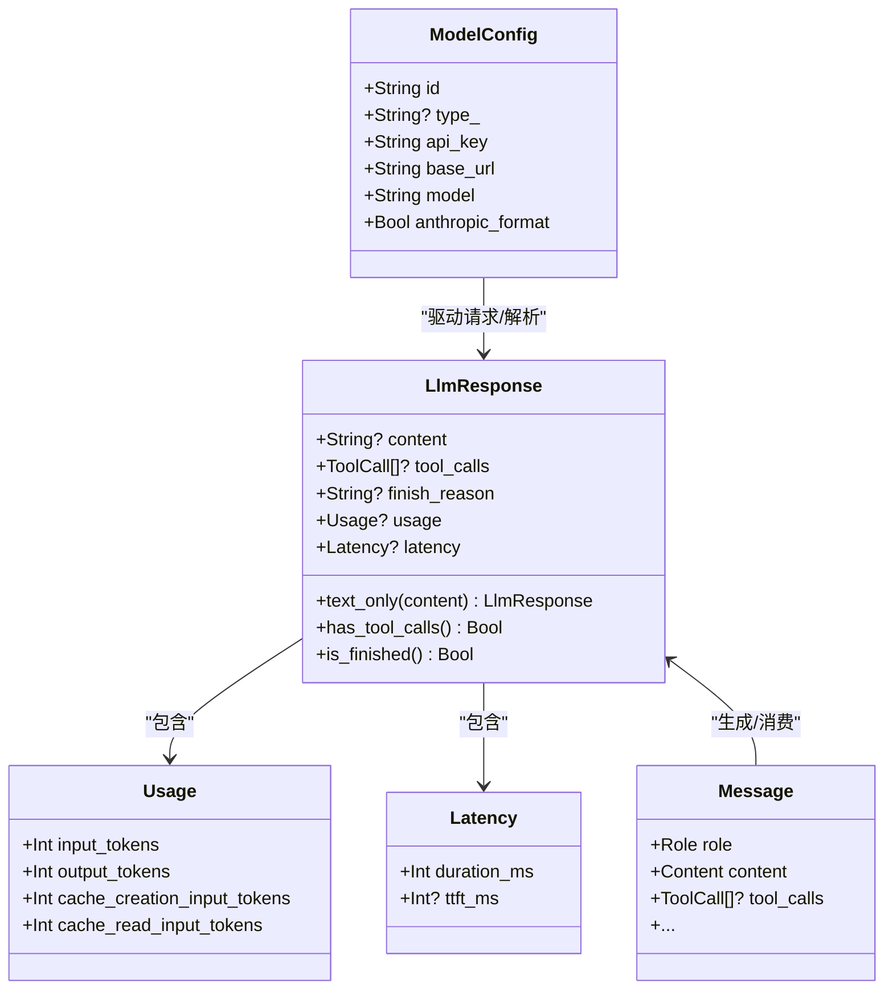
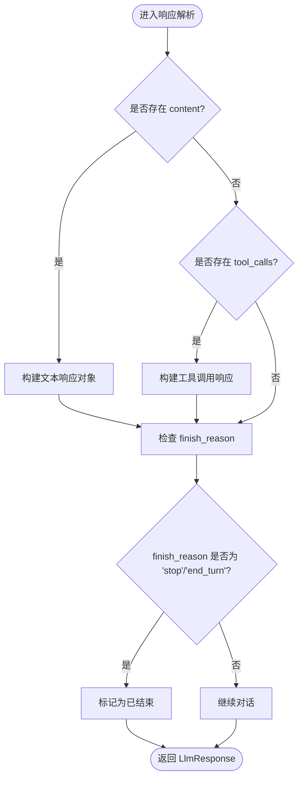
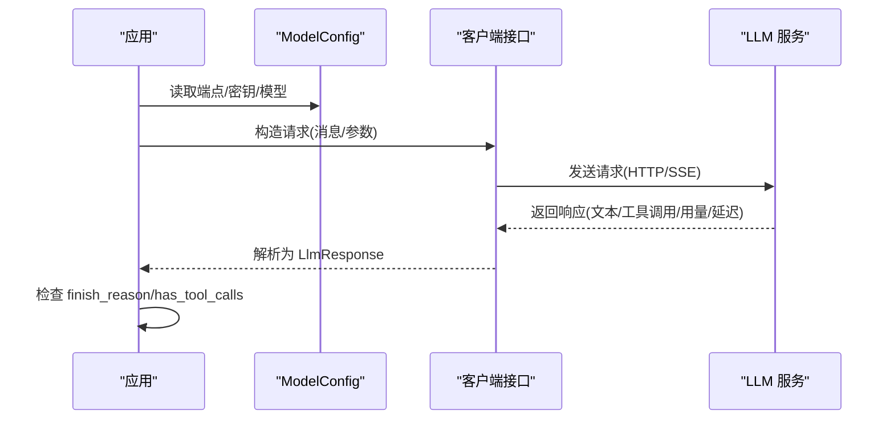
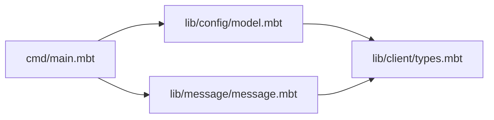

# 客户端接口

<cite>
**本文引用的文件**
- [README.md](file://README.md)
- [main.mbt](file://cmd/main.mbt)
- [types.mbt](file://lib/client/types.mbt)
- [model.mbt](file://lib/config/model.mbt)
- [message.mbt](file://lib/message/message.mbt)
</cite>

## 目录
1. [引言](#引言)
2. [项目结构](#项目结构)
3. [核心组件](#核心组件)
4. [架构总览](#架构总览)
5. [详细组件分析](#详细组件分析)
6. [依赖分析](#依赖分析)
7. [性能考虑](#性能考虑)
8. [故障排查指南](#故障排查指南)
9. [结论](#结论)
10. [附录](#附录)

## 引言
本文件为 MBOpenClacky 项目“客户端接口”模块的技术文档，聚焦 LLM API 抽象层的设计与实现要点，涵盖接口标准化、多服务适配、响应解析（含流式响应）、错误码映射、使用统计收集、连接管理、重试与超时、API 密钥管理、限流与性能优化、故障转移与降级、以及监控告警方案建议。  
项目目标是在保留原项目核心能力（LLM 交互、Agent、工具系统、技能系统、IM 渠道集成、CLI + Web UI）的同时，借助 MoonBit 的语言特性（强类型、Checked Error、AOT 编译、异步原语）带来更强的类型安全、更小的运行时体积与更易演化的工程结构。

章节来源
- [README.md:1-181](file://README.md#L1-L181)

## 项目结构
客户端接口模块位于 lib/client，结合配置模块 lib/config 与消息模块 lib/message，形成“配置 + 消息 + 响应”的三层抽象。  
- lib/client/types.mbt：定义 LLM 响应数据结构（Usage、Latency、LlmResponse）及辅助方法（文本响应、工具调用检测、完成态判断）
- lib/config/model.mbt：定义 ModelConfig（id、type_、api_key、base_url、model、anthropic_format）
- lib/message/message.mbt：定义消息角色与内容结构，支撑对话上下文构建
- cmd/main.mbt：最小化演示核心类型构造与初始化流程

图表来源
- [types.mbt:1-57](file://lib/client/types.mbt#L1-L57)
- [model.mbt:1-21](file://lib/config/model.mbt#L1-L21)
- [message.mbt](file://lib/message/message.mbt)
- [main.mbt:1-27](file://cmd/main.mbt#L1-L27)

章节来源
- [README.md:83-108](file://README.md#L83-L108)
- [main.mbt:1-27](file://cmd/main.mbt#L1-L27)

## 核心组件
- LlmResponse：统一的 LLM 响应载体，包含文本内容、工具调用、结束原因、用量与延迟指标
- Usage：输入/输出 Token 用量，以及缓存相关用量
- Latency：总耗时与首字时间（TTFT）等延迟指标
- ModelConfig：单个 LLM 模型端点的配置，支持 Anthropic 格式标记
- Message：消息角色与内容，用于构建对话上下文

章节来源
- [types.mbt:1-57](file://lib/client/types.mbt#L1-L57)
- [model.mbt:1-21](file://lib/config/model.mbt#L1-L21)
- [message.mbt](file://lib/message/message.mbt)

## 架构总览
客户端接口采用“配置驱动 + 数据模型 + 工具函数”的分层设计：
- 配置层：ModelConfig 提供端点、密钥、模型名与格式开关
- 数据层：LlmResponse/Usage/Latency 封装响应与指标
- 工具层：LlmResponse 的辅助方法（文本响应、工具调用检测、完成态判断）

图表来源
- [types.mbt:1-57](file://lib/client/types.mbt#L1-L57)
- [model.mbt:1-21](file://lib/config/model.mbt#L1-L21)
- [message.mbt](file://lib/message/message.mbt)

## 详细组件分析

### LlmResponse 与响应解析
- 字段覆盖：content、tool_calls、finish_reason、usage、latency
- 工具方法：
  - text_only：快速构造纯文本响应
  - has_tool_calls：判断是否存在工具调用
  - is_finished：判断对话是否结束（支持 "stop"/"end_turn"）

图表来源
- [types.mbt:18-56](file://lib/client/types.mbt#L18-L56)

章节来源
- [types.mbt:18-56](file://lib/client/types.mbt#L18-L56)

### Usage 与延迟指标
- Usage：输入/输出 Token 用量与缓存相关用量，便于成本追踪与预算控制
- Latency：总耗时与 TTFT，用于性能观测与 SLA 对齐

章节来源
- [types.mbt:2-15](file://lib/client/types.mbt#L2-L15)

### ModelConfig 与多服务适配
- 支持多供应商端点（OpenAI、Anthropic 等），通过 base_url 与 model 区分
- anthropic_format 标记用于适配 Anthropic 的特定格式
- api_key 与环境变量/配置文件结合，确保密钥安全

章节来源
- [model.mbt:1-21](file://lib/config/model.mbt#L1-L21)

### 消息与对话上下文
- Message 提供 user/assistant/system 等角色与文本内容封装
- 与 LlmResponse 协作，支撑对话循环与工具调用结果回传

章节来源
- [message.mbt](file://lib/message/message.mbt)

### 请求与响应序列（概念示意）
以下序列图展示从配置到响应的关键步骤，具体实现细节将在后续阶段完善：

## 依赖分析
- lib/client/types.mbt 依赖 lib/message/message.mbt（工具调用类型）
- lib/config/model.mbt 为客户端提供端点与密钥配置
- cmd/main.mbt 展示默认配置、消息与 Agent 的初始化流程

图表来源
- [types.mbt:1-57](file://lib/client/types.mbt#L1-L57)
- [model.mbt:1-21](file://lib/config/model.mbt#L1-L21)
- [message.mbt](file://lib/message/message.mbt)
- [main.mbt:1-27](file://cmd/main.mbt#L1-L27)

章节来源
- [main.mbt:8-22](file://cmd/main.mbt#L8-L22)

## 性能考虑
- 指标采集：通过 Usage/Latency 记录 Token 与延迟，便于成本与性能分析
- 流式处理：建议在后续阶段引入 MoonBit 异步原语与 SSE 支持，实现流式响应增量渲染
- 连接与超时：在客户端实现中设置合理的连接超时、读取超时与最大重试次数
- 限流策略：基于 Usage 与速率限制接口进行退避与排队
- 缓存优化：利用缓存相关用量字段评估缓存命中率，指导缓存策略

## 故障排查指南
- 响应完成判定：使用 LlmResponse.is_finished 判断对话是否结束
- 工具调用识别：使用 LlmResponse.has_tool_calls 检测是否需要执行工具
- 配置校验：确认 ModelConfig.api_key、base_url、model 与服务端一致
- 日志与可观测性：结合 Usage/Latency 输出关键指标，便于定位慢请求与高成本调用

章节来源
- [types.mbt:40-56](file://lib/client/types.mbt#L40-L56)
- [model.mbt:1-21](file://lib/config/model.mbt#L1-L21)

## 结论
客户端接口模块以简洁的数据模型与工具方法为核心，为多 LLM 服务提供统一抽象与标准化响应解析能力。结合配置驱动与消息模型，可在后续阶段无缝接入 OpenAI、Anthropic 等服务，并通过 Usage/Latency 指标实现成本与性能的闭环治理。

## 附录
- 快速开始：参考 README 的环境要求与构建说明，先完成依赖安装与构建
- 后续阶段：按照开发路线逐步实现 HTTP 客户端、SSE 流式处理、工具系统与 Agent 对话循环

章节来源
- [README.md:118-158](file://README.md#L118-L158)