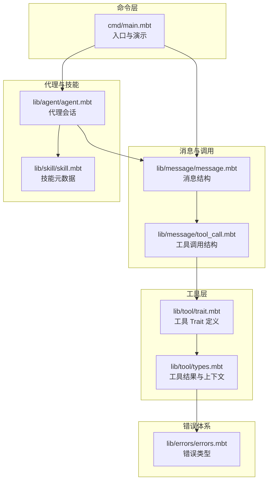
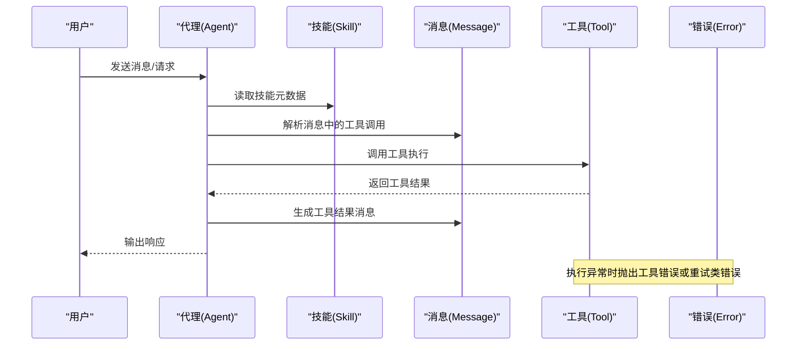
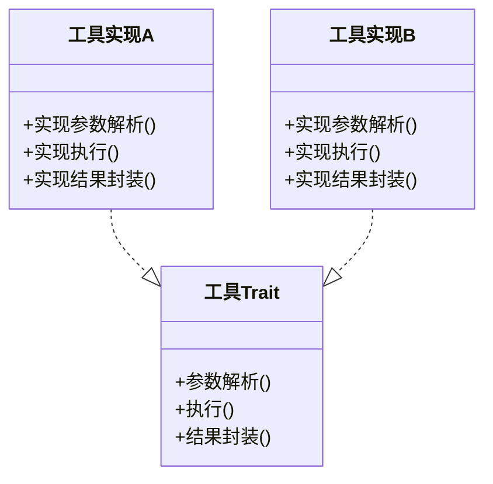
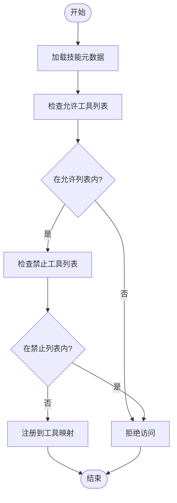
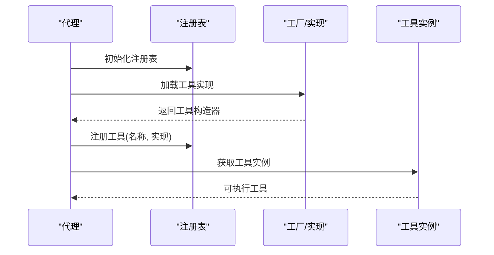
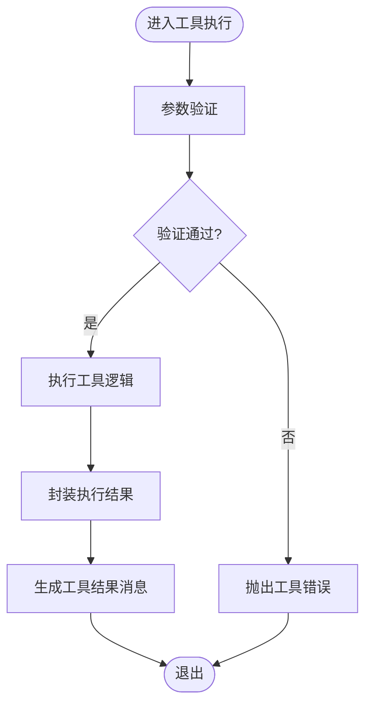
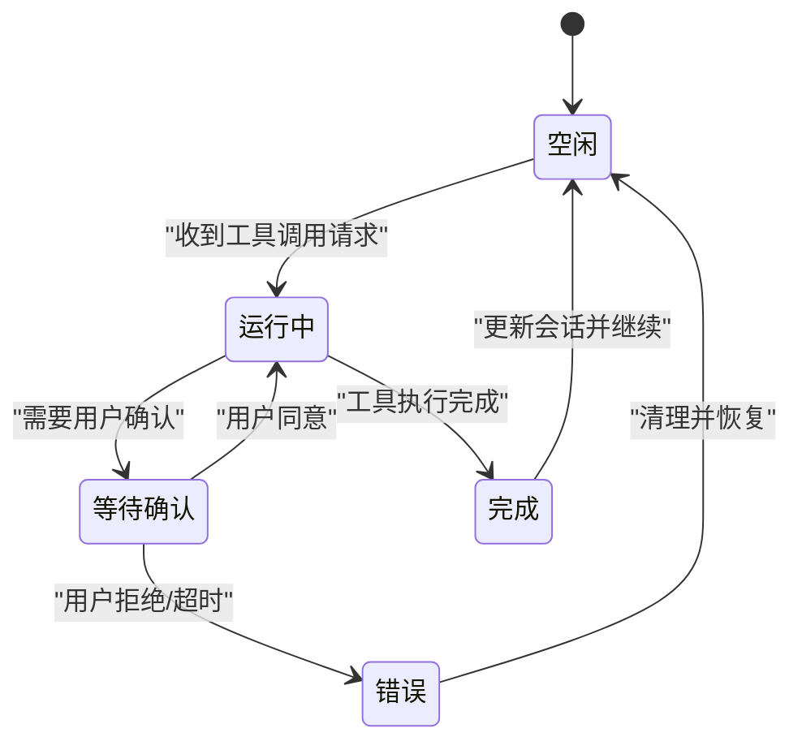
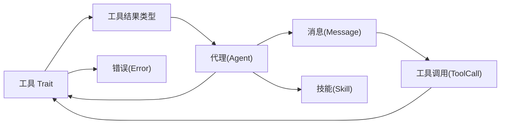

# 工具系统

<cite>
**本文引用的文件**
- [main.mbt](file://cmd/main.mbt)
- [agent.mbt](file://lib/agent/agent.mbt)
- [message.mbt](file://lib/message/message.mbt)
- [errors.mbt](file://lib/errors/errors.mbt)
- [skill.mbt](file://lib/skill/skill.mbt)
- [trait.mbt](file://lib/tool/trait.mbt)
- [types.mbt](file://lib/tool/types.mbt)
- [tool_call.mbt](file://lib/message/tool_call.mbt)
- [README.md](file://README.md)
</cite>

## 目录
1. [引言](#引言)
2. [项目结构](#项目结构)
3. [核心组件](#核心组件)
4. [架构总览](#架构总览)
5. [组件详解](#组件详解)
6. [依赖关系分析](#依赖关系分析)
7. [性能考量](#性能考量)
8. [故障排查指南](#故障排查指南)
9. [结论](#结论)
10. [附录](#附录)

## 引言
本文件面向“工具系统”模块，系统性阐述工具抽象、分类管理、参数校验、执行结果处理、注册与动态加载、生命周期管理、与代理系统的交互与权限控制、以及开发、测试、调试与部署的最佳实践。文档以仓库现有源码为依据，结合消息模型、代理会话、错误体系与技能元数据等周边模块，构建完整的工具系统技术说明。

## 项目结构
工具系统位于 lib/tool 子目录，配合 lib/message 中的消息与工具调用类型、lib/agent 中的代理会话、lib/skill 中的技能元数据、lib/errors 中的错误体系共同构成工具链路。命令入口在 cmd/main.mbt 中演示了核心类型的初始化与使用。

**图示来源**
- [main.mbt:1-27](file://cmd/main.mbt#L1-L27)
- [agent.mbt:1-40](file://lib/agent/agent.mbt#L1-L40)
- [message.mbt:1-165](file://lib/message/message.mbt#L1-L165)
- [tool_call.mbt:1-200](file://lib/message/tool_call.mbt#L1-L200)
- [skill.mbt:1-48](file://lib/skill/skill.mbt#L1-L48)
- [errors.mbt:1-80](file://lib/errors/errors.mbt#L1-L80)
- [trait.mbt:1-200](file://lib/tool/trait.mbt#L1-L200)
- [types.mbt:1-200](file://lib/tool/types.mbt#L1-L200)

**章节来源**
- [main.mbt:1-27](file://cmd/main.mbt#L1-L27)
- [agent.mbt:1-40](file://lib/agent/agent.mbt#L1-L40)
- [message.mbt:1-165](file://lib/message/message.mbt#L1-L165)
- [tool_call.mbt:1-200](file://lib/message/tool_call.mbt#L1-L200)
- [skill.mbt:1-48](file://lib/skill/skill.mbt#L1-L48)
- [errors.mbt:1-80](file://lib/errors/errors.mbt#L1-L80)
- [trait.mbt:1-200](file://lib/tool/trait.mbt#L1-L200)
- [types.mbt:1-200](file://lib/tool/types.mbt#L1-L200)

## 核心组件
- 工具 Trait：定义工具的统一接口，用于参数解析、执行与结果封装。
- 工具结果与上下文：承载执行结果、日志、成本、状态等信息。
- 消息与工具调用：消息体携带工具调用请求与结果，支撑工具链路。
- 代理会话：维护对话历史、迭代次数、成本、状态等，驱动工具执行。
- 技能元数据：描述工具可用性、用户可触发性、允许/禁止工具列表等。
- 错误体系：对工具调用失败、重试类错误进行分类与判定。

**章节来源**
- [trait.mbt:1-200](file://lib/tool/trait.mbt#L1-L200)
- [types.mbt:1-200](file://lib/tool/types.mbt#L1-L200)
- [message.mbt:1-165](file://lib/message/message.mbt#L1-L165)
- [tool_call.mbt:1-200](file://lib/message/tool_call.mbt#L1-L200)
- [agent.mbt:1-40](file://lib/agent/agent.mbt#L1-L40)
- [skill.mbt:1-48](file://lib/skill/skill.mbt#L1-L48)
- [errors.mbt:1-80](file://lib/errors/errors.mbt#L1-L80)

## 架构总览
工具系统围绕“消息-工具-代理-技能-错误”的闭环展开。代理根据技能元数据与当前消息中的工具调用，调度具体工具实现；工具执行后返回标准化结果，由代理更新会话状态并生成后续消息。

**图示来源**
- [agent.mbt:1-40](file://lib/agent/agent.mbt#L1-L40)
- [skill.mbt:1-48](file://lib/skill/skill.mbt#L1-L48)
- [message.mbt:1-165](file://lib/message/message.mbt#L1-L165)
- [tool_call.mbt:1-200](file://lib/message/tool_call.mbt#L1-L200)
- [errors.mbt:1-80](file://lib/errors/errors.mbt#L1-L80)

## 组件详解

### 工具 Trait 设计与接口
- 统一接口：通过工具 Trait 定义工具的执行契约，确保不同工具实现具备一致的参数解析、执行与结果封装能力。
- 参数校验：在工具实现中对输入参数进行合法性检查，必要时转换为内部格式。
- 结果处理：工具执行完成后返回标准化结果对象，包含内容、日志、成本、状态等字段，便于代理层统一处理。

**图示来源**
- [trait.mbt:1-200](file://lib/tool/trait.mbt#L1-L200)

**章节来源**
- [trait.mbt:1-200](file://lib/tool/trait.mbt#L1-L200)

### 工具分类与组织
- 技能元数据：通过技能结构体描述工具的可用性、是否允许用户触发、允许/禁止工具列表、自动总结等属性，作为工具分类与访问控制的基础。
- 分类管理：结合技能中的 allowed_tools/forbidden_tools 字段，实现内置工具与自定义工具的分组与筛选。
- 自定义工具：通过实现工具 Trait 并注册到代理的工具映射表，即可纳入同一分类体系。

**图示来源**
- [skill.mbt:1-48](file://lib/skill/skill.mbt#L1-L48)

**章节来源**
- [skill.mbt:1-48](file://lib/skill/skill.mbt#L1-L48)

### 注册机制、动态加载与生命周期
- 注册机制：工具实现通过实现工具 Trait 后，加入代理侧的工具注册表，键为工具名称，值为工具实例或工厂函数。
- 动态加载：代理在启动或运行期从配置/插件目录扫描工具实现，按需加载并注册。
- 生命周期：工具实例在代理会话期间复用，执行前进行参数校验，执行后清理临时资源，错误时进入重试或降级流程。

**图示来源**
- [agent.mbt:1-40](file://lib/agent/agent.mbt#L1-L40)
- [trait.mbt:1-200](file://lib/tool/trait.mbt#L1-L200)

**章节来源**
- [agent.mbt:1-40](file://lib/agent/agent.mbt#L1-L40)
- [trait.mbt:1-200](file://lib/tool/trait.mbt#L1-L200)

### 参数验证与执行结果处理
- 参数验证：在工具执行前，对必填字段、类型、范围进行校验；不合法参数应快速失败并返回明确错误。
- 执行结果：工具执行成功后，封装为统一的结果对象，包含内容、日志、成本、状态等；失败则抛出工具错误或重试类错误。
- 消息集成：代理将工具结果封装为工具结果消息，写入会话历史，供后续推理与输出使用。

**图示来源**
- [errors.mbt:1-80](file://lib/errors/errors.mbt#L1-L80)
- [message.mbt:1-165](file://lib/message/message.mbt#L1-L165)
- [types.mbt:1-200](file://lib/tool/types.mbt#L1-L200)

**章节来源**
- [errors.mbt:1-80](file://lib/errors/errors.mbt#L1-L80)
- [message.mbt:1-165](file://lib/message/message.mbt#L1-L165)
- [types.mbt:1-200](file://lib/tool/types.mbt#L1-L200)

### 与代理系统的交互与权限控制
- 交互模式：代理根据技能元数据决定是否允许工具执行；当需要用户确认时，依据权限模式进行交互。
- 权限控制：权限模式枚举支持自动批准、确认安全、确认全部三类策略，影响工具调用前的确认流程与覆盖范围。

**图示来源**
- [agent.mbt:1-40](file://lib/agent/agent.mbt#L1-L40)
- [skill.mbt:1-48](file://lib/skill/skill.mbt#L1-L48)

**章节来源**
- [agent.mbt:1-40](file://lib/agent/agent.mbt#L1-L40)
- [skill.mbt:1-48](file://lib/skill/skill.mbt#L1-L48)

### 常用工具实现示例与使用场景
- 示例定位：工具 Trait 与工具结果类型定义位于 lib/tool 下，结合消息与工具调用类型，可参考消息模块中的工具结果消息构造方法，理解工具结果如何被代理接收与处理。
- 使用场景：工具可用于文件操作、网络请求、系统命令、数据查询等，代理根据技能元数据与权限模式决定是否执行与如何呈现结果。

**章节来源**
- [trait.mbt:1-200](file://lib/tool/trait.mbt#L1-L200)
- [types.mbt:1-200](file://lib/tool/types.mbt#L1-L200)
- [message.mbt:120-143](file://lib/message/message.mbt#L120-L143)
- [tool_call.mbt:1-200](file://lib/message/tool_call.mbt#L1-L200)

## 依赖关系分析
工具系统与消息、代理、技能、错误体系存在紧密耦合：消息承载工具调用与结果；代理负责调度与状态管理；技能提供访问控制；错误体系提供统一的异常语义。

**图示来源**
- [trait.mbt:1-200](file://lib/tool/trait.mbt#L1-L200)
- [types.mbt:1-200](file://lib/tool/types.mbt#L1-L200)
- [message.mbt:1-165](file://lib/message/message.mbt#L1-L165)
- [tool_call.mbt:1-200](file://lib/message/tool_call.mbt#L1-L200)
- [agent.mbt:1-40](file://lib/agent/agent.mbt#L1-L40)
- [skill.mbt:1-48](file://lib/skill/skill.mbt#L1-L48)
- [errors.mbt:1-80](file://lib/errors/errors.mbt#L1-L80)

**章节来源**
- [trait.mbt:1-200](file://lib/tool/trait.mbt#L1-L200)
- [types.mbt:1-200](file://lib/tool/types.mbt#L1-L200)
- [message.mbt:1-165](file://lib/message/message.mbt#L1-L165)
- [tool_call.mbt:1-200](file://lib/message/tool_call.mbt#L1-L200)
- [agent.mbt:1-40](file://lib/agent/agent.mbt#L1-L40)
- [skill.mbt:1-48](file://lib/skill/skill.mbt#L1-L48)
- [errors.mbt:1-80](file://lib/errors/errors.mbt#L1-L80)

## 性能考量
- 执行成本度量：工具结果中包含成本字段，代理可据此统计与限制总成本，避免过度消耗。
- 结果缓存：对重复工具调用的结果进行缓存，减少重复执行与网络开销。
- 并发与队列：在高并发场景下，建议引入队列与限流，保证工具执行的稳定性与公平性。
- 日志与追踪：在工具执行前后记录关键指标与耗时，便于性能分析与问题定位。

## 故障排查指南
- 错误分类：区分工具调用错误与上游错误，前者通常可快速修复，后者可能需要重试或降级。
- 重试策略：对可重试错误进行指数退避重试，避免雪崩效应。
- 调试技巧：在工具执行前后打印关键参数与中间结果，结合代理会话历史定位问题。
- 配置核对：检查权限模式、允许/禁止工具列表、模型配置等，确保与预期一致。

**章节来源**
- [errors.mbt:1-80](file://lib/errors/errors.mbt#L1-L80)
- [agent.mbt:1-40](file://lib/agent/agent.mbt#L1-L40)

## 结论
工具系统通过统一的工具 Trait、标准化的结果封装、与消息/代理/技能/错误体系的协同，实现了灵活、可控且可扩展的工具执行框架。开发者可基于该框架快速实现自定义工具，并通过权限控制与错误处理保障系统稳定运行。

## 附录
- 开发指南要点
  - 实现工具 Trait，确保参数解析、执行与结果封装完整。
  - 在工具内部进行严格的参数校验与边界检查。
  - 将工具结果封装为标准格式，便于代理层统一处理。
  - 结合技能元数据与权限模式，合理控制工具可见性与可触发性。
- 测试与调试
  - 编写单元测试与黑盒测试，覆盖正常路径与异常路径。
  - 使用代理会话历史与工具结果消息进行端到端验证。
  - 对关键工具添加性能基准测试，持续监控执行耗时与资源占用。
- 部署最佳实践
  - 将工具实现打包为可加载模块，支持热加载与版本管理。
  - 在生产环境启用重试、熔断与降级策略，提升系统韧性。
  - 记录工具调用日志与审计轨迹，满足合规与运维需求。

**章节来源**
- [trait.mbt:1-200](file://lib/tool/trait.mbt#L1-L200)
- [types.mbt:1-200](file://lib/tool/types.mbt#L1-L200)
- [message.mbt:1-165](file://lib/message/message.mbt#L1-L165)
- [tool_call.mbt:1-200](file://lib/message/tool_call.mbt#L1-L200)
- [agent.mbt:1-40](file://lib/agent/agent.mbt#L1-L40)
- [skill.mbt:1-48](file://lib/skill/skill.mbt#L1-L48)
- [errors.mbt:1-80](file://lib/errors/errors.mbt#L1-L80)
- [README.md:160-175](file://README.md#L160-L175)