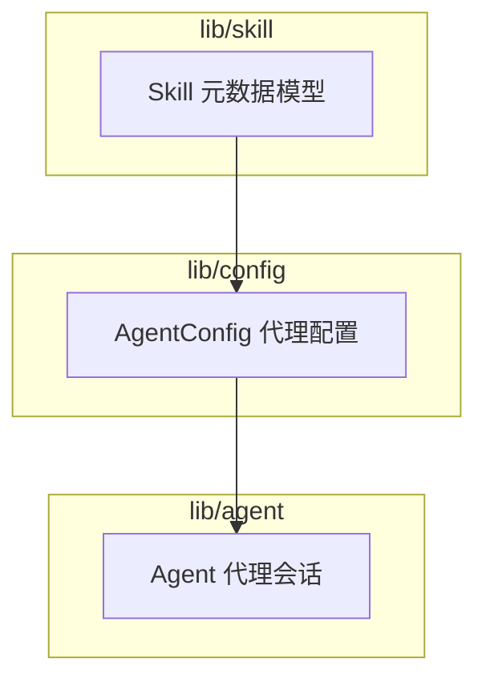
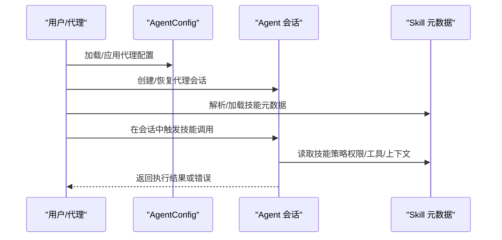
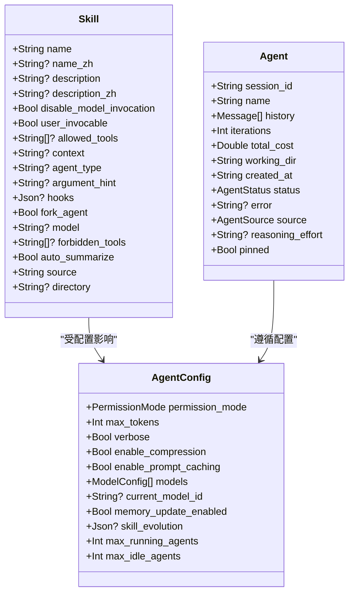
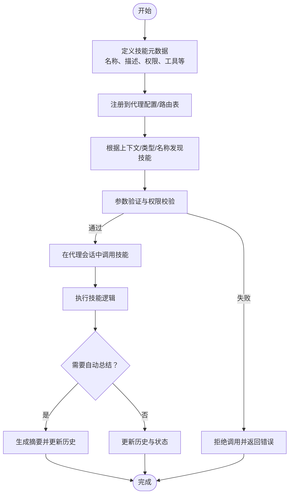
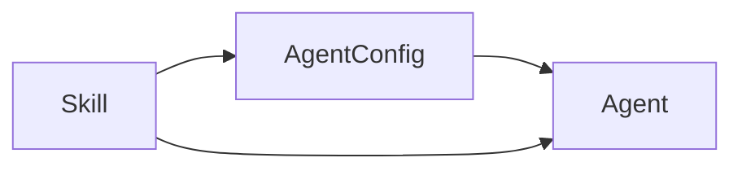

# 技能系统

<cite>
**本文引用的文件**
- [lib/skill/skill.mbt](file://lib/skill/skill.mbt)
- [lib/config/agent.mbt](file://lib/config/agent.mbt)
- [lib/agent/agent.mbt](file://lib/agent/agent.mbt)
</cite>

## 目录
1. [简介](#简介)
2. [项目结构](#项目结构)
3. [核心组件](#核心组件)
4. [架构总览](#架构总览)
5. [详细组件分析](#详细组件分析)
6. [依赖关系分析](#依赖关系分析)
7. [性能考虑](#性能考虑)
8. [故障排查指南](#故障排查指南)
9. [结论](#结论)
10. [附录](#附录)

## 简介
本文件面向“技能系统”模块，围绕技能的元数据建模、默认配置、与代理系统的集成以及可扩展性进行系统化技术文档化。当前仓库中技能系统的核心能力以元数据模型形式呈现，用于描述技能的名称、语言本地化信息、调用权限、工具限制、上下文与钩子等属性；同时通过代理配置与代理会话对象，体现技能在运行期与代理系统的交互边界。

## 项目结构
技能系统位于 lib/skill 目录，当前仅包含技能元数据模型定义；代理系统与配置分别位于 lib/agent 与 lib/config。整体采用按领域分层的组织方式：技能元数据（lib/skill）+ 代理配置（lib/config）+ 代理会话（lib/agent）。

**图表来源**
- [lib/skill/skill.mbt:1-47](file://lib/skill/skill.mbt#L1-L47)
- [lib/config/agent.mbt:1-34](file://lib/config/agent.mbt#L1-L34)
- [lib/agent/agent.mbt:1-40](file://lib/agent/agent.mbt#L1-L40)

**章节来源**
- [lib/skill/skill.mbt:1-47](file://lib/skill/skill.mbt#L1-L47)
- [lib/config/agent.mbt:1-34](file://lib/config/agent.mbt#L1-L34)
- [lib/agent/agent.mbt:1-40](file://lib/agent/agent.mbt#L1-L40)

## 核心组件
- 技能元数据模型 Skill
  - 字段覆盖：标识与本地化（名称、中文名、描述、中文描述）、调用控制（是否禁用模型调用、是否允许用户调用）、工具约束（允许工具列表、禁止工具列表）、上下文与代理类型、参数提示、钩子、是否派生新代理、模型选择、自动总结、来源与目录等。
  - 默认构造函数提供合理的缺省值，便于快速构建技能实例。
- 代理配置 AgentConfig
  - 关键字段：权限模式、最大令牌数、是否启用压缩与提示缓存、模型列表、当前模型 ID、是否启用记忆更新、技能演进 JSON、最大运行/空闲代理数等。
  - 提供默认配置工厂方法，便于初始化。
- 代理会话 Agent
  - 关键字段：会话 ID、名称、历史消息数组、迭代次数、总成本、工作目录、创建时间、状态、错误信息、来源、推理强度、是否置顶等。
  - 提供新建代理的工厂方法，便于启动新的会话。

**章节来源**
- [lib/skill/skill.mbt:1-47](file://lib/skill/skill.mbt#L1-L47)
- [lib/config/agent.mbt:1-34](file://lib/config/agent.mbt#L1-L34)
- [lib/agent/agent.mbt:1-40](file://lib/agent/agent.mbt#L1-L40)

## 架构总览
技能系统与代理系统的交互边界体现在以下方面：
- 技能元数据由外部来源解析后注入到 Skill 实例，作为后续调用策略与安全控制的依据。
- 代理配置决定运行期的权限、资源与并发策略，影响技能的可用性与执行环境。
- 代理会话承载对话历史与执行上下文，技能调用通常发生在会话语境下。

**图表来源**
- [lib/config/agent.mbt:1-34](file://lib/config/agent.mbt#L1-L34)
- [lib/agent/agent.mbt:1-40](file://lib/agent/agent.mbt#L1-L40)
- [lib/skill/skill.mbt:1-47](file://lib/skill/skill.mbt#L1-L47)

## 详细组件分析

### 技能元数据模型（Skill）
- 设计理念
  - 以结构化元数据描述技能的“行为与边界”，支持多语言本地化、调用控制、工具约束、上下文与钩子等扩展点。
  - 通过默认构造函数提供合理缺省，降低使用门槛。
- 关键字段与用途
  - 标识与描述：name、name_zh、description、description_zh，用于展示与本地化。
  - 调用控制：disable_model_invocation（是否禁用模型调用）、user_invocable（是否允许用户直接调用）。
  - 工具约束：allowed_tools、forbidden_tools，用于细粒度的工具访问控制。
  - 上下文与代理：context、agent_type、fork_agent，用于指定执行上下文与是否派生新代理。
  - 模型与总结：model、auto_summarize，用于选择模型与自动摘要。
  - 钩子与参数：hooks、argument_hint，用于扩展与参数提示。
  - 来源与目录：source、directory，用于定位与归档。
- 执行控制与上下文管理
  - 调用控制与工具约束可用于在代理执行前进行前置校验，避免越权或不合规操作。
  - 上下文与代理类型可指导代理在调用时选择合适的执行环境或派生新的代理实例。
- 生命周期要点
  - 定义：由外部来源解析生成 Skill 实例。
  - 注册：在代理配置或路由表中登记技能元数据。
  - 发现：通过名称、上下文或代理类型等维度进行匹配。
  - 调用：结合 AgentConfig 的权限与并发策略，执行技能并返回结果。
  - 销毁：代理会话结束或资源回收时释放相关状态。

**图表来源**
- [lib/skill/skill.mbt:1-47](file://lib/skill/skill.mbt#L1-L47)
- [lib/config/agent.mbt:1-34](file://lib/config/agent.mbt#L1-L34)
- [lib/agent/agent.mbt:1-40](file://lib/agent/agent.mbt#L1-L40)

**章节来源**
- [lib/skill/skill.mbt:1-47](file://lib/skill/skill.mbt#L1-L47)

### 代理配置（AgentConfig）
- 设计要点
  - 将运行期策略集中于配置对象，便于热更新与环境差异化。
  - 提供默认工厂方法，确保最小可用配置。
- 与技能的关系
  - permission_mode、max_running_agents、max_idle_agents 等直接影响技能的并发与权限。
  - skill_evolution 可用于动态演进技能行为或策略。
- 参数验证与结果处理建议
  - 在应用配置前进行范围与一致性校验（如 max_running_agents 与 max_idle_agents 的大小关系）。
  - 对 models 列表进行唯一性与格式校验，确保 current_model_id 存在。

**章节来源**
- [lib/config/agent.mbt:1-34](file://lib/config/agent.mbt#L1-L34)

### 代理会话（Agent）
- 设计要点
  - 以会话为中心承载历史与状态，便于技能调用时复用上下文。
  - 提供新建工厂方法，简化初始化流程。
- 与技能的关系
  - 技能调用通常发生在会话内，history 与 working_dir 等字段可作为技能执行的输入或工作区。
  - status 与 error 字段可用于记录技能调用的执行状态与异常。

**章节来源**
- [lib/agent/agent.mbt:1-40](file://lib/agent/agent.mbt#L1-L40)

### 技能注册、发现与调用流程（概念性）
以下流程图展示技能从定义到执行的典型路径，具体实现需结合外部解析器与代理调度器：

[本图为概念性流程，无需图表来源]

## 依赖关系分析
- 组件耦合
  - Skill 与 AgentConfig：技能的行为受配置影响（如权限、并发、模型选择）。
  - Agent 与 AgentConfig：代理的运行策略由配置决定。
- 外部依赖
  - 技能元数据通常来源于外部文件（例如 YAML 前言），解析后注入 Skill。
  - 代理配置来源于 TOML 文件与环境变量，解析后注入 AgentConfig。
- 潜在风险
  - 配置与元数据的不一致可能导致调用被拒绝或执行异常。
  - 并发配置不当可能引发资源争用或代理堆积。

**图表来源**
- [lib/config/agent.mbt:1-34](file://lib/config/agent.mbt#L1-L34)
- [lib/agent/agent.mbt:1-40](file://lib/agent/agent.mbt#L1-L40)
- [lib/skill/skill.mbt:1-47](file://lib/skill/skill.mbt#L1-L47)

**章节来源**
- [lib/config/agent.mbt:1-34](file://lib/config/agent.mbt#L1-L34)
- [lib/agent/agent.mbt:1-40](file://lib/agent/agent.mbt#L1-L40)
- [lib/skill/skill.mbt:1-47](file://lib/skill/skill.mbt#L1-L47)

## 性能考虑
- 并发控制
  - 合理设置 max_running_agents 与 max_idle_agents，避免过度并发导致资源耗尽。
  - 对高开销技能启用队列或限流，必要时使用 fork_agent 派生独立代理实例。
- 资源管理
  - working_dir 与历史消息应定期清理，防止内存膨胀。
  - auto_summarize 可减少长历史带来的计算与存储成本。
- 配置优化
  - enable_compression 与 enable_prompt_caching 在大模型场景下可显著降低延迟与成本。
  - current_model_id 应与技能需求匹配，避免不必要的模型切换。

[本节为通用性能建议，无需章节来源]

## 故障排查指南
- 常见问题
  - 技能无法调用：检查 user_invocable、disable_model_invocation、allowed_tools/forbidden_tools 是否与当前配置冲突。
  - 并发超限：检查 max_running_agents 与实际负载，适当调整。
  - 结果异常：查看 Agent.error 与历史消息，确认技能执行状态。
- 排查步骤
  - 校验 AgentConfig 的字段范围与一致性。
  - 校验 Skill 的工具与上下文约束是否满足当前会话。
  - 观察代理状态与错误信息，定位失败环节。

**章节来源**
- [lib/config/agent.mbt:1-34](file://lib/config/agent.mbt#L1-L34)
- [lib/agent/agent.mbt:1-40](file://lib/agent/agent.mbt#L1-L40)
- [lib/skill/skill.mbt:1-47](file://lib/skill/skill.mbt#L1-L47)

## 结论
技能系统以元数据模型为核心，提供了清晰的扩展点与控制面（权限、工具、上下文、钩子等）。通过与代理配置和代理会话的协同，形成从定义、注册、发现到调用与销毁的完整生命周期闭环。建议在实际工程中完善外部解析器与调度器，补齐注册、发现与调用的具体实现，并结合本文的性能与故障排查建议持续优化。

[本节为总结性内容，无需章节来源]

## 附录
- 自定义技能开发指引（步骤级）
  - 定义技能元数据：确定名称、描述、本地化信息、调用权限、工具约束、上下文与钩子等。
  - 生成默认实例：使用默认构造函数快速获得基础配置。
  - 注册与发现：将技能元数据纳入代理配置或路由表，以便按上下文/类型/名称发现。
  - 参数验证与结果处理：在调用前进行参数与权限校验，执行后根据是否自动总结更新历史。
  - 错误处理：记录 Agent.error，结合历史消息定位问题。
  - 性能优化：根据业务特征调整并发与资源策略，必要时启用派生代理与自动摘要。

[本节为实践指引，无需章节来源]